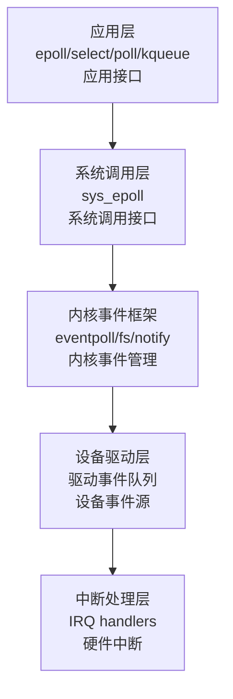

# 附录B：应用层事件机制

### 应用层面的程序注册事件、响应事件是异步的吗？

**答案：是的，应用层的事件机制本质上是异步的。**

#### 应用层事件模型的异步特性

**事件驱动编程模型：**

```c
// 典型的应用层事件注册（以 epoll 为例）
int epoll_fd = epoll_create1(0);
struct epoll_event event;
event.events = EPOLLIN;  // 注册可读事件
event.data.fd = socket_fd;
epoll_ctl(epoll_fd, EPOLL_CTL_ADD, socket_fd, &event);

// 事件循环（异步等待）
while (1) {
    int nfds = epoll_wait(epoll_fd, events, MAX_EVENTS, -1);
    for (int i = 0; i < nfds; i++) {
        // 响应事件（异步回调）
        handle_event(events[i]);
    }
}
```

**异步特性体现在：**

1. **非阻塞等待**：
   - 应用调用 `epoll_wait()`、`select()`、`poll()` 时，**不会阻塞等待特定事件**
   - 而是**注册感兴趣的事件**，然后**异步等待**这些事件的发生
   - 当事件发生时，操作系统**异步通知**应用程序

2. **事件回调机制**：
   - 应用注册事件处理器（回调函数）
   - 当事件发生时，操作系统**异步触发**回调
   - 应用代码的执行流程是**事件驱动的**，而非顺序执行

3. **并发处理能力**：
   - 单个线程可以同时等待多个事件源（文件描述符、信号、定时器等）
   - 事件发生时，应用**异步响应**，无需轮询

#### 同步 vs 异步对比

**同步模型（阻塞式）：**
```c
// 同步阻塞：必须等待数据到达
char buffer[1024];
int n = read(socket_fd, buffer, sizeof(buffer));  // 阻塞直到数据到达
process_data(buffer, n);
```

**异步模型（事件驱动）：**
```c
// 异步非阻塞：注册事件，继续执行其他任务
epoll_ctl(epoll_fd, EPOLL_CTL_ADD, socket_fd, &event);
// ... 可以继续执行其他代码 ...
epoll_wait(epoll_fd, events, MAX_EVENTS, -1);  // 异步等待，事件到达时返回
```

### 操作系统层面如何实现事件机制？

操作系统通过**多层次的抽象**实现事件机制，从底层硬件中断到上层应用接口。

#### 事件机制的层次架构



#### 内核事件机制实现（以 epoll 为例）

**核心数据结构：**

```c
// linux/fs/eventpoll.c
struct eventpoll {
    struct rb_root rbr;              // 红黑树：管理所有注册的文件描述符
    struct list_head rdllist;        // 就绪列表：存储已就绪的事件
    wait_queue_head_t wq;            // 等待队列：epoll_wait() 的等待队列
    struct file *file;               // 关联的文件对象
};

struct epitem {
    struct rb_node rbn;              // 红黑树节点
    struct list_head rdllink;        // 就绪列表节点
    struct epoll_filefd ffd;         // 文件描述符信息
    struct eventpoll *ep;            // 所属的 eventpoll
    struct epoll_event event;        // 用户注册的事件
};
```

**事件注册流程：**

```
1. 应用调用 epoll_ctl(EPOLL_CTL_ADD, fd, event)
   ↓
2. 内核创建 epitem，插入 eventpoll 的红黑树
   ↓
3. 调用文件操作表的 poll() 方法（如 socket 的 sock_poll()）
   ↓
4. 将当前进程加入文件的等待队列（wait_queue）
   ↓
5. 注册完成，应用继续执行（非阻塞）
```

**事件通知流程：**

```
1. 硬件中断发生（如网络数据到达）
   ↓
2. 中断处理程序处理硬件事件
   ↓
3. 设备驱动调用 wake_up() 唤醒等待队列
   ↓
4. 内核检查文件的就绪状态
   ↓
5. 如果就绪，将 epitem 加入 eventpoll 的 rdllist
   ↓
6. 唤醒在 epoll_wait() 中等待的进程
   ↓
7. 应用从 epoll_wait() 返回，获取就绪事件列表
```

**关键代码路径：**

```c
// linux/fs/eventpoll.c:ep_poll_callback()
// 当文件描述符就绪时，内核调用此回调
static int ep_poll_callback(wait_queue_entry_t *wait, unsigned mode, int sync, void *key)
{
    struct epitem *epi = ep_item_from_wait(wait);
    struct eventpoll *ep = epi->ep;
    
    // 将事件加入就绪列表
    if (!ep_is_linked(&epi->rdllink))
        list_add_tail(&epi->rdllink, &ep->rdllist);
    
    // 唤醒等待的进程
    if (waitqueue_active(&ep->wq))
        wake_up(&ep->wq);
    
    return 1;
}
```

#### 其他事件机制实现

**信号（Signal）：**
- 内核维护进程的信号位图（`task_struct->pending`）
- 信号到达时设置对应位，进程从内核态返回用户态时检查并处理信号
- 实现位置：`linux/kernel/signal.c`

**文件系统事件（inotify）：**
- 内核维护文件系统的监控列表
- 文件系统操作触发事件，内核通知监控进程
- 实现位置：`linux/fs/notify/inotify/`

**定时器事件：**
- 基于硬件定时器中断（IRQ0）
- 内核维护定时器队列，中断处理程序检查并触发到期定时器
- 实现位置：`linux/kernel/time/`

> **相关文档**：关于 Linux 内核中断处理机制（Top Half 和 Bottom Half）的详细说明，请参见 [Linux 内核中断处理：Top Half 和 Bottom Half](LINUX_INTERRUPT_HANDLING.md)。  
> 关于中断向量号的详细说明，请参见 [中断处理详解](INTERRUPT_HANDLING.md#中断向量号ivtidt-索引)。

## 中断向量号（IVT/IDT 索引）

**中断向量号是 CPU 层面的编号，用于查找中断处理程序：**

**重要：x86 架构总共有 256 个中断向量号（0-255）**

- **IVT（实模式）**：256 个条目（0-255），每个条目 4 字节
- **IDT（保护模式/长模式）**：256 个条目（0-255），每个条目 8 字节（32位）或 16 字节（64位）

| 向量号范围 | 用途 | 说明 | 数量 |
|-----------|------|------|------|
| **0-31** | CPU 异常 | CPU 硬件固定（如向量 0=除零，向量 14=页错误） | 32 个 |
| **0x08-0x0F** | 硬件中断（IRQ0-7） | **可配置**：由 PIC 的 ICW2 决定 | 8 个 |
| **0x70-0x77** | 硬件中断（IRQ8-15） | **可配置**：由 PIC 的 ICW2 决定 | 8 个 |
| **0x10, 0x16** 等 | 软件中断 | **可配置**：由 BIOS/操作系统决定 | 可变 |
| **其他（0x20-0x6F, 0x78-0xFF）** | 保留/未使用 | 可用于软件中断或其他用途 | 可变 |

**总计：256 个中断向量号（0x00-0xFF）**

**中断向量号的特点：**

1. **部分固定，部分可配置**：
   - **CPU 异常向量（0-31）**：CPU 硬件固定，不能更改
   - **硬件中断向量（0x08-0x0F, 0x70-0x77）**：**可配置**，由 PIC 的 ICW2 决定
   - **软件中断向量（0x10+）**：**可配置**，由 BIOS/操作系统决定

2. **PIC 重映射**：
   ```c
   // BIOS 配置：IRQ0-7 → 向量 0x08-0x0F
   // 内核配置：IRQ0-7 → 向量 0x20-0x27
   ```
   - IRQ 编号不变（IRQ1 仍然是 IRQ1）
   - 但可以映射到不同的向量号（0x09 或 0x21）
