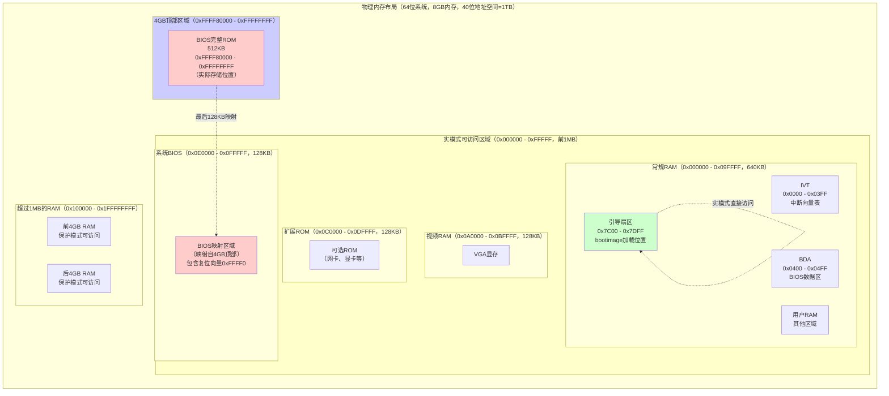

# BIOS 运行模式与内存访问详解

本文档详细解释 BIOS 的运行模式（实模式和保护模式）、内存布局、地址映射等核心概念，这些是理解 BIOS 工作原理的基础。

## BIOS 运行模式与内存访问详解

本节详细解释 BIOS 的运行模式（实模式和保护模式）、内存布局、地址映射等核心概念，这些是理解 BIOS 工作原理的基础。

### 实模式（Real Mode）与保护模式（Protected Mode）详解

**实模式（Real Mode）**

实模式是 x86 CPU 的默认启动模式，也是最早的 x86 架构（8086/8088）的工作模式。

**特点：**

1. **16 位地址空间**
   - 使用段地址（Segment）和偏移地址（Offset）的组合
   - 物理地址 = 段地址 × 16 + 偏移地址
   - 例如：`0x07C0:0x0000` = `0x07C0 × 16 + 0x0000` = `0x7C00`
   - 最大可访问地址：`0xFFFF:0xFFFF` = `0x10FFEF`（约 1MB + 64KB）

2. **直接访问物理内存**
   - 没有内存保护机制
   - 任何程序都可以访问任何内存地址
   - 没有权限检查，没有虚拟内存

3. **中断向量表（IVT）**
   - 固定位置：`0x0000:0000` 到 `0x0000:03FF`（1024 字节）
   - 每个中断向量占 4 字节（段地址 2 字节 + 偏移地址 2 字节）
   - 共 256 个中断向量（0x00 - 0xFF）

4. **单任务执行**
   - 不支持多任务
   - 不支持任务切换
   - 程序直接控制 CPU

5. **寄存器限制**
   - 16 位寄存器（AX, BX, CX, DX, SI, DI, BP, SP）
   - 段寄存器（CS, DS, ES, SS, FS, GS）
   - 标志寄存器（FLAGS）

**保护模式（Protected Mode）**

保护模式是 32 位 x86 CPU（80386 及以后）引入的工作模式，提供了内存保护、多任务等现代操作系统需要的功能。

**特点：**

1. **32 位地址空间**
   - 可以访问 4GB 的线性地址空间（`0x00000000` - `0xFFFFFFFF`）
   - 使用段选择子和偏移地址
   - 通过段描述符表（GDT/LDT）进行地址转换

2. **内存保护机制**
   - **段级保护**：通过段描述符设置访问权限（读/写/执行）
   - **页级保护**：通过页表设置页面权限（读/写/执行）
   - **特权级（Ring）**：Ring 0（内核）、Ring 1-2（驱动）、Ring 3（用户程序）
   - **权限检查**：CPU 硬件自动检查访问权限

3. **中断描述符表（IDT）**
   - 位置由 IDTR 寄存器指定（不固定）
   - 每个中断描述符占 8 字节（包含段选择子、偏移地址、权限等）
   - 支持中断门、陷阱门、任务门

4. **多任务支持**
   - 支持任务切换
   - 每个任务有独立的地址空间
   - 通过任务状态段（TSS）管理任务

5. **虚拟内存**
   - 支持分页机制
   - 可以将虚拟地址映射到物理地址
   - 支持页面交换（swap）

**实模式 vs 保护模式对比：**

| 特性 | 实模式（Real Mode） | 保护模式（Protected Mode） |
|------|-------------------|---------------------------|
| **地址空间** | 1MB（16 位） | 4GB（32 位） |
| **地址计算** | 段地址 × 16 + 偏移 | 段选择子 → 段描述符 → 线性地址 |
| **内存保护** | ❌ 无 | ✅ 有（段级 + 页级） |
| **特权级** | ❌ 无 | ✅ 有（Ring 0-3） |
| **中断表** | IVT（固定位置） | IDT（可配置位置） |
| **多任务** | ❌ 不支持 | ✅ 支持 |
| **虚拟内存** | ❌ 不支持 | ✅ 支持（分页） |
| **寄存器** | 16 位 | 32 位 |
| **使用场景** | BIOS、引导程序 | 现代操作系统 |

**模式切换：**

1. **实模式 → 保护模式**
   ```asm
   ; 1. 设置 GDT（全局描述符表）
   lgdt [gdt_descriptor]
   
   ; 2. 设置 CR0 寄存器的 PE 位（Protection Enable）
   mov eax, cr0
   or eax, 1
   mov cr0, eax
   
   ; 3. 远跳转到保护模式代码
   jmp 0x08:protected_mode_code
   ```
   
   **`0x08` 的含义：段选择子（Segment Selector）**
   
   `0x08` 是保护模式下的**段选择子**，不是实模式的段地址。
   
   **段选择子的结构（16位）：**
   ```
   Bit 15-3: 索引（Index）- 指向GDT中的描述符
   Bit 2:    TI（Table Indicator）- 0=GDT, 1=LDT
   Bit 1-0:  RPL（Requested Privilege Level）- 特权级（0-3）
   ```
   
   **`0x08` 的解析：**
   - **二进制**：`0000 0000 0000 1000`
   - **索引**：`0x08 / 8 = 1`（每个描述符占8字节）
   - **TI**：`0`（使用GDT）
   - **RPL**：`0`（Ring 0，最高特权级）
   - **含义**：指向GDT中的第1个描述符（索引1），通常是代码段描述符
   
   **为什么是索引1？**
   
   GDT的结构通常是：
   ```
   GDT[0]: 空描述符（NULL descriptor，必须为0）
   GDT[1]: 代码段描述符（Code segment descriptor）
   GDT[2]: 数据段描述符（Data segment descriptor）
   ...
   ```
   
   - 索引0是空描述符，不能使用
   - 索引1通常是代码段描述符（32位，可执行，Ring 0）
   - 所以 `0x08`（索引1）指向代码段
   
   **段选择子 vs 实模式段地址：**
   
   | 特性 | 实模式段地址 | 保护模式段选择子 |
   |------|------------|----------------|
   | **格式** | 16位段地址（如 `0x07C0`） | 16位选择子（如 `0x08`） |
   | **含义** | 段基址 = 段地址 × 16 | 索引GDT/LDT中的描述符 |
   | **计算** | 物理地址 = 段地址 × 16 + 偏移 | 线性地址 = 段描述符基址 + 偏移 |
   | **示例** | `0x07C0:0x0000` = `0x7C00` | `0x08:offset` = 通过GDT[1]计算 |
   
   **完整的GDT示例：**
   ```asm
   gdt:
       ; 索引0：空描述符（必须为0）
       dd 0x00000000
       dd 0x00000000
       
       ; 索引1：32位代码段（0x08）
       dw 0xFFFF      ; 段界限（低16位）
       dw 0x0000      ; 段基址（低16位）
       db 0x00        ; 段基址（中8位）
       db 0x9A        ; 访问权限：可执行、可读、Ring 0
       db 0xCF        ; 标志：32位，粒度4KB
       db 0x00        ; 段基址（高8位）
       
       ; 索引2：32位数据段（0x10）
       dw 0xFFFF
       dw 0x0000
       db 0x00
       db 0x92        ; 访问权限：可读写、Ring 0
       db 0xCF
       db 0x00
   
   gdt_descriptor:
       dw gdt_end - gdt - 1  ; GDT大小
       dd gdt                ; GDT地址
   gdt_end:
   ```
   
   在这个例子中：
   - `0x08` = 索引1 = 代码段描述符
   - `0x10` = 索引2 = 数据段描述符

2. **保护模式 → 实模式**
   ```asm
   ; 1. 清除 CR0 寄存器的 PE 位
   mov eax, cr0
   and eax, 0xFFFFFFFE
   mov cr0, eax
   
   ; 2. 远跳转到实模式代码
   jmp 0x0000:real_mode_code
   ```

**实模式地址与物理内存的映射关系：**

**关键问题：实模式运行时的地址对应物理内存的哪部分？**

**答案：实模式下的地址（0x000000 - 0xFFFFF）直接对应物理内存的前1MB，这是硬件层面的直接映射。**

**详细映射关系：**

1. **实模式地址空间（0x000000 - 0xFFFFF）**
   ```
   实模式地址范围：0x000000 - 0xFFFFF（1MB）
   
   地址映射：
   - 0x000000 - 0x09FFFF：常规RAM（约640KB）
     └─ 包括：IVT、BDA、用户程序、引导扇区（0x7C00）等
   - 0x0A0000 - 0x0BFFFF：视频RAM（128KB）
     └─ VGA显存区域
   - 0x0C0000 - 0x0DFFFF：扩展BIOS ROM（128KB）
     └─ 可选ROM（如网卡、显卡的ROM）
   - 0x0E0000 - 0x0EFFFF：系统BIOS扩展（64KB）
     └─ 未使用或保留
   - 0x0F0000 - 0x0FFFFF：系统BIOS（64KB）
     └─ BIOS的最后64KB，包含复位向量（0xFFFF0）
   ```

2. **物理内存的直接映射**
   - **实模式地址 = 物理地址**（在前1MB范围内）
   - 例如：实模式地址 `0x7C00` = 物理地址 `0x7C00`
   - 例如：实模式地址 `0xFFFF0` = 物理地址 `0xFFFF0`
   - **没有地址转换**：实模式下CPU直接使用物理地址

3. **BIOS ROM的特殊映射**
   ```
   BIOS完整存储位置：0xFFFF80000 - 0xFFFFFFFF（4GB顶部，512KB示例）
   
   但最后128KB同时映射到实模式可访问区域：
   - 0x0E0000 - 0x0FFFFF：映射到BIOS ROM的最后128KB
   
   这样设计的原因：
   - CPU复位后从0xFFFF0开始执行（实模式可访问）
   - BIOS代码需要能在实模式下访问
   - 通过硬件地址解码实现双重映射
   
   **QEMU源代码实现：**
   
   在QEMU的 `target/i386/cpu.c` 文件中，`x86_cpu_reset_hold()` 函数设置了CPU复位后的初始状态：
   
   ```c
   // QEMU 源代码：target/i386/cpu.c:9130-9149
   static void x86_cpu_reset_hold(Object *obj, ResetType type)
   {
       CPUX86State *env = &cpu->env;
       
       // ... 其他初始化代码 ...
       
       // 设置CS段寄存器：段选择子=0xF000，基址=0xFFFF0000，界限=0xFFFF
       cpu_x86_load_seg_cache(env, R_CS, 0xf000, 0xffff0000, 0xffff,
                              DESC_P_MASK | DESC_S_MASK | DESC_CS_MASK |
                              DESC_R_MASK | DESC_A_MASK);
       
       // 设置EIP寄存器为0xFFF0
       env->eip = 0xfff0;
       
       // ... 其他初始化代码 ...
   }
   ```
   
   **关键点：**
   - **CS = 0xF000**：段选择子（实模式下，段地址 = 0xF000）
   - **EIP = 0xFFF0**：指令指针
   - **实际执行地址**：`CS × 16 + EIP = 0xF000 × 16 + 0xFFF0 = 0xF0000 + 0xFFF0 = 0xFFFF0`
   - 这符合x86架构规范：CPU复位后从 `0xFFFF0` 开始执行
   ```

4. **引导扇区的加载位置**
   ```
   引导扇区加载到：0x7C00（实模式地址）
   
   这对应物理内存的：
   - 物理地址：0x7C00
   - 位于前1MB的常规RAM区域
   - 实模式下可以直接访问
   ```

**实际内存布局示例：**

假设系统有8GB物理内存，BIOS是512KB：

```
物理内存布局（64位系统，40位物理地址空间 = 1TB）：

0x0000000000000000 - 0x000000000009FFFF (640KB)
├─ 常规RAM
├─ IVT (0x0000 - 0x03FF)
├─ BDA (0x0400 - 0x04FF)
└─ 引导扇区 (0x7C00 - 0x7DFF)

0x00000000000A0000 - 0x00000000000BFFFF (128KB)
└─ 视频RAM

0x00000000000C0000 - 0x00000000000DFFFF (128KB)
└─ 扩展BIOS ROM

0x00000000000E0000 - 0x00000000000FFFFF (128KB)
└─ 系统BIOS（映射自4GB顶部的BIOS ROM）

0x0000000000100000 - 0x0000000001FFFFFF (前4GB RAM)
└─ 常规RAM（保护模式可访问）

0x0000000002000000 - 0x000000001FFFFFFFF (后4GB RAM)
└─ 超过4GB的RAM（保护模式可访问）

0x00000000FFFF80000 - 0x00000000FFFFFFFF (512KB)
└─ BIOS完整ROM（4GB顶部）
```

**实模式访问的限制：**

1. **只能访问前1MB**
   - 实模式地址范围：`0x000000` - `0xFFFFF`
   - 对应物理内存：前1MB
   - 超过1MB的物理内存：实模式下无法直接访问

2. **A20地址线的影响**
   - 8086/8088：20位地址总线，最大地址 `0xFFFFF`
   - 80286+：21位地址总线，最大地址 `0x10FFEF`（需要A20使能）
   - A20未使能时：地址 `0x100000` 会回绕到 `0x000000`

3. **地址回绕（Address Wraparound）**
   ```
   实模式地址计算：
   0xFFFF:0x0010 = 0xFFFF0 + 0x0010 = 0x100000
   
   如果A20未使能：
   0x100000 → 回绕到 0x000000
   
   如果A20已使能：
   0x100000 → 实际访问 0x100000（但超出实模式范围）
   ```

**物理内存布局可视化：**



**关键说明：**

1. **BIOS的双重存在**
   - **完整BIOS**：存储在4GB顶部（`0xFFFF80000 - 0xFFFFFFFF`），这是实际的Flash ROM位置
   - **BIOS映射**：最后128KB映射到实模式可访问的 `0xE0000 - 0xFFFFF`
   - **为什么需要映射**：CPU复位后从 `0xFFFF0` 开始执行，必须在实模式可访问范围内

2. **实模式1MB区域在物理内存中的实际位置**

   **关键答案：实模式的1MB中，前896KB（0x000000 - 0xDFFFF）对应物理内存的最开始896KB，这是真正的DRAM芯片。**

   **详细说明：**
   
   - **0x000000 - 0xDFFFF（896KB）**：
     - **位置**：物理内存的最开始896KB
     - **类型**：真正的DRAM（动态随机存取存储器）
     - **对应关系**：实模式地址 = 物理地址（直接对应）
     - **包含内容**：
       - **常规RAM（0x000000 - 0x09FFFF，640KB）**：物理RAM的最开始640KB
         - IVT、BDA、引导扇区（0x7C00）、用户程序
       - **视频RAM（0x0A0000 - 0x0BFFFF，128KB）**：VGA显存（硬件映射到显卡）
       - **扩展ROM（0x0C0000 - 0x0DFFFF，128KB）**：可选ROM（硬件映射到扩展卡）
   
   - **0xE0000 - 0xFFFFF（128KB）**：
     - **位置**：**不是物理RAM，是BIOS ROM的映射**
     - **类型**：BIOS Flash ROM的映射区域
     - **实际存储位置**：4GB顶部（`0xFFFF80000 - 0xFFFFFFFF`）
     - **映射方式**：通过硬件地址解码器映射到前1MB
     - **包含内容**：系统BIOS的最后128KB，包含复位向量（0xFFFF0）

   > **关于"4GB顶部"的详细解释，请参见 [2.2.3 问题 2：为什么 BIOS 存储在 4GB 地址空间顶部？](#223-问题-2为什么-bios-存储在-4gb-地址空间顶部)**

### BIOS 内存布局与地址映射

#### 为什么BIOS映射到实模式内存空间只有128KB，其他的部分如何访问执行？

**答案：只有最后128KB映射到实模式是为了满足CPU复位后的启动需求。BIOS的其他部分通过切换到保护模式来访问，或者通过特殊的内存访问宏来访问。**

**为什么只有128KB映射到实模式？**

1. **CPU复位后的启动需求**
   
   > **关于实模式地址与物理内存映射关系的详细说明，请参见 [2.1 实模式地址与物理内存的映射关系](#实模式地址与物理内存的映射关系)**
   
   **关键问题：CPU复位后从 `0xFFFFFFF0` 开始执行，这是保护模式吗？**
   
   **答案：不是。CPU复位后默认进入实模式（Real Mode），但地址 `0xFFFFFFF0` 需要特殊解释。**
   
   **简要说明：**
   
   - **CPU复位后的状态**：
     - **运行模式**：实模式（Real Mode）
     - **EIP寄存器**：初始化为 `0xFFFFFFF0`（32位值）
     - **地址总线**：20位（实模式限制）
     - **实际访问地址**：`0xFFFFF0`（20位地址，1MB - 16字节）
   
   - **地址转换机制**：
     ```
     32位地址空间表示：0xFFFFFFF0
     ↓
     实模式下地址总线只有20位
     ↓
     实际访问地址：0xFFFFF0（低20位）
     ↓
     段地址表示：0xF000:0xFFF0
     0xF000 × 16 + 0xFFF0 = 0xF0000 + 0xFFF0 = 0xFFFFF0
     ```
   
   - **为什么是实模式？**
     - CPU复位后**默认进入实模式**，这是x86架构的硬件约定
     - 实模式是CPU的初始状态，不需要任何配置
     - 保护模式需要软件配置（设置GDT、设置CR0等）
     - 因此CPU复位后**必须是实模式**
   
   - **这个地址必须在实模式可访问的范围内（前1MB）**
   - 因此需要将BIOS的最后128KB映射到 `0xE0000 - 0xFFFFF`
   - 这128KB包含了复位向量（`0xFFFF0`）和关键的启动代码

   **UEFI 是否也是这样加载的？**
   
   **答案：部分相同，但有重要区别。UEFI在CPU复位后也从实模式开始，但会很快切换到保护模式/长模式。**
   
   **UEFI 启动流程：**
   
   1. **CPU复位阶段（与传统BIOS相同）**
      - CPU复位后默认进入**实模式**
      - EIP寄存器初始化为 `0xFFFFFFF0`
      - 实际访问地址：`0xFFFFF0`（实模式，20位地址总线）
      - 从复位向量开始执行UEFI固件的启动代码
   
   2. **SEC阶段（Security Phase，安全初始化）**
      - UEFI的第一个阶段，负责最基础的初始化
      - **仍然在实模式下运行**（初始阶段）
      - 执行关键的硬件初始化
      - **快速切换到保护模式/长模式**
   
   3. **PEI阶段（Pre-EFI Initialization）**
      - UEFI的第二个阶段
      - **在保护模式或长模式下运行**
      - 初始化内存控制器、CPU等
      - 准备DXE阶段的环境
   
   4. **DXE阶段（Driver Execution Environment）**
      - UEFI的第三个阶段
      - **完全在保护模式/长模式下运行**
      - 加载和执行UEFI驱动程序
      - 初始化EFI Boot Services
   
   **UEFI vs 传统BIOS的启动对比：**
   
   | 特性 | 传统BIOS | UEFI |
   |------|---------|------|
   | **CPU复位后** | 实模式，从0xFFFFF0开始 | 实模式，从0xFFFFF0开始（相同） |
   | **初始阶段** | 主要在实模式下运行 | 实模式（SEC阶段） |
   | **运行模式** | 主要在实模式，部分切换到保护模式 | 很快切换到保护模式/长模式 |
   | **固件存储** | Flash ROM，映射到4GB顶部 | Flash ROM，映射到4GB顶部（相同） |
   | **地址映射** | 最后128KB映射到0xE0000-0xFFFFF | 类似，但可能不同（取决于实现） |
   | **服务接口** | 中断服务（INT指令） | EFI服务（函数调用） |
   | **内存管理** | 实模式限制（1MB） | 保护模式/长模式（4GB+） |
   
   **关键区别：**
   
   1. **启动地址相同**：
      - 两者都从 `0xFFFFF0`（实模式）或 `0xFFFFFFF0`（32位地址空间）开始执行
      - CPU复位后都默认进入实模式
   
   2. **运行模式不同**：
      - **传统BIOS**：主要在实模式下运行，提供实模式中断服务
      - **UEFI**：很快切换到保护模式/长模式，完全在保护模式下运行
   
   3. **固件组织不同**：
      - **传统BIOS**：代码主要在映射的128KB中，通过模式切换访问完整代码
      - **UEFI**：固件更大（2MB-16MB+），在保护模式下可以直接访问完整固件
   
   4. **服务接口不同**：
      - **传统BIOS**：使用中断服务（INT 10h, INT 13h等）
      - **UEFI**：使用EFI服务（函数调用，通过EFI_SYSTEM_TABLE）
   
   **UEFI启动的详细流程：**
   ```
   1. CPU复位
      ↓
   2. 实模式，从0xFFFFF0开始执行（与传统BIOS相同）
      ↓
   3. SEC阶段（Security Phase）
      - 实模式下执行
      - 基础硬件初始化
      - 切换到保护模式/长模式
      ↓
   4. PEI阶段（Pre-EFI Initialization）
      - 保护模式/长模式下执行
      - 内存控制器初始化
      - CPU初始化
      ↓
   5. DXE阶段（Driver Execution Environment）
      - 保护模式/长模式下执行
      - 加载UEFI驱动程序
      - 初始化EFI Boot Services
      ↓
   6. BDS阶段（Boot Device Selection）
      - 保护模式/长模式下执行
      - 选择引导设备
      - 加载操作系统
   ```
   
   **总结：**
   
   - **UEFI在CPU复位后也从实模式开始**，与传统BIOS相同
   - **但UEFI会很快切换到保护模式/长模式**，与传统BIOS主要在实模式下运行不同
   - **UEFI固件存储在类似位置**（Flash ROM，映射到地址空间顶部）
   - **UEFI使用不同的服务接口**（EFI服务而非中断服务）

2. **实模式地址空间限制**
   - 实模式只能访问前1MB（`0x000000 - 0xFFFFF`）
   - 前1MB中已经分配了：
     - 常规RAM（640KB）：`0x000000 - 0x09FFFF`
     - 视频RAM（128KB）：`0x0A0000 - 0x0BFFFF`
     - 扩展ROM（128KB）：`0x0C0000 - 0x0DFFFF`
   - 只剩下 `0x0E0000 - 0x0FFFFF`（128KB）可以映射BIOS

3. **设计权衡**
   - 128KB足够包含复位向量和关键的启动代码
   - 完整的BIOS代码（如512KB）不需要全部映射到实模式
   - 通过模式切换可以访问完整的BIOS代码

**BIOS其他部分如何访问执行？**

1. **切换到保护模式访问**

   **SeaBIOS的实现方式：**
   
   ```c
   // SeaBIOS 使用 VISIBLE32FLAT 宏标记保护模式代码
   VISIBLE32FLAT void handle_13(void) {
       // 这段代码在保护模式下执行
       // 可以访问完整的4GB地址空间
       // 包括BIOS的完整代码（0xFFFF80000 - 0xFFFFFFFF）
   }
   ```
   
   **访问流程：**
   ```
   1. CPU复位 → 实模式 → 从0xFFFF0开始执行（映射的128KB）
   2. 执行启动代码 → 切换到保护模式
   3. 保护模式下 → 可以访问完整的BIOS代码（4GB顶部）
   4. 执行BIOS初始化 → 访问所有BIOS代码和数据
   5. 需要处理中断时 → 切换回实模式 → 调用实模式中断处理程序
   ```

2. **BIOS代码的分段组织**

   根据SeaBIOS的文档，BIOS代码分为两部分：
   
   - **运行时代码（Runtime Code）**：
     - 位置：`0x0F0000 - 0x100000`（映射的128KB）
     - 可以在实模式下访问
     - 包含：中断处理程序、BIOS服务函数
     - 标记：`VAR16`、`VARFSEG` 等
   
   - **初始化代码（Initialization Code）**：
     - 位置：BIOS的完整区域（`0xFFFF80000 - 0xFFFFFFFF`）
     - 在保护模式（32bit flat mode）下执行
     - 包含：POST初始化、硬件检测、内存检测等
     - 标记：`VISIBLE32FLAT`

3. **内存访问宏**

   SeaBIOS使用特殊的内存访问宏来访问不同区域的代码和数据：
   
   ```c
   // 访问实模式可访问区域的变量
   GET_GLOBAL(variable)  // 访问VAR16或VARFSEG标记的变量
   
   // 访问保护模式下的变量
   // 直接使用32位指针（在保护模式下）
   
   // 访问远地址（通过段寄存器）
   GET_FARVAR(segment, offset)  // 在实模式下访问远地址
   ```

4. **模式切换机制**

   **实模式 → 保护模式：**
   ```asm
   ; 1. 设置GDT
   lgdt [gdt_descriptor]
   
   ; 2. 设置CR0的PE位
   mov eax, cr0
   or eax, 1
   mov cr0, eax
   
   ; 3. 远跳转到保护模式代码
   jmp 0x08:protected_mode_code
   ```
   
   **保护模式 → 实模式：**
   ```asm
   ; 1. 清除CR0的PE位
   mov eax, cr0
   and eax, 0xFFFFFFFE
   mov cr0, eax
   
   ; 2. 远跳转到实模式代码
   jmp 0x0000:real_mode_code
   ```

**完整的BIOS执行流程：**

```
1. CPU复位
   ↓
2. 实模式，从0xFFFF0开始执行（映射的128KB）
   ↓
3. 执行启动代码，切换到保护模式
   ↓
4. 保护模式下执行POST初始化
   - 访问完整的BIOS代码（4GB顶部）
   - 硬件检测、内存检测等
   ↓
5. 初始化完成后，切换回实模式
   ↓
6. 实模式下提供BIOS中断服务
   - 中断处理程序在映射的128KB中
   - 但可以通过call16_int()调用保护模式代码
   ↓
7. 引导加载时，可能再次切换到保护模式
   - 访问更多内存
   - 加载大型内核镜像
```

**关键总结：**

1. **只有128KB映射到实模式的原因**
   - CPU复位后必须从实模式可访问的地址开始执行
   - 前1MB中只有128KB空间可以映射BIOS
   - 这128KB包含复位向量和关键启动代码

2. **BIOS其他部分的访问方式**
   - **切换到保护模式**：可以访问完整的4GB地址空间，包括BIOS的完整代码
   - **代码分段组织**：运行时代码在映射区域，初始化代码在完整BIOS区域
   - **模式切换**：BIOS在实模式和保护模式之间快速切换

3. **设计优势**
   - **兼容性**：保持与传统实模式BIOS的兼容
   - **灵活性**：可以在保护模式下访问更多内存和执行复杂操作
   - **效率**：关键的中断处理程序在实模式下快速响应

   **物理内存布局示意：**
   
   ```mermaid
   flowchart TB
       subgraph DRAM["物理内存（DRAM芯片）"]
           direction TB
           
           subgraph Low640KB["0x000000 - 0x09FFFF (640KB)"]
               LowRAM["常规RAM<br/>- IVT (0x0000-0x03FF)<br/>- BDA (0x0400-0x04FF)<br/>- 引导扇区 (0x7C00)<br/>- 用户程序<br/>实模式可访问，真正的物理RAM"]
           end
           
           subgraph VGARAM["0x0A0000 - 0x0BFFFF (128KB)"]
               VGAMem["VGA显存<br/>实模式可访问，硬件映射到显卡"]
           end
           
           subgraph ExtROM["0x0C0000 - 0x0DFFFF (128KB)"]
               OptionROM["扩展ROM<br/>可选ROM（网卡、显卡等）<br/>实模式可访问，硬件映射"]
           end
           
           subgraph BIOSMap["0x0E0000 - 0x0FFFFF (128KB)"]
               BIOSMapped["BIOS映射区域<br/>实模式可访问<br/>不是RAM，是ROM映射<br/>实际BIOS在4GB顶部"]
           end
           
           subgraph Above1MB["0x100000 - 0xFFFFFFFF (前4GB RAM)"]
               RAM4GB["超过1MB的RAM<br/>保护模式可访问<br/>真正的物理RAM"]
           end
           
           subgraph Above4GB["0x100000000 - ... (超过4GB的RAM)"]
               RAM8GB["超过4GB的RAM<br/>保护模式可访问<br/>真正的物理RAM"]
           end
       end
       
       subgraph BIOSROM["BIOS Flash ROM（独立芯片）"]
           BIOSFull["0xFFFF80000 - 0xFFFFFFFF (512KB)<br/>BIOS实际存储位置（4GB顶部）<br/>完整BIOS代码<br/>最后128KB映射到0xE0000-0xFFFFF"]
       end
       
       BIOSFull -.->|"硬件地址解码映射"| BIOSMapped
       
       style Low640KB fill:#ccffcc
       style LowRAM fill:#ccffcc
       style VGARAM fill:#ffffcc
       style VGAMem fill:#ffffcc
       style ExtROM fill:#ffffcc
       style OptionROM fill:#ffffcc
       style BIOSMap fill:#ffcccc
       style BIOSMapped fill:#ffcccc
       style Above1MB fill:#ccccff
       style RAM4GB fill:#ccccff
       style Above4GB fill:#ccccff
       style RAM8GB fill:#ccccff
       style BIOSROM fill:#ffcccc
       style BIOSFull fill:#ffcccc
   ```

3. **引导扇区（bootimage）**
   - **加载位置**：`0x7C00`（实模式地址）
   - **对应物理内存**：`0x7C00`（物理地址）
   - **位置**：位于前1MB的常规RAM区域
   - **访问方式**：实模式下直接访问，无需地址转换

4. **地址映射关系**
   ```
   实模式地址 → 物理地址（前1MB内）
   0x0000    → 0x000000
   0x7C00    → 0x7C00（引导扇区）
   0xFFFF0   → 0xFFFF0（BIOS复位向量，映射自4GB顶部）
   
   4GB顶部地址 → 物理地址（完整BIOS）
   0xFFFF80000 → 0xFFFF80000（BIOS起始）
   0xFFFFFFFF  → 0xFFFFFFFF（BIOS结束）
   ```

**关键总结：**

1. **实模式地址与物理内存的对应关系**
   - **0x000000 - 0xDFFFF（896KB）**：直接对应物理RAM，实模式地址 = 物理地址
   - **0xE0000 - 0xFFFFF（128KB）**：BIOS映射区域，**不是真正的RAM**
     - 物理上：BIOS存储在4GB顶部（`0xFFFF80000 - 0xFFFFFFFF`）
     - 逻辑上：通过硬件地址解码映射到 `0xE0000 - 0xFFFFF`
     - **这是硬件层面的地址映射，不是软件别名**
   - 没有地址转换，CPU直接使用物理地址（但BIOS区域是硬件映射）

2. **BIOS ROM的双重映射**
   - 完整BIOS存储在4GB顶部（例如 `0xFFFF80000 - 0xFFFFFFFF`）
   - 最后128KB同时映射到实模式可访问的 `0xE0000 - 0xFFFFF`
   - 这样CPU复位后可以从 `0xFFFF0` 开始执行
   - **这是硬件层面的地址解码，不是软件别名**

3. **引导扇区的加载位置**
   - 加载到 `0x7C00`（实模式地址）
   - 对应物理内存的 `0x7C00`
   - 位于前1MB的常规RAM区域
   - **这是真正的物理RAM，不是映射**

4. **超过1MB的物理内存**
   - 实模式下无法直接访问
   - 需要切换到保护模式才能访问
   - 或者使用特殊技术（如Unreal Mode）访问

**在 BIOS 和引导过程中的使用：**

1. **BIOS 阶段**：主要在实模式下运行
   - CPU 复位后默认进入实模式
   - BIOS 初始化在实模式下执行
   - BIOS 中断服务在实模式下执行
   - **所有地址都是物理地址，直接映射到前1MB**

2. **引导程序阶段**：可能切换到保护模式
   - GRUB 等现代引导程序会切换到保护模式
   - 保护模式下可以访问更多内存
   - 便于加载大型内核镜像
   - **保护模式下使用虚拟地址，通过页表映射到物理地址**

3. **内核阶段**：完全在保护模式下运行
   - 现代操作系统（Linux、Windows）完全在保护模式下运行
   - 使用分页机制实现虚拟内存
   - 使用特权级保护内核代码
   - **虚拟地址通过页表映射到物理地址**

**长模式（Long Mode，64 位）：**

长模式是 64 位 x86 CPU（x86-64）的工作模式，是保护模式的扩展：

- **64 位地址空间**：可以访问 256TB 或更大的地址空间
- **扁平内存模型**：段寄存器基本不使用（除了 FS/GS）
- **兼容模式**：可以在长模式下运行 32 位程序
- **现代操作系统**：Linux、Windows 64 位版本都在长模式下运行

#### 问题 1：BIOS 运行在实模式吗？

**答案：是的，传统 BIOS 主要运行在实模式（Real Mode），但也有例外。**

> **关于实模式和保护模式的详细说明，请参见 [2.1 实模式（Real Mode）与保护模式（Protected Mode）详解](#21-实模式real-mode与保护模式protected-mode详解)**

**传统 BIOS 的运行模式：**

1. **主要运行在实模式**
   - CPU 启动时默认进入实模式
   - BIOS 初始化阶段在实模式下执行
   - BIOS 中断服务（INT 10h, INT 13h 等）在实模式下执行
   - 引导扇区程序也在实模式下运行

2. **例外情况**
   - 某些 BIOS 实现（包括 SeaBIOS）可能会：
     - **临时切换到保护模式**：访问更多内存或执行复杂操作
     - **使用 32 位代码段**：SeaBIOS 使用 `VISIBLE32FLAT` 宏在保护模式下执行部分代码
     - **快速切换**：在实模式和保护模式之间切换

3. **SeaBIOS 的实现**
   SeaBIOS 使用混合模式：
   ```c
   // SeaBIOS 可以在实模式和保护模式之间切换
   VISIBLE32FLAT void handle_13(void) {
       // 这段代码在保护模式下执行
       // 但通过 call16_int() 可以调用实模式代码
   }
   ```

4. **UEFI 的区别**
   - UEFI 固件运行在保护模式（32位）或长模式（64位）
   - 不使用实模式
   - 不使用传统 IVT，使用 IDT

**总结：传统 BIOS 主要运行在实模式，这是它提供 16 位中断服务的基础。**

#### 问题 2：为什么 BIOS 存储在 4GB 地址空间顶部？

**答案：这是 32 位 x86 架构的物理地址空间上限和传统设计。**

**"4GB顶部"的含义：**

**4GB顶部 = 32位地址空间的上限 = 0xFFFFFFFF**

- **4GB = 2^32 = 4,294,967,296 字节**
- **32位地址空间范围**：`0x00000000` 到 `0xFFFFFFFF`
- **4GB顶部**：指地址空间的最末尾，即 `0xFFFFFFFF` 附近
- **BIOS存储位置**：如果BIOS是512KB，则存储在 `0xFFFF80000 - 0xFFFFFFFF`
  - `0xFFFF80000` = `0xFFFFFFFF - 512KB + 1` = `0xFFFFFFFF - 0x80000 + 1`
  - `0xFFFFFFFF` = 32位地址空间的最大地址

**为什么叫"顶部"？**

- 地址空间从 `0x00000000`（底部）开始，到 `0xFFFFFFFF`（顶部）结束
- 就像一栋楼，1楼是底部，顶楼是顶部
- BIOS放在"顶部"是传统x86架构的设计约定
- CPU复位后从 `0xFFFFFFF0`（接近顶部）开始执行

**地址空间示意图：**
```
32位地址空间（4GB）：

0x00000000  ← 底部（地址空间开始）
  ↓
  ↓ 常规RAM、设备等
  ↓
0xFFFF80000 ← BIOS开始（如果BIOS是512KB）
  ↓
  ↓ BIOS代码
  ↓
0xFFFFFFFF  ← 顶部（地址空间结束，32位最大地址）
              CPU复位后从这里开始执行（0xFFFFFFF0）
```

**历史原因：**

1. **传统 x86 架构**
   - 早期 x86 CPU 使用 32 位物理地址
   - BIOS 设计时以 32 位为标准
   - 即使现代 CPU 支持 PAE（Physical Address Extension）或 64 位，BIOS 仍按 32 位地址空间设计

2. **QEMU 的默认配置**
   - QEMU 默认模拟 32 位 x86 架构
   - 使用 4GB 物理地址空间
   - BIOS 放在地址空间顶部是传统设计

3. **兼容性考虑**
   - 保持与传统 PC 架构的兼容
   - 许多 BIOS 代码假设 32 位地址空间

**实际物理位置：**

- **在32位系统中**：4GB顶部就是物理地址 `0xFFFFFFFF` 附近
- **在64位系统中**：虽然物理地址空间更大（如40位=1TB），但BIOS仍然放在32位地址空间的顶部
  - 例如：64位系统，40位物理地址空间（1TB）
  - BIOS仍然在 `0xFFFF80000 - 0xFFFFFFFF`（32位地址空间的顶部）
  - 这是为了保持与传统32位软件的兼容性

**现代扩展：**
虽然现代 CPU 支持更大的地址空间：
- **PAE（Physical Address Extension）**：36 位地址 = 64GB
- **64 位架构**：48 位或更多地址位
但传统 BIOS 仍按 4GB 地址空间设计，以保持兼容性。

#### 问题 2.1：在更大内存的主机上，4GB 地址空间计算还适用吗？

**答案：取决于系统架构。32 位系统的地址空间始终是 4GB，64 位系统使用更大的地址空间。**

**关键区别：地址空间 vs 物理内存大小**

1. **地址空间是固定的，与物理内存大小无关**
   - **32 位地址空间始终是 4GB**（`0x00000000` - `0xFFFFFFFF`）
   - 这是 CPU 地址总线的限制，不是物理内存大小的限制
   - 即使物理内存有 8GB、16GB 或更多，32 位地址空间仍然是 4GB

2. **在超过 4GB 内存的机器上**

   **情况 1：32 位系统（使用 PAE）**
   ```
   物理内存：8GB（实际硬件）
   地址空间：4GB（32位限制，固定不变）
   解决方案：PAE（Physical Address Extension）
     - 36 位物理地址 = 64GB 物理内存支持
     - 但虚拟地址空间仍然是 4GB
     - 通过页表映射访问超过 4GB 的物理内存
   ```
   
   **情况 2：64 位系统**
   ```
   物理内存：8GB、16GB 或更多
   地址空间：48 位或更多（远大于 4GB）
   BIOS 位置：仍然在地址空间顶部
     - 64 位系统：BIOS 可能在 0xFFFFFFFFFFFFF000 附近
     - 但计算方式类似：地址空间顶部 - BIOS 大小
   ```

3. **BIOS 地址的计算**

   **32 位系统（4GB 地址空间）：**
   ```
   BIOS 地址 = 0x100000000 - bios_size
             = 0xFFFFFFFF - bios_size + 1
   ```
   - **即使物理内存超过 4GB，这个计算仍然适用**
   - 地址空间始终是 4GB，BIOS 仍然在地址空间顶部
   - 超过 4GB 的物理内存通过 PAE 页表映射访问
   
   **64 位系统（更大的地址空间）：**
   ```
   BIOS 地址 = 地址空间顶部 - bios_size
             = (2^48 或更大) - bios_size
   ```
   - 使用更大的地址空间基数
   - 计算方式类似，但基数不同

4. **实际例子**

   **32 位系统，8GB 物理内存：**
   - **地址空间**：4GB（固定，不因物理内存大小改变）
   - **物理内存**：8GB（实际硬件）
   - **BIOS 位置**：仍然在 `0xFFFFFFFF - bios_size`
   - **超过 4GB 的物理内存**：通过 PAE 页表映射访问
   - **结论**：4GB 地址空间的计算仍然适用

   **64 位系统，16GB 物理内存：**
   - **地址空间**：48 位（256TB）
   - **物理内存**：16GB（实际硬件）
   - **BIOS 位置**：在地址空间顶部（例如 `0xFFFFFFFFFFFFF000` 附近）
   - **计算方式**：地址空间顶部 - BIOS 大小
   - **结论**：需要使用更大的地址空间基数

**总结：**

1. **32 位地址空间始终是 4GB**，与物理内存大小无关
2. **在超过 4GB 内存的机器上**：
   - **32 位系统**：使用 PAE 访问超过 4GB 的物理内存，但地址空间仍是 4GB，BIOS 地址计算仍然适用
   - **64 位系统**：地址空间更大，BIOS 位置的计算方式类似，但使用更大的基数
3. **BIOS 地址计算**：
   - **32 位**：`0x100000000 - bios_size`（仍然适用，即使物理内存超过 4GB）
   - **64 位**：`地址空间顶部 - bios_size`（使用更大的基数）

#### 问题 2.2：QEMU 和 SeaBIOS 如何支持更大内存的虚拟机？

**答案：QEMU 支持超过 4GB 内存的虚拟机，但 BIOS 仍然放在 32 位地址空间顶部（4GB 附近）。**

**QEMU 源代码分析：**

从 QEMU 的 `hw/i386/x86-common.c` 中的 `x86_bios_rom_init()` 函数可以看到：

```c
// QEMU 源代码：hw/i386/x86-common.c:1067
x86_firmware_configure(0x100000000ULL - bios_size, ptr, bios_size);

// QEMU 源代码：hw/i386/x86-common.c:1070
ret = rom_add_file_fixed(bios_name, (uint32_t)(-bios_size), -1);

// QEMU 源代码：hw/i386/x86-common.c:1084-1086
memory_region_add_subregion(rom_memory,
                            (uint32_t)(-bios_size),  // 地址：4GB - bios_size
                            &x86ms->bios);
```

**关键发现：**

1. **BIOS 地址固定为 32 位地址空间顶部**
   - 使用 `(uint32_t)(-bios_size)` 或 `0x100000000ULL - bios_size`
   - 即使虚拟机有超过 4GB 的内存，BIOS 仍然放在 4GB 地址空间顶部
   - 这是因为传统 BIOS（如 SeaBIOS）假设 32 位地址空间

2. **QEMU 支持超过 4GB 内存的虚拟机**
   ```c
   // QEMU 源代码：hw/i386/pc.c:894-904
   if (x86ms->above_4g_mem_size > 0) {
       ram_above_4g = g_malloc(sizeof(*ram_above_4g));
       memory_region_init_alias(ram_above_4g, NULL, "ram-above-4g",
                                machine->ram,
                                x86ms->below_4g_mem_size,
                                x86ms->above_4g_mem_size);
       memory_region_add_subregion(system_memory, x86ms->above_4g_mem_start,
                                   ram_above_4g);
   }
   ```
   - QEMU 将内存分为两部分：`ram_below_4g` 和 `ram_above_4g`
   - 超过 4GB 的内存映射到 `x86ms->above_4g_mem_start` 之后
   - 但 BIOS 仍然放在 32 位地址空间顶部（4GB 附近）

3. **SeaBIOS 的内存模型限制**

   根据 SeaBIOS 的 `docs/Memory_Model.md`：

   - **32bit flat mode**：可以访问整个前 4GB 内存
   - **16bit real mode**：只能访问前 1MB 内存
   - **16bit bigreal mode**：可以访问整个前 4GB 内存（用于 option ROMs）

   SeaBIOS 文档明确说明：
   > "During the POST phase the code can fully access the first 4 gigabytes of memory."

   这意味着 SeaBIOS 主要设计用于 32 位地址空间，即使物理内存更大。

**实际运行情况：**

1. **虚拟机配置示例**：
   ```
   虚拟机内存：8GB
   地址空间布局：
   - 0x00000000 - 0xFFFFFFFF：前 4GB（包含 BIOS 在顶部）
   - 0x100000000 - 0x1FFFFFFFF：后 4GB（ram_above_4g）
   - BIOS 位置：0xFFFF80000 - 0xFFFFFFFF（仍然在 4GB 顶部）
   ```

2. **为什么这样设计**：
   - **兼容性**：传统 BIOS 代码假设 32 位地址空间
   - **标准位置**：BIOS 必须放在地址空间顶部，以便 CPU 复位后能找到
   - **实模式访问**：BIOS 的最后 128KB 映射到实模式可访问的 `0xE0000-0xFFFFF`

3. **64 位系统的处理**：
   - 如果使用 64 位 UEFI 固件（如 OVMF），固件本身运行在长模式
   - UEFI 固件可以访问更大的地址空间
   - 但传统 BIOS（SeaBIOS）仍然限制在 32 位地址空间

**结论：**

- **QEMU 支持超过 4GB 内存的虚拟机**，通过 `ram_above_4g` 映射超过 4GB 的内存
- **但 BIOS（SeaBIOS）仍然放在 32 位地址空间顶部**（4GB 附近），因为传统 BIOS 假设 32 位地址空间
- **即使物理内存更大，BIOS 地址计算仍然使用 `0x100000000 - bios_size`**
- **这是设计上的限制，不是 bug**：传统 BIOS 必须保持与 32 位地址空间的兼容性

#### 问题 2.3：64 位虚拟机如何支持 32 位内存地址？

**答案：64 位 CPU 有更大的物理地址空间，但前 4GB 仍然映射到 32 位地址空间（0x00000000 - 0xFFFFFFFF），通过内存别名机制实现。**

**64 位 CPU 的物理地址空间：**

1. **物理地址位数（phys_bits）**
   - 64 位 CPU 的物理地址空间由 `phys_bits` 决定
   - 典型值：40 位（1TB）、46 位（64TB）、48 位（256TB）、52 位（4PB）
   - 最大物理地址 = `(1 << phys_bits) - 1`

2. **QEMU 源代码验证**
   ```c
   // QEMU 源代码：hw/i386/pc.c:877
   maxphysaddr = ((hwaddr)1 << cpu->phys_bits) - 1;
   ```
   - QEMU 检查最大使用的 GPA（Guest Physical Address）是否在物理地址空间范围内
   - 如果超过，会报错要求增加 `phys_bits`

**32 位地址空间的映射机制：**

1. **内存别名（Memory Alias）**
   ```c
   // QEMU 源代码：hw/i386/pc.c:889-893
   ram_below_4g = g_malloc(sizeof(*ram_below_4g));
   memory_region_init_alias(ram_below_4g, NULL, "ram-below-4g", machine->ram,
                           0, x86ms->below_4g_mem_size);
   memory_region_add_subregion(system_memory, 0, ram_below_4g);
   ```
   - QEMU 使用 `memory_region_init_alias()` 创建内存别名
   - 前 4GB 内存（`ram_below_4g`）映射到地址空间 `0x00000000 - 0xFFFFFFFF`
   - 这是实际物理内存的前 4GB 的别名，不是独立的内存

2. **地址空间布局**
   ```
   64 位虚拟机的地址空间布局：
   
   0x00000000 - 0xFFFFFFFF (4GB)
   ├─ ram_below_4g（前 4GB 内存的别名）
   ├─ BIOS ROM（0xFFFF80000 - 0xFFFFFFFF）
   └─ 其他设备（PCI、IO 等）
   
   0x100000000 - 0x1FFFFFFFF (如果内存 > 4GB)
   └─ ram_above_4g（超过 4GB 的内存）
   
   0xFFFFFFFFFFFFF000 - 0xFFFFFFFFFFFFFFFF (地址空间顶部)
   └─ 可能的其他映射
   ```

3. **为什么这样设计**
   - **兼容性**：32 位软件和 BIOS 代码期望前 4GB 在 `0x00000000 - 0xFFFFFFFF`
   - **标准位置**：BIOS 必须放在地址空间顶部，以便 CPU 复位后能找到
   - **内存连续性**：前 4GB 内存连续映射，便于软件访问

**实际运行示例：**

1. **64 位虚拟机，8GB 内存，phys_bits=40（1TB 地址空间）**
   ```
   物理地址空间：0x0000000000000000 - 0x000000FFFFFFFFFF (1TB)
   
   内存映射：
   - 0x0000000000000000 - 0x00000000FFFFFFFF：前 4GB（ram_below_4g）
   - 0x0000000100000000 - 0x00000001FFFFFFFF：后 4GB（ram_above_4g）
   - 0x00000000FFFF80000 - 0x00000000FFFFFFFF：BIOS（在 32 位地址空间顶部）
   
   32 位地址空间视图：
   - 0x00000000 - 0xFFFFFFFF：前 4GB + BIOS（完全兼容 32 位软件）
   ```

2. **关键点**
   - **64 位 CPU 可以访问更大的地址空间**（由 `phys_bits` 决定）
   - **但前 4GB 仍然映射到 32 位地址空间**（`0x00000000 - 0xFFFFFFFF`）
   - **BIOS 仍然放在 32 位地址空间顶部**（`0xFFFFFFFF - bios_size`）
   - **这是通过内存别名实现的**，不是实际复制内存

**64 位 vs 32 位系统的区别：**

| 特性 | 32 位系统 | 64 位系统 |
|------|----------|----------|
| **物理地址空间** | 4GB（固定） | 由 `phys_bits` 决定（通常 40-52 位） |
| **前 4GB 映射** | 直接映射到 `0x00000000 - 0xFFFFFFFF` | 通过别名映射到 `0x00000000 - 0xFFFFFFFF` |
| **超过 4GB 内存** | 不支持（或通过 PAE） | 映射到 `above_4g_mem_start` 之后 |
| **BIOS 位置** | `0xFFFFFFFF - bios_size` | `0xFFFFFFFF - bios_size`（相同） |
| **地址计算** | `0x100000000 - bios_size` | `0x100000000 - bios_size`（相同） |

**总结：**

1. **64 位虚拟机通过内存别名机制支持 32 位内存地址**
   - 前 4GB 内存通过 `memory_region_init_alias()` 映射到 32 位地址空间
   - 这是实际物理内存的别名，不是独立的内存

2. **BIOS 位置在 32 位和 64 位系统中相同**
   - 都放在 `0xFFFFFFFF - bios_size`
   - 地址计算都使用 `0x100000000 - bios_size`

3. **64 位系统的优势**
   - 可以访问更大的物理地址空间（由 `phys_bits` 决定）
   - 可以支持超过 4GB 的内存
   - 但仍然保持与 32 位软件的兼容性

#### 问题 2.4：实际硬件（64位CPU）如何支持32位内存地址？

**答案：实际硬件通过物理地址空间和内存控制器直接映射，前4GB物理内存直接映射到32位地址空间，这是硬件层面的设计，不是软件别名。**

**QEMU vs 实际硬件的区别：**

| 特性 | QEMU（软件实现） | 实际硬件 |
|------|----------------|---------|
| **地址映射方式** | 内存别名（Memory Alias） | 物理地址直接映射 |
| **实现层面** | 软件（QEMU内存管理） | 硬件（内存控制器、地址解码器） |
| **前4GB位置** | 通过别名映射到 `0x00000000 - 0xFFFFFFFF` | 物理上就在 `0x00000000 - 0xFFFFFFFF` |
| **BIOS ROM** | 软件模拟的ROM区域 | 实际的Flash ROM芯片 |

**实际硬件的物理地址空间：**

1. **64位CPU的物理地址总线**
   - 现代64位CPU的物理地址总线通常为 **40-52位**
   - 例如：Intel Core i7 支持40位物理地址（1TB）
   - AMD Ryzen 支持48位物理地址（256TB）
   - 最大物理地址 = `(1 << 物理地址位数) - 1`

2. **物理内存的直接映射**
   ```
   实际硬件的内存布局：
   
   物理地址空间：0x0000000000000000 - 0x000000FFFFFFFFFF (假设40位，1TB)
   
   内存映射（硬件层面）：
   - 0x0000000000000000 - 0x00000000FFFFFFFF：前4GB物理内存
     └─ 这是实际的DRAM芯片，直接连接到内存控制器
   - 0x00000000FFFF80000 - 0x00000000FFFFFFFF：BIOS Flash ROM
     └─ 这是实际的Flash ROM芯片，通过内存映射I/O访问
   - 0x0000000100000000 - 0x00000001FFFFFFFF：超过4GB的物理内存
     └─ 如果系统有超过4GB内存，继续映射
   ```

3. **内存控制器的作用**
   - **地址解码**：内存控制器根据物理地址决定访问哪个设备
   - **地址范围**：
     - `0x00000000 - 0xFFFFFFFF`：映射到DRAM（前4GB）
     - `0xFFFF80000 - 0xFFFFFFFF`：映射到BIOS Flash ROM
     - `0x100000000` 以上：映射到超过4GB的DRAM（如果存在）
   - **硬件实现**：通过地址解码逻辑电路实现，不是软件

**BIOS ROM在硬件上的实际位置：**

1. **Flash ROM芯片的物理连接**
   - BIOS存储在主板上的 **Flash ROM芯片**（如SPI Flash、EEPROM）
   - 通过 **内存映射I/O（MMIO）** 连接到CPU
   - 硬件设计将Flash ROM映射到地址空间顶部（`0xFFFF80000 - 0xFFFFFFFF`）

2. **CPU复位后的行为**
   ```
   CPU复位（硬件行为）：
   1. CPU从地址 0xFFFFFFF0 开始执行（硬件固定）
   2. 这个地址被内存控制器解码为BIOS Flash ROM
   3. CPU直接从Flash ROM读取指令并执行
   4. 这是硬件层面的行为，不需要软件参与
   ```

3. **为什么BIOS必须在地址空间顶部**
   - **硬件约定**：x86 CPU复位后固定从 `0xFFFFFFF0` 开始执行
   - **地址解码**：内存控制器必须将这个地址映射到BIOS Flash ROM
   - **标准设计**：所有x86系统都遵循这个约定

**32位地址空间的硬件支持：**

1. **兼容模式（Compatibility Mode）**
   - 64位CPU的**长模式（Long Mode）**包含兼容模式
   - 允许运行32位操作系统和应用程序
   - 在兼容模式下，处理器的地址总线和寄存器被限制为32位
   - 但物理地址空间仍然是64位的（由CPU硬件决定）

2. **物理地址扩展（PAE）**
   - 32位操作系统可以启用PAE，扩展物理地址空间
   - PAE将物理地址从32位扩展到36位（支持64GB物理内存）
   - 但虚拟地址空间仍然是32位（4GB）
   - 通过页表映射访问超过4GB的物理内存

3. **内存管理单元（MMU）**
   - 64位CPU的MMU负责虚拟地址到物理地址的转换
   - 在运行32位代码时，MMU根据32位地址空间的需求映射内存
   - 前4GB虚拟地址映射到前4GB物理地址（或通过页表映射到其他物理地址）

**实际硬件示例：**

1. **64位系统，16GB物理内存，40位物理地址空间（1TB）**
   ```
   物理地址空间：0x0000000000000000 - 0x000000FFFFFFFFFF (1TB)
   
   硬件内存映射：
   - 0x0000000000000000 - 0x00000000FFFFFFFF：前4GB DRAM
     └─ 硬件直接映射，内存控制器解码
   - 0x00000000FFFF80000 - 0x00000000FFFFFFFF：BIOS Flash ROM
     └─ 硬件映射到Flash ROM芯片
   - 0x0000000100000000 - 0x00000003FFFFFFFF：后12GB DRAM
     └─ 硬件直接映射，内存控制器解码
   
   32位软件视图：
   - 0x00000000 - 0xFFFFFFFF：前4GB（直接访问物理内存）
   - 超过4GB的内存：通过PAE页表映射访问
   ```

2. **关键点**
   - **硬件层面**：前4GB物理内存就在 `0x00000000 - 0xFFFFFFFF`，不是别名
   - **BIOS ROM**：实际的Flash ROM芯片，硬件映射到地址空间顶部
   - **地址解码**：由内存控制器和地址解码器硬件实现
   - **兼容性**：硬件设计保证32位软件可以访问前4GB

**QEMU软件实现 vs 实际硬件的对比：**

| 方面 | QEMU（软件） | 实际硬件 |
|------|------------|---------|
| **前4GB映射** | 通过 `memory_region_init_alias()` 创建别名 | 物理内存直接映射，硬件地址解码 |
| **BIOS存储** | 文件系统中的 `bios.bin` 文件 | 主板上的Flash ROM芯片 |
| **地址解码** | QEMU软件模拟 | 内存控制器硬件电路 |
| **内存访问** | QEMU进程管理 | CPU直接访问DRAM |
| **实现复杂度** | 软件层抽象 | 硬件电路实现 |

**总结：**

1. **实际硬件通过物理地址空间直接映射支持32位内存地址**
   - 前4GB物理内存硬件上就在 `0x00000000 - 0xFFFFFFFF`
   - 这是硬件设计，不是软件别名

2. **BIOS ROM在硬件上的实际位置**
   - 存储在主板上的Flash ROM芯片
   - 硬件映射到地址空间顶部（`0xFFFF80000 - 0xFFFFFFFF`）
   - CPU复位后直接从Flash ROM读取指令

3. **64位CPU的兼容性支持**
   - 通过兼容模式运行32位软件
   - 物理地址空间是64位的，但32位软件只能访问前4GB
   - 超过4GB的内存通过PAE页表映射访问

4. **QEMU vs 实际硬件**
   - QEMU使用软件别名模拟硬件行为
   - 实际硬件通过物理地址直接映射
   - 两者在功能上等效，但实现方式不同

#### 问题 3：地址 `0x100000000ULL - bios_size` 是实模式吗？

**答案：不是。这个地址是物理地址，不是运行模式。**

**地址空间说明：**
- `0x100000000ULL` = 4GB = 2^32
- `0x100000000ULL - bios_size` = 4GB 减去 BIOS 大小
- 例如：如果 BIOS 是 512KB，地址 = `0x100000000 - 0x80000 = 0xFFFF80000`

**实模式的地址限制：**
- 实模式只能直接访问 **1MB**（`0x000000` - `0xFFFFF`）
- 这个地址（4GB 附近）超出了实模式的直接访问范围

**关键点：**

1. **存储位置 vs 运行模式**
   - 这是 BIOS 的**存储位置**（物理地址）
   - BIOS 代码**运行在实模式**
   - 存储位置和运行模式是两回事

2. **地址映射机制**
   ```
   完整 BIOS（例如 512KB）
   存储在：0xFFFF80000 - 0xFFFFFFFF（4GB 顶部）
   
   最后 128KB 映射到实模式可访问区域：
   0xE0000 - 0xFFFFF（实模式 ISA 空间）
   
   CPU 复位后从 0xFFFF0 开始执行（实模式可访问）
   ```

3. **为什么这样设计**
   - BIOS 完整代码存储在 4GB 地址空间顶部
   - 最后 128KB 同时映射到实模式可访问的 ISA 空间
   - CPU 复位后从 `0xFFFF0` 开始执行（在实模式下）

#### 问题 4：BIOS 可以访问所有物理地址吗？

**答案：取决于运行模式。在实模式下有限制，在保护模式下可以访问更大空间。**

**实模式下的限制：**
- 在实模式下，BIOS 只能访问：
  - **1MB 以下的内存**：`0x000000` - `0xFFFFF`
  - **原因**：实模式使用 16 位段地址和 16 位偏移地址
  - **最大地址** = `0xFFFF:0xFFFF` = `0x10FFEF`（需要 A20 地址线）

**保护模式下的能力：**
BIOS 可以切换到保护模式来访问更大的地址空间：

1. **SeaBIOS 的实现**
   ```c
   // SeaBIOS 可以在保护模式下执行代码
   VISIBLE32FLAT void handle_13(void) {
       // 这段代码在保护模式下执行
       // 可以访问 4GB 地址空间
   }
   ```

2. **访问能力**
   - **32 位保护模式**：可以访问 4GB（`0x00000000` - `0xFFFFFFFF`）
   - **64 位长模式**：可以访问更大的地址空间（如果 CPU 支持）

**实际访问情况对比：**

| 运行模式 | 可访问地址范围 | 说明 |
|---------|--------------|------|
| **实模式** | 0x000000 - 0xFFFFF（1MB） | 传统 BIOS 主要工作模式 |
| **保护模式（32位）** | 0x00000000 - 0xFFFFFFFF（4GB） | SeaBIOS 可以在保护模式下执行 |
| **长模式（64位）** | 更大（取决于 CPU） | 现代 BIOS/UEFI 支持 |

**关键点总结：**

1. **BIOS 代码本身可以存储在 4GB 地址空间顶部**
   - 存储位置：`0xFFFF80000` - `0xFFFFFFFF`（如果 BIOS 是 512KB）
   - 这是物理地址，不是运行模式

2. **BIOS 执行时的访问能力**
   - **实模式**：只能访问 1MB 以下
   - **保护模式**：可以访问 4GB
   - SeaBIOS 使用混合模式：在保护模式下执行部分代码，但仍提供实模式中断服务

3. **地址映射机制**
   ```
   完整 BIOS（512KB）存储在：0xFFFF80000 - 0xFFFFFFFF
   ↓
   最后 128KB 映射到实模式可访问区域：0xE0000 - 0xFFFFF
   ↓
   CPU 复位后从 0xFFFF0 开始执行（实模式）
   ```

#### 问题 5：BIOS 自身有尺寸限制吗？

**答案：有，但限制因实现而异。**

**QEMU/SeaBIOS 的限制：**

从代码中可以看到：
```c
// 步骤 3: 验证 BIOS 文件大小（必须大于 0 且是 64KB 的倍数）
if (bios_size <= 0 ||
    (bios_size % 65536) != 0) {
    goto bios_error;
}
```

**限制：**
- 必须是 **64KB（65536 字节）的倍数**
- 必须大于 0

**传统 BIOS 的典型限制：**

| BIOS 类型 | 典型大小 | 限制原因 |
|----------|---------|---------|
| **传统 BIOS** | 64KB - 512KB | ROM 芯片容量限制 |
| **现代 BIOS** | 512KB - 2MB | Flash ROM 容量 |
| **UEFI 固件** | 2MB - 16MB+ | 更大的 Flash 容量 |

**SeaBIOS 的实际大小：**
- **典型大小**：128KB - 512KB
- **常见大小**：256KB 或 512KB
- 可以更大，但受以下因素限制：
  - ROM 芯片容量
  - 内存映射空间
  - 兼容性考虑

**为什么必须是 64KB 的倍数？**

1. **内存对齐**：便于内存管理和映射
2. **硬件限制**：ROM 芯片通常按 64KB 块组织
3. **兼容性**：符合传统 BIOS 的设计规范

### QEMU 软件实现 vs. 真实硬件加载 BIOS 的区别

QEMU 的 `x86_bios_rom_init()` 函数通过软件模拟 BIOS 的加载过程，与真实硬件存在显著差异。理解这些差异有助于更好地理解虚拟化的工作原理。

#### 存储介质差异

- **存储介质**
  - **真实硬件**: Flash ROM 芯片（如 SPI Flash、EEPROM）
  - **QEMU 软件实现**: 文件系统中的二进制文件（`bios.bin`）

- **物理位置**
  - **真实硬件**: 主板上的专用 ROM 芯片
  - **QEMU 软件实现**: 宿主机文件系统（如 `/usr/share/qemu/bios.bin`）

- **持久性**
  - **真实硬件**: 断电后内容保持不变
  - **QEMU 软件实现**: 文件内容由文件系统管理

- **访问方式**
  - **真实硬件**: CPU 通过内存映射 I/O 直接读取
  - **QEMU 软件实现**: QEMU 进程读取文件，写入模拟内存

**真实硬件示例：**
```
主板 Flash ROM 芯片
    ↓
CPU 内存控制器
    ↓
内存映射到 0xF0000-0xFFFFF
    ↓
CPU 直接从 ROM 读取指令
```

**QEMU 实现：**
```
宿主机文件系统：bios.bin
    ↓
QEMU 进程：read() 系统调用读取文件
    ↓
QEMU 内存管理：memory_region_init_ram()
    ↓
模拟内存映射到客户机 0xF0000-0xFFFFF
    ↓
客户机 CPU 从模拟内存读取（实际是 QEMU 管理的 RAM）
```

#### 加载时机和方式

**真实硬件：**
- **加载时机**：BIOS 代码永久存储在 ROM 芯片中，无需"加载"
- **加载方式**：CPU 复位后，内存控制器自动将 ROM 内容映射到内存地址空间
- **过程**：
  1. 系统加电
  2. CPU 复位，程序计数器（PC）指向 `0xFFFF0`
  3. 内存控制器将 ROM 芯片映射到 `0xF0000-0xFFFFF`
  4. CPU 直接从 ROM 读取并执行指令（**无需复制到 RAM**）

**QEMU 软件实现：**
- **加载时机**：QEMU 启动时，在创建虚拟机之前
- **加载方式**：QEMU 进程读取 BIOS 文件，写入模拟的 RAM 内存区域
- **过程**：
  1. QEMU 启动，调用 `x86_bios_rom_init()`
  2. 查找 BIOS 文件（`bios.bin`）
  3. 读取文件内容到 QEMU 进程内存
  4. 创建内存区域（`memory_region_init_ram()`）
  5. 将文件内容复制到模拟内存（`rom_add_file_fixed()` 或 `load_image_size()`）
  6. 映射到客户机地址空间 `0xF0000-0xFFFFF`

**关键代码分析：**

```c
// QEMU 需要显式读取文件并复制到内存
if (sev_enabled() || is_tdx_vm()) {
    void *ptr = memory_region_get_ram_ptr(&x86ms->bios);
    load_image_size(filename, ptr, bios_size);  // 从文件读取并复制
    x86_firmware_configure(0x100000000ULL - bios_size, ptr, bios_size);
} else {
    // 注册为 ROM，在复位时重新加载
    ret = rom_add_file_fixed(bios_name, (uint32_t)(-bios_size), -1);
}
```

#### 内存映射机制

**真实硬件：**
- **ROM 芯片**：物理上连接到内存总线，通过**内存映射 I/O（MMIO）**访问
- **只读特性**：硬件层面只读，CPU 无法修改 ROM 内容
- **地址映射**：由芯片组（Chipset）的**内存控制器**硬件实现
- **映射关系**：ROM 芯片的物理内容直接映射到内存地址，**无需 RAM 参与**

```
物理 ROM 芯片（Flash）
    ↓ [硬件连接]
内存控制器（Chipset）
    ↓ [地址解码]
CPU 地址空间 0xF0000-0xFFFFF
    ↓
CPU 读取指令（直接从 ROM 芯片）
```

**QEMU 实现：**
- **模拟 RAM**：BIOS 内容存储在 QEMU 管理的**普通 RAM** 中（虽然是"ROM"区域）
- **只读模拟**：通过 `memory_region_set_readonly()` **软件模拟**只读特性
- **地址映射**：由 QEMU 的**内存管理子系统**软件实现
- **映射关系**：QEMU 维护地址到内存区域的映射表，客户机访问时由 QEMU 处理

```c
// QEMU 创建可读写的 RAM 区域（虽然模拟 ROM）
memory_region_init_ram(&x86ms->bios, NULL, "pc.bios", bios_size, &error_fatal);

// 然后软件模拟只读特性
memory_region_set_readonly(&x86ms->bios, !isapc_ram_fw);
```

```
宿主机 RAM（QEMU 进程内存）
    ↓ [软件管理]
QEMU MemoryRegion 对象
    ↓ [地址映射表]
客户机地址空间 0xF0000-0xFFFFF
    ↓
客户机 CPU 访问（触发 QEMU 内存访问处理）
```

#### 复位（Reset）行为

**真实硬件：**
- **ROM 内容不变**：复位时 ROM 芯片内容保持不变
- **无需重新加载**：CPU 复位后直接访问 ROM，内容始终可用
- **硬件保证**：ROM 芯片是**非易失性存储**，断电后内容仍保留

**QEMU 实现：**
- **需要重新加载**：复位时，如果使用 `rom_add_file_fixed()`，QEMU 会重新从文件加载
- **文件依赖**：BIOS 内容依赖于文件系统上的 `bios.bin` 文件
- **软件模拟**：通过 `rom_add_file_fixed()` 注册，复位时自动重新加载

```c
// 普通环境：注册为 ROM，支持复位时重新加载
ret = rom_add_file_fixed(bios_name, (uint32_t)(-bios_size), -1);
// ↑ 这个调用会注册一个回调，在复位时重新加载文件
```

**特殊环境（SEV/TDX）：**
```c
// 机密计算环境：不支持复位，直接加载
if (sev_enabled() || is_tdx_vm()) {
    // 直接加载文件，不复位时重新加载
    load_image_size(filename, ptr, bios_size);
}
```

#### 性能和开销

- **访问速度**
  - **真实硬件**: 直接从 ROM 读取（较慢，但稳定）
  - **QEMU 实现**: 从 RAM 读取（较快，但有软件层开销）

- **启动开销**
  - **真实硬件**: 无加载开销（ROM 已就绪）
  - **QEMU 实现**: 需要读取文件、分配内存、复制数据

- **内存占用**
  - **真实硬件**: ROM 不占用系统 RAM
  - **QEMU 实现**: BIOS 内容占用 QEMU 进程内存（RAM）

- **可修改性**
  - **真实硬件**: 需要专用工具刷写 ROM
  - **QEMU 实现**: 直接修改文件即可（但需要重启 QEMU）

#### 可配置性和灵活性

**真实硬件：**
- **固定内容**：BIOS 内容在制造时或用户刷写时确定
- **修改困难**：需要专用工具（如编程器）或 BIOS 更新程序
- **版本固定**：一旦刷写，版本固定直到下次更新

**QEMU 实现：**
- **灵活配置**：可以通过命令行参数指定不同的 BIOS 文件
- **易于修改**：直接替换 `bios.bin` 文件即可
- **多版本支持**：可以为不同虚拟机使用不同的 BIOS 版本

```bash
# QEMU 可以指定不同的 BIOS 文件
qemu-system-x86_64 -bios custom_bios.bin
```

#### 安全性考虑

**真实硬件：**
- **物理保护**：ROM 芯片物理上只读，难以被恶意软件修改
- **硬件信任根**：BIOS 作为系统信任根，由硬件保证完整性

**QEMU 实现：**
- **文件系统安全**：依赖宿主机文件系统权限保护 BIOS 文件
- **内存保护**：通过软件模拟只读，但可能被 QEMU 内部代码修改
- **安全增强**：支持 SEV/TDX 等机密计算技术，提供额外保护

```c
// SEV/TDX 环境：额外的安全配置
if (is_tdx_vm()) {
    tdx_set_tdvf_region(&x86ms->bios);  // TDX 特殊安全配置
}
```

#### 总结对比表

- **存储**
  - **真实硬件**: Flash ROM 芯片
  - **QEMU 软件实现**: 文件系统中的二进制文件

- **加载方式**
  - **真实硬件**: 硬件自动映射，无需加载
  - **QEMU 软件实现**: 软件读取文件并复制到 RAM

- **内存类型**
  - **真实硬件**: 物理 ROM（非易失性）
  - **QEMU 软件实现**: 模拟 RAM（易失性，但标记为只读）

- **复位行为**
  - **真实硬件**: ROM 内容不变
  - **QEMU 软件实现**: 可配置重新加载或保持不变

- **访问路径**
  - **真实硬件**: CPU → 内存控制器 → ROM 芯片
  - **QEMU 软件实现**: 客户机 CPU → QEMU 内存管理 → 宿主机 RAM

- **修改方式**
  - **真实硬件**: 需要专用工具刷写
  - **QEMU 软件实现**: 直接修改文件

- **性能**
  - **真实硬件**: ROM 读取较慢但稳定
  - **QEMU 软件实现**: RAM 读取快但有软件开销

- **灵活性**
  - **真实硬件**: 固定内容
  - **QEMU 软件实现**: 可配置不同 BIOS 文件

**核心区别总结：**

1. **真实硬件**：BIOS 存储在**物理 ROM 芯片**中，CPU 通过**硬件内存映射**直接访问，内容**永久存储**，复位时**无需重新加载**。

2. **QEMU 实现**：BIOS 存储在**文件系统**中，QEMU 在启动时**读取文件**并复制到**模拟的 RAM 内存**，通过**软件内存管理**模拟 ROM 行为，复位时可选择**重新加载文件**。

---
