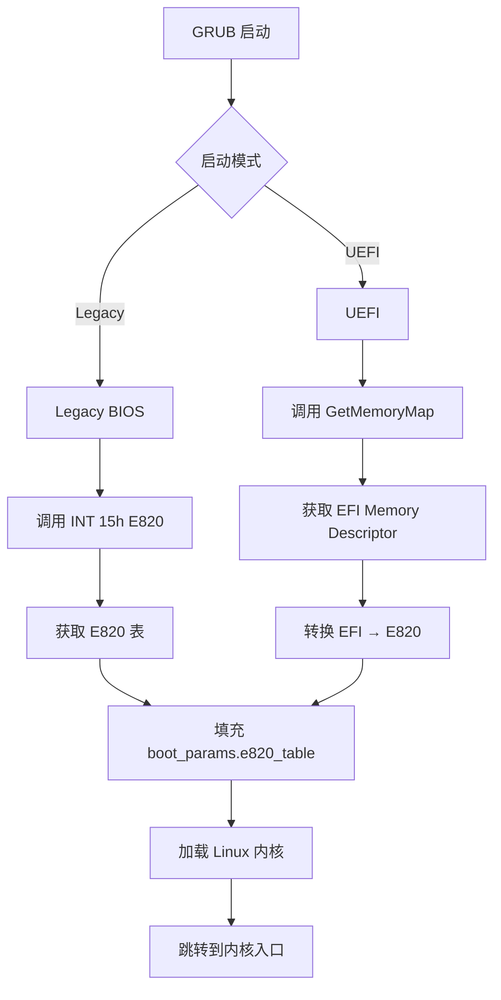
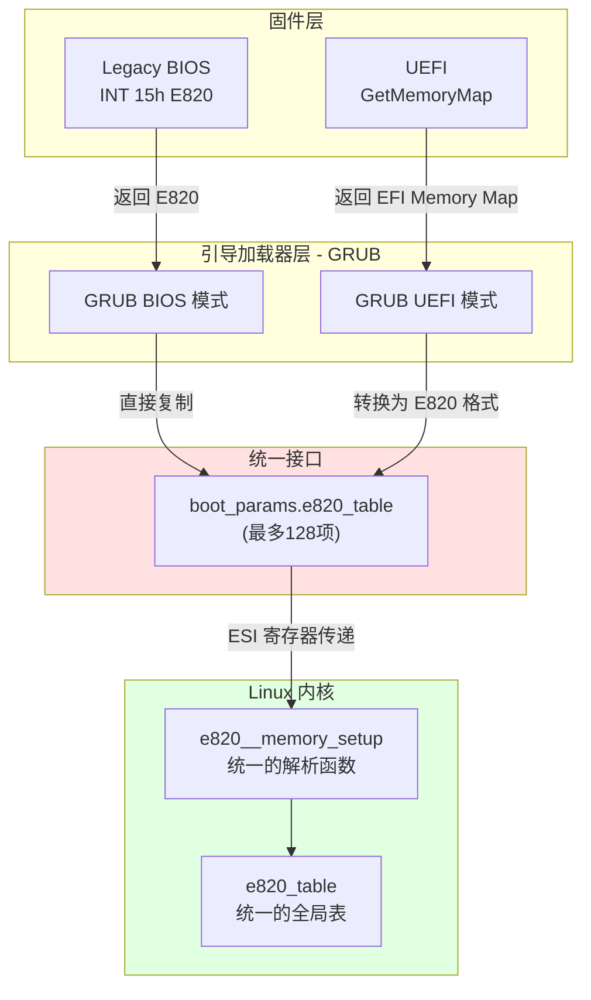

# 引导加载器内存信息传递详解

## 文档定位

本文档详细说明**引导加载器（GRUB）如何将内存映射信息传递给 Linux 内核**。

**主题**：
- GRUB 在 Legacy BIOS 模式下如何读取 E820 表
- GRUB 在 UEFI 模式下如何调用 GetMemoryMap()
- UEFI GetMemoryMap() 的 EDK2 实现
- EFI 内存类型与 E820 类型的映射
- 统一接口设计：boot_params.e820_table
- 内核接收逻辑的统一性

**读者对象**：
- 想了解 GRUB 内部实现的开发者
- 对 UEFI 启动过程感兴趣的研究者
- 需要调试引导问题的工程师

**相关文档**：
- [SEABIOS_E820_CONSTRUCTION.md](SEABIOS_E820_CONSTRUCTION.md) - SeaBIOS 如何构建 E820 表
- [E820_MEMORY_MAP.md](E820_MEMORY_MAP.md) - E820 表的总体说明
- [Linux 内核分页机制完整指南](LINUX_PAGING_COMPLETE_GUIDE.md) - Linux 内核如何使用 E820

## 代码来源

本文档涉及**三个项目**的代码：

| 项目 | 用途 | 源码仓库 |
|------|------|---------|
| **GRUB** | 引导加载器（读取并传递内存映射） | https://git.savannah.gnu.org/git/grub.git |
| **EDK2** | UEFI 参考实现（GetMemoryMap） | https://github.com/tianocore/edk2.git |
| **Linux Kernel** | 操作系统内核（接收 E820） | https://git.kernel.org/pub/scm/linux/kernel/git/torvalds/linux.git |

所有代码片段都已标注**项目名、文件路径、函数名**。

---

## 1. GRUB 如何传递 E820 表

> **项目**: [GNU GRUB](https://www.gnu.org/software/grub/)
> **源码仓库**: https://git.savannah.gnu.org/git/grub.git

**GRUB Legacy BIOS 模式**：通过 INT 15h E820 获取 BIOS 提供的 E820 表，然后传递给 Linux 内核。

**GRUB UEFI 模式**：调用 EFI 的 `GetMemoryMap()` 服务获取内存映射，转换为 E820 格式传递给内核。

**核心实现文件**（GRUB 项目）：
- `grub-core/loader/i386/linux.c` - Linux 内核加载器
- `grub-core/mmap/i386/pc/mmap.c` - Legacy BIOS 内存映射获取
- `grub-core/loader/i386/efi/linux.c` - UEFI 模式内核加载器

### 1.1 GRUB 传递 E820 的流程



### 1.2 GRUB Legacy BIOS 模式实现

**读取 E820 表**：

> **项目**: GRUB
> **文件**: `grub-core/mmap/i386/pc/mmap.c`
> **函数**: `grub_machine_mmap_iterate()`

```c
// GRUB - grub-core/mmap/i386/pc/mmap.c
grub_err_t grub_machine_mmap_iterate(grub_memory_hook_t hook, void *hook_data)
{
    struct grub_bios_int_registers regs;
    grub_uint32_t cont = 0;

    // 循环调用 INT 15h E820，直到获取所有条目
    do {
        struct e820_entry e820_entry;

        // 设置 INT 15h E820 调用参数
        regs.eax = 0xE820;
        regs.edx = 0x534D4150;  // 'SMAP' 签名
        regs.ebx = cont;         // 延续值
        regs.ecx = sizeof(e820_entry);
        regs.es = (grub_uint32_t)&e820_entry >> 4;
        regs.di = (grub_uint32_t)&e820_entry & 0xF;

        // 调用 BIOS 中断
        grub_bios_interrupt(0x15, &regs);

        // 检查返回值
        if (regs.eax != 0x534D4150 || regs.flags & GRUB_CPU_INT_FLAGS_CARRY)
            break;

        // 调用回调函数处理 E820 条目
        hook(e820_entry.addr, e820_entry.size, e820_entry.type, hook_data);

        cont = regs.ebx;  // 下一个条目的延续值
    } while (cont != 0);  // BX=0 表示最后一项

    return GRUB_ERR_NONE;
}
```

**填充 boot_params**：

> **项目**: GRUB
> **文件**: `grub-core/loader/i386/linux.c`
> **函数**: `grub_linux_boot()`

```c
// GRUB - grub-core/loader/i386/linux.c
static grub_err_t grub_linux_boot(void)
{
    struct linux_kernel_params *params = &linux_params;

    // 清空 E820 表
    params->e820_entries = 0;

    // 遍历内存映射，填充 E820 表
    grub_mmap_iterate(fill_e820_hook, params);

    // ... 其他初始化 ...

    // 跳转到内核
    grub_relocator_boot(relocator);
}

// 填充 E820 表的回调函数
static int fill_e820_hook(grub_uint64_t addr, grub_uint64_t size,
                          grub_uint32_t type, void *data)
{
    struct linux_kernel_params *params = data;

    // 检查是否超出 E820 表容量
    if (params->e820_entries >= GRUB_E820_MAX_ENTRY)
        return 0;

    // 添加 E820 条目
    params->e820_map[params->e820_entries].addr = addr;
    params->e820_map[params->e820_entries].size = size;
    params->e820_map[params->e820_entries].type = type;
    params->e820_entries++;

    return 0;
}
```

### 1.3 GRUB UEFI 模式实现

**调用 GetMemoryMap()**：

> **项目**: GRUB
> **文件**: `grub-core/loader/i386/efi/linux.c`
> **函数**: `grub_efi_get_memory_map()`

```c
// GRUB - grub-core/loader/i386/efi/linux.c
static grub_err_t grub_linux_boot(void)
{
    grub_efi_uintn_t mmap_size = 0;
    grub_efi_uintn_t desc_size;
    grub_efi_uint32_t desc_version;
    grub_efi_memory_descriptor_t *mmap_buf = NULL;

    // 第一次调用：获取需要的缓冲区大小
    grub_efi_get_memory_map(&mmap_size, mmap_buf, NULL, &desc_size, &desc_version);

    // 分配缓冲区（稍大一些，因为调用期间可能有新分配）
    mmap_buf = grub_malloc(mmap_size + desc_size * 2);

    // 第二次调用：获取实际的内存映射
    grub_efi_get_memory_map(&mmap_size, mmap_buf, NULL, &desc_size, &desc_version);

    // 转换 EFI Memory Map → E820
    convert_efi_mmap_to_e820(mmap_buf, mmap_size, desc_size, params);

    // ... 其他初始化 ...
}
```

**EFI → E820 类型转换**：

> **项目**: GRUB
> **文件**: `grub-core/loader/i386/efi/linux.c`

```c
// GRUB - grub-core/loader/i386/efi/linux.c
static void convert_efi_mmap_to_e820(grub_efi_memory_descriptor_t *mmap_buf,
                                     grub_efi_uintn_t mmap_size,
                                     grub_efi_uintn_t desc_size,
                                     struct linux_kernel_params *params)
{
    grub_efi_memory_descriptor_t *desc;
    grub_uint64_t addr, size;
    int i = 0;

    // 遍历 EFI Memory Descriptors
    for (desc = mmap_buf;
         (grub_uint8_t *)desc < (grub_uint8_t *)mmap_buf + mmap_size;
         desc = (grub_efi_memory_descriptor_t *)((grub_uint8_t *)desc + desc_size))
    {
        addr = desc->physical_start;
        size = desc->num_pages << 12;  // 页数转字节数

        // 转换 EFI 类型到 E820 类型
        grub_uint32_t e820_type;
        switch (desc->type)
        {
            case GRUB_EFI_LOADER_CODE:
            case GRUB_EFI_LOADER_DATA:
            case GRUB_EFI_BOOT_SERVICES_CODE:
            case GRUB_EFI_BOOT_SERVICES_DATA:
            case GRUB_EFI_CONVENTIONAL_MEMORY:
                e820_type = E820_RAM;  // 可用内存
                break;

            case GRUB_EFI_ACPI_RECLAIM_MEMORY:
                e820_type = E820_ACPI;  // ACPI 可回收
                break;

            case GRUB_EFI_ACPI_MEMORY_NVS:
                e820_type = E820_NVS;  // ACPI NVS
                break;

            default:
                e820_type = E820_RESERVED;  // 保留
                break;
        }

        // 添加到 E820 表
        if (i < GRUB_E820_MAX_ENTRY) {
            params->e820_map[i].addr = addr;
            params->e820_map[i].size = size;
            params->e820_map[i].type = e820_type;
            i++;
        }
    }

    params->e820_entries = i;
}
```

---

## 2. UEFI GetMemoryMap() 实现（EDK2）

> **项目**: [EDK2](https://github.com/tianocore/edk2)
> **源码仓库**: https://github.com/tianocore/edk2.git

**UEFI 固件**不使用 E820 表，而是提供 **`GetMemoryMap()` 服务**。

### 2.1 GetMemoryMap() 函数接口

**函数原型**：

> **项目**: EDK2
> **文件**: `MdeModulePkg/Core/Dxe/Mem/Page.c`
> **函数**: `CoreGetMemoryMap()`

```c
// EDK2 - MdeModulePkg/Core/Dxe/Mem/Page.c
EFI_STATUS
EFIAPI
CoreGetMemoryMap (
  IN OUT UINTN                  *MemoryMapSize,
  IN OUT EFI_MEMORY_DESCRIPTOR  *MemoryMap,
  OUT UINTN                     *MapKey,
  OUT UINTN                     *DescriptorSize,
  OUT UINT32                    *DescriptorVersion
  )
{
  EFI_STATUS  Status;
  UINTN       Size;
  UINTN       BufferSize;
  UINTN       NumberOfEntries;
  LIST_ENTRY  *Link;
  MEMORY_MAP  *Entry;

  // 计算需要的缓冲区大小
  Size = sizeof(EFI_MEMORY_DESCRIPTOR);
  BufferSize = 0;
  NumberOfEntries = 0;

  // 遍历内存映射链表，计算条目数
  for (Link = gMemoryMap.ForwardLink; Link != &gMemoryMap; Link = Link->ForwardLink) {
    BufferSize += Size;
    NumberOfEntries++;
  }

  // 检查缓冲区是否足够大
  if (*MemoryMapSize < BufferSize) {
    *MemoryMapSize = BufferSize;
    return EFI_BUFFER_TOO_SMALL;
  }

  // 填充内存映射表
  *MemoryMapSize = BufferSize;
  *DescriptorSize = Size;
  *DescriptorVersion = EFI_MEMORY_DESCRIPTOR_VERSION;

  // 遍历并复制每个条目
  for (Link = gMemoryMap.ForwardLink; Link != &gMemoryMap; Link = Link->ForwardLink) {
    Entry = CR(Link, MEMORY_MAP, Link, MEMORY_MAP_SIGNATURE);

    MemoryMap->Type = Entry->Type;
    MemoryMap->PhysicalStart = Entry->Start;
    MemoryMap->VirtualStart = 0;
    MemoryMap->NumberOfPages = RShiftU64(Entry->End - Entry->Start + 1, EFI_PAGE_SHIFT);
    MemoryMap->Attribute = Entry->Attribute;

    MemoryMap = (EFI_MEMORY_DESCRIPTOR *)((UINT8 *)MemoryMap + Size);
  }

  // 生成唯一的 MapKey（用于 ExitBootServices）
  *MapKey = gMemoryMapKey;

  return EFI_SUCCESS;
}
```

**数据结构**：

> **项目**: EDK2
> **文件**: `MdePkg/Include/Uefi/UefiSpec.h`

```c
// EDK2 - MdePkg/Include/Uefi/UefiSpec.h
typedef struct {
  UINT32                Type;           // 内存类型
  EFI_PHYSICAL_ADDRESS  PhysicalStart;  // 物理起始地址
  EFI_VIRTUAL_ADDRESS   VirtualStart;   // 虚拟起始地址（未设置为0）
  UINT64                NumberOfPages;  // 页数（4KB 为单位）
  UINT64                Attribute;      // 属性（cacheable 等）
} EFI_MEMORY_DESCRIPTOR;
```

### 2.2 EFI 内存类型定义

**EFI 定义了 14 种内存类型**（vs E820 的 5 种）：

> **项目**: EDK2
> **文件**: `MdePkg/Include/Uefi/UefiSpec.h`

```c
// EDK2 - MdePkg/Include/Uefi/UefiSpec.h
typedef enum {
  EfiReservedMemoryType,      // 0: 保留
  EfiLoaderCode,              // 1: 引导加载器代码
  EfiLoaderData,              // 2: 引导加载器数据
  EfiBootServicesCode,        // 3: Boot Services 代码
  EfiBootServicesData,        // 4: Boot Services 数据
  EfiRuntimeServicesCode,     // 5: Runtime Services 代码（不可回收）
  EfiRuntimeServicesData,     // 6: Runtime Services 数据（不可回收）
  EfiConventionalMemory,      // 7: 可用内存
  EfiUnusableMemory,          // 8: 有错误的内存
  EfiACPIReclaimMemory,       // 9: ACPI 表（可回收）
  EfiACPIMemoryNVS,           // 10: ACPI NVS（不可回收）
  EfiMemoryMappedIO,          // 11: MMIO
  EfiMemoryMappedIOPortSpace, // 12: MMIO Port Space
  EfiPalCode,                 // 13: PAL 代码（Itanium）
  EfiMaxMemoryType
} EFI_MEMORY_TYPE;
```

**关键区别**：
- **BootServices vs RuntimeServices**：UEFI 明确区分可回收和不可回收的固件内存
- **属性位**：EFI_MEMORY_DESCRIPTOR 包含 cacheable、write-protect 等属性
- **粒度**：EFI 使用 4KB 页为单位，E820 使用字节

### 2.3 EFI vs E820 内存类型映射

| EFI 类型 | E820 类型 | 说明 | 可回收？ |
|---------|---------|------|---------|
| `EfiConventionalMemory` (7) | `E820_RAM` (1) | 可用内存 | - |
| `EfiLoaderCode` (1) | `E820_RAM` (1) | 引导加载器代码 | ✅ 是 |
| `EfiLoaderData` (2) | `E820_RAM` (1) | 引导加载器数据 | ✅ 是 |
| `EfiBootServicesCode` (3) | `E820_RAM` (1) | Boot Services 代码 | ✅ 是（ExitBootServices 后） |
| `EfiBootServicesData` (4) | `E820_RAM` (1) | Boot Services 数据 | ✅ 是（ExitBootServices 后） |
| `EfiRuntimeServicesCode` (5) | `E820_RESERVED` (2) | Runtime Services 代码 | ❌ 否 |
| `EfiRuntimeServicesData` (6) | `E820_RESERVED` (2) | Runtime Services 数据 | ❌ 否 |
| `EfiACPIReclaimMemory` (9) | `E820_ACPI` (3) | ACPI 表 | ✅ 是（读取后） |
| `EfiACPIMemoryNVS` (10) | `E820_NVS` (4) | ACPI NVS | ❌ 否 |
| `EfiUnusableMemory` (8) | `E820_RESERVED` (2) | 坏内存 | ❌ 否 |
| `EfiMemoryMappedIO` (11) | `E820_RESERVED` (2) | MMIO | ❌ 否 |
| `EfiReservedMemoryType` (0) | `E820_RESERVED` (2) | 保留 | ❌ 否 |

**转换关键**：
- ✅ **BootServices 内存可回收**：内核调用 `ExitBootServices()` 后可以使用
- ❌ **RuntimeServices 内存不可回收**：内核运行期间 UEFI 固件仍需使用
- ✅ **ACPI 表可回收**：内核读取并解析后可以释放内存
- ❌ **ACPI NVS 不可回收**：S3 休眠恢复时需要保持

---

## 3. 统一接口设计：内核接收 E820 表的逻辑是否统一？

**答：是的，完全统一**。无论是 BIOS 还是 UEFI 启动，Linux 内核接收到的都是 **E820 格式**的内存映射。

### 3.1 统一接口的设计图



### 3.2 关键设计点

| 层次 | BIOS 路径 | UEFI 路径 | 是否统一？ |
|------|----------|----------|----------|
| **固件接口** | INT 15h E820 | GetMemoryMap() | ❌ 不同 |
| **GRUB 处理** | 直接读取 E820 | 转换 EFI → E820 | ⚠️ 内部不同 |
| **传递给内核** | `boot_params.e820_table` | `boot_params.e820_table` | ✅ **统一** |
| **内核接收** | `e820__memory_setup()` | `e820__memory_setup()` | ✅ **统一** |
| **内核数据结构** | `e820_table` | `e820_table` | ✅ **统一** |

### 3.3 内核接收的统一代码路径

> **项目**: Linux Kernel
> **文件**: `arch/x86/kernel/e820.c:1354`

```c
// Linux Kernel - arch/x86/kernel/e820.c:1354
char *__init e820__memory_setup(void)
{
    // 调用统一的内存布局获取函数
    // 默认实现：e820__memory_setup_default()
    char *who = x86_init.resources.memory_setup();

    // BIOS 路径：who = "BIOS-e820"
    // UEFI 路径：who = "BIOS-e820"（但实际来自 EFI，经 GRUB 转换）

    // 拷贝到备份表（与启动方式无关）
    memcpy(&e820_table_kexec, &e820_table, sizeof(e820_table));
    memcpy(&e820_table_firmware, &e820_table, sizeof(e820_table));

    return who;
}

char *__init e820__memory_setup_default(void)
{
    char *who = "BIOS-e820";

    // 统一的数据来源：boot_params.e820_table
    int entries = boot_params.e820_entries;
    for (int i = 0; i < entries && i < E820_MAX_ENTRIES; i++) {
        struct boot_e820_entry *entry = &boot_params.e820_table[i];
        e820__range_add(entry->addr, entry->size, entry->type);
    }

    // 额外处理：如果是 EFI 启动，还会处理原始 EFI 内存映射
    if (efi_enabled(EFI_BOOT))
        e820__setup_efi();  // 从 EFI 原始信息中补充细节

    return who;
}
```

### 3.4 内核对 UEFI 的额外处理

虽然接收 E820 的逻辑统一，但内核**也保留了 EFI 原始内存映射**：

> **项目**: Linux Kernel
> **文件**: `arch/x86/platform/efi/efi.c`

```c
// Linux Kernel - arch/x86/platform/efi/efi.c
void __init efi_init(void)
{
    // 如果是 EFI 启动，保留原始 EFI 内存映射
    if (!efi_enabled(EFI_BOOT))
        return;

    // efi.memmap 保存原始的 EFI Memory Map
    efi_memmap_init_early(&boot_params.efi_info);

    // 内核同时维护两套数据：
    // 1. e820_table - 转换后的 E820 格式（用于内存管理）
    // 2. efi.memmap - 原始 EFI 格式（用于 Runtime Services）
}
```

**为什么保留 EFI 原始信息？**

| 用途 | 使用 E820 | 使用 EFI Memory Map |
|------|----------|-------------------|
| **物理内存管理** | ✅ 是 | ❌ 否 |
| **建立页表映射** | ✅ 是 | ❌ 否 |
| **EFI Runtime Services** | ❌ 否 | ✅ 是（需要精确的 EFI 类型） |
| **SetVirtualAddressMap** | ❌ 否 | ✅ 是 |
| **ACPI 表访问** | ⚠️ 部分 | ✅ 是 |

**关键点**：
- ✅ **内存管理统一**：无论 BIOS/UEFI，内核都用 `e820_table` 进行内存管理
- ✅ **接收逻辑统一**：`e820__memory_setup()` 从 `boot_params.e820_table` 读取
- ⚠️ **UEFI 特殊性**：内核额外保留 `efi.memmap`，用于 EFI Runtime Services
- ✅ **GRUB 的抽象层**：GRUB 负责将不同固件接口统一为 E820 格式

### 3.5 完整的数据流

```
【BIOS 启动】
BIOS INT 15h E820
    ↓ (返回 E820)
GRUB grub_machine_mmap_iterate()
    ↓ (直接复制)
boot_params.e820_table[]
    ↓ (ESI 寄存器)
Linux e820__memory_setup()
    ↓
e820_table (内核全局表)

【UEFI 启动】
UEFI GetMemoryMap()
    ↓ (返回 EFI_MEMORY_DESCRIPTOR[])
GRUB grub_efi_get_memory_map()
    ↓ (转换 EFI → E820)
boot_params.e820_table[]
    ↓ (ESI 寄存器)
Linux e820__memory_setup()
    ↓
e820_table (内核全局表)
    +
efi.memmap (EFI 原始映射，用于 Runtime Services)
```

---

## 4. 总结

### 4.1 关键要点

| 方面 | Legacy BIOS | UEFI |
|------|------------|------|
| **固件接口** | INT 15h E820 | GetMemoryMap() |
| **内存类型数量** | 5 种 | 14 种 |
| **GRUB 获取方式** | 调用 INT 15h | 调用 EFI 服务 |
| **GRUB 转换** | 不需要 | EFI → E820 |
| **传递给内核** | boot_params.e820_table | boot_params.e820_table |
| **内核接收** | 统一的 e820__memory_setup() | 统一的 e820__memory_setup() |
| **额外处理** | 无 | 保留 efi.memmap |

### 4.2 统一接口的价值

**✅ 优点**：
1. **简化内核实现**：内核只需处理 E820 格式，无需关心固件类型
2. **GRUB 作为适配层**：屏蔽 BIOS/UEFI 差异
3. **向后兼容**：UEFI 系统也使用经典的 E820 接口
4. **灵活性**：内核可选择性使用 EFI 原始信息（Runtime Services）

**⚠️ 注意点**：
1. **信息损失**：EFI 的 14 种类型被简化为 E820 的 5 种
2. **属性丢失**：EFI Memory Map 的属性位在 E820 中丢失
3. **双重维护**：UEFI 系统需要维护 e820_table 和 efi.memmap 两套数据

### 4.3 与其他文档的关系

- **[SEABIOS_E820_CONSTRUCTION.md](SEABIOS_E820_CONSTRUCTION.md)**：固件层如何构建 E820
- **[E820_MEMORY_MAP.md](E820_MEMORY_MAP.md)**：E820 表的总体说明和数据结构
- **[Linux 内核分页机制完整指南](LINUX_PAGING_COMPLETE_GUIDE.md)**：内核如何使用 E820

---

**本文档基于 GRUB、EDK2 和 Linux 内核源码分析整理，版本可能随项目更新而变化，以实际源码为准。**
