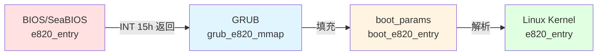
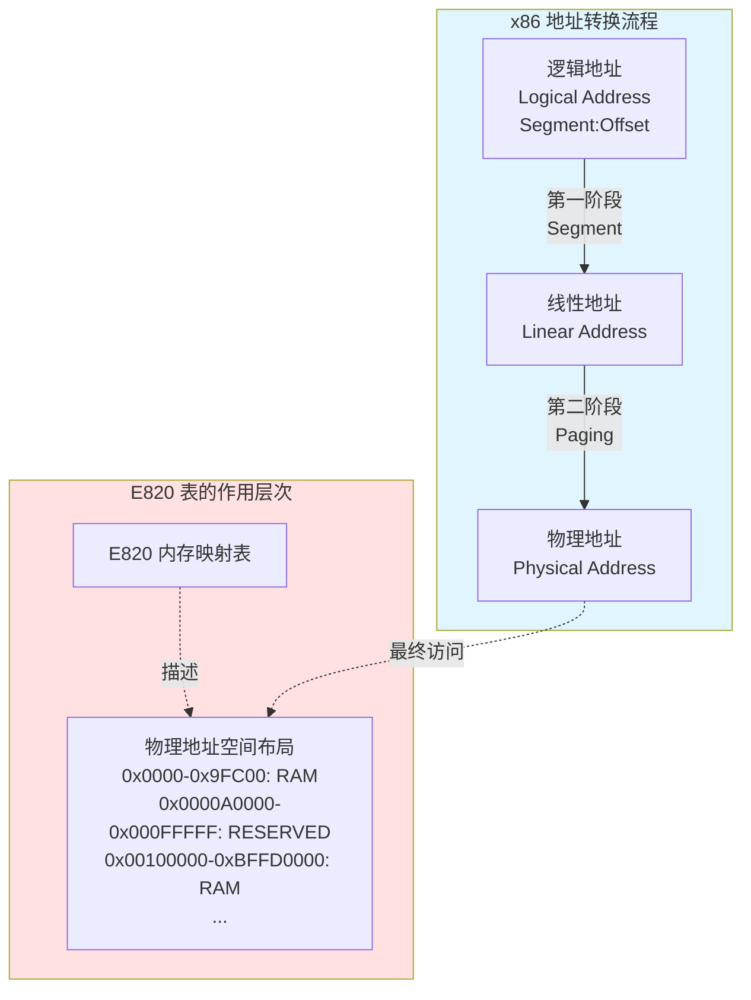
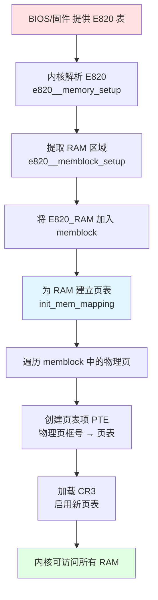

# E820 内存映射表详解

> **本文档为** [Linux 内核分页机制完整指南](LINUX_PAGING_COMPLETE_GUIDE.md) **的子文档**

本文档详细介绍 E820 内存映射表的数据结构、Linux 内核如何接收和使用 E820 表，以及 E820 与分页/分段机制的关系。

**主要内容**：
1. E820 表的定义和数据结构
2. Linux 内核接收 E820 表的流程
3. E820 与 Paging/Segment 的关系
4. E820 驱动内核页表初始化的详细代码分析

**相关文档**：
- [SeaBIOS E820 构建流程](SEABIOS_E820_CONSTRUCTION.md) - BIOS 固件如何构建 E820 表
- [Bootloader 内存信息传递](BOOTLOADER_MEMORY_PASSING.md) - GRUB 如何传递 E820 表给内核
- [Linux 内核分页机制完整指南](LINUX_PAGING_COMPLETE_GUIDE.md) - 内核接管内存的完整流程（包含 E820 解析、memblock、init_mem_mapping）

---

### 2.1 什么是 E820 表？

**E820 表**（E820 Memory Map）是 x86 架构上描述物理内存布局的标准机制，由 BIOS/固件提供给操作系统。名称来源于 BIOS 中断服务 **INT 15h, AX=E820h**。

**核心作用**：

E820 表告诉操作系统：
1. **哪些物理内存区域是可用 RAM**（可以被内核分配和使用）
2. **哪些区域被保留**（BIOS、设备内存映射、ACPI 表等，不可覆盖）
3. **每个区域的起始地址和大小**

这是内核管理物理内存的**第一步**：在能够使用内存之前，必须先知道有哪些内存可用。

### 2.1.1 E820 表的数据结构层次

E820 表在从 BIOS/固件到内核的传递过程中，经历了**三层数据结构**的转换：



#### 层次 1: BIOS/固件侧的 E820 表项

> **项目**: SeaBIOS
> **文件**: `src/e820map.h`

```c
// SeaBIOS - src/e820map.h
struct e820entry {
    u64 start;      // 物理内存区域起始地址
    u64 size;       // 区域大小（字节）
    u32 type;       // 内存类型（E820_RAM=1, E820_RESERVED=2, ...）
} PACKED;

// SeaBIOS 内部 E820 表（最多 32 项）
#define E820_MAXENTRIES 32
static struct e820entry e820_list[E820_MAXENTRIES];
static int e820_count;
```

#### 层次 2: GRUB 传递给内核的结构（boot_params）

> **项目**: Linux Kernel
> **文件**: `arch/x86/include/uapi/asm/bootparam.h`

```c
// Linux Kernel - arch/x86/include/uapi/asm/bootparam.h

/* E820 表项 - boot_params 中的格式 */
struct boot_e820_entry {
    __u64 addr;     // 起始地址
    __u64 size;     // 大小
    __u32 type;     // 类型
} __attribute__((packed));

/* boot_params 结构（GRUB 填充并传递给内核） */
struct boot_params {
    struct screen_info screen_info;           // 0x000
    // ... 其他字段 ...
    __u8  e820_entries;                       // 0x1e8: E820 条目数量
    // ... 其他字段 ...
    struct boot_e820_entry e820_table[128];   // 0x2d0: E820 表（最多 128 项）
    // ... 其他字段 ...
} __attribute__((packed));
```

**boot_params 内存布局**（关键字段）：

```
Offset   Size    Field
------   ----    -----
0x000    0x040   screen_info (显示信息)
...
0x1e8    0x001   e820_entries (E820 条目数)
...
0x2d0    0xd00   e820_table[128] (E820 表，每项 20 字节)
                 (128 × 20 = 2560 = 0xA00 字节)
...
```

#### 层次 3: Linux 内核全局 E820 表

> **项目**: Linux Kernel
> **文件**: `arch/x86/include/asm/e820/types.h`

```c
// Linux Kernel - arch/x86/include/asm/e820/types.h

/* 单个 E820 表项 */
struct e820_entry {
    u64 addr;       // 起始地址
    u64 size;       // 大小
    enum e820_type type;  // 类型（枚举）
} __attribute__((packed));

/* E820 表（内核全局） */
#define E820_MAX_ENTRIES    (E820_X_MAX + 3 * MAX_NUMNODES)
// E820_X_MAX = 512（可扩展表）

struct e820_table {
    __u32 nr_entries;                  // 实际条目数
    struct e820_entry entries[E820_MAX_ENTRIES];
};

/* 内核维护的三个 E820 表副本 */
extern struct e820_table *e820_table;          // 主表（可修改）
extern struct e820_table *e820_table_kexec;    // kexec 副本
extern struct e820_table *e820_table_firmware; // 固件原始副本（只读）
```

**E820 类型枚举**：

```c
// Linux Kernel - arch/x86/include/asm/e820/types.h
enum e820_type {
    E820_TYPE_RAM       = 1,  // 可用 RAM
    E820_TYPE_RESERVED  = 2,  // 保留区域
    E820_TYPE_ACPI      = 3,  // ACPI 可回收
    E820_TYPE_NVS       = 4,  // ACPI NVS
    E820_TYPE_UNUSABLE  = 5,  // 不可用
    E820_TYPE_PMEM      = 7,  // 持久化内存
    E820_TYPE_PRAM      = 12, // Persistent RAM
    E820_TYPE_SOFT_RESERVED = 0xefffffff, // 软预留
};
```

### 2.1.2 实际的 E820 表内存布局示例

**示例：一个 8GB 系统的 E820 表**（QEMU/KVM 虚拟机）：

```
索引  起始地址            结束地址            大小        类型
---  ----------------  ----------------  ----------  ------------
 0   0x0000_0000       0x0009_FC00       640 KB      RAM (1)
 1   0x0009_FC00       0x000A_0000       1 KB        RESERVED (2)
 2   0x000F_0000       0x0010_0000       64 KB       RESERVED (2)
 3   0x0010_0000       0xBFFD_0000       ~3 GB       RAM (1)
 4   0xBFFD_0000       0xC000_0000       192 KB      RESERVED (2)
 5   0xFEC0_0000       0xFED0_0000       64 KB       RESERVED (2)  ← LAPIC/IOAPIC
 6   0xFEE0_0000       0xFEE0_1000       4 KB        RESERVED (2)  ← LAPIC
 7   0xFFFC_0000       0x1_0000_0000     256 KB      RESERVED (2)  ← BIOS
 8   0x1_0000_0000     0x2_4000_0000     5 GB        RAM (1)       ← 高端内存
```

**内存布局可视化**：

```
4GB 以上 ┌─────────────────────────────────┐ 0x2_4000_0000 (9GB)
         │  RAM (5GB)                      │ E820[8]: RAM
4GB      ├─────────────────────────────────┤ 0x1_0000_0000 (4GB)
         │  BIOS ROM (256KB)               │ E820[7]: RESERVED
         ├─────────────────────────────────┤ 0xFFFC_0000
         │  空洞                            │
         ├─────────────────────────────────┤ 0xFEE0_1000
         │  LAPIC (4KB)                    │ E820[6]: RESERVED
         ├─────────────────────────────────┤ 0xFEE0_0000
         │  空洞                            │
         ├─────────────────────────────────┤ 0xFED0_0000
         │  LAPIC/IOAPIC (64KB)            │ E820[5]: RESERVED
         ├─────────────────────────────────┤ 0xFEC0_0000
         │  空洞                            │
3GB      ├─────────────────────────────────┤ 0xC000_0000
         │  ACPI/BIOS 数据 (192KB)         │ E820[4]: RESERVED
         ├─────────────────────────────────┤ 0xBFFD_0000
         │                                  │
         │  RAM (~3GB)                     │ E820[3]: RAM
         │                                  │
1MB      ├─────────────────────────────────┤ 0x0010_0000
         │  BIOS ROM (64KB)                │ E820[2]: RESERVED
         ├─────────────────────────────────┤ 0x000F_0000
         │  空洞                            │
         ├─────────────────────────────────┤ 0x000A_0000
         │  EBDA (1KB)                     │ E820[1]: RESERVED
640KB    ├─────────────────────────────────┤ 0x0009_FC00
         │  Low RAM (640KB)                │ E820[0]: RAM
0        └─────────────────────────────────┘ 0x0000_0000
```

**关键观察**：
- **碎片化**：可用 RAM 分为 3 段（0-640KB、1MB-3GB、4GB-9GB）
- **空洞**：3GB-4GB 之间是设备内存映射区（MMIO），没有 RAM
- **保留区域**：BIOS ROM、LAPIC、IOAPIC 等占用部分物理地址空间

**常见内存类型**：

| 类型 | 宏定义 | 含义 | 内核如何处理 |
|------|--------|------|--------------|
| 1 | `E820_TYPE_RAM` | 可用 RAM | 加入 memblock，可分配使用 |
| 2 | `E820_TYPE_RESERVED` | 保留区域（BIOS、设备等） | 不加入 memblock，不可使用 |
| 3 | `E820_TYPE_ACPI` | ACPI 可回收内存 | 保留给 ACPI，ACPI 初始化后可回收 |
| 4 | `E820_TYPE_NVS` | ACPI NVS（非易失性存储） | 保留，系统挂起/恢复时需要 |
| 5 | `E820_TYPE_UNUSABLE` | 不可用内存（坏内存块） | 不加入 memblock |

**E820 表示例**（典型的 4GB 系统）：

```
e820 map has 6 items:
  0: 0000000000000000 - 000000000009fc00 = 1 RAM       (640KB: 0-640KB)
  1: 000000000009fc00 - 00000000000a0000 = 2 RESERVED  (1KB: EBDA 区)
  2: 00000000000f0000 - 0000000000100000 = 2 RESERVED  (64KB: BIOS ROM)
  3: 0000000000100000 - 00000000bffd0000 = 1 RAM       (约 3GB: 1MB-3GB)
  4: 00000000bffd0000 - 00000000c0000000 = 2 RESERVED  (192KB: ACPI/BIOS)
  5: 00000000fec00000 - 0000000100000000 = 2 RESERVED  (设备内存映射区)
```


### 2.4 Linux 内核接收和使用 E820 表

> **项目**: [Linux Kernel](https://www.kernel.org/)
> **源码仓库**: https://git.kernel.org/pub/scm/linux/kernel/git/torvalds/linux.git

**核心文件**（Linux 内核）：
- `arch/x86/kernel/setup.c` - x86 架构初始化，调用 `e820__memory_setup()`
- `arch/x86/kernel/e820.c` - E820 内存映射表管理

**接收流程**：

> Linux 内核无论从 BIOS 还是 UEFI 启动，都通过统一的 `e820__memory_setup()` 接口接收内存映射。
>
> 详细的接收逻辑、统一接口设计图和 BIOS/UEFI 路径对比，请参见文档末尾的**附录 Q4**。

**内核使用 E820 表的关键步骤**：

1. **e820__memory_setup()**：解析并记录物理内存布局到 `e820_table`
2. **max_pfn 计算**：`e820__end_of_ram_pfn()` 扫描 E820_TYPE_RAM 区域，计算最大页帧号
3. **e820__memblock_setup()**：将 E820_TYPE_RAM 区域加入 memblock 分配器
4. **init_mem_mapping()**：为 RAM 区域建立内核直接映射页表
5. **paging_init()**：基于 E820 和 memblock 初始化内存 zone

**E820 类型处理**：

> **项目**: Linux Kernel
> **文件**: `arch/x86/kernel/e820.c:1242`
> **函数**: `e820__memblock_setup()`

```c
// Linux Kernel - arch/x86/kernel/e820.c:1242
void __init e820__memblock_setup(void)
{
    int i;
    for (i = 0; i < e820_table->nr_entries; i++) {
        struct e820_entry *entry = &e820_table->entries[i];
        u64 start = entry->addr;
        u64 end = start + entry->size;

        if (entry->type != E820_TYPE_RAM)
            continue;  // 只处理 RAM 类型

        // 加入 memblock 可分配区域
        memblock_add(start, entry->size);
    }

    // E820_TYPE_SOFT_RESERVED 需要预留
    for (i = 0; i < e820_table->nr_entries; i++) {
        if (entry->type == E820_TYPE_SOFT_RESERVED)
            memblock_reserve(entry->addr, entry->size);
    }
}
```

**E820 表的三个副本**：

| 变量 | 用途 |
|------|------|
| `e820_table` | 主副本，内核运行时可能被修改（添加保留区域等） |
| `e820_table_firmware` | 固件原始副本，保持不变，用于查询固件提供的原始布局 |
| `e820_table_kexec` | kexec 副本，用于 kexec 重启时传递给新内核 |

**要点**：

- E820 表是内核获知物理内存布局的**唯一来源**（Legacy BIOS 模式）
- 只有 `E820_TYPE_RAM` 会被加入 memblock 供内核分配使用
- E820 表在后续阶段可能被修改（如添加内核镜像保留区、initrd 保留区等）
- `e820__memory_setup()` 只负责"解析并记录"物理内存布局，尚未建立 memblock 或页表


### 2.5 E820 表与 Paging/Segment 的关系

#### E820 描述的是什么地址空间？

**E820 表描述的是物理地址空间（Physical Address Space）**，与虚拟地址转换机制（Segment、Paging）处于不同层次。



#### E820 表与 Segment（分段）的关系：**无直接关系**

**为什么无关？**

1. **Segment 作用于地址转换的第一阶段**：
   - Segment 将**逻辑地址**（段:偏移）转换为**线性地址**
   - 在 Flat Model 下，段基址为 0，逻辑地址 = 线性地址
   - Segment 处理的是虚拟地址空间的**访问方式**，不关心物理内存布局

2. **E820 描述物理地址空间**：
   - E820 告诉 OS："物理地址 0x100000-0xBFFD0000 是可用 RAM"
   - 这个信息与你用什么段选择子、段基址来访问无关
   - 即使在实模式下用 `segment:offset` 访问，E820 描述的仍然是最终的物理地址

**示例**：

```
实模式访问：DS=0x1000, offset=0x5000
    → 线性地址 = 0x1000 * 16 + 0x5000 = 0x15000
    → 物理地址 = 0x15000（实模式无分页）

E820 告诉我们：物理地址 0x15000 是否是可用 RAM？
    → 与你用哪个段寄存器、段基址多少无关
```

**结论**：E820 表与 Segment 机制处于不同层次，**无直接依赖关系**。

---

#### E820 表与 Paging（分页）的关系：**分阶段的依赖关系**

**关键问题**：为什么启动初期阶段（压缩内核 startup_32）不需要 E820 表就可以建立页表，而后期（主内核 init_mem_mapping）必须依赖 E820 表？

##### 阶段1：临时页表（启动初期，不需要 E820）

**时机**：压缩内核的 `startup_32` 阶段（`arch/x86/boot/compressed/head_64.S:200-231`）

**目的**：满足进入长模式的硬件要求

x86-64 长模式的硬件强制要求：
- 进入长模式之前，**必须**启用分页（CR0.PG = 1）
- 必须启用 PAE（CR4.PAE = 1）
- 必须设置 EFER.LME = 1

**为什么不需要 E820？**

1. **覆盖范围固定且有限**：
   - 只需映射 0-4GB（2048个2MB大页）
   - 使用身份映射（VA = PA）
   - 这个范围足够覆盖压缩内核（通常在1MB处）和解压目标区域（通常在16MB处）

2. **硬编码映射**（源码证据）：
   ```asm
   /* arch/x86/boot/compressed/head_64.S:200-231 */

   /* Build Level 2 */
   leal    rva(pgtable + 0x2000)(%ebx), %edi
   movl    $0x00000183, %eax          # Present + RW + PS (2MB页)
   movl    $2048, %ecx                # ← 硬编码：2048个2MB页 = 4GB
   1:  movl    %eax, 0(%edi)
       addl    %edx, 4(%edi)
       addl    $0x00200000, %eax      # 每次增加 2MB
       addl    $8, %edi
       decl    %ecx
       jnz     1b
   ```
   **注意**：这里直接用常量 `2048`，不查询 E820，直接映射整个 4GB 地址空间。

3. **临时使用**：
   - 这个页表只在压缩内核阶段使用
   - 解压完成后会被主内核的完整页表替代
   - 位于压缩内核的 `.pgtable` 段，后续会被释放

4. **安全性考虑**：
   - 虽然映射了 4GB（包括保留区域），但这个映射是**临时的**
   - 压缩内核只访问很小的区域（内核镜像、栈、VGA 显存、解压目标）
   - **关键**：进入主内核后，这个映射被**立即清空**（`reset_early_page_tables()`）
   - 不会长期保留对保留区域的映射，避免潜在问题

5. **映射的生命周期**：

   > **函数修饰符说明**：关于 `asmlinkage`, `__init` 等修饰符的详细解释，见 [LINUX_KERNEL_FUNCTION_ATTRIBUTES.md](LINUX_KERNEL_FUNCTION_ATTRIBUTES.md#41-x86_64_start_kernel-函数)。

   ```c
   // arch/x86/kernel/head64.c:238
   asmlinkage void __init x86_64_start_kernel(char *real_mode_data)
   {
       /* Kill off the identity-map trampoline */
       reset_early_page_tables();  // ← 立即清空压缩内核的 4GB 映射！

       ...

       idt_setup_early_handler();  // ← 设置 page fault handler

       // 之后访问新地址会触发 page fault，
       // 由 early_make_pgtable() 按需建立页表
   }
   ```

##### 阶段2：主内核早期（按需分页，不需要 E820）

**时机**：主内核 `x86_64_start_kernel()` 到 `setup_arch()` 之间

**机制**：**按需分页**（Demand Paging）

1. **清空临时页表**（`reset_early_page_tables()`）：
   ```c
   // arch/x86/kernel/head64.c:68-73
   static void __init reset_early_page_tables(void)
   {
       memset(early_top_pgt, 0, sizeof(pgd_t)*(PTRS_PER_PGD-1));  // ← 清空！
       next_early_pgt = 0;
       write_cr3(__sme_pa_nodebug(early_top_pgt));
   }
   ```

2. **设置 early page fault handler**（`idt_setup_early_handler()`）

3. **按需建立页表**：
   ```c
   // arch/x86/kernel/head64.c:156-160
   void __init do_early_exception(struct pt_regs *regs, int trapnr)
   {
       if (trapnr == X86_TRAP_PF &&          // ← Page Fault！
           early_make_pgtable(native_read_cr2()))  // ← 读取 CR2（触发 PF 的地址）
           return;  // ← 建立页表后返回，CPU 重试访问
   }
   ```

**为什么不需要 E820？**

- 只为**实际访问**的地址建立页表
- 访问的地址都是已知安全的（内核代码、数据、栈）
- 不会盲目映射整个地址空间

**注释证据**（`arch/x86/kernel/e820.c:1270-1272`）：
```c
/*
 * At this point only the first megabyte is mapped for sure, the
 * rest of the memory cannot be used for memblock resizing
 */
```
说明在 `e820__memblock_setup()` 被调用时，大部分内存还没有映射！

##### 阶段3：完整页表（主内核，必须用 E820）

**时机**：主内核的 `init_mem_mapping()` 阶段（`arch/x86/mm/init.c:758`）

**目的**：为所有可用物理内存建立直接映射（Direct Mapping）

**为什么必须用 E820？**

**E820 是 Paging 的数据来源**：内核需要知道"应该为哪些物理地址建立页表映射"，这个信息只能来自 E820 表。

**依赖关系流程**：



**为什么 Paging 依赖 E820？**

| 问题 | E820 的作用 | 如果没有 E820 会怎样？ |
|------|------------|---------------------|
| **页表应该映射哪些物理地址？** | E820_TYPE_RAM 告诉内核哪些物理地址是可用内存 | 内核不知道哪些物理地址可以安全访问，可能映射到设备内存或保留区域导致崩溃 |
| **哪些物理地址不应该映射？** | E820_TYPE_RESERVED 标记了 BIOS、设备等保留区域 | 内核可能覆盖 BIOS 数据或设备内存映射区，导致系统故障 |
| **设备内存需要特殊映射吗？** | E820 区分 RAM 和设备内存 | 内核可能用普通的 cached 映射访问设备内存，导致数据不一致 |
| **物理内存有多大？** | E820 扫描所有 RAM 区域得到 max_pfn | 内核不知道物理内存大小，无法正确初始化内存管理 |

##### 阶段对比总结

| 特性 | 阶段1：临时页表<br>(startup_32) | 阶段2：按需分页<br>(early boot) | 阶段3：完整页表<br>(init_mem_mapping) |
|------|-----------------------------|------------------------------|----------------------------------|
| **文件位置** | `arch/x86/boot/compressed/`<br>`head_64.S:200-231` | `arch/x86/kernel/`<br>`head64.c:68-160` | `arch/x86/mm/`<br>`init.c:758` |
| **页表类型** | 临时身份映射<br>(Identity Mapping) | 按需建立的映射<br>(Demand Paging) | 完整直接映射<br>(Direct Mapping) |
| **映射范围** | 固定 0-4GB<br>(硬编码2048个2MB页) | 只映射访问的地址<br>(通常<1MB) | 所有物理RAM<br>(根据E820动态确定) |
| **映射方式** | VA = PA | VA = PA（早期）<br>后切换到高地址 | VA = PA + PAGE_OFFSET |
| **建立机制** | **硬编码循环** | **Page Fault Handler**<br>(`early_make_pgtable()`) | **遍历E820表**<br>(`kernel_physical_mapping_init()`) |
| **数据来源** | **硬编码常量** | **运行时按需** | **E820表** |
| **是否需要E820** | ❌ **不需要** | ❌ **不需要** | ✅ **必须** |
| **主要目的** | 满足进入长模式的<br>硬件要求 | 支持早期内核初始化<br>（清BSS、early IDT等） | 为所有可用物理内存<br>建立映射 |
| **生命周期** | 临时使用<br>**进入主内核后立即清空** | 临时使用<br>直到 `init_mem_mapping()` | 永久使用<br>内核运行期一直有效 |
| **为什么这样设计** | 启动早期E820表尚未解析<br>硬编码4GB足够 | 避免盲目映射保留区域<br>只映射必要的地址 | 需要管理所有物理内存<br>必须精确知道RAM/保留区域 |
| **被清空的时机** | `x86_64_start_kernel():238`<br>`reset_early_page_tables()` | `init_mem_mapping()` 完成后<br>切换到 `swapper_pg_dir` | N/A（永久使用） |

**关键区别**：

1. **阶段1（压缩内核）- 目的简单，临时使用**：
   - 只是为了满足"进入长模式必须启用分页"的硬件要求
   - 不需要精确的内存布局信息
   - 硬编码 4GB 映射足够覆盖压缩内核（1MB）和解压目标（16MB）
   - **虽然映射了保留区域，但进入主内核后立即被清空**

2. **阶段2（主内核早期）- 按需建立，安全可控**：
   - 清空阶段1的 4GB 映射（`reset_early_page_tables()`）
   - 设置 page fault handler（`idt_setup_early_handler()`）
   - 只为**实际访问**的地址建立页表（通过 `early_make_pgtable()`）
   - 访问的都是已知安全的地址（内核代码、数据、栈），不会盲目映射保留区域
   - 代码证据：`e820.c:1270` 注释说明"此时只有第一个 MB 被映射"

3. **阶段3（主内核后期）- 目的复杂，必须精确**：
   - 要管理所有物理内存（可能几十GB、几百GB）
   - 必须知道：
     - 哪些物理地址是 RAM（可以映射为 cacheable）
     - 哪些是保留区域（BIOS、设备内存映射，不能用 cached 映射）
     - 哪些是坏内存（不能使用）
     - 需要为不同类型的内存设置正确的缓存属性（RAM: WB, MMIO: UC）

**典型的 E820 表示例**（8GB 系统）：
```
0x0000_0000 - 0x0009_FC00: RAM        ← 可映射
0x0009_FC00 - 0x000A_0000: RESERVED   ← 不能映射（EBDA）
0x000F_0000 - 0x0010_0000: RESERVED   ← 不能映射（BIOS ROM）
0x0010_0000 - 0xBFFD_0000: RAM        ← 可映射
0xBFFD_0000 - 0xC000_0000: RESERVED   ← 不能映射（ACPI）
0xFEC0_0000 - 0xFED0_0000: RESERVED   ← 不能映射（LAPIC/IOAPIC）
0x1_0000_0000 - 0x2_4000_0000: RAM    ← 可映射（高端内存）
```

**为什么阶段1映射保留区域不会有问题，但阶段3必须避免？**

**阶段1（压缩内核）为什么安全**：
1. **生命周期极短**：
   - 只在解压内核期间使用（几百毫秒）
   - 进入主内核后**立即清空**（`reset_early_page_tables()`）
   - 不会长期保留对保留区域的映射

2. **访问范围极小**：
   - 只访问：代码段（1MB）、栈（几KB）、VGA 显存（用于显示启动信息）、解压目标（16MB）
   - **不访问**：LAPIC/IOAPIC、PCI 配置空间、其他设备内存映射

3. **VGA 显存访问是安全的**：
   ```c
   // arch/x86/boot/compressed/misc.c:423-428
   if (boot_params_ptr->screen_info.orig_video_mode == 7) {
       vidmem = (char *) 0xb0000;  // ← 虽然是保留区域，但专门用于访问
   } else {
       vidmem = (char *) 0xb8000;  // ← 写入字符显示启动信息
   }
   ```
   VGA 显存虽然在 E820_TYPE_RESERVED 区域，但设计上就是允许被访问的（用于文本模式显示）

**阶段3（init_mem_mapping）如果不用 E820 会怎样？**

假设盲目映射整个物理地址空间为 cacheable RAM：

1. ❌ **LAPIC/IOAPIC（0xFEC00000-0xFED00000）**：
   - 这是中断控制器的 MMIO 寄存器
   - 必须用 uncached 映射（UC），每次访问都直达硬件
   - 如果用 cached 映射（WB），CPU 可能缓存寄存器值
   - **后果**：写入 EOI（End of Interrupt）不会立即到达硬件，中断系统失效

2. ❌ **PCI 配置空间（0xE0000000-0xF0000000）**：
   - 用于配置 PCI 设备
   - 必须用 uncached 映射
   - **后果**：设备配置可能失败，硬件初始化异常

3. ❌ **DMA 缓冲区**：
   - DMA 和 CPU 必须看到一致的数据
   - 必须用 uncached 或 write-combining 映射
   - **后果**：DMA 数据不一致，网络/磁盘 I/O 损坏

4. ❌ **覆盖 BIOS 数据（0xBFFD0000-0xC0000000）**：
   - ACPI 表、SMBIOS 表等
   - **后果**：ACPI 解析失败，电源管理、热管理失效

5. ❌ **未知的保留区域**：
   - 可能触发 machine check exception
   - **后果**：系统崩溃

**实际代码中的依赖**（`arch/x86/mm/init.c:init_mem_mapping()`）：

```c
void __init init_mem_mapping(void)
{
    unsigned long end;

    // 从 E820 获取物理内存范围
    end = max_pfn << PAGE_SHIFT;  // max_pfn 来自 e820__end_of_ram_pfn()

    // 为 E820 中的 RAM 区域建立直接映射
    // 内部通过遍历 memblock（来自 E820）建立页表
    memory_map_bottom_up(ISA_END_ADDRESS, end);

    // 加载新页表
    load_cr3(swapper_pg_dir);
    __flush_tlb_all();
}
```

**具体依赖点**：

1. **`max_pfn` 计算**（`arch/x86/kernel/e820.c`）：
   ```c
   unsigned long __init e820__end_of_ram_pfn(void)
   {
       unsigned long max_pfn = 0;
       for (i = 0; i < e820_table->nr_entries; i++) {
           struct e820_entry *entry = &e820_table->entries[i];

           if (entry->type != E820_TYPE_RAM)  // 只考虑 RAM 区域
               continue;

           unsigned long pfn = (entry->addr + entry->size) >> PAGE_SHIFT;
           if (pfn > max_pfn)
               max_pfn = pfn;
       }
       return max_pfn;
   }
   ```

2. **`init_mem_mapping()` 建立映射**：
   - 只为 E820_TYPE_RAM 区域建立常规的 cacheable 页表映射
   - E820_TYPE_RESERVED 区域不建立映射，或在需要时建立特殊映射（uncached）

3. **`memblock` 作为中介**：
   ```
   E820 表（物理内存布局描述）
       ↓
   memblock（早期内存分配器，记录可用物理页）
       ↓
   页表（为 memblock 中的物理页建立线性地址映射）
   ```

#### 详细代码分析：E820 如何驱动 Paging

**完整调用链**：

```
setup_arch()                          [arch/x86/kernel/setup.c]
    ├─ e820__memory_setup()           → 解析 E820 到 e820_table
    ├─ max_pfn = e820__end_of_ram_pfn() → 扫描 E820_RAM 计算最大 PFN
    ├─ e820__memblock_setup()         → 将 E820_RAM 加入 memblock
    └─ init_mem_mapping()             [arch/x86/mm/init.c]
            ├─ memory_map_bottom_up() 或 memory_map_top_down()
            │   └─ init_range_memory_mapping()
            │       └─ init_memory_mapping(start, end, PAGE_KERNEL)
            │           └─ kernel_physical_mapping_init()  [arch/x86/mm/init_64.c]
            │               ├─ 遍历 PML4/PDPT/PD/PT 级别
            │               ├─ 根据 E820 类型设置页表属性
            │               └─ 填充页表项（物理页框号 + 属性位）
            ├─ load_cr3(swapper_pg_dir)
            └─ __flush_tlb_all()
```

**1. `e820__end_of_ram_pfn()` - 从 E820 计算物理内存大小**

> **项目**: Linux Kernel
> **文件**: `arch/x86/kernel/e820.c:1422`

```c
// Linux Kernel - arch/x86/kernel/e820.c:1422
unsigned long __init e820__end_of_ram_pfn(void)
{
    return e820_end_pfn(MAX_ARCH_PFN, E820_TYPE_RAM);
}

static unsigned long __init e820_end_pfn(unsigned long limit_pfn,
                                          enum e820_type type)
{
    int i;
    unsigned long max_pfn = 0;
    struct e820_table *e820 = e820_table;

    // 遍历 E820 表
    for (i = 0; i < e820->nr_entries; i++) {
        struct e820_entry *entry = &e820->entries[i];
        unsigned long start_pfn;
        unsigned long end_pfn;

        // 只处理指定类型（E820_TYPE_RAM）
        if (entry->type != type)
            continue;

        start_pfn = entry->addr >> PAGE_SHIFT;
        end_pfn = (entry->addr + entry->size) >> PAGE_SHIFT;

        // 限制在架构支持的最大 PFN 内
        if (start_pfn >= limit_pfn)
            continue;
        if (end_pfn > limit_pfn)
            end_pfn = limit_pfn;

        // 找到最大的结束页帧号
        if (end_pfn > max_pfn)
            max_pfn = end_pfn;
    }

    return max_pfn;
}
```

**关键点**：
- 只扫描 `E820_TYPE_RAM` 类型的条目
- 将物理地址转换为页帧号（`>> PAGE_SHIFT`，即除以 4096）
- `max_pfn` 决定了内核需要管理的物理内存范围

**2. `e820__memblock_setup()` - 将 E820 RAM 导入 memblock**

源码：`arch/x86/kernel/e820.c`

```c
void __init e820__memblock_setup(void)
{
    int i;
    u64 end;

    // 第一遍：添加所有可用 RAM 到 memblock
    for (i = 0; i < e820_table->nr_entries; i++) {
        struct e820_entry *entry = &e820_table->entries[i];

        end = entry->addr + entry->size;

        // 只处理 RAM 类型
        if (entry->type != E820_TYPE_RAM)
            continue;

        // 忽略低于 1MB 的内存（通常已被使用）
        if (entry->addr >= end)
            continue;

        // 将 RAM 区域加入 memblock.memory
        memblock_add(entry->addr, entry->size);
    }

    // 第二遍：标记软预留区域（pmem 等）
    for (i = 0; i < e820_table->nr_entries; i++) {
        struct e820_entry *entry = &e820_table->entries[i];

        if (entry->type == E820_TYPE_SOFT_RESERVED)
            memblock_reserve(entry->addr, entry->size);
    }

    // 设置 memblock 的分配限制（在页表建立前只能分配低端内存）
    memblock_set_current_limit(ISA_END_ADDRESS);
}
```

**关键点**：
- `memblock_add()` 将物理内存区域添加到 `memblock.memory` 列表
- 只有 `E820_TYPE_RAM` 会被添加，其他类型（RESERVED、ACPI 等）不加入
- `memblock_reserve()` 标记已占用的内存（不可分配，但仍在 memblock.memory 中）
- 此时只记录了"哪里有 RAM"，还未建立页表

**3. `init_mem_mapping()` - 为 RAM 建立直接映射**

> **项目**: Linux Kernel
> **文件**: `arch/x86/mm/init.c:758`

```c
// Linux Kernel - arch/x86/mm/init.c:758
void __init init_mem_mapping(void)
{
    unsigned long end;

    pti_check_boottime_disable();      // Page Table Isolation 检查
    probe_page_size_mask();             // 探测支持的页大小（4K/2M/1G）

    setup_pcid();                       // Process Context ID

    // 从 max_pfn 计算物理内存末尾地址
    end = max_pfn << PAGE_SHIFT;

#ifdef CONFIG_X86_64
    end = max_pfn_mapped << PAGE_SHIFT;
#endif

    /* 第一阶段：映射 ISA 区域（0-1MB） */
    init_memory_mapping(0, ISA_END_ADDRESS, PAGE_KERNEL_IO);

    /* 第二阶段：初始化 trampoline（实模式切换区域） */
    init_trampoline();

    /*
     * 第三阶段：映射整个物理 RAM
     * 选择自底向上或自顶向下映射策略
     */
    if (memblock_bottom_up()) {
        unsigned long kernel_end = __pa_symbol(_end);

        // 自底向上：先映射内核之后的区域，再映射内核之前的区域
        // 优点：页表分配在内核之后，避免碎片
        memory_map_bottom_up(kernel_end, end);
        memory_map_bottom_up(ISA_END_ADDRESS, kernel_end);
    } else {
        // 自顶向下：从高地址向低地址映射
        memory_map_top_down(ISA_END_ADDRESS, end);
    }

    // 如果支持 5 级页表，调整映射
#ifdef CONFIG_X86_5LEVEL
    if (pgtable_l5_enabled())
        init_trampoline_pgt_l5();
#endif

    // 加载新的页表基址并刷新 TLB
    load_cr3(swapper_pg_dir);
    __flush_tlb_all();

    // 放宽 memblock 分配限制（现在可以分配高端内存了）
    x86_init.hyper.init_after_bootmem();
    memblock_set_current_limit(ISA_END_ADDRESS);

    // 输出映射信息
    early_memtest(0, max_pfn_mapped << PAGE_SHIFT);
}
```

**4. `kernel_physical_mapping_init()` - 实际创建页表项**

> **项目**: Linux Kernel
> **文件**: `arch/x86/mm/init_64.c` (函数较长，包含多个辅助函数)

```c
// Linux Kernel - arch/x86/mm/init_64.c
/*
 * 为给定的物理地址区域创建页表映射
 * start, end: 物理地址范围
 * prot: 页表保护位（PAGE_KERNEL、PAGE_KERNEL_NOCACHE 等）
 */
unsigned long __meminit
kernel_physical_mapping_init(unsigned long paddr_start,
                              unsigned long paddr_end,
                              unsigned long page_size_mask,
                              pgprot_t prot)
{
    bool pgd_changed = false;
    unsigned long vaddr, vaddr_start, vaddr_end, vaddr_next, paddr_next;
    unsigned long paddr_last = paddr_end;
    pgd_t *pgd;
    p4d_t *p4d;
    pud_t *pud;
    pmd_t *pmd;
    pte_t *pte;

    // 转换为虚拟地址（直接映射区域）
    vaddr = (unsigned long)__va(paddr_start);
    vaddr_end = (unsigned long)__va(paddr_end);
    vaddr_start = vaddr;

    // 遍历 PGD 级别
    for (; vaddr < vaddr_end; vaddr = vaddr_next) {
        pgd = pgd_offset_k(vaddr);
        vaddr_next = (vaddr & PGDIR_MASK) + PGDIR_SIZE;

        if (pgd_val(*pgd)) {
            p4d = (p4d_t *)pgd_page_vaddr(*pgd);
            paddr_next = phys_p4d_init(p4d, paddr, paddr_end,
                                        page_size_mask, prot);
            continue;
        }

        // 分配新的 P4D 表
        p4d = alloc_low_page();
        paddr_next = phys_p4d_init(p4d, paddr, paddr_end,
                                    page_size_mask, prot);

        spin_lock(&init_mm.page_table_lock);
        // 设置 PGD 条目指向 P4D 表
        pgd_populate(&init_mm, pgd, p4d);
        spin_unlock(&init_mm.page_table_lock);
        pgd_changed = true;
    }

    if (pgd_changed)
        sync_global_pgds(vaddr_start, vaddr_end - 1);

    return paddr_last;
}

// P4D 级别初始化
static unsigned long __meminit
phys_p4d_init(p4d_t *p4d_page, unsigned long paddr,
               unsigned long paddr_end,
               unsigned long page_size_mask,
               pgprot_t prot)
{
    unsigned long paddr_next, paddr_last = paddr_end;
    unsigned long vaddr = (unsigned long)__va(paddr);
    int i = p4d_index(vaddr);

    // 遍历 P4D 条目
    for (; i < PTRS_PER_P4D; i++, paddr = paddr_next) {
        p4d_t *p4d = p4d_page + i;
        pud_t *pud;

        vaddr = (unsigned long)__va(paddr);
        paddr_next = (paddr & P4D_MASK) + P4D_SIZE;

        if (paddr >= paddr_end) {
            // 超出范围，清零剩余条目
            if (!after_bootmem &&
                !p4d_none(*p4d) && pud_page_vaddr(*p4d))
                free_pud_table(pud_page_vaddr(*p4d), p4d);
            continue;
        }

        if (!p4d_none(*p4d)) {
            pud = pud_offset(p4d, 0);
            paddr_last = phys_pud_init(pud, paddr, paddr_end,
                                        page_size_mask, prot);
            continue;
        }

        // 分配新的 PUD 表
        pud = alloc_low_page();
        paddr_last = phys_pud_init(pud, paddr, paddr_end,
                                    page_size_mask, prot);

        spin_lock(&init_mm.page_table_lock);
        p4d_populate(&init_mm, p4d, pud);
        spin_unlock(&init_mm.page_table_lock);
    }

    return paddr_last;
}

// PUD 级别初始化（可能使用 1GB 大页）
static unsigned long __meminit
phys_pud_init(pud_t *pud_page, unsigned long paddr,
               unsigned long paddr_end,
               unsigned long page_size_mask,
               pgprot_t prot)
{
    unsigned long pages = 0, paddr_next;
    unsigned long paddr_last = paddr_end;
    unsigned long vaddr = (unsigned long)__va(paddr);
    int i = pud_index(vaddr);

    for (; i < PTRS_PER_PUD; i++, paddr = paddr_next) {
        pud_t *pud = pud_page + i;
        pmd_t *pmd;
        pgprot_t prot_pud = prot;

        vaddr = (unsigned long)__va(paddr);
        paddr_next = (paddr & PUD_MASK) + PUD_SIZE;

        if (paddr >= paddr_end) {
            // 超出范围，清理
            if (!after_bootmem &&
                !pud_none(*pud) && pmd_page_vaddr(*pud))
                free_pmd_table(pmd_page_vaddr(*pud), pud);
            continue;
        }

        // 尝试使用 1GB 大页（如果支持且对齐）
        if (direct_gbpages &&
            (page_size_mask & (1 << PG_LEVEL_1G)) &&
            IS_ALIGNED(paddr, PUD_SIZE) &&
            IS_ALIGNED(paddr_next, PUD_SIZE)) {

            // 设置 PUD 直接映射 1GB 物理页
            set_pud(pud, __pud(paddr | pgprot_val(prot_pud) | _PAGE_PSE));
            pages++;
            paddr_last = paddr_next;
            continue;
        }

        // 否则使用 PMD 级别（2MB 或 4KB 页）
        if (!pud_none(*pud)) {
            pmd = pmd_offset(pud, 0);
            paddr_last = phys_pmd_init(pmd, paddr, paddr_end,
                                        page_size_mask, prot);
            continue;
        }

        pmd = alloc_low_page();
        paddr_last = phys_pmd_init(pmd, paddr, paddr_end,
                                    page_size_mask, prot);

        spin_lock(&init_mm.page_table_lock);
        pud_populate(&init_mm, pud, pmd);
        spin_unlock(&init_mm.page_table_lock);
    }

    return paddr_last;
}

// PMD 级别初始化（可能使用 2MB 大页）
static unsigned long __meminit
phys_pmd_init(pmd_t *pmd_page, unsigned long paddr,
               unsigned long paddr_end,
               unsigned long page_size_mask,
               pgprot_t prot)
{
    unsigned long pages = 0, paddr_next;
    unsigned long paddr_last = paddr_end;

    int i = pmd_index((unsigned long)__va(paddr));

    for (; i < PTRS_PER_PMD; i++, paddr = paddr_next) {
        pmd_t *pmd = pmd_page + i;
        pte_t *pte;
        pgprot_t prot_pmd = prot;

        paddr_next = (paddr & PMD_MASK) + PMD_SIZE;

        if (paddr >= paddr_end) {
            if (!after_bootmem &&
                !pmd_none(*pmd) && pte_page_vaddr(*pmd))
                free_pte_table(pte_page_vaddr(*pmd), pmd);
            continue;
        }

        // 尝试使用 2MB 大页
        if (page_size_mask & (1 << PG_LEVEL_2M) &&
            IS_ALIGNED(paddr, PMD_SIZE) &&
            IS_ALIGNED(paddr_next, PMD_SIZE)) {

            // 设置 PMD 直接映射 2MB 物理页
            set_pmd(pmd, __pmd(paddr | pgprot_val(prot_pmd) | _PAGE_PSE));
            pages++;
            paddr_last = paddr_next;
            continue;
        }

        // 否则使用 PTE 级别（4KB 页）
        if (!pmd_none(*pmd)) {
            pte = pte_offset_kernel(pmd, 0);
            paddr_last = phys_pte_init(pte, paddr, paddr_end, prot);
            continue;
        }

        pte = alloc_low_page();
        paddr_last = phys_pte_init(pte, paddr, paddr_end, prot);

        spin_lock(&init_mm.page_table_lock);
        pmd_populate_kernel(&init_mm, pmd, pte);
        spin_unlock(&init_mm.page_table_lock);
    }

    return paddr_last;
}

// PTE 级别初始化（4KB 页）
static unsigned long __meminit
phys_pte_init(pte_t *pte_page, unsigned long paddr,
               unsigned long paddr_end,
               pgprot_t prot)
{
    unsigned long pages = 0;
    unsigned long paddr_last = paddr_end;
    unsigned long paddr_next;
    int i = pte_index((unsigned long)__va(paddr));

    for (; i < PTRS_PER_PTE; i++, paddr = paddr_next) {
        pte_t *pte = pte_page + i;

        paddr_next = (paddr & PAGE_MASK) + PAGE_SIZE;

        if (paddr >= paddr_end) {
            if (!after_bootmem &&
                !pte_none(*pte))
                set_pte(pte, __pte(0));
            continue;
        }

        // 设置 PTE 映射 4KB 物理页
        // paddr: 物理页框号
        // pgprot_val(prot): 页表属性位（Present、Writable、Cacheable 等）
        set_pte(pte, pfn_pte(paddr >> PAGE_SHIFT, prot));
        pages++;
        paddr_last = paddr_next;
    }

    return paddr_last;
}
```

**关键代码分析**：

1. **从 E820 获取物理地址范围**：
   ```c
   end = max_pfn << PAGE_SHIFT;  // max_pfn 来自 e820__end_of_ram_pfn()
   ```

2. **只为 memblock.memory 中的区域建立映射**（memblock 来自 E820_TYPE_RAM）：
   ```c
   memory_map_bottom_up(ISA_END_ADDRESS, end);
   // 内部会调用 for_each_memblock(memory, reg) 遍历
   ```

3. **页表属性根据内存类型设置**：
   ```c
   // RAM 区域：cacheable, writable
   init_memory_mapping(start, end, PAGE_KERNEL);
   // PAGE_KERNEL = _PAGE_PRESENT | _PAGE_RW | _PAGE_ACCESSED | _PAGE_DIRTY

   // 设备 MMIO：uncached, writable
   ioremap(phys_addr, size);  // 使用 PAGE_KERNEL_IO
   // PAGE_KERNEL_IO = _PAGE_PRESENT | _PAGE_RW | _PAGE_PCD | _PAGE_PWT
   ```

4. **页表项的实际填充**：
   ```c
   // PTE 级别
   set_pte(pte, pfn_pte(paddr >> PAGE_SHIFT, prot));
   // 展开为：
   // pte->pte = (物理页框号 << 12) | 属性位
   //         = 0x00100000 | (_PAGE_PRESENT|_PAGE_RW|_PAGE_ACCESSED|...)
   ```

**5. 设备内存的特殊映射 - `ioremap()`**

源码：`arch/x86/mm/ioremap.c`

```c
/*
 * ioremap - 将设备物理地址映射到内核虚拟地址空间
 * phys_addr: 设备物理地址（如 0xFEC00000 - LAPIC 基址）
 * size: 映射大小
 * 返回：内核虚拟地址指针
 */
void __iomem *ioremap(resource_size_t phys_addr, unsigned long size)
{
    // 对于设备 MMIO，使用 uncached 映射
    return __ioremap_caller(phys_addr, size,
                            IORES_MAP_SYSTEM_RAM | IORES_MAP_ENCRYPTED,
                            PAGE_KERNEL_IO,
                            __builtin_return_address(0),
                            false);
}

static void __iomem *
__ioremap_caller(resource_size_t phys_addr, unsigned long size,
                 enum page_cache_mode pcm, pgprot_t prot,
                 void *caller, bool encrypted)
{
    unsigned long offset, vaddr;
    resource_size_t last_addr;
    const resource_size_t unaligned_phys_addr = phys_addr;
    const unsigned long unaligned_size = size;
    struct vm_struct *area;
    pgprot_t new_prot;
    int retval;

    // 检查是否在 E820 表中
    // 如果是 E820_TYPE_RAM，警告（不应该用 ioremap 映射 RAM）
    if (iores_map_check(phys_addr, size) != IORES_MAP_SYSTEM_RAM_OK) {
        WARN_ONCE(1, "ioremap on RAM at %pa - %pa\n",
                  &phys_addr, &last_addr);
        return NULL;
    }

    // 页对齐
    offset = phys_addr & ~PAGE_MASK;
    phys_addr &= PAGE_MASK;
    size = PAGE_ALIGN(last_addr + 1) - phys_addr;

    // 在内核虚拟地址空间中分配区域（vmalloc 区域）
    area = get_vm_area_caller(size, VM_IOREMAP, caller);
    if (!area)
        return NULL;
    area->phys_addr = phys_addr;
    vaddr = (unsigned long)area->addr;

    // 设置页表属性为 uncached
    new_prot = pgprot_noncached(prot);

    // 创建页表映射（uncached）
    if (ioremap_page_range(vaddr, vaddr + size, phys_addr, new_prot)) {
        free_vm_area(area);
        return NULL;
    }

    return (void __iomem *)(vaddr + offset);
}
```

**关键点**：
- `ioremap()` 检查物理地址是否在 E820_TYPE_RAM 区域，如果是则警告
- 设备内存必须用 `uncached` 属性映射（`PAGE_KERNEL_IO`）
- 映射到 vmalloc 区域，不是直接映射区域
- 页表属性：`_PAGE_PCD | _PAGE_PWT`（Cache Disable + Write Through）

**E820 影响的页表属性**：

| E820 类型 | 是否映射？ | 页表属性 | 用途 |
|----------|----------|---------|------|
| `E820_TYPE_RAM` | ✅ 是 | Cacheable, Write-back | 内核直接映射，可分配使用 |
| `E820_TYPE_RESERVED` | ❌ 否 | - | BIOS/设备保留，不映射到内核地址空间 |
| `E820_TYPE_ACPI` | ⚠️ 按需 | Cacheable | ACPI 表，需要时临时映射 |
| `E820_TYPE_NVS` | ⚠️ 按需 | Uncached | ACPI NVS，需要时映射为 uncached |
| 设备 MMIO | ⚠️ 按需 | Uncached, Write-combining | 驱动通过 ioremap 映射，必须 uncached |

**关键示例：为什么内核不能盲目映射所有物理地址？**

假设一个系统的物理地址空间：

```
0x00000000 - 0x0009FC00: RAM (640KB)           ← E820_TYPE_RAM，应该映射
0x000A0000 - 0x000FFFFF: 设备/BIOS ROM (384KB) ← E820_TYPE_RESERVED，不应该映射
0x00100000 - 0xBFFD0000: RAM (约 3GB)          ← E820_TYPE_RAM，应该映射
0xBFFD0000 - 0xC0000000: ACPI tables (192KB)   ← E820_TYPE_ACPI，按需映射
0xFEC00000 - 0xFED00000: LAPIC/IOAPIC          ← E820_TYPE_RESERVED，驱动用 ioremap
```

如果内核不查看 E820，直接为所有物理地址建立 cacheable 映射：

- ❌ **0x000A0000-0x000FFFFF**：这是 VGA 显存和 BIOS ROM，用 cached 映射会导致数据不一致
- ❌ **0xFEC00000-0xFED00000**：这是 LAPIC/IOAPIC 寄存器，必须用 uncached 映射
- ❌ **未知的保留区域**：可能触发 machine check exception

**正确做法**（基于 E820）：
```c
// init_mem_mapping() 只映射 E820_TYPE_RAM
for_each_memblock(memory, reg) {  // memblock 来自 E820
    unsigned long start = reg->base;
    unsigned long end = start + reg->size;

    // 只为 RAM 建立 cacheable 映射
    init_memory_mapping(start, end, PAGE_KERNEL);
}

// 设备内存由驱动单独映射
void __iomem *lapic_base = ioremap(0xFEC00000, 4096);  // uncached
```

#### 完整示例：E820 如何影响页表创建

假设系统有如下 E820 表：

```
E820 Memory Map:
  [0x00000000 - 0x0009FC00] Type=1 (RAM)      640KB
  [0x000A0000 - 0x000FFFFF] Type=2 (RESERVED) VGA + BIOS ROM
  [0x00100000 - 0xBFFD0000] Type=1 (RAM)      ~3GB
  [0xBFFD0000 - 0xC0000000] Type=3 (ACPI)     192KB
  [0xFEC00000 - 0xFED00000] Type=2 (RESERVED) LAPIC/IOAPIC
```

**处理流程**：

| 步骤 | 函数 | 对 E820 条目的处理 | 结果 |
|------|------|--------------------|------|
| 1 | `e820__memory_setup()` | 解析所有条目到 `e820_table` | 内核有完整的物理内存布局 |
| 2 | `e820__end_of_ram_pfn()` | 只扫描 Type=1 (RAM) | `max_pfn = 0xBFFD0` |
| 3 | `e820__memblock_setup()` | 只将 Type=1 加入 memblock | `memblock.memory` 包含 [0-640KB] + [1MB-3GB] |
| 4 | `init_mem_mapping()` | 遍历 memblock，为每个 RAM 区域调用 `kernel_physical_mapping_init()` | 为 RAM 建立页表映射 |
| 5 | `kernel_physical_mapping_init()` | 创建 PML4→PDPT→PD→PT，设置 PTE | **0x00000000-0x0009FC00**: 映射到 `0xFFFF888000000000-0xFFFF88800009FC00`，属性=PAGE_KERNEL (cacheable, RW)<br>**0x00100000-0xBFFD0000**: 映射到 `0xFFFF888000100000-0xFFFF8880BFFD0000`，属性=PAGE_KERNEL |
| 6 | Type=2, Type=3 处理 | **不映射** Type=2/3 区域 | VGA、BIOS ROM、ACPI、LAPIC 等**不在直接映射中** |
| 7 | 驱动需要访问设备时 | 调用 `ioremap(0xFEC00000, ...)` | LAPIC 映射到 vmalloc 区域，属性=PAGE_KERNEL_IO (uncached) |

**页表内容示例**（简化）：

```
PML4[0] → PDPT[0] → PD[0] → PT[0-159]
    PT[0]   = PFN 0x00000 | PAGE_KERNEL  (物理 0x00000 → 虚拟 0xFFFF888000000000)
    PT[1]   = PFN 0x00001 | PAGE_KERNEL  (物理 0x01000 → 虚拟 0xFFFF888000001000)
    ...
    PT[159] = PFN 0x0009F | PAGE_KERNEL  (物理 0x9F000 → 虚拟 0xFFFF88800009F000)
    PT[160] = 0 (not present)             ← 0xA0000-0xFFFFF 不映射（VGA/BIOS）
    ...
    PT[255] = 0 (not present)

PML4[0] → PDPT[0] → PD[0] → PT[256-...]
    PT[256] = PFN 0x00100 | PAGE_KERNEL  (物理 1MB 开始映射)
    PT[257] = PFN 0x00101 | PAGE_KERNEL
    ...

设备内存（LAPIC）：
    不在 PML4[0] 直接映射区域
    ↓
    通过 ioremap() 映射到 vmalloc 区域（PML4[272] 等）
    PML4[272] → ... → PTE = PFN 0xFEC00 | PAGE_KERNEL_IO (uncached)
```

**属性位差异**：

```c
// PAGE_KERNEL (RAM 区域)
#define PAGE_KERNEL    __pgprot(__PAGE_KERNEL)
#define __PAGE_KERNEL  (_PAGE_PRESENT | _PAGE_RW | _PAGE_ACCESSED | \
                        _PAGE_DIRTY | _PAGE_GLOBAL)
// Cache: Write-back (默认)
// 0x8000000000000063 (典型值)

// PAGE_KERNEL_IO (设备 MMIO)
#define PAGE_KERNEL_IO __pgprot(__PAGE_KERNEL_IO)
#define __PAGE_KERNEL_IO (_PAGE_PRESENT | _PAGE_RW | _PAGE_DIRTY | \
                          _PAGE_ACCESSED | _PAGE_PCD | _PAGE_PWT)
// Cache: Disabled (PCD=1, PWT=1)
// 0x8000000000000073 (典型值)
```

**关键差异**：
- **PCD (Page Cache Disable)** = 1：禁用 CPU 缓存
- **PWT (Page Write Through)** = 1：写穿透（不使用回写）

**为什么设备内存必须 uncached？**

1. **硬件寄存器即时性**：
   ```c
   // LAPIC EOI（End of Interrupt）寄存器
   volatile u32 *lapic_eoi = ioremap(0xFEC000B0, 4);
   *lapic_eoi = 0;  // 必须立即写入硬件，不能缓存
   ```

2. **DMA 一致性**：
   ```c
   // 网卡 DMA 描述符
   void __iomem *desc_ring = ioremap(0xFEB00000, 4096);
   // 硬件和 CPU 必须看到相同的数据，不能有缓存副本
   ```

3. **MMIO 副作用**：
   ```
   读取 PCI 配置寄存器可能改变硬件状态
   → 不能缓存读结果
   → 每次访问必须到达硬件
   ```

**总结**：

| 关系 | 结论 | 原因 |
|------|------|------|
| **E820 vs Segment** | **无直接关系** | E820 描述物理地址布局，Segment 只是虚拟地址转换的第一阶段，两者处于不同层次 |
| **E820 vs Paging** | **强依赖关系** | Paging 需要知道"为哪些物理地址建立页表映射"，这个信息来自 E820 表；没有 E820，内核无法安全地建立页表 |

E820 表是连接"硬件物理内存布局"与"内核虚拟内存管理"的桥梁。

> **相关文档**：
> - [Linux 内核分页机制完整指南](LINUX_PAGING_COMPLETE_GUIDE.md) - 第一部分详细分析了 GDT（Segment）与 Paging 的两阶段地址转换关系
> - [LINUX_KERNEL_INIT.md](LINUX_KERNEL_INIT.md) - 完整启动流程

