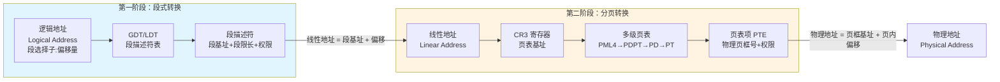
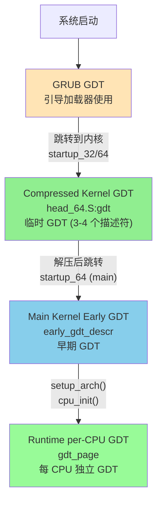

# GDT 详解：从保护模式到长模式

## 文档定位

本文档详细介绍 x86/x86-64 架构中的 **GDT（Global Descriptor Table，全局描述符表）** 及其在 Linux 内核启动过程中的演化。

**核心内容**：
- GDT 的基础概念与数据结构
- 保护模式与长模式下 GDT 的不同作用
- GDT 与分页机制的协作关系
- Linux 内核启动时 GDT 的完整演化流程

**适合读者**：
- 想深入理解 x86 内存管理机制的开发者
- 需要了解内核启动细节的系统程序员
- 对操作系统底层实现感兴趣的学习者

**相关文档**：
- [Linux 内核分页机制完整指南](LINUX_PAGING_COMPLETE_GUIDE.md) - GDT 与 Paging 的协作关系
- [Linux 内核启动流程](LINUX_KERNEL_INIT.md) - GDT 在启动流程中的具体使用
- [X86 CPU 模式](X86_CPU_MODES.md) - 实模式、保护模式、长模式

---

## 一、GDT 基础概念

### 1.1 什么是 GDT？

**GDT（Global Descriptor Table，全局描述符表）** 是 x86 架构中用于**段式内存管理**的核心数据结构。它是一个存储在内存中的表，包含多个**段描述符**（Segment Descriptor），每个描述符定义了一个内存段的属性。

```
GDT 在内存中的布局：
┌────────────────────────────────┐ ← GDTR.base (GDT 基址)
│  描述符 0 (NULL)                │  8 字节（必须为 0）
├────────────────────────────────┤
│  描述符 1 (内核代码段)          │  8 字节
├────────────────────────────────┤
│  描述符 2 (内核数据段)          │  8 字节
├────────────────────────────────┤
│  描述符 3 (用户代码段)          │  8 字节
├────────────────────────────────┤
│  描述符 4 (用户数据段)          │  8 字节
├────────────────────────────────┤
│  描述符 5 (TSS)                 │  16 字节（长模式）
├────────────────────────────────┤
│  ...                            │
└────────────────────────────────┘ ← GDTR.base + GDTR.limit
```

### 1.2 段描述符的结构

**32 位保护模式段描述符**（8 字节）：

```
 63                                                                0
┌─────────────────────────────────────────────────────────────────┐
│     Base 31:24  │G│D│L│A│Limit│P│DPL│S│Type│Base 23:16│         │
│                 │ │ │ │V│19:16│ │   │ │    │          │         │ 高 32 位
│─────────────────┴─┴─┴─┴─┴─────┴─┴───┴─┴────┴──────────┴─────────│
│                  Base 15:0              │      Limit 15:0        │ 低 32 位
└─────────────────────────────────────────────────────────────────┘

字段说明：
- Base (32 bits):  段基址（内存起始地址）
- Limit (20 bits): 段限长（段大小 - 1）
- P (1 bit):       Present 位，1=有效，0=无效
- DPL (2 bits):    Descriptor Privilege Level，特权级（0-3，0=Ring 0）
- S (1 bit):       Descriptor Type，0=系统段（如 TSS），1=代码/数据段
- Type (4 bits):   段类型（代码/数据，可读/可写等）
- G (1 bit):       Granularity，0=字节粒度，1=4KB 页粒度
- D/B (1 bit):     32 位段（D=1）或 16 位段（D=0）
- L (1 bit):       Long Mode，64 位代码段（L=1）
- AVL (1 bit):     Available for software use
```

### 1.3 GDTR 寄存器

**GDTR（Global Descriptor Table Register）** 是一个 48 位/80 位寄存器，存储 GDT 的基址和限长：

```
GDTR 结构（32 位模式）：
 47                           16 15                            0
┌───────────────────────────────┬───────────────────────────────┐
│   Base (32 bits)              │   Limit (16 bits)             │
└───────────────────────────────┴───────────────────────────────┘

GDTR 结构（64 位模式）：
 79                                                           16 15                            0
┌──────────────────────────────────────────────────────────────┬───────────────────────────────┐
│   Base (64 bits)                                             │   Limit (16 bits)             │
└──────────────────────────────────────────────────────────────┴───────────────────────────────┘

加载 GDTR：lgdt [gdt_descriptor]
读取 GDTR：sgdt [memory_location]
```

### 1.4 段选择子（Segment Selector）

CPU 通过**段寄存器**（CS、DS、SS、ES、FS、GS）访问段，每个段寄存器存储一个**段选择子**（16 位）：

```
段选择子结构：
 15                                3  2   0
┌───────────────────────────────┬───┬─────┐
│   Index (13 bits)             │TI │ RPL │
└───────────────────────────────┴───┴─────┘

字段说明：
- Index (13 bits): 在 GDT/LDT 中的索引（0-8191）
- TI (1 bit):      Table Indicator，0=GDT，1=LDT
- RPL (2 bits):    Requested Privilege Level（请求特权级）

示例：
CS = 0x0008 = 0000 0000 0000 1000
             = Index=1, TI=0(GDT), RPL=0(Ring 0)
             → 访问 GDT[1]，即内核代码段
```

---

## 二、保护模式下的 GDT

### 2.1 保护模式的核心作用

在 **32 位保护模式** 下，GDT 是内存保护和隔离的核心机制：

1. **内存分段**：将物理内存划分为多个段，每个段有独立的基址、限长
2. **权限隔离**：通过 DPL（描述符特权级）和 CPL（当前特权级）实现 Ring 0-3 隔离
3. **任务切换**：通过 TSS（Task State Segment）支持硬件级任务切换
4. **地址转换第一阶段**：逻辑地址 → 线性地址

### 2.2 地址转换流程

```
保护模式下的完整地址转换：

逻辑地址（段选择子:偏移量）
    ↓
【第一阶段：段式转换 - GDT】
    1. CPU 从段寄存器读取段选择子
    2. 用段选择子索引 GDT，获取段描述符
    3. 从段描述符读取段基址（Base）和段限长（Limit）
    4. 检查：偏移量 < Limit？权限检查通过？
    5. 计算：线性地址 = 段基址 + 偏移量
    ↓
线性地址
    ↓
【第二阶段：分页转换 - 页表】（如果 CR0.PG=1）
    6. MMU 通过 CR3 指向的页表遍历
    7. 线性地址 → 物理地址
    ↓
物理地址
```

### 2.3 典型 GDT 示例（保护模式）

```c
// Linux 内核早期 GDT 示例（32 位）
struct gdt_entry {
    uint16_t limit_low;      // Limit 15:0
    uint16_t base_low;       // Base 15:0
    uint8_t  base_middle;    // Base 23:16
    uint8_t  access;         // P, DPL, S, Type
    uint8_t  granularity;    // G, D/B, L, AVL, Limit 19:16
    uint8_t  base_high;      // Base 31:24
} __attribute__((packed));

struct gdt_entry gdt[5] = {
    // 0: NULL 描述符（必须为 0）
    {0, 0, 0, 0, 0, 0},

    // 1: 内核代码段（Ring 0）
    {0xFFFF, 0, 0, 0x9A, 0xCF, 0},  // Base=0, Limit=4GB, DPL=0, Code, 32-bit

    // 2: 内核数据段（Ring 0）
    {0xFFFF, 0, 0, 0x92, 0xCF, 0},  // Base=0, Limit=4GB, DPL=0, Data, 32-bit

    // 3: 用户代码段（Ring 3）
    {0xFFFF, 0, 0, 0xFA, 0xCF, 0},  // Base=0, Limit=4GB, DPL=3, Code, 32-bit

    // 4: 用户数据段（Ring 3）
    {0xFFFF, 0, 0, 0xF2, 0xCF, 0},  // Base=0, Limit=4GB, DPL=3, Data, 32-bit
};
```

**Access 字节解析**：
```
0x9A = 1001 1010
       │││└ ┴──── Type = 1010 (代码段，可读，非一致)
       ││└──────── S = 1 (代码/数据段)
       │└───────── DPL = 00 (Ring 0)
       └────────── P = 1 (Present)

0x92 = 1001 0010
       │││└ ┴──── Type = 0010 (数据段，可写)
       ││└──────── S = 1
       │└───────── DPL = 00
       └────────── P = 1
```

---

## 三、长模式（64 位）下的 GDT

### 3.1 长模式的简化

在 **x86-64 长模式** 下，段式管理被**极大简化**，但 **GDT 仍然必需**：

| 特性 | 保护模式（32 位） | 长模式（64 位） |
|------|-------------------|----------------|
| **段基址** | 可以是任意值 | **CS/DS/ES/SS 强制为 0**，FS/GS 除外 |
| **段限长** | 有效，用于边界检查 | **被忽略**（除代码段 L 位） |
| **逻辑地址 = 线性地址** | 否（需要加段基址） | **是**（因为段基址=0） |
| **GDT 是否必需** | 是 | **是**（虽然简化，但不可缺少） |
| **分页是否必需** | 可选 | **强制**（长模式要求 CR0.PG=1） |

### 3.2 长模式下 GDT 的作用

即使段基址强制为 0，GDT 仍然承担以下**关键职责**：

1. **定义代码段模式**：
   - CS 描述符的 **L 位** = 1 → 64 位代码段
   - CS 描述符的 **L 位** = 0 → 32 位兼容代码段
   - CPU 根据 L 位决定执行 64 位还是 32 位指令

2. **特权级控制**：
   - 段描述符的 **DPL** 用于权限检查（Ring 0 vs Ring 3）
   - 系统调用、中断时检查 CPL 与 DPL 的关系

3. **TSS 管理**：
   - 长模式下 TSS 主要存储**内核栈指针**（IST，Interrupt Stack Table）
   - 中断/异常/系统调用从用户态陷入时，CPU 从 TSS 加载内核栈
   - TSS 描述符必须在 GDT 中，并用 `ltr` 指令加载

4. **FS/GS 段基址**：
   - FS/GS 的段基址通过 MSR 寄存器设置（不再从 GDT 读取）
   - 但仍需要 GDT 中有对应的描述符

5. **系统状态标识**：
   - GDT 的存在是 CPU 判断处于保护模式/长模式的重要标志

### 3.3 极简长模式 GDT 示例

```asm
# Linux 内核 compressed kernel 的临时 GDT
# arch/x86/boot/compressed/head_64.S

    .data
gdt:
    .word   gdt_end - gdt - 1       # GDT limit
    .long   0                       # GDT base (会在运行时填充)
    .word   0                       # 对齐

    .quad   0x0000000000000000      # 0: NULL 描述符
    .quad   0x00cf9a000000ffff      # 1: __KERNEL32_CS (32-bit code, Ring 0)
    .quad   0x00af9a000000ffff      # 2: __KERNEL_CS (64-bit code, Ring 0)
    .quad   0x00cf92000000ffff      # 3: __KERNEL_DS (data, Ring 0)
gdt_end:

# 段选择子定义
__KERNEL32_CS = 0x08  # GDT[1]，32 位代码段
__KERNEL_CS   = 0x10  # GDT[2]，64 位代码段
__KERNEL_DS   = 0x18  # GDT[3]，数据段
```

**关键点解析**：

```
__KERNEL_CS = 0x00af9a000000ffff
              = 0000 0000 1010 1111 1001 1010 ... (64 位)

关键字段：
- L = 1  (第 53 位) → 64 位代码段
- P = 1  (第 47 位) → Present
- DPL = 00 (第 46-45 位) → Ring 0
- Type = 1010 → 代码段，可读
- Base = 0 (强制)
- Limit = 被忽略
```

### 3.4 长模式 TSS 描述符

长模式下 TSS 描述符占用 **16 字节**（两个 GDT 表项）：

```
TSS 描述符（16 字节）：
 127                                                             64
┌──────────────────────────────────────────────────────────────┐
│                     Reserved (must be 0)                     │ 高 64 位
├──────────────────────────────────────────────────────────────┤
│  Base 31:24 │G│ │L│A│Limit│P│DPL│0│Type│Base 23:16│ ...      │ 低 64 位
└──────────────────────────────────────────────────────────────┘

Type = 1001 (64-bit TSS, Available)
Type = 1011 (64-bit TSS, Busy)
```

---

## 四、GDT 与分页的协作关系

### 4.1 两阶段地址转换

在 x86 架构中，**从逻辑地址到物理地址需要经过两个独立的转换阶段**，分别由 **GDT（段式管理）** 和 **页表（分页管理）** 完成：



### 4.2 启动时的顺序依赖

**为什么必须先 lgdt，再启用分页？**

从内核启动流程可以看到 **GDT 和分页的严格顺序依赖**：

```
【阶段 1】段式管理初始化（32 位保护模式）
    1. lgdt gdt            ← 加载 GDT
    2. 设置段寄存器         ← DS/ES/FS/GS/SS = __BOOT_DS
    3. 设置栈指针           ← ESP = boot_stack_end（需要 SS 段有效）
    4. lretl               ← 切换到 __KERNEL32_CS 代码段
    ────────── 此时段式管理已生效，CPU 可以正确执行指令和访问栈 ──────────

【阶段 2】分页管理初始化
    5. CR4.PAE = 1         ← 启用物理地址扩展
    6. 构建身份映射页表    ← 在内存中创建页表（需要能访问内存，依赖段和栈）
    7. CR3 = pgtable       ← 加载页表基址
    8. EFER.LME = 1        ← 启用长模式标记
    9. CR0.PG = 1          ← 启用分页
    ────────── 此时分页管理生效，进入长模式 ──────────

【阶段 3】切换到 64 位长模式
    10. lret               ← 切换到 __KERNEL_CS（64 位代码段，L=1）
```

**关键依赖关系**：

| 依赖关系 | 原因 |
|---------|------|
| **lgdt 必须在 CR0.PG 之前** | 在启用分页之前，CPU 需要能够执行指令、访问栈、读写内存。这些操作都依赖**段寄存器有效**（CS 用于取指、SS 用于栈访问、DS 用于数据访问）。 |
| **栈设置必须在构建页表之前** | 构建页表的代码需要使用栈。而栈需要 **SS 段寄存器指向有效的段描述符**。 |
| **页表构建必须在 CR0.PG 之前** | 启用分页（CR0.PG=1）的瞬间，MMU 就会开始使用 CR3 指向的页表。如果页表未就绪，会立即触发缺页异常或三重故障。 |
| **GDT 必须在进入长模式之前** | 进入长模式时，CPU 会检查：(1) GDT 已加载；(2) CS 指向的代码段 L=1（64 位）；(3) 分页已启用。缺少任何一项都会导致异常。 |

### 4.3 GDT 与 Paging 的职责分工

| 方面 | **GDT（段式管理）** | **Paging（分页管理）** |
|------|---------------------|----------------------|
| **地址转换阶段** | 第一阶段：逻辑地址 → 线性地址 | 第二阶段：线性地址 → 物理地址 |
| **控制寄存器** | GDTR（存储 GDT 基址和长度） | CR3（存储页表基址） |
| **数据结构** | GDT 表（每项 8/16 字节） | 多级页表（每项 8 字节） |
| **主要用途（保护模式）** | 内存分段、权限隔离、任务切换 | 虚拟内存、物理页框管理、进程隔离 |
| **主要用途（长模式）** | 系统状态（64/32 位模式）、特权级、TSS | **虚拟内存的核心机制**，强制启用 |
| **粒度** | 段（可变大小，0 到 4GB） | 页（固定大小，4KB/2MB/1GB） |
| **异常** | #GP（一般保护异常） | #PF（缺页异常） |
| **是否可选（长模式）** | **必需** | **必需** |

---

## 五、Linux 内核启动时的 GDT 演化

### 5.1 GDT 演化概览

Linux 内核启动过程中，GDT 经历了 **4 个主要阶段**的演化：



### 5.2 阶段 1：GRUB GDT

**位置**：GRUB 引导加载器内部

**用途**：
- GRUB 自己的执行环境
- 加载内核镜像到内存
- 准备 boot_params 并跳转到内核入口点

**特点**：
- 由 GRUB 管理，内核不可见
- 在跳转到内核前仍然有效（内核依赖它执行最初的几条指令）

### 5.3 阶段 2：Compressed Kernel GDT

**位置**：`arch/x86/boot/compressed/head_64.S:gdt`

**代码示例**：

```asm
# arch/x86/boot/compressed/head_64.S

startup_32:
    # ... 之前的代码 ...

    # 计算 GDT 物理地址（位置无关代码）
    leal    rva(gdt)(%ebp), %eax
    movl    %eax, 2(%eax)               # 填充 GDT 基址
    lgdt    (%eax)                      # 加载 GDT

    # 设置段寄存器
    movl    $__BOOT_DS, %eax
    movl    %eax, %ds
    movl    %eax, %es
    movl    %eax, %fs
    movl    %eax, %gs
    movl    %eax, %ss

    # 设置栈
    leal    rva(boot_stack_end)(%ebp), %esp

    # 远跳转切换到 __KERNEL32_CS
    leal    rva(1f)(%ebp), %eax
    pushl   $__KERNEL32_CS
    pushl   %eax
    lretl
1:
    # 现在在 32 位保护模式下执行
    # ... 构建页表、启用分页、进入长模式 ...

    .data
gdt:
    .word   gdt_end - gdt - 1       # GDT limit
    .long   0                       # GDT base (运行时填充)
    .word   0                       # 对齐

    .quad   0x0000000000000000      # 0: NULL
    .quad   0x00cf9a000000ffff      # 1: __KERNEL32_CS
    .quad   0x00af9a000000ffff      # 2: __KERNEL_CS
    .quad   0x00cf92000000ffff      # 3: __KERNEL_DS (__BOOT_DS)
    .quad   0x0080890000000000      # 4: __BOOT_TSS
gdt_end:
```

**特点**：
- **临时性质**：只在解压内核期间使用
- **最小化**：只有 4-5 个描述符
- **位置无关**：使用 `rva()` 宏计算相对地址

### 5.4 阶段 3：Main Kernel Early GDT

**位置**：`arch/x86/kernel/head_64.S:early_gdt_descr`

**代码示例**：

```asm
# arch/x86/kernel/head_64.S

early_gdt_descr:
    .word   GDT_ENTRIES*8-1
early_gdt_descr_base:
    .quad   INIT_PER_CPU_VAR(gdt_page)

# 初始化 GDT 页面
    .align L1_CACHE_BYTES
ENTRY(early_gdt)
    .quad   0x0000000000000000      # NULL descriptor
    .quad   0x00af9b000000ffff      # __KERNEL_CS
    .quad   0x00cf93000000ffff      # __KERNEL_DS
    .quad   0x00cffb000000ffff      # __USER32_CS
    .quad   0x00cff3000000ffff      # __USER_DS
    .quad   0x00affb000000ffff      # __USER_CS
    # ... 更多描述符 ...
END(early_gdt)
```

**特点**：
- 在 `startup_64`（main kernel）中加载
- 比 compressed kernel GDT 更完整
- 仍是静态的、全局共享的

### 5.5 阶段 4：Runtime per-CPU GDT

**位置**：`arch/x86/kernel/cpu/common.c:gdt_page`

**代码示例**：

```c
// arch/x86/kernel/cpu/common.c

DEFINE_PER_CPU_PAGE_ALIGNED(struct gdt_page, gdt_page) = {
    .gdt = {
        [GDT_ENTRY_KERNEL32_CS]     = GDT_ENTRY_INIT(0xc09b, 0, 0xfffff),
        [GDT_ENTRY_KERNEL_CS]       = GDT_ENTRY_INIT(0xa09b, 0, 0xfffff),
        [GDT_ENTRY_KERNEL_DS]       = GDT_ENTRY_INIT(0xc093, 0, 0xfffff),
        [GDT_ENTRY_DEFAULT_USER32_CS] = GDT_ENTRY_INIT(0xc0fb, 0, 0xfffff),
        [GDT_ENTRY_DEFAULT_USER_DS] = GDT_ENTRY_INIT(0xc0f3, 0, 0xfffff),
        [GDT_ENTRY_DEFAULT_USER_CS] = GDT_ENTRY_INIT(0xa0fb, 0, 0xfffff),
        // ... 更多描述符 ...
        // TSS, LDT, per-CPU segments, etc.
    },
};

void cpu_init(void)
{
    int cpu = smp_processor_id();
    struct tss_struct *t = &per_cpu(cpu_tss_rw, cpu);

    // 加载 per-CPU GDT
    load_direct_gdt(cpu);

    // 加载 TSS
    load_sp0(t, &init_task);
    load_TR_desc();

    // 加载 IDT
    load_current_idt();

    // ...
}
```

**特点**：
- **per-CPU**：每个 CPU 有独立的 GDT 副本
- **完整**：包含所有运行时需要的描述符
- **动态**：可以在运行时修改（如 TSS、LDT）

### 5.6 GDT 演化时间表

| 阶段 | 时间节点 | GDT 来源 | 描述符数量 | 用途 |
|------|---------|---------|----------|------|
| **1. GRUB GDT** | GRUB 执行期间 | GRUB 内部 | 3-4 个 | 引导加载器执行环境 |
| **2. Compressed Kernel GDT** | `startup_32` → `startup_64` (compressed) | `head_64.S:gdt` | 4-5 个 | 解压内核、启用分页、进入长模式 |
| **3. Main Kernel Early GDT** | `startup_64` (main) → `cpu_init()` | `early_gdt_descr` | 10+ 个 | 内核早期初始化 |
| **4. Runtime per-CPU GDT** | `cpu_init()` 之后 | `gdt_page` (per-CPU) | 完整 | 运行时环境，每 CPU 独立 |

---

## 六、实战示例：查看当前 GDT

### 6.1 使用 GDB 查看 GDT

```gdb
# 在 QEMU + GDB 调试环境中

# 读取 GDTR
(gdb) info registers gdtr
gdtr           {base=0xffffffff82bc9000, limit=0x7f}

# 查看 GDT 内容（16 个描述符，每个 8 字节）
(gdb) x/16gx 0xffffffff82bc9000
0xffffffff82bc9000:  0x0000000000000000  0x00af9b000000ffff
0xffffffff82bc9010:  0x00cf93000000ffff  0x00cffb000000ffff
0xffffffff82bc9020:  0x00cff3000000ffff  0x00affb000000ffff
0xffffffff82bc9030:  0x0000000000000000  0x0000000000000000
...

# 解析第一个代码段描述符（__KERNEL_CS）
0x00af9b000000ffff
= 0000 0000 1010 1111 1001 1011 ...
  │         │       │   │
  │         │       │   └─ Type = 1011 (代码段，可读，已访问)
  │         │       └───── DPL = 00 (Ring 0)
  │         └─────────────── L = 1 (64 位代码段)
  └──────────────────────────── P = 1 (Present)
```

### 6.2 使用 /proc/cpuinfo 查看 GDT 信息

```bash
# 内核启动后，可以通过 /proc 查看一些 GDT 相关信息

$ cat /proc/cpuinfo | grep -i flags
flags: ... lm ... # lm = Long Mode，表示 64 位模式支持

# 查看当前 CPU 的 GDT 基址（需要 root 权限和特殊模块）
$ sudo rdmsr 0xC0000100  # IA32_FS_BASE (FS 段基址，通过 MSR)
```

---

## 七、常见问题解答

### Q1: 长模式下段基址强制为 0，为什么还需要 GDT？

**答**：虽然 CS/DS/ES/SS 的段基址被强制为 0，段式转换被"透明化"，但 GDT 仍然承担以下**不可替代的职责**：

1. **定义 CPU 运行模式**：CS 描述符的 L 位决定 64 位还是 32 位兼容模式
2. **特权级检查**：DPL 用于 Ring 0/3 权限隔离
3. **TSS 支持**：中断/系统调用时切换内核栈
4. **FS/GS 段**：虽然基址通过 MSR 设置，但仍需 GDT 中有描述符
5. **系统状态**：GDT 是 CPU 判断处于保护模式/长模式的标志

### Q2: 为什么要有 per-CPU GDT？

**答**：主要原因：

1. **TSS 隔离**：每个 CPU 需要独立的 TSS 描述符，指向该 CPU 的 TSS（存储该 CPU 的内核栈指针）
2. **并发安全**：避免多个 CPU 同时修改共享 GDT 导致的竞态条件
3. **性能优化**：CPU 本地的 GDT 可以更好地利用 CPU 缓存

### Q3: GDT 的大小限制是多少？

**答**：

- GDTR 的 Limit 字段是 16 位 → 最大值 0xFFFF (65535)
- 每个描述符 8 字节 → 最多 65536 / 8 = **8192 个描述符**
- 实际上 Linux 内核只使用约 10-30 个描述符

### Q4: 可以在运行时修改 GDT 吗？

**答**：可以，但需要注意：

1. **修改 GDT 表**：可以直接修改内存中的 GDT 内容
2. **重新加载**：修改后需要 `lgdt` 重新加载 GDTR
3. **刷新段寄存器**：修改描述符后需要重新加载相应的段寄存器
4. **并发安全**：多核系统需要考虑同步问题

```c
// 示例：修改 GDT 中的 TSS 描述符
void update_tss_descriptor(int cpu, unsigned long base, unsigned long limit) {
    struct desc_struct *gdt = get_cpu_gdt_table(cpu);
    set_tssldt_descriptor(&gdt[GDT_ENTRY_TSS], base, limit,
                          DESC_TSS | DESC_P | DESC_DPL3);
    load_TR_desc();  // 重新加载 TR 寄存器
}
```

---

## 八、参考文档

### 核心相关文档

- **[LINUX_PAGING_COMPLETE_GUIDE.md](LINUX_PAGING_COMPLETE_GUIDE.md)** - Linux 内核分页机制完整指南（包含 GDT 与分页的协作关系）
- **[LINUX_KERNEL_INIT.md](LINUX_KERNEL_INIT.md)** - Linux 内核启动流程（GDT 在启动中的使用）
- **[X86_CPU_MODES.md](X86_CPU_MODES.md)** - x86 CPU 模式详解

### 架构参考

- **[X86_NEAR_VS_LONG_JUMP.md](X86_NEAR_VS_LONG_JUMP.md)** - long mode 下 CS 段选择子的作用
- **Intel® 64 and IA-32 Architectures Software Developer's Manual** - Volume 3, Chapter 3: Protected-Mode Memory Management

### 源码参考

| 文件 | 说明 |
|------|------|
| `arch/x86/boot/compressed/head_64.S` | Compressed kernel GDT 定义 |
| `arch/x86/kernel/head_64.S` | Main kernel early GDT |
| `arch/x86/kernel/cpu/common.c` | per-CPU GDT 初始化 |
| `arch/x86/include/asm/segment.h` | GDT 段选择子宏定义 |
| `arch/x86/include/asm/desc_defs.h` | GDT 描述符数据结构 |

---

**文档版本**：基于 Linux 内核 v6.x 源码整理
**最后更新**：2026-02
**维护者**：Linux 内核启动文档项目
