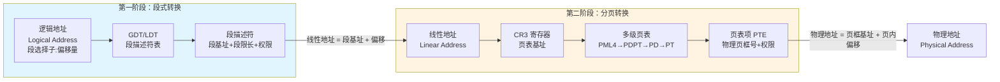
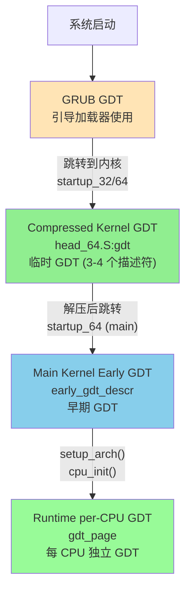
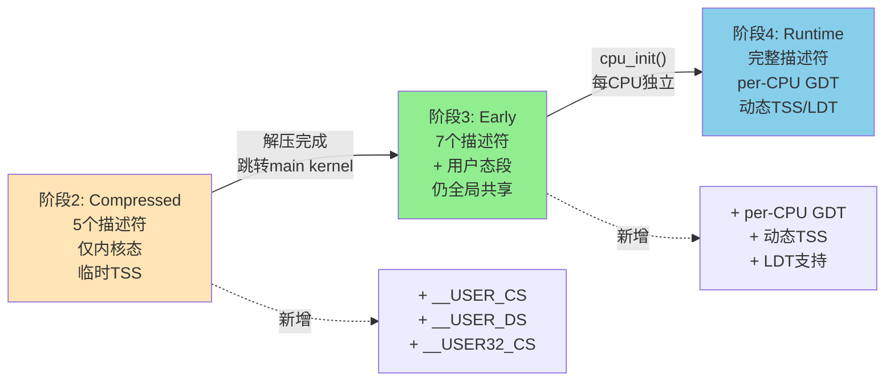

# GDT 详解：从保护模式到长模式

## 文档定位

本文档详细介绍 x86/x86-64 架构中的 **GDT（Global Descriptor Table，全局描述符表）** 及其在 Linux 内核启动过程中的演化。

**核心内容**：
- GDT 的基础概念与数据结构
- 保护模式与长模式下 GDT 的不同作用
- GDT 与分页机制的协作关系
- Linux 内核启动时 GDT 的完整演化流程

**适合读者**：
- 想深入理解 x86 内存管理机制的开发者
- 需要了解内核启动细节的系统程序员
- 对操作系统底层实现感兴趣的学习者

**相关文档**：
- [Linux 内核分页机制完整指南](LINUX_PAGING_COMPLETE_GUIDE.md) - GDT 与 Paging 的协作关系
- [Linux 内核启动流程](LINUX_KERNEL_INIT.md) - GDT 在启动流程中的具体使用
- [X86 CPU 模式](X86_CPU_MODES.md) - 实模式、保护模式、长模式

---

## 一、GDT 基础概念

### 1.1 什么是 GDT？

**GDT（Global Descriptor Table，全局描述符表）** 是 x86 架构中用于**段式内存管理**的核心数据结构。它是一个存储在内存中的表，包含多个**段描述符**（Segment Descriptor），每个描述符定义了一个内存段的属性。

```
GDT 在内存中的布局：
┌────────────────────────────────┐ ← GDTR.base (GDT 基址)
│  描述符 0 (NULL)                │  8 字节（必须为 0）
├────────────────────────────────┤
│  描述符 1 (内核代码段)          │  8 字节
├────────────────────────────────┤
│  描述符 2 (内核数据段)          │  8 字节
├────────────────────────────────┤
│  描述符 3 (用户代码段)          │  8 字节
├────────────────────────────────┤
│  描述符 4 (用户数据段)          │  8 字节
├────────────────────────────────┤
│  描述符 5 (TSS)                 │  16 字节（长模式）
├────────────────────────────────┤
│  ...                            │
└────────────────────────────────┘ ← GDTR.base + GDTR.limit
```

### 1.2 段描述符的结构

**32 位保护模式段描述符**（8 字节）：

```
 63                                                                0
┌─────────────────────────────────────────────────────────────────┐
│     Base 31:24  │G│D│L│A│Limit│P│DPL│S│Type│Base 23:16│         │
│                 │ │ │ │V│19:16│ │   │ │    │          │         │ 高 32 位
│─────────────────┴─┴─┴─┴─┴─────┴─┴───┴─┴────┴──────────┴─────────│
│                  Base 15:0              │      Limit 15:0       │ 低 32 位
└─────────────────────────────────────────────────────────────────┘

字段说明：
- Base (32 bits):  段基址（内存起始地址）
- Limit (20 bits): 段限长（段大小 - 1）
- P (1 bit):       Present 位，1=有效，0=无效
- DPL (2 bits):    Descriptor Privilege Level，特权级（0-3，0=Ring 0）
- S (1 bit):       Descriptor Type，0=系统段（如 TSS），1=代码/数据段
- Type (4 bits):   段类型（代码/数据，可读/可写等）
- G (1 bit):       Granularity，0=字节粒度，1=4KB 页粒度
- D/B (1 bit):     32 位段（D=1）或 16 位段（D=0）
- L (1 bit):       Long Mode，64 位代码段（L=1）
- AVL (1 bit):     Available for software use
```

### 1.3 GDTR 寄存器

**GDTR（Global Descriptor Table Register）** 是一个 48 位/80 位寄存器，存储 GDT 的基址和限长：

```
GDTR 结构（32 位模式）：
 47                           16 15                            0
┌───────────────────────────────┬───────────────────────────────┐
│   Base (32 bits)              │   Limit (16 bits)             │
└───────────────────────────────┴───────────────────────────────┘

GDTR 结构（64 位模式）：
 79                                                           16 15                            0
┌──────────────────────────────────────────────────────────────┬───────────────────────────────┐
│   Base (64 bits)                                             │   Limit (16 bits)             │
└──────────────────────────────────────────────────────────────┴───────────────────────────────┘

加载 GDTR：lgdt [gdt_descriptor]
读取 GDTR：sgdt [memory_location]
```

### 1.4 段选择子（Segment Selector）

CPU 通过**段寄存器**（CS、DS、SS、ES、FS、GS）访问段，每个段寄存器存储一个**段选择子**（16 位）：

```
段选择子结构：
 15                                3  2   0
┌───────────────────────────────┬───┬─────┐
│   Index (13 bits)             │TI │ RPL │
└───────────────────────────────┴───┴─────┘

字段说明：
- Index (13 bits): 在 GDT/LDT 中的索引（0-8191）
- TI (1 bit):      Table Indicator，0=GDT，1=LDT
- RPL (2 bits):    Requested Privilege Level（请求特权级）

示例：
CS = 0x0008 = 0000 0000 0000 1000
             = Index=1, TI=0(GDT), RPL=0(Ring 0)
             → 访问 GDT[1]，即内核代码段
```

---

## 二、保护模式下的 GDT

### 2.1 保护模式的核心作用

在 **32 位保护模式** 下，GDT 是内存保护和隔离的核心机制：

1. **内存分段**：将物理内存划分为多个段，每个段有独立的基址、限长
2. **权限隔离**：通过 DPL（描述符特权级）和 CPL（当前特权级）实现 Ring 0-3 隔离
3. **任务切换**：通过 TSS（Task State Segment）支持硬件级任务切换
4. **地址转换第一阶段**：逻辑地址 → 线性地址

### 2.2 地址转换流程

```
保护模式下的完整地址转换：

逻辑地址（段选择子:偏移量）
    ↓
【第一阶段：段式转换 - GDT】
    1. CPU 从段寄存器读取段选择子
    2. 用段选择子索引 GDT，获取段描述符
    3. 从段描述符读取段基址（Base）和段限长（Limit）
    4. 检查：偏移量 < Limit？权限检查通过？
    5. 计算：线性地址 = 段基址 + 偏移量
    ↓
线性地址
    ↓
【第二阶段：分页转换 - 页表】（如果 CR0.PG=1）
    6. MMU 通过 CR3 指向的页表遍历
    7. 线性地址 → 物理地址
    ↓
物理地址
```

### 2.3 典型 GDT 示例（保护模式）

```c
// Linux 内核早期 GDT 示例（32 位）
struct gdt_entry {
    uint16_t limit_low;      // Limit 15:0
    uint16_t base_low;       // Base 15:0
    uint8_t  base_middle;    // Base 23:16
    uint8_t  access;         // P, DPL, S, Type
    uint8_t  granularity;    // G, D/B, L, AVL, Limit 19:16
    uint8_t  base_high;      // Base 31:24
} __attribute__((packed));

struct gdt_entry gdt[5] = {
    // 0: NULL 描述符（必须为 0）
    {0, 0, 0, 0, 0, 0},

    // 1: 内核代码段（Ring 0）
    {0xFFFF, 0, 0, 0x9A, 0xCF, 0},  // Base=0, Limit=4GB, DPL=0, Code, 32-bit

    // 2: 内核数据段（Ring 0）
    {0xFFFF, 0, 0, 0x92, 0xCF, 0},  // Base=0, Limit=4GB, DPL=0, Data, 32-bit

    // 3: 用户代码段（Ring 3）
    {0xFFFF, 0, 0, 0xFA, 0xCF, 0},  // Base=0, Limit=4GB, DPL=3, Code, 32-bit

    // 4: 用户数据段（Ring 3）
    {0xFFFF, 0, 0, 0xF2, 0xCF, 0},  // Base=0, Limit=4GB, DPL=3, Data, 32-bit
};
```

**Access 字节解析**：
```
0x9A = 1001 1010
       │││└ ┴──── Type = 1010 (代码段，可读，非一致)
       ││└──────── S = 1 (代码/数据段)
       │└───────── DPL = 00 (Ring 0)
       └────────── P = 1 (Present)

0x92 = 1001 0010
       │││└ ┴──── Type = 0010 (数据段，可写)
       ││└──────── S = 1
       │└───────── DPL = 00
       └────────── P = 1
```

---

## 三、长模式（64 位）下的 GDT

### 3.1 长模式的简化

在 **x86-64 长模式** 下，段式管理被**极大简化**，但 **GDT 仍然必需**：

| 特性 | 保护模式（32 位） | 长模式（64 位） |
|------|-------------------|----------------|
| **段基址** | 可以是任意值 | **CS/DS/ES/SS 强制为 0**，FS/GS 除外 |
| **段限长** | 有效，用于边界检查 | **被忽略**（除代码段 L 位） |
| **逻辑地址 = 线性地址** | 否（需要加段基址） | **是**（因为段基址=0） |
| **GDT 是否必需** | 是 | **是**（虽然简化，但不可缺少） |
| **分页是否必需** | 可选 | **强制**（长模式要求 CR0.PG=1） |

### 3.2 长模式下 GDT 的作用

即使段基址强制为 0，GDT 仍然承担以下**关键职责**：

1. **定义代码段模式**：
   - CS 描述符的 **L 位** = 1 → 64 位代码段
   - CS 描述符的 **L 位** = 0 → 32 位兼容代码段
   - CPU 根据 L 位决定执行 64 位还是 32 位指令

2. **特权级控制**：
   - 段描述符的 **DPL** 用于权限检查（Ring 0 vs Ring 3）
   - 系统调用、中断时检查 CPL 与 DPL 的关系

3. **TSS 管理**：
   - 长模式下 TSS 主要存储**内核栈指针**（IST，Interrupt Stack Table）
   - 中断/异常/系统调用从用户态陷入时，CPU 从 TSS 加载内核栈
   - TSS 描述符必须在 GDT 中，并用 `ltr` 指令加载

4. **FS/GS 段基址**：
   - FS/GS 的段基址通过 MSR 寄存器设置（不再从 GDT 读取）
   - 但仍需要 GDT 中有对应的描述符

5. **系统状态标识**：
   - GDT 的存在是 CPU 判断处于保护模式/长模式的重要标志

### 3.3 极简长模式 GDT 示例

```asm
# Linux 内核 compressed kernel 的临时 GDT
# arch/x86/boot/compressed/head_64.S

    .data
gdt:
    .word   gdt_end - gdt - 1       # GDT limit
    .long   0                       # GDT base (会在运行时填充)
    .word   0                       # 对齐

    .quad   0x0000000000000000      # 0: NULL 描述符
    .quad   0x00cf9a000000ffff      # 1: __KERNEL32_CS (32-bit code, Ring 0)
    .quad   0x00af9a000000ffff      # 2: __KERNEL_CS (64-bit code, Ring 0)
    .quad   0x00cf92000000ffff      # 3: __KERNEL_DS (data, Ring 0)
gdt_end:

# 段选择子定义
__KERNEL32_CS = 0x08  # GDT[1]，32 位代码段
__KERNEL_CS   = 0x10  # GDT[2]，64 位代码段
__KERNEL_DS   = 0x18  # GDT[3]，数据段
```

**关键点解析**：

```
__KERNEL_CS = 0x00af9a000000ffff
              = 0000 0000 1010 1111 1001 1010 ... (64 位)

关键字段：
- L = 1  (第 53 位) → 64 位代码段
- P = 1  (第 47 位) → Present
- DPL = 00 (第 46-45 位) → Ring 0
- Type = 1010 → 代码段，可读
- Base = 0 (强制)
- Limit = 被忽略
```

### 3.4 长模式 TSS 描述符

长模式下 TSS 描述符占用 **16 字节**（两个 GDT 表项）：

```
TSS 描述符（16 字节）：
 127                                                             64
┌──────────────────────────────────────────────────────────────┐
│                     Reserved (must be 0)                     │ 高 64 位
├──────────────────────────────────────────────────────────────┤
│  Base 31:24 │G│ │L│A│Limit│P│DPL│0│Type│Base 23:16│ ...      │ 低 64 位
└──────────────────────────────────────────────────────────────┘

Type = 1001 (64-bit TSS, Available)
Type = 1011 (64-bit TSS, Busy)
```

---

## 四、GDT 与分页的协作关系

### 4.1 两阶段地址转换

在 x86 架构中，**从逻辑地址到物理地址需要经过两个独立的转换阶段**，分别由 **GDT（段式管理）** 和 **页表（分页管理）** 完成：



### 4.2 启动时的顺序依赖

**为什么必须先 lgdt，再启用分页？**

从内核启动流程可以看到 **GDT 和分页的严格顺序依赖**：

```
【阶段 1】段式管理初始化（32 位保护模式）
    1. lgdt gdt            ← 加载 GDT
    2. 设置段寄存器         ← DS/ES/FS/GS/SS = __BOOT_DS
    3. 设置栈指针           ← ESP = boot_stack_end（需要 SS 段有效）
    4. lretl               ← 切换到 __KERNEL32_CS 代码段
    ────────── 此时段式管理已生效，CPU 可以正确执行指令和访问栈 ──────────

【阶段 2】分页管理初始化
    5. CR4.PAE = 1         ← 启用物理地址扩展
    6. 构建身份映射页表    ← 在内存中创建页表（需要能访问内存，依赖段和栈）
    7. CR3 = pgtable       ← 加载页表基址
    8. EFER.LME = 1        ← 启用长模式标记
    9. CR0.PG = 1          ← 启用分页
    ────────── 此时分页管理生效，进入长模式 ──────────

【阶段 3】切换到 64 位长模式
    10. lret               ← 切换到 __KERNEL_CS（64 位代码段，L=1）
```

**关键依赖关系**：

| 依赖关系 | 原因 |
|---------|------|
| **lgdt 必须在 CR0.PG 之前** | 在启用分页之前，CPU 需要能够执行指令、访问栈、读写内存。这些操作都依赖**段寄存器有效**（CS 用于取指、SS 用于栈访问、DS 用于数据访问）。 |
| **栈设置必须在构建页表之前** | 构建页表的代码需要使用栈。而栈需要 **SS 段寄存器指向有效的段描述符**。 |
| **页表构建必须在 CR0.PG 之前** | 启用分页（CR0.PG=1）的瞬间，MMU 就会开始使用 CR3 指向的页表。如果页表未就绪，会立即触发缺页异常或三重故障。 |
| **GDT 必须在进入长模式之前** | 进入长模式时，CPU 会检查：(1) GDT 已加载；(2) CS 指向的代码段 L=1（64 位）；(3) 分页已启用。缺少任何一项都会导致异常。 |

### 4.3 GDT 与 Paging 的职责分工

| 方面 | **GDT（段式管理）** | **Paging（分页管理）** |
|------|---------------------|----------------------|
| **地址转换阶段** | 第一阶段：逻辑地址 → 线性地址 | 第二阶段：线性地址 → 物理地址 |
| **控制寄存器** | GDTR（存储 GDT 基址和长度） | CR3（存储页表基址） |
| **数据结构** | GDT 表（每项 8/16 字节） | 多级页表（每项 8 字节） |
| **主要用途（保护模式）** | 内存分段、权限隔离、任务切换 | 虚拟内存、物理页框管理、进程隔离 |
| **主要用途（长模式）** | 系统状态（64/32 位模式）、特权级、TSS | **虚拟内存的核心机制**，强制启用 |
| **粒度** | 段（可变大小，0 到 4GB） | 页（固定大小，4KB/2MB/1GB） |
| **异常** | #GP（一般保护异常） | #PF（缺页异常） |
| **是否可选（长模式）** | **必需** | **必需** |

---

## 五、Linux 内核启动时的 GDT 演化

### 5.1 GDT 演化概览

Linux 内核启动过程中，GDT 经历了 **4 个主要阶段**的演化：



### 5.2 阶段 1：GRUB GDT

**位置**：GRUB 引导加载器内部

**用途**：
- GRUB 自己的执行环境
- 加载内核镜像到内存
- 准备 boot_params 并跳转到内核入口点

**特点**：
- 由 GRUB 管理，内核不可见
- 在跳转到内核前仍然有效（内核依赖它执行最初的几条指令）

### 5.3 阶段 2：Compressed Kernel GDT

**位置**：`arch/x86/boot/compressed/head_64.S:gdt`

**代码示例**：

```asm
# arch/x86/boot/compressed/head_64.S

startup_32:
    # ... 之前的代码 ...

    # 计算 GDT 物理地址（位置无关代码）
    leal    rva(gdt)(%ebp), %eax
    movl    %eax, 2(%eax)               # 填充 GDT 基址
    lgdt    (%eax)                      # 加载 GDT

    # 设置段寄存器
    movl    $__BOOT_DS, %eax
    movl    %eax, %ds
    movl    %eax, %es
    movl    %eax, %fs
    movl    %eax, %gs
    movl    %eax, %ss

    # 设置栈
    leal    rva(boot_stack_end)(%ebp), %esp

    # 远跳转切换到 __KERNEL32_CS
    leal    rva(1f)(%ebp), %eax
    pushl   $__KERNEL32_CS
    pushl   %eax
    lretl
1:
    # 现在在 32 位保护模式下执行
    # ... 构建页表、启用分页、进入长模式 ...

    .data
gdt:
    .word   gdt_end - gdt - 1       # GDT limit
    .long   0                       # GDT base (运行时填充)
    .word   0                       # 对齐

    .quad   0x0000000000000000      # 0: NULL
    .quad   0x00cf9a000000ffff      # 1: __KERNEL32_CS
    .quad   0x00af9a000000ffff      # 2: __KERNEL_CS
    .quad   0x00cf92000000ffff      # 3: __KERNEL_DS (__BOOT_DS)
    .quad   0x0080890000000000      # 4: __BOOT_TSS
gdt_end:
```

**特点**：
- **临时性质**：只在解压内核期间使用
- **最小化**：只有 4-5 个描述符
- **位置无关**：使用 `rva()` 宏计算相对地址

#### 5.3.1 Compressed Kernel GDT 详细解析

**GDT 表结构**：

```
内存布局（gdt 标签处）：
┌────────────────────────────────────────┐
│ +0: .word gdt_end - gdt - 1            │ ← GDTR.limit (GDT 表大小 - 1)
│ +2: .long 0 (运行时填充)                │ ← GDTR.base (32位，运行时写入)
│ +6: .word 0 (对齐)                      │ ← 填充到 8 字节边界
├────────────────────────────────────────┤
│ +8: .quad 0x0000000000000000           │ ← GDT[0]: NULL 描述符（必须为 0）
├────────────────────────────────────────┤
│ +16: .quad 0x00cf9a000000ffff          │ ← GDT[1]: __KERNEL32_CS（索引 1）
├────────────────────────────────────────┤
│ +24: .quad 0x00af9a000000ffff          │ ← GDT[2]: __KERNEL_CS（索引 2）
├────────────────────────────────────────┤
│ +32: .quad 0x00cf92000000ffff          │ ← GDT[3]: __KERNEL_DS（索引 3）
├────────────────────────────────────────┤
│ +40: .quad 0x0080890000000000          │ ← GDT[4]: __BOOT_TSS（索引 4）
└────────────────────────────────────────┘
```

**段选择子定义**（`arch/x86/include/asm/segment.h`）：

```c
#define __KERNEL32_CS   (GDT_ENTRY_KERNEL32_CS*8)    = 1*8 = 0x08
#define __KERNEL_CS     (GDT_ENTRY_KERNEL_CS*8)      = 2*8 = 0x10
#define __KERNEL_DS     (GDT_ENTRY_KERNEL_DS*8)      = 3*8 = 0x18
#define __BOOT_DS       __KERNEL_DS                  = 0x18
#define __BOOT_TSS      (GDT_ENTRY_BOOT_TSS*8)       = 4*8 = 0x20

// 索引计算：段选择子 = GDT索引 × 8（每个描述符 8 字节）
```

**GDT[1]: __KERNEL32_CS = 0x00cf9a000000ffff**

32 位保护模式代码段（用于从 startup_32 到启用长模式之前）

```
十六进制：  0x 00cf 9a00 0000 ffff
二进制拆解：

高 32 位 (0x00cf9a00):
┌────────┬───┬───┬───┬───┬────────┬───┬─────┬───┬──────┬──────────┐
│Base    │ G │D/B│ L │AVL│Limit   │ P │ DPL │ S │ Type │Base      │
│31:24   │   │   │   │   │19:16   │   │     │   │      │23:16     │
├────────┼───┼───┼───┼───┼────────┼───┼─────┼───┼──────┼──────────┤
│00000000│ 1 │ 1 │ 0 │ 0 │  1111  │ 1 │ 00  │ 1 │ 1010 │ 00000000 │
│  0x00  │   │   │   │   │  0xF   │   │     │   │ 0xA  │   0x00   │
└────────┴───┴───┴───┴───┴────────┴───┴─────┴───┴──────┴──────────┘

低 32 位 (0x0000ffff):
┌──────────────────┬────────────────┐
│Base 15:0         │Limit 15:0      │
├──────────────────┼────────────────┤
│0000000000000000  │1111111111111111│
│     0x0000       │     0xFFFF     │
└──────────────────┴────────────────┘

字段含义：
- Base = 0x00000000 (段基址 = 0，Flat Model)
- Limit = 0xFFFFF (段限长 = 1048575)
- G = 1 (Granularity = 4KB 页粒度)
  → 实际限长 = (0xFFFFF + 1) × 4KB = 4GB
- D/B = 1 (Default operation size = 32 位)
- L = 0 (Long Mode = 否，这是 32 位代码段)
- AVL = 0 (Available for software use)
- P = 1 (Present = 段有效)
- DPL = 00 (Descriptor Privilege Level = Ring 0)
- S = 1 (Descriptor Type = 代码/数据段，非系统段)
- Type = 1010 (代码段，可执行，可读，非一致)
  ├─ Bit 3 = 1: 可执行 (Executable)
  ├─ Bit 2 = 0: 非一致 (Non-conforming)
  ├─ Bit 1 = 1: 可读 (Readable)
  └─ Bit 0 = 0: 未访问 (Not accessed)
```

**GDT[2]: __KERNEL_CS = 0x00af9a000000ffff**

64 位长模式代码段（用于进入长模式后）

```
十六进制：  0x 00af 9a00 0000 ffff

高 32 位 (0x00af9a00):
┌────────┬───┬───┬───┬───┬────────┬───┬─────┬───┬──────┬──────────┐
│Base    │ G │D/B│ L │AVL│Limit   │ P │ DPL │ S │ Type │Base      │
│31:24   │   │   │   │   │19:16   │   │     │   │      │23:16     │
├────────┼───┼───┼───┼───┼────────┼───┼─────┼───┼──────┼──────────┤
│00000000│ 1 │ 0 │ 1 │ 0 │  1111  │ 1 │ 00  │ 1 │ 1010 │ 00000000 │
│  0x00  │   │   │   │   │  0xF   │   │     │   │ 0xA  │   0x00   │
└────────┴───┴───┴───┴───┴────────┴───┴─────┴───┴──────┴──────────┘

关键区别（与 32 位代码段对比）：
- L = 1 (Long Mode = 是，这是 64 位代码段) ← 关键！
- D/B = 0 (长模式下必须为 0)
- 其他字段与 32 位代码段相同

含义：
当 CS = 0x10（指向此描述符）时，CPU 执行 64 位指令
```

**GDT[3]: __KERNEL_DS = 0x00cf92000000ffff**

数据段（DS/ES/SS 使用）

```
十六进制：  0x 00cf 9200 0000 ffff

高 32 位 (0x00cf9200):
┌────────┬───┬───┬───┬───┬────────┬───┬─────┬───┬──────┬──────────┐
│Base    │ G │D/B│ L │AVL│Limit   │ P │ DPL │ S │ Type │Base      │
│31:24   │   │   │   │   │19:16   │   │     │   │      │23:16     │
├────────┼───┼───┼───┼───┼────────┼───┼─────┼───┼──────┼──────────┤
│00000000│ 1 │ 1 │ 0 │ 0 │  1111  │ 1 │ 00  │ 1 │ 0010 │ 00000000 │
│  0x00  │   │   │   │   │  0xF   │   │     │   │ 0x2  │   0x00   │
└────────┴───┴───┴───┴───┴────────┴───┴─────┴───┴──────┴──────────┘

Type = 0010 (数据段，可写)
  ├─ Bit 3 = 0: 不可执行 (Not executable)
  ├─ Bit 2 = 0: 向上扩展 (Expand-up)
  ├─ Bit 1 = 1: 可写 (Writable)
  └─ Bit 0 = 0: 未访问 (Not accessed)

注意：长模式下段基址被强制为 0，段限长被忽略
```

**GDT[4]: __BOOT_TSS = 0x0080890000000000**

任务状态段（临时，仅用于满足 CPU 要求）

```
十六进制：  0x 0080 8900 0000 0000

高 32 位 (0x00808900):
┌────────┬───┬───┬───┬───┬────────┬───┬─────┬───┬──────┬──────────┐
│Base    │ G │ 0 │ 0 │AVL│Limit   │ P │ DPL │ S │ Type │Base      │
│31:24   │   │   │   │   │19:16   │   │     │   │      │23:16     │
├────────┼───┼───┼───┼───┼────────┼───┼─────┼───┼──────┼──────────┤
│00000000│ 1 │ 0 │ 0 │ 0 │  0000  │ 1 │ 00  │ 0 │ 1001 │ 00000000 │
│  0x00  │   │   │   │   │  0x0   │   │     │   │ 0x9  │   0x00   │
└────────┴───┴───┴───┴───┴────────┴───┴─────┴───┴──────┴──────────┘

低 32 位 (0x00000000):
- Base = 0x00000000
- Limit = 0x00000

Type = 1001 (64-bit TSS, Available)
  ├─ Bit 3 = 1: TSS 类型
  ├─ Bit 2 = 0: (reserved)
  ├─ Bit 1 = 0: (reserved)
  └─ Bit 0 = 1: Available (未被占用)

S = 0: 系统段（TSS、LDT、Gate）
```

#### 5.3.2 关键观察

**为什么需要这些段？**

| 段 | 用途 | 何时使用 |
|---|------|---------|
| **NULL (GDT[0])** | 空描述符 | x86 规范要求，防止空段选择子误用 |
| **__KERNEL32_CS (GDT[1])** | 32 位代码段 | startup_32 → 启用分页前（保护模式） |
| **__KERNEL_CS (GDT[2])** | 64 位代码段 | 启用分页后 → 长模式执行 |
| **__KERNEL_DS (GDT[3])** | 数据段 | DS/ES/SS/FS/GS（全程） |
| **__BOOT_TSS (GDT[4])** | TSS（临时） | 满足进入长模式的 CPU 要求 |

**段切换流程**：

```asm
# 1. 在 32 位保护模式下（CS = __KERNEL32_CS = 0x08）
startup_32:
    lgdt gdt
    movl $__KERNEL_DS, %eax
    movl %eax, %ds              # DS = 0x18 (GDT[3])

    pushl $__KERNEL32_CS        # 0x08
    pushl $1f
    lretl                       # 远跳转，CS = 0x08 (GDT[1], 32-bit)
1:
    # 现在 CPU 在 32 位保护模式，CS.L=0, CS.D=1

# 2. 启用分页并进入长模式
    # ... 构建页表、CR3、EFER.LME、CR0.PG ...

# 3. 切换到 64 位代码段
    pushl $__KERNEL_CS          # 0x10
    leal startup_64, %eax
    pushl %eax
    lretl                       # 远跳转，CS = 0x10 (GDT[2], 64-bit)

startup_64:
    # 现在 CPU 在 64 位长模式，CS.L=1, CS.D=0
```

### 5.4 阶段 3：Main Kernel Early GDT

**位置**：`arch/x86/kernel/head_64.S:early_gdt_descr`

**代码示例**：

```asm
# arch/x86/kernel/head_64.S

early_gdt_descr:
    .word   GDT_ENTRIES*8-1
early_gdt_descr_base:
    .quad   INIT_PER_CPU_VAR(gdt_page)

# 初始化 GDT 页面
    .align L1_CACHE_BYTES
ENTRY(early_gdt)
    .quad   0x0000000000000000      # NULL descriptor
    .quad   0x00af9b000000ffff      # __KERNEL_CS
    .quad   0x00cf93000000ffff      # __KERNEL_DS
    .quad   0x00cffb000000ffff      # __USER32_CS
    .quad   0x00cff3000000ffff      # __USER_DS
    .quad   0x00affb000000ffff      # __USER_CS
    # ... 更多描述符 ...
END(early_gdt)
```

**特点**：
- 在 `startup_64`（main kernel）中加载
- 比 compressed kernel GDT 更完整
- 仍是静态的、全局共享的

#### 5.4.1 Main Kernel Early GDT 详细解析

**加载时机**：`arch/x86/kernel/head_64.S:startup_64` → `startup_64_setup_gdt_idt()`

**GDT 表内容**（基于 `arch/x86/kernel/head_64.S` 和 `arch/x86/kernel/cpu/common.c:gdt_page` 初始值）：

```
GDT 索引与段选择子对应关系：
┌───────┬─────────────────────┬──────────┬────────────────────────────┐
│ 索引  │ 段名                │ 选择子   │ 描述符值 (64位)             │
├───────┼─────────────────────┼──────────┼────────────────────────────┤
│   0   │ NULL                │ 0x00     │ 0x0000000000000000         │
│   1   │ __KERNEL32_CS       │ 0x08     │ 0x00cf9b000000ffff         │
│   2   │ __KERNEL_CS         │ 0x10     │ 0x00af9b000000ffff         │
│   3   │ __KERNEL_DS         │ 0x18     │ 0x00cf93000000ffff         │
│   4   │ __USER32_CS         │ 0x20     │ 0x00cffb000000ffff         │
│   5   │ __USER_DS           │ 0x28     │ 0x00cff3000000ffff         │
│   6   │ __USER_CS           │ 0x30     │ 0x00affb000000ffff         │
│  ...  │ (TSS, LDT 等)       │ ...      │ ...                        │
└───────┴─────────────────────┴──────────┴────────────────────────────┘

注意：段选择子 = 索引 × 8（因为每个描述符 8 字节）
      例如：__KERNEL_CS 索引=2，选择子=2×8=0x10
```

**新增的用户态段描述符详解**：

与 Compressed Kernel GDT 相比，Main Kernel Early GDT 新增了**用户态段**：

**GDT[4]: __USER32_CS = 0x00cffb000000ffff**

32 位用户代码段（用于兼容 32 位应用）

```
十六进制：  0x 00cf fb00 0000 ffff

高 32 位 (0x00cffb00):
┌────────┬───┬───┬───┬───┬────────┬───┬─────┬───┬──────┬──────────┐
│Base    │ G │D/B│ L │AVL│Limit   │ P │ DPL │ S │ Type │Base      │
│31:24   │   │   │   │   │19:16   │   │     │   │      │23:16     │
├────────┼───┼───┼───┼───┼────────┼───┼─────┼───┼──────┼──────────┤
│00000000│ 1 │ 1 │ 0 │ 0 │  1111  │ 1 │ 11  │ 1 │ 1011 │ 00000000 │
│  0x00  │   │   │   │   │  0xF   │   │ ★   │   │ 0xB  │   0x00   │
└────────┴───┴───┴───┴───┴────────┴───┴─────┴───┴──────┴──────────┘

关键区别（与 __KERNEL32_CS 对比）：
- DPL = 11 (Ring 3, 用户态) ← 关键！
  vs __KERNEL32_CS 的 DPL = 00 (Ring 0, 内核态)
- Type = 1011 (代码段，可执行，可读，一致)
  vs __KERNEL32_CS 的 Type = 1010 (非一致)

Type = 1011 解析：
  ├─ Bit 3 = 1: 可执行
  ├─ Bit 2 = 0: 一致性代码段 (Conforming) ← 注意变化
  ├─ Bit 1 = 1: 可读
  └─ Bit 0 = 1: 已访问 (Accessed)

一致性代码段 (Conforming) 含义：
- 允许低特权级代码调用高特权级代码（但不提升权限）
- Linux 实际不使用此特性，设置为一致主要是历史原因
```

**GDT[5]: __USER_DS = 0x00cff3000000ffff**

用户数据段

```
十六进制：  0x 00cf f300 0000 ffff

高 32 位 (0x00cff300):
┌────────┬───┬───┬───┬───┬────────┬───┬─────┬───┬──────┬──────────┐
│Base    │ G │D/B│ L │AVL│Limit   │ P │ DPL │ S │ Type │Base      │
├────────┼───┼───┼───┼───┼────────┼───┼─────┼───┼──────┼──────────┤
│00000000│ 1 │ 1 │ 0 │ 0 │  1111  │ 1 │ 11  │ 1 │ 0011 │ 00000000 │
│  0x00  │   │   │   │   │  0xF   │   │ ★   │   │ 0x3  │   0x00   │
└────────┴───┴───┴───┴───┴────────┴───┴─────┴───┴──────┴──────────┘

- DPL = 11 (Ring 3)
- Type = 0011 (数据段，可写，已访问)
```

**GDT[6]: __USER_CS = 0x00affb000000ffff**

64 位用户代码段

```
十六进制：  0x 00af fb00 0000 ffff

高 32 位 (0x00affb00):
┌────────┬───┬───┬───┬───┬────────┬───┬─────┬───┬──────┬──────────┐
│Base    │ G │D/B│ L │AVL│Limit   │ P │ DPL │ S │ Type │Base      │
├────────┼───┼───┼───┼───┼────────┼───┼─────┼───┼──────┼──────────┤
│00000000│ 1 │ 0 │ 1 │ 0 │  1111  │ 1 │ 11  │ 1 │ 1011 │ 00000000 │
│  0x00  │   │   │ ★ │   │  0xF   │   │ ★   │   │ 0xB  │   0x00   │
└────────┴───┴───┴───┴───┴────────┴───┴─────┴───┴──────┴──────────┘

关键特征：
- L = 1 (64 位长模式代码段)
- DPL = 11 (Ring 3, 用户态)
- 这是用户进程在 64 位模式下执行的代码段
```

#### 5.4.2 内核态 vs 用户态段对比

| 段类型 | 内核态描述符 | 用户态描述符 | 关键区别 |
|--------|-------------|-------------|---------|
| **64位代码** | __KERNEL_CS<br>0x00af9b000000ffff | __USER_CS<br>0x00affb000000ffff | DPL: 00 vs 11<br>Type: 1010 vs 1011 |
| **32位代码** | __KERNEL32_CS<br>0x00cf9b000000ffff | __USER32_CS<br>0x00cffb000000ffff | DPL: 00 vs 11<br>Type: 1010 vs 1011 |
| **数据段** | __KERNEL_DS<br>0x00cf93000000ffff | __USER_DS<br>0x00cff3000000ffff | DPL: 00 vs 11<br>Type: 0010 vs 0011 |

**权限检查机制**：

```
系统调用时的段切换（用户态 → 内核态）：
┌─────────────────────────────────────────────────────────────┐
│ 用户进程执行 syscall 指令                                    │
│ CS = __USER_CS (0x30)，CPL = 3                              │
├─────────────────────────────────────────────────────────────┤
│ CPU 自动切换到内核态：                                       │
│ 1. 保存用户态 RIP, RSP, RFLAGS 到内核栈                     │
│ 2. 从 MSR_LSTAR 加载内核系统调用入口地址                     │
│ 3. CS = __KERNEL_CS (0x10)，CPL = 0                        │
│ 4. SS = __KERNEL_DS (0x18)                                 │
│ 5. RSP 切换到内核栈（从 TSS.RSP0 读取）                      │
├─────────────────────────────────────────────────────────────┤
│ 内核处理系统调用                                             │
├─────────────────────────────────────────────────────────────┤
│ sysretq 返回用户态：                                         │
│ 1. 恢复用户态 RIP, RSP, RFLAGS                              │
│ 2. CS = __USER_CS (0x30)，CPL = 3                          │
│ 3. SS = __USER_DS (0x28)                                   │
└─────────────────────────────────────────────────────────────┘

CPL (Current Privilege Level) 由 CS.RPL 决定
- CS = 0x10 (__KERNEL_CS) → 索引=2, TI=0, RPL=0 → CPL=0
- CS = 0x30 (__USER_CS)   → 索引=6, TI=0, RPL=0 → CPL=0？

注意：实际使用时，段选择子的 RPL 位会被设置：
- 内核加载 CS 时用 0x10（RPL=0）
- 返回用户态时用 0x33（0x30 | 3，RPL=3）
```

### 5.5 阶段 4：Runtime per-CPU GDT

**位置**：`arch/x86/kernel/cpu/common.c:gdt_page`

**代码示例**：

```c
// arch/x86/kernel/cpu/common.c

DEFINE_PER_CPU_PAGE_ALIGNED(struct gdt_page, gdt_page) = {
    .gdt = {
        [GDT_ENTRY_KERNEL32_CS]     = GDT_ENTRY_INIT(0xc09b, 0, 0xfffff),
        [GDT_ENTRY_KERNEL_CS]       = GDT_ENTRY_INIT(0xa09b, 0, 0xfffff),
        [GDT_ENTRY_KERNEL_DS]       = GDT_ENTRY_INIT(0xc093, 0, 0xfffff),
        [GDT_ENTRY_DEFAULT_USER32_CS] = GDT_ENTRY_INIT(0xc0fb, 0, 0xfffff),
        [GDT_ENTRY_DEFAULT_USER_DS] = GDT_ENTRY_INIT(0xc0f3, 0, 0xfffff),
        [GDT_ENTRY_DEFAULT_USER_CS] = GDT_ENTRY_INIT(0xa0fb, 0, 0xfffff),
        // ... 更多描述符 ...
        // TSS, LDT, per-CPU segments, etc.
    },
};

void cpu_init(void)
{
    int cpu = smp_processor_id();
    struct tss_struct *t = &per_cpu(cpu_tss_rw, cpu);

    // 加载 per-CPU GDT
    load_direct_gdt(cpu);

    // 加载 TSS
    load_sp0(t, &init_task);
    load_TR_desc();

    // 加载 IDT
    load_current_idt();

    // ...
}
```

**特点**：
- **per-CPU**：每个 CPU 有独立的 GDT 副本
- **完整**：包含所有运行时需要的描述符
- **动态**：可以在运行时修改（如 TSS、LDT）

#### 5.5.1 Runtime per-CPU GDT 详细解析

**GDT_ENTRY_INIT 宏展开**：

```c
// arch/x86/include/asm/desc_defs.h

// GDT_ENTRY_INIT(flags, base, limit)
// flags: 高 32 位的标志位（G, D/B, L, AVL, P, DPL, S, Type）
// base:  段基址（32 位）
// limit: 段限长（20 位）

#define GDT_ENTRY_INIT(flags, base, limit)          \
{                                                    \
    .a = ((limit) & 0xffff) |                       \
         (((base) & 0xffff) << 16),                 \
    .b = (((base) & 0xff0000) >> 16) |              \
         (((flags) & 0xf0ff) << 8) |                \
         ((limit) & 0xf0000) |                      \
         ((base) & 0xff000000)                      \
}

// 示例展开：GDT_ENTRY_INIT(0xa09b, 0, 0xfffff)
// flags = 0xa09b
// base  = 0
// limit = 0xfffff
//
// .a = (0xfffff & 0xffff) | ((0 & 0xffff) << 16)
//    = 0xffff | 0
//    = 0x0000ffff (低 32 位)
//
// .b = ((0 & 0xff0000) >> 16) |
//      ((0xa09b & 0xf0ff) << 8) |
//      (0xfffff & 0xf0000) |
//      (0 & 0xff000000)
//    = 0 | (0xa09b << 8) | 0xf0000 | 0
//    = 0x00af9b00 (高 32 位)
//
// 完整描述符 = 0x00af9b00_0000ffff
```

**Runtime GDT 完整结构**（`arch/x86/kernel/cpu/common.c`）：

```c
DEFINE_PER_CPU_PAGE_ALIGNED(struct gdt_page, gdt_page) = {
    .gdt = {
        // ===== 索引 0-6：基本段 =====
        [GDT_ENTRY_KERNEL_CS]       = GDT_ENTRY_INIT(0xa09b, 0, 0xfffff),
        [GDT_ENTRY_KERNEL_DS]       = GDT_ENTRY_INIT(0xc093, 0, 0xfffff),
        [GDT_ENTRY_DEFAULT_USER32_CS] = GDT_ENTRY_INIT(0xc0fb, 0, 0xfffff),
        [GDT_ENTRY_DEFAULT_USER_DS] = GDT_ENTRY_INIT(0xc0f3, 0, 0xfffff),
        [GDT_ENTRY_DEFAULT_USER_CS] = GDT_ENTRY_INIT(0xa0fb, 0, 0xfffff),

        // ===== 索引 10-11：特殊段 =====
        [GDT_ENTRY_TSS]             = (动态填充),
        [GDT_ENTRY_LDT]             = (动态填充),

        // ===== 索引 12-15：per-CPU 段（高级功能）=====
        [GDT_ENTRY_PERCPU]          = (可选),
    },
};
```

**flags 字段详解**：

| 段 | flags | 二进制拆解 | 含义 |
|---|-------|-----------|------|
| **KERNEL_CS** | 0xa09b | `1010_0000_1001_1011` | G=1, D=0, L=1, P=1, DPL=00, S=1, Type=1011 |
| **KERNEL_DS** | 0xc093 | `1100_0000_1001_0011` | G=1, D=1, L=0, P=1, DPL=00, S=1, Type=0011 |
| **USER_CS** | 0xa0fb | `1010_0000_1111_1011` | G=1, D=0, L=1, P=1, DPL=11, S=1, Type=1011 |
| **USER_DS** | 0xc0f3 | `1100_0000_1111_0011` | G=1, D=1, L=0, P=1, DPL=11, S=1, Type=0011 |

**flags 字段位域分解**（16 位）：

```
flags = 0xa09b (KERNEL_CS 示例)

二进制：1010 0000 1001 1011

位域分解：
┌───────┬───────┬───────┬───────┬───────┬───────┬───────┬───────┐
│ 15:12 │ 11:8  │  7    │  6:5  │  4    │ 3:0   │       │       │
├───────┼───────┼───────┼───────┼───────┼───────┼───────┼───────┤
│ Limit │ G D L │  P    │ DPL   │  S    │ Type  │       │       │
│ 19:16 │       │       │       │       │       │       │       │
├───────┼───────┼───────┼───────┼───────┼───────┼───────┼───────┤
│ 1010  │ 0 0 0 │  1    │  00   │  1    │ 1011  │       │       │
│  0xA  │       │       │       │       │ 0xB   │       │       │
└───────┴───────┴───────┴───────┴───────┴───────┴───────┴───────┘

实际在描述符中的位置（flags << 8 后）：
┌────────┬───┬───┬───┬───┬────────┬───┬─────┬───┬──────┐
│ 位     │55 │54 │53 │52 │51:48   │47 │46:45│44 │43:40 │
├────────┼───┼───┼───┼───┼────────┼───┼─────┼───┼──────┤
│ 名称   │ G │D/B│ L │AVL│Limit   │ P │ DPL │ S │ Type │
│        │   │   │   │   │19:16   │   │     │   │      │
├────────┼───┼───┼───┼───┼────────┼───┼─────┼───┼──────┤
│ 0xa09b │ 1 │ 0 │ 1 │ 0 │  1010  │ 1 │ 00  │ 1 │ 1011 │
└────────┴───┴───┴───┴───┴────────┴───┴─────┴───┴──────┘
```

**GDT_ENTRY_TSS：任务状态段（动态）**

TSS 在 64 位模式下占用 **16 字节**（2 个 GDT 表项）：

```c
// arch/x86/kernel/cpu/common.c:cpu_init()

void cpu_init(void)
{
    int cpu = smp_processor_id();
    struct tss_struct *tss = &per_cpu(cpu_tss_rw, cpu);

    // 设置 TSS 描述符
    set_tss_desc(cpu, tss);
    // 等效于：
    // gdt[GDT_ENTRY_TSS] = (低 8 字节)
    // gdt[GDT_ENTRY_TSS+1] = (高 8 字节)

    load_TR_desc();  // 加载 TR 寄存器 = GDT_ENTRY_TSS * 8
}
```

**TSS 描述符结构**（16 字节）：

```
低 8 字节（标准系统段描述符格式）：
┌─────────────────────────────────────────────────────────────┐
│ Base[31:24] │ G │ 0 │ 0 │AVL│Limit[19:16]│ P │DPL│0│Type│...│
│                                                              │
│             TSS Base Address (bits 0-31)                    │
│             TSS Limit (bits 0-19)                           │
└─────────────────────────────────────────────────────────────┘

高 8 字节（64 位扩展）：
┌─────────────────────────────────────────────────────────────┐
│                     Reserved (must be 0)                    │
├─────────────────────────────────────────────────────────────┤
│             TSS Base Address (bits 32-63)                   │
└─────────────────────────────────────────────────────────────┘

Type = 1001 (64-bit TSS, Available)
Type = 1011 (64-bit TSS, Busy)

示例（假设 TSS 在 0xFFFF888000010000）：
低 64 位 = 0x8089000010000067
  ├─ Base[31:24]  = 0x00
  ├─ Limit[19:16] = 0x0
  ├─ P = 1, DPL = 00, Type = 1001
  ├─ Base[23:16]  = 0x00
  ├─ Base[15:0]   = 0x0000
  └─ Limit[15:0]  = 0x0067 (104 字节，TSS 结构大小)

高 64 位 = 0x0000000000000000_FFFF8880
  └─ Base[63:32] = 0xFFFF8880
```

#### 5.5.2 per-CPU GDT 的必要性

**为什么每个 CPU 需要独立的 GDT？**

```
传统共享 GDT 的问题：
┌─────────────────────────────────────────────────────────────┐
│ CPU 0                        CPU 1                          │
│                                                              │
│ [中断发生]                   [中断发生]                      │
│ 需要从 TSS 加载内核栈        需要从 TSS 加载内核栈           │
│   ↓                            ↓                            │
│ 读取 GDT[TSS] → RSP          读取 GDT[TSS] → RSP            │
│                                                              │
│ 问题：如果共享 GDT，两个 CPU 会读到同一个 TSS 地址！         │
│       → 栈冲突、数据损坏                                     │
└─────────────────────────────────────────────────────────────┘

per-CPU GDT 解决方案：
┌─────────────────────────────────────────────────────────────┐
│ CPU 0                        CPU 1                          │
│                                                              │
│ GDT_page[CPU0]               GDT_page[CPU1]                 │
│ ├─ GDT[TSS] → TSS_CPU0       ├─ GDT[TSS] → TSS_CPU1         │
│ │  RSP0 = stack_cpu0         │  RSP0 = stack_cpu1           │
│                                                              │
│ [中断] → 加载 stack_cpu0     [中断] → 加载 stack_cpu1       │
│                                                              │
│ ✓ 每个 CPU 有独立的内核栈，无冲突                            │
└─────────────────────────────────────────────────────────────┘
```

**per-CPU GDT 的内存布局**：

```
物理内存中的 per-CPU GDT 区域：
┌─────────────────────────────────────────────────────────────┐
│ CPU 0 GDT (4KB 页对齐)                                       │
│ 地址: 0xFFFF888000001000                                     │
│ ├─ GDT[0]: NULL                                             │
│ ├─ GDT[2]: __KERNEL_CS                                      │
│ ├─ GDT[3]: __KERNEL_DS                                      │
│ ├─ ...                                                      │
│ ├─ GDT[10]: TSS (指向 CPU 0 的 TSS)                         │
│ └─ ...                                                      │
├─────────────────────────────────────────────────────────────┤
│ CPU 1 GDT (4KB 页对齐)                                       │
│ 地址: 0xFFFF888000002000                                     │
│ ├─ GDT[0]: NULL                                             │
│ ├─ GDT[2]: __KERNEL_CS (内容与 CPU 0 相同)                  │
│ ├─ GDT[3]: __KERNEL_DS (内容与 CPU 0 相同)                  │
│ ├─ ...                                                      │
│ ├─ GDT[10]: TSS (指向 CPU 1 的 TSS) ← 不同！                │
│ └─ ...                                                      │
├─────────────────────────────────────────────────────────────┤
│ CPU 2 GDT ...                                               │
└─────────────────────────────────────────────────────────────┘

每个 CPU 的 GDTR 寄存器指向自己的 GDT：
CPU 0: GDTR.base = 0xFFFF888000001000
CPU 1: GDTR.base = 0xFFFF888000002000
```

### 5.6 GDT 与地址映射关系

**重要概念澄清**：GDT 的作用是**段式地址转换**（逻辑地址 → 线性地址），而**线性地址 → 物理地址**由**页表**决定。

```
完整的地址转换链（x86-64）：
┌──────────────┐
│ 逻辑地址      │ (段选择子:偏移量)
│ (CS:RIP)     │
└──────┬───────┘
       │ 【第一阶段：段式转换 - GDT】
       │ 线性地址 = 段基址 (Base) + 偏移量
       ↓
┌──────────────┐
│ 线性地址      │ ← 在 Flat Model 下，段基址=0，所以逻辑地址=线性地址
└──────┬───────┘
       │ 【第二阶段：分页转换 - 页表】
       │ 物理地址 = f(线性地址, 页表映射方式)
       ↓
┌──────────────┐
│ 物理地址      │
└──────────────┘
```

**各阶段的地址映射特点**：

| 阶段 | GDT 段基址 | 逻辑 vs 线性 | 页表映射方式 | 线性 vs 物理 | 综合结果 |
|------|-----------|-------------|-------------|-------------|---------|
| **阶段2<br>Compressed** | **Base=0**<br>(Flat Model) | 逻辑=线性<br>(段偏移量=0) | **身份映射**<br>virt=phys | 线性=物理 | **逻辑=线性=物理** ✓ |
| **阶段3<br>Early** | **Base=0**<br>(Flat Model) | 逻辑=线性 | **身份映射<br>或早期直接映射** | 取决于映射 | 逻辑=线性<br>≠物理（如用直接映射） |
| **阶段4<br>Runtime** | **Base=0**<br>(Flat Model) | 逻辑=线性 | **直接映射**<br>virt=phys+0xFFFF880000000000 | 线性≠物理<br>(偏移 PAGE_OFFSET) | 逻辑=线性<br>≠物理 |

**关键点**：
1. **所有阶段的 GDT 段基址都是 0**（Flat Model），因此**逻辑地址始终等于线性地址**
2. **阶段2（Compressed Kernel）使用身份映射**（identity mapping），因此线性地址 = 物理地址
3. **阶段3-4 逐渐切换到直接映射**（direct mapping），线性地址 = 物理地址 + PAGE_OFFSET

**证据来源**：
- GDT 描述符的 Base 字段全部为 0（见 5.3.1、5.4.1、5.5.1 节的详细拆解）
- 页表映射方式：详见 [Linux 内核分页机制完整指南](LINUX_PAGING_COMPLETE_GUIDE.md) 第二、三部分

---

### 5.7 GDT 演化时间表

| 阶段 | 时间节点 | GDT 来源 | 描述符数量 | 用途 |
|------|---------|---------|----------|------|
| **1. GRUB GDT** | GRUB 执行期间 | GRUB 内部 | 3-4 个 | 引导加载器执行环境 |
| **2. Compressed Kernel GDT** | `startup_32` → `startup_64` (compressed) | `head_64.S:gdt` | 4-5 个 | 解压内核、启用分页、进入长模式 |
| **3. Main Kernel Early GDT** | `startup_64` (main) → `cpu_init()` | `early_gdt_descr` | 10+ 个 | 内核早期初始化 |
| **4. Runtime per-CPU GDT** | `cpu_init()` 之后 | `gdt_page` (per-CPU) | 完整 | 运行时环境，每 CPU 独立 |

### 5.8 各阶段 GDT 核心差异详解

**问题**：各阶段 GDT 的核心不同之处是什么？

#### 5.8.1 阶段 1：GRUB GDT

**核心特点**：
- **所有权**：由 GRUB 完全管理，内核不可见、不可修改
- **生命周期**：仅在 GRUB 执行期间有效，跳转到内核后立即被替换
- **最小功能**：仅支持 GRUB 自己运行所需的最基本段

**典型内容**（3-4 个描述符）：
```
0: NULL 描述符
1: GRUB 代码段（可能是 16位/32位/64位，取决于 GRUB 版本）
2: GRUB 数据段
3: （可选）GRUB TSS
```

**局限性**：
- ❌ 没有用户态段（GRUB 运行在内核态）
- ❌ 没有为 Linux 内核优化
- ❌ 可能使用与 Linux 不兼容的段配置

**为何必须替换**：GRUB GDT 是为引导加载器设计的，不适合内核使用

---

#### 5.8.2 阶段 2：Compressed Kernel GDT

**核心特点**：
- **极简设计**：仅 4-5 个描述符，最小化占用空间
- **仅内核态**：只有 Ring 0 段，没有用户态段（压缩内核不需要）
- **临时 TSS**：包含一个最小 TSS，仅用于满足 CPU 进入长模式的要求
- **32位 + 64位**：同时包含 32位和64位代码段，用于模式切换

**完整内容**（见 5.3.1 节详解）：
```
0: NULL                    0x0000000000000000
1: __KERNEL32_CS (32位)    0x00cf9a000000ffff  ← 保护模式使用
2: __KERNEL_CS (64位)      0x00af9a000000ffff  ← 长模式使用
3: __KERNEL_DS             0x00cf92000000ffff  ← DS/SS/ES
4: __BOOT_TSS (临时)       0x0080890000000000  ← 满足CPU要求
```

**核心差异**：
- ✅ 包含 32位代码段（__KERNEL32_CS）用于启动过程中的 32位保护模式
- ✅ 包含 64位代码段（__KERNEL_CS）用于进入长模式
- ❌ **没有用户态段**（__USER_CS、__USER_DS）
- ⚠️ TSS 是临时的、未初始化的（Base=0, Limit=0）

**为何与阶段3不同**：
- 阶段2 运行在**解压代码**中，不需要支持用户进程
- 仅需支持**内核自身的代码执行**和**模式切换**
- 空间紧张（压缩内核需要尽量小）

---

#### 5.8.3 阶段 3：Main Kernel Early GDT

**核心特点**：
- **首次包含用户态段**：新增 __USER_CS、__USER_DS、__USER32_CS
- **全局共享**：所有 CPU 共享同一个 GDT（early_gdt_descr → gdt_page）
- **更完整**：包含 10+ 个描述符，为内核初始化做准备
- **仍是静态**：GDT 内容在编译时确定，不支持动态修改

**完整内容**（见 5.4.1 节详解）：
```
0: NULL                    0x0000000000000000
1: __KERNEL32_CS (32位)    0x00cf9b000000ffff
2: __KERNEL_CS (64位)      0x00af9b000000ffff
3: __KERNEL_DS             0x00cf93000000ffff
4: __USER32_CS (32位用户)  0x00cffb000000ffff  ← 新增！
5: __USER_DS               0x00cff3000000ffff  ← 新增！
6: __USER_CS (64位用户)    0x00affb000000ffff  ← 新增！
7-N: TSS、LDT 等（占位）
```

**核心差异**：
- ✅ **新增用户态段**（DPL=3），为后续运行用户进程做准备
- ✅ 包含更多预留描述符（为 TSS、LDT 等预留位置）
- ❌ **仍是全局共享**，多个 CPU 使用同一个 GDT
- ⚠️ TSS 描述符存在但可能未完全初始化

**为何与阶段2不同**：
- 内核即将进入 `start_kernel()`，需要为**完整的操作系统功能**做准备
- 需要支持**系统调用**（用户态 → 内核态切换）
- 需要定义**用户态段**，虽然此时还没有用户进程

**为何与阶段4不同**：
- 仍是**全局共享**，不是 per-CPU
- 原因：此时还在**单 CPU 启动阶段**（BSP - Bootstrap Processor）
- 后续在 `cpu_init()` 中才会为每个 CPU 创建独立 GDT

---

#### 5.8.4 阶段 4：Runtime per-CPU GDT

**核心特点**：
- **每 CPU 独立**：每个 CPU 有自己的 GDT 副本（避免竞态、支持热插拔）
- **动态 TSS**：每个 CPU 的 TSS 描述符指向该 CPU 的 TSS 结构（包含独立的内核栈）
- **完全动态**：支持运行时修改（如加载 LDT、更新 TSS）
- **完整功能**：包含所有运行时需要的描述符

**完整内容**（见 5.5.1 节详解）：
```
0: NULL
2: __KERNEL_CS
3: __KERNEL_DS
4: __USER32_CS
5: __USER_DS
6: __USER_CS
10: TSS (16字节) ← 动态！指向 per-CPU TSS 结构
11: LDT          ← 动态！按需加载
12-15: per-CPU 段（可选）
```

**核心差异**：
- ✅ **per-CPU**：每个 CPU 独立的 GDT 副本
- ✅ **动态 TSS**：TSS 描述符在 `cpu_init()` 中初始化，指向真实的 TSS 结构
- ✅ **支持 LDT**：可以为进程加载 LDT（Local Descriptor Table）
- ✅ **并发安全**：每个 CPU 修改自己的 GDT，无需加锁

**per-CPU GDT 的内存布局**（见 5.5.2 节）：
```
CPU 0: GDT @ 0xFFFF888000001000
       └─ TSS[10] → CPU 0 的 TSS @ 0xFFFF888000010000
              └─ RSP0 = CPU 0 的内核栈

CPU 1: GDT @ 0xFFFF888000002000
       └─ TSS[10] → CPU 1 的 TSS @ 0xFFFF888000020000
              └─ RSP0 = CPU 1 的内核栈

CPU 2: GDT @ 0xFFFF888000003000
       └─ TSS[10] → CPU 2 的 TSS @ 0xFFFF888000030000
              └─ RSP0 = CPU 2 的内核栈
```

**为何必须 per-CPU**：
1. **独立内核栈**：每个 CPU 需要独立的 TSS.RSP0（中断/系统调用时切换到的内核栈）
2. **并发安全**：避免多个 CPU 同时修改共享 GDT 导致竞态条件
3. **支持热插拔**：新 CPU 上线时可以动态创建 GDT，CPU 下线时可以释放

---

#### 5.8.5 核心差异总结表

| 特性 | 阶段1<br>GRUB | 阶段2<br>Compressed | 阶段3<br>Early | 阶段4<br>Runtime |
|------|--------------|-------------------|---------------|-----------------|
| **描述符数量** | 3-4 个 | 4-5 个 | 10+ 个 | 完整（~32 个） |
| **用户态段** | ❌ 无 | ❌ 无 | ✅ 有（__USER_CS等） | ✅ 有 |
| **32位代码段** | 取决于GRUB | ✅ 有 | ✅ 有 | ✅ 有 |
| **64位代码段** | 取决于GRUB | ✅ 有 | ✅ 有 | ✅ 有 |
| **TSS 类型** | GRUB专用 | 临时占位 | 静态/未完全初始化 | **动态per-CPU** ✓ |
| **GDT 所有权** | GRUB | 内核临时 | 内核全局 | **每CPU独立** ✓ |
| **是否可修改** | ❌ 否 | ❌ 否（静态） | ❌ 否（静态） | ✅ 是（动态） |
| **并发安全** | N/A | N/A（单CPU） | ❌ 否（共享） | ✅ 是（per-CPU） |
| **支持热插拔** | N/A | N/A | ❌ 否 | ✅ 是 |
| **支持 LDT** | N/A | ❌ 否 | ❌ 否 | ✅ 是 |

**关键演进路线**：
```
阶段1 (GRUB)
    └─ 仅支持引导加载器，内核不可见
       ↓ 替换为 Compressed Kernel GDT
阶段2 (Compressed Kernel)
    └─ 最小化、仅内核态、临时TSS
       ↓ 新增用户态段
阶段3 (Main Kernel Early)
    └─ 全局共享、包含用户态段
       ↓ 为每个CPU创建独立副本
阶段4 (Runtime per-CPU)
    └─ 每CPU独立、动态TSS、完全功能
```

---

### 5.9 各阶段 GDT 内容对比

**段描述符完整对比表**：

| 段名 | 阶段2<br>(Compressed) | 阶段3<br>(Early) | 阶段4<br>(Runtime) | 说明 |
|------|---------------------|-----------------|-------------------|------|
| **NULL** | 0x0000000000000000 | 0x0000000000000000 | 0x0000000000000000 | 必需，所有阶段相同 |
| **__KERNEL32_CS** | 0x00cf9a000000ffff | 0x00cf9b000000ffff | GDT_ENTRY_INIT(0xc09b, 0, 0xfffff)<br>= 0x00cf9b000000ffff | Type 有细微差异<br>(Accessed 位) |
| **__KERNEL_CS** | 0x00af9a000000ffff | 0x00af9b000000ffff | GDT_ENTRY_INIT(0xa09b, 0, 0xfffff)<br>= 0x00af9b000000ffff | 64位代码段<br>所有阶段相似 |
| **__KERNEL_DS** | 0x00cf92000000ffff | 0x00cf93000000ffff | GDT_ENTRY_INIT(0xc093, 0, 0xfffff)<br>= 0x00cf93000000ffff | 数据段 |
| **__USER32_CS** | ❌ 不存在 | 0x00cffb000000ffff | GDT_ENTRY_INIT(0xc0fb, 0, 0xfffff)<br>= 0x00cffb000000ffff | 阶段2无需用户态段 |
| **__USER_DS** | ❌ 不存在 | 0x00cff3000000ffff | GDT_ENTRY_INIT(0xc0f3, 0, 0xfffff)<br>= 0x00cff3000000ffff | 阶段3开始支持 |
| **__USER_CS** | ❌ 不存在 | 0x00affb000000ffff | GDT_ENTRY_INIT(0xa0fb, 0, 0xfffff)<br>= 0x00affb000000ffff | 64位用户代码段 |
| **TSS** | 0x0080890000000000<br>(临时) | ❌ 或临时 | **动态**<br>指向 per-CPU TSS | 阶段4是16字节 |
| **LDT** | ❌ 不存在 | ❌ 不存在 | **动态**<br>按需加载 | 仅 Runtime 支持 |
| **PERCPU** | ❌ 不存在 | ❌ 不存在 | **可选**<br>per-CPU 段 | 高级功能 |

**关键演化点**：



**数值差异说明**：

1. **Accessed 位（Type 的 bit 0）**：
   ```
   阶段2: Type = 1010 (Accessed = 0)
   阶段3/4: Type = 1011 (Accessed = 1)

   含义：CPU 访问过该段后会自动置位
   差异原因：阶段2 GDT 刚创建，未被访问；阶段3/4 初始化时预设为 1
   ```

2. **DPL 差异（用户态 vs 内核态）**：
   ```
   内核段：DPL = 00 (Ring 0)
   用户段：DPL = 11 (Ring 3)

   示例：
   0x00af9b... (__KERNEL_CS) → DPL=00
   0x00affb... (__USER_CS)   → DPL=11 (多了 0x60，即 DPL 两位从 00→11)
   ```

3. **L 位差异（32位 vs 64位）**：
   ```
   32位代码段：L = 0, D/B = 1
   64位代码段：L = 1, D/B = 0

   示例：
   0x00cf9b... (__KERNEL32_CS) → L=0, D=1 (0xCF 的 bit 5=0, bit 6=1)
   0x00af9b... (__KERNEL_CS)   → L=1, D=0 (0xAF 的 bit 5=1, bit 6=0)
   差异：0xCF vs 0xAF = 0010_0000 (bit 5)
   ```

**快速识别技巧**：

```
看十六进制值快速判断段类型：

1. 看高字节第2位（flags 高4位）：
   0x00cf.... → C = 1100 → L=0, D=1 → 32位段
   0x00af.... → A = 1010 → L=1, D=0 → 64位段

2. 看高字节第4位（DPL）：
   0x...9.... → 9 = 1001 → DPL=00 → 内核态
   0x...f.... → F = 1111 → DPL=11 → 用户态

3. 看低半字节（Type）：
   0x.....a.. → A = 1010 → 代码段，不可读（罕见）
   0x.....b.. → B = 1011 → 代码段，可读
   0x.....2.. → 2 = 0010 → 数据段，可写
   0x.....3.. → 3 = 0011 → 数据段，可写，已访问

示例快速识别：
0x00af9b000000ffff
  └─ 0xA → 64位
     └─ 0x9 → 内核态
        └─ 0xB → 代码段可读
           → __KERNEL_CS ✓

0x00cff3000000ffff
  └─ 0xC → 32位
     └─ 0xF → 用户态
        └─ 0x3 → 数据段可写
           → __USER_DS ✓
```

---

## 六、实战示例：查看当前 GDT

### 6.1 使用 GDB 查看 GDT

```gdb
# 在 QEMU + GDB 调试环境中

# 读取 GDTR
(gdb) info registers gdtr
gdtr           {base=0xffffffff82bc9000, limit=0x7f}

# 查看 GDT 内容（16 个描述符，每个 8 字节）
(gdb) x/16gx 0xffffffff82bc9000
0xffffffff82bc9000:  0x0000000000000000  0x00af9b000000ffff
0xffffffff82bc9010:  0x00cf93000000ffff  0x00cffb000000ffff
0xffffffff82bc9020:  0x00cff3000000ffff  0x00affb000000ffff
0xffffffff82bc9030:  0x0000000000000000  0x0000000000000000
...

# 解析第一个代码段描述符（__KERNEL_CS）
0x00af9b000000ffff
= 0000 0000 1010 1111 1001 1011 ...
  │         │       │   │
  │         │       │   └─ Type = 1011 (代码段，可读，已访问)
  │         │       └───── DPL = 00 (Ring 0)
  │         └─────────────── L = 1 (64 位代码段)
  └──────────────────────────── P = 1 (Present)
```

### 6.2 使用 /proc/cpuinfo 查看 GDT 信息

```bash
# 内核启动后，可以通过 /proc 查看一些 GDT 相关信息

$ cat /proc/cpuinfo | grep -i flags
flags: ... lm ... # lm = Long Mode，表示 64 位模式支持

# 查看当前 CPU 的 GDT 基址（需要 root 权限和特殊模块）
$ sudo rdmsr 0xC0000100  # IA32_FS_BASE (FS 段基址，通过 MSR)
```

---

## 七、常见问题解答

### Q1: 长模式下段基址强制为 0，为什么还需要 GDT？

**答**：虽然 CS/DS/ES/SS 的段基址被强制为 0，段式转换被"透明化"，但 GDT 仍然承担以下**不可替代的职责**：

1. **定义 CPU 运行模式**：CS 描述符的 L 位决定 64 位还是 32 位兼容模式
2. **特权级检查**：DPL 用于 Ring 0/3 权限隔离
3. **TSS 支持**：中断/系统调用时切换内核栈
4. **FS/GS 段**：虽然基址通过 MSR 设置，但仍需 GDT 中有描述符
5. **系统状态**：GDT 是 CPU 判断处于保护模式/长模式的标志

### Q2: 为什么要有 per-CPU GDT？

**答**：主要原因：

1. **TSS 隔离**：每个 CPU 需要独立的 TSS 描述符，指向该 CPU 的 TSS（存储该 CPU 的内核栈指针）
2. **并发安全**：避免多个 CPU 同时修改共享 GDT 导致的竞态条件
3. **性能优化**：CPU 本地的 GDT 可以更好地利用 CPU 缓存

### Q3: GDT 的大小限制是多少？

**答**：

- GDTR 的 Limit 字段是 16 位 → 最大值 0xFFFF (65535)
- 每个描述符 8 字节 → 最多 65536 / 8 = **8192 个描述符**
- 实际上 Linux 内核只使用约 10-30 个描述符

### Q4: 可以在运行时修改 GDT 吗？

**答**：可以，但需要注意：

1. **修改 GDT 表**：可以直接修改内存中的 GDT 内容
2. **重新加载**：修改后需要 `lgdt` 重新加载 GDTR
3. **刷新段寄存器**：修改描述符后需要重新加载相应的段寄存器
4. **并发安全**：多核系统需要考虑同步问题

```c
// 示例：修改 GDT 中的 TSS 描述符
void update_tss_descriptor(int cpu, unsigned long base, unsigned long limit) {
    struct desc_struct *gdt = get_cpu_gdt_table(cpu);
    set_tssldt_descriptor(&gdt[GDT_ENTRY_TSS], base, limit,
                          DESC_TSS | DESC_P | DESC_DPL3);
    load_TR_desc();  // 重新加载 TR 寄存器
}
```

---

## 八、参考文档

### 核心相关文档

- **[Linux 内核分页机制完整指南](LINUX_PAGING_COMPLETE_GUIDE.md)** - 包含 GDT 与分页的协作关系
- **[LINUX_KERNEL_INIT.md](LINUX_KERNEL_INIT.md)** - Linux 内核启动流程（GDT 在启动中的使用）
- **[X86_CPU_MODES.md](X86_CPU_MODES.md)** - x86 CPU 模式详解

### 架构参考

- **[X86_NEAR_VS_LONG_JUMP.md](X86_NEAR_VS_LONG_JUMP.md)** - long mode 下 CS 段选择子的作用
- **Intel® 64 and IA-32 Architectures Software Developer's Manual** - Volume 3, Chapter 3: Protected-Mode Memory Management

### 源码参考

| 文件 | 说明 |
|------|------|
| `arch/x86/boot/compressed/head_64.S` | Compressed kernel GDT 定义 |
| `arch/x86/kernel/head_64.S` | Main kernel early GDT |
| `arch/x86/kernel/cpu/common.c` | per-CPU GDT 初始化 |
| `arch/x86/include/asm/segment.h` | GDT 段选择子宏定义 |
| `arch/x86/include/asm/desc_defs.h` | GDT 描述符数据结构 |

---

**文档版本**：基于 Linux 内核 v6.x 源码整理
**最后更新**：2026-02
**维护者**：Linux 内核启动文档项目
