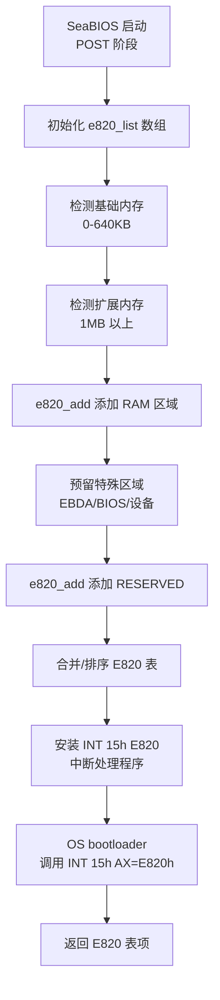
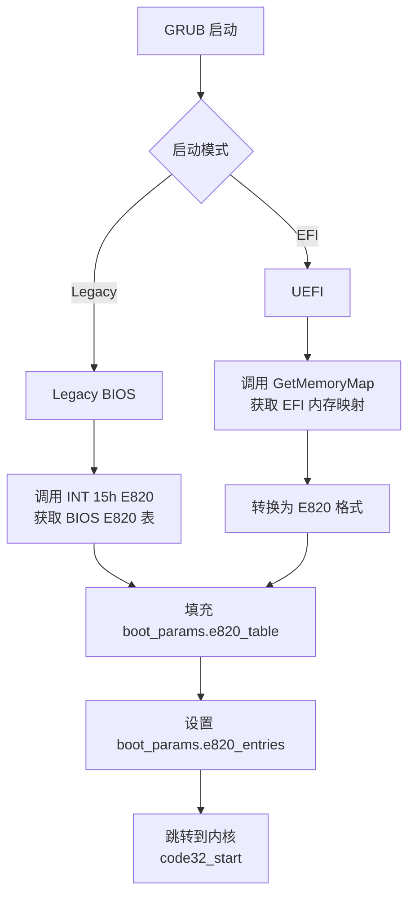
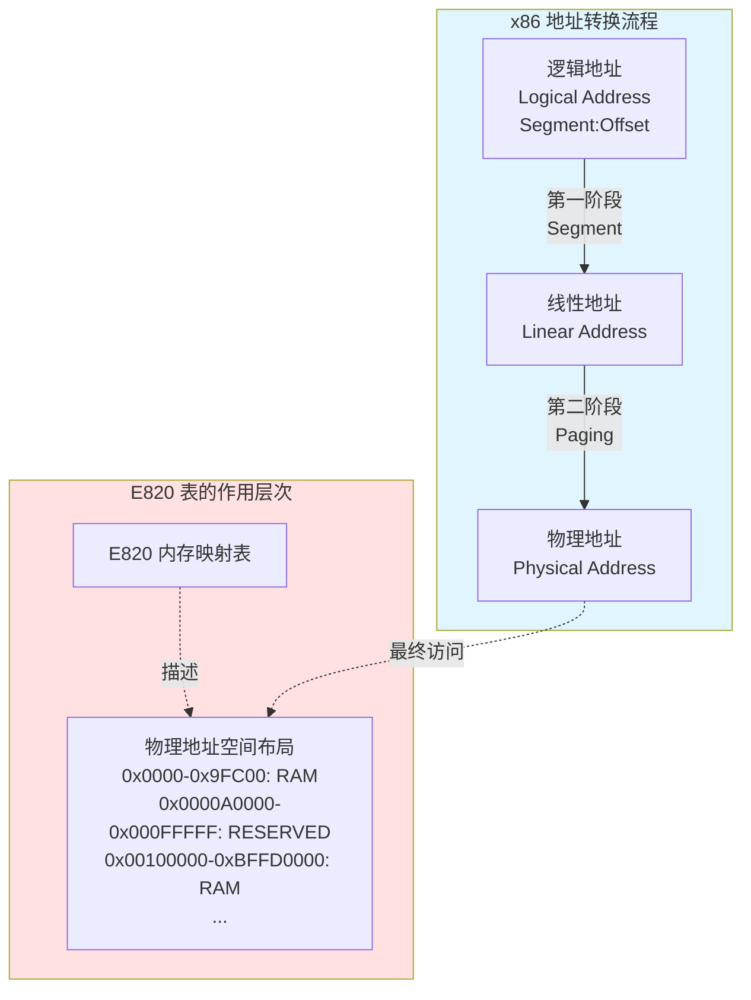
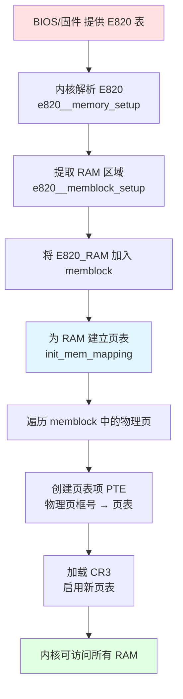

# Linux 内核 setup_arch() 内存接管详解

本文档展开说明 `start_kernel()` 中 **setup_arch(&command_line)** 与**内核对物理内存的接管**相关的步骤，基于 x86（含 x86_64）内核源码：`arch/x86/kernel/setup.c`、`arch/x86/kernel/e820.c`、`arch/x86/mm/init.c`、`arch/x86/mm/init_64.c` 等。

> **相关文档**：setup_arch() 及完整启动链见 [LINUX_KERNEL_INIT.md](LINUX_KERNEL_INIT.md)；MMU、分页与内核页表分工见 [MMU_AND_PAGING.md](MMU_AND_PAGING.md)。

## 1. 调用顺序概览

`setup_arch()` 中与内存接管相关的主要调用顺序（x86_64，简化）如下：

```
setup_arch()（arch/x86/kernel/setup.c）
    ├─ early_reserve_memory()           // 在加入 memblock 前预留区域
    ├─ e820__memory_setup()             // 解析 E820，填充 e820_table
    ├─ ...（max_pfn、e820__finish_early_params、e820__memblock_setup 前诸多步骤）
    ├─ max_pfn = e820__end_of_ram_pfn()
    ├─ e820__memblock_setup()           // 将 E820 RAM 加入 memblock
    ├─ init_mem_mapping()               // 建立直接映射（内核页表）
    ├─ ...
    ├─ initmem_init()                   // NUMA/memblock 节点（init_64.c）
    ├─ x86_init.paging.pagetable_init() // 实际调用 paging_init()
    └─ ...
```

- **e820**：固件/引导程序提供的物理内存布局（E820 表）。
- **memblock**：早期物理内存分配器，在伙伴系统之前使用。
- **init_mem_mapping**：为物理 RAM 建立内核直接映射（页表），使内核能访问全部可用物理页。
- **paging_init**：在 x86_64 上初始化 sparse 与 zone（sparse_init、zone_sizes_init），为后续伙伴系统做准备。

以下按上述顺序分步说明。

## 2. E820 内存映射表

### 2.1 什么是 E820 表？

**E820 表**（E820 Memory Map）是 x86 架构上描述物理内存布局的标准机制，由 BIOS/固件提供给操作系统。名称来源于 BIOS 中断服务 **INT 15h, AX=E820h**。

**核心作用**：

E820 表告诉操作系统：
1. **哪些物理内存区域是可用 RAM**（可以被内核分配和使用）
2. **哪些区域被保留**（BIOS、设备内存映射、ACPI 表等，不可覆盖）
3. **每个区域的起始地址和大小**

这是内核管理物理内存的**第一步**：在能够使用内存之前，必须先知道有哪些内存可用。

**E820 表项结构**：

```c
struct e820entry {
    u64 start;      // 物理内存区域起始地址
    u64 size;       // 区域大小（字节）
    u32 type;       // 内存类型
};
```

**常见内存类型**：

| 类型 | 宏定义 | 含义 | 内核如何处理 |
|------|--------|------|--------------|
| 1 | `E820_TYPE_RAM` | 可用 RAM | 加入 memblock，可分配使用 |
| 2 | `E820_TYPE_RESERVED` | 保留区域（BIOS、设备等） | 不加入 memblock，不可使用 |
| 3 | `E820_TYPE_ACPI` | ACPI 可回收内存 | 保留给 ACPI，ACPI 初始化后可回收 |
| 4 | `E820_TYPE_NVS` | ACPI NVS（非易失性存储） | 保留，系统挂起/恢复时需要 |
| 5 | `E820_TYPE_UNUSABLE` | 不可用内存（坏内存块） | 不加入 memblock |

**E820 表示例**（典型的 4GB 系统）：

```
e820 map has 6 items:
  0: 0000000000000000 - 000000000009fc00 = 1 RAM       (640KB: 0-640KB)
  1: 000000000009fc00 - 00000000000a0000 = 2 RESERVED  (1KB: EBDA 区)
  2: 00000000000f0000 - 0000000000100000 = 2 RESERVED  (64KB: BIOS ROM)
  3: 0000000000100000 - 00000000bffd0000 = 1 RAM       (约 3GB: 1MB-3GB)
  4: 00000000bffd0000 - 00000000c0000000 = 2 RESERVED  (192KB: ACPI/BIOS)
  5: 00000000fec00000 - 0000000100000000 = 2 RESERVED  (设备内存映射区)
```

### 2.2 SeaBIOS 如何构建 E820 表

**SeaBIOS** 是开源的 x86 BIOS 实现（常用于 QEMU/KVM），在 POST（Power-On Self-Test）过程中构建 E820 表。

**核心实现文件**：
- `src/e820map.h` - E820 结构定义和类型常量
- `src/e820map.c` - E820 表管理函数
- `src/system.c` - INT 15h E820 BIOS 调用处理程序
- `src/post.c` - POST 过程中添加各类内存区域

**E820 表构建流程**：



**关键函数分析**（SeaBIOS `src/e820map.c`）：

**1. `e820_add(u64 start, u64 size, u32 type)`** - 添加内存区域

```c
void e820_add(u64 start, u64 size, u32 type)
{
    // 处理重叠区域，自动合并相同类型的相邻区域，保持列表有序
    // 1. 查找插入位置
    // 2. 分割已存在的重叠区域
    // 3. 移除完全被覆盖的区域
    // 4. 合并相同类型的相邻区域
    // 5. 插入新区域
}
```

**调用示例**（`src/post.c`）：

```c
// POST 过程中预留 EBDA（Extended BIOS Data Area）
e820_add((u32)ebda, BUILD_LOWRAM_END-(u32)ebda, E820_RESERVED);

// PMM 分配器在 ZoneTmpHigh 分配永久内存时
e820_add(data, size, E820_RESERVED);
```

**2. INT 15h E820 BIOS 调用实现**（`src/system.c:handle_15e820()`）：

```c
static void handle_15e820(struct bregs *regs)
{
    int count = GET_GLOBAL(e820_count);

    // 验证调用签名和参数
    if (regs->edx != 0x534D4150    // 'SMAP' 签名
        || regs->bx >= count        // 索引越界
        || regs->ecx < sizeof(e820entry)) {  // 缓冲区太小
        set_code_invalid(regs, RET_EUNSUPPORTED);
        return;
    }

    // 复制第 BX 项 E820 条目到 ES:DI
    memcpy_far(regs->es, (void*)(regs->di+0),
               get_global_seg(), &e820_list[regs->bx],
               sizeof(e820_list[0]));

    // 更新迭代状态
    if (regs->bx == count-1)
        regs->ebx = 0;              // 最后一项，返回 0 表示结束
    else
        regs->ebx++;                // 返回下一项索引

    regs->eax = 0x534D4150;         // 返回 'SMAP' 签名
    regs->ecx = sizeof(e820_list[0]);
    set_success(regs);
}
```

**INT 15h E820 调用约定**（Legacy BIOS 启动时的标准接口）：

```
输入寄存器：
    EAX = 0xE820            // 功能号
    EDX = 0x534D4150        // 'SMAP' ASCII 签名
    EBX = 0                 // 第一次调用为 0，后续使用上次返回值
    ECX = 缓冲区大小         // 至少 20 字节
    ES:DI = 缓冲区指针       // 接收 E820 条目

输出寄存器：
    EAX = 0x534D4150        // 成功时返回签名
    EBX = 下一个条目索引     // 0 表示最后一项
    ECX = 实际写入字节数     // 通常为 20
    CF = 0                  // 成功时清零
```

**SeaBIOS E820 构建的关键点**：

1. **动态构建**：E820 表在 POST 阶段动态构建，根据检测到的内存大小、设备映射等添加条目
2. **自动合并**：`e820_add()` 自动处理重叠区域、合并相邻的同类型区域
3. **类型优先级**：RESERVED 类型优先级高于 RAM，重叠时保留 RESERVED
4. **有序存储**：E820 表按起始地址排序，方便内核遍历

### 2.3 GRUB 如何传递 E820 表

**GRUB Legacy BIOS 模式**：通过 INT 15h E820 获取 BIOS 提供的 E820 表，然后传递给 Linux 内核。

**GRUB EFI 模式**：调用 EFI 的 `GetMemoryMap()` 服务获取内存映射，转换为 E820 格式传递给内核。

**核心实现文件**：
- `grub-core/loader/i386/linux.c` - Linux 内核加载器
- `grub-core/mmap/i386/pc/mmap.c` - Legacy BIOS 内存映射获取

**GRUB 传递 E820 的流程**：



**GRUB Legacy BIOS 模式实现**（`grub-core/loader/i386/linux.c`）：

```c
// grub_linux_boot() 准备启动内核时
static grub_err_t grub_linux_boot(void)
{
    struct linux_kernel_params *params;

    // ... 其他准备工作 ...

    // 填充 E820 内存映射
    ctx.e820_num = 0;
    if (grub_mmap_iterate(grub_linux_boot_mmap_fill, &ctx))
        return grub_errno;

    // 设置 E820 条目数量
    ctx.params->mmap_size = ctx.e820_num;

    // ... 跳转到内核 ...
}

// E820 填充回调函数
static int grub_linux_boot_mmap_fill(grub_uint64_t addr,
                                      grub_uint64_t size,
                                      grub_memory_type_t type,
                                      void *data)
{
    struct linux_boot_ctx *ctx = data;
    struct grub_e820_mmap *e820_entry;

    e820_entry = &ctx->params->e820_map[ctx->e820_num];
    e820_entry->addr = addr;
    e820_entry->size = size;
    e820_entry->type = grub_to_linux_memtype(type);  // 转换类型

    ctx->e820_num++;
    return 0;
}
```

**GRUB 内存类型转换**：

| GRUB 内存类型 | Linux E820 类型 | 说明 |
|--------------|----------------|------|
| `GRUB_MEMORY_AVAILABLE` | `E820_TYPE_RAM` (1) | 可用内存 |
| `GRUB_MEMORY_RESERVED` | `E820_TYPE_RESERVED` (2) | 保留内存 |
| `GRUB_MEMORY_ACPI` | `E820_TYPE_ACPI` (3) | ACPI 表 |
| `GRUB_MEMORY_NVS` | `E820_TYPE_NVS` (4) | ACPI NVS |
| `GRUB_MEMORY_BADRAM` | `E820_TYPE_UNUSABLE` (5) | 坏内存 |

**GRUB EFI 模式特殊处理**：

EFI 提供更详细的内存类型（如 EfiLoaderCode、EfiBootServicesData 等），GRUB 需要将其映射为简化的 E820 类型：

```c
// EFI 内存类型 → E820 类型映射
EfiConventionalMemory     → E820_TYPE_RAM
EfiLoaderCode/Data        → E820_TYPE_RAM
EfiBootServicesCode/Data  → E820_TYPE_RAM (ExitBootServices 后可回收)
EfiRuntimeServicesCode/Data → E820_TYPE_RESERVED
EfiACPIReclaimMemory      → E820_TYPE_ACPI
EfiACPIMemoryNVS          → E820_TYPE_NVS
EfiReservedMemoryType     → E820_TYPE_RESERVED
```

**GRUB 传递 E820 的关键点**：

1. **boot_params 结构**：E820 表存储在 `boot_params.e820_table[]` 数组中（最多 128 项）
2. **条目计数**：`boot_params.e820_entries` 记录实际条目数
3. **地址传递**：GRUB 将 `boot_params` 的物理地址放入 ESI 寄存器，跳转到内核时传递
4. **兼容性**：支持 Legacy BIOS（INT 15h）和 UEFI（GetMemoryMap）两种获取方式

### 2.4 Linux 内核接收和使用 E820 表

**源码位置**：`arch/x86/kernel/setup.c` 中调用 `e820__memory_setup()`；实现与默认入口在 `arch/x86/kernel/e820.c`。

**接收流程**：

```c
// arch/x86/kernel/setup.c
void __init setup_arch(char **cmdline_p)
{
    // ... 早期初始化 ...

    // 从 boot_params 解析 E820 表
    e820__memory_setup();

    // ... 后续内存管理初始化 ...
}
```

**`e820__memory_setup()`** 实现（`arch/x86/kernel/e820.c`，约 1224 行）：

```c
char *__init e820__memory_setup(void)
{
    // 调用平台相关的内存布局获取函数
    // 默认实现为 e820__memory_setup_default()
    char *who = x86_init.resources.memory_setup();

    // 拷贝到备份表（用于 kexec、firmware 查询等）
    memcpy(&e820_table_kexec, &e820_table, sizeof(e820_table));
    memcpy(&e820_table_firmware, &e820_table, sizeof(e820_table));

    return who;  // 返回来源字符串（如 "BIOS-e820"）
}
```

**`e820__memory_setup_default()`** - 默认从 boot_params 读取：

```c
char *__init e820__memory_setup_default(void)
{
    char *who = "BIOS-e820";

    // 从 boot_params.e820_table 复制到内核全局 e820_table
    int entries = boot_params.e820_entries;
    for (int i = 0; i < entries && i < E820_MAX_ENTRIES; i++) {
        struct boot_e820_entry *entry = &boot_params.e820_table[i];
        e820__range_add(entry->addr, entry->size, entry->type);
    }

    // 额外处理 EFI 内存映射（EFI 启动时）
    if (efi_enabled(EFI_BOOT))
        e820__setup_efi();

    return who;
}
```

**内核使用 E820 表的关键步骤**：

1. **e820__memory_setup()**：解析并记录物理内存布局到 `e820_table`
2. **max_pfn 计算**：`e820__end_of_ram_pfn()` 扫描 E820_TYPE_RAM 区域，计算最大页帧号
3. **e820__memblock_setup()**：将 E820_TYPE_RAM 区域加入 memblock 分配器
4. **init_mem_mapping()**：为 RAM 区域建立内核直接映射页表
5. **paging_init()**：基于 E820 和 memblock 初始化内存 zone

**E820 类型处理**：

```c
// arch/x86/kernel/e820.c
void __init e820__memblock_setup(void)
{
    int i;
    for (i = 0; i < e820_table->nr_entries; i++) {
        struct e820_entry *entry = &e820_table->entries[i];
        u64 start = entry->addr;
        u64 end = start + entry->size;

        if (entry->type != E820_TYPE_RAM)
            continue;  // 只处理 RAM 类型

        // 加入 memblock 可分配区域
        memblock_add(start, entry->size);
    }

    // E820_TYPE_SOFT_RESERVED 需要预留
    for (i = 0; i < e820_table->nr_entries; i++) {
        if (entry->type == E820_TYPE_SOFT_RESERVED)
            memblock_reserve(entry->addr, entry->size);
    }
}
```

**E820 表的三个副本**：

| 变量 | 用途 |
|------|------|
| `e820_table` | 主副本，内核运行时可能被修改（添加保留区域等） |
| `e820_table_firmware` | 固件原始副本，保持不变，用于查询固件提供的原始布局 |
| `e820_table_kexec` | kexec 副本，用于 kexec 重启时传递给新内核 |

**要点**：

- E820 表是内核获知物理内存布局的**唯一来源**（Legacy BIOS 模式）
- 只有 `E820_TYPE_RAM` 会被加入 memblock 供内核分配使用
- E820 表在后续阶段可能被修改（如添加内核镜像保留区、initrd 保留区等）
- `e820__memory_setup()` 只负责"解析并记录"物理内存布局，尚未建立 memblock 或页表

### 2.5 E820 表与 Paging/Segment 的关系

#### E820 描述的是什么地址空间？

**E820 表描述的是物理地址空间（Physical Address Space）**，与虚拟地址转换机制（Segment、Paging）处于不同层次。



#### E820 表与 Segment（分段）的关系：**无直接关系**

**为什么无关？**

1. **Segment 作用于地址转换的第一阶段**：
   - Segment 将**逻辑地址**（段:偏移）转换为**线性地址**
   - 在 Flat Model 下，段基址为 0，逻辑地址 = 线性地址
   - Segment 处理的是虚拟地址空间的**访问方式**，不关心物理内存布局

2. **E820 描述物理地址空间**：
   - E820 告诉 OS："物理地址 0x100000-0xBFFD0000 是可用 RAM"
   - 这个信息与你用什么段选择子、段基址来访问无关
   - 即使在实模式下用 `segment:offset` 访问，E820 描述的仍然是最终的物理地址

**示例**：

```
实模式访问：DS=0x1000, offset=0x5000
    → 线性地址 = 0x1000 * 16 + 0x5000 = 0x15000
    → 物理地址 = 0x15000（实模式无分页）

E820 告诉我们：物理地址 0x15000 是否是可用 RAM？
    → 与你用哪个段寄存器、段基址多少无关
```

**结论**：E820 表与 Segment 机制处于不同层次，**无直接依赖关系**。

---

#### E820 表与 Paging（分页）的关系：**强依赖关系**

**E820 是 Paging 的数据来源**：分页机制需要知道"应该为哪些物理地址建立页表映射"，这个信息来自 E820 表。

**依赖关系流程**：



**为什么 Paging 依赖 E820？**

| 问题 | E820 的作用 | 如果没有 E820 会怎样？ |
|------|------------|---------------------|
| **页表应该映射哪些物理地址？** | E820_TYPE_RAM 告诉内核哪些物理地址是可用内存 | 内核不知道哪些物理地址可以安全访问，可能映射到设备内存或保留区域导致崩溃 |
| **哪些物理地址不应该映射？** | E820_TYPE_RESERVED 标记了 BIOS、设备等保留区域 | 内核可能覆盖 BIOS 数据或设备内存映射区，导致系统故障 |
| **设备内存需要特殊映射吗？** | E820 区分 RAM 和设备内存 | 内核可能用普通的 cached 映射访问设备内存，导致数据不一致 |
| **物理内存有多大？** | E820 扫描所有 RAM 区域得到 max_pfn | 内核不知道物理内存大小，无法正确初始化内存管理 |

**实际代码中的依赖**（`arch/x86/mm/init.c:init_mem_mapping()`）：

```c
void __init init_mem_mapping(void)
{
    unsigned long end;

    // 从 E820 获取物理内存范围
    end = max_pfn << PAGE_SHIFT;  // max_pfn 来自 e820__end_of_ram_pfn()

    // 为 E820 中的 RAM 区域建立直接映射
    // 内部通过遍历 memblock（来自 E820）建立页表
    memory_map_bottom_up(ISA_END_ADDRESS, end);

    // 加载新页表
    load_cr3(swapper_pg_dir);
    __flush_tlb_all();
}
```

**具体依赖点**：

1. **`max_pfn` 计算**（`arch/x86/kernel/e820.c`）：
   ```c
   unsigned long __init e820__end_of_ram_pfn(void)
   {
       unsigned long max_pfn = 0;
       for (i = 0; i < e820_table->nr_entries; i++) {
           struct e820_entry *entry = &e820_table->entries[i];

           if (entry->type != E820_TYPE_RAM)  // 只考虑 RAM 区域
               continue;

           unsigned long pfn = (entry->addr + entry->size) >> PAGE_SHIFT;
           if (pfn > max_pfn)
               max_pfn = pfn;
       }
       return max_pfn;
   }
   ```

2. **`init_mem_mapping()` 建立映射**：
   - 只为 E820_TYPE_RAM 区域建立常规的 cacheable 页表映射
   - E820_TYPE_RESERVED 区域不建立映射，或在需要时建立特殊映射（uncached）

3. **`memblock` 作为中介**：
   ```
   E820 表（物理内存布局描述）
       ↓
   memblock（早期内存分配器，记录可用物理页）
       ↓
   页表（为 memblock 中的物理页建立线性地址映射）
   ```

**E820 影响的页表属性**：

| E820 类型 | 是否映射？ | 页表属性 | 用途 |
|----------|----------|---------|------|
| `E820_TYPE_RAM` | ✅ 是 | Cacheable, Write-back | 内核直接映射，可分配使用 |
| `E820_TYPE_RESERVED` | ❌ 否 | - | BIOS/设备保留，不映射到内核地址空间 |
| `E820_TYPE_ACPI` | ⚠️ 按需 | Cacheable | ACPI 表，需要时临时映射 |
| `E820_TYPE_NVS` | ⚠️ 按需 | Uncached | ACPI NVS，需要时映射为 uncached |
| 设备 MMIO | ⚠️ 按需 | Uncached, Write-combining | 驱动通过 ioremap 映射，必须 uncached |

**关键示例：为什么内核不能盲目映射所有物理地址？**

假设一个系统的物理地址空间：

```
0x00000000 - 0x0009FC00: RAM (640KB)           ← E820_TYPE_RAM，应该映射
0x000A0000 - 0x000FFFFF: 设备/BIOS ROM (384KB) ← E820_TYPE_RESERVED，不应该映射
0x00100000 - 0xBFFD0000: RAM (约 3GB)          ← E820_TYPE_RAM，应该映射
0xBFFD0000 - 0xC0000000: ACPI tables (192KB)   ← E820_TYPE_ACPI，按需映射
0xFEC00000 - 0xFED00000: LAPIC/IOAPIC          ← E820_TYPE_RESERVED，驱动用 ioremap
```

如果内核不查看 E820，直接为所有物理地址建立 cacheable 映射：

- ❌ **0x000A0000-0x000FFFFF**：这是 VGA 显存和 BIOS ROM，用 cached 映射会导致数据不一致
- ❌ **0xFEC00000-0xFED00000**：这是 LAPIC/IOAPIC 寄存器，必须用 uncached 映射
- ❌ **未知的保留区域**：可能触发 machine check exception

**正确做法**（基于 E820）：
```c
// init_mem_mapping() 只映射 E820_TYPE_RAM
for_each_memblock(memory, reg) {  // memblock 来自 E820
    unsigned long start = reg->base;
    unsigned long end = start + reg->size;

    // 只为 RAM 建立 cacheable 映射
    init_memory_mapping(start, end, PAGE_KERNEL);
}

// 设备内存由驱动单独映射
void __iomem *lapic_base = ioremap(0xFEC00000, 4096);  // uncached
```

**总结**：

| 关系 | 结论 | 原因 |
|------|------|------|
| **E820 vs Segment** | **无直接关系** | E820 描述物理地址布局，Segment 只是虚拟地址转换的第一阶段，两者处于不同层次 |
| **E820 vs Paging** | **强依赖关系** | Paging 需要知道"为哪些物理地址建立页表映射"，这个信息来自 E820 表；没有 E820，内核无法安全地建立页表 |

E820 表是连接"硬件物理内存布局"与"内核虚拟内存管理"的桥梁。

> **相关文档**：
> - [MMU_AND_PAGING.md](MMU_AND_PAGING.md) - 第二章详细分析了 GDT（Segment）与 Paging 的两阶段地址转换关系
> - [LINUX_KERNEL_INIT.md](LINUX_KERNEL_INIT.md) - 完整启动流程

## 3. max_pfn 与 e820__memblock_setup()：早期分配器

**max_pfn**：在 setup_arch() 中由 `e820__end_of_ram_pfn()` 得到，表示物理 RAM 的末尾页帧号，后续 init_mem_mapping 和 paging_init 都会用到。

**e820__memblock_setup()**（e820.c 约 1240 行）：

- **作用**：把 E820 中的可用 RAM 导入 **memblock**，建立早期物理内存分配器。
- **主要逻辑**：
  - 对 e820_table 中每个 `E820_TYPE_RAM` 调用 `memblock_add(addr, size)`，将物理区间加入 memblock 的 memory 区域。
  - `E820_TYPE_SOFT_RESERVED` 调用 `memblock_reserve`。
  - 设置 `memblock_set_current_limit(ISA_END_ADDRESS)` 等，在 init_mem_mapping 完成前限制分配范围；之后会再放宽。
- **结果**：memblock 已知“哪些物理地址是可用 RAM”，后续 init_mem_mapping 等可从 memblock 分配页表用页。

**要点**：e820__memblock_setup 之后，内核对“哪些物理页属于 RAM”已有统一描述，并可通过 memblock 做早期分配，但尚未为这些 RAM 建立直接映射。

## 4. init_mem_mapping()：建立直接映射（内核页表）

**作用**：为物理 RAM 建立**直接映射**（物理地址与内核虚拟地址线性对应），使内核可以访问全部由 e820/memblock 描述的可用物理内存。

**源码位置**：`arch/x86/mm/init.c` 中 `init_mem_mapping()`（约 758 行）。

**主要步骤**（x86_64）：

1. **ISA 区**：`init_memory_mapping(0, ISA_END_ADDRESS, PAGE_KERNEL)`，先映射 0～ISA_END_ADDRESS（如 1MB 以下）。
2. **trampoline**：`init_trampoline()`，为实模式 trampoline 等做准备（可能与 KASLR 有关）。
3. **整段 RAM 的直接映射**：根据 `memblock_bottom_up()` 选择自顶向下或自底向上：
   - **自底向上**：先 `memory_map_bottom_up(kernel_end, end)`，再 `memory_map_bottom_up(ISA_END_ADDRESS, kernel_end)`，使页表分配在内核之上。
   - **自顶向下**：`memory_map_top_down(ISA_END_ADDRESS, end)`。
4. 内部通过 **init_range_memory_mapping()** 遍历 memblock 的 PFN 区间，对每段 RAM 调用 **init_memory_mapping(start, end, PAGE_KERNEL)**，最终走到 **kernel_physical_mapping_init()** 填充页表（PML4/PDPT/PD/PT）。
5. `load_cr3(swapper_pg_dir)` 并 `__flush_tlb_all()`，使当前内核使用新的全局页表。

**要点**：init_mem_mapping() 完成后，内核已为 E820 中的 RAM 建立完整直接映射，并切换到 swapper_pg_dir，内核对物理内存的“可见性”接管完成；后续可安全使用 memblock 和即将初始化的 zone。

## 5. initmem_init() 与 paging_init()：NUMA 与 zone

**initmem_init()**（arch/x86/mm/init_64.c）：  
- 在 x86_64 上主要调用 `x86_numa_init()`，将 memblock 与 NUMA 节点关联（memblock_set_node 等），为后续按节点初始化 zone 做准备。

**paging_init()**（arch/x86_64）：  
- 在 setup_arch() 中通过 **x86_init.paging.pagetable_init()** 调用（native 下即 `native_pagetable_init` → `paging_init()`，见 `arch/x86/mm/init_64.c` 约 819 行）。  
- **paging_init()** 主要做：
  - **sparse_init()**：初始化稀疏内存模型（struct page 与 section 等）。
  - **zone_sizes_init()**：根据物理内存与 NUMA 信息计算并初始化各 zone（ZONE_DMA、ZONE_DMA32、ZONE_NORMAL 等），为伙伴系统提供物理页划分。

**要点**：paging_init() 不再次建立直接映射，而是基于 init_mem_mapping() 已建立的映射，把物理内存纳入 zone 和稀疏模型，完成从“早期 memblock”到“伙伴系统可管理内存”的过渡。

## 6. 小结：内核接管内存的“关键一步”落在哪里？

- **“知道有哪些物理内存”**：**e820__memory_setup()** + **e820__memblock_setup()**（E820 → e820_table → memblock）。  
- **“能访问这些物理内存”**：**init_mem_mapping()**（建立直接映射并切换 CR3）。  
- **“能按页分配与管理”**：**paging_init()**（sparse_init + zone_sizes_init），为伙伴系统准备好 zone。

因此，**setup_arch() 中内核对物理内存的完整接管**是由 **e820 解析 → memblock 建立 → init_mem_mapping → paging_init** 这一整条链完成的；若只选“一步”作为“关键”，通常是 **init_mem_mapping()**（建立直接映射并切换页表），因为此前内核还不能线性访问全部 RAM，此后才可以。内核与 MMU 在页表上的分工（内核维护页表、MMU 查表与缺页协作）见 [MMU_AND_PAGING.md](MMU_AND_PAGING.md)。

本文档基于 Linux 内核 x86 源码整理；具体行号与条件编译可能随版本略有变化，以实际源码为准。
