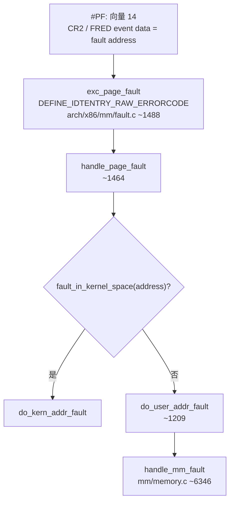
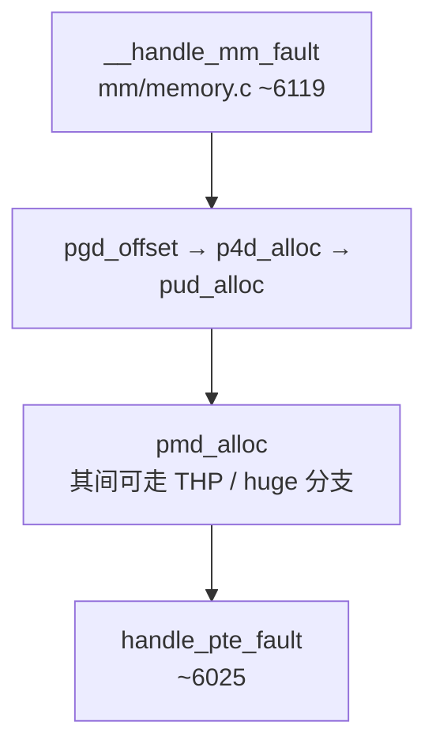
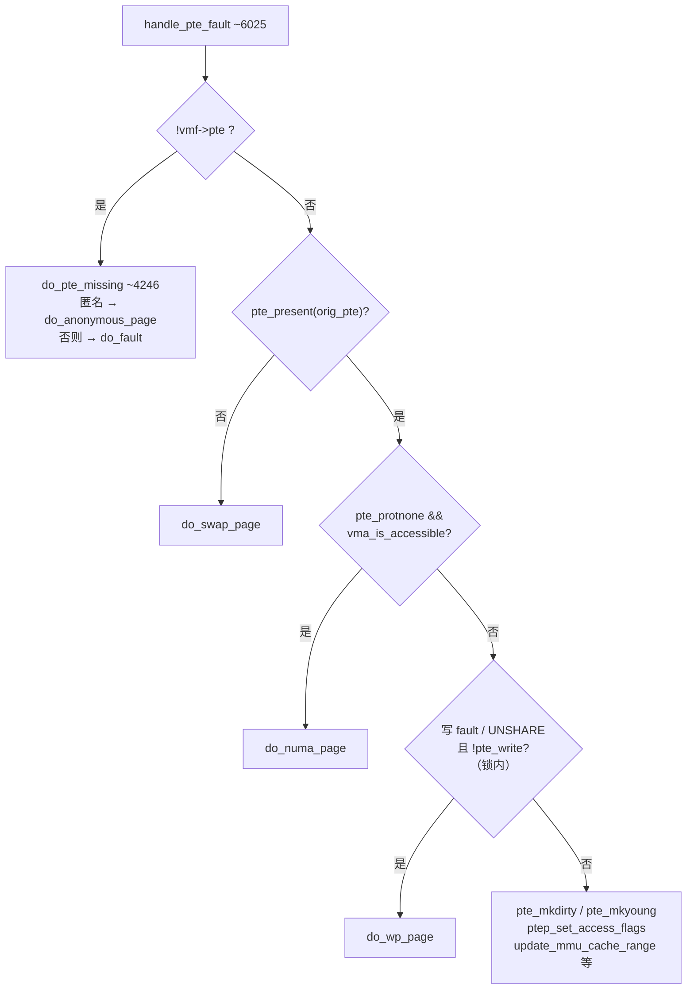
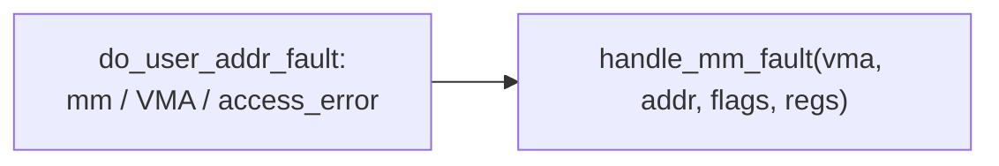

# Linux 缺页异常与按需分配：从虚拟地址到物理地址的完整流程

> **文档导航**
>
> 本文档是 Linux 内存管理系列文档之一，详细讲解缺页异常处理和按需分配（Demand Paging）机制。
>
> **相关文档**：
> - **[X86_EXCEPTION_HARDWARE_TRIGGER.md](X86_EXCEPTION_HARDWARE_TRIGGER.md)** - Page Fault 的硬件触发机制
> - **[X86_MEMORY_MANAGEMENT_THEORY.md](X86_MEMORY_MANAGEMENT_THEORY.md)** - x86-64 分页硬件机制（4级页表、TLB、MMU）
> - **[LINUX_MEMORY_MANAGEMENT_EVOLUTION.md](LINUX_MEMORY_MANAGEMENT_EVOLUTION.md)** - 内核启动过程的内存管理演化
> - **[LINUX_USERSPACE_MEMORY_GUIDE.md](LINUX_USERSPACE_MEMORY_GUIDE.md)** - 用户空间内存模型
> - **[LINUX_TASK_MM_THREAD_STRUCTS.md](LINUX_TASK_MM_THREAD_STRUCTS.md)** - `task_struct` / `mm_struct` / `thread_struct` 组织关系

## 概述

本文档详细描述用户空间程序访问虚拟内存时，Linux 内核如何通过缺页异常（Page Fault）机制，按需分配物理页面并建立虚拟地址到物理地址映射的完整流程。

**关键概念**：
- **Demand Paging（按需分配）**：只在实际访问时才分配物理页面
- **Page Fault（缺页异常）**：访问未映射的虚拟地址时触发的 CPU 异常
- **TLB（Translation Lookaside Buffer）**：页表缓存，加速地址转换

**Intel SDM 参考**：
- **Volume 3A, Chapter 4: Paging** - 分页机制完整规范
- **Volume 3A, Section 4.10: Page-Fault Exceptions** - 缺页异常详解
- **Volume 3A, Section 4.11: Page-Fault Error Code** - 错误码格式
- **Volume 3A, Table 4-6: Format of a Page-Fault Error Code** - 错误码位字段

**参考资料**：
- Intel® 64 and IA-32 Architectures Software Developer's Manual, Volume 3A
  - `/Users/weli/Desktop/64-ia-32-architectures-software-developer-vol-3a-part-1-manual.pdf`
- Linux Kernel Source Code (v6.x)
  - `/Users/weli/works/linux/arch/x86/mm/fault.c` - 缺页异常处理
  - `/Users/weli/works/linux/mm/memory.c` - 内存管理核心函数
  - `include/linux/mm_types.h` — `struct mm_struct`、`struct vm_area_struct`

**`task_struct` / 内嵌 `thread_struct` 与 `mm` 在缺页路径中的分工**（含对照表与示意图）见 **[LINUX_TASK_MM_THREAD_STRUCTS.md](LINUX_TASK_MM_THREAD_STRUCTS.md)** 中「**与缺页处理的关系**」一节；本文只跟 **`handle_mm_fault` / VMA / PTE** 的软件链。

---

## Mermaid 流程图（与当前内核源码路径对照）

下列 **行号** 以 `/Users/weli/works/linux` 树内文件为准；换分支或版本后请以实际文件为准。

### 自 `#PF` 到 `do_user_addr_fault` / `handle_mm_fault`



### `__handle_mm_fault`：页表逐级到 PTE（主干）



说明：中间存在 **透明大页（PUD/PMD）**、**swap/migration** 等早退分支，上图只保留「落到 PTE 级」的主干。

### `handle_pte_fault`：缺页类型分支（与 `mm/memory.c` 一致）



`do_pte_missing` 内分支：`vma_is_anonymous(vma)` → **`do_anonymous_page`**，否则 **`do_fault`**（`mm/memory.c` ~4246–4251）。  
**`NUMA` 为否**之后，源码先 **`spin_lock(vmf->ptl)`** 再比对 `pte_same`、处理写保护与 **`do_wp_page`**；上图把锁内逻辑收成节点 **`W`**。另：**`!pte_present`** 路径上还有 **PTE marker**、锁内 **`pte_same` 重试** 等，已省略。

### `do_user_addr_fault` → `handle_mm_fault`（简图）



同文件内对用户路径可先走 **`lock_vma_under_rcu` + `FAULT_FLAG_VMA_LOCK`**（~1327 起），失败再 **`lock_mm_and_find_vma`**（~1358）；上图不展开锁与重试。

---

## 场景设定

假设用户空间有一个简单的汇编代码片段：

```asm
# 用户空间汇编代码示例
movq $0x7ffe1234, %rax    # 将虚拟地址加载到寄存器
movb (%rax), %bl          # 从虚拟地址读取一个字节
```

当CPU执行 `movb (%rax), %bl` 时，需要将虚拟地址 `0x7ffe1234` 转换为物理地址。

---

## 完整执行流程

### 阶段1：CPU硬件层面的地址转换尝试

#### 1.1 TLB查找（Translation Lookaside Buffer）

CPU首先在TLB（页表缓存）中查找虚拟地址到物理地址的映射：

```
虚拟地址 0x7ffe1234 → 查询TLB
```

- **TLB命中**：如果TLB中存在该映射，CPU直接使用缓存的物理地址，完成内存访问，流程结束。
- **TLB未命中**：继续执行硬件页表遍历。

#### 1.2 硬件页表遍历（x86_64架构）

如果TLB未命中，CPU硬件自动执行多级页表查找：

**虚拟地址分解（x86_64，4KB页）：**
```
虚拟地址: 0x7ffe1234
[47:39] → PML4索引 (9位)
[38:30] → PDP索引  (9位)
[29:21] → PD索引   (9位)
[20:12] → PT索引   (9位)
[11:0]  → 页内偏移 (12位)
```

**硬件查找流程（Intel SDM Volume 3A, Section 4.5）：**
1. CPU从CR3寄存器读取当前进程的PML4表物理地址
2. 使用位[47:39]索引PML4表，得到PDP表物理地址
3. 使用位[38:30]索引PDP表，得到PD表物理地址
4. 使用位[29:21]索引PD表，得到PT表物理地址
5. 使用位[20:12]索引PT表，得到页表项（PTE）

**PTE检查：**
- 如果PTE的Present位为1且有效：提取物理页框号（PFN），拼接页内偏移得到物理地址，更新TLB，完成访问。
- 如果PTE的Present位为0或无效：触发**缺页异常（Page Fault）**，进入内核处理。

---

### 阶段2：缺页异常处理（内核介入）

#### 2.1 异常入口（x86_64）

当CPU检测到页表项无效时，触发缺页异常（中断向量14，`#PF`），CPU自动：

1. 保存当前执行状态到内核栈（`struct pt_regs`）
2. 跳转到异常处理入口：`asm_exc_page_fault`

相关代码位置：
- **C 侧入口**：`arch/x86/mm/fault.c` 中 **`DEFINE_IDTENTRY_RAW_ERRORCODE(exc_page_fault)`**（约 L1488 起：读故障地址、`irqentry_enter` 后调用 **`handle_page_fault()`**）
- **用户地址缺页**：同文件 **`do_user_addr_fault()`**（约 L1209 起）→ **`handle_mm_fault()`**（`mm/memory.c`）
- 汇编仅参与 IDT/向量公共跳板（由 **`idtentry`** 等宏生成，具体以 `arch/x86` 下构建结果为准），**不要**再假定单独在 `entry_64.S` 里手写完整 `asm_exc_page_fault` 主体

> **详细的硬件触发机制见**：[X86_EXCEPTION_HARDWARE_TRIGGER.md](X86_EXCEPTION_HARDWARE_TRIGGER.md)

#### 2.2 用户空间缺页处理入口

在 `arch/x86/mm/fault.c` 中，`do_user_addr_fault` 函数处理用户空间的缺页异常：

```c
// arch/x86/mm/fault.c:1208-1304
static inline
void do_user_addr_fault(struct pt_regs *regs,
			unsigned long error_code,
			unsigned long address)
{
	struct vm_area_struct *vma;
	struct task_struct *tsk;
	struct mm_struct *mm;
	vm_fault_t fault;
	unsigned int flags = FAULT_FLAG_DEFAULT;

	tsk = current;
	mm = tsk->mm;
	// ... 错误检查和权限验证 ...

	// 设置缺页标志
	if (error_code & X86_PF_WRITE)
		flags |= FAULT_FLAG_WRITE;
	if (user_mode(regs))
		flags |= FAULT_FLAG_USER;

	// 查找VMA（虚拟内存区域）
	vma = lock_mm_and_find_vma(mm, address, regs);
	if (unlikely(!vma)) {
		bad_area_nosemaphore(regs, error_code, address);
		return;
	}

	// 检查访问权限
	if (unlikely(access_error(error_code, vma))) {
		bad_area_access_error(regs, error_code, address, mm, vma);
		return;
	}

	// 调用核心缺页处理函数
	fault = handle_mm_fault(vma, address, flags, regs);
	// ... 后续处理 ...
}
```

**关键步骤：**
1. 获取当前进程的 `mm_struct`（内存描述符）
2. 根据虚拟地址查找对应的 `vm_area_struct`（VMA）
3. 检查访问权限（读/写/执行）
4. 调用 `handle_mm_fault` 进行实际处理

---

### 阶段3：内核页表遍历与建立映射

#### 3.1 缺页处理主函数

`handle_mm_fault` 是缺页处理的核心函数，定义在 `mm/memory.c`：

```c
// mm/memory.c:6346-6410
vm_fault_t handle_mm_fault(struct vm_area_struct *vma, unsigned long address,
			   unsigned int flags, struct pt_regs *regs)
{
	struct mm_struct *mm = vma->vm_mm;
	vm_fault_t ret;
	// ... 权限检查 ...

	if (unlikely(is_vm_hugetlb_page(vma)))
		ret = hugetlb_fault(vma->vm_mm, vma, address, flags);
	else
		ret = __handle_mm_fault(vma, address, flags);

	// ... 统计和清理 ...
	return ret;
}
```

#### 3.2 页表逐级查找与分配

`__handle_mm_fault` 函数执行实际的页表遍历和映射建立：

```c
// mm/memory.c:6119-6213
static vm_fault_t __handle_mm_fault(struct vm_area_struct *vma,
		unsigned long address, unsigned int flags)
{
	struct vm_fault vmf = {
		.vma = vma,
		.address = address & PAGE_MASK,
		.real_address = address,
		.flags = flags,
		.pgoff = linear_page_index(vma, address),
		.gfp_mask = __get_fault_gfp_mask(vma),
	};
	struct mm_struct *mm = vma->vm_mm;
	pgd_t *pgd;
	p4d_t *p4d;
	vm_fault_t ret;

	// 步骤1: 获取PGD（页全局目录）
	pgd = pgd_offset(mm, address);
	p4d = p4d_alloc(mm, pgd, address);
	if (!p4d)
		return VM_FAULT_OOM;

	// 步骤2: 获取PUD（页上级目录）
	vmf.pud = pud_alloc(mm, p4d, address);
	if (!vmf.pud)
		return VM_FAULT_OOM;

	// 步骤3: 获取PMD（页中间目录）
	vmf.pmd = pmd_alloc(mm, vmf.pud, address);
	if (!vmf.pmd)
		return VM_FAULT_OOM;

	// 步骤4: 处理PTE级别
	return handle_pte_fault(&vmf);
}
```

**内核页表遍历过程：**

1. **PGD查找**：`pgd_offset(mm, address)` 从进程的 `mm->pgd` 获取页全局目录项
   ```c
   // include/linux/pgtable.h
   #define pgd_offset(mm, address) pgd_offset_pgd((mm)->pgd, (address))
   ```

2. **P4D/PUD/PMD分配**：如果中间页表级不存在，调用 `p4d_alloc`、`pud_alloc`、`pmd_alloc` 分配新页表页

3. **PTE处理**：最终调用 `handle_pte_fault` 处理页表项级别

#### 3.3 PTE级别处理

`handle_pte_fault` 函数处理具体的页表项：

```c
// mm/memory.c:6025-6111
static vm_fault_t handle_pte_fault(struct vm_fault *vmf)
{
	pte_t entry;

	// 获取PTE指针
	vmf->pte = pte_offset_map_rw_nolock(vmf->vma->vm_mm, vmf->pmd,
					    vmf->address, &dummy_pmdval,
					    &vmf->ptl);
	vmf->orig_pte = ptep_get_lockless(vmf->pte);

	// 情况1: PTE不存在（未分配）
	if (!vmf->pte || pte_none(vmf->orig_pte))
		return do_pte_missing(vmf);

	// 情况2: PTE存在但页被换出（swap）
	if (!pte_present(vmf->orig_pte))
		return do_swap_page(vmf);

	// 情况3: PTE存在且有效，但需要更新访问位
	spin_lock(vmf->ptl);
	entry = vmf->orig_pte;
	if (vmf->flags & (FAULT_FLAG_WRITE|FAULT_FLAG_UNSHARE)) {
		if (!pte_write(entry))
			return do_wp_page(vmf);  // 写时复制
		else if (likely(vmf->flags & FAULT_FLAG_WRITE))
			entry = pte_mkdirty(entry);
	}
	entry = pte_mkyoung(entry);
	ptep_set_access_flags(vmf->vma, vmf->address, vmf->pte, entry,
				vmf->flags & FAULT_FLAG_WRITE);
	// ...
}
```

**PTE处理分支：**

- **PTE不存在**：调用 `do_pte_missing`，进一步可能调用 `do_anonymous_page` 或 `do_fault`
- **页被换出**：调用 `do_swap_page` 从swap空间换入
- **PTE有效**：更新访问位（Accessed）和脏位（Dirty）

---

### 阶段4：物理页分配与映射建立

#### 4.1 匿名页分配

如果访问的是匿名内存（如堆、栈），`do_anonymous_page` 函数分配物理页：

```c
// mm/memory.c:5022-5135
static vm_fault_t do_anonymous_page(struct vm_fault *vmf)
{
	struct vm_area_struct *vma = vmf->vma;
	unsigned long addr = vmf->address;
	struct folio *folio;
	pte_t entry;

	// 为PMD分配PTE表（如果不存在）
	if (pte_alloc(vma->vm_mm, vmf->pmd))
		return VM_FAULT_OOM;

	// 只读访问：使用零页（zero page）
	if (!(vmf->flags & FAULT_FLAG_WRITE) &&
			!mm_forbids_zeropage(vma->vm_mm)) {
		entry = pte_mkspecial(pfn_pte(my_zero_pfn(vmf->address),
						vma->vm_page_prot));
		goto setpte;
	}

	// 分配新的匿名页
	folio = alloc_anon_folio(vmf);
	if (!folio)
		goto oom;

	// 创建PTE项
	entry = folio_mk_pte(folio, vma->vm_page_prot);
	entry = pte_sw_mkyoung(entry);
	if (vma->vm_flags & VM_WRITE)
		entry = pte_mkwrite(pte_mkdirty(entry), vma);

	// 获取PTE指针并加锁
	vmf->pte = pte_offset_map_lock(vma->vm_mm, vmf->pmd, addr, &vmf->ptl);

	// 建立映射：将PTE写入页表
	set_ptes(vma->vm_mm, addr, vmf->pte, entry, nr_pages);

	// 更新MMU缓存（可能刷新TLB）
	update_mmu_cache_range(vmf, vma, addr, vmf->pte, nr_pages);

	pte_unmap_unlock(vmf->pte, vmf->ptl);
	return 0;
}
```

**关键操作：**

1. **分配物理页**：`alloc_anon_folio` 通过伙伴系统分配物理页框
2. **创建PTE**：`folio_mk_pte` 将物理页框号（PFN）和权限标志组合成PTE值
3. **写入页表**：`set_ptes` 将PTE写入页表的对应位置
4. **更新TLB**：`update_mmu_cache_range` 可能触发TLB刷新

#### 4.2 从虚拟地址到物理地址的转换

在 `do_anonymous_page` 中，关键转换发生在：

```c
// 1. 分配物理页，得到 struct folio
folio = alloc_anon_folio(vmf);

// 2. 从 folio 获取物理页框号（PFN）
// folio 内部包含 page，page 有物理地址信息

// 3. 创建PTE，将PFN编码到PTE中
entry = folio_mk_pte(folio, vma->vm_page_prot);
// 等价于：entry = pfn_pte(page_to_pfn(page), prot);

// 4. 将PTE写入页表
set_ptes(vma->vm_mm, addr, vmf->pte, entry, nr_pages);
```

**PTE结构（x86_64，64位）：**
```
[63:12] 物理页框号（PFN），共52位
[11:0]  标志位：Present, R/W, U/S, Accessed, Dirty等
```

**最终物理地址计算：**
```
物理地址 = (PTE中的PFN << 12) + (虚拟地址的页内偏移[11:0])
```

例如，如果虚拟地址是 `0x7ffe1234`：
- 页内偏移 = `0x234`
- 假设PTE中的PFN = `0x54321`
- 物理地址 = `(0x54321 << 12) + 0x234 = 0x54321000 + 0x234 = 0x54321234`

---

### 阶段5：返回用户空间

#### 5.1 异常返回

缺页异常处理完成后，内核通过 `iret` 指令返回用户空间：

1. 恢复用户空间寄存器状态（从 `pt_regs`）
2. 恢复用户空间栈指针
3. 跳转回触发缺页的指令（`movb (%rax), %bl`）

#### 5.2 重新执行指令

CPU重新执行 `movb (%rax), %bl`：

1. **TLB查找**：此时TLB中已有新建立的映射（或通过硬件页表查找）
2. **地址转换**：虚拟地址 `0x7ffe1234` → 物理地址（如 `0x54321234`）
3. **内存访问**：从物理地址读取数据到 `%bl` 寄存器
4. **完成**：指令执行成功

---

## 内核代码关键函数调用链

完整的函数调用链如下：

```
用户空间: movb (%rax), %bl
    ↓
CPU硬件: TLB查找失败 → 页表遍历 → PTE无效 → 触发#PF异常
    ↓
arch/x86/mm/fault.c: exc_page_fault → handle_page_fault
    ↓
arch/x86/mm/fault.c: do_user_addr_fault()
    ↓
mm/memory.c: handle_mm_fault()
    ↓
mm/memory.c: __handle_mm_fault()
    ├─ pgd_offset()        # 获取PGD
    ├─ p4d_alloc()          # 分配P4D（如需要）
    ├─ pud_alloc()          # 分配PUD（如需要）
    ├─ pmd_alloc()          # 分配PMD（如需要）
    └─ handle_pte_fault()
        ├─ pte_offset_map_rw_nolock()  # 获取PTE指针
        ├─ do_pte_missing()            # PTE不存在
        │   └─ do_anonymous_page()     # 分配匿名页
        │       ├─ alloc_anon_folio()   # 通过伙伴系统分配物理页
        │       ├─ folio_mk_pte()      # 创建PTE（包含PFN）
        │       └─ set_ptes()          # 写入页表
        └─ update_mmu_cache_range()    # 更新TLB
    ↓
返回用户空间，重新执行指令
    ↓
CPU硬件: TLB命中或页表查找成功 → 完成内存访问
```

---

## 关键数据结构

### 1. 页表项（PTE）

```c
// arch/x86/include/asm/pgtable_types.h
typedef struct { pteval_t pte; } pte_t;

// PTE位域含义（x86_64）：
// [63]   NX (No Execute)
// [62]   Software bit
// [11]   N (PAT)
// [10]   G (Global)
// [9]    PS (Page Size, 仅用于大页)
// [8]    D (Dirty)
// [7]    A (Accessed)
// [6]    PCD (Page Cache Disable)
// [5]    PWT (Page Write Through)
// [4]    U/S (User/Supervisor)
// [3]    R/W (Read/Write)
// [2]    P (Present)
// [1:0]  保留
// [51:12] 物理页框号（PFN）
```

### 2. 内存描述符

```c
// include/linux/mm_types.h
struct mm_struct {
    pgd_t *pgd;                    // 页全局目录基址
    struct vm_area_struct *mmap;   // VMA链表
    // ...
};

struct vm_area_struct {
    unsigned long vm_start;        // 虚拟地址起始
    unsigned long vm_end;          // 虚拟地址结束
    pgprot_t vm_page_prot;         // 页保护权限
    unsigned long vm_flags;        // 标志（共享、私有等）
    // ...
};
```

### 3. 缺页故障描述符

```c
// include/linux/mm.h
struct vm_fault {
    struct vm_area_struct *vma;    // 对应的VMA
    unsigned long address;          // 故障地址
    pte_t *pte;                    // PTE指针
    pmd_t *pmd;                    // PMD指针
    pud_t *pud;                    // PUD指针
    pte_t orig_pte;                // 原始PTE值
    unsigned int flags;            // 故障标志
    // ...
};
```

---

## 地址转换示例（完整流程）

假设用户空间访问虚拟地址 `0x7ffe1234`：

### 步骤1：虚拟地址分解
```
虚拟地址: 0x000000007ffe1234
二进制:   0000 0000 0000 0000 0111 1111 1111 1110 0001 0010 0011 0100

分解：
- PML4索引 [47:39]: 0x000 (位47-39 = 0)
- PDP索引  [38:30]: 0x0FF (位38-30 = 0x0FF)
- PD索引   [29:21]: 0x1FC (位29-21 = 0x1FC)
- PT索引   [20:12]: 0x123 (位20-12 = 0x123)
- 页内偏移 [11:0]:  0x234 (位11-0 = 0x234)
```

### 步骤2：内核页表遍历

```c
// 1. 获取PGD
pgd = pgd_offset(mm, 0x7ffe1234);
// pgd = mm->pgd + (address >> 39) & 0x1FF

// 2. 获取P4D
p4d = p4d_offset(pgd, 0x7ffe1234);

// 3. 获取PUD
pud = pud_offset(p4d, 0x7ffe1234);

// 4. 获取PMD
pmd = pmd_offset(pud, 0x7ffe1234);

// 5. 获取PTE
pte = pte_offset_map(pmd, 0x7ffe1234);
// pte = (pmd指向的页表页) + ((address >> 12) & 0x1FF) * sizeof(pte_t)
```

### 步骤3：分配物理页并建立映射

```c
// 1. 分配物理页（假设得到PFN = 0x54321）
folio = alloc_anon_folio(vmf);
// 物理页地址 = 0x54321 * 4096 = 0x54321000

// 2. 创建PTE
entry = folio_mk_pte(folio, vma->vm_page_prot);
// entry.pte = (0x54321 << 12) | _PAGE_PRESENT | _PAGE_RW | _PAGE_USER

// 3. 写入页表
set_ptes(mm, 0x7ffe1000, pte, entry, 1);
// 将entry写入pte指向的位置
```

### 步骤4：物理地址计算

```
PTE值 = 0x0000000005432123 (假设)
PFN = 0x54321 (从PTE提取)
物理页基址 = 0x54321 << 12 = 0x54321000
页内偏移 = 0x234
最终物理地址 = 0x54321000 + 0x234 = 0x54321234
```

---

## 缺页类型详解

### 1. Minor Page Fault（次要缺页）

**定义**：物理页已存在，但页表项未建立。

**触发场景**：
- 文件映射（mmap）但未建立PTE
- 父子进程共享页面，子进程首次访问

**处理方式**：
```c
// mm/memory.c
static vm_fault_t do_fault(struct vm_fault *vmf)
{
    struct vm_area_struct *vma = vmf->vma;

    // 调用文件系统的fault回调
    return vma->vm_ops->fault(vmf);
}
```

**特点**：
- ✅ 不需要分配新的物理页
- ✅ 速度快
- ✅ 只需建立PTE映射

### 2. Major Page Fault（主要缺页）

**定义**：物理页不存在，需要从磁盘读取或分配新页。

**触发场景**：
- 首次访问堆/栈（匿名页）
- 页被换出到swap，需要换入
- 文件映射，需要从磁盘读取

**处理方式**：
```c
// mm/memory.c
static vm_fault_t do_anonymous_page(struct vm_fault *vmf)
{
    // 分配新的物理页
    folio = alloc_anon_folio(vmf);

    // 建立映射
    set_ptes(vma->vm_mm, addr, vmf->pte, entry, nr_pages);
}
```

**特点**：
- ⚠️ 需要分配物理页或磁盘I/O
- ⚠️ 速度慢
- ⚠️ 可能触发内存回收

### 3. Copy-on-Write (COW) Fault（写时复制缺页）

**定义**：父子进程共享页面，写操作触发页面复制。

**触发场景**：
```c
pid_t pid = fork();  // 父子进程共享页面（PTE.R/W = 0）
if (pid == 0) {
    int x = 10;  // 子进程首次写操作
    x = 20;      // ← 触发COW
}
```

**处理方式**：
```c
// mm/memory.c
static vm_fault_t do_wp_page(struct vm_fault *vmf)
{
    // 分配新页
    new_folio = folio_alloc(...);

    // 复制内容
    copy_user_highpage(...);

    // 更新PTE（可写）
    entry = pte_mkwrite(pte_mkdirty(entry), vma);
    set_pte_at_notify(mm, vmf->address, vmf->pte, entry);
}
```

**特点**：
- 🔄 延迟复制，节省内存
- 🔄 写操作触发实际复制
- 🔄 fork() 性能优化的核心

### 4. Swap Fault（换页缺页）

**定义**：页被换出到swap分区，访问时换入。

**触发场景**：
- 内存不足，LRU页被换出
- 访问被换出的页

**处理方式**：
```c
// mm/memory.c
static vm_fault_t do_swap_page(struct vm_fault *vmf)
{
    // 从swap读取页
    folio = swap_cluster_readahead(...);

    // 建立映射
    set_pte_at(mm, vmf->address, vmf->pte, pte);
}
```

**特点**：
- 💾 涉及磁盘I/O
- 💾 最慢的缺页类型
- 💾 可能触发页面换出（swap out）

---

## 性能优化机制

### 1. TLB缓存

TLB缓存最近使用的虚拟地址到物理地址的映射，避免每次访问都遍历页表。

**TLB刷新时机**：
- 进程切换（CR3寄存器改变）
- 页表修改（显式调用 `flush_tlb_*`）
- 某些特殊操作（修改页表权限）

### 2. 每CPU页框缓存

内核维护每CPU的页框缓存（per-CPU page cache），加速单页分配。

```c
// mm/page_alloc.c
static struct page *rmqueue_pcplist(...)
{
    // 从per-CPU缓存分配
    page = list_first_entry(list, struct page, lru);
}
```

### 3. 大页支持

使用2MB或1GB的大页减少TLB压力，提高性能。

**大页类型**：
- **Transparent Huge Pages (THP)**：内核自动管理
- **Hugetlbfs**：显式使用大页

### 4. 预取优化

CPU和内核可能预取相邻页，减少缺页异常次数。

---

## Demand Paging（按需分配）策略

### 核心思想

**不预分配**：`malloc()` 只分配虚拟地址空间（VMA），不分配物理页。

**延迟分配**：只有真正访问时才通过 Page Fault 分配物理页。

### 优势

1. **节省内存**：避免浪费在从未使用的页面
2. **快速启动**：进程启动时不需要立即分配所有内存
3. **超额承诺**：系统可以分配超过物理内存的虚拟内存

### 示例

```c
// 应用程序
int main() {
    // 1. malloc 只分配VMA，不分配物理页
    char *buf = malloc(1024 * 1024);  // 1MB
    // 此时：VMA已建立，但PTE全为0

    // 2. 首次访问触发Page Fault
    buf[0] = 'A';  // ← 触发缺页，分配第一个物理页

    // 3. 后续访问可能不触发缺页（同一页内）
    buf[1] = 'B';  // TLB命中，无缺页

    // 4. 访问不同页触发新的缺页
    buf[4096] = 'C';  // ← 触发缺页，分配第二个物理页

    free(buf);
    return 0;
}
```

**内核视角**：
```
malloc(1MB)
    ↓
sys_brk() 或 sys_mmap()
    ↓
创建VMA（vm_start=0x7f..., vm_end=0x7f...+1MB）
    ↓
返回用户空间（未分配物理页）
    ↓
buf[0] = 'A'  ← 首次访问
    ↓
触发#PF → do_anonymous_page() → 分配物理页
    ↓
建立PTE映射
```

---

## 总结

从用户空间汇编代码访问虚拟内存到内核完成地址转换的完整流程：

1. **CPU硬件尝试**：TLB查找 → 硬件页表遍历
2. **触发异常**：PTE无效时触发缺页异常
3. **内核处理**：查找VMA → 遍历页表 → 分配物理页 → 建立映射
4. **返回执行**：内核返回用户空间，CPU重新执行指令
5. **完成访问**：TLB命中或页表查找成功，完成内存访问

整个过程涉及硬件MMU、内核页表管理、物理内存分配等多个子系统，体现了Linux内核内存管理的复杂性和高效性。

---

## 相关文档

### x86 硬件机制

- **[X86_MEMORY_MANAGEMENT_THEORY.md](X86_MEMORY_MANAGEMENT_THEORY.md)** - x86-64 分页硬件机制（4级页表、TLB、MMU）
- **[X86_EXCEPTION_HARDWARE_TRIGGER.md](X86_EXCEPTION_HARDWARE_TRIGGER.md)** - Page Fault 的硬件触发机制

### Linux 内存管理

- **[LINUX_MEMORY_MANAGEMENT_EVOLUTION.md](LINUX_MEMORY_MANAGEMENT_EVOLUTION.md)** - 启动过程的内存管理演化
- **[LINUX_MEMORY_MANAGEMENT_CODE_GUIDE.md](LINUX_MEMORY_MANAGEMENT_CODE_GUIDE.md)** - 内存管理代码实现细节
- **[LINUX_USERSPACE_MEMORY_GUIDE.md](LINUX_USERSPACE_MEMORY_GUIDE.md)** - 用户空间内存模型
- **[BUDDY_ALLOCATOR_GUIDE.md](BUDDY_ALLOCATOR_GUIDE.md)** - 伙伴系统分配器
- **[SLAB_ALLOCATOR_EXPLAINED.md](SLAB_ALLOCATOR_EXPLAINED.md)** - Slab 分配器

---

**文档版本**：1.3
**最后更新**：2026-04-04
**基于内核版本**：Linux v6.x
**维护者**：Linux 内核启动文档项目
