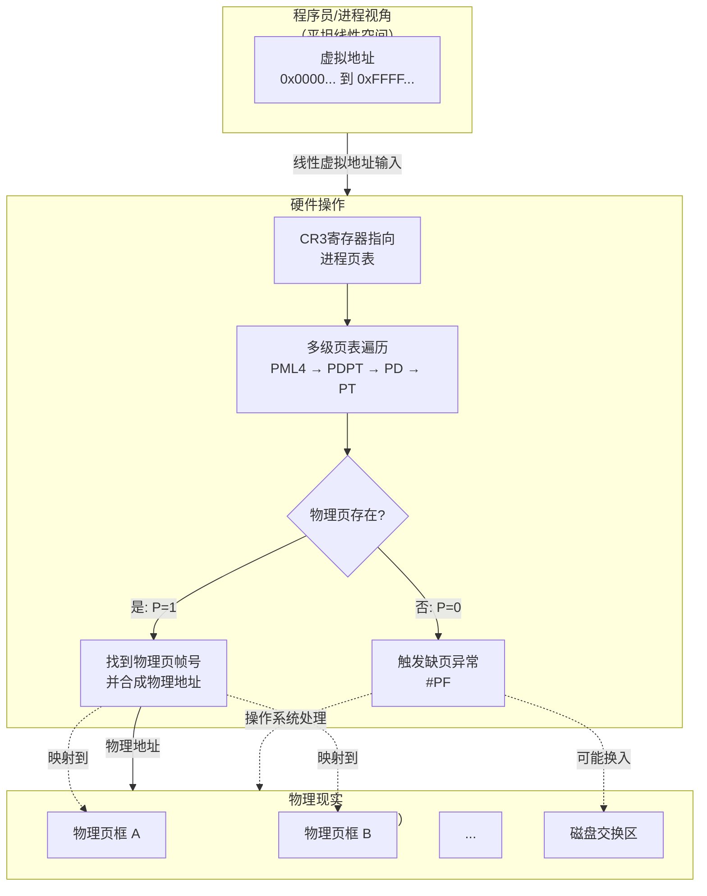
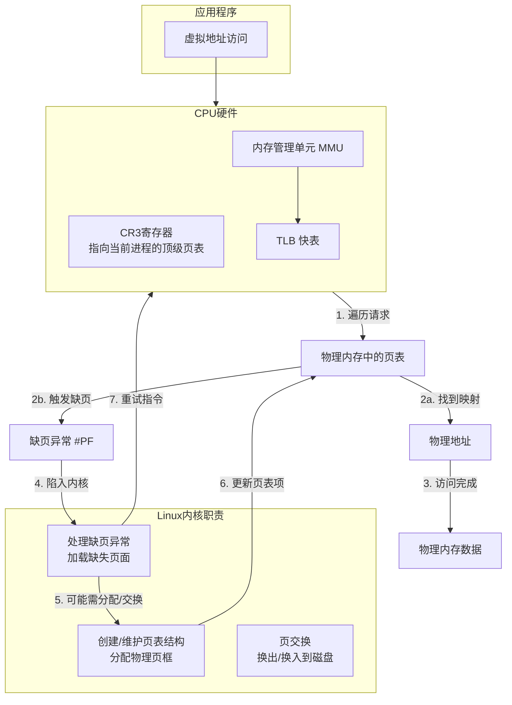
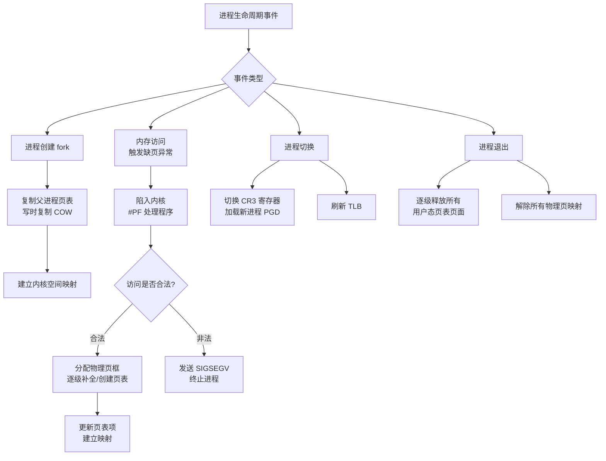
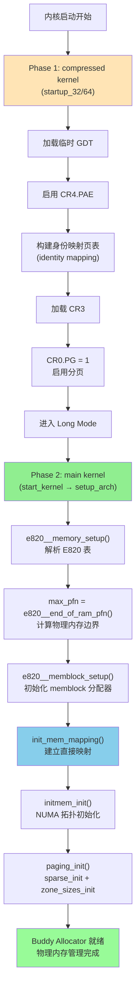

# Linux 内核分页机制完整指南：从理论到实践

## 文档导航

本文档是 Linux 内核分页机制的完整指南，从理论基础到启动阶段的实际页表建立，覆盖内核接管物理内存管理的全过程。

**文档结构**：
- **第一部分：理论基础与核心概念** - MMU 工作原理、地址转换、页表抽象
- **第二部分：Phase 1 - 早期页表建立** - compressed kernel (startup_32/64) 构建身份映射
- **第三部分：Phase 2 - 完整页表建立** - setup_arch() 中的 E820、memblock、init_mem_mapping、zone 初始化

**相关专题文档**（深入细节）：
- [GDT 详解：从保护模式到长模式](GDT_DETAILED_GUIDE.md) - GDT 的演化与作用、GDT Identity Mapping 机制
- [x86-64 多级页表设计详解](PAGE_TABLE_DESIGN.md) - 页表建立过程、多级设计原理、MMU 硬件遍历、实战计算
- [伙伴系统与 Slab 分配器详解](BUDDY_ALLOCATOR_GUIDE.md) - 物理页框和小对象分配

**相关子文档**（技术细节）：
- [E820 内存映射表详解](E820_MEMORY_MAP.md) - E820 表的数据结构与传递
- [SeaBIOS E820 构建流程](SEABIOS_E820_CONSTRUCTION.md) - BIOS 如何构建 E820 表
- [Linux 内核启动流程](LINUX_KERNEL_INIT.md) - 完整的内核启动过程（包含 startup_64 和 start_kernel）

---

## 第一部分：理论基础与核心概念

### 1. Flat Model 与分页：虚拟"平坦"与物理"非线性"

在 Flat Model 下，程序员看到的是一个"平坦"的、线性的虚拟地址空间，但这绝不意味着物理地址也是线性访问的。分页机制正是在这个"平坦"的假象背后，负责管理高度非线性、碎片化的物理内存。

从"平坦虚拟视图"到"复杂物理现实"的转换过程：



#### 分页如何介入并工作？

分页通过**页表**（由操作系统管理、硬件自动查询的"映射数据库"）工作：

1. **建立映射规则**：操作系统为每个进程维护一套页表。页表项记录**虚拟页号到物理页框号的映射**及权限位（可读、可写、执行、用户态可否访问等）。
2. **硬件自动查表（MMU）**：程序访问虚拟地址时，CPU 的**MMU** 以 **CR3**（当前进程页表物理地址）为根，遍历页表，找到对应物理页框。
3. **处理异常**：若页表项 P=0 或权限不足，MMU 触发**缺页异常（#PF）**，内核处理程序负责分配物理页、从磁盘换入或终止进程。

#### "平坦"与"线性"的含义

- **对程序员/进程**：虚拟地址空间连续编号（如 0 到 2^48−1），可用简单指针运算。即"平坦线性"的体验。
- **对硬件/操作系统**：该空间被分割成固定大小**页**（如 4KB），每页可独立、随机映射到物理**页框**；不用的页可映射到磁盘交换区。

#### 类比：酒店与客房

- 酒店（物理内存）有 1000 个房间（页框），房间号不连续（101, 205, 317…）。
- **Flat Model**：前台给客人**连续虚拟房卡** 1～1000。
- **分页**：前台电脑的**映射系统**（页表）；刷 1 号卡实际开 101 号房，刷 2 号卡开 317 号房。
- 客人体验是"1 号房、2 号房…"，实际房间分散；若某房在打扫（页换出），系统触发缺页，内核再分配或换入。

**结论**：Flat Model 提供**虚拟地址空间的线性视图**，分页在其下**动态、非线性地管理物理映射**，两者结合实现虚拟内存。

---

### 2. GDT 与 Paging：两阶段地址转换

> **深入阅读**：GDT 的完整演化、长模式下的作用、与分页的协作关系，详见 [GDT 详解](GDT_DETAILED_GUIDE.md)

在 x86 架构中，**从逻辑地址到物理地址需要经过两个独立的转换阶段**，分别由 **GDT（段式管理）** 和 **页表（分页管理）** 完成：

```
逻辑地址（段选择子:偏移量）
    ↓
【第一阶段：段式转换 - GDT】
    CPU 从 GDT 读取段描述符 → 线性地址 = 段基址 + 偏移量
    ↓
【第二阶段：分页转换 - 页表】
    MMU 通过 CR3 和页表遍历 → 物理地址 = 页框基址 + 页内偏移
    ↓
物理地址
```

#### x86-64 长模式下的简化（Flat Model）

在 **x86-64 长模式** 下，段式管理被极大简化，但**两阶段转换仍然存在**：

| 方面 | 保护模式（32 位） | 长模式（64 位 Flat Model） |
|------|-------------------|---------------------------|
| **段基址** | 可以是任意值，实现内存分段 | **CS/DS/ES/SS 强制为 0**，FS/GS 例外（通过 MSR 设置） |
| **段限长** | 有效，用于边界检查 | **被忽略**（除了代码段用于判断 32/64 位模式） |
| **逻辑地址 vs 线性地址** | 不相等（线性地址 = 段基址 + 偏移） | **相等**（因为段基址为 0） |
| **GDT 是否必需** | 是 | **是**（虽然段式转换被简化，但 GDT 仍用于系统状态和权限控制） |
| **分页是否必需** | 可选（CR0.PG 可以为 0） | **强制启用**（长模式要求 CR0.PG=1） |

**为什么 Flat Model 下仍需要 GDT？**

即使段基址强制为 0，GDT 仍然承担以下关键职责：

1. **定义代码段模式**：CS 描述符的 **L 位**（Long Mode）决定 CPU 是执行 64 位代码还是 32 位兼容代码
2. **特权级控制**：段描述符的 **DPL**（描述符特权级）用于权限检查（Ring 0/3）
3. **TSS 管理**：GDT 中的 TSS 描述符指向任务状态段，存储内核栈指针（IST），供中断/异常/系统调用使用
4. **FS/GS 段基址**：虽然通过 MSR 设置，但仍需要 GDT 中有对应的描述符

#### 启动时的顺序依赖：为什么必须先 lgdt，再启用分页

从内核启动流程可以看到 **GDT 和分页的严格顺序依赖**：

```
【阶段 1】段式管理初始化（32 位保护模式）
    1. lgdt gdt            ← 加载 GDT（包含 __BOOT_DS、__KERNEL32_CS 等段描述符）
    2. 设置段寄存器         ← DS/ES/FS/GS/SS = __BOOT_DS
    3. 设置栈指针           ← ESP = boot_stack_end（需要 SS 段有效）
    4. lretl               ← 切换到 __KERNEL32_CS 代码段
    ────────── 此时段式管理已生效，CPU 可以正确执行指令和访问栈 ──────────

【阶段 2】分页管理初始化
    5. CR4.PAE = 1         ← 启用物理地址扩展（分页前提）
    6. 构建身份映射页表    ← 在内存中创建页表结构（需要能访问内存，依赖段和栈）
    7. CR3 = pgtable       ← 加载页表基址
    8. EFER.LME = 1        ← 启用长模式（仅标记，与 CR0.PG 同时生效）
    9. CR0.PG = 1          ← 启用分页
    ────────── 此时分页管理生效，进入长模式 ──────────

【阶段 3】切换到 64 位长模式
    10. lret               ← 切换到 __KERNEL_CS（64 位代码段，L=1）
```

**为什么必须是这个顺序？**

| 依赖关系 | 原因 |
|---------|------|
| **lgdt 必须在 CR0.PG 之前** | 在启用分页之前，CPU 需要能够执行指令、访问栈、读写内存。这些操作都依赖**段寄存器有效**（CS 用于取指、SS 用于栈访问、DS 用于数据访问）。 |
| **栈设置必须在构建页表之前** | 构建页表的代码需要使用栈（如保存寄存器、调用函数）。而栈需要 **SS 段寄存器指向有效的段描述符**。 |
| **页表构建必须在 CR0.PG 之前** | 启用分页（CR0.PG=1）的瞬间，MMU 就会开始使用 CR3 指向的页表进行地址转换。如果页表未就绪或 CR3 未设置，会立即触发缺页异常或三重故障。 |

---

### 3. Linux 内核与四级/五级页表管理

Linux 内核**需要管理**多级页表，但分工是：**硬件（MMU）自动遍历**，**内核负责创建和维护页表结构**。



#### 内核的核心任务

1. **页表结构的生命期**：进程创建时分配 PML4 并建立内核空间映射；**进程切换时把新进程的 PML4 物理地址写入 CR3**；进程退出时回收页表与物理页。
2. **缺页异常处理**：当 MMU 遍历到 P=0 或权限不足时触发 #PF。内核需：分析缺页原因；合法访问则分配物理页、**逐级创建缺失的中间页表**、在最后一级建立映射；非法访问则发 SIGSEGV。
3. **五级页表**：新内核（5.4+）支持五级页表（LA57），内核根据 CPU 能力选择四级或五级。

#### 软件架构：四级抽象与五级扩展

为兼容不同硬件（x86 四级、ARM 三级等），Linux 用一套通用软件模型管理页表。x86_64 的映射关系如下：

| 硬件级 (x86_64) | Linux 抽象层 | 主要数据结构 | 核心函数举例（用于遍历） |
|-----------------|--------------|--------------|---------------------------|
| **PML4**        | **PGD** - 页全局目录 | `pgd_t` | `pgd_offset(mm, address)` |
| **PDPT**        | **P4D** - 第4级目录 | `p4d_t` | `p4d_offset(pgd, address)` |
| **PD**          | **PUD** - 页上级目录 | `pud_t` | `pud_offset(p4d, address)` |
| **PT**          | **PMD** - 页中间目录 | `pmd_t` | `pmd_offset(pud, address)` |
| **PTE**         | **PTE** - 页表项 | `pte_t` | `pte_offset_map(pmd, address)` |

> 在启用**五级页表**（LA57）的系统中，在 PGD 之上会增加 **P5D**（`p5d_t`）抽象层。

内核通过这些函数在软件中模拟硬件遍历，用于查找或修改指定虚拟地址的页表项。

#### 页表生命周期管理



#### 关键机制简述

- **写时复制（COW）**：`fork` 时子进程不复制物理内存，而与父进程**共享页表，并将可写页标记为只读**。任一方写入时触发缺页，内核再分配新物理页并复制数据，是高效创建进程的基石。
- **缺页异常处理**：内核缺页处理程序需区分：**次要缺页**（页已在内存，仅需建立 PTE 映射）、**主要缺页**（需从磁盘或匿名分配新物理页）、**交换缺页**（页已换出到 swap，需选受害者换出再换入目标页）。
- **反向映射**：为在换出等场景下高效找到映射到某物理页的所有 PTE，内核维护从 `struct page` 到所有映射它的 `pte` 的反向映射数据结构。
- **巨页**：内核可将连续普通页合并为大页（如 2MB、1GB），在 PMD 或 PUD 级建立直接映射，减少 TLB 未命中、提升性能。

---

### 4. "图书馆"模型：内核与 MMU 的分工

| 角色 | 对应组件 | 职责 |
|------|----------|------|
| **图书管理员** | **Linux 内核** | 创建和维护检索系统：建立顶级页表（PML4）、决定每"本书"放在哪一页框、换出时更新页表 |
| **智能检索机** | **MMU** | 根据虚拟地址自动查多级页表、输出物理地址、**TLB 缓存**最近结果 |
| **访客/读者** | **用户程序** | 只提出"某虚拟地址"的访问，不关心物理位置 |
| **图书馆建筑** | **物理内存+磁盘** | 存储实体，由内核调度 |

#### 关键过程对应

1. **缺页**：读者要"新书" → 检索机查目录发现未上架（P=0）→ 触发 #PF → 内核分配页框、可能从磁盘换入、填写页表 → 返回重试，检索机即可找到。
2. **进程切换**：换上新读者的**专属目录**（加载新进程的 CR3）；MMU 刷新 TLB，改用新目录。
3. **共享库**：多个进程的页表可指向同一物理页框（如 libc），节省内存。

**结论**："内核维护目录，MMU 负责快速查表"概括了**软件管理元数据、硬件加速查找**的分工；两者通过**缺页异常**协作，实现每进程独占连续虚拟地址空间的假象。

---

## 第二部分：Phase 1 - 早期页表建立（压缩内核阶段）

### 5. Phase 1 概述：compressed kernel 中的身份映射

**时间节点**：GRUB 跳转到内核后，CPU 执行 `arch/x86/boot/compressed/head_64.S` 中的 **startup_32** 或 **startup_64**。

**核心任务**：
1. 加载临时 GDT
2. 启用 PAE（物理地址扩展）
3. 构建**身份映射页表**（identity mapping）：虚拟地址 = 物理地址
4. 设置 CR3 指向页表基址
5. 启用分页（CR0.PG = 1）并进入 long mode
6. 跳转到 64 位代码继续执行

**为什么需要身份映射？**

此时内核代码本身运行在某个物理地址（如 0x1000000），启用分页后 CPU 取指令仍用相同的地址（因为 IP 寄存器是物理地址）。如果不建立身份映射，启用分页后立即触发缺页异常。

**身份映射示例**：
```
物理地址 0x1000000 → 虚拟地址 0x1000000 （映射到自己）
物理地址 0x2000000 → 虚拟地址 0x2000000
...
```

### 6. startup_32/64 页表构建流程

> **完整流程**：详见 [Linux 内核启动流程](LINUX_KERNEL_INIT.md) 第二章"压缩内核启动流程"

以下是关键步骤的代码分析（基于 `arch/x86/boot/compressed/head_64.S`）：

#### 6.1 加载临时 GDT

```asm
# arch/x86/boot/compressed/head_64.S:startup_32
startup_32:
    # 计算 GDT 物理地址（位置无关代码）
    leal    rva(gdt)(%ebp), %eax
    movl    %eax, 2(%eax)
    lgdt    (%eax)                  # 加载 GDT

    # 设置段寄存器
    movl    $__BOOT_DS, %eax
    movl    %eax, %ds
    movl    %eax, %es
    movl    %eax, %fs
    movl    %eax, %gs
    movl    %eax, %ss

    # 设置栈（依赖 SS 段有效）
    leal    rva(boot_stack_end)(%ebp), %esp

    # 远跳转切换到 __KERNEL32_CS 代码段
    leal    rva(1f)(%ebp), %eax
    pushl   $__KERNEL32_CS
    pushl   %eax
    lretl
1:
```

**关键点**：
- **rva** 宏实现位置无关代码（RIP-relative addressing）
- **lgdt** 后段寄存器才有效，可以使用栈
- **lretl** 实现远跳转，同时切换 CS

#### 6.2 启用 PAE 并构建页表

```asm
    # 启用 PAE（Physical Address Extension）
    movl    %cr4, %eax
    orl     $X86_CR4_PAE, %eax
    movl    %eax, %cr4

    # 构建身份映射页表（简化示例）
    # 实际代码在 arch/x86/boot/compressed/head_64.S:160-260
    # 使用 2MB 大页映射，覆盖内核镜像所在区域

    leal    rva(pgtable)(%ebx), %edi  # EDI = 页表基址

    # 清零页表区域
    xorl    %eax, %eax
    movl    $(BOOT_PGT_SIZE/4), %ecx
    rep stosl

    # 构建 PML4（顶级页表）
    leal    rva(pgtable)(%ebx), %edi
    leal    0x1007(%edi), %eax        # PML4[0] = PDPT 地址 | 0x007（P=1, RW=1, US=1）
    movl    %eax, 0(%edi)

    # 构建 PDPT（页目录指针表）
    addl    $0x1000, %edi
    leal    0x1007(%edi), %eax        # PDPT[0] = PD 地址 | 0x007
    movl    %eax, 0(%edi)

    # 构建 PD（页目录，使用 2MB 大页）
    addl    $0x1000, %edi
    movl    $0x00000183, %eax         # PD[0] = 0 | 0x183（PS=1, G=1, P=1, RW=1）
    movl    $512, %ecx                # 512 项 PD，覆盖 1GB
1:  movl    %eax, 0(%edi)
    addl    $0x200000, %eax           # 下一个 2MB 页
    addl    $8, %edi
    decl    %ecx
    jnz     1b
```

**关键点**：
- **2MB 大页**（PS=1 in PDE）：减少页表占用，简化构建
- **覆盖范围**：通常映射 512 × 2MB = 1GB，足够覆盖内核和 ramdisk
- **权限位**：P=1（存在），RW=1（可写），PS=1（大页）

#### 6.3 加载 CR3 并启用分页

```asm
    # 加载页表基址到 CR3
    leal    rva(pgtable)(%ebx), %eax
    movl    %eax, %cr3

    # 启用 long mode（EFER.LME = 1）
    movl    $MSR_EFER, %ecx
    rdmsr
    btsl    $_EFER_LME, %eax
    wrmsr

    # 启用分页（CR0.PG = 1）
    movl    $CR0_STATE, %eax          # CR0_STATE = CR0.PG | CR0.PE | ...
    movl    %eax, %cr0

    # 此时进入 long mode（EFER.LME=1 + CR0.PG=1 同时生效）

    # 远跳转到 64 位代码段
    leal    rva(startup_64)(%ebp), %eax
    pushl   $__KERNEL_CS              # 64 位代码段（L=1）
    pushl   %eax
    lretl                             # 跳转到 startup_64
```

**关键点**：
- **CR3 加载**：必须在 CR0.PG=1 之前完成
- **EFER.LME**：标记启用 long mode，与 CR0.PG 同时生效
- **CR0.PG=1**：启用分页的瞬间，MMU 开始使用 CR3 指向的页表

#### 6.4 进入 64 位 long mode

```asm
# 现在 CPU 已进入 64 位 long mode
    .code64
startup_64:
    # 设置 64 位栈指针
    leaq    rva(boot_stack_end)(%rbx), %rsp

    # 清理 BSS 段
    # 解压内核镜像
    # 跳转到解压后的内核入口点（startup_64 in main kernel）
    # ...
```

### 7. Phase 1 的局限性与过渡作用

**Phase 1 页表的特点**：
- **身份映射**：虚拟地址 = 物理地址
- **覆盖范围有限**：通常只映射 1GB 左右（内核镜像 + ramdisk）
- **临时性质**：在 `startup_64`（main kernel）中会被 `early_top_pgt` 替换
- **简单结构**：使用 2MB 大页，不支持细粒度权限控制

**过渡作用**：
1. 使 CPU 能够启用分页并进入 long mode
2. 为后续内核解压提供可执行环境
3. 跳转到 main kernel 后，由 `early_top_pgt` 接管
4. 最终在 `init_mem_mapping()` 中建立完整的直接映射

**GDT 演化**：
- **此阶段的 GDT**：`head_64.S` 中的临时 `gdt` 数组（3 个描述符：NULL、CODE、DATA）
- **下一阶段**：main kernel 的 `early_gdt_descr` → `gdt_page`（per-CPU GDT）

> **详细演化**：GDT 从 GRUB → compressed kernel → main kernel → per-CPU 的完整演化，详见 [GDT 详解](GDT_DETAILED_GUIDE.md)

---

## 第三部分：Phase 2 - 完整页表建立（setup_arch 阶段）

### 8. Phase 2 概述：从早期页表到完整内存管理

**时间节点**：main kernel 的 `start_kernel()` → `setup_arch()`

**核心任务**：
1. 解析 E820 表，获取物理内存布局
2. 计算 `max_pfn`（物理内存最大页帧号）
3. 初始化 `memblock`（早期内存分配器）
4. **`init_mem_mapping()`**：为全部物理 RAM 建立直接映射
5. **`initmem_init()`**：NUMA 拓扑初始化
6. **`paging_init()`**：初始化稀疏内存模型和 zone

**与 Phase 1 的区别**：

| 对比项 | Phase 1（compressed kernel） | Phase 2（setup_arch） |
|--------|----------------------------|----------------------|
| **页表类型** | 身份映射（virt = phys） | 直接映射（virt = phys + PAGE_OFFSET） |
| **覆盖范围** | ~1GB（内核镜像区域） | 全部物理 RAM（由 max_pfn 决定） |
| **页表来源** | 内联构建（汇编代码） | 从 memblock 分配，C 代码填充 |
| **GDT** | 临时 GDT（3 个描述符） | 运行时 GDT（per-CPU） |
| **分页已启用** | 是（CR0.PG=1） | 是（继承自 Phase 1，后切换到 swapper_pg_dir） |

**E820 表的读取时机澄清**：
- **GRUB** 已将 E820 表放入 `boot_params.e820_table`
- **Phase 1** 可以访问 `boot_params`，但不解析 E820（仅构建固定大小的身份映射）
- **Phase 2** 在 `setup_arch()` 中调用 `e820__memory_setup()` 正式解析 E820


### 9. setup_arch() 调用顺序概览

`setup_arch()` 中与内存接管相关的主要调用顺序（x86_64，简化）如下：

```
setup_arch()（arch/x86/kernel/setup.c）
    ├─ early_reserve_memory()           // 在加入 memblock 前预留区域
    ├─ e820__memory_setup()             // 解析 E820，填充 e820_table
    ├─ ...（max_pfn、e820__finish_early_params、e820__memblock_setup 前诸多步骤）
    ├─ max_pfn = e820__end_of_ram_pfn()
    ├─ e820__memblock_setup()           // 将 E820 RAM 加入 memblock
    ├─ init_mem_mapping()               // 建立直接映射（内核页表）
    ├─ ...
    ├─ initmem_init()                   // NUMA/memblock 节点（init_64.c）
    ├─ x86_init.paging.pagetable_init() // 实际调用 paging_init()
    └─ ...
```

- **e820**：固件/引导程序提供的物理内存布局（E820 表）。
- **memblock**：早期物理内存分配器，在伙伴系统之前使用。
- **init_mem_mapping**：为物理 RAM 建立内核直接映射（页表），使内核能访问全部可用物理页。
- **paging_init**：在 x86_64 上初始化 sparse 与 zone（sparse_init、zone_sizes_init），为后续伙伴系统做准备。

---

### 10. E820 内存映射表

**E820 表**（E820 Memory Map）是 x86 架构上描述物理内存布局的标准机制，由 BIOS/固件提供给操作系统。

**核心作用**：
- 告诉操作系统哪些物理内存区域是可用 RAM（可以被内核分配和使用）
- 标识哪些区域被保留（BIOS、设备内存映射、ACPI 表等，不可覆盖）
- 提供每个区域的起始地址和大小

**数据流程**：
```
固件层（BIOS/UEFI）
    ↓ 构建 E820 表
Bootloader（GRUB）
    ↓ 传递 boot_params.e820_table
Linux 内核（setup_arch）
    ↓ e820__memory_setup()
内核内存管理（memblock, buddy system）
```

**关键数据结构**：
```c
// Linux Kernel - arch/x86/include/uapi/asm/e820.h
struct boot_e820_entry {
    __u64 addr;    // 物理起始地址
    __u64 size;    // 区域大小（字节）
    __u32 type;    // 内存类型
} __attribute__((packed));

// boot_params 中的 E820 表（最多 128 项）
struct boot_params {
    // ...
    __u8  e820_entries;              // 实际条目数
    struct boot_e820_entry e820_table[E820_MAX_ENTRIES_ZEROPAGE];
    // ..
};
```

> **详细内容**：完整的 E820 数据结构、内核接收流程、SeaBIOS 构建详解，请参见 [E820 内存映射表详解](E820_MEMORY_MAP.md) 和 [SeaBIOS E820 构建流程](SEABIOS_E820_CONSTRUCTION.md)。

---

### 11. max_pfn 与 memblock：早期分配器

在 `setup_arch()` 中，内核已经通过 `e820__memory_setup()` 获取了物理内存布局（存储在 `e820_table`），接下来需要：
1. 确定物理内存的边界（`max_pfn`）
2. 将可用 RAM 导入早期分配器（`memblock`）

这两步是内核接管物理内存管理的基础。

#### 11.1 max_pfn 的计算

**max_pfn** (Maximum Page Frame Number) 表示**物理 RAM 的最大页帧号**，由 `e820__end_of_ram_pfn()` 计算得出。

**PFN**（Page Frame Number，页帧号）是物理地址按页大小（通常 4KB）对齐后的索引：

```c
物理地址 = PFN × PAGE_SIZE
PFN = 物理地址 >> PAGE_SHIFT

// 示例
物理地址 0x100000 (1MB)  → PFN = 0x100000 >> 12 = 0x100 (256)
物理地址 0x40000000 (1GB) → PFN = 0x40000000 >> 12 = 0x40000 (262144)
```

```c
// Linux Kernel - arch/x86/kernel/e820.c:870
unsigned long __init e820__end_of_ram_pfn(void)
{
    return e820_end_pfn(MAX_ARCH_PFN, E820_TYPE_RAM);
}

static unsigned long __init e820_end_pfn(unsigned long limit_pfn, 
                                          enum e820_type type)
{
    int i;
    unsigned long max_pfn = 0;
    struct e820_table *table = &e820_table;

    // 遍历 E820 表中的所有条目
    for (i = 0; i < table->nr_entries; i++) {
        struct e820_entry *entry = &table->entries[i];
        unsigned long start_pfn;
        unsigned long end_pfn;

        // 只处理指定类型（E820_TYPE_RAM）的区域
        if (entry->type != type)
            continue;

        start_pfn = entry->addr >> PAGE_SHIFT;
        end_pfn = (entry->addr + entry->size) >> PAGE_SHIFT;

        // 限制在架构最大 PFN 范围内
        if (start_pfn >= limit_pfn)
            continue;
        if (end_pfn > limit_pfn)
            end_pfn = limit_pfn;

        // 更新最大 PFN
        if (end_pfn > max_pfn)
            max_pfn = end_pfn;
    }

    return max_pfn;
}
```

#### 11.2 memblock：早期内存分配器

在内核 buddy allocator（伙伴系统）初始化之前，内核需要一个**早期分配器**来分配内存（例如页表、内核数据结构）。**memblock** 就是这个早期分配器。

```c
// Linux Kernel - include/linux/memblock.h:85
struct memblock {
    bool bottom_up;              // 分配方向：自底向上 or 自顶向下
    phys_addr_t current_limit;   // 当前分配上限（可动态调整）

    struct memblock_type memory;    // 可用内存区域
    struct memblock_type reserved;  // 保留内存区域
    struct memblock_type physmem;   // 物理内存（CONFIG_ARCH_KEEP_MEMBLOCK）
};

struct memblock_region {
    phys_addr_t base;
    phys_addr_t size;
    enum memblock_flags flags;
    int nid;  // NUMA 节点 ID
};
```

**memblock 的两个关键区域**：
- **memblock.memory**：记录**哪些物理地址是可用 RAM**（从 E820_TYPE_RAM 导入）
- **memblock.reserved**：记录**哪些物理地址已被分配或必须保留**（内核镜像、initrd、页表等）

#### 11.3 e820__memblock_setup() 实现

```c
// Linux Kernel - arch/x86/kernel/e820.c:1240
void __init e820__memblock_setup(void)
{
    int i;
    u64 end;

    // 遍历 E820 表中的所有条目
    for (i = 0; i < e820_table->nr_entries; i++) {
        struct e820_entry *entry = &e820_table->entries[i];

        end = entry->addr + entry->size;
        if (end > max_pfn << PAGE_SHIFT)
            end = max_pfn << PAGE_SHIFT;
        if (entry->addr >= end)
            continue;

        // E820_TYPE_RAM：可用内存，添加到 memblock.memory
        if (entry->type == E820_TYPE_RAM) {
            memblock_add(entry->addr, entry->size);
        }

        // E820_TYPE_SOFT_RESERVED：软保留内存
        if (entry->type == E820_TYPE_SOFT_RESERVED) {
            memblock_reserve(entry->addr, entry->size);
        }
    }

    // 设置 memblock 分配上限（在 init_mem_mapping() 完成前，限制在 ISA_END_ADDRESS）
    memblock_set_current_limit(ISA_END_ADDRESS);

    // 保留内核镜像占用的物理内存
    memblock_reserve(__pa_symbol(_text), 
                     (unsigned long)__pa_symbol(_end) - 
                     (unsigned long)__pa_symbol(_text));

    // 保留 initrd（初始 RAM 盘）占用的内存
    if (boot_params.hdr.type_of_loader && boot_params.hdr.ramdisk_image) {
        u64 ramdisk_image = boot_params.hdr.ramdisk_image;
        u64 ramdisk_size  = boot_params.hdr.ramdisk_size;
        memblock_reserve(ramdisk_image, ramdisk_size);
    }

    // 保留其他关键区域（BIOS、ACPI 表等）
    e820__reserve_resources();
}
```

**memblock_add() 和 memblock_reserve() 的区别**：

| 函数 | 作用 | 添加到 | 示例 |
|------|------|--------|------|
| `memblock_add(addr, size)` | 声明物理内存**可用** | `memblock.memory` | E820_TYPE_RAM 区域 |
| `memblock_reserve(addr, size)` | 标记物理内存**已占用** | `memblock.reserved` | 内核镜像、initrd、页表 |

**重要概念**：一块物理内存可以**同时**在 `memory` 和 `reserved` 中：
- 在 `memory` 中表示"这是可用 RAM"
- 在 `reserved` 中表示"但已被占用，不可再分配"

---

### 12. init_mem_mapping()：建立直接映射（内核页表）

在 `e820__memblock_setup()` 完成后，内核已经知道了哪些物理地址是可用 RAM（存储在 `memblock.memory`），但此时内核**还不能访问全部物理内存**，因为：

1. **早期页表有限**：bootloader 建立的页表只映射了有限范围（通常几百 MB）
2. **高端内存未映射**：超出早期映射范围的物理内存无法访问

**`init_mem_mapping()` 的作用**：为**全部物理 RAM** 建立**内核直接映射**（Direct Mapping），使内核可以通过固定的虚拟地址偏移访问任意物理内存。

#### 12.1 什么是直接映射（Direct Mapping）？

**直接映射**是一种特殊的虚拟地址映射方式：虚拟地址与物理地址之间保持**固定偏移量**。

**x86_64 的地址空间布局**：

```
虚拟地址空间（x86_64）：
┌─────────────────────────────────────────────────────────┐
│ 用户空间          0x0000000000000000 - 0x00007FFFFFFFFFFF │ 0-128TB
├─────────────────────────────────────────────────────────┤
│ 非规范地址        0x0000800000000000 - 0xFFFF7FFFFFFFFFFF │ (禁止)
├─────────────────────────────────────────────────────────┤
│ 内核空间          0xFFFF800000000000 - 0xFFFFFFFFFFFFFFFF │ 128TB
│  ├─ 直接映射       0xFFFF880000000000 - ...              │ ← 本节重点
│  ├─ vmalloc 区域   0xFFFFC90000000000 - ...              │
│  ├─ vmemmap        0xFFFFEA0000000000 - ...              │
│  └─ 内核代码/数据   0xFFFFFFFF80000000 - ...              │
└─────────────────────────────────────────────────────────┘
```

**直接映射公式**（x86_64）：
```c
// Linux Kernel - arch/x86/include/asm/page_64.h
#define __PAGE_OFFSET_BASE      0xFFFF880000000000UL
#define __START_KERNEL_map      0xFFFFFFFF80000000UL

// 物理地址 → 虚拟地址（直接映射）
#define __va(x)   ((void *)((unsigned long)(x) + PAGE_OFFSET))

// 虚拟地址 → 物理地址（直接映射）
#define __pa(x)   ((unsigned long)(x) - PAGE_OFFSET)

// 示例
物理地址 0x1000000   → 虚拟地址 0xFFFF880001000000
物理地址 0x40000000  → 虚拟地址 0xFFFF880040000000
```

**为什么需要直接映射？**

| 需求 | 没有直接映射 | 有直接映射 |
|------|-----------|------------|
| 访问物理内存 | 需要动态建立临时映射（慢） | `__va(paddr)` 即可访问（快） |
| 内核数据结构 | 需要为每个对象建立映射 | 直接在直接映射区分配 |
| DMA 缓冲区 | 需要特殊处理 | 物理地址与虚拟地址固定偏移 |

#### 12.2 init_mem_mapping() 实现流程

```c
// Linux Kernel - arch/x86/mm/init.c:758
void __init init_mem_mapping(void)
{
    unsigned long end;

    // 确定映射范围：0 到 max_pfn
    probe_page_size_mask();   // 检测 CPU 支持的页大小（4KB/2MB/1GB）

    // Step 1: 映射 ISA 区域（0 - ISA_END_ADDRESS，通常 1MB）
    init_memory_mapping(0, ISA_END_ADDRESS, PAGE_KERNEL);

    // Step 2: 初始化 trampoline
    init_trampoline();

    // Step 3: 映射全部 RAM（ISA_END_ADDRESS 到 max_pfn）
    end = max_pfn << PAGE_SHIFT;

    if (memblock_bottom_up()) {
        // 自底向上映射（推荐）
        unsigned long kernel_end = __pa_symbol(_end);
        
        memory_map_bottom_up(kernel_end, end);
        memory_map_bottom_up(ISA_END_ADDRESS, kernel_end);
    } else {
        // 自顶向下映射（旧方式）
        memory_map_top_down(ISA_END_ADDRESS, end);
    }

    // Step 4: 切换到新页表
    load_cr3(swapper_pg_dir);
    __flush_tlb_all();

    // Step 5: 放宽 memblock 分配限制
    memblock_set_current_limit(max_pfn << PAGE_SHIFT);

    pr_info("init_mem_mapping: [mem 0x00000000-0x%016lx]\n", end - 1);
    
    early_memtest(0, max_pfn << PAGE_SHIFT);  // 可选的内存测试
}
```

#### 12.3 kernel_physical_mapping_init()：核心页表填充函数

```c
// Linux Kernel - arch/x86/mm/init_64.c:550
unsigned long __meminit
kernel_physical_mapping_init(unsigned long paddr_start,
                              unsigned long paddr_end,
                              unsigned long page_size_mask,
                              pgprot_t prot)
{
    unsigned long vaddr, vaddr_start, vaddr_end, vaddr_next;
    pgd_t *pgd;
    p4d_t *p4d;
    pud_t *pud;
    pmd_t *pmd;
    pte_t *pte;

    // 计算虚拟地址范围（直接映射）
    vaddr = (unsigned long)__va(paddr_start);
    vaddr_end = (unsigned long)__va(paddr_end);
    vaddr_start = vaddr;

    // 遍历 PGD（Page Global Directory）层级
    for (; vaddr < vaddr_end; vaddr = vaddr_next) {
        pgd = pgd_offset_k(vaddr);  // 获取 PGD 表项

        // 如果 PGD 表项为空，分配 P4D 页表
        if (pgd_none(*pgd)) {
            p4d = (p4d_t *)alloc_low_page();  // 从 memblock 分配页表页
            set_pgd(pgd, __pgd(__pa(p4d) | _KERNPG_TABLE));
        }

        p4d = p4d_offset(pgd, vaddr);

        // 遍历 PUD（Page Upper Directory）层级
        vaddr_next = (vaddr & PUD_MASK) + PUD_SIZE;
        if (vaddr_next > vaddr_end)
            vaddr_next = vaddr_end;

        pud = pud_offset(p4d, vaddr);

        // 尝试使用 1GB 大页（需要 CPU 支持）
        if (page_size_mask & (1 << PG_LEVEL_1G)) {
            if (pud_none(*pud)) {
                unsigned long paddr = vaddr - PAGE_OFFSET;
                set_pud(pud, __pud(paddr | __PAGE_KERNEL_LARGE));
                continue;  // 1GB 大页映射完成，跳过 PMD/PTE
            }
        }

        // 分配 PMD 页表
        if (pud_none(*pud)) {
            pmd = (pmd_t *)alloc_low_page();
            set_pud(pud, __pud(__pa(pmd) | _KERNPG_TABLE));
        }

        pmd = pmd_offset(pud, vaddr);

        // 尝试使用 2MB 大页（推荐）
        if (page_size_mask & (1 << PG_LEVEL_2M)) {
            if (pmd_none(*pmd)) {
                unsigned long paddr = vaddr - PAGE_OFFSET;
                set_pmd(pmd, __pmd(paddr | __PAGE_KERNEL_LARGE));
                continue;  // 2MB 大页映射完成，跳过 PTE
            }
        }

        // 使用 4KB 小页（兜底方案）
        if (pmd_none(*pmd)) {
            pte = (pte_t *)alloc_low_page();
            set_pmd(pmd, __pmd(__pa(pte) | _KERNPG_TABLE));
        }

        pte = pte_offset_kernel(pmd, vaddr);
        if (pte_none(*pte)) {
            unsigned long paddr = vaddr - PAGE_OFFSET;
            set_pte(pte, __pte(paddr | pgprot_val(prot)));
        }
    }

    __flush_tlb_all();  // 刷新 TLB
    return vaddr_end;
}
```

#### 12.4 大页支持（2MB/1GB pages）

| 页大小 | 层级 | 映射范围 | 页表项数 | TLB 效率 | 使用场景 |
|--------|------|---------|---------|---------|---------| 
| **4KB** | PTE | 4KB | 1 | 低 | 精细控制（设备内存） |
| **2MB** | PMD | 2MB | 512 个 PTE | 中 | **内核直接映射**（推荐） |
| **1GB** | PUD | 1GB | 512 个 PMD | 高 | 大内存系统（需 CPU 支持） |

**为什么使用 2MB 大页？**

1. **减少页表占用**：映射 1GB 内存，4KB 页需要 2MB 页表，2MB 大页只需 4KB 页表
2. **提高 TLB 命中率**：2MB 页 TLB 可覆盖 64MB 内存，4KB 页 TLB 只能覆盖 256KB
3. **简化页表遍历**：减少一级页表查询

---

### 13. initmem_init() 与 paging_init()：NUMA 与 zone

在 `init_mem_mapping()` 完成后，内核已经可以访问全部物理 RAM（通过直接映射），但此时物理内存还**没有被划分成可管理的单元**（zone）。

**`initmem_init()` 和 `paging_init()` 的作用**：
1. **`initmem_init()`**：将物理内存与 NUMA 节点关联
2. **`paging_init()`**：初始化内存管理 zone，为 buddy allocator 做准备

#### 13.1 什么是 zone？

**zone**（内存区域）是 Linux 内核对物理内存的**功能性划分**，不同 zone 有不同的用途和限制。

**x86_64 的 zone 划分**：

```
物理内存 zone 划分（x86_64）：
┌─────────────────────────────────────────────────────────┐
│ ZONE_DMA          0x00000000 - 0x01000000 (0-16MB)      │
│   用途：ISA 设备 DMA（需要低于 16MB 的物理地址）         │
├─────────────────────────────────────────────────────────┤
│ ZONE_DMA32        0x01000000 - 0x100000000 (16MB-4GB)   │
│   用途：32 位设备 DMA（需要低于 4GB 的物理地址）         │
├─────────────────────────────────────────────────────────┤
│ ZONE_NORMAL       0x100000000 - max_pfn (4GB-物理内存尾)│
│   用途：普通内存分配（内核数据、用户页面等）             │
├─────────────────────────────────────────────────────────┤
│ ZONE_MOVABLE      （可选）动态划分                      │
│   用途：可迁移页面（内存热插拔、大页整理）               │
└─────────────────────────────────────────────────────────┘
```

**为什么需要 zone？**

| 需求 | 没有 zone | 有 zone 划分 |
|------|----------|-------------|
| ISA 设备 DMA | 可能分配高于 16MB 的地址（失败） | 从 ZONE_DMA 分配（成功） |
| 32 位设备 DMA | 可能分配高于 4GB 的地址（失败） | 从 ZONE_DMA32 分配（成功） |
| 内存热插拔 | 无法区分可移动/不可移动页面 | ZONE_MOVABLE 只含可移动页 |

#### 13.2 initmem_init() - NUMA 拓扑初始化

```c
// Linux Kernel - arch/x86/mm/numa.c:760
void __init initmem_init(void)
{
    // x86_64：初始化 NUMA 配置
    x86_numa_init();
}

// Linux Kernel - arch/x86/mm/numa.c:680
void __init x86_numa_init(void)
{
    int ret;

    // 尝试从 ACPI SRAT 表获取 NUMA 信息
    if (!numa_off) {
        ret = x86_acpi_numa_init();
        if (!ret)
            return;
    }

    // 如果 ACPI 失败，尝试从 AMD Northbridge 获取
    ret = amd_numa_init();
    if (!ret)
        return;

    // 如果都失败，使用虚拟 NUMA（dummy_numa_init）
    // 将全部内存视为单个 NUMA 节点（Node 0）
    numa_off = 1;
    pr_info("No NUMA configuration found, using dummy NUMA.\n");
    dummy_numa_init();
}
```

#### 13.3 paging_init() - 稀疏内存与 zone

```c
// Linux Kernel - arch/x86/mm/init_64.c:819
void __init paging_init(void)
{
    // 初始化稀疏内存模型（sparse memory model）
    // 为 struct page 数组分配空间
    sparse_init();

    // 初始化 zone（内存区域）
    // 计算每个 zone 的大小并初始化 free_area
    zone_sizes_init();

    // x86_64 特定：设置 vsyscall 页面（已弃用）
    map_vsyscall();
}
```

**注意**：`paging_init()` 的名称容易误导，它**不是建立页表**，而是：
1. 初始化**稀疏内存模型**（struct page 数组）
2. 初始化**内存区域**（zone）和空闲列表（free_area）

> **详细内容**：稀疏内存模型（Sparse Memory Model）、vmemmap、struct page、buddy allocator 的完整实现，详见 [伙伴系统与 Slab 分配器详解](BUDDY_ALLOCATOR_GUIDE.md)

---

## 14. 小结：内核接管内存的完整流程

本文档覆盖了 Linux 内核从理论到实践的完整分页机制，以下是关键时间节点的总结：



**内核接管内存的"关键一步"**：

- **"知道有哪些物理内存"**：**e820__memory_setup()** + **e820__memblock_setup()**（E820 → e820_table → memblock）
- **"能访问这些物理内存"**：**init_mem_mapping()**（建立直接映射并切换 CR3）
- **"能按页分配与管理"**：**paging_init()**（sparse_init + zone_sizes_init），为伙伴系统准备好 zone

因此，**setup_arch() 中内核对物理内存的完整接管**是由 **e820 解析 → memblock 建立 → init_mem_mapping → paging_init** 这一整条链完成的；若只选"一步"作为"关键"，通常是 **init_mem_mapping()**（建立直接映射并切换页表），因为此前内核还不能线性访问全部 RAM，此后才可以。

**GDT 的演化**：

| 阶段 | GDT 来源 | 描述符数量 | 用途 |
|------|---------|----------|------|
| **GRUB** | GRUB 内部 GDT | 3-4 个 | 引导加载器执行环境 |
| **Phase 1** | `head_64.S:gdt` | 3 个（NULL, CODE, DATA） | compressed kernel 临时 GDT |
| **Phase 2 早期** | `early_gdt_descr` | 若干个 | main kernel 早期 GDT |
| **Phase 2 后期** | `gdt_page` (per-CPU) | 完整 GDT | 运行时 per-CPU GDT |

> **详细演化**：GDT 从 GRUB → compressed kernel → main kernel → per-CPU 的完整演化，详见 [GDT 详解](GDT_DETAILED_GUIDE.md)

**物理内存分配体系**：

```
页表管理（本文档）
    ↓
物理页框分配（伙伴系统）
    ↓
小对象分配（Slab/SLUB）
    ↓
内核对象使用
```

> **详细内容**：伙伴系统、Slab 分配器、从 memblock 到 buddy 的过渡，详见 [伙伴系统与 Slab 分配器详解](BUDDY_ALLOCATOR_GUIDE.md)

---

## 附录 A：关键问题深入解答

### Q1: UEFI 的 E820 支持

UEFI 固件**不使用 E820 表**，而是提供 **`GetMemoryMap()` 服务**。

- **EDK2 实现**：`MdeModulePkg/Core/Dxe/Mem/Page.c:CoreGetMemoryMap()`
- **EFI 内存类型**：14 种类型（vs E820 的 5 种），包括 BootServices（可回收）、RuntimeServices（不可回收）等
- **GRUB 转换**：GRUB 在 UEFI 模式下调用 GetMemoryMap，将 EFI 内存映射转换为 E820 格式传递给 Linux 内核
- **Linux 内核**：收到的仍是 E820 格式（由 GRUB 转换），但内核也保留原始 EFI 内存映射

> **详细实现**：完整的 EDK2 GetMemoryMap() 源码和 GRUB 转换逻辑，请参见 [Bootloader 内存信息传递](BOOTLOADER_MEMORY_PASSING.md)。

### Q2: 内核接收 E820 表的逻辑是否统一？

**答：是的，完全统一**。无论是 BIOS 还是 UEFI 启动，Linux 内核接收到的都是 **E820 格式**的内存映射。

**关键点**：
- ✅ **内存管理统一**：无论 BIOS/UEFI，内核都用 `e820_table` 进行内存管理
- ✅ **接收逻辑统一**：`e820__memory_setup()` 从 `boot_params.e820_table` 读取
- ⚠️ **UEFI 特殊性**：内核额外保留 `efi.memmap`，用于 EFI Runtime Services
- ✅ **GRUB 的抽象层**：GRUB 负责将不同固件接口统一为 E820 格式

**统一接口的设计**：

```
固件层（BIOS/UEFI）
    ↓ BIOS: INT 15h E820
    ↓ UEFI: GetMemoryMap()
引导加载器（GRUB）
    ↓ 统一转换为 E820 格式
    ↓ 存入 boot_params.e820_table
Linux 内核
    ↓ e820__memory_setup() 统一解析
    ↓ e820_table 全局表
内存管理（memblock, buddy, etc.)
```

> **详细流程和代码**：统一接口设计、完整数据流、内核代码分析，请参见 [Bootloader 内存信息传递](BOOTLOADER_MEMORY_PASSING.md)。

### Q3: 512GB 内存的系统也是这个机制吗？

**答：是的，机制完全相同**，但有一些实际考虑：

**数据结构容量充足**：
- E820 表使用 **64 位整数**（`u64`），可表示的地址范围远超 512GB
- 512GB = 2^39 字节，仅占用 64 位地址空间的 **0.000003%**

**E820 表条目限制**：
- `boot_params.e820_table` 数组最多有 **128 个条目**
- 8GB 系统：通常 10-20 个条目
- 512GB 系统：通常 30-60 个条目（NUMA 系统）
- 固件会**合并连续的相同类型区域**，大块 RAM 通常是单个或几个条目

**大内存系统的实际特点**：
- 几乎 100% 使用 UEFI（不再是 Legacy BIOS）
- 通常是多 NUMA 节点（例如：2 个 CPU，每个 256GB）
- E820 表会有多个大块 RAM 条目（每个 NUMA 节点一个或几个）

**512GB 系统的 E820 表示例**：
```
# dmesg | grep "BIOS-e820"

[    0.000000] BIOS-e820: [mem 0x0000000000000000-0x000000000009ffff] usable
[    0.000000] BIOS-e820: [mem 0x0000000000100000-0x00000000bfffffff] usable        # 低于 4GB 的 RAM (~3GB)
[    0.000000] BIOS-e820: [mem 0x00000000c0000000-0x00000000cfffffff] reserved      # PCIe MMIO
[    0.000000] BIOS-e820: [mem 0x0000000100000000-0x000000407fffffff] usable        # NUMA 节点 0 (256GB)
[    0.000000] BIOS-e820: [mem 0x0000004080000000-0x000000807fffffff] usable        # NUMA 节点 1 (256GB)
[    0.000000] BIOS-e820: [mem 0x0000008080000000-0x00000080ffffffff] reserved      # ACPI NVS
```

**关键观察**：
- ✅ 512GB 内存仅用了 **6 个 E820 条目**
- ✅ 每个大块 RAM 区域是一个条目（256GB 一个条目）
- ✅ 仍然远低于 128 条目的限制

---

## 附录 B：代码来源说明

本文档涉及**四个项目**的代码：

| 项目 | 用途 | 源码仓库 |
|------|------|---------| 
| **SeaBIOS** | Legacy BIOS 实现（POST、E820 构建） | https://git.seabios.org/seabios.git |
| **GRUB** | 引导加载器（传递 E820 给内核） | https://git.savannah.gnu.org/git/grub.git |
| **EDK2** | UEFI 参考实现（GetMemoryMap） | https://github.com/tianocore/edk2.git |
| **Linux Kernel** | 操作系统内核（E820 解析、页表建立） | https://git.kernel.org/pub/scm/linux/kernel/git/torvalds/linux.git |

所有代码片段都已标注**项目名、文件路径、函数名和行号**（基于 Linux v6.x 内核）。

---

## 附录 C：参考文档索引

### 核心相关文档

- [LINUX_KERNEL_INIT.md](LINUX_KERNEL_INIT.md) - Linux 内核完整启动流程（包含 startup_64 和 start_kernel）
- [GDT 详解：从保护模式到长模式](GDT_DETAILED_GUIDE.md) - GDT 的演化与作用、GDT Identity Mapping 平滑过渡机制
- [x86-64 多级页表设计详解](PAGE_TABLE_DESIGN.md) - 页表建立过程、多级设计原理、MMU 硬件遍历伪代码、实战计算示例
- [伙伴系统与 Slab 分配器详解](BUDDY_ALLOCATOR_GUIDE.md) - 物理页框和小对象分配

### 子文档（技术细节）

- [E820 内存映射表详解](E820_MEMORY_MAP.md) - E820 表的数据结构与传递
- [SeaBIOS E820 构建流程](SEABIOS_E820_CONSTRUCTION.md) - BIOS 如何构建 E820 表
- [Bootloader 内存信息传递](BOOTLOADER_MEMORY_PASSING.md) - GRUB 如何将 E820/EFI 传递给内核

### 架构相关文档

- [X86_CPU_MODES.md](X86_CPU_MODES.md) - x86 CPU 模式：实模式、保护模式、长模式
- [X86_NEAR_VS_LONG_JUMP.md](X86_NEAR_VS_LONG_JUMP.md) - long mode 下 CS 的作用
- [POSITION_INDEPENDENT_CODE.md](POSITION_INDEPENDENT_CODE.md) - 位置无关代码（`__pi_` 前缀）实现机制

### 其他相关文档

- [LINUX_USERSPACE_MEMORY.md](LINUX_USERSPACE_MEMORY.md) - Linux 用户空间内存管理
- [COMPRESSED_KERNEL_RELOCATION.md](COMPRESSED_KERNEL_RELOCATION.md) - 压缩内核重定位详解

---

**文档版本**：基于 Linux 内核 v6.x 源码整理  
**最后更新**：2026-02  
**维护者**：Linux 内核启动文档项目

