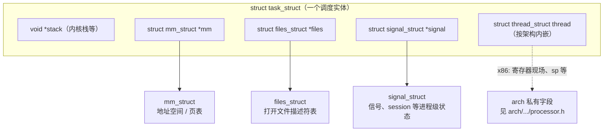
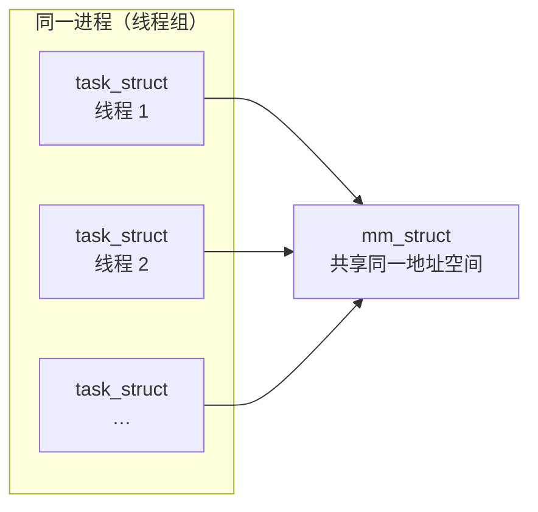
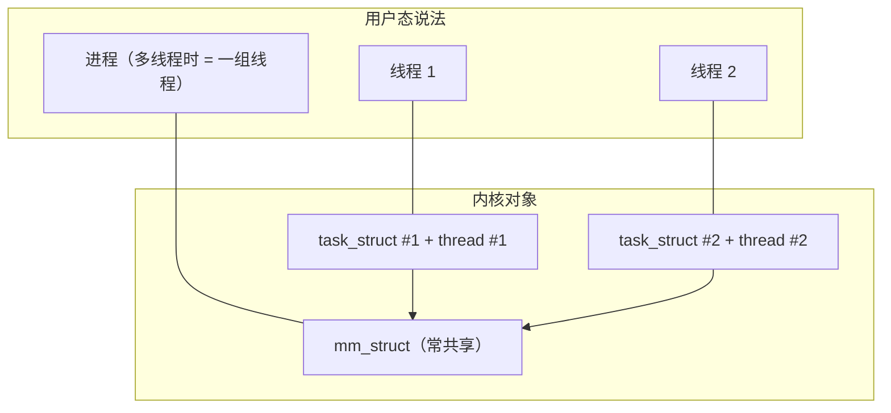

# Linux 内核里 process / thread 相关结构怎么摆

调度与资源的大致关系：**没有单独的 `struct process`**；**用户态的「一条线程」≈ 一个 `task_struct`**；**同一进程里的多条线程** = 多个 `task_struct` **共享** `mm_struct`（以及通常的 `files`、`signal` 等）。

字段位置以 **`include/linux/sched.h`** 里 `struct task_struct` 为准（`mm`、`files`、`signal`、`thread` 等）。

---

## 图 1：单个 `task_struct` 里有什么（内嵌 + 指针）

**读图要点**

- **`thread_struct`**：不是「另一个调度对象」，而是 **`task_struct` 的子对象**，保存 CPU/架构相关现场。
- **`mm`**：有用户地址空间时指向 **`mm_struct`**；纯内核线程常见 **`mm == NULL`**（运行用户态时可能用 **`active_mm`** 借用某地址空间，不画在图里）。

---

## 图 2：多线程进程 —— 多个 `task_struct` 共享 `mm`

**读图要点**

- **每个线程**各自 **`task_struct`**，各自 **`thread_struct`**，各自 **`stack`**。
- **同一进程**内多线程通常 **`mm` 指向同一 `mm_struct`**（`files` / `signal` 也常共享，具体见 `copy_process` / `clone` 标志）。

---

## 图 3：和「进程」口语的对应关系（概念轴）

---

## 最小对照表

| 用户态习惯说法     | 内核里主要对应 |
|--------------------|----------------|
| 一条线程           | 一个 `task_struct`（含内嵌 `thread_struct`） |
| 进程（地址空间）   | 一个 `mm_struct`，多线程共享同一指针 |
| 打开的文件、信号等 | `files_struct`、`signal_struct` 等，多在同一线程组内共享 |

更细的字段与 `clone()` 标志位有关；读 **`kernel/fork.c`** / **`copy_process()`** 可追踪新建线程时哪些结构是 `dup`、哪些是共享。

---

## 与缺页处理（Page Fault）的关系

用户态访问未映射页触发 **`#PF`** 时，内核在 **`arch/x86/mm/fault.c`** 的 **`do_user_addr_fault()`** 等路径里用 **`current`**（即 **`struct task_struct *`**）取 **`tsk->mm`**，再按故障地址找 **`VMA`**、进入 **`handle_mm_fault()`**（**`mm/memory.c`**）。这里要分清：**页表与 VMA 挂在 `mm_struct` 上**，不是挂在「`thread` 这个名字」所指的 **`thread_struct`** 里。

| 对象 | 在内核里的位置 | 与缺页（Demand Paging）的关系 |
|------|----------------|------------------------------|
| **`task_struct`** | 调度实体；`current` 即 **`task_struct *`** | `do_user_addr_fault` 里 **`tsk = current`**，用 **`tsk->mm`** 得到 **`mm_struct`**，再 **`lock_mm_and_find_vma` / `handle_mm_fault`**——**缺页处理围绕 `mm` 与 `VMA` 展开** |
| **`thread_struct`** | **`task_struct` 内嵌成员** `thread`，布局在 **`arch/.../processor.h`** 等 | 保存 **per-task 架构现场**（寄存器、内核栈指针等）；**不**存放用户地址空间的 **`pgd`** / **`mmap`** |

**不要混的两件事：**（1）**调度 / 上下文切换**会大量碰 **`task_struct`**（含内嵌 **`thread`**）；（2）**用户虚拟地址缺页**主要碰 **`mm_struct`** 与 **`vm_area_struct`**。`thread_struct` 名字里带 “thread”，但**不是**「管用户页表的线程对象」。

**内嵌关系、多线程共享 `mm`** 见上文 **图 1、图 2**。

### 图 4：缺页软件链走 `current->mm`，不从 `thread` 取页表

缺页从虚拟地址到 PTE 的完整软件链见 **[LINUX_PAGE_FAULT_DEMAND_PAGING.md](LINUX_PAGE_FAULT_DEMAND_PAGING.md)**。
