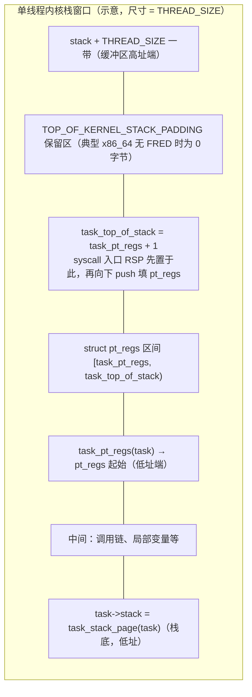

# Linux x86：`task_top_of_stack` 与 `cpu_current_top_of_stack`（集中说明）

本文档从 **`/Users/weli/works/linux`** 静态校对，把原先分散在多篇文档中的同主题内容**合并为一处**：**内核栈顶地址从哪里来**、**`task_top_of_stack` 是宏还是变量**、**per-CPU `cpu_current_top_of_stack` 谁写谁读**、**与 `TSS.sp0` 的分工**。

**相关专文（勿与本篇重复阅读同一细节时来回跳）：**

- **TSS / IST / FRED、`load_sp0` 调用链、返回用户态读 `TSS_sp0`** → [LINUX_X86_KERNEL_STACK_SYSCALL_TSS.md](LINUX_X86_KERNEL_STACK_SYSCALL_TSS.md)（该文件 §4、§6、§7.2 等）。
- **`pt_regs` 字段名、`entry_SYSCALL_64` 压栈顺序、IDT/IRQ** → [LINUX_X86_64_ENTRY_AND_PT_REGS.md](LINUX_X86_64_ENTRY_AND_PT_REGS.md)。
- **`task_struct` / `mm_struct` / `thread_struct` 组织** → [LINUX_TASK_MM_THREAD_STRUCTS.md](LINUX_TASK_MM_THREAD_STRUCTS.md)。

---

## 1. 结论先行：`sp0` 与「当前 task 内核栈顶」是两套机制（原生 x86_64）

在常见 **原生 x86_64**（非 Xen PV 特化）下：

- **`TSS.x86_tss.sp0`**：多由 **`cpu_init()`** 里 **`load_sp0((unsigned long)(cpu_entry_stack(cpu) + 1))`** 设为 **per-CPU entry trampoline / entry stack** 一侧的锚点（**`arch/x86/kernel/cpu/common.c`**），**不是**「每个用户进程的内核栈顶」在每次调度里跟着变。
- **「当前 CPU 上即将运行的 task 的内核栈顶一侧」**：由 per-CPU 变量 **`cpu_current_top_of_stack`** 表示；在 **`__switch_to()`** 里写成 **`task_top_of_stack(next_p)`**（**`arch/x86/kernel/process_64.c`**）。
- **`switch_to.h`** 中 **`update_task_stack()`** 注释写明：`sp0 always points to the entry trampoline stack, which is constant`。**原生 x86_64** 下 **`load_sp0(task_top_of_stack(task))`** 主要出现在 **Xen PV** 等分支，**不要**当成「每次 `__switch_to` 都把进程栈顶写进 `sp0`」的通用模型。

**SYSCALL 入口**不依赖硬件自动用 `sp0` 切到线程栈：汇编 **`movq PER_CPU_VAR(cpu_current_top_of_stack), %rsp`**（**`arch/x86/entry/entry_64.S`** `entry_SYSCALL_64`）。

---

## 2. `task_top_of_stack`：宏展开，不是 `task_struct` 里单独维护的字段

在 **`arch/x86/include/asm/processor.h`**：

```c
#define task_top_of_stack(task) ((unsigned long)(task_pt_regs(task) + 1))

#define task_pt_regs(task)						\
({									\
	unsigned long __ptr = (unsigned long)task_stack_page(task);	\
	__ptr += THREAD_SIZE - TOP_OF_KERNEL_STACK_PADDING;		\
	((struct pt_regs *)__ptr) - 1;					\
})
```

**`task_stack_page(task)`** 在 **`include/linux/sched/task_stack.h`**：`#define task_stack_page(task) ((void *)(task)->stack)`（**`CONFIG_THREAD_INFO_IN_TASK`** 下 `task->stack` 即该 task 的 **内核栈缓冲区基址**，与 `task_struct` 本体分离）。

含义：

- **没有**名为 `task_top_of_stack` 的全局存储单元被单独赋值；每次在 C 里写 **`task_top_of_stack(next)`** 都是 **按当前 `task` 当场宏展开**。
- 数值由 **`task->stack`** 与 **`THREAD_SIZE` / `TOP_OF_KERNEL_STACK_PADDING`** 的几何布局 **唯一确定**；**`task->stack`** 在线程创建路径（**`dup_task_struct()`** → **`alloc_thread_stack_node()`**，**`kernel/fork.c`**）里分配并赋给 **`task->stack`** 后，对该 task 而言结果通常 **固定**（栈不迁移、未做 `vmalloc` 迁移等特殊路径的前提下）。

### 2.1 x86_64 栈几何：`task_pt_regs` 与 `task_top_of_stack` 谁高谁低

内核栈 **向低地址增长**。设 **`stack = (unsigned long)task_stack_page(task)`**，则 **`stack .. stack+THREAD_SIZE-1`** 为该线程内核栈窗口。

宏 **`task_pt_regs`** 先把指针挪到 **接近栈区高址端** 再回退一个 **`struct pt_regs`**：

- `__ptr = stack + THREAD_SIZE - TOP_OF_KERNEL_STACK_PADDING`：指向「栈顶一侧」保留区边界（**`TOP_OF_KERNEL_STACK_PADDING`** 见 §2.3）。
- `((struct pt_regs *)__ptr) - 1`：指针算术减去 **一整份** `sizeof(struct pt_regs)`，得到 **`struct pt_regs *`**，指向 **落在栈内的那份 `pt_regs` 的最低地址**（即该结构在内存中的 **起始**）。

**位置关系一览**（**上为高地址、下为低地址**；`push` 向低址生长）：



因此 **`task_top_of_stack(task)`** = **`(unsigned long)(task_pt_regs(task) + 1)`** = **`task_pt_regs` 所指结构末尾之后的首个地址**（仍是内核虚拟地址，**不是**「用户栈顶」）。在 **启用 `CONFIG_FRAME_POINTER`** 的 x86_64 构建中，它与 **`arch/x86/include/asm/frame.h`** 里 **`encode_frame_pointer(childregs)`** 的返回值 **`(unsigned long)childregs + 1`** **同构**：都是「`pt_regs` 上沿」的编码边界，供 unwinder / 入口路径识别；未启用帧指针时 **`encode_frame_pointer`** 退化为恒 **0**，但 **`task_top_of_stack` 的数值关系不变**。

**与 `entry_SYSCALL_64` 的衔接**（**`arch/x86/entry/entry_64.S`**）：`movq PER_CPU_VAR(cpu_current_top_of_stack), %rsp` 把 RSP 置为该边界后，注释 **「Construct struct pt_regs on stack」** 下的连续 **`pushq`** 从该边界 **向低地址** 填充 **`struct pt_regs`** 各字段——即 **硬件/汇编在 syscall 入口「从上往下」搭出与 `task_pt_regs(current)` 布局一致的寄存器帧**。未发生调度时 **`cpu_current_top_of_stack == task_top_of_stack(current)`**，故入口看到的 RSP 与 **`copy_thread()`** 里为子进程预留的 **`childregs = task_pt_regs(p)`** 对齐方式一致。

### 2.2 `copy_thread()`、`fork_frame` 与 `thread.sp`

**`arch/x86/kernel/process.c`** 中 **`copy_thread()`**（x86_64）：

- **`childregs = task_pt_regs(p)`**。
- **`fork_frame = container_of(childregs, struct fork_frame, regs)`**（**`arch/x86/include/asm/switch_to.h`**：`struct fork_frame { struct inactive_task_frame frame; struct pt_regs regs; }`）。
- **`p->thread.sp = (unsigned long)fork_frame`**：休眠任务被切换回来时，**`__switch_to_asm`** 依赖的 **内核栈帧链** 从 **`inactive_task_frame`** 起，与 **`pt_regs`** 在 **同一段 `THREAD_SIZE` 缓冲区** 内前后排列；**`task_pt_regs(p)`** 仍指向 **`fork_frame->regs`** 的起始地址。

以上说明：**`task_top_of_stack`** 描述的是 **「syscall/异常帧 `pt_regs` 区段的上边界」**；**`thread.sp`** 描述的是 **调度切换用 `inactive_task_frame` 当前锚在哪里**——二者 **共用同一内核栈对象**，职责不同，**不要**把 **`thread.sp`** 与 **`task_top_of_stack`** 混成一个字段。

### 2.3 `TOP_OF_KERNEL_STACK_PADDING` 如何进入宏

**`arch/x86/include/asm/thread_info.h`** 定义 **`TOP_OF_KERNEL_STACK_PADDING`**：

- **典型 x86_64、未开 `CONFIG_X86_FRED`**：**`0`**——`task_pt_regs` 的「顶」紧贴 **`stack + THREAD_SIZE`** 一侧（仍受 **`struct pt_regs`** 固定大小约束）。
- **`CONFIG_X86_FRED`**：**`(2 * 8)`**——为将来 FRED 帧长变化预留 **16 字节** 间隙（同文件注释）。
- **i386**：历史上有 **8/16 字节** 间隙（NMI/SYSENTER/vm86 等边角）；**仅影响 `task_pt_regs` 相对栈底的偏移**，不改变 **`task_top_of_stack = task_pt_regs + 1`** 这一关系。

换内核配置时，若对比 **`task_top_of_stack` 的数值**，应连 **`TOP_OF_KERNEL_STACK_PADDING`** 一起看。

### 2.4 `task->stack` 从哪来、何时变

**`kernel/fork.c`**：**`dup_task_struct()`** 在 **`alloc_thread_stack_node()`** 成功后执行 **`tsk->stack = stack`**。分配路径随配置可能是 **`__vmalloc_node(THREAD_SIZE, …)`（`CONFIG_VMAP_STACK`）**、**`alloc_pages(THREAD_SIZE_ORDER)`** 或 **`kmem` 专用 cache**，但语义一致：**`task->stack` 指向该线程 **THREAD_SIZE** 内核栈的 **低址端**。只要该指针不变且栈体不迁移，**`task_top_of_stack(task)` 的计算结果不变**。

### 2.5 与「是否在 thread stack 上」判断一致

**`arch/x86/include/asm/processor.h`**：**`on_thread_stack()`** 用 **`current_top_of_stack()`**（读 **`cpu_current_top_of_stack`** 或 const 别名）与当前 RSP 的差是否小于 **`THREAD_SIZE`** 判断当前是否落在本线程内核栈窗口内。注释写明 **不能** 直接拿 **`TSS.sp0`** 当「当前线程栈顶」——与本文 **§1**、**`cpu_current_top_of_stack`** 分工一致。

**`TOP_OF_INIT_STACK`** 与 **`init_stack`** 同 **`processor.h`**，用于 boot 期 per-CPU **`cpu_current_top_of_stack`** 初值（见 §4）。

### 2.6 Call chain：`task->stack` 与 `task_pt_regs`（fork / clone 路径）

**`task_top_of_stack` 不单独分配**：先有 **`task->stack`** 指向 **`THREAD_SIZE`** 内核栈块，再由 **`task_pt_regs` / `task_top_of_stack` 宏** 按固定几何从 **`task->stack`** 推出地址。

```
kernel_clone()                            kernel/fork.c（如 ~2562 起）
└── copy_process()                          kernel/fork.c（如 ~1917 起）
    ├── dup_task_struct()                   kernel/fork.c（如 ~862 起）
    │   └── alloc_thread_stack_node()       kernel/fork.c（如 ~280 / ~362 / ~397，视 VMAP/页阶/cache 配置）
    │       └── tsk->stack = …            kernel/fork.c（分配成功后赋值）
    └── …（copy_mm、copy_signal 等）…
    └── copy_thread(p, args)                kernel/fork.c（如 ~2182）
        └── childregs = task_pt_regs(p)     arch/x86/kernel/process.c（如 ~171）
            └──（宏：`task_stack_page` + `THREAD_SIZE` − `TOP_OF_KERNEL_STACK_PADDING` − `sizeof(pt_regs)`）
```

**`ret_from_fork` / `kthread` 路径**仍依赖 **`copy_thread()`** 对 **`fork_frame` / `inactive_task_frame`** 的初始化；与 **`task_top_of_stack`** 同属「**同一 `THREAD_SIZE` 栈窗口内的布局约定**」，见上文 **§2.2**。

---

## 3. `cpu_current_top_of_stack`：写什么、谁写、谁读

### 3.1 语义

写入值表示：**即将在该 CPU 上运行的 `next` 的内核栈缓冲区中，按架构约定用于「栈顶一侧」的虚拟地址**（与 **`task_top_of_stack`** 定义一致），由 **`task->stack` + 固定布局** 推出，**不是**从别的 per-CPU 变量再拷贝一层。

### 3.2 x86_64：`__switch_to`（`arch/x86/kernel/process_64.c`）

```671:672:arch/x86/kernel/process_64.c
	raw_cpu_write(current_task, next_p);
	raw_cpu_write(cpu_current_top_of_stack, task_top_of_stack(next_p));
```

紧接着 **`update_task_stack(next_p)`**（**`arch/x86/include/asm/switch_to.h`**），行为随 **Xen / FRED** 等配置变化，见 [LINUX_X86_KERNEL_STACK_SYSCALL_TSS.md](LINUX_X86_KERNEL_STACK_SYSCALL_TSS.md) §4。

### 3.3 i386：`__switch_to`（`arch/x86/kernel/process_32.c`）

```197:200:arch/x86/kernel/process_32.c
	this_cpu_write(cpu_current_top_of_stack,
		       (unsigned long)task_stack_page(next_p) +
		       THREAD_SIZE);
```

同函数内 **`update_task_stack`**、**`current_task`** 的写入顺序与 64 位不同，阅读时注意。

### 3.4 boot / AP

- **静态初值**：**`DEFINE_PER_CPU_CACHE_HOT(unsigned long, cpu_current_top_of_stack) = TOP_OF_INIT_STACK`**（**`arch/x86/kernel/cpu/common.c`** ~2176）。
- **仅 32 位 AP 路径**：**`common_cpu_up()`** 内 **`#ifdef CONFIG_X86_32`**：**`per_cpu(cpu_current_top_of_stack, cpu) = task_top_of_stack(idle)`**（**`arch/x86/kernel/smpboot.c`**）；**x86_64** 无对等语句。

### 3.5 读取（syscall / 兼容入口示例）

- **`arch/x86/entry/entry_64.S`** **`entry_SYSCALL_64`**：`movq PER_CPU_VAR(cpu_current_top_of_stack), %rsp`（约 95 行，以本树为准）。
- **`entry_64_compat.S`**、**`entry_32.S`** 等同理装入 RSP/ESI。
- **`current_top_of_stack()`**（**`arch/x86/include/asm/processor.h`**）：读 per-CPU 或 `const_cpu_current_top_of_stack` 别名（见 **`vmlinux.lds.S`**）。

**返回用户态**常涉及读 **`TSS_sp0`** 切 trampoline，与 **进入** syscall 时用 **`cpu_current_top_of_stack`** 不同；见 [LINUX_X86_KERNEL_STACK_SYSCALL_TSS.md](LINUX_X86_KERNEL_STACK_SYSCALL_TSS.md) §6.2。

### 3.6 Call chain：读取 `cpu_current_top_of_stack`（与 `task_top_of_stack` 对齐）

**用户态 `syscall` → 进内核后 RSP 装入 per-CPU 值**（与 **[LINUX_X86_KERNEL_STACK_SYSCALL_TSS.md](LINUX_X86_KERNEL_STACK_SYSCALL_TSS.md) §7.2** 同一路径，本文收束为树形）：

```
用户态执行 syscall（CPU 经 LSTAR 等到入口）
└── entry_SYSCALL_64                        arch/x86/entry/entry_64.S（如 ~87 起）
    ├── movq PER_CPU_VAR(cpu_current_top_of_stack), %rsp   entry_64.S（如 ~95）
    └── call do_syscall_64                  arch/x86/entry/entry_64.S（如 ~121）
        └── do_syscall_64()                 arch/x86/entry/syscall_64.c（如 ~87 起）
```

**C 侧读「当前线程栈顶一侧」**（非 syscall 汇编主路径，如 **`on_thread_stack()`**）：

```
on_thread_stack()                         arch/x86/include/asm/processor.h（如 ~559 起）
└── current_top_of_stack()                  同文件（如 ~546 起）
    ├── this_cpu_read_const(const_cpu_current_top_of_stack)   （CONFIG_USE_X86_SEG_SUPPORT 等）
    └── this_cpu_read_stable(cpu_current_top_of_stack)
```

---

## 4. `next_p` 是什么（不是「刚进内核的用户进程」）

**`next_p`** 即 **`__switch_to(..., struct task_struct *next_p)`** 里的 **`next`**：切换完成后在该 CPU 上成为 **`current`** 的 **task**。可以是 **用户任务、内核线程、idle** 等。**`__switch_to`** 始终在内核路径执行；与「**单次**用户态→内核态（syscall/异常）」不是同一叙事，勿混。

---

## 5. 与 `thread_struct.sp0`（仅 32 位字段名）

**`CONFIG_X86_64`** 下 **`struct thread_struct`** **没有** **`sp0`** 成员（仅有 **`sp`** 等）；**`sp0`** 仅在 **`CONFIG_X86_32`** 分支存在。**x86_64** 上 **`cpu_current_top_of_stack`** **不是**从 **`thread_struct.sp0`** 读出。

---

## 6. 调度链：谁调用到 `raw_cpu_write(cpu_current_top_of_stack, …)`（主干）

### 6.1 Call chain：写入 `cpu_current_top_of_stack`（调度路径）

```
schedule()                                kernel/sched/core.c（如 ~6869）
└── __schedule_loop(SM_NONE)              kernel/sched/core.c（如 ~6860）
    └── __schedule(SM_NONE)               kernel/sched/core.c（如 ~6662）
        └── context_switch(rq, prev, next, &rf)   kernel/sched/core.c（如 ~6786 调用）
            └── switch_to(prev, next, prev)       arch/x86/include/asm/switch_to.h（宏 → __switch_to_asm）
                └── __switch_to_asm()           arch/x86/entry/entry_64.S（如 ~177）
                    └── jmp __switch_to         entry_64.S（如 ~216）
                        ├── raw_cpu_write(cpu_current_top_of_stack, task_top_of_stack(next_p))
                        │                       arch/x86/kernel/process_64.c（如 ~672）
                        └── update_task_stack(next_p)   arch/x86/include/asm/switch_to.h（如 ~69）
```

**`task_top_of_stack(next_p)`** 在此处为 **宏展开**（见 **§2**），**不是**另一次函数调用。

### 6.2 行号速查表（以本机 `/Users/weli/works/linux` 树为准，版本漂移时请 `rg` 核对）

| 步骤 | 位置（约） |
|------|------------|
| `schedule()` | `kernel/sched/core.c` ~6869 |
| `__schedule_loop()` | 同文件 ~6860（内调 `__schedule()`） |
| `__schedule()` | 同文件 ~6662 |
| `context_switch()` → `switch_to()` | 同文件 ~5341、`~5397` |
| `switch_to` 宏 | `arch/x86/include/asm/switch_to.h` |
| `__switch_to_asm` | `arch/x86/entry/entry_64.S` ~177，`jmp __switch_to` ~216 |
| `__switch_to()` | `arch/x86/kernel/process_64.c` ~611，`raw_cpu_write(cpu_current_top_of_stack, …)` ~672 |

---

## 7. i386 `copy_thread` 与 `thread.sp0`（与栈几何一致时的初始化）

**32 位** **`copy_thread()`** 会设 **`p->thread.sp0 = (unsigned long)(childregs + 1)`**（**`arch/x86/kernel/process.c`**），与 **`task_pt_regs` / 栈布局** 一致，那是 **`thread_struct.sp0` 字段**的初始化，与 **64 位** **`thread_struct`** 成员集合不同。

---

## 8. 源码摘录（便于对照本树）

**`entry_SYSCALL_64` 切栈（节选）** — `arch/x86/entry/entry_64.S`：

```87:95:arch/x86/entry/entry_64.S
SYM_CODE_START(entry_SYSCALL_64)
	UNWIND_HINT_ENTRY
	ENDBR

	swapgs
	/* tss.sp2 is scratch space. */
	movq	%rsp, PER_CPU_VAR(cpu_tss_rw + TSS_sp2)
	SWITCH_TO_KERNEL_CR3 scratch_reg=%rsp
	movq	PER_CPU_VAR(cpu_current_top_of_stack), %rsp
```

---

## 9. 文档说明

- 配置 **`CONFIG_XEN_PV`、`CONFIG_X86_FRED`、`CONFIG_PARAVIRT_*`** 会改变 **`update_task_stack` / `load_sp0`** 分支；细节以你树内 **`#ifdef`** 为准。
- **行号**随内核版本漂移；换分支后请用 **`rg`** / 直接打开文件核对。

**文档版本**：1.3  
**最后更新**：2026-04-04  
**校对内核树**：`/Users/weli/works/linux`
