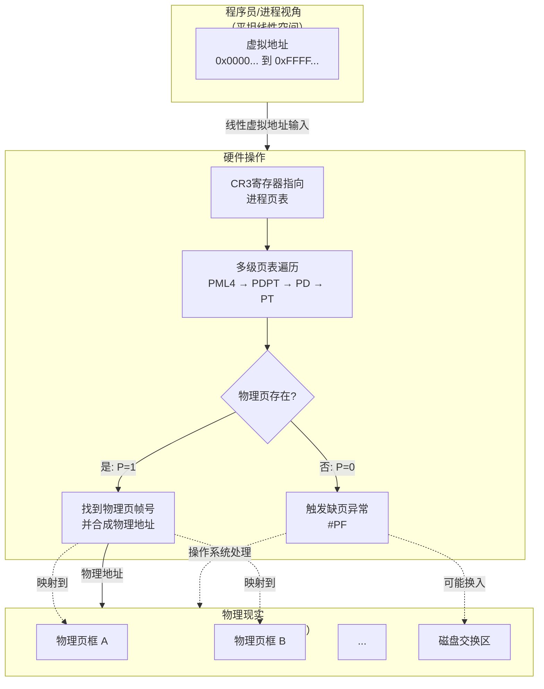
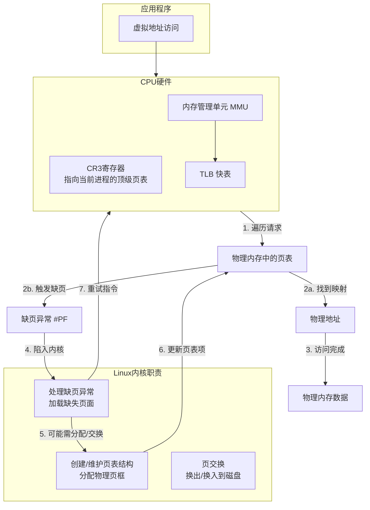

# x86 MMU、分页与 Linux 内核页表管理

本文档说明：在 Flat Model 下虚拟地址“平坦线性”与物理内存通过分页/MMU 非线性映射的关系；Long Mode 下 GDT 仍起的作用；Linux 内核如何与 MMU 协作管理四级/五级页表；以及用“图书馆”类比理解内核与 MMU 的分工。

> **相关文档**：[LINUX_KERNEL_INIT.md](LINUX_KERNEL_INIT.md) 中 startup_32 构建身份映射页表、CR3、CR0.PG；[LINUX_KERNEL_SETUP_ARCH_MEMORY.md](LINUX_KERNEL_SETUP_ARCH_MEMORY.md) init_mem_mapping、paging_init；[X86_CPU_MODES.md](X86_CPU_MODES.md) 实模式、保护模式、长模式；[X86_NEAR_VS_LONG_JUMP.md](X86_NEAR_VS_LONG_JUMP.md) long mode 下 CS 的作用。

---

## 一、Flat Model 与分页：虚拟“平坦”与物理“非线性”

在 Flat Model 下，程序员看到的是一个“平坦”的、线性的虚拟地址空间，但这绝不意味着物理地址也是线性访问的。分页机制正是在这个“平坦”的假象背后，负责管理高度非线性、碎片化的物理内存。

从“平坦虚拟视图”到“复杂物理现实”的转换过程：



### 分页如何介入并工作？

分页通过**页表**（由操作系统管理、硬件自动查询的“映射数据库”）工作：

1. **建立映射规则**：操作系统为每个进程维护一套页表。页表项记录**虚拟页号到物理页框号的映射**及权限位（可读、可写、执行、用户态可否访问等）。
2. **硬件自动查表（MMU）**：程序访问虚拟地址时，CPU 的**MMU** 以 **CR3**（当前进程页表物理地址）为根，遍历页表，找到对应物理页框。
3. **处理异常**：若页表项 P=0 或权限不足，MMU 触发**缺页异常（#PF）**，内核处理程序负责分配物理页、从磁盘换入或终止进程。

### “平坦”与“线性”的含义

- **对程序员/进程**：虚拟地址空间连续编号（如 0 到 2^48−1），可用简单指针运算。即“平坦线性”的体验。
- **对硬件/操作系统**：该空间被分割成固定大小**页**（如 4KB），每页可独立、随机映射到物理**页框**；不用的页可映射到磁盘交换区。

### 类比：酒店与客房

- 酒店（物理内存）有 1000 个房间（页框），房间号不连续（101, 205, 317…）。
- **Flat Model**：前台给客人**连续虚拟房卡** 1～1000。
- **分页**：前台电脑的**映射系统**（页表）；刷 1 号卡实际开 101 号房，刷 2 号卡开 317 号房。
- 客人体验是“1 号房、2 号房…”，实际房间分散；若某房在打扫（页换出），系统触发缺页，内核再分配或换入。

**结论**：Flat Model 提供**虚拟地址空间的线性视图**，分页在其下**动态、非线性地管理物理映射**，两者结合实现虚拟内存。

---

## 二、Long Mode 下 GDT 的作用（未弃用）

GDT 在 Long Mode 下**没有被弃用**，仍是必需的，但作用和内容被极大简化：从“内存分段管理”变为“系统状态与权限控制”。

| 特性 | **保护模式下的 GDT** | **长模式下的 GDT** |
|------|----------------------|---------------------|
| **核心作用** | 内存分段：段基址、界限、属性 | 系统状态与权限：运行模式（64/32）、特权级，FS/GS 基址容器 |
| **段基址与界限** | 完全有效，用于线性地址 | CS/DS/ES/SS 强制为 0 和最大；**FS/GS 有效**（通过 MSR） |
| **是否必需** | 是 | **是**，无 GDT 无法进入和运行长模式 |

### Long Mode 下 GDT 的具体职责

1. **NULL 描述符**：第一项必须为 0。
2. **内核代码段**：Type 为代码段，**L=1**（64 位代码段），DPL=0。CPU 据此进入 64 位模式。
3. **内核数据段**：SS、DS 等载体，DPL=0。
4. **用户代码/数据段**：DPL=3，用于切换到用户态（Ring 3）。
5. **TSS 描述符**：Long Mode 下 TSS 主要存**内核栈指针（IST）**；中断/异常/系统调用从用户态陷入时，CPU 从 TSS 加载内核栈。须在 GDT 中并有 `ltr` 加载。

### 极简 Long Mode GDT 示例

```asm
gdt64:
    .null:  dq 0                 ; 空描述符
    .code:  dw 0
            dw 0
            db 0
            db 0x9a              ; P=1, DPL=0, 代码段，可读
            db 0x20              ; L=1 (64位代码段)
            db 0
    .data:  dw 0
            dw 0
            db 0
            db 0x92              ; 数据段，可写
            db 0
            db 0
    .tss:   dw tss_size - 1
            dw 0
            db 0
            db 0x89              ; 64位可用TSS
            db 0x00
            db 0
            dd 0
            dd 0
```

**结论**：Long Mode 下**基于 GDT 的分段管理**被弃用，但 **GDT 本身**仍强制存在，用于定义 64/32 模式、特权级和 TSS。无 GDT 则无法进入 64 位、无法在中断时找到内核栈。

---

## 三、Linux 内核与四级/五级页表管理

Linux 内核**需要管理**多级页表，但分工是：**硬件（MMU）自动遍历**，**内核负责创建和维护页表结构**。



### 内核的具体任务

1. **页表结构的生命期**：进程创建时分配 PML4 并建立内核空间映射；**进程切换时把新进程的 PML4 物理地址写入 CR3**；进程退出时回收页表与物理页。
2. **缺页异常处理**：当 MMU 遍历到 P=0 或权限不足时触发 #PF。内核需：分析缺页原因；合法访问则分配物理页、**逐级创建缺失的中间页表**、在最后一级建立映射；非法访问则发 SIGSEGV。
3. **五级页表**：新内核（5.4+）支持五级页表（LA57），内核根据 CPU 能力选择四级或五级。

### Linux 中的页表抽象

| 四级页表层级 | 内核类型名 |
|--------------|------------|
| PML4         | `pgd_t`（页全局目录） |
| PDPT         | `p4d_t`（四级中常与 pgd 合并） |
| PD           | `pud_t`（页上级目录） |
| PT           | `pmd_t`（页中间目录） |
| PTE          | `pte_t`（页表项） |

内核提供 `pgd_offset()`、`pud_offset()`、`pmd_offset()`、`pte_offset_map()` 等，在软件中模拟硬件遍历，用于查找或修改指定虚拟地址的页表项。

**总结**：**MMU** 是执行者（给定 CR3 和虚拟地址，查表得物理地址）；**内核**是管理者（保证 CR3 指向的页表树正确、完整，创建树、处理缺页、进程退出时回收）。详见 [LINUX_KERNEL_SETUP_ARCH_MEMORY.md](LINUX_KERNEL_SETUP_ARCH_MEMORY.md) 中 init_mem_mapping、paging_init。

---

## 四、“图书馆”模型：内核与 MMU 的分工

| 角色 | 对应组件 | 职责 |
|------|----------|------|
| **图书管理员** | **Linux 内核** | 创建和维护检索系统：建立顶级页表（PML4）、决定每“本书”放在哪一页框、换出时更新页表 |
| **智能检索机** | **MMU** | 根据虚拟地址自动查多级页表、输出物理地址、**TLB 缓存**最近结果 |
| **访客/读者** | **用户程序** | 只提出“某虚拟地址”的访问，不关心物理位置 |
| **图书馆建筑** | **物理内存+磁盘** | 存储实体，由内核调度 |

### 关键过程对应

1. **缺页**：读者要“新书” → 检索机查目录发现未上架（P=0）→ 触发 #PF → 内核分配页框、可能从磁盘换入、填写页表 → 返回重试，检索机即可找到。
2. **进程切换**：换上新读者的**专属目录**（加载新进程的 CR3）；MMU 刷新 TLB，改用新目录。
3. **共享库**：多个进程的页表可指向同一物理页框（如 libc），节省内存。

**结论**：“内核维护目录，MMU 负责快速查表”概括了**软件管理元数据、硬件加速查找**的分工；两者通过**缺页异常**协作，实现每进程独占连续虚拟地址空间的假象。
