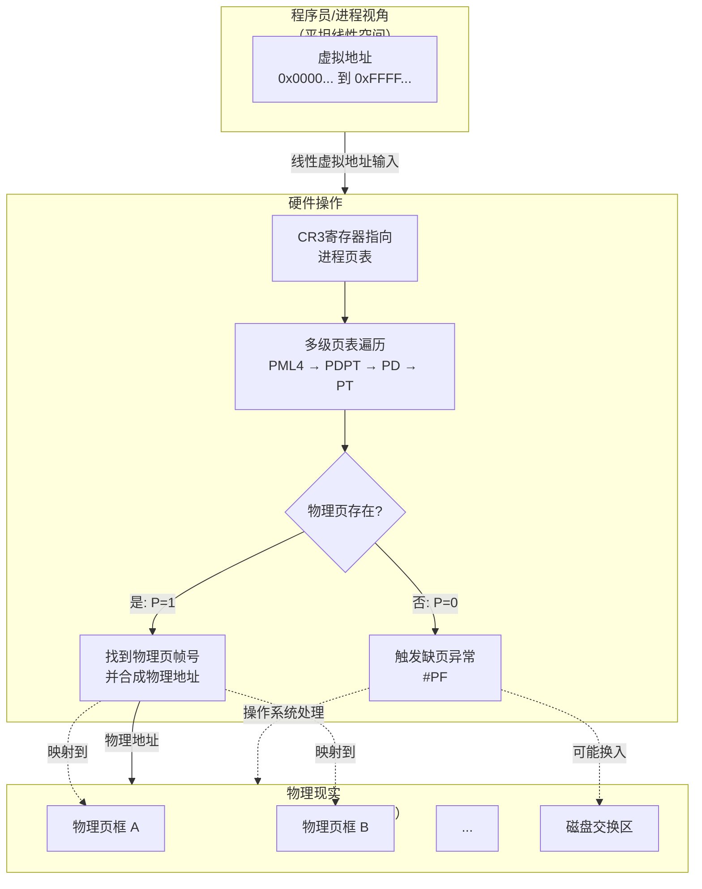
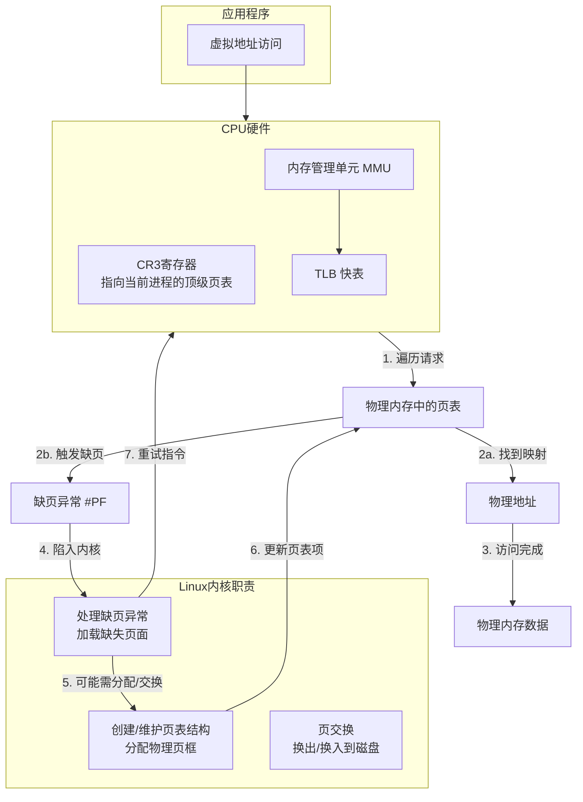
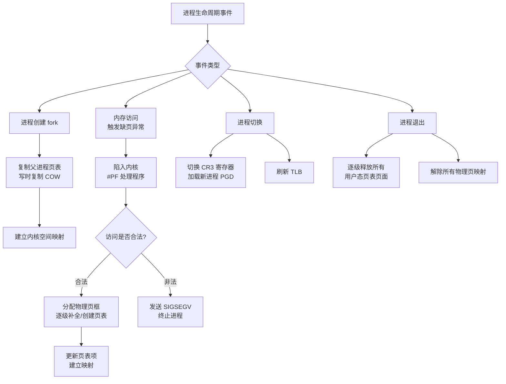

# x86 MMU、分页与 Linux 内核页表管理

## 文档定位

本文档涵盖**分页理论基础**和**早期页表建立阶段**（压缩内核 startup_32/64）：
- **理论部分**：MMU 工作原理、GDT 与 Paging 的两阶段地址转换、内核与 MMU 的分工
- **早期页表**：压缩内核（startup_32/64）如何首次启用分页、构建身份映射页表

> **页表管理的两个阶段**：
> - **阶段 1：早期页表（本文档）** - 压缩内核 startup_32/64 构建简单的身份映射页表，首次启用 CR0.PG
> - **阶段 2：完整页表** - start_kernel → setup_arch 中根据 E820/memblock 建立完整的直接映射，详见 [PAGING_PHASE2_FULL_SETUP_IN_SETUP_ARCH.md](PAGING_PHASE2_FULL_SETUP_IN_SETUP_ARCH.md)

## 文档内容

本文档说明：在 Flat Model 下虚拟地址"平坦线性"与物理内存通过分页/MMU 非线性映射的关系；GDT 与 Paging 作为两阶段地址转换的协作关系；Long Mode 下 GDT 仍起的作用；启动时 lgdt 和启用分页的顺序依赖；Linux 内核如何与 MMU 协作管理四级/五级页表；以及用"图书馆"类比理解内核与 MMU 的分工。

> **相关文档**：[LINUX_KERNEL_INIT.md](LINUX_KERNEL_INIT.md) 中 startup_32 构建身份映射页表、CR3、CR0.PG；[PAGING_PHASE2_FULL_SETUP_IN_SETUP_ARCH.md](PAGING_PHASE2_FULL_SETUP_IN_SETUP_ARCH.md) init_mem_mapping、paging_init；[X86_CPU_MODES.md](X86_CPU_MODES.md) 实模式、保护模式、长模式；[X86_NEAR_VS_LONG_JUMP.md](X86_NEAR_VS_LONG_JUMP.md) long mode 下 CS 的作用。

---

## 一、Flat Model 与分页：虚拟“平坦”与物理“非线性”

在 Flat Model 下，程序员看到的是一个“平坦”的、线性的虚拟地址空间，但这绝不意味着物理地址也是线性访问的。分页机制正是在这个“平坦”的假象背后，负责管理高度非线性、碎片化的物理内存。

从“平坦虚拟视图”到“复杂物理现实”的转换过程：



### 分页如何介入并工作？

分页通过**页表**（由操作系统管理、硬件自动查询的“映射数据库”）工作：

1. **建立映射规则**：操作系统为每个进程维护一套页表。页表项记录**虚拟页号到物理页框号的映射**及权限位（可读、可写、执行、用户态可否访问等）。
2. **硬件自动查表（MMU）**：程序访问虚拟地址时，CPU 的**MMU** 以 **CR3**（当前进程页表物理地址）为根，遍历页表，找到对应物理页框。
3. **处理异常**：若页表项 P=0 或权限不足，MMU 触发**缺页异常（#PF）**，内核处理程序负责分配物理页、从磁盘换入或终止进程。

### “平坦”与“线性”的含义

- **对程序员/进程**：虚拟地址空间连续编号（如 0 到 2^48−1），可用简单指针运算。即“平坦线性”的体验。
- **对硬件/操作系统**：该空间被分割成固定大小**页**（如 4KB），每页可独立、随机映射到物理**页框**；不用的页可映射到磁盘交换区。

### 类比：酒店与客房

- 酒店（物理内存）有 1000 个房间（页框），房间号不连续（101, 205, 317…）。
- **Flat Model**：前台给客人**连续虚拟房卡** 1～1000。
- **分页**：前台电脑的**映射系统**（页表）；刷 1 号卡实际开 101 号房，刷 2 号卡开 317 号房。
- 客人体验是“1 号房、2 号房…”，实际房间分散；若某房在打扫（页换出），系统触发缺页，内核再分配或换入。

**结论**：Flat Model 提供**虚拟地址空间的线性视图**，分页在其下**动态、非线性地管理物理映射**，两者结合实现虚拟内存。

---

## 二、GDT 与 Paging：两阶段地址转换的协作关系

### 2.1 完整的 x86 地址转换流程

在 x86 架构中，**从逻辑地址到物理地址需要经过两个独立的转换阶段**，分别由 **GDT（段式管理）** 和 **页表（分页管理）** 完成：


**第一阶段：逻辑地址 → 线性地址（段式转换，由 GDT 控制）**

1. CPU 从段寄存器（CS、DS、SS、ES、FS、GS）中读取**段选择子**
2. 使用段选择子作为索引，从 **GDT** 或 **LDT** 中读取段描述符
3. 从段描述符获取：
   - **段基址**（Base Address）
   - **段限长**（Limit）
   - **权限位**（DPL、Type 等）
4. 计算：**线性地址 = 段基址 + 偏移量**
5. 检查：偏移量是否超出段限长、权限是否匹配，违规则触发 **#GP（一般保护异常）**

**第二阶段：线性地址 → 物理地址（分页转换，由页表控制）**

1. MMU 使用 **CR3 寄存器**指向的页表基址
2. 多级页表遍历（四级或五级）：
   - PML5/PML4（页映射级别 5/4）
   - PDPT（页目录指针表）
   - PD（页目录）
   - PT（页表）
3. 从最后一级页表项（PTE）获取：
   - **物理页框号**（Physical Frame Number）
   - **权限位**（P、R/W、U/S、XD 等）
4. 计算：**物理地址 = 物理页框基址 + 页内偏移**
5. 检查：P=0 或权限不足则触发 **#PF（缺页异常）**

### 2.2 x86-64 长模式下的简化（Flat Model）

在 **x86-64 长模式** 下，段式管理被极大简化，但**两阶段转换仍然存在**：

```
逻辑地址（段:偏移）
    ↓
[第一阶段：GDT 段式转换]
    段基址 = 0（CS/DS/ES/SS 强制为 0）
    段限长 = 忽略
    ↓
线性地址 = 0 + 偏移 = 偏移（逻辑地址等于线性地址）
    ↓
[第二阶段：页表分页转换]
    MMU 通过 CR3 和页表完成
    ↓
物理地址
```

**关键特点**：

| 方面 | 保护模式（32 位） | 长模式（64 位 Flat Model） |
|------|-------------------|---------------------------|
| **段基址** | 可以是任意值，实现内存分段 | **CS/DS/ES/SS 强制为 0**，FS/GS 例外（通过 MSR 设置） |
| **段限长** | 有效，用于边界检查 | **被忽略**（除了代码段用于判断 32/64 位模式） |
| **逻辑地址 vs 线性地址** | 不相等（线性地址 = 段基址 + 偏移） | **相等**（因为段基址为 0） |
| **GDT 是否必需** | 是 | **是**（虽然段式转换被简化，但 GDT 仍用于系统状态和权限控制） |
| **分页是否必需** | 可选（CR0.PG 可以为 0） | **强制启用**（长模式要求 CR0.PG=1） |

**为什么 Flat Model 下仍需要 GDT？**

即使段基址强制为 0，GDT 仍然承担以下关键职责：

1. **定义代码段模式**：CS 描述符的 **L 位**（Long Mode）决定 CPU 是执行 64 位代码还是 32 位兼容代码
2. **特权级控制**：段描述符的 **DPL**（描述符特权级）用于权限检查（Ring 0/3）
3. **TSS 管理**：GDT 中的 TSS 描述符指向任务状态段，存储内核栈指针（IST），供中断/异常/系统调用使用
4. **FS/GS 段基址**：虽然通过 MSR 设置，但仍需要 GDT 中有对应的描述符
5. **系统状态标识**：GDT 的存在是 CPU 判断处于保护模式/长模式的重要标志

### 2.3 启动时的顺序依赖：为什么必须先 lgdt，再启用分页

从内核启动流程（`arch/x86/boot/compressed/head_64.S:startup_32`）可以看到 **GDT 和分页的严格顺序依赖**：

```
【阶段 1】段式管理初始化（32 位保护模式）
    1. lgdt gdt            ← 加载 GDT（包含 __BOOT_DS、__KERNEL32_CS 等段描述符）
    2. 设置段寄存器         ← DS/ES/FS/GS/SS = __BOOT_DS
    3. 设置栈指针           ← ESP = boot_stack_end（需要 SS 段有效）
    4. lretl               ← 切换到 __KERNEL32_CS 代码段
    ────────── 此时段式管理已生效，CPU 可以正确执行指令和访问栈 ──────────

【阶段 2】分页管理初始化
    5. CR4.PAE = 1         ← 启用物理地址扩展（分页前提）
    6. 构建身份映射页表    ← 在内存中创建页表结构（需要能访问内存，依赖段和栈）
    7. CR3 = pgtable       ← 加载页表基址
    8. EFER.LME = 1        ← 启用长模式（仅标记，与 CR0.PG 同时生效）
    9. CR0.PG = 1          ← 启用分页
    ────────── 此时分页管理生效，进入长模式 ──────────

【阶段 3】切换到 64 位长模式
    10. lret               ← 切换到 __KERNEL_CS（64 位代码段，L=1）
```

**为什么必须是这个顺序？**

| 依赖关系 | 原因 |
|---------|------|
| **lgdt 必须在 CR0.PG 之前** | 在启用分页之前，CPU 需要能够执行指令、访问栈、读写内存。这些操作都依赖**段寄存器有效**（CS 用于取指、SS 用于栈访问、DS 用于数据访问）。如果没有先加载 GDT 并设置段寄存器，CPU 无法正确执行构建页表的代码。 |
| **栈设置必须在构建页表之前** | 构建页表的代码需要使用栈（如保存寄存器、调用函数）。而栈需要 **SS 段寄存器指向有效的段描述符**。 |
| **页表构建必须在 CR0.PG 之前** | 启用分页（CR0.PG=1）的瞬间，MMU 就会开始使用 CR3 指向的页表进行地址转换。如果页表未就绪或 CR3 未设置，会立即触发缺页异常或三重故障。 |
| **GDT 必须在进入长模式之前** | 进入长模式（EFER.LME=1 + CR0.PG=1）时，CPU 会检查：(1) GDT 已加载；(2) CS 指向的代码段描述符 L=1（64 位）或 L=0（32 位兼容）；(3) 分页已启用。缺少任何一项都会导致 #GP 异常或无法进入长模式。 |

**实际代码示例**（`arch/x86/boot/compressed/head_64.S:startup_32`）：

```asm
startup_32:
    /* 步骤 1-4：段式管理初始化 */
    leal    rva(gdt)(%ebp), %eax        # 计算 GDT 地址
    movl    %eax, 2(%eax)               # 填充 GDT 描述符
    lgdt    (%eax)                      # 加载 GDT
    movl    $__BOOT_DS, %eax
    movl    %eax, %ds                   # DS = __BOOT_DS
    movl    %eax, %es                   # ES = __BOOT_DS
    movl    %eax, %fs                   # FS = __BOOT_DS
    movl    %eax, %gs                   # GS = __BOOT_DS
    movl    %eax, %ss                   # SS = __BOOT_DS
    leal    rva(boot_stack_end)(%ebp), %esp  # 设置栈
    leal    rva(1f)(%ebp), %eax
    pushl   $__KERNEL32_CS
    pushl   %eax
    lretl                               # 切换到 __KERNEL32_CS
1:
    /* 步骤 5-9：分页管理初始化 */
    movl    %cr4, %eax
    orl     $X86_CR4_PAE, %eax
    movl    %eax, %cr4                  # CR4.PAE = 1

    /* 构建页表（省略详细代码） */
    leal    rva(pgtable)(%ebx), %eax
    movl    %eax, %cr3                  # CR3 = pgtable

    movl    $MSR_EFER, %ecx
    rdmsr
    btsl    $_EFER_LME, %eax
    wrmsr                               # EFER.LME = 1

    movl    $CR0_STATE, %eax
    movl    %eax, %cr0                  # CR0.PG = 1，启用分页

    /* 步骤 10：切换到 64 位 */
    lretl                               # 切换到 __KERNEL_CS（64 位）
```

### 2.4 GDT 与 Paging 的职责分工

| 方面 | **GDT（段式管理）** | **Paging（分页管理）** |
|------|---------------------|----------------------|
| **地址转换阶段** | 第一阶段：逻辑地址 → 线性地址 | 第二阶段：线性地址 → 物理地址 |
| **控制寄存器** | GDTR（存储 GDT 基址和长度） | CR3（存储页表基址） |
| **数据结构** | GDT 表（全局描述符表，每项 8/16 字节） | 多级页表（PML4 → PDPT → PD → PT，每项 8 字节） |
| **主要用途（保护模式）** | 内存分段、权限隔离、任务切换 | 虚拟内存、物理页框管理、进程隔离 |
| **主要用途（长模式）** | 系统状态（64/32 位模式）、特权级、TSS | **虚拟内存的核心机制**，强制启用 |
| **粒度** | 段（可变大小，0 到 4GB） | 页（固定大小，通常 4KB、2MB、1GB） |
| **异常** | #GP（一般保护异常）- 段越界、权限违规 | #PF（缺页异常）- 页不存在、权限不足 |
| **是否可选（长模式）** | **必需**（虽然简化，但不可缺少） | **必需**（长模式强制 CR0.PG=1） |

**结论**：

1. **两个机制串联工作**：逻辑地址 → [GDT] → 线性地址 → [页表] → 物理地址
2. **长模式下的简化**：GDT 的段式转换被"透明化"（段基址=0），但 GDT 仍用于系统状态和权限控制
3. **顺序依赖严格**：必须先 lgdt 初始化段式管理，再启用分页（CR0.PG=1）
4. **职责分工明确**：GDT 负责系统状态和模式切换，Paging 负责虚拟内存管理

> **相关文档**：
> - [LINUX_KERNEL_INIT.md](LINUX_KERNEL_INIT.md) - 第 106-154 行详细分析了 startup_32 中 lgdt 和启用分页的完整顺序
> - [X86_NEAR_VS_LONG_JUMP.md](X86_NEAR_VS_LONG_JUMP.md) - 长模式下 CS 段选择子的作用

---

## 三、Long Mode 下 GDT 的作用（未弃用）

GDT 在 Long Mode 下**没有被弃用**，仍是必需的，但作用和内容被极大简化：从“内存分段管理”变为“系统状态与权限控制”。

| 特性 | **保护模式下的 GDT** | **长模式下的 GDT** |
|------|----------------------|---------------------|
| **核心作用** | 内存分段：段基址、界限、属性 | 系统状态与权限：运行模式（64/32）、特权级，FS/GS 基址容器 |
| **段基址与界限** | 完全有效，用于线性地址 | CS/DS/ES/SS 强制为 0 和最大；**FS/GS 有效**（通过 MSR） |
| **是否必需** | 是 | **是**，无 GDT 无法进入和运行长模式 |

### Long Mode 下 GDT 的具体职责

1. **NULL 描述符**：第一项必须为 0。
2. **内核代码段**：Type 为代码段，**L=1**（64 位代码段），DPL=0。CPU 据此进入 64 位模式。
3. **内核数据段**：SS、DS 等载体，DPL=0。
4. **用户代码/数据段**：DPL=3，用于切换到用户态（Ring 3）。
5. **TSS 描述符**：Long Mode 下 TSS 主要存**内核栈指针（IST）**；中断/异常/系统调用从用户态陷入时，CPU 从 TSS 加载内核栈。须在 GDT 中并有 `ltr` 加载。

### 极简 Long Mode GDT 示例

```asm
gdt64:
    .null:  dq 0                 ; 空描述符
    .code:  dw 0
            dw 0
            db 0
            db 0x9a              ; P=1, DPL=0, 代码段，可读
            db 0x20              ; L=1 (64位代码段)
            db 0
    .data:  dw 0
            dw 0
            db 0
            db 0x92              ; 数据段，可写
            db 0
            db 0
    .tss:   dw tss_size - 1
            dw 0
            db 0
            db 0x89              ; 64位可用TSS
            db 0x00
            db 0
            dd 0
            dd 0
```

**结论**：Long Mode 下**基于 GDT 的分段管理**被弃用，但 **GDT 本身**仍强制存在，用于定义 64/32 模式、特权级和 TSS。无 GDT 则无法进入 64 位、无法在中断时找到内核栈。

---

## 四、Linux 内核与四级/五级页表管理

Linux 内核**需要管理**多级页表，但分工是：**硬件（MMU）自动遍历**，**内核负责创建和维护页表结构**。

### 4.1 核心目标

内核维护页表的终极目标，是为每个进程提供一个私有的、连续的、从零开始的**虚拟地址空间**。该空间可远大于物理内存，多个进程的空间可映射到相同或不同的物理页框上，背后完全依赖内核动态构建和调整的页表，即制造“**独占整个内存**”的假象。



### 4.2 内核的具体任务

1. **页表结构的生命期**：进程创建时分配 PML4 并建立内核空间映射；**进程切换时把新进程的 PML4 物理地址写入 CR3**；进程退出时回收页表与物理页。
2. **缺页异常处理**：当 MMU 遍历到 P=0 或权限不足时触发 #PF。内核需：分析缺页原因；合法访问则分配物理页、**逐级创建缺失的中间页表**、在最后一级建立映射；非法访问则发 SIGSEGV。
3. **五级页表**：新内核（5.4+）支持五级页表（LA57），内核根据 CPU 能力选择四级或五级。

### 4.3 软件架构：四级抽象与五级扩展

为兼容不同硬件（x86 四级、ARM 三级等），Linux 用一套通用软件模型管理页表。x86_64 的映射关系如下：

| 硬件级 (x86_64) | Linux 抽象层 | 主要数据结构 | 核心函数举例（用于遍历） |
|-----------------|--------------|--------------|---------------------------|
| **PML4**        | **PGD** - 页全局目录 | `pgd_t` | `pgd_offset(mm, address)` |
| **PDPT**        | **P4D** - 第4级目录 | `p4d_t` | `p4d_offset(pgd, address)` |
| **PD**          | **PUD** - 页上级目录 | `pud_t` | `pud_offset(p4d, address)` |
| **PT**          | **PMD** - 页中间目录 | `pmd_t` | `pmd_offset(pud, address)` |
| **PTE**         | **PTE** - 页表项 | `pte_t` | `pte_offset_map(pmd, address)` |

> 在启用**五级页表**（LA57）的系统中，在 PGD 之上会增加 **P5D**（`p5d_t`）抽象层。

内核通过这些函数在软件中模拟硬件遍历，用于查找或修改指定虚拟地址的页表项。

### 4.4 页表生命周期管理

内核在进程的整个生命周期中动态管理页表，核心操作流程如下：



### 4.5 关键机制简述

- **写时复制（COW）**：`fork` 时子进程不复制物理内存，而与父进程**共享页表，并将可写页标记为只读**。任一方写入时触发缺页，内核再分配新物理页并复制数据，是高效创建进程的基石。
- **缺页异常处理**：内核缺页处理程序需区分：**次要缺页**（页已在内存，仅需建立 PTE 映射）、**主要缺页**（需从磁盘或匿名分配新物理页）、**交换缺页**（页已换出到 swap，需选受害者换出再换入目标页）。
- **反向映射**：为在换出等场景下高效找到映射到某物理页的所有 PTE，内核维护从 `struct page` 到所有映射它的 `pte` 的反向映射数据结构。
- **巨页**：内核可将连续普通页合并为大页（如 2MB、1GB），在 PMD 或 PUD 级建立直接映射，减少 TLB 未命中、提升性能。

**总结**：**MMU** 是执行者（给定 CR3 和虚拟地址，查表得物理地址）；**内核**是管理者（保证 CR3 指向的页表树正确、完整，创建树、处理缺页、进程退出时回收）。页表管理集**动态分配、硬件抽象、异常处理、性能优化和资源回收**于一体。详见 [PAGING_PHASE2_FULL_SETUP_IN_SETUP_ARCH.md](PAGING_PHASE2_FULL_SETUP_IN_SETUP_ARCH.md) 中 init_mem_mapping、paging_init。

---

## 五、"图书馆"模型：内核与 MMU 的分工

| 角色 | 对应组件 | 职责 |
|------|----------|------|
| **图书管理员** | **Linux 内核** | 创建和维护检索系统：建立顶级页表（PML4）、决定每“本书”放在哪一页框、换出时更新页表 |
| **智能检索机** | **MMU** | 根据虚拟地址自动查多级页表、输出物理地址、**TLB 缓存**最近结果 |
| **访客/读者** | **用户程序** | 只提出“某虚拟地址”的访问，不关心物理位置 |
| **图书馆建筑** | **物理内存+磁盘** | 存储实体，由内核调度 |

### 关键过程对应

1. **缺页**：读者要“新书” → 检索机查目录发现未上架（P=0）→ 触发 #PF → 内核分配页框、可能从磁盘换入、填写页表 → 返回重试，检索机即可找到。
2. **进程切换**：换上新读者的**专属目录**（加载新进程的 CR3）；MMU 刷新 TLB，改用新目录。
3. **共享库**：多个进程的页表可指向同一物理页框（如 libc），节省内存。

**结论**：“内核维护目录，MMU 负责快速查表”概括了**软件管理元数据、硬件加速查找**的分工；两者通过**缺页异常**协作，实现每进程独占连续虚拟地址空间的假象。

---

## 六、内核内存分配层次：伙伴系统与 Slab（延伸）

页表管理的是**虚拟地址与物理页框的映射**；物理页框本身的分配与回收由**伙伴系统**和 **Slab 分配器**完成，二者构成内核内存分配的下一层。

### 6.1 层次关系

```
物理页框 → 伙伴系统 (Buddy) → Slab 分配器 → 内核对象
```

- **伙伴系统**：管理**物理页**（大块），负责整页的分配与释放，是 init_mem_mapping / paging_init 之后“可用物理页”的分配来源。
- **Slab 分配器**：从伙伴系统批量申请整页（Slab），在内部切割成**固定大小的对象**，供内核频繁创建/销毁的小结构使用（如 `task_struct`、`inode`、`dentry` 等），避免每对象一页带来的碎片与开销。

### 6.2 Slab 核心概念概览

| 概念 | 含义 | 简要类比 |
|------|------|----------|
| **Cache** | 按**对象类型**管理的顶层结构，如 task_struct cache | 专门生产某一类零件的工厂 |
| **Slab** | 从伙伴系统申请来的**连续物理页**，作为同类对象的容器；有满/部分满/空等状态 | 一箱原材料，可做多个同类零件 |
| **Object** | Slab 内划分出的单块内存，即内核实际拿到的分配单元 | 成品零件 |
| **Sizes Cache** | 按**大小**组织的通用缓存，对应 `kmalloc()` | 按尺寸供货的通用货架 |
| **Per-CPU 对象缓存** | 每 CPU 的本地对象池，分配/释放优先走本地，减少锁竞争 | 每人手边的工具箱 |
| **与伙伴系统接口** | Slab 通过 `alloc_pages` / 释放页框与伙伴系统交互 | 工厂向供应商订货/退货 |

Slab 通过缓存空闲对象和每 CPU 缓存提升分配速度，并通过按类型/大小分类减少外部碎片；与伙伴系统协作，形成“**伙伴系统管页、Slab 管页内对象**”的完整内核内存分配体系。
