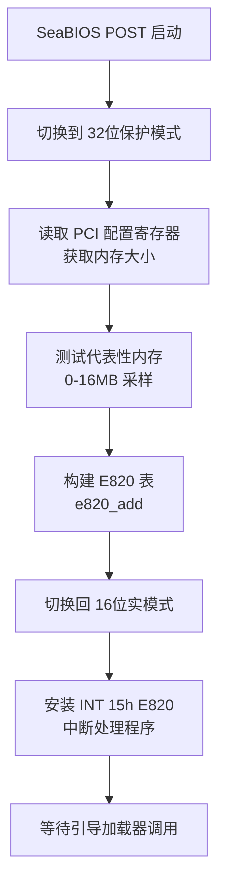
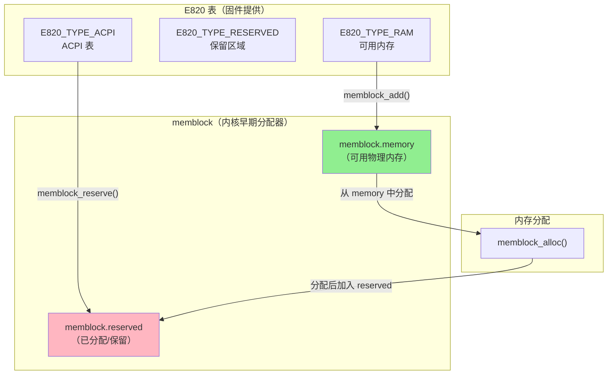
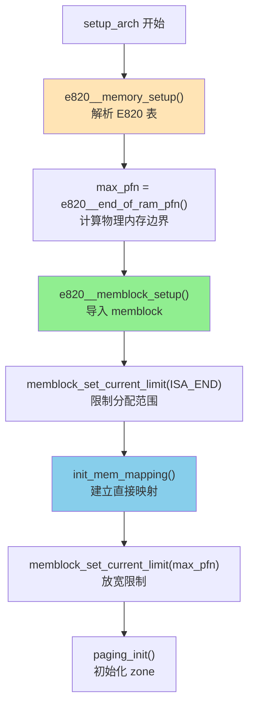
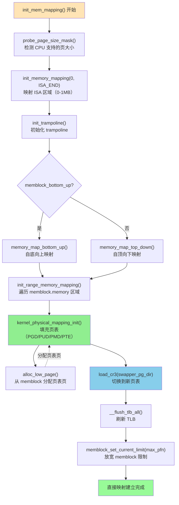
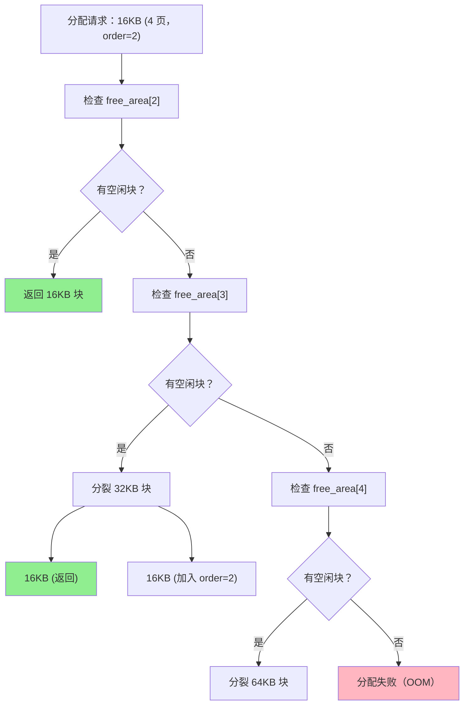

# Linux 内核 setup_arch() 内存接管详解

## 文档定位

本文档涵盖**完整页表建立阶段**（start_kernel → setup_arch）：
- **E820 解析**：如何从 BIOS/UEFI 获取物理内存布局
- **memblock 建立**：早期内存分配器的初始化
- **完整页表建立**：init_mem_mapping() 根据 E820/memblock 为所有 RAM 建立直接映射
- **zone 初始化**：paging_init() 为伙伴系统准备内存 zone

> **页表管理的两个阶段**：
> - **阶段 1：早期页表** - 压缩内核 startup_32/64 构建简单的身份映射页表，详见 [PAGING_PHASE1_THEORY_AND_EARLY_TABLES.md](PAGING_PHASE1_THEORY_AND_EARLY_TABLES.md)
> - **阶段 2：完整页表（本文档）** - setup_arch 中根据 E820/memblock 建立完整的直接映射，替换早期页表

## 代码来源说明

本文档涉及**四个项目**的代码：

| 项目 | 用途 | 源码仓库 |
|------|------|---------|
| **SeaBIOS** | Legacy BIOS 实现（POST、E820 构建） | https://git.seabios.org/seabios.git |
| **GRUB** | 引导加载器（传递 E820 给内核） | https://git.savannah.gnu.org/git/grub.git |
| **EDK2** | UEFI 参考实现（GetMemoryMap） | https://github.com/tianocore/edk2.git |
| **Linux Kernel** | 操作系统内核（E820 解析、页表建立） | https://git.kernel.org/pub/scm/linux/kernel/git/torvalds/linux.git |

所有代码片段都已标注**项目名、文件路径、函数名和行号**（基于 Linux v6.x 内核）。


## 1. 调用顺序概览

`setup_arch()` 中与内存接管相关的主要调用顺序（x86_64，简化）如下：

```
setup_arch()（arch/x86/kernel/setup.c）
    ├─ early_reserve_memory()           // 在加入 memblock 前预留区域
    ├─ e820__memory_setup()             // 解析 E820，填充 e820_table
    ├─ ...（max_pfn、e820__finish_early_params、e820__memblock_setup 前诸多步骤）
    ├─ max_pfn = e820__end_of_ram_pfn()
    ├─ e820__memblock_setup()           // 将 E820 RAM 加入 memblock
    ├─ init_mem_mapping()               // 建立直接映射（内核页表）
    ├─ ...
    ├─ initmem_init()                   // NUMA/memblock 节点（init_64.c）
    ├─ x86_init.paging.pagetable_init() // 实际调用 paging_init()
    └─ ...
```

- **e820**：固件/引导程序提供的物理内存布局（E820 表）。
- **memblock**：早期物理内存分配器，在伙伴系统之前使用。
- **init_mem_mapping**：为物理 RAM 建立内核直接映射（页表），使内核能访问全部可用物理页。
- **paging_init**：在 x86_64 上初始化 sparse 与 zone（sparse_init、zone_sizes_init），为后续伙伴系统做准备。

以下按上述顺序分步说明。

## 2. E820 内存映射表

### 2.1 E820 表概述

**E820 表**（E820 Memory Map）是 x86 架构上描述物理内存布局的标准机制，由 BIOS/固件提供给操作系统。

**核心作用**：
- 告诉操作系统哪些物理内存区域是可用 RAM（可以被内核分配和使用）
- 标识哪些区域被保留（BIOS、设备内存映射、ACPI 表等，不可覆盖）
- 提供每个区域的起始地址和大小

**数据流程**：
```
固件层（BIOS/UEFI）
    ↓ 构建 E820 表
Bootloader（GRUB）
    ↓ 传递 boot_params.e820_table
Linux 内核（setup_arch）
    ↓ e820__memory_setup()
内核内存管理（memblock, buddy system）
```

**E820 内存类型**（5 种主要类型）：
- `E820_TYPE_RAM` (1) - 可用内存
- `E820_TYPE_RESERVED` (2) - 保留区域
- `E820_TYPE_ACPI` (3) - ACPI 表（可回收）
- `E820_TYPE_NVS` (4) - ACPI NVS（不可回收）
- `E820_TYPE_UNUSABLE` (5) - 损坏内存

**关键数据结构**：
```c
// Linux Kernel - arch/x86/include/uapi/asm/e820.h
struct boot_e820_entry {
    __u64 addr;    // 物理起始地址
    __u64 size;    // 区域大小（字节）
    __u32 type;    // 内存类型
} __attribute__((packed));

// boot_params 中的 E820 表（最多 128 项）
struct boot_params {
    // ...
    __u8  e820_entries;              // 实际条目数
    struct boot_e820_entry e820_table[E820_MAX_ENTRIES_ZEROPAGE];
    // ...
};
```

**与 Paging/Segment 的关系**：
- **E820 描述物理地址空间**：独立于 CPU 的分段/分页机制
- **与分段无关**：E820 在实模式/保护模式下含义相同
- **强依赖分页**：E820 驱动内核页表初始化（`init_mem_mapping()`）

> **详细内容**：完整的 E820 数据结构层次、内核接收流程、与分页机制的详细关系，请参见 **[E820 内存映射表详解](E820_MEMORY_MAP.md)**。


### 2.2 SeaBIOS 如何构建 E820 表（概述）

**SeaBIOS** 是开源的 x86 BIOS 实现（常用于 QEMU/KVM），在 POST（Power-On Self-Test）过程中构建 E820 表。

> **项目**: [SeaBIOS](https://www.seabios.org/)
> **源码仓库**: https://git.seabios.org/seabios.git

**核心流程**：



**关键点**：
- ✅ **POST 阶段使用保护模式**：在 32 位保护模式下构建 E820 表
- ✅ **INT 15h 在实模式**：引导加载器调用时返回已构建的 E820 表
- ✅ **内存探测机制**：通过 PCI 配置寄存器获知内存大小（包括 >4GB）
- ✅ **内存测试策略**：只测试代表性内存（<4GB），信任硬件报告

**核心函数**：

> **项目**: SeaBIOS
> **文件**: `src/e820map.c`

```c
// 添加内存区域到 E820 表
void e820_add(u64 start, u64 size, u32 type);

// 自动处理重叠区域、合并相邻的同类型区域
```

> **详细说明**：关于 SeaBIOS POST 流程、CPU 模式切换（实模式 ↔ 保护模式）、内存探测详解、16位保护模式、大内存系统（512GB）的测试策略等完整技术细节，请参见：
>
> **[SEABIOS_E820_CONSTRUCTION.md](SEABIOS_E820_CONSTRUCTION.md)**


## 3. max_pfn 与 e820__memblock_setup()：早期分配器

在 `setup_arch()` 中，内核已经通过 `e820__memory_setup()` 获取了物理内存布局（存储在 `e820_table`），接下来需要：
1. 确定物理内存的边界（`max_pfn`）
2. 将可用 RAM 导入早期分配器（`memblock`）

这两步是内核接管物理内存管理的基础。

### 3.1 max_pfn 的计算

**max_pfn** (Maximum Page Frame Number) 表示**物理 RAM 的最大页帧号**，由 `e820__end_of_ram_pfn()` 计算得出。

#### 什么是 PFN？

**PFN**（Page Frame Number，页帧号）是物理地址按页大小（通常 4KB）对齐后的索引：

```c
物理地址 = PFN × PAGE_SIZE
PFN = 物理地址 >> PAGE_SHIFT

// 示例
物理地址 0x100000 (1MB)  → PFN = 0x100000 >> 12 = 0x100 (256)
物理地址 0x40000000 (1GB) → PFN = 0x40000000 >> 12 = 0x40000 (262144)
```

**x86_64 定义**：
```c
// Linux Kernel - arch/x86/include/asm/page_types.h
#define PAGE_SHIFT      12
#define PAGE_SIZE       (_AC(1, UL) << PAGE_SHIFT)  // 4096 bytes
#define PAGE_MASK       (~(PAGE_SIZE - 1))
```

#### e820__end_of_ram_pfn() 实现

> **项目**: Linux Kernel
> **文件**: `arch/x86/kernel/e820.c:870`

```c
// Linux Kernel - arch/x86/kernel/e820.c:870
/**
 * e820__end_of_ram_pfn - 查找最大物理 RAM 页帧号
 * 
 * 扫描 E820 表，找到类型为 E820_TYPE_RAM 的区域中
 * 地址最大的那个区域的结束地址，转换为 PFN
 */
unsigned long __init e820__end_of_ram_pfn(void)
{
    return e820_end_pfn(MAX_ARCH_PFN, E820_TYPE_RAM);
}

static unsigned long __init e820_end_pfn(unsigned long limit_pfn, 
                                          enum e820_type type)
{
    int i;
    unsigned long max_pfn = 0;
    struct e820_table *table = &e820_table;

    // 遍历 E820 表中的所有条目
    for (i = 0; i < table->nr_entries; i++) {
        struct e820_entry *entry = &table->entries[i];
        unsigned long start_pfn;
        unsigned long end_pfn;

        // 只处理指定类型（E820_TYPE_RAM）的区域
        if (entry->type != type)
            continue;

        start_pfn = entry->addr >> PAGE_SHIFT;
        end_pfn = (entry->addr + entry->size) >> PAGE_SHIFT;

        // 限制在架构最大 PFN 范围内
        if (start_pfn >= limit_pfn)
            continue;
        if (end_pfn > limit_pfn)
            end_pfn = limit_pfn;

        // 更新最大 PFN
        if (end_pfn > max_pfn)
            max_pfn = end_pfn;
    }

    return max_pfn;
}
```

#### max_pfn 在 setup_arch() 中的使用

> **项目**: Linux Kernel
> **文件**: `arch/x86/kernel/setup.c:1050`

```c
// Linux Kernel - arch/x86/kernel/setup.c:1050
void __init setup_arch(char **cmdline_p)
{
    // ... e820__memory_setup() 已完成 ...

    // 计算最大物理内存页帧号
    max_pfn = e820__end_of_ram_pfn();

    /* 
     * max_pfn 的用途：
     * 1. init_mem_mapping() 知道需要映射到哪里
     * 2. memblock 知道物理内存的上界
     * 3. zone 初始化时知道物理内存范围
     */
    pr_info("max_pfn = 0x%lx (physical RAM ends at %ldMB)\n",
            max_pfn, (max_pfn << PAGE_SHIFT) >> 20);

    // ... 后续使用 max_pfn ...
}
```

#### 实际示例

假设系统有 4GB RAM，E820 表如下：

```
E820 表条目：
[0x0000000000000000 - 0x000000000009FC00] (639 KB)   RAM
[0x000000000009FC00 - 0x00000000000A0000] (1 KB)     RESERVED
[0x00000000000E0000 - 0x0000000000100000] (128 KB)   RESERVED
[0x0000000000100000 - 0x00000000BFFF0000] (3071 MB)  RAM
[0x00000000BFFF0000 - 0x00000000C0000000] (64 KB)    RESERVED
[0x00000000F0000000 - 0x00000000F4000000] (64 MB)    RESERVED (MMIO)
```

计算 max_pfn：
```
扫描 E820 表，找到最大的 E820_TYPE_RAM 区域：
- 区域 1: [0x0 - 0x9FC00]        → end_pfn = 0x9FC00 >> 12 = 0x9F
- 区域 4: [0x100000 - 0xBFFF0000] → end_pfn = 0xBFFF0000 >> 12 = 0xBFFF0

max_pfn = 0xBFFF0 (786416)
物理 RAM 结束于：0xBFFF0 << 12 = 0xBFFF0000 (3071 MB)
```

### 3.2 memblock：早期内存分配器

在内核 buddy allocator（伙伴系统）初始化之前，内核需要一个**早期分配器**来分配内存（例如页表、内核数据结构）。**memblock** 就是这个早期分配器。

#### memblock 数据结构

> **项目**: Linux Kernel
> **文件**: `include/linux/memblock.h:85`

```c
// Linux Kernel - include/linux/memblock.h:85
/**
 * struct memblock - 早期内存分配器
 * @memory: 可用物理内存区域（从 E820 导入）
 * @reserved: 已保留/已分配的内存区域
 * @physmem: 所有物理内存（包括不可用区域）
 */
struct memblock {
    bool bottom_up;              // 分配方向：自底向上 or 自顶向下
    phys_addr_t current_limit;   // 当前分配上限（可动态调整）

    struct memblock_type memory;    // 可用内存区域
    struct memblock_type reserved;  // 保留内存区域
    struct memblock_type physmem;   // 物理内存（CONFIG_ARCH_KEEP_MEMBLOCK）
};

/**
 * struct memblock_type - 内存区域类型
 * @cnt: 当前区域数量
 * @max: 最大区域数量
 * @total_size: 总大小
 * @regions: 区域数组
 */
struct memblock_type {
    unsigned long cnt;
    unsigned long max;
    phys_addr_t total_size;
    struct memblock_region *regions;  // 动态数组
    char *name;
};

/**
 * struct memblock_region - 内存区域描述符
 * @base: 起始物理地址
 * @size: 区域大小
 * @flags: 标志（MEMBLOCK_HOTPLUG, MEMBLOCK_MIRROR 等）
 * @nid: NUMA 节点 ID
 */
struct memblock_region {
    phys_addr_t base;
    phys_addr_t size;
    enum memblock_flags flags;
    int nid;
};
```

#### memblock 的两个关键区域



**关键区别**：
- **memblock.memory**：记录**哪些物理地址是可用 RAM**（从 E820_TYPE_RAM 导入）
- **memblock.reserved**：记录**哪些物理地址已被分配或必须保留**（内核镜像、initrd、页表等）

### 3.3 e820__memblock_setup() 实现

> **项目**: Linux Kernel
> **文件**: `arch/x86/kernel/e820.c:1240`

```c
// Linux Kernel - arch/x86/kernel/e820.c:1240
/**
 * e820__memblock_setup - 将 E820 表导入 memblock
 * 
 * 遍历 E820 表，将可用 RAM 区域添加到 memblock.memory，
 * 将保留区域添加到 memblock.reserved
 */
void __init e820__memblock_setup(void)
{
    int i;
    u64 end;

    /*
     * 遍历 E820 表中的所有条目
     */
    for (i = 0; i < e820_table->nr_entries; i++) {
        struct e820_entry *entry = &e820_table->entries[i];

        end = entry->addr + entry->size;
        if (end > max_pfn << PAGE_SHIFT)
            end = max_pfn << PAGE_SHIFT;
        if (entry->addr >= end)
            continue;

        /*
         * E820_TYPE_RAM：可用内存，添加到 memblock.memory
         */
        if (entry->type == E820_TYPE_RAM) {
            memblock_add(entry->addr, entry->size);
        }

        /*
         * E820_TYPE_SOFT_RESERVED：软保留内存
         * （例如持久化内存设备）
         */
        if (entry->type == E820_TYPE_SOFT_RESERVED) {
            memblock_reserve(entry->addr, entry->size);
        }
    }

    /*
     * 设置 memblock 分配上限
     * 在 init_mem_mapping() 完成前，限制在 ISA_END_ADDRESS
     * 防止分配到未映射的高端内存
     */
    memblock_set_current_limit(ISA_END_ADDRESS);

    /*
     * 保留内核镜像占用的物理内存
     * _text: 内核代码段起始
     * _end:  内核结束（包括 bss 段）
     */
    memblock_reserve(__pa_symbol(_text), 
                     (unsigned long)__pa_symbol(_end) - 
                     (unsigned long)__pa_symbol(_text));

    /*
     * 保留 initrd（初始 RAM 盘）占用的内存
     */
    if (boot_params.hdr.type_of_loader && boot_params.hdr.ramdisk_image) {
        u64 ramdisk_image = boot_params.hdr.ramdisk_image;
        u64 ramdisk_size  = boot_params.hdr.ramdisk_size;
        memblock_reserve(ramdisk_image, ramdisk_size);
    }

    /*
     * 保留其他关键区域（BIOS、ACPI 表等）
     */
    e820__reserve_resources();
}
```

#### memblock_add() 和 memblock_reserve() 的区别

| 函数 | 作用 | 添加到 | 示例 |
|------|------|--------|------|
| `memblock_add(addr, size)` | 声明物理内存**可用** | `memblock.memory` | E820_TYPE_RAM 区域 |
| `memblock_reserve(addr, size)` | 标记物理内存**已占用** | `memblock.reserved` | 内核镜像、initrd、页表 |

**重要概念**：一块物理内存可以**同时**在 `memory` 和 `reserved` 中：
- 在 `memory` 中表示"这是可用 RAM"
- 在 `reserved` 中表示"但已被占用，不可再分配"

#### 实际示例：4GB 系统的 memblock 状态

假设系统有 4GB RAM，内核镜像在 0x1000000（16MB），大小 10MB：

```
执行 e820__memblock_setup() 后：

memblock.memory（可用 RAM）：
  [0x0000000000000000 - 0x000000000009FC00]  639 KB
  [0x0000000000100000 - 0x00000000BFFF0000]  3071 MB
  total: 3071.6 MB

memblock.reserved（已占用）：
  [0x0000000000000000 - 0x0000000000001000]  4 KB    (BIOS data)
  [0x0000000001000000 - 0x0000000001A00000]  10 MB   (内核镜像 _text-_end)
  [0x0000000010000000 - 0x0000000010800000]  8 MB    (initrd)
  [0x00000000000E0000 - 0x0000000000100000]  128 KB  (BIOS ROM)
  total: ~18 MB

可供分配的 RAM = memblock.memory - memblock.reserved ≈ 3053 MB
```

### 3.4 memblock 的使用

#### 分配内存示例

> **项目**: Linux Kernel
> **文件**: `mm/memblock.c`

```c
// 从 memblock 分配内存（自动添加到 reserved）
void *ptr = memblock_alloc(size, align);

// 实际流程：
// 1. 从 memblock.memory 中查找大小为 size、对齐为 align 的空闲区域
// 2. 该区域不能与 memblock.reserved 重叠
// 3. 找到后，将该区域添加到 memblock.reserved
// 4. 返回虚拟地址（通过 __va() 转换物理地址）
```

#### memblock_set_current_limit() 的作用

```c
// Linux Kernel - arch/x86/kernel/setup.c
void __init setup_arch(char **cmdline_p)
{
    // ... e820__memblock_setup() ...

    // 阶段 1：限制在 ISA_END_ADDRESS（通常 1MB）
    // 原因：init_mem_mapping() 尚未完成，高端内存未映射
    memblock_set_current_limit(ISA_END_ADDRESS);

    // ... init_mem_mapping() 完成 ...

    // 阶段 2：放宽限制到全部物理内存
    // 现在可以分配高端内存了
    memblock_set_current_limit(max_pfn << PAGE_SHIFT);
}
```

### 3.5 关键时间点



### 3.6 要点总结

1. **max_pfn 的作用**：
   - 标记物理 RAM 的最大页帧号
   - 为 `init_mem_mapping()` 提供映射范围
   - 为 `memblock` 和 `zone` 提供物理内存上界

2. **e820__memblock_setup() 的作用**：
   - 将 E820 表中的 `E820_TYPE_RAM` 导入 `memblock.memory`
   - 将内核镜像、initrd 等标记为 `memblock.reserved`
   - 设置 `memblock_set_current_limit()` 限制早期分配范围

3. **memblock 的生命周期**：
   - **创建**：`e820__memblock_setup()` 导入 E820 数据
   - **使用**：`init_mem_mapping()`、`paging_init()` 从 memblock 分配页表
   - **销毁**：`mem_init()` 后，memblock 数据转交给 buddy allocator，memblock 被释放

4. **关键设计**：
   - **两阶段限制**：先限制在 ISA_END，映射完成后放宽，避免分配未映射内存
   - **双区域管理**：`memory` 记录可用 RAM，`reserved` 记录已占用，两者可重叠
   - **物理地址管理**：memblock 管理**物理地址**，通过 `__va()` 转换为虚拟地址使用


## 4. init_mem_mapping()：建立直接映射（内核页表）

在 `e820__memblock_setup()` 完成后，内核已经知道了哪些物理地址是可用 RAM（存储在 `memblock.memory`），但此时内核**还不能访问全部物理内存**，因为：

1. **早期页表有限**：bootloader 建立的页表只映射了有限范围（通常几百 MB）
2. **高端内存未映射**：超出早期映射范围的物理内存无法访问

**`init_mem_mapping()` 的作用**：为**全部物理 RAM** 建立**内核直接映射**（Direct Mapping），使内核可以通过固定的虚拟地址偏移访问任意物理内存。

### 4.1 什么是直接映射（Direct Mapping）？

**直接映射**是一种特殊的虚拟地址映射方式：虚拟地址与物理地址之间保持**固定偏移量**。

#### x86_64 的地址空间布局

```
虚拟地址空间（x86_64）：
┌─────────────────────────────────────────────────────────┐
│ 用户空间          0x0000000000000000 - 0x00007FFFFFFFFFFF │ 0-128TB
├─────────────────────────────────────────────────────────┤
│ 非规范地址        0x0000800000000000 - 0xFFFF7FFFFFFFFFFF │ (禁止)
├─────────────────────────────────────────────────────────┤
│ 内核空间          0xFFFF800000000000 - 0xFFFFFFFFFFFFFFFF │ 128TB
│  ├─ 直接映射       0xFFFF880000000000 - ...              │ ← 本节重点
│  ├─ vmalloc 区域   0xFFFFC90000000000 - ...              │
│  ├─ vmemmap        0xFFFFEA0000000000 - ...              │
│  └─ 内核代码/数据   0xFFFFFFFF80000000 - ...              │
└─────────────────────────────────────────────────────────┘
```

**直接映射公式**（x86_64）：
```c
// Linux Kernel - arch/x86/include/asm/page_64.h
#define __PAGE_OFFSET_BASE      0xFFFF880000000000UL
#define __START_KERNEL_map      0xFFFFFFFF80000000UL

// 物理地址 → 虚拟地址（直接映射）
#define __va(x)   ((void *)((unsigned long)(x) + PAGE_OFFSET))

// 虚拟地址 → 物理地址（直接映射）
#define __pa(x)   ((unsigned long)(x) - PAGE_OFFSET)

// 示例
物理地址 0x1000000   → 虚拟地址 0xFFFF880001000000
物理地址 0x40000000  → 虚拟地址 0xFFFF880040000000
```

**为什么需要直接映射？**

| 需求 | 没有直接映射 | 有直接映射 |
|------|-----------|----------|
| 访问物理内存 | 需要动态建立临时映射（慢） | `__va(paddr)` 即可访问（快） |
| 内核数据结构 | 需要为每个对象建立映射 | 直接在直接映射区分配 |
| DMA 缓冲区 | 需要特殊处理 | 物理地址与虚拟地址固定偏移 |

### 4.2 init_mem_mapping() 的调用位置

> **项目**: Linux Kernel
> **文件**: `arch/x86/kernel/setup.c:1100`

```c
// Linux Kernel - arch/x86/kernel/setup.c:1100
void __init setup_arch(char **cmdline_p)
{
    // ... e820__memory_setup() ...
    // ... max_pfn = e820__end_of_ram_pfn() ...
    // ... e820__memblock_setup() ...

    /*
     * 此时状态：
     * - E820 表已解析
     * - memblock 已导入可用 RAM
     * - 但内核只能访问有限范围的物理内存（bootloader 早期页表）
     */

    /*
     * 建立完整的直接映射
     * 映射范围：0 到 max_pfn（全部物理 RAM）
     */
    init_mem_mapping();

    /*
     * 此后状态：
     * - 内核可以访问全部物理 RAM
     * - 页表存储在 swapper_pg_dir
     * - CR3 已切换到 swapper_pg_dir
     */

    // ... paging_init() ...
}
```

### 4.3 init_mem_mapping() 实现流程

> **项目**: Linux Kernel
> **文件**: `arch/x86/mm/init.c:758`

```c
// Linux Kernel - arch/x86/mm/init.c:758
/**
 * init_mem_mapping - 为物理 RAM 建立直接映射
 * 
 * 映射策略：
 * 1. 先映射 ISA 区域（0-1MB）
 * 2. 再映射全部 RAM（根据 memblock_bottom_up 选择方向）
 * 3. 使用 2MB/1GB 大页以节省 TLB 和页表空间
 */
void __init init_mem_mapping(void)
{
    unsigned long end;

    /*
     * 确定映射范围：0 到 max_pfn
     */
    probe_page_size_mask();   // 检测 CPU 支持的页大小（4KB/2MB/1GB）

    /*
     * Step 1: 映射 ISA 区域（0 - ISA_END_ADDRESS，通常 1MB）
     * 这是最关键的低端内存，包含 BIOS 数据、中断向量表等
     */
    init_memory_mapping(0, ISA_END_ADDRESS, PAGE_KERNEL);

    /*
     * Step 2: 初始化 trampoline
     * 为 SMP 启动、挂起/恢复等需要实模式代码的场景准备
     */
    init_trampoline();

    /*
     * Step 3: 映射全部 RAM（ISA_END_ADDRESS 到 max_pfn）
     * 根据 memblock_bottom_up() 选择映射方向
     */
    end = max_pfn << PAGE_SHIFT;

    if (memblock_bottom_up()) {
        /*
         * 自底向上映射（推荐）：
         * - 先映射 kernel_end 到 end（内核之上）
         * - 再映射 ISA_END 到 kernel_end（内核本身）
         * 优点：页表分配在内核镜像之上，不会覆盖内核
         */
        unsigned long kernel_end = __pa_symbol(_end);
        
        memory_map_bottom_up(kernel_end, end);
        memory_map_bottom_up(ISA_END_ADDRESS, kernel_end);
    } else {
        /*
         * 自顶向下映射（旧方式）：
         * - 从高地址向低地址映射
         * - 页表分配在高端内存
         */
        memory_map_top_down(ISA_END_ADDRESS, end);
    }

    /*
     * Step 4: 切换到新页表
     * 加载 swapper_pg_dir 到 CR3，刷新 TLB
     */
    load_cr3(swapper_pg_dir);
    __flush_tlb_all();

    /*
     * Step 5: 放宽 memblock 分配限制
     * 现在可以从全部物理内存分配了
     */
    memblock_set_current_limit(max_pfn << PAGE_SHIFT);

    /*
     * 打印映射信息
     */
    pr_info("init_mem_mapping: [mem 0x00000000-0x%016lx]\n", end - 1);
    
    early_memtest(0, max_pfn << PAGE_SHIFT);  // 可选的内存测试
}
```

### 4.4 memory_map_bottom_up() 详解

> **项目**: Linux Kernel
> **文件**: `arch/x86/mm/init.c:620`

```c
// Linux Kernel - arch/x86/mm/init.c:620
/**
 * memory_map_bottom_up - 自底向上建立内存映射
 * @map_start: 映射起始物理地址
 * @map_end:   映射结束物理地址
 * 
 * 遍历 memblock.memory 中的区域，逐个建立映射
 */
static void __init memory_map_bottom_up(unsigned long map_start,
                                         unsigned long map_end)
{
    unsigned long next, start;

    /*
     * 遍历 memblock.memory 中的每个物理内存区域
     */
    for_each_free_mem_pfn_range_in_zone_from_0(start, next) {
        if (start >= map_end)
            break;

        if (next > map_end)
            next = map_end;

        /*
         * 为 [start, next) 区间建立映射
         * 调用 init_range_memory_mapping()
         */
        init_range_memory_mapping(start, next);
    }
}
```

### 4.5 init_range_memory_mapping() 与 kernel_physical_mapping_init()

#### init_range_memory_mapping()

> **项目**: Linux Kernel
> **文件**: `arch/x86/mm/init.c:548`

```c
// Linux Kernel - arch/x86/mm/init.c:548
static void __init init_range_memory_mapping(unsigned long r_start,
                                               unsigned long r_end)
{
    unsigned long start_pfn, end_pfn;
    unsigned long mapped_ram_size = 0;
    int i;

    /*
     * 将物理地址范围转换为 PFN 范围
     */
    start_pfn = r_start >> PAGE_SHIFT;
    end_pfn = r_end >> PAGE_SHIFT;

    /*
     * 为该范围建立映射
     */
    for (i = 0; i < nr_pfn_mapped; i++) {
        /*
         * 检查是否已映射（避免重复映射）
         */
        if (pfn_mapped[i].end > start_pfn && pfn_mapped[i].start < end_pfn) {
            // 已部分映射，跳过重叠部分
            continue;
        }
    }

    /*
     * 调用架构相关的映射函数
     * x86_64: kernel_physical_mapping_init()
     */
    init_memory_mapping(r_start, r_end, PAGE_KERNEL);

    /*
     * 记录已映射范围
     */
    pfn_mapped[nr_pfn_mapped].start = start_pfn;
    pfn_mapped[nr_pfn_mapped].end = end_pfn;
    nr_pfn_mapped++;
}
```

#### kernel_physical_mapping_init()：核心页表填充函数

> **项目**: Linux Kernel
> **文件**: `arch/x86/mm/init_64.c:550`

```c
// Linux Kernel - arch/x86/mm/init_64.c:550
/**
 * kernel_physical_mapping_init - 建立物理内存的内核页表
 * @paddr_start: 起始物理地址
 * @paddr_end:   结束物理地址
 * @prot:        页表保护位（PAGE_KERNEL）
 * 
 * 返回：映射的虚拟地址范围结束地址
 */
unsigned long __meminit
kernel_physical_mapping_init(unsigned long paddr_start,
                              unsigned long paddr_end,
                              unsigned long page_size_mask,
                              pgprot_t prot)
{
    unsigned long vaddr, vaddr_start, vaddr_end, vaddr_next;
    unsigned long paddr_last = paddr_end;
    pgd_t *pgd;
    p4d_t *p4d;
    pud_t *pud;
    pmd_t *pmd;
    pte_t *pte;

    /*
     * 计算虚拟地址范围（直接映射）
     */
    vaddr = (unsigned long)__va(paddr_start);
    vaddr_end = (unsigned long)__va(paddr_end);
    vaddr_start = vaddr;

    /*
     * 遍历 PGD（Page Global Directory）层级
     */
    for (; vaddr < vaddr_end; vaddr = vaddr_next) {
        pgd = pgd_offset_k(vaddr);  // 获取 PGD 表项

        /*
         * 如果 PGD 表项为空，分配 P4D 页表
         * （5 级页表架构需要，4 级页表此步骤可能跳过）
         */
        if (pgd_none(*pgd)) {
            p4d = (p4d_t *)alloc_low_page();  // 从 memblock 分配页表页
            set_pgd(pgd, __pgd(__pa(p4d) | _KERNPG_TABLE));
        }

        /*
         * 获取 P4D 表项
         */
        p4d = p4d_offset(pgd, vaddr);

        /*
         * 遍历 PUD（Page Upper Directory）层级
         */
        vaddr_next = (vaddr & PUD_MASK) + PUD_SIZE;
        if (vaddr_next > vaddr_end)
            vaddr_next = vaddr_end;

        pud = pud_offset(p4d, vaddr);

        /*
         * 尝试使用 1GB 大页（需要 CPU 支持）
         */
        if (page_size_mask & (1 << PG_LEVEL_1G)) {
            if (pud_none(*pud)) {
                unsigned long paddr = vaddr - PAGE_OFFSET;
                set_pud(pud, __pud(paddr | __PAGE_KERNEL_LARGE));
                continue;  // 1GB 大页映射完成，跳过 PMD/PTE
            }
        }

        /*
         * 分配 PMD 页表
         */
        if (pud_none(*pud)) {
            pmd = (pmd_t *)alloc_low_page();
            set_pud(pud, __pud(__pa(pmd) | _KERNPG_TABLE));
        }

        /*
         * 遍历 PMD（Page Middle Directory）层级
         */
        pmd = pmd_offset(pud, vaddr);

        /*
         * 尝试使用 2MB 大页（推荐）
         */
        if (page_size_mask & (1 << PG_LEVEL_2M)) {
            if (pmd_none(*pmd)) {
                unsigned long paddr = vaddr - PAGE_OFFSET;
                set_pmd(pmd, __pmd(paddr | __PAGE_KERNEL_LARGE));
                continue;  // 2MB 大页映射完成，跳过 PTE
            }
        }

        /*
         * 使用 4KB 小页（兜底方案）
         * 分配 PTE 页表
         */
        if (pmd_none(*pmd)) {
            pte = (pte_t *)alloc_low_page();
            set_pmd(pmd, __pmd(__pa(pte) | _KERNPG_TABLE));
        }

        /*
         * 填充 PTE（Page Table Entry）
         */
        pte = pte_offset_kernel(pmd, vaddr);
        if (pte_none(*pte)) {
            unsigned long paddr = vaddr - PAGE_OFFSET;
            set_pte(pte, __pte(paddr | pgprot_val(prot)));
        }
    }

    __flush_tlb_all();  // 刷新 TLB
    return vaddr_end;
}
```

### 4.6 页表层次与大页优化

#### x86_64 四级页表结构

```
虚拟地址（64 位）分解：
┌──────┬──────┬──────┬──────┬──────┬────────────┐
│ 符号 │ PGD  │ PUD  │ PMD  │ PTE  │   Offset   │
│ 扩展 │ 索引 │ 索引 │ 索引 │ 索引 │            │
├──────┼──────┼──────┼──────┼──────┼────────────┤
│ 63-48│ 47-39│ 38-30│ 29-21│ 20-12│   11-0     │
│ 16位 │ 9位  │ 9位  │ 9位  │ 9位  │   12位     │
└──────┴──────┴──────┴──────┴──────┴────────────┘

页表遍历流程：
CR3 → PGD[47:39] → PUD[38:30] → PMD[29:21] → PTE[20:12] → 物理地址[11:0]
```

#### 大页映射优化

| 页大小 | 层级 | 映射范围 | 页表项数 | TLB 效率 | 使用场景 |
|--------|------|---------|---------|---------|---------|
| **4KB** | PTE | 4KB | 1 | 低 | 精细控制（设备内存） |
| **2MB** | PMD | 2MB | 512 个 PTE | 中 | **内核直接映射**（推荐） |
| **1GB** | PUD | 1GB | 512 个 PMD | 高 | 大内存系统（需 CPU 支持） |

**为什么使用 2MB 大页？**

1. **减少页表占用**：
   ```
   映射 1GB 内存：
   - 4KB 页：需要 262144 个 PTE（262144 × 8B = 2MB 页表）
   - 2MB 页：需要 512 个 PMD（512 × 8B = 4KB 页表）
   节省：2MB - 4KB = 2044KB 页表空间
   ```

2. **提高 TLB 命中率**：
   ```
   TLB 缓存（典型）：
   - 4KB 页 TLB：64 项 → 覆盖 256KB 内存
   - 2MB 页 TLB：32 项 → 覆盖 64MB 内存
   大页可减少 TLB miss，提升性能 5-15%
   ```

3. **简化页表遍历**：
   ```
   访问内存：
   - 4KB 页：CR3 → PGD → PUD → PMD → PTE → 物理地址（5 次访问）
   - 2MB 页：CR3 → PGD → PUD → PMD → 物理地址（4 次访问）
   ```

### 4.7 alloc_low_page()：页表页分配

> **项目**: Linux Kernel
> **文件**: `arch/x86/mm/init.c:89`

```c
// Linux Kernel - arch/x86/mm/init.c:89
/**
 * alloc_low_page - 分配页表页
 * 
 * 从 memblock 分配一个 4KB 页面用于存储页表
 * 这些页表页本身也会被映射到直接映射区
 */
static void __init *alloc_low_page(void)
{
    void *adr;

    /*
     * 从 memblock 分配 PAGE_SIZE（4KB）内存
     * 对齐到 PAGE_SIZE
     */
    adr = memblock_alloc(PAGE_SIZE, PAGE_SIZE);
    if (!adr) {
        panic("alloc_low_page: ran out of memory");
    }

    /*
     * 清零页表页（重要！）
     * 未初始化的页表项会导致随机地址映射
     */
    memset(adr, 0, PAGE_SIZE);

    return adr;
}
```

**重要概念**：页表页本身也是物理内存，也需要被映射。这形成了"自举"：
1. 早期页表映射少量内存（bootloader 提供）
2. `init_mem_mapping()` 使用早期映射的内存分配新页表页
3. 新页表页扩展映射范围
4. 重复步骤 2-3，直到全部 RAM 被映射

### 4.8 CR3 切换与 swapper_pg_dir

#### CR3 寄存器

**CR3**（Control Register 3）存储**当前页表的物理地址**：

```c
// x86_64 CR3 格式
CR3 寄存器（64 位）：
┌──────────────────────────────────────────────────┬──────┬───┬───┐
│ PGD 物理地址（4KB 对齐）                          │ PCID │PCD│PWT│
├──────────────────────────────────────────────────┼──────┼───┼───┤
│ 63-12（52 位）                                    │ 11-0 │ 4 │ 3 │
└──────────────────────────────────────────────────┴──────┴───┴───┘

- PGD 物理地址：页表基地址（必须 4KB 对齐）
- PCID：进程上下文标识符（可选）
- PCD：Page-level Cache Disable
- PWT：Page-level Write-Through
```

#### swapper_pg_dir

> **项目**: Linux Kernel
> **文件**: `arch/x86/kernel/head_64.S:467`

```c
// Linux Kernel - arch/x86/kernel/head_64.S:467
/*
 * swapper_pg_dir：内核主页表（全局页表）
 * - 所有内核线程共享此页表
 * - 用户进程也复用内核空间部分（高地址）
 */
__INITDATA
NEXT_PAGE(early_top_pgt)        // 早期页表（bootloader 使用）
    // ...

__INITDATA
NEXT_PAGE(init_top_pgt)         // init 进程页表
    // ...

NEXT_PGD_PAGE(swapper_pg_dir)   // 内核主页表
    // init_mem_mapping() 填充此页表
    // load_cr3() 切换到此页表
```

#### load_cr3() 切换页表

> **项目**: Linux Kernel
> **文件**: `arch/x86/include/asm/tlbflush.h:188`

```c
// Linux Kernel - arch/x86/include/asm/tlbflush.h:188
static inline void load_cr3(pgd_t *pgdir)
{
    /*
     * 将页表物理地址写入 CR3
     * __pa()：虚拟地址 → 物理地址
     */
    write_cr3(__pa(pgdir));
}

// 汇编实现
static inline void native_write_cr3(unsigned long val)
{
    asm volatile("mov %0, %%cr3" : : "r" (val) : "memory");
    
    /*
     * 写入 CR3 后：
     * 1. CPU 立即使用新页表进行地址转换
     * 2. TLB 自动失效（部分或全部）
     * 3. 后续内存访问使用新映射
     */
}
```

### 4.9 完整流程图



### 4.10 实际示例：4GB 系统的直接映射

假设系统有 4GB RAM（物理地址 0x0 - 0xFFFFFFFF）：

#### 映射前（bootloader 早期页表）

```
早期页表（由 bootloader/head_64.S 建立）：
物理地址           虚拟地址                映射状态
0x00000000  →  0xFFFF880000000000    ✅ 已映射（低 512MB）
...
0x20000000  →  0xFFFF880020000000    ✅ 已映射
0x20000000  →  未映射                 ❌ 超出早期映射范围
...
0xFFFFFFFF  →  未映射                 ❌ 超出早期映射范围
```

#### 映射后（init_mem_mapping 完成）

```
完整直接映射（swapper_pg_dir）：
物理地址           虚拟地址                页表项
0x00000000  →  0xFFFF880000000000    PMD (2MB 大页) × 2048
0x00200000  →  0xFFFF880000200000    PMD (2MB 大页)
...
0xFFE00000  →  0xFFFFFFFFFFE00000    PMD (2MB 大页)

全部 4GB RAM 已映射，使用 2048 个 PMD 表项（2MB 大页）
页表总开销：PGD(8B) + PUD(8B×4) + PMD(8B×2048) ≈ 16KB
```

#### 访问高端内存示例

```c
// 访问物理地址 0x80000000（2GB 处）的内存

// 映射前（失败）
void *ptr_before = __va(0x80000000);  // 0xFFFF880080000000
*ptr_before;  // Page Fault！虚拟地址未映射

// 映射后（成功）
init_mem_mapping();  // 建立直接映射
void *ptr_after = __va(0x80000000);
*ptr_after = 0x12345678;  // ✅ 成功访问，通过 swapper_pg_dir 映射
```

### 4.11 要点总结

1. **init_mem_mapping() 的作用**：
   - 为**全部物理 RAM**建立**内核直接映射**
   - 映射范围：0 到 `max_pfn << PAGE_SHIFT`
   - 映射区域：`__PAGE_OFFSET_BASE` 开始的虚拟地址空间

2. **直接映射的特点**：
   - **固定偏移**：`虚拟地址 = 物理地址 + PAGE_OFFSET`
   - **快速访问**：`__va(paddr)` 即可获得虚拟地址，无需动态映射
   - **全局共享**：所有内核线程共享 `swapper_pg_dir`

3. **页表优化**：
   - **2MB 大页**：减少页表占用，提高 TLB 命中率
   - **1GB 大页**：大内存系统（需 CPU 支持 `PDPE1GB`）
   - **4KB 小页**：特殊区域（设备内存、精细控制）

4. **关键函数**：
   - `kernel_physical_mapping_init()`：填充页表（PGD → PUD → PMD → PTE）
   - `alloc_low_page()`：从 memblock 分配页表页
   - `load_cr3(swapper_pg_dir)`：切换到新页表
   - `__flush_tlb_all()`：刷新 TLB 缓存

5. **前后对比**：
   - **映射前**：内核只能访问有限物理内存（bootloader 早期页表）
   - **映射后**：内核可以访问**全部物理 RAM**（通过固定偏移）
   - **memblock 限制**：映射后放宽到 `max_pfn`，可从全部 RAM 分配


## 5. initmem_init() 与 paging_init()：NUMA 与 zone

在 `init_mem_mapping()` 完成后，内核已经可以访问全部物理 RAM（通过直接映射），但此时物理内存还**没有被划分成可管理的单元**（zone）。

**`initmem_init()` 和 `paging_init()` 的作用**：
1. **`initmem_init()`**：将物理内存与 NUMA 节点关联
2. **`paging_init()`**：初始化内存管理 zone，为 buddy allocator 做准备

这两步完成后，内核的物理内存管理系统（buddy allocator + slab allocator）才能正常工作。

### 5.1 什么是 zone？

**zone**（内存区域）是 Linux 内核对物理内存的**功能性划分**，不同 zone 有不同的用途和限制。

#### x86_64 的 zone 划分

```
物理内存 zone 划分（x86_64）：
┌─────────────────────────────────────────────────────────┐
│ ZONE_DMA          0x00000000 - 0x01000000 (0-16MB)      │
│   用途：ISA 设备 DMA（需要低于 16MB 的物理地址）         │
│   限制：24 位地址总线的传统设备                          │
├─────────────────────────────────────────────────────────┤
│ ZONE_DMA32        0x01000000 - 0x100000000 (16MB-4GB)   │
│   用途：32 位设备 DMA（需要低于 4GB 的物理地址）         │
│   限制：32 位地址总线的现代设备                          │
├─────────────────────────────────────────────────────────┤
│ ZONE_NORMAL       0x100000000 - max_pfn (4GB-物理内存尾)│
│   用途：普通内存分配（内核数据、用户页面等）             │
│   限制：无（64 位系统可直接访问）                        │
├─────────────────────────────────────────────────────────┤
│ ZONE_MOVABLE      （可选）动态划分                      │
│   用途：可迁移页面（内存热插拔、大页整理）               │
├─────────────────────────────────────────────────────────┤
│ ZONE_DEVICE       （可选）设备内存                      │
│   用途：持久化内存（NVDIMM）、GPU 内存等                 │
└─────────────────────────────────────────────────────────┘
```

**为什么需要 zone？**

| 需求 | 没有 zone | 有 zone 划分 |
|------|----------|-------------|
| ISA 设备 DMA | 可能分配高于 16MB 的地址（失败） | 从 ZONE_DMA 分配（成功） |
| 32 位设备 DMA | 可能分配高于 4GB 的地址（失败） | 从 ZONE_DMA32 分配（成功） |
| 内存热插拔 | 无法区分可移动/不可移动页面 | ZONE_MOVABLE 只含可移动页 |
| 内存碎片整理 | 无法安全迁移页面 | 按 zone 进行页面迁移 |

### 5.2 initmem_init() 的作用

> **项目**: Linux Kernel
> **文件**: `arch/x86/mm/numa.c:760` (x86_64)

```c
// Linux Kernel - arch/x86/mm/numa.c:760
/**
 * initmem_init - 初始化内存管理（NUMA）
 * 
 * 将 memblock 的物理内存与 NUMA 节点关联
 * 为后续 zone 初始化准备节点信息
 */
void __init initmem_init(void)
{
    /*
     * x86_64：初始化 NUMA 配置
     * x86_32：此函数可能为空（不支持 NUMA）
     */
    x86_numa_init();
}
```

#### 什么是 NUMA？

**NUMA**（Non-Uniform Memory Access，非一致内存访问）：
- **多 CPU 系统**：每个 CPU（或 CPU 组）有自己的**本地内存**
- **访问速度不同**：访问本地内存快，访问远程内存慢（需要通过互连总线）
- **内核优化**：优先从本地节点分配内存，减少跨节点访问

```
NUMA 系统示例（双 Socket 服务器）：
┌──────────────────────┐      ┌──────────────────────┐
│ Node 0               │      │ Node 1               │
│  ┌────────┐          │      │          ┌────────┐  │
│  │ CPU 0  │          │      │          │ CPU 1  │  │
│  │ 8 核   │          │      │          │ 8 核   │  │
│  └────────┘          │      │          └────────┘  │
│       ↕              │      │              ↕       │
│  ┌────────────┐      │      │      ┌────────────┐  │
│  │ 本地内存   │      │      │      │ 本地内存   │  │
│  │ 64 GB      │      │      │      │ 64 GB      │  │
│  └────────────┘      │      │      └────────────┘  │
└──────────────────────┘      └──────────────────────┘
         ↕                              ↕
         └──────────────┬───────────────┘
                   互连总线（QPI/UPI）

访问延迟：
- CPU 0 访问 Node 0 内存：~100ns（本地）
- CPU 0 访问 Node 1 内存：~150ns（远程，+50%）
```

#### x86_numa_init() 实现

> **项目**: Linux Kernel
> **文件**: `arch/x86/mm/numa.c:680`

```c
// Linux Kernel - arch/x86/mm/numa.c:680
/**
 * x86_numa_init - 初始化 NUMA 拓扑
 * 
 * 检测 NUMA 节点数量和每个节点的内存范围
 * 将 memblock 的物理内存按节点划分
 */
void __init x86_numa_init(void)
{
    int ret;

    /*
     * 尝试从 ACPI SRAT 表获取 NUMA 信息
     * （系统资源亲和性表）
     */
    if (!numa_off) {
        ret = x86_acpi_numa_init();
        if (!ret)
            return;
    }

    /*
     * 如果 ACPI 失败，尝试从 AMD Northbridge 获取
     */
    ret = amd_numa_init();
    if (!ret)
        return;

    /*
     * 如果都失败，使用虚拟 NUMA（dummy_numa_init）
     * 将全部内存视为单个 NUMA 节点（Node 0）
     */
    numa_off = 1;
    pr_info("No NUMA configuration found, using dummy NUMA.\n");
    dummy_numa_init();
}
```

#### memblock_set_node() - 绑定内存到节点

> **项目**: Linux Kernel
> **文件**: `mm/memblock.c:1150`

```c
// Linux Kernel - mm/memblock.c:1150
/**
 * memblock_set_node - 将物理内存区域绑定到 NUMA 节点
 * @base: 起始物理地址
 * @size: 区域大小
 * @type: memblock 类型（memory/reserved）
 * @nid: NUMA 节点 ID
 */
int __init_memblock memblock_set_node(phys_addr_t base, phys_addr_t size,
                                       struct memblock_type *type, int nid)
{
    int start_rgn, end_rgn;
    int i, ret;

    /*
     * 找到 [base, base+size) 覆盖的 memblock 区域
     */
    ret = memblock_isolate_range(type, base, size, &start_rgn, &end_rgn);
    if (ret)
        return ret;

    /*
     * 设置这些区域的 NUMA 节点 ID
     */
    for (i = start_rgn; i < end_rgn; i++)
        memblock_set_region_node(&type->regions[i], nid);

    memblock_merge_regions(type);
    return 0;
}
```

#### 实际示例：双节点 NUMA 系统

假设系统有 128GB RAM，分布在两个 NUMA 节点：

```
ACPI SRAT 表（BIOS 提供）：
Node 0: 物理地址 0x00000000 - 0x0FFFFFFFF (0-64GB)
Node 1: 物理地址 0x100000000 - 0x1FFFFFFFF (64GB-128GB)

执行 x86_numa_init() 后：
memblock.memory[0].base = 0x00000000, .size = 64GB, .nid = 0
memblock.memory[1].base = 0x100000000, .size = 64GB, .nid = 1

内核后续分配策略：
- CPU 0 分配内存 → 优先从 Node 0 分配
- CPU 1 分配内存 → 优先从 Node 1 分配
```

### 5.3 paging_init() 的作用

> **项目**: Linux Kernel
> **文件**: `arch/x86/mm/init_64.c:819`

```c
// Linux Kernel - arch/x86/mm/init_64.c:819
/**
 * paging_init - 初始化分页系统
 * 
 * 不是"建立页表"（已在 init_mem_mapping 完成）
 * 而是"初始化内存管理 zone"
 */
void __init paging_init(void)
{
    /*
     * 初始化稀疏内存模型（sparse memory model）
     * 为 struct page 数组分配空间
     */
    sparse_init();

    /*
     * 初始化 zone（内存区域）
     * 计算每个 zone 的大小并初始化 free_area
     */
    zone_sizes_init();

    /*
     * x86_64 特定：设置 vsyscall 页面（已弃用）
     */
    map_vsyscall();
}
```

**注意**：`paging_init()` 的名称容易误导，它**不是建立页表**，而是：
1. 初始化**稀疏内存模型**（struct page 数组）
2. 初始化**内存区域**（zone）和空闲列表（free_area）

### 5.4 sparse_init()：稀疏内存模型

#### 什么是 struct page？

**struct page** 是 Linux 内核用来描述**每个物理页帧**的数据结构。

```c
// Linux Kernel - include/linux/mm_types.h:65
/**
 * struct page - 物理页帧描述符
 * 大小：64 字节（一页 4KB 需要 64B 元数据）
 * 
 * 每个物理页帧（4KB）都有一个对应的 struct page
 */
struct page {
    unsigned long flags;          // 页面标志（PG_locked, PG_dirty 等）
    atomic_t _refcount;           // 引用计数
    atomic_t _mapcount;           // 映射计数（页表项数量）
    
    union {
        struct {                  // 匿名页面
            struct list_head lru; // LRU 链表
            struct address_space *mapping;
            pgoff_t index;
        };
        struct {                  // slab 分配器
            void *freelist;
            union {
                void *s_mem;
                struct {
                    unsigned inuse:16;
                    unsigned objects:15;
                    unsigned frozen:1;
                };
            };
        };
        // ... 其他用途的联合体 ...
    };
    
    // ... 更多字段 ...
};
```

**struct page 数组的大小问题**：

```
假设系统有 128GB RAM（33,554,432 个 4KB 页帧）：
- 每个页帧需要 1 个 struct page（64 字节）
- 总计：33,554,432 × 64B = 2GB struct page 数组

问题：
1. 占用 2GB 内存（约 1.5% 的 RAM）
2. 早期内核如何分配这 2GB？（鸡生蛋问题）
3. 如果内存不连续（NUMA、内存空洞）怎么办？
```

#### 稀疏内存模型（Sparse Memory Model）

**解决方案**：将 struct page 数组分成多个 **section**，只为实际存在的物理内存分配 section。

```
稀疏内存模型：
物理内存：    [0-2GB]  [2GB-4GB]  [空洞]  [16GB-32GB]
             存在      存在       不存在   存在

struct page: [Section0] [Section1]         [Section8]
             已分配     已分配              已分配

节省：不为"空洞"分配 struct page 数组
```

**section 大小**（x86_64）：
```c
// Linux Kernel - arch/x86/include/asm/sparsemem.h
#define SECTION_SIZE_BITS    27         // 128MB per section
#define MAX_PHYSMEM_BITS     46         // 支持 64TB 物理内存
```

#### sparse_init() 实现

> **项目**: Linux Kernel
> **文件**: `mm/sparse.c:465`

```c
// Linux Kernel - mm/sparse.c:465
/**
 * sparse_init - 初始化稀疏内存模型
 * 
 * 为每个存在的 section 分配 struct page 数组
 */
void __init sparse_init(void)
{
    unsigned long pnum_begin = first_present_section_nr();
    unsigned long pnum_end = last_present_section_nr();
    unsigned long pnum;
    struct page *map;

    /*
     * 遍历所有存在的 section
     */
    for_each_present_section_nr(pnum_begin, pnum) {
        if (pnum >= pnum_end)
            break;

        /*
         * 为每个 section 分配 struct page 数组
         * 128MB section → 32768 个页帧 → 32768 个 struct page
         * 32768 × 64B = 2MB struct page 数组
         */
        map = sparse_early_mem_map_alloc(pnum);
        if (!map)
            panic("sparse_init: map allocation failed");

        /*
         * 初始化 struct page 数组
         */
        sparse_init_one_section(mem_section[pnum], pnum, map);
    }

    /*
     * 在直接映射区建立 vmemmap
     * vmemmap：虚拟地址到 struct page 的直接映射
     */
    vmemmap_populate_print_last();
}
```

#### vmemmap：虚拟内存映射

**vmemmap** 是一个**虚拟地址区域**，通过固定公式将**物理页帧号（PFN）映射到 struct page 地址**。

```c
// Linux Kernel - arch/x86/include/asm/pgtable_64.h
#define __VMEMMAP_BASE_L4   0xffffea0000000000UL  // vmemmap 起始地址

// 物理页帧号 → struct page 虚拟地址
#define vmemmap             ((struct page *)__VMEMMAP_BASE_L4)
#define pfn_to_page(pfn)    (vmemmap + (pfn))

// 示例
PFN 0x1000   → struct page 地址 = vmemmap + 0x1000
                              = 0xffffea0000000000 + 0x1000 × 64B
                              = 0xffffea0000040000
```

**vmemmap 的优势**：
- **O(1) 查找**：`pfn_to_page(pfn)` 只需一次加法运算
- **无需额外数组**：利用虚拟地址空间，无需维护映射表
- **节省内存**：只为存在的 section 分配物理页（稀疏模型）

### 5.5 zone_sizes_init()：初始化 zone

> **项目**: Linux Kernel
> **文件**: `arch/x86/mm/init_64.c:743`

```c
// Linux Kernel - arch/x86/mm/init_64.c:743
/**
 * zone_sizes_init - 初始化内存 zone
 * 
 * 计算每个 zone 的大小，初始化 free_area 空闲列表
 */
void __init zone_sizes_init(void)
{
    unsigned long max_zone_pfns[MAX_NR_ZONES];

    /*
     * 计算每个 zone 的边界（PFN）
     */
    memset(max_zone_pfns, 0, sizeof(max_zone_pfns));

    /*
     * ZONE_DMA：0 - 16MB
     */
    max_zone_pfns[ZONE_DMA]      = min(MAX_DMA_PFN, max_low_pfn);

    /*
     * ZONE_DMA32：16MB - 4GB
     */
    max_zone_pfns[ZONE_DMA32]    = min(MAX_DMA32_PFN, max_low_pfn);

    /*
     * ZONE_NORMAL：4GB - max_pfn
     */
    max_zone_pfns[ZONE_NORMAL]   = max_pfn;

    /*
     * 调用通用 zone 初始化函数
     */
    free_area_init(max_zone_pfns);
}
```

#### free_area_init()：核心 zone 初始化

> **项目**: Linux Kernel
> **文件**: `mm/page_alloc.c:7850`

```c
// Linux Kernel - mm/page_alloc.c:7850
/**
 * free_area_init - 初始化所有 zone 的 free_area
 * @max_zone_pfn: 每个 zone 的最大 PFN
 * 
 * 为每个 NUMA 节点的每个 zone 初始化：
 * 1. zone 边界（start_pfn, end_pfn）
 * 2. free_area 空闲列表（11 个 order，2^0 到 2^10 页）
 * 3. 将物理页加入 free_area
 */
void __init free_area_init(unsigned long *max_zone_pfn)
{
    int i, nid, zone;

    /*
     * 遍历每个 NUMA 节点
     */
    for_each_online_node(nid) {
        pg_data_t *pgdat = NODE_DATA(nid);

        /*
         * 初始化节点的所有 zone
         */
        for (zone = 0; zone < MAX_NR_ZONES; zone++) {
            struct zone *z = &pgdat->node_zones[zone];
            unsigned long start_pfn, end_pfn;

            /*
             * 计算 zone 在该节点中的范围
             */
            start_pfn = zone_start_pfn(nid, zone);
            end_pfn = zone_end_pfn(nid, zone, max_zone_pfn);

            /*
             * 初始化 zone 结构
             */
            zone_init_free_lists(z);
            
            /*
             * 将物理页加入 free_area
             * 此时 buddy allocator 可以开始工作
             */
            memmap_init_zone(z, start_pfn, end_pfn);
        }
    }

    /*
     * 设置每 CPU 的页面缓存（per-CPU page cache）
     */
    setup_per_cpu_pageset();

    /*
     * 打印 zone 信息
     */
    print_zones_summary();
}
```

#### buddy allocator：伙伴分配器

**buddy allocator** 是 Linux 内核的**主要物理内存分配器**，管理各个 zone 的空闲页面。

**核心数据结构**：
```c
// Linux Kernel - include/linux/mmzone.h:100
struct zone {
    // ... 其他字段 ...

    /*
     * free_area[order]：空闲页面链表
     * order 0: 2^0 = 1 页（4KB）
     * order 1: 2^1 = 2 页（8KB）
     * ...
     * order 10: 2^10 = 1024 页（4MB）
     */
    struct free_area free_area[MAX_ORDER];  // MAX_ORDER = 11

    unsigned long managed_pages;   // 可管理的页面数
    unsigned long present_pages;   // 物理存在的页面数
    const char *name;              // "DMA", "DMA32", "Normal"
};

struct free_area {
    struct list_head free_list[MIGRATE_TYPES];  // 空闲链表（按迁移类型）
    unsigned long nr_free;                       // 空闲页面数
};
```

**buddy allocator 工作原理**：



**示例**：4GB 系统的 ZONE_NORMAL

```
ZONE_NORMAL 初始化后：
物理地址范围：0x100000000 - 0xFFFFFFFF (4GB - 4GB，假设 ZONE_DMA32 占 0-4GB)
实际可能更小，假设 ZONE_NORMAL 有 3GB (786432 页)

free_area 初始状态（简化）：
free_area[10]: [大块连续内存] → 768 个 1024 页块（3GB / 4MB）
free_area[9]:  []
free_area[8]:  []
...
free_area[0]:  []

经过一段时间分配后（碎片化）：
free_area[10]: [1 个块] → 4MB
free_area[9]:  [3 个块] → 2MB × 3
free_area[8]:  [7 个块] → 1MB × 7
...
free_area[0]:  [2048 个块] → 4KB × 2048
```

### 5.6 从 memblock 到 buddy allocator 的过渡


**关键时间点**：

| 阶段 | 分配器 | 用途 | 限制 |
|------|--------|------|------|
| **启动早期** | bootloader 堆栈 | bootloader 自用 | 非常有限（几 KB） |
| **e820__memblock_setup() 后** | **memblock** | 页表、内核数据结构 | 简单，不支持释放 |
| **free_area_init() 后** | **buddy allocator** | 所有物理页分配 | 完整功能，支持释放 |
| **slab 初始化后** | **slab/slub** | 小对象（< 1 页） | 高效，减少碎片 |

**memblock 的生命周期**：

```c
// Linux Kernel - mm/memblock.c
void __init mem_init(void)
{
    /*
     * 将 memblock 管理的空闲内存全部转交给 buddy allocator
     */
    memblock_free_all();

    /*
     * 释放 memblock 自身占用的内存
     * （memblock.memory.regions 等数组）
     */
    memblock_discard();

    /*
     * 此后 memblock 不再可用
     * 所有分配必须通过 buddy allocator / slab
     */
}
```

### 5.7 NUMA 与 zone 的关系

在 NUMA 系统中，**每个节点都有自己的 zone**：

```
双节点 NUMA 系统（每节点 64GB）：

Node 0:
  ├─ ZONE_DMA      (0-16MB)         → free_area[0-10]
  ├─ ZONE_DMA32    (16MB-4GB)       → free_area[0-10]
  └─ ZONE_NORMAL   (4GB-64GB)       → free_area[0-10]

Node 1:
  ├─ ZONE_DMA      (空，无低地址)
  ├─ ZONE_DMA32    (空，无低地址)
  └─ ZONE_NORMAL   (64GB-128GB)     → free_area[0-10]

分配策略（优先本地节点）：
- CPU 0 分配普通内存 → 优先 Node 0 ZONE_NORMAL
- CPU 0 分配 DMA 内存 → 只能 Node 0 ZONE_DMA（Node 1 无此 zone）
- CPU 1 分配普通内存 → 优先 Node 1 ZONE_NORMAL
- CPU 1 分配 DMA 内存 → 回退到 Node 0 ZONE_DMA（跨节点）
```

### 5.8 实际示例：zone 初始化过程

假设系统有 8GB RAM（物理地址 0x0 - 0x1FFFFFFFF）：

#### Step 1: 确定 zone 边界

```c
zone_sizes_init() 计算：
max_zone_pfns[ZONE_DMA]    = 0x1000    (16MB >> 12)
max_zone_pfns[ZONE_DMA32]  = 0x100000  (4GB >> 12)
max_zone_pfns[ZONE_NORMAL] = 0x200000  (8GB >> 12)
```

#### Step 2: 初始化各 zone

```
Node 0（单节点系统）：

ZONE_DMA:
  start_pfn = 0x0
  end_pfn   = 0x1000
  managed_pages = 4096 (16MB / 4KB)
  free_area[0-10] 初始化

ZONE_DMA32:
  start_pfn = 0x1000
  end_pfn   = 0x100000
  managed_pages = 1044480 (4080MB / 4KB)
  free_area[0-10] 初始化

ZONE_NORMAL:
  start_pfn = 0x100000
  end_pfn   = 0x200000
  managed_pages = 1048576 (4GB / 4KB)
  free_area[0-10] 初始化
```

#### Step 3: 将空闲页加入 free_area

```
memmap_init_zone() 遍历 E820 表：
- E820_TYPE_RAM 区域 → 加入 free_area
- E820_TYPE_RESERVED → 跳过
- 内核镜像、initrd → 标记为已分配（不加入 free_area）

ZONE_NORMAL 的 free_area[10] 初始状态：
[0x100000-0x1003FF] 1024 页 (4MB)
[0x100400-0x1007FF] 1024 页 (4MB)
[0x100800-0x100BFF] 1024 页 (4MB)
...
（约 1024 个 4MB 块）
```

### 5.9 要点总结

1. **initmem_init() 的作用**：
   - 初始化 NUMA 拓扑（`x86_numa_init()`）
   - 将 memblock 的物理内存绑定到 NUMA 节点
   - 为后续 zone 初始化提供节点信息

2. **paging_init() 的作用**（不是建立页表！）：
   - 初始化**稀疏内存模型**（`sparse_init()`），为每个物理页分配 struct page
   - 初始化**内存 zone**（`zone_sizes_init()`），为 buddy allocator 准备空闲列表

3. **稀疏内存模型**（Sparse Memory Model）：
   - 将物理内存分成多个 **section**（x86_64 上每个 128MB）
   - 只为实际存在的 section 分配 struct page 数组
   - 通过 **vmemmap** 实现 O(1) 的 `pfn_to_page()` 查找

4. **zone 的作用**：
   - **功能性划分**：ZONE_DMA（ISA 设备）、ZONE_DMA32（32 位设备）、ZONE_NORMAL（普通分配）
   - **设备兼容性**：确保设备 DMA 获得合适的物理地址范围
   - **内存管理**：每个 zone 有独立的 free_area（buddy allocator）

5. **从 memblock 到 buddy allocator**：
   - **memblock**：启动早期的简单分配器，不支持释放
   - **buddy allocator**：主分配器，支持分配和释放，使用伙伴算法减少碎片
   - **过渡**：`free_area_init()` 将 memblock 的空闲页全部转交给 buddy allocator

6. **NUMA 与 zone**：
   - **每个 NUMA 节点都有自己的 zone**
   - **分配策略**：优先从本地节点分配，减少跨节点访问延迟
   - **DMA 限制**：低地址 zone（ZONE_DMA/ZONE_DMA32）可能只存在于 Node 0


## 6. 小结：内核接管内存的“关键一步”落在哪里？

- **“知道有哪些物理内存”**：**e820__memory_setup()** + **e820__memblock_setup()**（E820 → e820_table → memblock）。  
- **“能访问这些物理内存”**：**init_mem_mapping()**（建立直接映射并切换 CR3）。  
- **“能按页分配与管理”**：**paging_init()**（sparse_init + zone_sizes_init），为伙伴系统准备好 zone。

因此，**setup_arch() 中内核对物理内存的完整接管**是由 **e820 解析 → memblock 建立 → init_mem_mapping → paging_init** 这一整条链完成的；若只选“一步”作为“关键”，通常是 **init_mem_mapping()**（建立直接映射并切换页表），因为此前内核还不能线性访问全部 RAM，此后才可以。内核与 MMU 在页表上的分工（内核维护页表、MMU 查表与缺页协作）见 [PAGING_PHASE1_THEORY_AND_EARLY_TABLES.md](PAGING_PHASE1_THEORY_AND_EARLY_TABLES.md)。

本文档基于 Linux 内核 x86 源码整理；具体行号与条件编译可能随版本略有变化，以实际源码为准。

---

## 附录：关键问题深入解答

### Q3: UEFI 的 E820 支持

UEFI 固件**不使用 E820 表**，而是提供 **`GetMemoryMap()` 服务**。

- **EDK2 实现**：`MdeModulePkg/Core/Dxe/Mem/Page.c:CoreGetMemoryMap()`
- **EFI 内存类型**：14 种类型（vs E820 的 5 种），包括 BootServices（可回收）、RuntimeServices（不可回收）等
- **GRUB 转换**：GRUB 在 UEFI 模式下调用 GetMemoryMap，将 EFI 内存映射转换为 E820 格式传递给 Linux 内核
- **Linux 内核**：收到的仍是 E820 格式（由 GRUB 转换），但内核也保留原始 EFI 内存映射

> **详细实现**：完整的 EDK2 GetMemoryMap() 源码和 GRUB 转换逻辑，请参见 **[Bootloader 内存信息传递](BOOTLOADER_MEMORY_PASSING.md)**。

### Q4: 内核接收 E820 表的逻辑是否统一？

**答：是的，完全统一**。无论是 BIOS 还是 UEFI 启动，Linux 内核接收到的都是 **E820 格式**的内存映射。

**关键点**：
- ✅ **内存管理统一**：无论 BIOS/UEFI，内核都用 `e820_table` 进行内存管理
- ✅ **接收逻辑统一**：`e820__memory_setup()` 从 `boot_params.e820_table` 读取
- ⚠️ **UEFI 特殊性**：内核额外保留 `efi.memmap`，用于 EFI Runtime Services
- ✅ **GRUB 的抽象层**：GRUB 负责将不同固件接口统一为 E820 格式

> **详细流程和代码**：统一接口设计、完整数据流、内核代码分析，请参见 **[Bootloader 内存信息传递](BOOTLOADER_MEMORY_PASSING.md)**。


### Q5: 512GB 内存的系统也是这个机制吗？

**答：是的，机制完全相同**，但有一些实际考虑：

#### 1. 数据结构容量充足

E820 表的数据结构使用 **64 位整数**（`u64`），可以表示的地址范围远超 512GB：

| 字段 | 类型 | 最大值 | 可表示范围 |
|------|------|--------|----------|
| `addr` | `u64` | 2^64 - 1 | 18,446,744 TB（约 16 EB） |
| `size` | `u64` | 2^64 - 1 | 18,446,744 TB（约 16 EB） |

512GB = 2^39 字节，仅占用 64 位地址空间的 **0.000003%**，完全没有问题。

#### 2. E820 表条目限制

`boot_params.e820_table` 数组最多有 **128 个条目**：

> **项目**: Linux Kernel
> **文件**: `arch/x86/include/uapi/asm/bootparam.h`

```c
// Linux Kernel - arch/x86/include/uapi/asm/bootparam.h
#define E820_MAX_ENTRIES_ZEROPAGE  128

struct boot_params {
    // ...
    __u32  e820_entries;
    struct boot_e820_entry e820_table[E820_MAX_ENTRIES_ZEROPAGE];
    // ...
};
```

**实际使用情况**：
- ✅ **8GB 系统**：通常 10-20 个条目（见 2.1.2 节的示例表）
- ✅ **512GB 系统**：通常 30-60 个条目
- ✅ **多 NUMA 节点**：可能达到 60-80 个条目
- ⚠️ **理论极限**：128 个条目（实际很少达到）

**为什么条目不多？**
- 固件会**合并连续的相同类型区域**
- 大块 RAM 通常是单个或几个条目（例如：`0x100000000-0x8000000000, RAM` 一个条目就能表示 512GB）
- 保留区域（PCI MMIO、ACPI 等）相对固定

#### 3. 大内存系统的实际特点

**512GB 内存的系统通常具有以下特征**：

| 特征 | 说明 |
|------|------|
| **固件类型** | 几乎 100% 使用 UEFI（不再是 Legacy BIOS） |
| **CPU 架构** | x86-64（64 位物理地址线，支持 52 位地址 = 4 PB） |
| **NUMA 拓扑** | 通常是多 NUMA 节点（例如：2 个 CPU，每个 256GB） |
| **内存条目** | E820 表会有多个大块 RAM 条目（每个 NUMA 节点一个或几个） |
| **地址空洞** | 可能在 4GB 附近有大块 MMIO 空洞（PCIe、GPU 等） |

#### 4. 512GB 系统的 E820 表示例

假设一个双路 CPU 服务器，每个 CPU 256GB，总共 512GB：

```
# dmesg | grep "BIOS-e820"  （UEFI 启动也显示为 "BIOS-e820"）

[    0.000000] BIOS-e820: [mem 0x0000000000000000-0x000000000009ffff] usable
[    0.000000] BIOS-e820: [mem 0x0000000000100000-0x00000000bfffffff] usable        # 低于 4GB 的 RAM (~3GB)
[    0.000000] BIOS-e820: [mem 0x00000000c0000000-0x00000000cfffffff] reserved      # PCIe MMIO
[    0.000000] BIOS-e820: [mem 0x0000000100000000-0x000000407fffffff] usable        # NUMA 节点 0 (256GB)
[    0.000000] BIOS-e820: [mem 0x0000004080000000-0x000000807fffffff] usable        # NUMA 节点 1 (256GB)
[    0.000000] BIOS-e820: [mem 0x0000008080000000-0x00000080ffffffff] reserved      # ACPI NVS
```

**关键观察**：
- ✅ 512GB 内存仅用了 **6 个 E820 条目**
- ✅ 每个大块 RAM 区域是一个条目（256GB 一个条目）
- ✅ 地址从 4GB（`0x100000000`）一直延伸到 512GB+（`0x807fffffff` ≈ 512GB）
- ✅ 仍然远低于 128 条目的限制

#### 5. 内核对大内存的处理

> **项目**: Linux Kernel
> **文件**: `arch/x86/kernel/e820.c`

```c
// Linux Kernel - arch/x86/kernel/e820.c
void __init e820__memblock_setup(void)
{
    int i;
    u64 end;

    // 遍历所有 E820 条目，添加到 memblock
    for (i = 0; i < e820_table->nr_entries; i++) {
        struct e820_entry *entry = &e820_table->entries[i];

        // 对于 512GB 系统，这里会添加多个大块区域
        if (entry->type != E820_TYPE_RAM)
            continue;

        // memblock_add() 可以处理任意大小的区域
        // 512GB 的区域会被正确添加
        memblock_add(entry->addr, entry->size);
    }

    // 对于 NUMA 系统，后续会调用 numa_init()
    // 将内存按 NUMA 节点组织
}
```

#### 6. NUMA 系统的额外处理

512GB 系统通常是 NUMA 架构，内核会进行额外处理：

> **项目**: Linux Kernel
> **文件**: `arch/x86/mm/numa.c`

```c
// Linux Kernel - arch/x86/mm/numa.c
void __init numa_init(void)
{
    // 检测 NUMA 拓扑（从 ACPI SRAT 表）
    numa_emulation();  // 或 acpi_numa_init()

    // 将 memblock 中的内存按 NUMA 节点分组
    // 例如：节点 0: 0-256GB, 节点 1: 256-512GB
    for_each_node_mask(nid, node_possible_map) {
        u64 start = numa_meminfo.blk[nid].start;
        u64 end = numa_meminfo.blk[nid].end;

        // 为每个节点建立独立的内存管理结构
        setup_node_data(nid, start, end);
    }
}
```

#### 关键点总结

| 方面 | 8GB 系统 | 512GB 系统 | 是否相同机制？ |
|------|---------|-----------|--------------|
| **E820 数据结构** | `u64` 地址/大小 | `u64` 地址/大小 | ✅ 完全相同 |
| **boot_params 传递** | `e820_table[128]` | `e820_table[128]` | ✅ 完全相同 |
| **内核解析函数** | `e820__memory_setup()` | `e820__memory_setup()` | ✅ 完全相同 |
| **E820 条目数量** | ~15 个 | ~40 个（NUMA）| ⚠️ 数量不同，但都在限制内 |
| **固件类型** | BIOS 或 UEFI | 几乎总是 UEFI | ⚠️ 固件倾向不同 |
| **NUMA 处理** | 通常单节点 | 通常多节点 | ⚠️ 需要额外的 NUMA 初始化 |
| **memblock 管理** | `memblock_add()` | `memblock_add()` | ✅ 完全相同 |

**最终答案**：
- ✅ **E820 机制完全相同**，`u64` 字段可以轻松表示 512GB（甚至 PB 级）
- ✅ **内核处理流程相同**：`e820__memory_setup()` → `e820__memblock_setup()` → `init_mem_mapping()`
- ✅ **条目限制不是问题**：512GB 系统通常只需 30-60 个条目，远低于 128 的限制
- ⚠️ **NUMA 是额外层次**：大内存系统需要额外的 NUMA 拓扑初始化，但这是在 E820 之上的
- ✅ **固件探测机制相同**：UEFI `GetMemoryMap()` 或 BIOS PCI 配置寄存器，原理如 Q1 所述
