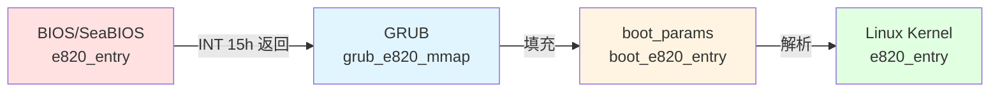
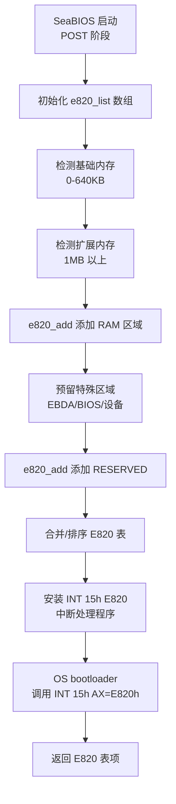
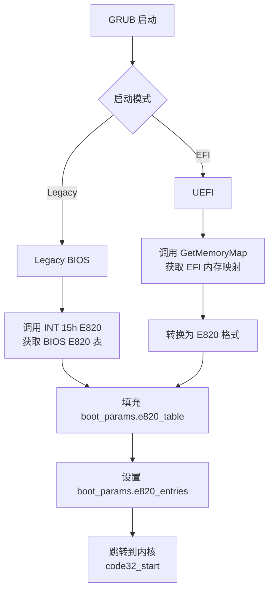
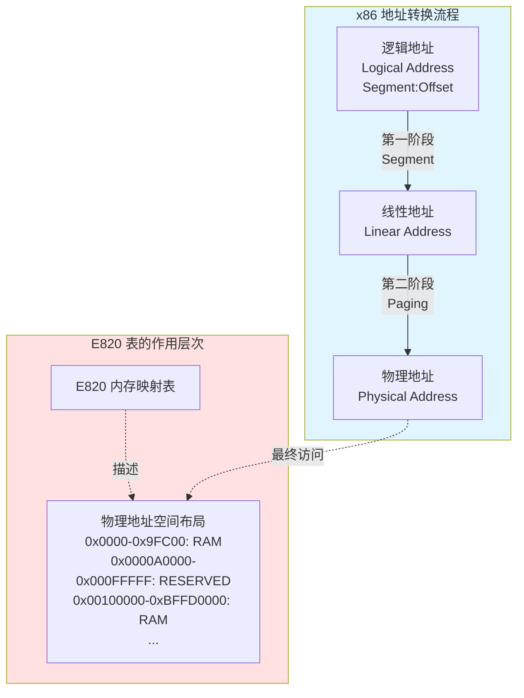
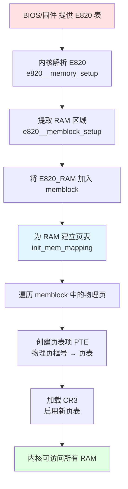

# Linux 内核 setup_arch() 内存接管详解

## 文档定位

本文档涵盖**完整页表建立阶段**（start_kernel → setup_arch）：
- **E820 解析**：如何从 BIOS/UEFI 获取物理内存布局
- **memblock 建立**：早期内存分配器的初始化
- **完整页表建立**：init_mem_mapping() 根据 E820/memblock 为所有 RAM 建立直接映射
- **zone 初始化**：paging_init() 为伙伴系统准备内存 zone

> **页表管理的两个阶段**：
> - **阶段 1：早期页表** - 压缩内核 startup_32/64 构建简单的身份映射页表，详见 [PAGING_PHASE1_THEORY_AND_EARLY_TABLES.md](PAGING_PHASE1_THEORY_AND_EARLY_TABLES.md)
> - **阶段 2：完整页表（本文档）** - setup_arch 中根据 E820/memblock 建立完整的直接映射，替换早期页表

## 代码来源说明

本文档涉及**四个项目**的代码：

| 项目 | 用途 | 源码仓库 |
|------|------|---------|
| **SeaBIOS** | Legacy BIOS 实现（POST、E820 构建） | https://git.seabios.org/seabios.git |
| **GRUB** | 引导加载器（传递 E820 给内核） | https://git.savannah.gnu.org/git/grub.git |
| **EDK2** | UEFI 参考实现（GetMemoryMap） | https://github.com/tianocore/edk2.git |
| **Linux Kernel** | 操作系统内核（E820 解析、页表建立） | https://git.kernel.org/pub/scm/linux/kernel/git/torvalds/linux.git |

所有代码片段都已标注**项目名、文件路径、函数名和行号**（基于 Linux v6.x 内核）。


## 1. 调用顺序概览

`setup_arch()` 中与内存接管相关的主要调用顺序（x86_64，简化）如下：

```
setup_arch()（arch/x86/kernel/setup.c）
    ├─ early_reserve_memory()           // 在加入 memblock 前预留区域
    ├─ e820__memory_setup()             // 解析 E820，填充 e820_table
    ├─ ...（max_pfn、e820__finish_early_params、e820__memblock_setup 前诸多步骤）
    ├─ max_pfn = e820__end_of_ram_pfn()
    ├─ e820__memblock_setup()           // 将 E820 RAM 加入 memblock
    ├─ init_mem_mapping()               // 建立直接映射（内核页表）
    ├─ ...
    ├─ initmem_init()                   // NUMA/memblock 节点（init_64.c）
    ├─ x86_init.paging.pagetable_init() // 实际调用 paging_init()
    └─ ...
```

- **e820**：固件/引导程序提供的物理内存布局（E820 表）。
- **memblock**：早期物理内存分配器，在伙伴系统之前使用。
- **init_mem_mapping**：为物理 RAM 建立内核直接映射（页表），使内核能访问全部可用物理页。
- **paging_init**：在 x86_64 上初始化 sparse 与 zone（sparse_init、zone_sizes_init），为后续伙伴系统做准备。

以下按上述顺序分步说明。

## 2. E820 内存映射表

### 2.1 什么是 E820 表？

**E820 表**（E820 Memory Map）是 x86 架构上描述物理内存布局的标准机制，由 BIOS/固件提供给操作系统。名称来源于 BIOS 中断服务 **INT 15h, AX=E820h**。

**核心作用**：

E820 表告诉操作系统：
1. **哪些物理内存区域是可用 RAM**（可以被内核分配和使用）
2. **哪些区域被保留**（BIOS、设备内存映射、ACPI 表等，不可覆盖）
3. **每个区域的起始地址和大小**

这是内核管理物理内存的**第一步**：在能够使用内存之前，必须先知道有哪些内存可用。

### 2.1.1 E820 表的数据结构层次

E820 表在从 BIOS/固件到内核的传递过程中，经历了**三层数据结构**的转换：



#### 层次 1: BIOS/固件侧的 E820 表项

> **项目**: SeaBIOS
> **文件**: `src/e820map.h`

```c
// SeaBIOS - src/e820map.h
struct e820entry {
    u64 start;      // 物理内存区域起始地址
    u64 size;       // 区域大小（字节）
    u32 type;       // 内存类型（E820_RAM=1, E820_RESERVED=2, ...）
} PACKED;

// SeaBIOS 内部 E820 表（最多 32 项）
#define E820_MAXENTRIES 32
static struct e820entry e820_list[E820_MAXENTRIES];
static int e820_count;
```

#### 层次 2: GRUB 传递给内核的结构（boot_params）

> **项目**: Linux Kernel
> **文件**: `arch/x86/include/uapi/asm/bootparam.h`

```c
// Linux Kernel - arch/x86/include/uapi/asm/bootparam.h

/* E820 表项 - boot_params 中的格式 */
struct boot_e820_entry {
    __u64 addr;     // 起始地址
    __u64 size;     // 大小
    __u32 type;     // 类型
} __attribute__((packed));

/* boot_params 结构（GRUB 填充并传递给内核） */
struct boot_params {
    struct screen_info screen_info;           // 0x000
    // ... 其他字段 ...
    __u8  e820_entries;                       // 0x1e8: E820 条目数量
    // ... 其他字段 ...
    struct boot_e820_entry e820_table[128];   // 0x2d0: E820 表（最多 128 项）
    // ... 其他字段 ...
} __attribute__((packed));
```

**boot_params 内存布局**（关键字段）：

```
Offset   Size    Field
------   ----    -----
0x000    0x040   screen_info (显示信息)
...
0x1e8    0x001   e820_entries (E820 条目数)
...
0x2d0    0xd00   e820_table[128] (E820 表，每项 20 字节)
                 (128 × 20 = 2560 = 0xA00 字节)
...
```

#### 层次 3: Linux 内核全局 E820 表

> **项目**: Linux Kernel
> **文件**: `arch/x86/include/asm/e820/types.h`

```c
// Linux Kernel - arch/x86/include/asm/e820/types.h

/* 单个 E820 表项 */
struct e820_entry {
    u64 addr;       // 起始地址
    u64 size;       // 大小
    enum e820_type type;  // 类型（枚举）
} __attribute__((packed));

/* E820 表（内核全局） */
#define E820_MAX_ENTRIES    (E820_X_MAX + 3 * MAX_NUMNODES)
// E820_X_MAX = 512（可扩展表）

struct e820_table {
    __u32 nr_entries;                  // 实际条目数
    struct e820_entry entries[E820_MAX_ENTRIES];
};

/* 内核维护的三个 E820 表副本 */
extern struct e820_table *e820_table;          // 主表（可修改）
extern struct e820_table *e820_table_kexec;    // kexec 副本
extern struct e820_table *e820_table_firmware; // 固件原始副本（只读）
```

**E820 类型枚举**：

```c
// Linux Kernel - arch/x86/include/asm/e820/types.h
enum e820_type {
    E820_TYPE_RAM       = 1,  // 可用 RAM
    E820_TYPE_RESERVED  = 2,  // 保留区域
    E820_TYPE_ACPI      = 3,  // ACPI 可回收
    E820_TYPE_NVS       = 4,  // ACPI NVS
    E820_TYPE_UNUSABLE  = 5,  // 不可用
    E820_TYPE_PMEM      = 7,  // 持久化内存
    E820_TYPE_PRAM      = 12, // Persistent RAM
    E820_TYPE_SOFT_RESERVED = 0xefffffff, // 软预留
};
```

### 2.1.2 实际的 E820 表内存布局示例

**示例：一个 8GB 系统的 E820 表**（QEMU/KVM 虚拟机）：

```
索引  起始地址            结束地址            大小        类型
---  ----------------  ----------------  ----------  ------------
 0   0x0000_0000       0x0009_FC00       640 KB      RAM (1)
 1   0x0009_FC00       0x000A_0000       1 KB        RESERVED (2)
 2   0x000F_0000       0x0010_0000       64 KB       RESERVED (2)
 3   0x0010_0000       0xBFFD_0000       ~3 GB       RAM (1)
 4   0xBFFD_0000       0xC000_0000       192 KB      RESERVED (2)
 5   0xFEC0_0000       0xFED0_0000       64 KB       RESERVED (2)  ← LAPIC/IOAPIC
 6   0xFEE0_0000       0xFEE0_1000       4 KB        RESERVED (2)  ← LAPIC
 7   0xFFFC_0000       0x1_0000_0000     256 KB      RESERVED (2)  ← BIOS
 8   0x1_0000_0000     0x2_4000_0000     5 GB        RAM (1)       ← 高端内存
```

**内存布局可视化**：

```
4GB 以上 ┌─────────────────────────────────┐ 0x2_4000_0000 (9GB)
         │  RAM (5GB)                      │ E820[8]: RAM
4GB      ├─────────────────────────────────┤ 0x1_0000_0000 (4GB)
         │  BIOS ROM (256KB)               │ E820[7]: RESERVED
         ├─────────────────────────────────┤ 0xFFFC_0000
         │  空洞                            │
         ├─────────────────────────────────┤ 0xFEE0_1000
         │  LAPIC (4KB)                    │ E820[6]: RESERVED
         ├─────────────────────────────────┤ 0xFEE0_0000
         │  空洞                            │
         ├─────────────────────────────────┤ 0xFED0_0000
         │  LAPIC/IOAPIC (64KB)            │ E820[5]: RESERVED
         ├─────────────────────────────────┤ 0xFEC0_0000
         │  空洞                            │
3GB      ├─────────────────────────────────┤ 0xC000_0000
         │  ACPI/BIOS 数据 (192KB)         │ E820[4]: RESERVED
         ├─────────────────────────────────┤ 0xBFFD_0000
         │                                  │
         │  RAM (~3GB)                     │ E820[3]: RAM
         │                                  │
1MB      ├─────────────────────────────────┤ 0x0010_0000
         │  BIOS ROM (64KB)                │ E820[2]: RESERVED
         ├─────────────────────────────────┤ 0x000F_0000
         │  空洞                            │
         ├─────────────────────────────────┤ 0x000A_0000
         │  EBDA (1KB)                     │ E820[1]: RESERVED
640KB    ├─────────────────────────────────┤ 0x0009_FC00
         │  Low RAM (640KB)                │ E820[0]: RAM
0        └─────────────────────────────────┘ 0x0000_0000
```

**关键观察**：
- **碎片化**：可用 RAM 分为 3 段（0-640KB、1MB-3GB、4GB-9GB）
- **空洞**：3GB-4GB 之间是设备内存映射区（MMIO），没有 RAM
- **保留区域**：BIOS ROM、LAPIC、IOAPIC 等占用部分物理地址空间

**常见内存类型**：

| 类型 | 宏定义 | 含义 | 内核如何处理 |
|------|--------|------|--------------|
| 1 | `E820_TYPE_RAM` | 可用 RAM | 加入 memblock，可分配使用 |
| 2 | `E820_TYPE_RESERVED` | 保留区域（BIOS、设备等） | 不加入 memblock，不可使用 |
| 3 | `E820_TYPE_ACPI` | ACPI 可回收内存 | 保留给 ACPI，ACPI 初始化后可回收 |
| 4 | `E820_TYPE_NVS` | ACPI NVS（非易失性存储） | 保留，系统挂起/恢复时需要 |
| 5 | `E820_TYPE_UNUSABLE` | 不可用内存（坏内存块） | 不加入 memblock |

**E820 表示例**（典型的 4GB 系统）：

```
e820 map has 6 items:
  0: 0000000000000000 - 000000000009fc00 = 1 RAM       (640KB: 0-640KB)
  1: 000000000009fc00 - 00000000000a0000 = 2 RESERVED  (1KB: EBDA 区)
  2: 00000000000f0000 - 0000000000100000 = 2 RESERVED  (64KB: BIOS ROM)
  3: 0000000000100000 - 00000000bffd0000 = 1 RAM       (约 3GB: 1MB-3GB)
  4: 00000000bffd0000 - 00000000c0000000 = 2 RESERVED  (192KB: ACPI/BIOS)
  5: 00000000fec00000 - 0000000100000000 = 2 RESERVED  (设备内存映射区)
```

### 2.2 SeaBIOS 如何构建 E820 表

**SeaBIOS** 是开源的 x86 BIOS 实现（常用于 QEMU/KVM），在 POST（Power-On Self-Test）过程中构建 E820 表。

> **项目**: [SeaBIOS](https://www.seabios.org/) - Legacy BIOS 实现
> **源码仓库**: https://git.seabios.org/seabios.git
>
> 关于"BIOS 如何在实模式下探测 4GB 以上内存"的详细解答，请参见文档末尾的**附录 Q1**。

**SeaBIOS 的具体实现**（参考 `src/post.c`）：

```c
// SeaBIOS - src/post.c (POST 阶段，32 位保护模式)
void qemu_preinit(void)
{
    // QEMU 通过 fw_cfg 接口传递内存信息
    qemu_cfg_e820();  // 从 QEMU fw_cfg 读取内存布局
}

void qemu_cfg_e820(void)
{
    // 读取 fw_cfg 中的内存映射信息
    u32 count = qemu_cfg_read_entry_num(QEMU_CFG_E820_TABLE);
    for (i = 0; i < count; i++) {
        struct e820_entry entry;
        qemu_cfg_read(&entry, sizeof(entry));
        e820_add(entry.address, entry.length, entry.type);
    }
}
```

**核心实现文件**（SeaBIOS 项目）：
- `src/e820map.h` - E820 结构定义和类型常量
- `src/e820map.c` - E820 表管理函数
- `src/system.c` - INT 15h E820 BIOS 调用处理程序
- `src/post.c` - POST 过程中添加各类内存区域
- `src/fw/paravirt.c` - 虚拟化平台（QEMU）内存探测

**E820 表构建流程**：



**关键函数分析**：

**1. `e820_add(u64 start, u64 size, u32 type)`** - 添加内存区域

> **项目**: SeaBIOS
> **文件**: `src/e820map.c`
> **函数**: `e820_add()`

```c
// SeaBIOS - src/e820map.c
void e820_add(u64 start, u64 size, u32 type)
{
    // 处理重叠区域，自动合并相同类型的相邻区域，保持列表有序
    // 1. 查找插入位置
    // 2. 分割已存在的重叠区域
    // 3. 移除完全被覆盖的区域
    // 4. 合并相同类型的相邻区域
    // 5. 插入新区域
}
```

**调用示例**：

> **项目**: SeaBIOS
> **文件**: `src/post.c`

```c
// SeaBIOS - src/post.c
// POST 过程中预留 EBDA（Extended BIOS Data Area）
e820_add((u32)ebda, BUILD_LOWRAM_END-(u32)ebda, E820_RESERVED);

// PMM 分配器在 ZoneTmpHigh 分配永久内存时
e820_add(data, size, E820_RESERVED);
```

**2. INT 15h E820 BIOS 调用实现**

> **项目**: SeaBIOS
> **文件**: `src/system.c`
> **函数**: `handle_15e820()`

```c
// SeaBIOS - src/system.c
static void handle_15e820(struct bregs *regs)
{
    int count = GET_GLOBAL(e820_count);

    // 验证调用签名和参数
    if (regs->edx != 0x534D4150    // 'SMAP' 签名
        || regs->bx >= count        // 索引越界
        || regs->ecx < sizeof(e820entry)) {  // 缓冲区太小
        set_code_invalid(regs, RET_EUNSUPPORTED);
        return;
    }

    // 复制第 BX 项 E820 条目到 ES:DI
    memcpy_far(regs->es, (void*)(regs->di+0),
               get_global_seg(), &e820_list[regs->bx],
               sizeof(e820_list[0]));

    // 更新迭代状态
    if (regs->bx == count-1)
        regs->ebx = 0;              // 最后一项，返回 0 表示结束
    else
        regs->ebx++;                // 返回下一项索引

    regs->eax = 0x534D4150;         // 返回 'SMAP' 签名
    regs->ecx = sizeof(e820_list[0]);
    set_success(regs);
}
```

**INT 15h E820 调用约定**（Legacy BIOS 启动时的标准接口）：

```
输入寄存器：
    EAX = 0xE820            // 功能号
    EDX = 0x534D4150        // 'SMAP' ASCII 签名
    EBX = 0                 // 第一次调用为 0，后续使用上次返回值
    ECX = 缓冲区大小         // 至少 20 字节
    ES:DI = 缓冲区指针       // 接收 E820 条目

输出寄存器：
    EAX = 0x534D4150        // 成功时返回签名
    EBX = 下一个条目索引     // 0 表示最后一项
    ECX = 实际写入字节数     // 通常为 20
    CF = 0                  // 成功时清零
```

**SeaBIOS E820 构建的关键点**：

1. **动态构建**：E820 表在 POST 阶段动态构建，根据检测到的内存大小、设备映射等添加条目
2. **自动合并**：`e820_add()` 自动处理重叠区域、合并相邻的同类型区域
3. **类型优先级**：RESERVED 类型优先级高于 RAM，重叠时保留 RESERVED
4. **有序存储**：E820 表按起始地址排序，方便内核遍历

### 2.3 GRUB 如何传递 E820 表

> **项目**: [GNU GRUB](https://www.gnu.org/software/grub/)
> **源码仓库**: https://git.savannah.gnu.org/git/grub.git

**GRUB Legacy BIOS 模式**：通过 INT 15h E820 获取 BIOS 提供的 E820 表，然后传递给 Linux 内核。

**GRUB EFI 模式**：调用 EFI 的 `GetMemoryMap()` 服务获取内存映射，转换为 E820 格式传递给内核。

**核心实现文件**（GRUB 项目）：
- `grub-core/loader/i386/linux.c` - Linux 内核加载器
- `grub-core/mmap/i386/pc/mmap.c` - Legacy BIOS 内存映射获取
- `grub-core/loader/i386/efi/linux.c` - UEFI 模式内核加载器

**GRUB 传递 E820 的流程**：



**GRUB Legacy BIOS 模式实现**：

> **项目**: GRUB
> **文件**: `grub-core/loader/i386/linux.c`
> **函数**: `grub_linux_boot()`

```c
// GRUB - grub-core/loader/i386/linux.c
// grub_linux_boot() 准备启动内核时
static grub_err_t grub_linux_boot(void)
{
    struct linux_kernel_params *params;

    // ... 其他准备工作 ...

    // 填充 E820 内存映射
    ctx.e820_num = 0;
    if (grub_mmap_iterate(grub_linux_boot_mmap_fill, &ctx))
        return grub_errno;

    // 设置 E820 条目数量
    ctx.params->mmap_size = ctx.e820_num;

    // ... 跳转到内核 ...
}

// E820 填充回调函数
static int grub_linux_boot_mmap_fill(grub_uint64_t addr,
                                      grub_uint64_t size,
                                      grub_memory_type_t type,
                                      void *data)
{
    struct linux_boot_ctx *ctx = data;
    struct grub_e820_mmap *e820_entry;

    e820_entry = &ctx->params->e820_map[ctx->e820_num];
    e820_entry->addr = addr;
    e820_entry->size = size;
    e820_entry->type = grub_to_linux_memtype(type);  // 转换类型

    ctx->e820_num++;
    return 0;
}
```

**GRUB 内存类型转换**：

| GRUB 内存类型 | Linux E820 类型 | 说明 |
|--------------|----------------|------|
| `GRUB_MEMORY_AVAILABLE` | `E820_TYPE_RAM` (1) | 可用内存 |
| `GRUB_MEMORY_RESERVED` | `E820_TYPE_RESERVED` (2) | 保留内存 |
| `GRUB_MEMORY_ACPI` | `E820_TYPE_ACPI` (3) | ACPI 表 |
| `GRUB_MEMORY_NVS` | `E820_TYPE_NVS` (4) | ACPI NVS |
| `GRUB_MEMORY_BADRAM` | `E820_TYPE_UNUSABLE` (5) | 坏内存 |

**GRUB EFI 模式特殊处理**：

EFI 提供更详细的内存类型（如 EfiLoaderCode、EfiBootServicesData 等），GRUB 需要将其映射为简化的 E820 类型：

```c
// EFI 内存类型 → E820 类型映射
EfiConventionalMemory     → E820_TYPE_RAM
EfiLoaderCode/Data        → E820_TYPE_RAM
EfiBootServicesCode/Data  → E820_TYPE_RAM (ExitBootServices 后可回收)
EfiRuntimeServicesCode/Data → E820_TYPE_RESERVED
EfiACPIReclaimMemory      → E820_TYPE_ACPI
EfiACPIMemoryNVS          → E820_TYPE_NVS
EfiReservedMemoryType     → E820_TYPE_RESERVED
```

**GRUB 传递 E820 的关键点**：

1. **boot_params 结构**：E820 表存储在 `boot_params.e820_table[]` 数组中（最多 128 项）
2. **条目计数**：`boot_params.e820_entries` 记录实际条目数
3. **地址传递**：GRUB 将 `boot_params` 的物理地址放入 ESI 寄存器，跳转到内核时传递
4. **兼容性**：支持 Legacy BIOS（INT 15h）和 UEFI（GetMemoryMap）两种获取方式

### 2.3.1 UEFI GetMemoryMap() 实现（EDK2）

> **项目**: [EDK II](https://github.com/tianocore/edk2) - UEFI 参考实现
> **源码仓库**: https://github.com/tianocore/edk2.git

UEFI 固件使用 `GetMemoryMap()` 服务提供内存映射，替代传统 BIOS 的 INT 15h E820。

**核心实现文件**（EDK2 项目）：
- `MdeModulePkg/Core/Dxe/Mem/Page.c` - 内存页管理与 GetMemoryMap 实现
- `MdeModulePkg/Core/Dxe/Mem/Pool.c` - 内存池管理
- `MdePkg/Include/Uefi/UefiSpec.h` - UEFI 规范定义（EFI_MEMORY_DESCRIPTOR）

#### GetMemoryMap() 函数接口

> **项目**: EDK2
> **文件**: `MdeModulePkg/Core/Dxe/Mem/Page.c`
> **函数**: `CoreGetMemoryMap()`

```c
// EDK2 - MdeModulePkg/Core/Dxe/Mem/Page.c
/**
  获取当前系统的内存映射

  @param  MemoryMapSize      输入/输出：缓冲区大小
  @param  MemoryMap          输出：内存映射描述符数组
  @param  MapKey             输出：映射键（用于 ExitBootServices）
  @param  DescriptorSize     输出：每个描述符的大小
  @param  DescriptorVersion  输出：描述符版本号

  @retval EFI_SUCCESS            成功获取内存映射
  @retval EFI_BUFFER_TOO_SMALL   缓冲区太小
*/
EFI_STATUS
EFIAPI
CoreGetMemoryMap (
  IN OUT UINTN                  *MemoryMapSize,
  OUT    EFI_MEMORY_DESCRIPTOR  *MemoryMap,
  OUT    UINTN                  *MapKey,
  OUT    UINTN                  *DescriptorSize,
  OUT    UINT32                 *DescriptorVersion
  )
{
  EFI_STATUS  Status;
  UINTN       Size;
  UINTN       BufferSize;
  UINTN       NumberOfEntries;
  LIST_ENTRY  *Link;
  MEMORY_MAP  *Entry;

  // 计算所需缓冲区大小
  Size = sizeof (EFI_MEMORY_DESCRIPTOR);

  // 遍历内存映射链表，统计条目数
  CoreAcquireGcdMemoryLock ();
  NumberOfEntries = 0;
  for (Link = gMemoryMap.ForwardLink; Link != &gMemoryMap; Link = Link->ForwardLink) {
    NumberOfEntries++;
  }

  BufferSize = Size * NumberOfEntries;

  if (*MemoryMapSize < BufferSize) {
    *MemoryMapSize = BufferSize;
    CoreReleaseGcdMemoryLock ();
    return EFI_BUFFER_TOO_SMALL;
  }

  // 填充内存映射描述符
  *MemoryMapSize      = BufferSize;
  *DescriptorSize     = Size;
  *DescriptorVersion  = EFI_MEMORY_DESCRIPTOR_VERSION;

  // 复制内存映射到输出缓冲区
  for (Link = gMemoryMap.ForwardLink; Link != &gMemoryMap; Link = Link->ForwardLink) {
    Entry = CR (Link, MEMORY_MAP, Link, MEMORY_MAP_SIGNATURE);

    MemoryMap->Type          = Entry->Type;
    MemoryMap->PhysicalStart = Entry->Start;
    MemoryMap->VirtualStart  = Entry->VirtualStart;
    MemoryMap->NumberOfPages = RShiftU64 (Entry->End - Entry->Start + 1, EFI_PAGE_SHIFT);
    MemoryMap->Attribute     = Entry->Attribute;

    MemoryMap = NEXT_MEMORY_DESCRIPTOR (MemoryMap, Size);
  }

  *MapKey = mMemoryMapKey;
  CoreReleaseGcdMemoryLock ();

  return EFI_SUCCESS;
}
```

#### EFI 内存类型定义

> **项目**: EDK2
> **文件**: `MdePkg/Include/Uefi/UefiSpec.h`

```c
// EDK2 - MdePkg/Include/Uefi/UefiSpec.h
typedef enum {
  EfiReservedMemoryType,      // 0: 保留，不可使用
  EfiLoaderCode,              // 1: 引导加载器代码
  EfiLoaderData,              // 2: 引导加载器数据
  EfiBootServicesCode,        // 3: Boot Services 代码
  EfiBootServicesData,        // 4: Boot Services 数据
  EfiRuntimeServicesCode,     // 5: Runtime Services 代码（不可回收）
  EfiRuntimeServicesData,     // 6: Runtime Services 数据（不可回收）
  EfiConventionalMemory,      // 7: 可用内存
  EfiUnusableMemory,          // 8: 不可用内存（错误）
  EfiACPIReclaimMemory,       // 9: ACPI 表（可回收）
  EfiACPIMemoryNVS,           // 10: ACPI NVS（不可回收）
  EfiMemoryMappedIO,          // 11: MMIO
  EfiMemoryMappedIOPortSpace, // 12: MMIO 端口空间
  EfiPalCode,                 // 13: PAL 代码
  EfiPersistentMemory,        // 14: 持久化内存
  EfiMaxMemoryType
} EFI_MEMORY_TYPE;

typedef struct {
  UINT32                Type;           // 内存类型
  EFI_PHYSICAL_ADDRESS  PhysicalStart;  // 物理起始地址
  EFI_VIRTUAL_ADDRESS   VirtualStart;   // 虚拟起始地址（SetVirtualAddressMap 后）
  UINT64                NumberOfPages;  // 页数（每页 4KB）
  UINT64                Attribute;      // 内存属性（可缓存、可写等）
} EFI_MEMORY_DESCRIPTOR;
```

#### GRUB UEFI 模式如何使用 GetMemoryMap

> **项目**: GRUB
> **文件**: `grub-core/loader/i386/efi/linux.c`

```c
// GRUB - grub-core/loader/i386/efi/linux.c
// GRUB 在 UEFI 模式下获取内存映射并转换为 E820
static grub_err_t
grub_linux_boot (void)
{
  grub_efi_uintn_t mmap_size = 0;
  grub_efi_uintn_t desc_size;
  grub_efi_uint32_t desc_version;
  grub_efi_memory_descriptor_t *mmap_buf = NULL;

  // 第一次调用：获取所需缓冲区大小
  grub_efi_get_memory_map (&mmap_size, mmap_buf, NULL, &desc_size, &desc_version);

  // 分配缓冲区
  mmap_buf = grub_malloc (mmap_size);

  // 第二次调用：实际获取内存映射
  grub_efi_get_memory_map (&mmap_size, mmap_buf, NULL, &desc_size, &desc_version);

  // 转换 EFI Memory Map 为 E820 格式
  grub_efi_memory_descriptor_t *desc;
  for (desc = mmap_buf;
       (grub_uint8_t *) desc < (grub_uint8_t *) mmap_buf + mmap_size;
       desc = NEXT_MEMORY_DESCRIPTOR (desc, desc_size))
  {
    grub_uint64_t start = desc->physical_start;
    grub_uint64_t size = desc->num_pages << 12;  // 页数 × 4KB
    grub_uint32_t type;

    // 转换 EFI 类型到 E820 类型
    switch (desc->type) {
      case GRUB_EFI_CONVENTIONAL_MEMORY:
      case GRUB_EFI_LOADER_CODE:
      case GRUB_EFI_LOADER_DATA:
      case GRUB_EFI_BOOT_SERVICES_CODE:
      case GRUB_EFI_BOOT_SERVICES_DATA:
        type = E820_TYPE_RAM;
        break;
      case GRUB_EFI_ACPI_RECLAIM_MEMORY:
        type = E820_TYPE_ACPI;
        break;
      case GRUB_EFI_ACPI_MEMORY_NVS:
        type = E820_TYPE_NVS;
        break;
      default:
        type = E820_TYPE_RESERVED;
        break;
    }

    // 添加到 boot_params.e820_table
    add_e820_entry (start, size, type);
  }

  grub_free (mmap_buf);
}
```

#### EFI vs E820 内存类型映射

| EFI 内存类型 | E820 类型 | 说明 |
|-------------|----------|------|
| `EfiConventionalMemory` | `E820_TYPE_RAM` (1) | 可用内存 |
| `EfiLoaderCode/Data` | `E820_TYPE_RAM` (1) | 引导加载器，OS 可回收 |
| `EfiBootServicesCode/Data` | `E820_TYPE_RAM` (1) | Boot Services，ExitBootServices 后可回收 |
| `EfiRuntimeServicesCode/Data` | `E820_TYPE_RESERVED` (2) | Runtime Services，OS 不可回收 |
| `EfiACPIReclaimMemory` | `E820_TYPE_ACPI` (3) | ACPI 表，ACPI 初始化后可回收 |
| `EfiACPIMemoryNVS` | `E820_TYPE_NVS` (4) | ACPI NVS，挂起/恢复时需要 |
| `EfiMemoryMappedIO` | `E820_TYPE_RESERVED` (2) | MMIO，不映射 |
| `EfiUnusableMemory` | `E820_TYPE_UNUSABLE` (5) | 坏内存 |

**关键差异**：

1. **UEFI 更详细**：EFI 内存类型更细粒度（14 种 vs E820 的 5 种主要类型）
2. **可回收内存**：EFI 明确区分 BootServices（可回收）和 RuntimeServices（不可回收）
3. **属性位**：EFI_MEMORY_DESCRIPTOR 包含属性位（cacheable、write-protect 等）

### 2.4 Linux 内核接收和使用 E820 表

> **项目**: [Linux Kernel](https://www.kernel.org/)
> **源码仓库**: https://git.kernel.org/pub/scm/linux/kernel/git/torvalds/linux.git

**核心文件**（Linux 内核）：
- `arch/x86/kernel/setup.c` - x86 架构初始化，调用 `e820__memory_setup()`
- `arch/x86/kernel/e820.c` - E820 内存映射表管理

**接收流程**：

> Linux 内核无论从 BIOS 还是 UEFI 启动，都通过统一的 `e820__memory_setup()` 接口接收内存映射。
>
> 详细的接收逻辑、统一接口设计图和 BIOS/UEFI 路径对比，请参见文档末尾的**附录 Q4**。

**内核使用 E820 表的关键步骤**：

1. **e820__memory_setup()**：解析并记录物理内存布局到 `e820_table`
2. **max_pfn 计算**：`e820__end_of_ram_pfn()` 扫描 E820_TYPE_RAM 区域，计算最大页帧号
3. **e820__memblock_setup()**：将 E820_TYPE_RAM 区域加入 memblock 分配器
4. **init_mem_mapping()**：为 RAM 区域建立内核直接映射页表
5. **paging_init()**：基于 E820 和 memblock 初始化内存 zone

**E820 类型处理**：

> **项目**: Linux Kernel
> **文件**: `arch/x86/kernel/e820.c:1242`
> **函数**: `e820__memblock_setup()`

```c
// Linux Kernel - arch/x86/kernel/e820.c:1242
void __init e820__memblock_setup(void)
{
    int i;
    for (i = 0; i < e820_table->nr_entries; i++) {
        struct e820_entry *entry = &e820_table->entries[i];
        u64 start = entry->addr;
        u64 end = start + entry->size;

        if (entry->type != E820_TYPE_RAM)
            continue;  // 只处理 RAM 类型

        // 加入 memblock 可分配区域
        memblock_add(start, entry->size);
    }

    // E820_TYPE_SOFT_RESERVED 需要预留
    for (i = 0; i < e820_table->nr_entries; i++) {
        if (entry->type == E820_TYPE_SOFT_RESERVED)
            memblock_reserve(entry->addr, entry->size);
    }
}
```

**E820 表的三个副本**：

| 变量 | 用途 |
|------|------|
| `e820_table` | 主副本，内核运行时可能被修改（添加保留区域等） |
| `e820_table_firmware` | 固件原始副本，保持不变，用于查询固件提供的原始布局 |
| `e820_table_kexec` | kexec 副本，用于 kexec 重启时传递给新内核 |

**要点**：

- E820 表是内核获知物理内存布局的**唯一来源**（Legacy BIOS 模式）
- 只有 `E820_TYPE_RAM` 会被加入 memblock 供内核分配使用
- E820 表在后续阶段可能被修改（如添加内核镜像保留区、initrd 保留区等）
- `e820__memory_setup()` 只负责"解析并记录"物理内存布局，尚未建立 memblock 或页表

### 2.5 E820 表与 Paging/Segment 的关系

#### E820 描述的是什么地址空间？

**E820 表描述的是物理地址空间（Physical Address Space）**，与虚拟地址转换机制（Segment、Paging）处于不同层次。



#### E820 表与 Segment（分段）的关系：**无直接关系**

**为什么无关？**

1. **Segment 作用于地址转换的第一阶段**：
   - Segment 将**逻辑地址**（段:偏移）转换为**线性地址**
   - 在 Flat Model 下，段基址为 0，逻辑地址 = 线性地址
   - Segment 处理的是虚拟地址空间的**访问方式**，不关心物理内存布局

2. **E820 描述物理地址空间**：
   - E820 告诉 OS："物理地址 0x100000-0xBFFD0000 是可用 RAM"
   - 这个信息与你用什么段选择子、段基址来访问无关
   - 即使在实模式下用 `segment:offset` 访问，E820 描述的仍然是最终的物理地址

**示例**：

```
实模式访问：DS=0x1000, offset=0x5000
    → 线性地址 = 0x1000 * 16 + 0x5000 = 0x15000
    → 物理地址 = 0x15000（实模式无分页）

E820 告诉我们：物理地址 0x15000 是否是可用 RAM？
    → 与你用哪个段寄存器、段基址多少无关
```

**结论**：E820 表与 Segment 机制处于不同层次，**无直接依赖关系**。

---

#### E820 表与 Paging（分页）的关系：**强依赖关系**

**E820 是 Paging 的数据来源**：分页机制需要知道"应该为哪些物理地址建立页表映射"，这个信息来自 E820 表。

**依赖关系流程**：



**为什么 Paging 依赖 E820？**

| 问题 | E820 的作用 | 如果没有 E820 会怎样？ |
|------|------------|---------------------|
| **页表应该映射哪些物理地址？** | E820_TYPE_RAM 告诉内核哪些物理地址是可用内存 | 内核不知道哪些物理地址可以安全访问，可能映射到设备内存或保留区域导致崩溃 |
| **哪些物理地址不应该映射？** | E820_TYPE_RESERVED 标记了 BIOS、设备等保留区域 | 内核可能覆盖 BIOS 数据或设备内存映射区，导致系统故障 |
| **设备内存需要特殊映射吗？** | E820 区分 RAM 和设备内存 | 内核可能用普通的 cached 映射访问设备内存，导致数据不一致 |
| **物理内存有多大？** | E820 扫描所有 RAM 区域得到 max_pfn | 内核不知道物理内存大小，无法正确初始化内存管理 |

**实际代码中的依赖**（`arch/x86/mm/init.c:init_mem_mapping()`）：

```c
void __init init_mem_mapping(void)
{
    unsigned long end;

    // 从 E820 获取物理内存范围
    end = max_pfn << PAGE_SHIFT;  // max_pfn 来自 e820__end_of_ram_pfn()

    // 为 E820 中的 RAM 区域建立直接映射
    // 内部通过遍历 memblock（来自 E820）建立页表
    memory_map_bottom_up(ISA_END_ADDRESS, end);

    // 加载新页表
    load_cr3(swapper_pg_dir);
    __flush_tlb_all();
}
```

**具体依赖点**：

1. **`max_pfn` 计算**（`arch/x86/kernel/e820.c`）：
   ```c
   unsigned long __init e820__end_of_ram_pfn(void)
   {
       unsigned long max_pfn = 0;
       for (i = 0; i < e820_table->nr_entries; i++) {
           struct e820_entry *entry = &e820_table->entries[i];

           if (entry->type != E820_TYPE_RAM)  // 只考虑 RAM 区域
               continue;

           unsigned long pfn = (entry->addr + entry->size) >> PAGE_SHIFT;
           if (pfn > max_pfn)
               max_pfn = pfn;
       }
       return max_pfn;
   }
   ```

2. **`init_mem_mapping()` 建立映射**：
   - 只为 E820_TYPE_RAM 区域建立常规的 cacheable 页表映射
   - E820_TYPE_RESERVED 区域不建立映射，或在需要时建立特殊映射（uncached）

3. **`memblock` 作为中介**：
   ```
   E820 表（物理内存布局描述）
       ↓
   memblock（早期内存分配器，记录可用物理页）
       ↓
   页表（为 memblock 中的物理页建立线性地址映射）
   ```

#### 详细代码分析：E820 如何驱动 Paging

**完整调用链**：

```
setup_arch()                          [arch/x86/kernel/setup.c]
    ├─ e820__memory_setup()           → 解析 E820 到 e820_table
    ├─ max_pfn = e820__end_of_ram_pfn() → 扫描 E820_RAM 计算最大 PFN
    ├─ e820__memblock_setup()         → 将 E820_RAM 加入 memblock
    └─ init_mem_mapping()             [arch/x86/mm/init.c]
            ├─ memory_map_bottom_up() 或 memory_map_top_down()
            │   └─ init_range_memory_mapping()
            │       └─ init_memory_mapping(start, end, PAGE_KERNEL)
            │           └─ kernel_physical_mapping_init()  [arch/x86/mm/init_64.c]
            │               ├─ 遍历 PML4/PDPT/PD/PT 级别
            │               ├─ 根据 E820 类型设置页表属性
            │               └─ 填充页表项（物理页框号 + 属性位）
            ├─ load_cr3(swapper_pg_dir)
            └─ __flush_tlb_all()
```

**1. `e820__end_of_ram_pfn()` - 从 E820 计算物理内存大小**

> **项目**: Linux Kernel
> **文件**: `arch/x86/kernel/e820.c:1422`

```c
// Linux Kernel - arch/x86/kernel/e820.c:1422
unsigned long __init e820__end_of_ram_pfn(void)
{
    return e820_end_pfn(MAX_ARCH_PFN, E820_TYPE_RAM);
}

static unsigned long __init e820_end_pfn(unsigned long limit_pfn,
                                          enum e820_type type)
{
    int i;
    unsigned long max_pfn = 0;
    struct e820_table *e820 = e820_table;

    // 遍历 E820 表
    for (i = 0; i < e820->nr_entries; i++) {
        struct e820_entry *entry = &e820->entries[i];
        unsigned long start_pfn;
        unsigned long end_pfn;

        // 只处理指定类型（E820_TYPE_RAM）
        if (entry->type != type)
            continue;

        start_pfn = entry->addr >> PAGE_SHIFT;
        end_pfn = (entry->addr + entry->size) >> PAGE_SHIFT;

        // 限制在架构支持的最大 PFN 内
        if (start_pfn >= limit_pfn)
            continue;
        if (end_pfn > limit_pfn)
            end_pfn = limit_pfn;

        // 找到最大的结束页帧号
        if (end_pfn > max_pfn)
            max_pfn = end_pfn;
    }

    return max_pfn;
}
```

**关键点**：
- 只扫描 `E820_TYPE_RAM` 类型的条目
- 将物理地址转换为页帧号（`>> PAGE_SHIFT`，即除以 4096）
- `max_pfn` 决定了内核需要管理的物理内存范围

**2. `e820__memblock_setup()` - 将 E820 RAM 导入 memblock**

源码：`arch/x86/kernel/e820.c`

```c
void __init e820__memblock_setup(void)
{
    int i;
    u64 end;

    // 第一遍：添加所有可用 RAM 到 memblock
    for (i = 0; i < e820_table->nr_entries; i++) {
        struct e820_entry *entry = &e820_table->entries[i];

        end = entry->addr + entry->size;

        // 只处理 RAM 类型
        if (entry->type != E820_TYPE_RAM)
            continue;

        // 忽略低于 1MB 的内存（通常已被使用）
        if (entry->addr >= end)
            continue;

        // 将 RAM 区域加入 memblock.memory
        memblock_add(entry->addr, entry->size);
    }

    // 第二遍：标记软预留区域（pmem 等）
    for (i = 0; i < e820_table->nr_entries; i++) {
        struct e820_entry *entry = &e820_table->entries[i];

        if (entry->type == E820_TYPE_SOFT_RESERVED)
            memblock_reserve(entry->addr, entry->size);
    }

    // 设置 memblock 的分配限制（在页表建立前只能分配低端内存）
    memblock_set_current_limit(ISA_END_ADDRESS);
}
```

**关键点**：
- `memblock_add()` 将物理内存区域添加到 `memblock.memory` 列表
- 只有 `E820_TYPE_RAM` 会被添加，其他类型（RESERVED、ACPI 等）不加入
- `memblock_reserve()` 标记已占用的内存（不可分配，但仍在 memblock.memory 中）
- 此时只记录了"哪里有 RAM"，还未建立页表

**3. `init_mem_mapping()` - 为 RAM 建立直接映射**

> **项目**: Linux Kernel
> **文件**: `arch/x86/mm/init.c:758`

```c
// Linux Kernel - arch/x86/mm/init.c:758
void __init init_mem_mapping(void)
{
    unsigned long end;

    pti_check_boottime_disable();      // Page Table Isolation 检查
    probe_page_size_mask();             // 探测支持的页大小（4K/2M/1G）

    setup_pcid();                       // Process Context ID

    // 从 max_pfn 计算物理内存末尾地址
    end = max_pfn << PAGE_SHIFT;

#ifdef CONFIG_X86_64
    end = max_pfn_mapped << PAGE_SHIFT;
#endif

    /* 第一阶段：映射 ISA 区域（0-1MB） */
    init_memory_mapping(0, ISA_END_ADDRESS, PAGE_KERNEL_IO);

    /* 第二阶段：初始化 trampoline（实模式切换区域） */
    init_trampoline();

    /*
     * 第三阶段：映射整个物理 RAM
     * 选择自底向上或自顶向下映射策略
     */
    if (memblock_bottom_up()) {
        unsigned long kernel_end = __pa_symbol(_end);

        // 自底向上：先映射内核之后的区域，再映射内核之前的区域
        // 优点：页表分配在内核之后，避免碎片
        memory_map_bottom_up(kernel_end, end);
        memory_map_bottom_up(ISA_END_ADDRESS, kernel_end);
    } else {
        // 自顶向下：从高地址向低地址映射
        memory_map_top_down(ISA_END_ADDRESS, end);
    }

    // 如果支持 5 级页表，调整映射
#ifdef CONFIG_X86_5LEVEL
    if (pgtable_l5_enabled())
        init_trampoline_pgt_l5();
#endif

    // 加载新的页表基址并刷新 TLB
    load_cr3(swapper_pg_dir);
    __flush_tlb_all();

    // 放宽 memblock 分配限制（现在可以分配高端内存了）
    x86_init.hyper.init_after_bootmem();
    memblock_set_current_limit(ISA_END_ADDRESS);

    // 输出映射信息
    early_memtest(0, max_pfn_mapped << PAGE_SHIFT);
}
```

**4. `kernel_physical_mapping_init()` - 实际创建页表项**

> **项目**: Linux Kernel
> **文件**: `arch/x86/mm/init_64.c` (函数较长，包含多个辅助函数)

```c
// Linux Kernel - arch/x86/mm/init_64.c
/*
 * 为给定的物理地址区域创建页表映射
 * start, end: 物理地址范围
 * prot: 页表保护位（PAGE_KERNEL、PAGE_KERNEL_NOCACHE 等）
 */
unsigned long __meminit
kernel_physical_mapping_init(unsigned long paddr_start,
                              unsigned long paddr_end,
                              unsigned long page_size_mask,
                              pgprot_t prot)
{
    bool pgd_changed = false;
    unsigned long vaddr, vaddr_start, vaddr_end, vaddr_next, paddr_next;
    unsigned long paddr_last = paddr_end;
    pgd_t *pgd;
    p4d_t *p4d;
    pud_t *pud;
    pmd_t *pmd;
    pte_t *pte;

    // 转换为虚拟地址（直接映射区域）
    vaddr = (unsigned long)__va(paddr_start);
    vaddr_end = (unsigned long)__va(paddr_end);
    vaddr_start = vaddr;

    // 遍历 PGD 级别
    for (; vaddr < vaddr_end; vaddr = vaddr_next) {
        pgd = pgd_offset_k(vaddr);
        vaddr_next = (vaddr & PGDIR_MASK) + PGDIR_SIZE;

        if (pgd_val(*pgd)) {
            p4d = (p4d_t *)pgd_page_vaddr(*pgd);
            paddr_next = phys_p4d_init(p4d, paddr, paddr_end,
                                        page_size_mask, prot);
            continue;
        }

        // 分配新的 P4D 表
        p4d = alloc_low_page();
        paddr_next = phys_p4d_init(p4d, paddr, paddr_end,
                                    page_size_mask, prot);

        spin_lock(&init_mm.page_table_lock);
        // 设置 PGD 条目指向 P4D 表
        pgd_populate(&init_mm, pgd, p4d);
        spin_unlock(&init_mm.page_table_lock);
        pgd_changed = true;
    }

    if (pgd_changed)
        sync_global_pgds(vaddr_start, vaddr_end - 1);

    return paddr_last;
}

// P4D 级别初始化
static unsigned long __meminit
phys_p4d_init(p4d_t *p4d_page, unsigned long paddr,
               unsigned long paddr_end,
               unsigned long page_size_mask,
               pgprot_t prot)
{
    unsigned long paddr_next, paddr_last = paddr_end;
    unsigned long vaddr = (unsigned long)__va(paddr);
    int i = p4d_index(vaddr);

    // 遍历 P4D 条目
    for (; i < PTRS_PER_P4D; i++, paddr = paddr_next) {
        p4d_t *p4d = p4d_page + i;
        pud_t *pud;

        vaddr = (unsigned long)__va(paddr);
        paddr_next = (paddr & P4D_MASK) + P4D_SIZE;

        if (paddr >= paddr_end) {
            // 超出范围，清零剩余条目
            if (!after_bootmem &&
                !p4d_none(*p4d) && pud_page_vaddr(*p4d))
                free_pud_table(pud_page_vaddr(*p4d), p4d);
            continue;
        }

        if (!p4d_none(*p4d)) {
            pud = pud_offset(p4d, 0);
            paddr_last = phys_pud_init(pud, paddr, paddr_end,
                                        page_size_mask, prot);
            continue;
        }

        // 分配新的 PUD 表
        pud = alloc_low_page();
        paddr_last = phys_pud_init(pud, paddr, paddr_end,
                                    page_size_mask, prot);

        spin_lock(&init_mm.page_table_lock);
        p4d_populate(&init_mm, p4d, pud);
        spin_unlock(&init_mm.page_table_lock);
    }

    return paddr_last;
}

// PUD 级别初始化（可能使用 1GB 大页）
static unsigned long __meminit
phys_pud_init(pud_t *pud_page, unsigned long paddr,
               unsigned long paddr_end,
               unsigned long page_size_mask,
               pgprot_t prot)
{
    unsigned long pages = 0, paddr_next;
    unsigned long paddr_last = paddr_end;
    unsigned long vaddr = (unsigned long)__va(paddr);
    int i = pud_index(vaddr);

    for (; i < PTRS_PER_PUD; i++, paddr = paddr_next) {
        pud_t *pud = pud_page + i;
        pmd_t *pmd;
        pgprot_t prot_pud = prot;

        vaddr = (unsigned long)__va(paddr);
        paddr_next = (paddr & PUD_MASK) + PUD_SIZE;

        if (paddr >= paddr_end) {
            // 超出范围，清理
            if (!after_bootmem &&
                !pud_none(*pud) && pmd_page_vaddr(*pud))
                free_pmd_table(pmd_page_vaddr(*pud), pud);
            continue;
        }

        // 尝试使用 1GB 大页（如果支持且对齐）
        if (direct_gbpages &&
            (page_size_mask & (1 << PG_LEVEL_1G)) &&
            IS_ALIGNED(paddr, PUD_SIZE) &&
            IS_ALIGNED(paddr_next, PUD_SIZE)) {

            // 设置 PUD 直接映射 1GB 物理页
            set_pud(pud, __pud(paddr | pgprot_val(prot_pud) | _PAGE_PSE));
            pages++;
            paddr_last = paddr_next;
            continue;
        }

        // 否则使用 PMD 级别（2MB 或 4KB 页）
        if (!pud_none(*pud)) {
            pmd = pmd_offset(pud, 0);
            paddr_last = phys_pmd_init(pmd, paddr, paddr_end,
                                        page_size_mask, prot);
            continue;
        }

        pmd = alloc_low_page();
        paddr_last = phys_pmd_init(pmd, paddr, paddr_end,
                                    page_size_mask, prot);

        spin_lock(&init_mm.page_table_lock);
        pud_populate(&init_mm, pud, pmd);
        spin_unlock(&init_mm.page_table_lock);
    }

    return paddr_last;
}

// PMD 级别初始化（可能使用 2MB 大页）
static unsigned long __meminit
phys_pmd_init(pmd_t *pmd_page, unsigned long paddr,
               unsigned long paddr_end,
               unsigned long page_size_mask,
               pgprot_t prot)
{
    unsigned long pages = 0, paddr_next;
    unsigned long paddr_last = paddr_end;

    int i = pmd_index((unsigned long)__va(paddr));

    for (; i < PTRS_PER_PMD; i++, paddr = paddr_next) {
        pmd_t *pmd = pmd_page + i;
        pte_t *pte;
        pgprot_t prot_pmd = prot;

        paddr_next = (paddr & PMD_MASK) + PMD_SIZE;

        if (paddr >= paddr_end) {
            if (!after_bootmem &&
                !pmd_none(*pmd) && pte_page_vaddr(*pmd))
                free_pte_table(pte_page_vaddr(*pmd), pmd);
            continue;
        }

        // 尝试使用 2MB 大页
        if (page_size_mask & (1 << PG_LEVEL_2M) &&
            IS_ALIGNED(paddr, PMD_SIZE) &&
            IS_ALIGNED(paddr_next, PMD_SIZE)) {

            // 设置 PMD 直接映射 2MB 物理页
            set_pmd(pmd, __pmd(paddr | pgprot_val(prot_pmd) | _PAGE_PSE));
            pages++;
            paddr_last = paddr_next;
            continue;
        }

        // 否则使用 PTE 级别（4KB 页）
        if (!pmd_none(*pmd)) {
            pte = pte_offset_kernel(pmd, 0);
            paddr_last = phys_pte_init(pte, paddr, paddr_end, prot);
            continue;
        }

        pte = alloc_low_page();
        paddr_last = phys_pte_init(pte, paddr, paddr_end, prot);

        spin_lock(&init_mm.page_table_lock);
        pmd_populate_kernel(&init_mm, pmd, pte);
        spin_unlock(&init_mm.page_table_lock);
    }

    return paddr_last;
}

// PTE 级别初始化（4KB 页）
static unsigned long __meminit
phys_pte_init(pte_t *pte_page, unsigned long paddr,
               unsigned long paddr_end,
               pgprot_t prot)
{
    unsigned long pages = 0;
    unsigned long paddr_last = paddr_end;
    unsigned long paddr_next;
    int i = pte_index((unsigned long)__va(paddr));

    for (; i < PTRS_PER_PTE; i++, paddr = paddr_next) {
        pte_t *pte = pte_page + i;

        paddr_next = (paddr & PAGE_MASK) + PAGE_SIZE;

        if (paddr >= paddr_end) {
            if (!after_bootmem &&
                !pte_none(*pte))
                set_pte(pte, __pte(0));
            continue;
        }

        // 设置 PTE 映射 4KB 物理页
        // paddr: 物理页框号
        // pgprot_val(prot): 页表属性位（Present、Writable、Cacheable 等）
        set_pte(pte, pfn_pte(paddr >> PAGE_SHIFT, prot));
        pages++;
        paddr_last = paddr_next;
    }

    return paddr_last;
}
```

**关键代码分析**：

1. **从 E820 获取物理地址范围**：
   ```c
   end = max_pfn << PAGE_SHIFT;  // max_pfn 来自 e820__end_of_ram_pfn()
   ```

2. **只为 memblock.memory 中的区域建立映射**（memblock 来自 E820_TYPE_RAM）：
   ```c
   memory_map_bottom_up(ISA_END_ADDRESS, end);
   // 内部会调用 for_each_memblock(memory, reg) 遍历
   ```

3. **页表属性根据内存类型设置**：
   ```c
   // RAM 区域：cacheable, writable
   init_memory_mapping(start, end, PAGE_KERNEL);
   // PAGE_KERNEL = _PAGE_PRESENT | _PAGE_RW | _PAGE_ACCESSED | _PAGE_DIRTY

   // 设备 MMIO：uncached, writable
   ioremap(phys_addr, size);  // 使用 PAGE_KERNEL_IO
   // PAGE_KERNEL_IO = _PAGE_PRESENT | _PAGE_RW | _PAGE_PCD | _PAGE_PWT
   ```

4. **页表项的实际填充**：
   ```c
   // PTE 级别
   set_pte(pte, pfn_pte(paddr >> PAGE_SHIFT, prot));
   // 展开为：
   // pte->pte = (物理页框号 << 12) | 属性位
   //         = 0x00100000 | (_PAGE_PRESENT|_PAGE_RW|_PAGE_ACCESSED|...)
   ```

**5. 设备内存的特殊映射 - `ioremap()`**

源码：`arch/x86/mm/ioremap.c`

```c
/*
 * ioremap - 将设备物理地址映射到内核虚拟地址空间
 * phys_addr: 设备物理地址（如 0xFEC00000 - LAPIC 基址）
 * size: 映射大小
 * 返回：内核虚拟地址指针
 */
void __iomem *ioremap(resource_size_t phys_addr, unsigned long size)
{
    // 对于设备 MMIO，使用 uncached 映射
    return __ioremap_caller(phys_addr, size,
                            IORES_MAP_SYSTEM_RAM | IORES_MAP_ENCRYPTED,
                            PAGE_KERNEL_IO,
                            __builtin_return_address(0),
                            false);
}

static void __iomem *
__ioremap_caller(resource_size_t phys_addr, unsigned long size,
                 enum page_cache_mode pcm, pgprot_t prot,
                 void *caller, bool encrypted)
{
    unsigned long offset, vaddr;
    resource_size_t last_addr;
    const resource_size_t unaligned_phys_addr = phys_addr;
    const unsigned long unaligned_size = size;
    struct vm_struct *area;
    pgprot_t new_prot;
    int retval;

    // 检查是否在 E820 表中
    // 如果是 E820_TYPE_RAM，警告（不应该用 ioremap 映射 RAM）
    if (iores_map_check(phys_addr, size) != IORES_MAP_SYSTEM_RAM_OK) {
        WARN_ONCE(1, "ioremap on RAM at %pa - %pa\n",
                  &phys_addr, &last_addr);
        return NULL;
    }

    // 页对齐
    offset = phys_addr & ~PAGE_MASK;
    phys_addr &= PAGE_MASK;
    size = PAGE_ALIGN(last_addr + 1) - phys_addr;

    // 在内核虚拟地址空间中分配区域（vmalloc 区域）
    area = get_vm_area_caller(size, VM_IOREMAP, caller);
    if (!area)
        return NULL;
    area->phys_addr = phys_addr;
    vaddr = (unsigned long)area->addr;

    // 设置页表属性为 uncached
    new_prot = pgprot_noncached(prot);

    // 创建页表映射（uncached）
    if (ioremap_page_range(vaddr, vaddr + size, phys_addr, new_prot)) {
        free_vm_area(area);
        return NULL;
    }

    return (void __iomem *)(vaddr + offset);
}
```

**关键点**：
- `ioremap()` 检查物理地址是否在 E820_TYPE_RAM 区域，如果是则警告
- 设备内存必须用 `uncached` 属性映射（`PAGE_KERNEL_IO`）
- 映射到 vmalloc 区域，不是直接映射区域
- 页表属性：`_PAGE_PCD | _PAGE_PWT`（Cache Disable + Write Through）

**E820 影响的页表属性**：

| E820 类型 | 是否映射？ | 页表属性 | 用途 |
|----------|----------|---------|------|
| `E820_TYPE_RAM` | ✅ 是 | Cacheable, Write-back | 内核直接映射，可分配使用 |
| `E820_TYPE_RESERVED` | ❌ 否 | - | BIOS/设备保留，不映射到内核地址空间 |
| `E820_TYPE_ACPI` | ⚠️ 按需 | Cacheable | ACPI 表，需要时临时映射 |
| `E820_TYPE_NVS` | ⚠️ 按需 | Uncached | ACPI NVS，需要时映射为 uncached |
| 设备 MMIO | ⚠️ 按需 | Uncached, Write-combining | 驱动通过 ioremap 映射，必须 uncached |

**关键示例：为什么内核不能盲目映射所有物理地址？**

假设一个系统的物理地址空间：

```
0x00000000 - 0x0009FC00: RAM (640KB)           ← E820_TYPE_RAM，应该映射
0x000A0000 - 0x000FFFFF: 设备/BIOS ROM (384KB) ← E820_TYPE_RESERVED，不应该映射
0x00100000 - 0xBFFD0000: RAM (约 3GB)          ← E820_TYPE_RAM，应该映射
0xBFFD0000 - 0xC0000000: ACPI tables (192KB)   ← E820_TYPE_ACPI，按需映射
0xFEC00000 - 0xFED00000: LAPIC/IOAPIC          ← E820_TYPE_RESERVED，驱动用 ioremap
```

如果内核不查看 E820，直接为所有物理地址建立 cacheable 映射：

- ❌ **0x000A0000-0x000FFFFF**：这是 VGA 显存和 BIOS ROM，用 cached 映射会导致数据不一致
- ❌ **0xFEC00000-0xFED00000**：这是 LAPIC/IOAPIC 寄存器，必须用 uncached 映射
- ❌ **未知的保留区域**：可能触发 machine check exception

**正确做法**（基于 E820）：
```c
// init_mem_mapping() 只映射 E820_TYPE_RAM
for_each_memblock(memory, reg) {  // memblock 来自 E820
    unsigned long start = reg->base;
    unsigned long end = start + reg->size;

    // 只为 RAM 建立 cacheable 映射
    init_memory_mapping(start, end, PAGE_KERNEL);
}

// 设备内存由驱动单独映射
void __iomem *lapic_base = ioremap(0xFEC00000, 4096);  // uncached
```

#### 完整示例：E820 如何影响页表创建

假设系统有如下 E820 表：

```
E820 Memory Map:
  [0x00000000 - 0x0009FC00] Type=1 (RAM)      640KB
  [0x000A0000 - 0x000FFFFF] Type=2 (RESERVED) VGA + BIOS ROM
  [0x00100000 - 0xBFFD0000] Type=1 (RAM)      ~3GB
  [0xBFFD0000 - 0xC0000000] Type=3 (ACPI)     192KB
  [0xFEC00000 - 0xFED00000] Type=2 (RESERVED) LAPIC/IOAPIC
```

**处理流程**：

| 步骤 | 函数 | 对 E820 条目的处理 | 结果 |
|------|------|--------------------|------|
| 1 | `e820__memory_setup()` | 解析所有条目到 `e820_table` | 内核有完整的物理内存布局 |
| 2 | `e820__end_of_ram_pfn()` | 只扫描 Type=1 (RAM) | `max_pfn = 0xBFFD0` |
| 3 | `e820__memblock_setup()` | 只将 Type=1 加入 memblock | `memblock.memory` 包含 [0-640KB] + [1MB-3GB] |
| 4 | `init_mem_mapping()` | 遍历 memblock，为每个 RAM 区域调用 `kernel_physical_mapping_init()` | 为 RAM 建立页表映射 |
| 5 | `kernel_physical_mapping_init()` | 创建 PML4→PDPT→PD→PT，设置 PTE | **0x00000000-0x0009FC00**: 映射到 `0xFFFF888000000000-0xFFFF88800009FC00`，属性=PAGE_KERNEL (cacheable, RW)<br>**0x00100000-0xBFFD0000**: 映射到 `0xFFFF888000100000-0xFFFF8880BFFD0000`，属性=PAGE_KERNEL |
| 6 | Type=2, Type=3 处理 | **不映射** Type=2/3 区域 | VGA、BIOS ROM、ACPI、LAPIC 等**不在直接映射中** |
| 7 | 驱动需要访问设备时 | 调用 `ioremap(0xFEC00000, ...)` | LAPIC 映射到 vmalloc 区域，属性=PAGE_KERNEL_IO (uncached) |

**页表内容示例**（简化）：

```
PML4[0] → PDPT[0] → PD[0] → PT[0-159]
    PT[0]   = PFN 0x00000 | PAGE_KERNEL  (物理 0x00000 → 虚拟 0xFFFF888000000000)
    PT[1]   = PFN 0x00001 | PAGE_KERNEL  (物理 0x01000 → 虚拟 0xFFFF888000001000)
    ...
    PT[159] = PFN 0x0009F | PAGE_KERNEL  (物理 0x9F000 → 虚拟 0xFFFF88800009F000)
    PT[160] = 0 (not present)             ← 0xA0000-0xFFFFF 不映射（VGA/BIOS）
    ...
    PT[255] = 0 (not present)

PML4[0] → PDPT[0] → PD[0] → PT[256-...]
    PT[256] = PFN 0x00100 | PAGE_KERNEL  (物理 1MB 开始映射)
    PT[257] = PFN 0x00101 | PAGE_KERNEL
    ...

设备内存（LAPIC）：
    不在 PML4[0] 直接映射区域
    ↓
    通过 ioremap() 映射到 vmalloc 区域（PML4[272] 等）
    PML4[272] → ... → PTE = PFN 0xFEC00 | PAGE_KERNEL_IO (uncached)
```

**属性位差异**：

```c
// PAGE_KERNEL (RAM 区域)
#define PAGE_KERNEL    __pgprot(__PAGE_KERNEL)
#define __PAGE_KERNEL  (_PAGE_PRESENT | _PAGE_RW | _PAGE_ACCESSED | \
                        _PAGE_DIRTY | _PAGE_GLOBAL)
// Cache: Write-back (默认)
// 0x8000000000000063 (典型值)

// PAGE_KERNEL_IO (设备 MMIO)
#define PAGE_KERNEL_IO __pgprot(__PAGE_KERNEL_IO)
#define __PAGE_KERNEL_IO (_PAGE_PRESENT | _PAGE_RW | _PAGE_DIRTY | \
                          _PAGE_ACCESSED | _PAGE_PCD | _PAGE_PWT)
// Cache: Disabled (PCD=1, PWT=1)
// 0x8000000000000073 (典型值)
```

**关键差异**：
- **PCD (Page Cache Disable)** = 1：禁用 CPU 缓存
- **PWT (Page Write Through)** = 1：写穿透（不使用回写）

**为什么设备内存必须 uncached？**

1. **硬件寄存器即时性**：
   ```c
   // LAPIC EOI（End of Interrupt）寄存器
   volatile u32 *lapic_eoi = ioremap(0xFEC000B0, 4);
   *lapic_eoi = 0;  // 必须立即写入硬件，不能缓存
   ```

2. **DMA 一致性**：
   ```c
   // 网卡 DMA 描述符
   void __iomem *desc_ring = ioremap(0xFEB00000, 4096);
   // 硬件和 CPU 必须看到相同的数据，不能有缓存副本
   ```

3. **MMIO 副作用**：
   ```
   读取 PCI 配置寄存器可能改变硬件状态
   → 不能缓存读结果
   → 每次访问必须到达硬件
   ```

**总结**：

| 关系 | 结论 | 原因 |
|------|------|------|
| **E820 vs Segment** | **无直接关系** | E820 描述物理地址布局，Segment 只是虚拟地址转换的第一阶段，两者处于不同层次 |
| **E820 vs Paging** | **强依赖关系** | Paging 需要知道"为哪些物理地址建立页表映射"，这个信息来自 E820 表；没有 E820，内核无法安全地建立页表 |

E820 表是连接"硬件物理内存布局"与"内核虚拟内存管理"的桥梁。

> **相关文档**：
> - [PAGING_PHASE1_THEORY_AND_EARLY_TABLES.md](PAGING_PHASE1_THEORY_AND_EARLY_TABLES.md) - 第二章详细分析了 GDT（Segment）与 Paging 的两阶段地址转换关系
> - [LINUX_KERNEL_INIT.md](LINUX_KERNEL_INIT.md) - 完整启动流程

## 3. max_pfn 与 e820__memblock_setup()：早期分配器

**max_pfn**：在 setup_arch() 中由 `e820__end_of_ram_pfn()` 得到，表示物理 RAM 的末尾页帧号，后续 init_mem_mapping 和 paging_init 都会用到。

**e820__memblock_setup()**（e820.c 约 1240 行）：

- **作用**：把 E820 中的可用 RAM 导入 **memblock**，建立早期物理内存分配器。
- **主要逻辑**：
  - 对 e820_table 中每个 `E820_TYPE_RAM` 调用 `memblock_add(addr, size)`，将物理区间加入 memblock 的 memory 区域。
  - `E820_TYPE_SOFT_RESERVED` 调用 `memblock_reserve`。
  - 设置 `memblock_set_current_limit(ISA_END_ADDRESS)` 等，在 init_mem_mapping 完成前限制分配范围；之后会再放宽。
- **结果**：memblock 已知“哪些物理地址是可用 RAM”，后续 init_mem_mapping 等可从 memblock 分配页表用页。

**要点**：e820__memblock_setup 之后，内核对“哪些物理页属于 RAM”已有统一描述，并可通过 memblock 做早期分配，但尚未为这些 RAM 建立直接映射。

## 4. init_mem_mapping()：建立直接映射（内核页表）

**作用**：为物理 RAM 建立**直接映射**（物理地址与内核虚拟地址线性对应），使内核可以访问全部由 e820/memblock 描述的可用物理内存。

**源码位置**：`arch/x86/mm/init.c` 中 `init_mem_mapping()`（约 758 行）。

**主要步骤**（x86_64）：

1. **ISA 区**：`init_memory_mapping(0, ISA_END_ADDRESS, PAGE_KERNEL)`，先映射 0～ISA_END_ADDRESS（如 1MB 以下）。
2. **trampoline**：`init_trampoline()`，为实模式 trampoline 等做准备（可能与 KASLR 有关）。
3. **整段 RAM 的直接映射**：根据 `memblock_bottom_up()` 选择自顶向下或自底向上：
   - **自底向上**：先 `memory_map_bottom_up(kernel_end, end)`，再 `memory_map_bottom_up(ISA_END_ADDRESS, kernel_end)`，使页表分配在内核之上。
   - **自顶向下**：`memory_map_top_down(ISA_END_ADDRESS, end)`。
4. 内部通过 **init_range_memory_mapping()** 遍历 memblock 的 PFN 区间，对每段 RAM 调用 **init_memory_mapping(start, end, PAGE_KERNEL)**，最终走到 **kernel_physical_mapping_init()** 填充页表（PML4/PDPT/PD/PT）。
5. `load_cr3(swapper_pg_dir)` 并 `__flush_tlb_all()`，使当前内核使用新的全局页表。

**要点**：init_mem_mapping() 完成后，内核已为 E820 中的 RAM 建立完整直接映射，并切换到 swapper_pg_dir，内核对物理内存的“可见性”接管完成；后续可安全使用 memblock 和即将初始化的 zone。

## 5. initmem_init() 与 paging_init()：NUMA 与 zone

**initmem_init()**（arch/x86/mm/init_64.c）：  
- 在 x86_64 上主要调用 `x86_numa_init()`，将 memblock 与 NUMA 节点关联（memblock_set_node 等），为后续按节点初始化 zone 做准备。

**paging_init()**（arch/x86_64）：  
- 在 setup_arch() 中通过 **x86_init.paging.pagetable_init()** 调用（native 下即 `native_pagetable_init` → `paging_init()`，见 `arch/x86/mm/init_64.c` 约 819 行）。  
- **paging_init()** 主要做：
  - **sparse_init()**：初始化稀疏内存模型（struct page 与 section 等）。
  - **zone_sizes_init()**：根据物理内存与 NUMA 信息计算并初始化各 zone（ZONE_DMA、ZONE_DMA32、ZONE_NORMAL 等），为伙伴系统提供物理页划分。

**要点**：paging_init() 不再次建立直接映射，而是基于 init_mem_mapping() 已建立的映射，把物理内存纳入 zone 和稀疏模型，完成从“早期 memblock”到“伙伴系统可管理内存”的过渡。

## 6. 小结：内核接管内存的“关键一步”落在哪里？

- **“知道有哪些物理内存”**：**e820__memory_setup()** + **e820__memblock_setup()**（E820 → e820_table → memblock）。  
- **“能访问这些物理内存”**：**init_mem_mapping()**（建立直接映射并切换 CR3）。  
- **“能按页分配与管理”**：**paging_init()**（sparse_init + zone_sizes_init），为伙伴系统准备好 zone。

因此，**setup_arch() 中内核对物理内存的完整接管**是由 **e820 解析 → memblock 建立 → init_mem_mapping → paging_init** 这一整条链完成的；若只选“一步”作为“关键”，通常是 **init_mem_mapping()**（建立直接映射并切换页表），因为此前内核还不能线性访问全部 RAM，此后才可以。内核与 MMU 在页表上的分工（内核维护页表、MMU 查表与缺页协作）见 [PAGING_PHASE1_THEORY_AND_EARLY_TABLES.md](PAGING_PHASE1_THEORY_AND_EARLY_TABLES.md)。

本文档基于 Linux 内核 x86 源码整理；具体行号与条件编译可能随版本略有变化，以实际源码为准。

---

## 附录：关键问题深入解答

### Q1: BIOS 运行在实模式，如何探测 4GB 以上的内存？

**答**: 关键是 BIOS **不需要直接访问 4GB 以上的物理内存**来探测它们的存在。

#### 内存探测的核心机制（无需直接访问高地址内存）

**1. 读取内存控制器寄存器**（主要方式）：
- 内存控制器（Northbridge/Memory Controller Hub）有配置寄存器记录安装的内存大小
- 这些寄存器通过 **PCI 配置空间**（I/O 端口 0xCF8/0xCFC）或 **MMIO** 访问
- 即使在实模式下，也可通过 I/O 指令（`in`/`out`）读取 PCI 配置空间
- 寄存器会告诉 BIOS：安装了多少内存、内存条的分布、是否超过 4GB 等

**示例：通过 PCI 配置空间读取内存大小**（实际硬件）：

```c
// 通过 PCI 配置空间读取内存控制器信息
u32 read_pci_config(u8 bus, u8 dev, u8 func, u8 offset)
{
    u32 address = 0x80000000 | (bus << 16) | (dev << 11) | (func << 8) | offset;
    outl(0xCF8, address);      // 写配置地址到 I/O 端口 0xCF8
    return inl(0xCFC);         // 从 I/O 端口 0xCFC 读取配置数据
}

// Intel Northbridge 的 TOLUD 寄存器（Top of Low Usable DRAM）
u32 low_mem_top = read_pci_config(0, 0, 0, 0xBC);  // 例：0xC0000000 (3GB)

// Intel Northbridge 的 TOUUD 寄存器（Top of Upper Usable DRAM，64 位）
u64 high_mem_top = read_pci_config_64(0, 0, 0, 0xA8);  // 例：0x400000000 (16GB)

// BIOS 无需访问 16GB 内存，只需读取寄存器就知道有 16GB
```

**2. 虚拟化平台接口**：

QEMU/KVM 通过 **fw_cfg 接口**直接传递完整内存布局：

```c
// SeaBIOS - src/fw/paravirt.c
void qemu_preinit(void)
{
    // 读取低于 4GB 的内存大小
    u32 lowmem = qemu_cfg_read_u32(QEMU_CFG_RAM_SIZE);

    // 读取高于 4GB 的内存大小（如果有）
    u64 highmem = qemu_cfg_read_u64(QEMU_CFG_HIGH_MEM_SIZE);

    // BIOS 不需要访问这些内存，只需要知道它们存在
    e820_add(0x100000, lowmem - 0x100000, E820_RAM);
    if (highmem)
        e820_add(0x100000000ULL, highmem, E820_RAM);  // 4GB (2^32) 以上
}
```

**3. POST 阶段的 CPU 模式**（用于初始化内存控制器，非探测）：
- SeaBIOS 在 POST 可切换到 **32 位保护模式**（访问 0-4GB）
- 某些 BIOS 使用 **PAE 模式**（Physical Address Extension，36 位地址线，最多 64GB）
- 但对于 **4GB 以上内存的探测**，主要靠读取配置寄存器，而非直接访问内存

#### 关键点总结

| 方面 | 说明 |
|------|------|
| **如何知道 4GB 以上内存？** | 读取内存控制器的 PCI 配置寄存器（TOUUD 等） |
| **是否需要访问高地址？** | ❌ 不需要，寄存器通过 I/O 端口访问，不受地址模式限制 |
| **32 位保护模式的限制** | ❌ 只能访问 4GB 物理地址（2^32）<br>✅ 但可通过 I/O 端口读取配置寄存器 |
| **INT 15h E820 的数据来源** | BIOS 在 POST 阶段收集的信息，存储在 BIOS 数据区 |
| **实模式的角色** | INT 15h 中断处理程序运行在实模式，但只是**返回已收集的数据** |

详见：**2.2 SeaBIOS 如何构建 E820 表**

### Q3: UEFI 的 E820 支持

UEFI 固件**不使用 E820 表**，而是提供 **`GetMemoryMap()` 服务**。

- **EDK2 实现**：`MdeModulePkg/Core/Dxe/Mem/Page.c:CoreGetMemoryMap()`
- **EFI 内存类型**：14 种类型（vs E820 的 5 种），包括 BootServices（可回收）、RuntimeServices（不可回收）等
- **GRUB 转换**：GRUB 在 UEFI 模式下调用 GetMemoryMap，将 EFI 内存映射转换为 E820 格式传递给 Linux 内核
- **Linux 内核**：收到的仍是 E820 格式（由 GRUB 转换），但内核也保留原始 EFI 内存映射

> **详细实现**：完整的 EDK2 GetMemoryMap() 源码和 GRUB 转换逻辑，请参见 **2.3.1 UEFI GetMemoryMap() 实现（EDK2）**。

### Q4: 内核接收 E820 表的逻辑是否统一？

**答：是的，完全统一**。无论是 BIOS 还是 UEFI 启动，Linux 内核接收到的都是 **E820 格式**的内存映射。

#### 统一接口的设计

```mermaid
flowchart TD
    subgraph Firmware[固件层]
        BIOS[Legacy BIOS<br>INT 15h E820]
        UEFI[UEFI<br>GetMemoryMap]
    end

    subgraph Bootloader[引导加载器层 - GRUB]
        GRUB_BIOS[GRUB BIOS 模式]
        GRUB_UEFI[GRUB UEFI 模式]
    end

    subgraph Unified[统一接口]
        BOOT_PARAMS[boot_params.e820_table<br>boot_e820_entry[128]]
    end

    subgraph Kernel[Linux 内核]
        E820_SETUP[e820__memory_setup<br>统一的解析函数]
        E820_TABLE[e820_table<br>统一的全局表]
    end

    BIOS -->|返回 E820| GRUB_BIOS
    UEFI -->|返回 EFI Memory Map| GRUB_UEFI

    GRUB_BIOS -->|直接复制| BOOT_PARAMS
    GRUB_UEFI -->|转换为 E820 格式| BOOT_PARAMS

    BOOT_PARAMS -->|ESI 寄存器传递| E820_SETUP
    E820_SETUP --> E820_TABLE

    style Unified fill:#ffe1e1
    style Kernel fill:#e1ffe1
```

#### 关键设计点

| 层次 | BIOS 路径 | UEFI 路径 | 是否统一？ |
|------|----------|----------|----------|
| **固件接口** | INT 15h E820 | GetMemoryMap() | ❌ 不同 |
| **GRUB 处理** | 直接读取 E820 | 转换 EFI → E820 | ⚠️ 内部不同 |
| **传递给内核** | `boot_params.e820_table` | `boot_params.e820_table` | ✅ **统一** |
| **内核接收** | `e820__memory_setup()` | `e820__memory_setup()` | ✅ **统一** |
| **内核数据结构** | `e820_table` | `e820_table` | ✅ **统一** |

#### 内核接收的统一代码路径

> **项目**: Linux Kernel
> **文件**: `arch/x86/kernel/e820.c:1354`

```c
// Linux Kernel - arch/x86/kernel/e820.c:1354
char *__init e820__memory_setup(void)
{
    // 调用统一的内存布局获取函数
    // 默认实现：e820__memory_setup_default()
    char *who = x86_init.resources.memory_setup();

    // BIOS 路径：who = "BIOS-e820"
    // UEFI 路径：who = "BIOS-e820"（但实际来自 EFI，经 GRUB 转换）

    // 拷贝到备份表（与启动方式无关）
    memcpy(&e820_table_kexec, &e820_table, sizeof(e820_table));
    memcpy(&e820_table_firmware, &e820_table, sizeof(e820_table));

    return who;
}

char *__init e820__memory_setup_default(void)
{
    char *who = "BIOS-e820";

    // 统一的数据来源：boot_params.e820_table
    int entries = boot_params.e820_entries;
    for (int i = 0; i < entries && i < E820_MAX_ENTRIES; i++) {
        struct boot_e820_entry *entry = &boot_params.e820_table[i];
        e820__range_add(entry->addr, entry->size, entry->type);
    }

    // 额外处理：如果是 EFI 启动，还会处理原始 EFI 内存映射
    if (efi_enabled(EFI_BOOT))
        e820__setup_efi();  // 从 EFI 原始信息中补充细节

    return who;
}
```

#### 内核对 UEFI 的额外处理

虽然接收 E820 的逻辑统一，但内核**也保留了 EFI 原始内存映射**：

> **项目**: Linux Kernel
> **文件**: `arch/x86/platform/efi/efi.c`

```c
// Linux Kernel - arch/x86/platform/efi/efi.c
void __init efi_init(void)
{
    // 如果是 EFI 启动，保留原始 EFI 内存映射
    if (!efi_enabled(EFI_BOOT))
        return;

    // efi.memmap 保存原始的 EFI Memory Map
    efi_memmap_init_early(&boot_params.efi_info);

    // 内核同时维护两套数据：
    // 1. e820_table - 转换后的 E820 格式（用于内存管理）
    // 2. efi.memmap - 原始 EFI 格式（用于 Runtime Services）
}
```

#### 为什么保留 EFI 原始信息？

| 用途 | 使用 E820 | 使用 EFI Memory Map |
|------|----------|-------------------|
| **物理内存管理** | ✅ 是 | ❌ 否 |
| **建立页表映射** | ✅ 是 | ❌ 否 |
| **EFI Runtime Services** | ❌ 否 | ✅ 是（需要精确的 EFI 类型） |
| **SetVirtualAddressMap** | ❌ 否 | ✅ 是 |
| **ACPI 表访问** | ⚠️ 部分 | ✅ 是 |

**关键点**：
- ✅ **内存管理统一**：无论 BIOS/UEFI，内核都用 `e820_table` 进行内存管理
- ✅ **接收逻辑统一**：`e820__memory_setup()` 从 `boot_params.e820_table` 读取
- ⚠️ **UEFI 特殊性**：内核额外保留 `efi.memmap`，用于 EFI Runtime Services
- ✅ **GRUB 的抽象层**：GRUB 负责将不同固件接口统一为 E820 格式

#### 完整的数据流

```
【BIOS 启动】
BIOS INT 15h E820
    ↓ (返回 E820)
GRUB grub_machine_mmap_iterate()
    ↓ (直接复制)
boot_params.e820_table[]
    ↓ (ESI 寄存器)
Linux e820__memory_setup()
    ↓
e820_table (内核全局表)

【UEFI 启动】
UEFI GetMemoryMap()
    ↓ (返回 EFI_MEMORY_DESCRIPTOR[])
GRUB grub_efi_get_memory_map()
    ↓ (转换 EFI → E820)
boot_params.e820_table[]
    ↓ (ESI 寄存器)
Linux e820__memory_setup()
    ↓
e820_table (内核全局表)
    +
efi.memmap (EFI 原始映射，用于 Runtime Services)
```

**总结**：
- ✅ **是的，内核接收逻辑完全统一**
- ✅ 统一接口是 `boot_params.e820_table`
- ✅ 统一处理函数是 `e820__memory_setup()`
- ⚠️ UEFI 启动时，内核**额外**保留 EFI 原始信息（用于 Runtime Services）
- ✅ GRUB 充当**适配层**，屏蔽了 BIOS/UEFI 的差异


### Q5: 512GB 内存的系统也是这个机制吗？

**答：是的，机制完全相同**，但有一些实际考虑：

#### 1. 数据结构容量充足

E820 表的数据结构使用 **64 位整数**（`u64`），可以表示的地址范围远超 512GB：

| 字段 | 类型 | 最大值 | 可表示范围 |
|------|------|--------|----------|
| `addr` | `u64` | 2^64 - 1 | 18,446,744 TB（约 16 EB） |
| `size` | `u64` | 2^64 - 1 | 18,446,744 TB（约 16 EB） |

512GB = 2^39 字节，仅占用 64 位地址空间的 **0.000003%**，完全没有问题。

#### 2. E820 表条目限制

`boot_params.e820_table` 数组最多有 **128 个条目**：

> **项目**: Linux Kernel
> **文件**: `arch/x86/include/uapi/asm/bootparam.h`

```c
// Linux Kernel - arch/x86/include/uapi/asm/bootparam.h
#define E820_MAX_ENTRIES_ZEROPAGE  128

struct boot_params {
    // ...
    __u32  e820_entries;
    struct boot_e820_entry e820_table[E820_MAX_ENTRIES_ZEROPAGE];
    // ...
};
```

**实际使用情况**：
- ✅ **8GB 系统**：通常 10-20 个条目（见 2.1.2 节的示例表）
- ✅ **512GB 系统**：通常 30-60 个条目
- ✅ **多 NUMA 节点**：可能达到 60-80 个条目
- ⚠️ **理论极限**：128 个条目（实际很少达到）

**为什么条目不多？**
- 固件会**合并连续的相同类型区域**
- 大块 RAM 通常是单个或几个条目（例如：`0x100000000-0x8000000000, RAM` 一个条目就能表示 512GB）
- 保留区域（PCI MMIO、ACPI 等）相对固定

#### 3. 大内存系统的实际特点

**512GB 内存的系统通常具有以下特征**：

| 特征 | 说明 |
|------|------|
| **固件类型** | 几乎 100% 使用 UEFI（不再是 Legacy BIOS） |
| **CPU 架构** | x86-64（64 位物理地址线，支持 52 位地址 = 4 PB） |
| **NUMA 拓扑** | 通常是多 NUMA 节点（例如：2 个 CPU，每个 256GB） |
| **内存条目** | E820 表会有多个大块 RAM 条目（每个 NUMA 节点一个或几个） |
| **地址空洞** | 可能在 4GB 附近有大块 MMIO 空洞（PCIe、GPU 等） |

#### 4. 512GB 系统的 E820 表示例

假设一个双路 CPU 服务器，每个 CPU 256GB，总共 512GB：

```
# dmesg | grep "BIOS-e820"  （UEFI 启动也显示为 "BIOS-e820"）

[    0.000000] BIOS-e820: [mem 0x0000000000000000-0x000000000009ffff] usable
[    0.000000] BIOS-e820: [mem 0x0000000000100000-0x00000000bfffffff] usable        # 低于 4GB 的 RAM (~3GB)
[    0.000000] BIOS-e820: [mem 0x00000000c0000000-0x00000000cfffffff] reserved      # PCIe MMIO
[    0.000000] BIOS-e820: [mem 0x0000000100000000-0x000000407fffffff] usable        # NUMA 节点 0 (256GB)
[    0.000000] BIOS-e820: [mem 0x0000004080000000-0x000000807fffffff] usable        # NUMA 节点 1 (256GB)
[    0.000000] BIOS-e820: [mem 0x0000008080000000-0x00000080ffffffff] reserved      # ACPI NVS
```

**关键观察**：
- ✅ 512GB 内存仅用了 **6 个 E820 条目**
- ✅ 每个大块 RAM 区域是一个条目（256GB 一个条目）
- ✅ 地址从 4GB（`0x100000000`）一直延伸到 512GB+（`0x807fffffff` ≈ 512GB）
- ✅ 仍然远低于 128 条目的限制

#### 5. 内核对大内存的处理

> **项目**: Linux Kernel
> **文件**: `arch/x86/kernel/e820.c`

```c
// Linux Kernel - arch/x86/kernel/e820.c
void __init e820__memblock_setup(void)
{
    int i;
    u64 end;

    // 遍历所有 E820 条目，添加到 memblock
    for (i = 0; i < e820_table->nr_entries; i++) {
        struct e820_entry *entry = &e820_table->entries[i];

        // 对于 512GB 系统，这里会添加多个大块区域
        if (entry->type != E820_TYPE_RAM)
            continue;

        // memblock_add() 可以处理任意大小的区域
        // 512GB 的区域会被正确添加
        memblock_add(entry->addr, entry->size);
    }

    // 对于 NUMA 系统，后续会调用 numa_init()
    // 将内存按 NUMA 节点组织
}
```

#### 6. NUMA 系统的额外处理

512GB 系统通常是 NUMA 架构，内核会进行额外处理：

> **项目**: Linux Kernel
> **文件**: `arch/x86/mm/numa.c`

```c
// Linux Kernel - arch/x86/mm/numa.c
void __init numa_init(void)
{
    // 检测 NUMA 拓扑（从 ACPI SRAT 表）
    numa_emulation();  // 或 acpi_numa_init()

    // 将 memblock 中的内存按 NUMA 节点分组
    // 例如：节点 0: 0-256GB, 节点 1: 256-512GB
    for_each_node_mask(nid, node_possible_map) {
        u64 start = numa_meminfo.blk[nid].start;
        u64 end = numa_meminfo.blk[nid].end;

        // 为每个节点建立独立的内存管理结构
        setup_node_data(nid, start, end);
    }
}
```

#### 关键点总结

| 方面 | 8GB 系统 | 512GB 系统 | 是否相同机制？ |
|------|---------|-----------|--------------|
| **E820 数据结构** | `u64` 地址/大小 | `u64` 地址/大小 | ✅ 完全相同 |
| **boot_params 传递** | `e820_table[128]` | `e820_table[128]` | ✅ 完全相同 |
| **内核解析函数** | `e820__memory_setup()` | `e820__memory_setup()` | ✅ 完全相同 |
| **E820 条目数量** | ~15 个 | ~40 个（NUMA）| ⚠️ 数量不同，但都在限制内 |
| **固件类型** | BIOS 或 UEFI | 几乎总是 UEFI | ⚠️ 固件倾向不同 |
| **NUMA 处理** | 通常单节点 | 通常多节点 | ⚠️ 需要额外的 NUMA 初始化 |
| **memblock 管理** | `memblock_add()` | `memblock_add()` | ✅ 完全相同 |

**最终答案**：
- ✅ **E820 机制完全相同**，`u64` 字段可以轻松表示 512GB（甚至 PB 级）
- ✅ **内核处理流程相同**：`e820__memory_setup()` → `e820__memblock_setup()` → `init_mem_mapping()`
- ✅ **条目限制不是问题**：512GB 系统通常只需 30-60 个条目，远低于 128 的限制
- ⚠️ **NUMA 是额外层次**：大内存系统需要额外的 NUMA 拓扑初始化，但这是在 E820 之上的
- ✅ **固件探测机制相同**：UEFI `GetMemoryMap()` 或 BIOS PCI 配置寄存器，原理如 Q1 所述
