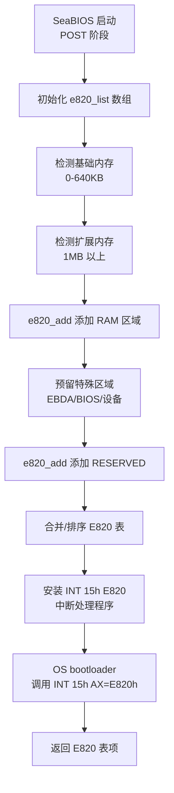
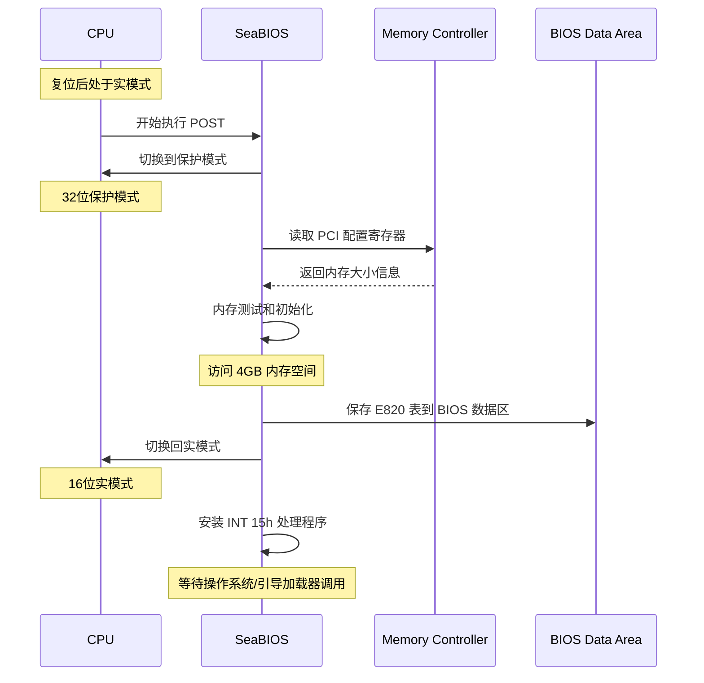

# SeaBIOS E820 内存映射表构建详解

## 文档定位

本文档详细说明 **SeaBIOS（Legacy BIOS 实现）如何在 POST 阶段构建 E820 内存映射表**。

**主题**：
- SeaBIOS POST 流程
- CPU 模式切换（实模式 ↔ 保护模式）
- E820 表构建机制
- 内存探测策略（包括大内存系统）
- QEMU fw_cfg 接口

**读者对象**：
- 想了解 BIOS 内部实现的开发者
- 对 x86 启动过程感兴趣的研究者
- 需要调试 BIOS/内存探测问题的工程师

**相关文档**：
- [E820_MEMORY_MAP.md](E820_MEMORY_MAP.md) - E820 表的总体说明
- [BOOTLOADER_MEMORY_PASSING.md](BOOTLOADER_MEMORY_PASSING.md) - GRUB 如何传递 E820
- [Linux 内核分页机制完整指南](LINUX_PAGING_COMPLETE_GUIDE.md) - Linux 内核如何接收 E820

## 代码来源

> **项目**: [SeaBIOS](https://www.seabios.org/)
> **源码仓库**: https://git.seabios.org/seabios.git
> **许可证**: LGPL v3
> **用途**: 开源的 x86 BIOS 实现，广泛用于 QEMU/KVM 虚拟化环境

**核心实现文件**：
- `src/e820map.h` - E820 结构定义和类型常量
- `src/e820map.c` - E820 表管理函数
- `src/system.c` - INT 15h E820 BIOS 调用处理程序
- `src/post.c` - POST 过程中添加各类内存区域
- `src/fw/paravirt.c` - 虚拟化平台（QEMU）内存探测
- `src/romlayout.S` - CPU 模式切换汇编代码

---

## 1. SeaBIOS POST 流程概述

**POST（Power-On Self-Test）** 是 BIOS 启动后执行的硬件自检和初始化过程。

### 1.1 POST 阶段与 CPU 模式

**关键理解**：虽然 BIOS 最终需要在**实模式**下向引导加载器提供 INT 15h E820 服务，但 E820 表的**构建过程**发生在 POST 阶段的 **32 位保护模式**下。

| 阶段 | CPU 模式 | 工作内容 |
|------|---------|---------|
| **POST 初始化** | 16位实模式 → 32位保护模式 | 切换到保护模式（`transition32`） |
| **内存探测** | **32位保护模式** | 读取 PCI 配置、探测内存、构建 E820 表 |
| **POST 完成** | 32位保护模式 → 16位实模式 | 切换回实模式（`transition16`） |
| **INT 15h 服务** | 16位实模式 | 返回已构建的 E820 表 |

**为什么使用保护模式？**
- ✅ 可访问 4GB 地址空间（实模式只能访问 1MB）
- ✅ 可执行高效的 32 位 C 代码（实模式受限于 16 位）
- ✅ 可直接访问 PCI MMIO 空间进行设备初始化
- ✅ 可测试和初始化扩展内存（1MB 以上）

> 详细的 CPU 模式切换机制和内存测试策略，请参见本文档第 3 节。

### 1.2 E820 表构建流程



---

## 2. E820 表构建的核心实现

### 2.1 e820_add() - 添加内存区域

**函数原型**：

> **项目**: SeaBIOS
> **文件**: `src/e820map.c`
> **函数**: `e820_add()`

```c
// SeaBIOS - src/e820map.c
void e820_add(u64 start, u64 size, u32 type)
{
    // 处理重叠区域，自动合并相同类型的相邻区域，保持列表有序
    // 1. 查找插入位置
    // 2. 分割已存在的重叠区域
    // 3. 移除完全被覆盖的区域
    // 4. 合并相同类型的相邻区域
    // 5. 插入新区域
}
```

**调用示例**：

> **项目**: SeaBIOS
> **文件**: `src/post.c`

```c
// SeaBIOS - src/post.c
// POST 过程中预留 EBDA（Extended BIOS Data Area）
e820_add((u32)ebda, BUILD_LOWRAM_END-(u32)ebda, E820_RESERVED);

// PMM 分配器在 ZoneTmpHigh 分配永久内存时
e820_add(data, size, E820_RESERVED);
```

**关键特性**：
1. **动态构建**：E820 表在 POST 阶段动态构建，根据检测到的内存大小、设备映射等添加条目
2. **自动合并**：`e820_add()` 自动处理重叠区域、合并相邻的同类型区域
3. **类型优先级**：RESERVED 类型优先级高于 RAM，重叠时保留 RESERVED
4. **有序存储**：E820 表按起始地址排序，方便内核遍历

### 2.2 INT 15h E820 BIOS 调用实现

**函数实现**：

> **项目**: SeaBIOS
> **文件**: `src/system.c`
> **函数**: `handle_15e820()`

```c
// SeaBIOS - src/system.c
static void handle_15e820(struct bregs *regs)
{
    int count = GET_GLOBAL(e820_count);

    // 验证调用签名和参数
    if (regs->edx != 0x534D4150    // 'SMAP' 签名
        || regs->bx >= count        // 索引越界
        || regs->ecx < sizeof(e820entry)) {  // 缓冲区太小
        set_code_invalid(regs, RET_EUNSUPPORTED);
        return;
    }

    // 复制第 BX 项 E820 条目到 ES:DI
    memcpy_far(regs->es, (void*)(regs->di+0),
               get_global_seg(), &e820_list[regs->bx],
               sizeof(e820_list[0]));

    // 更新迭代状态
    if (regs->bx == count-1)
        regs->ebx = 0;              // 最后一项，返回 0 表示结束
    else
        regs->ebx++;                // 返回下一项索引

    regs->eax = 0x534D4150;         // 返回 'SMAP' 签名
    regs->ecx = sizeof(e820_list[0]);
    set_success(regs);
}
```

**INT 15h E820 调用约定**（Legacy BIOS 启动时的标准接口）：

```
输入寄存器：
    EAX = 0xE820            // 功能号
    EDX = 0x534D4150        // 'SMAP' ASCII 签名
    EBX = 0                 // 第一次调用为 0，后续使用上次返回值
    ECX = 缓冲区大小         // 至少 20 字节
    ES:DI = 缓冲区指针       // 接收 E820 条目

输出寄存器：
    EAX = 0x534D4150        // 成功时返回签名
    EBX = 下一个条目索引     // 0 表示最后一项
    ECX = 实际写入字节数     // 通常为 20
    CF = 0                  // 成功时清零
```

### 2.3 QEMU 虚拟化平台的内存探测

在 QEMU/KVM 环境下，SeaBIOS 通过 **fw_cfg 接口**直接获取内存布局：

> **项目**: SeaBIOS
> **文件**: `src/post.c`

```c
// SeaBIOS - src/post.c (POST 阶段，32 位保护模式)
void qemu_preinit(void)
{
    // QEMU 通过 fw_cfg 接口传递内存信息
    qemu_cfg_e820();  // 从 QEMU fw_cfg 读取内存布局
}

void qemu_cfg_e820(void)
{
    // 读取 fw_cfg 中的内存映射信息
    u32 count = qemu_cfg_read_entry_num(QEMU_CFG_E820_TABLE);
    for (i = 0; i < count; i++) {
        struct e820_entry entry;
        qemu_cfg_read(&entry, sizeof(entry));
        e820_add(entry.address, entry.length, entry.type);
    }
}
```

**fw_cfg 接口的优势**：
- ✅ 虚拟化环境下不需要真实的硬件探测
- ✅ QEMU 直接告知 SeaBIOS 内存布局
- ✅ 支持任意大小的内存配置（包括 TB 级）
- ✅ 避免复杂的 PCI 配置寄存器读取

---

## 3. CPU 模式切换与内存探测详解

### 3.1 核心问题：BIOS 如何在实模式下探测 4GB 以上的内存？

**关键答案**：BIOS **不需要直接访问 4GB 以上的物理内存**来探测它们的存在。

#### 3.1.1 内存探测的核心机制（无需直接访问高地址内存）

**1. 读取内存控制器寄存器**（主要方式）：
- 内存控制器（Northbridge/Memory Controller Hub）有配置寄存器记录安装的内存大小
- 这些寄存器通过 **PCI 配置空间**（I/O 端口 0xCF8/0xCFC）或 **MMIO** 访问
- 即使在实模式下，也可通过 I/O 指令（`in`/`out`）读取 PCI 配置空间
- 寄存器会告诉 BIOS：安装了多少内存、内存条的分布、是否超过 4GB 等

**示例：通过 PCI 配置空间读取内存大小**（实际硬件）：

```c
// 通过 PCI 配置空间读取内存控制器信息
u32 read_pci_config(u8 bus, u8 dev, u8 func, u8 offset)
{
    u32 address = 0x80000000 | (bus << 16) | (dev << 11) | (func << 8) | offset;
    outl(0xCF8, address);      // 写配置地址到 I/O 端口 0xCF8
    return inl(0xCFC);         // 从 I/O 端口 0xCFC 读取配置数据
}

// Intel Northbridge 的 TOLUD 寄存器（Top of Low Usable DRAM）
u32 low_mem_top = read_pci_config(0, 0, 0, 0xBC);  // 例：0xC0000000 (3GB)

// Intel Northbridge 的 TOUUD 寄存器（Top of Upper Usable DRAM，64 位）
u64 high_mem_top = read_pci_config_64(0, 0, 0, 0xA8);  // 例：0x400000000 (16GB)

// BIOS 无需访问 16GB 内存，只需读取寄存器就知道有 16GB
```

**2. 虚拟化平台接口**：

QEMU/KVM 通过 **fw_cfg 接口**直接传递完整内存布局（如第 2.3 节所述）。

**3. POST 阶段的 CPU 模式切换**：

虽然 BIOS 可以切换到保护模式，但对于 **4GB 以上内存的探测**，主要靠读取配置寄存器，而非直接访问内存。

#### 3.1.2 关键点总结

| 方面 | 说明 |
|------|------|
| **如何知道 4GB 以上内存？** | 读取内存控制器的 PCI 配置寄存器（TOUUD 等） |
| **是否需要访问高地址？** | ❌ 不需要，寄存器通过 I/O 端口访问，不受地址模式限制 |
| **32 位保护模式的限制** | ❌ 只能访问 4GB 物理地址（2^32）<br>✅ 但可通过 I/O 端口读取配置寄存器 |
| **INT 15h E820 的数据来源** | BIOS 在 POST 阶段收集的信息，存储在 BIOS 数据区 |
| **实模式的角色** | INT 15h 中断处理程序运行在实模式，但只是**返回已收集的数据** |

### 3.2 为什么 SeaBIOS 需要使用保护模式？

> **关键问题**：既然通过 I/O 端口读取 PCI 配置寄存器就能知道内存大小，为什么还要切换到保护模式？

**答案**：读取寄存器只能"**探测**"（detect）内存大小，但 BIOS 还需要"**测试**"（test）、"**初始化**"（initialize）和"**配置**"（configure）这些内存，这些操作必须在保护模式下完成。

| 任务 | 是否需要访问内存？ | 实模式限制 | 保护模式优势 | 必须使用保护模式？ |
|------|------------------|----------|-------------|------------------|
| **探测内存大小** | ❌ 否（读 I/O 端口） | 可以完成 | 更方便 | ❌ 否 |
| **测试内存** | ✅ 是（读写内存） | 只能测试 1MB | 可测试 4GB | ✅ **是** |
| **初始化内存控制器** | ✅ 是（写 MMIO） | 无法访问高地址 MMIO | 可访问全部 MMIO | ✅ **是** |
| **PCI 设备 BAR 分配** | ✅ 是（写 MMIO） | 受限 | 完整 4GB 空间 | ✅ **是** |
| **设置 PCI Hole** | ❌ 否（写寄存器） | 可以完成 | 更方便 | ❌ 否 |
| **C 代码执行** | - | 16位代码效率低 | 32位代码高效 | ⚠️ 推荐 |

#### 详细说明

**1. 内存测试（Memory Test）**：
```c
// SeaBIOS - 必须在保护模式下执行
void ram_test(u32 start, u32 size)
{
    // 测试模式1: 写入模式并读回
    for (u32 addr = start; addr < start + size; addr += 4) {
        *(u32*)addr = 0xAA55AA55;  // ❌ 实模式无法访问 >1MB 的地址
        if (*(u32*)addr != 0xAA55AA55)
            mark_bad_memory(addr);
    }

    // 测试模式2: Walking 1s test
    // 测试模式3: Address line test
}
```

**为什么需要测试？**
- ❌ 不是所有内存条都是好的（可能有坏块）
- ❌ 内存可能未正确安装
- ❌ 内存控制器配置可能有问题
- ✅ BIOS 需要在 E820 表中标记坏内存为 RESERVED

> **重要问题**：如果保护模式只能访问 4GB，那对于 512GB 内存系统还有什么实际价值？

**答：BIOS 不需要访问所有 512GB 内存**！

这是一个常见的误解。让我们澄清 BIOS 内存测试的实际策略。

**POST 阶段的内存测试（SeaBIOS/传统 BIOS）**：

| 测试范围 | 测试方法 | 为什么只测这些？ |
|---------|---------|----------------|
| **0-640KB（基础内存）** | 完整测试（写入/读回） | BIOS 自己需要使用 |
| **1MB-16MB（扩展内存）** | 快速测试（采样） | 验证内存控制器工作正常 |
| **16MB-4GB** | **极简测试或跳过** | 只验证可访问性 |
| **4GB-512GB** | **不测试** | 完全信任内存控制器报告的大小 |

**实际代码示例**（SeaBIOS 的快速 POST）：

```c
// SeaBIOS - src/post.c
void ram_probe(void)
{
    // 从内存控制器寄存器获取总内存大小
    u64 total_ram = get_ram_size_from_chipset();  // 例如：512GB

    // ══════════════════════════════════════════════════════
    // 策略 1：快速 POST（默认，几秒钟内完成）
    // ══════════════════════════════════════════════════════

    // 1. 完整测试基础内存（0-640KB）
    ram_test(0, 0xA0000);  // BIOS 必须确保这部分可用

    // 2. 快速测试扩展内存（采样测试）
    // 只测试每个 64MB 块的第一个 4KB 页
    for (u32 addr = 0x100000; addr < 0x10000000; addr += 0x4000000) {
        if (!quick_test_page(addr)) {
            mark_bad_region(addr, 0x4000000);  // 标记整个 64MB 为坏
        }
    }

    // 3. 对于 4GB 以上内存：完全信任硬件
    // 不做任何测试，直接添加到 E820 表
    if (total_ram > 0x100000000ULL) {
        // 4GB-512GB：不测试，直接标记为可用
        e820_add(0x100000000ULL, total_ram - 0x100000000ULL, E820_RAM);
    }

    // ══════════════════════════════════════════════════════
    // 策略 2：完整内存测试（可选，BIOS 设置中启用）
    // ══════════════════════════════════════════════════════

    if (bios_setup_full_memory_test_enabled) {
        // 即使启用"完整测试"，也只测试 4GB 以内
        // 因为 32 位保护模式无法访问更高地址

        for (u32 addr = 0; addr < 0x100000000; addr += 4) {
            ram_test(addr, 4);
        }

        // 4GB 以上：跳过（32 位模式限制）
        dprintf(1, "Memory >4GB skipped in POST test\n");
    }
}
```

**为什么 BIOS 不测试所有内存？**

| 原因 | 说明 |
|------|------|
| **启动速度** | 测试 512GB 内存需要几个小时，用户无法接受 |
| **硬件可靠性** | 现代内存控制器有 ECC、内置自检，出厂前已测试 |
| **操作系统职责** | 完整内存测试是操作系统的工作（memtest86+） |
| **32 位限制** | BIOS 保护模式只能访问 4GB，无法测试更高地址 |
| **电源管理** | 访问大量内存会导致功耗上升、温度升高 |

**完整内存测试的正确时机**：

```
┌─────────────────────────────────────────────────────────┐
│ BIOS POST 阶段（几秒钟）                                 │
│ ├─ 测试：0-16MB（快速采样）                              │
│ ├─ 跳过：16MB-512GB（信任硬件）                          │
│ └─ 结果：构建 E820 表，标记所有内存为可用                │
└─────────────────────────────────────────────────────────┘
                    ↓
┌─────────────────────────────────────────────────────────┐
│ 操作系统启动（如果需要完整测试）                          │
│ ├─ 使用 memtest86+ 或内核参数                            │
│ ├─ 在 64 位长模式下运行                                  │
│ └─ 可以访问和测试全部 512GB                              │
└─────────────────────────────────────────────────────────┘
```

**实际案例：512GB 服务器的启动过程**

```c
// BIOS POST 阶段（32 位保护模式，约 10 秒）

// 1. 从内存控制器读取总内存大小
u64 total_ram = read_memory_size_from_chipset();  // 512GB

// 2. 快速测试前 16MB（确保 BIOS/引导加载器可用）
for (u32 addr = 0; addr < 0x1000000; addr += 0x100000) {
    quick_test_1mb(addr);  // 每 1MB 只测试几个字节
}

// 3. 直接构建 E820 表（不测试 4GB+）
e820_add(0x000000, 0x0A0000, E820_RAM);           // 0-640KB
e820_add(0x100000, 0xBFF00000, E820_RAM);         // 1MB-3GB
e820_add(0x100000000ULL, 0x7F00000000ULL, E820_RAM);  // 4GB-512GB
//       ↑                ↑
//     4GB (2^32)      509GB (未测试，直接信任硬件)

// 总耗时：~10 秒（而不是几个小时）
```

**保护模式的实际价值（对于大内存系统）**：

保护模式的价值**不在于**访问所有 512GB 内存，而在于：

| 实际价值 | 是否需要访问 >4GB？ | 说明 |
|---------|-------------------|------|
| **访问 PCI MMIO** | ❌ 否（3GB-4GB） | PCI 设备的配置空间通常在 3-4GB |
| **访问 ACPI 表** | ❌ 否（<4GB） | ACPI 表通常在低 4GB |
| **访问设备 ROM** | ❌ 否（<4GB） | Option ROM 在 640KB-1MB |
| **初始化内存控制器** | ❌ 否（MMIO 在 <4GB） | 内存控制器寄存器在固定地址 |
| **测试代表性内存** | ❌ 否（只测试 <4GB） | 验证内存控制器工作正常即可 |
| **执行高效 C 代码** | ❌ 否 | 32 位代码比 16 位快得多 |
| **配置 PCI Hole** | ❌ 否（配置 3-4GB） | 为设备预留 MMIO 空间 |

**关键理解**：
- ✅ **内存控制器已经知道有 512GB**（从 SPD、BIOS 设置、硬件检测）
- ✅ **BIOS 只需要验证内存控制器工作正常**（测试少量代表性内存）
- ✅ **E820 表描述内存布局，不需要访问所有内存**
- ✅ **保护模式的价值是访问 MMIO/设备/执行代码，不是测试所有内存**
- ✅ **完整内存测试是操作系统的工作**（在 64 位长模式下）

**类比理解**：
```
房产证（E820 表）：
- 写明你有 512 间房
- 不需要进入每一间房来确认它存在
- 只需要验证钥匙（内存控制器）能打开门
- 详细检查是搬进去（操作系统）之后的事

BIOS 的角色：
- 拿到房产证（读取内存控制器）
- 试试钥匙（测试少量内存）
- 确认门能开（内存控制器工作）
- 交给新主人（操作系统）

操作系统的角色：
- 搬进去住（启动）
- 详细检查每间房（memtest86+）
- 发现问题就不用那间房（标记坏内存）
```

**2. 内存控制器初始化**：
```c
// SeaBIOS - 必须在保护模式下执行
void memory_controller_init(void)
{
    // 内存控制器 MMIO 基地址（通常在高地址）
    void *mc_base = (void*)0xFED10000;  // ❌ 实模式无法访问

    // 配置 DRAM timing
    *(u32*)(mc_base + 0x100) = timing_value;

    // 配置 refresh rate
    *(u32*)(mc_base + 0x104) = refresh_value;

    // 启用 ECC（如果支持）
    *(u32*)(mc_base + 0x108) = ecc_config;
}
```

**3. PCI 设备内存映射（BAR 分配）**：
```c
// SeaBIOS - 必须在保护模式下执行
void pci_bios_init(void)
{
    // 扫描所有 PCI 设备
    for (each PCI device) {
        // 读取 BAR（Base Address Register）
        u32 bar_size = pci_read_bar_size(dev);

        // 在 PCI hole（3GB-4GB）中分配空间
        u32 mmio_addr = allocate_pci_mmio(bar_size);  // 例如：0xE0000000

        // 写入 BAR
        pci_write_bar(dev, mmio_addr);

        // 测试设备 MMIO 是否可访问
        *(u32*)mmio_addr = 0x12345678;  // ❌ 实模式无法访问
    }
}
```

**4. 设置内存映射（Memory Hole）**：
```c
// SeaBIOS - 配置内存控制器寄存器
void setup_memory_hole(void)
{
    u64 total_ram = get_ram_size();  // 例如：8GB

    // 在 3GB-4GB 之间留出 PCI hole 给设备 MMIO
    // TOLUD (Top of Low Usable DRAM) = 3GB
    write_pci_config(0, 0, 0, 0xBC, 0xC0000000);  // 3GB

    // TOUUD (Top of Upper Usable DRAM) = 8GB + 1GB (hole size)
    write_pci_config_64(0, 0, 0, 0xA8, 0x240000000);  // 9GB

    // E820 表示例：
    // [0MB-3GB]     RAM
    // [3GB-4GB]     RESERVED (PCI hole)
    // [4GB-9GB]     RAM (实际物理内存是 8GB，但要跳过 hole)
}
```

**5. 代码执行效率**：
```c
// 32位保护模式 C 代码（高效）
u32 calculate_checksum(u8 *data, u32 len) {
    u32 sum = 0;
    for (u32 i = 0; i < len; i++)  // 32位循环变量
        sum += data[i];
    return sum;
}

// vs 16位实模式 C 代码（低效）
u16 calculate_checksum(u8 far *data, u16 len) {  // far 指针开销大
    u16 sum = 0;
    for (u16 i = 0; i < len; i++)  // 16位循环，频繁溢出检查
        sum += data[i];
    return sum;
}
```

**总结**：
- ✅ **探测内存大小**：I/O 端口读取寄存器即可，实模式能做
- ❌ **测试内存**：需要读写 >1MB 的内存，实模式无法完成
- ❌ **初始化内存**：需要访问高地址 MMIO，实模式无法完成
- ❌ **配置 PCI 设备**：需要访问设备 MMIO，实模式无法完成
- ✅ **执行效率**：32 位代码比 16 位代码高效得多

**对于大内存系统（如 512GB）的补充说明**：
- ✅ **保护模式不需要访问所有 512GB**：只测试代表性内存（<4GB）
- ✅ **完整内存测试是操作系统的工作**：在 64 位长模式下进行（memtest86+）
- ✅ **保护模式的价值在于**：访问 MMIO、初始化硬件、执行高效代码
- ✅ **E820 表只是描述**：不需要访问所有内存就能构建内存映射表
- ✅ **内存控制器已经知道大小**：BIOS 只需验证其工作正常

**因此，即使对于 512GB 内存系统，32 位保护模式仍然有实际价值，但价值不在于访问所有内存，而在于完成硬件初始化和配置。**

### 3.3 SeaBIOS 的 CPU 模式切换详解

#### 3.3.1 工作流程图



#### 3.3.2 模式切换的实际代码

> **项目**: SeaBIOS
> **文件**: `src/romlayout.S`, `src/post.c`

**1. 从实模式切换到保护模式**：

```asm
// SeaBIOS - src/romlayout.S
// POST 代码入口（16位实模式）
ENTRY_POST:
    // ... 16位实模式初始化 ...

    // 跳转到 32 位保护模式入口
    calll transition32
    .code32

// 模式切换函数
transition32:
    // 1. 准备 GDT（全局描述符表）
    movl $BUILD_BIOS_ADDR + BUILD_PROTECTED_GDT, %eax
    lgdt (%eax)

    // 2. 设置 CR0.PE = 1（保护模式使能位）
    movl %cr0, %eax
    orl  $CR0_PE, %eax
    movl %eax, %cr0

    // 3. 远跳转，加载 CS 段选择子
    ljmpl $SEG32_MODE32_CS, $1f

1:  // 现在处于 32 位保护模式
    .code32

    // 4. 设置数据段寄存器
    movl $SEG32_MODE32_DS, %eax
    movw %ax, %ds
    movw %ax, %es
    movw %ax, %ss
    movw %ax, %fs
    movw %ax, %gs

    // 5. 设置堆栈（使用 32 位地址）
    movl $BUILD_STACK_ADDR, %esp

    // 6. 调用 C 代码入口（32位代码）
    calll __start32
```

**2. 在保护模式下进行内存探测**：

```c
// SeaBIOS - src/post.c
void __start32(void)
{
    // POST 阶段主函数（32位保护模式）

    // 初始化硬件
    platform_hardware_setup();

    // 内存检测和初始化
    ram_probe();        // 探测内存大小
    malloc_setup();     // 设置内存分配器

    // PCI 设备枚举（需要访问 PCI MMIO 空间）
    pci_probe_devices();

    // 构建 E820 表
    qemu_preinit();     // QEMU 平台：从 fw_cfg 读取
    e820_prepboot();    // 整理和合并 E820 表

    // ... 其他初始化 ...

    // 准备切换回实模式
    prepareboot();
}

// 内存探测函数（32位保护模式）
void ram_probe(void)
{
    // 可以直接访问 4GB 地址空间

    // 方法 1：读取内存控制器寄存器
    u64 ram_size = get_ram_size_from_chipset();

    // 方法 2：实际写入并读取内存（测试）
    for (u32 addr = 0; addr < 0xFFFFFFFF; addr += 0x100000) {
        if (!test_memory_at(addr))
            break;
    }

    // 方法 3：从虚拟化平台接口获取（QEMU fw_cfg）
    ram_size = qemu_cfg_get_ram_size();

    // 添加到 E820 表
    e820_add(0x100000, ram_size - 0x100000, E820_RAM);
}
```

**3. 从保护模式切换回实模式**：

> **关键问题**：什么是"16 位保护模式"？为什么要经过这个中间状态？

**模式切换路径**：
```
32位保护模式 → 16位保护模式 → 16位实模式
 (PE=1, 32位CS)  (PE=1, 16位CS)   (PE=0, 16位CS)
```

**为什么不能直接切换？**
- ❌ **不能在 32 位代码段中直接禁用 PE 位**（会导致处理器异常）
- ✅ **必须先跳转到 16 位代码段**，然后才能安全地禁用保护模式
- ✅ **16 位保护模式是一个必要的过渡状态**

**什么是 16 位保护模式？**

| 特征 | 32位保护模式 | **16位保护模式** | 16位实模式 |
|------|-------------|----------------|----------|
| **CR0.PE（保护模式使能）** | 1（启用） | **1（启用）** | 0（禁用） |
| **代码段（CS）** | 32位代码段 | **16位代码段** | 16位段 |
| **指令长度** | 32位指令 | **16位指令** | 16位指令 |
| **段界限** | 4GB | **4GB（GDT仍有效）** | 64KB |
| **分段机制** | GDT/LDT | **GDT/LDT** | 段寄存器×16 |
| **特权级检查** | 有 | **有** | 无 |
| **MMIO访问** | 可以 | **可以** | 受限 |

**关键理解**：
- ✅ "16 位保护模式"仍然是**保护模式**（PE=1，使用 GDT）
- ✅ 只是代码段变成了 16 位（CS 指向 16 位代码段描述符）
- ✅ 段界限仍然可以是 4GB（由 GDT 描述符定义）
- ✅ 这是 CPU 的一个合法状态（用于兼容性）

```asm
// SeaBIOS - src/romlayout.S
// 从 32 位保护模式切换回 16 位实模式
transition16:
    .code32  // ◄─ 当前：32位保护模式

    // ═══════════════════════════════════════════════════
    // 阶段 1：仍在 32 位保护模式
    // ═══════════════════════════════════════════════════

    // 1. 禁用分页（如果启用了）
    movl %cr0, %eax
    andl $~CR0_PG, %eax
    movl %eax, %cr0

    // 2. 加载 16 位段描述符到数据段寄存器
    // SEG32_MODE16_DS 是 GDT 中的 16 位数据段描述符
    movl $SEG32_MODE16_DS, %eax
    movw %ax, %ds
    movw %ax, %es
    movw %ax, %ss
    movw %ax, %fs
    movw %ax, %gs

    // 3. 远跳转到 16 位代码段
    // SEG32_MODE16_CS 是 GDT 中的 16 位代码段描述符
    ljmpw $SEG32_MODE16_CS, $1f  // ◄─ 关键跳转

    // ═══════════════════════════════════════════════════
    // 阶段 2：现在处于 16 位保护模式（过渡状态）
    // ═══════════════════════════════════════════════════

1:  // ◄─ 跳转到这里后的状态：
    //    - CR0.PE = 1（仍在保护模式）
    //    - CS = SEG32_MODE16_CS（16位代码段）
    //    - GDT 仍然有效
    //    - 段界限仍可以是 4GB

    .code16  // ◄─ 告诉汇编器：从这里开始生成 16 位指令

    // 4. 禁用保护模式（CR0.PE = 0）
    // 现在可以安全地清除 PE 位了（因为在 16 位代码段）
    movl %cr0, %eax
    andl $~CR0_PE, %eax
    movl %eax, %cr0  // ◄─ 关键操作：PE=0

    // ═══════════════════════════════════════════════════
    // 阶段 3：现在处于 16 位实模式
    // ═══════════════════════════════════════════════════

    // 5. 重新加载段寄存器（实模式段）
    // 因为 GDT 已经无效，需要用实模式段值替换
    xorw %ax, %ax
    movw %ax, %ds
    movw %ax, %es
    movw %ax, %ss
    movw %ax, %fs
    movw %ax, %gs

    // 6. 设置实模式堆栈
    movw $EBDA_SEG, %ax
    movw %ax, %ss
    movl $EBDA_OFFSET, %esp

    // ◄─ 现在完全回到 16 位实模式
```

**GDT 中的段描述符示例**：

```c
// SeaBIOS - src/romlayout.S - GDT 定义

BUILD_PROTECTED_GDT:
    // 段 0：NULL 描述符
    .quad 0

    // 段 1：32 位代码段（4GB，用于 POST）
    .word 0xFFFF        // 段界限 0-15 位
    .word 0x0000        // 基地址 0-15 位
    .byte 0x00          // 基地址 16-23 位
    .byte 0x9A          // 访问权限：代码段，可读可执行
    .byte 0xCF          // 标志：粒度=4KB, 大小=32位
    .byte 0x00          // 基地址 24-31 位

    // 段 2：32 位数据段（4GB，用于 POST）
    .word 0xFFFF
    .word 0x0000
    .byte 0x00
    .byte 0x92          // 访问权限：数据段，可读可写
    .byte 0xCF          // 标志：粒度=4KB, 大小=32位
    .byte 0x00

    // 段 3：16 位代码段（4GB 界限，但 16 位指令）
    .word 0xFFFF
    .word 0x0000
    .byte 0x00
    .byte 0x9A          // 访问权限：代码段
    .byte 0x8F          // 标志：粒度=4KB, 大小=16位 ◄─ 关键区别
    .byte 0x00

    // 段 4：16 位数据段（4GB 界限，但 16 位寻址）
    .word 0xFFFF
    .word 0x0000
    .byte 0x00
    .byte 0x92          // 访问权限：数据段
    .byte 0x8F          // 标志：粒度=4KB, 大小=16位 ◄─ 关键区别
    .byte 0x00
```

**模式切换的时间线**：

```
步骤 | 操作                    | CR0.PE | CS类型  | 汇编指令 | CPU模式
-----|------------------------|--------|---------|---------|-------------
  1  | 开始                    |   1    | 32位    | .code32 | 32位保护模式
  2  | 加载 16位数据段描述符    |   1    | 32位    | .code32 | 32位保护模式
  3  | 远跳转到 16位代码段      |   1    | **16位** | .code16 | **16位保护模式**
  4  | 清除 CR0.PE 位          | **0**  | 16位    | .code16 | **16位实模式**
  5  | 重新加载段寄存器        |   0    | 16位    | .code16 | 16位实模式
```

**为什么需要这个过程？**

Intel CPU 规定：
1. ✅ **在 32 位代码段中禁用 PE 会导致 #GP（一般保护异常）**
2. ✅ **必须在 16 位代码段中禁用 PE**
3. ✅ **16 位保护模式提供了安全的过渡环境**

**类比理解**：
- 就像从高速公路（32位保护模式）下来
- 不能直接冲到乡间小路（16位实模式）
- 需要先进入匝道（16位保护模式）减速
- 然后才能安全切换到实模式

**实际应用场景**：
- BIOS 从 POST（保护模式）切换到 INT 15h 服务（实模式）
- 某些引导加载器需要在两种模式之间切换
- 虚拟 8086 模式的进入/退出

**总结**：
- ✅ **16 位保护模式**是 CPU 的合法状态，不是错误
- ✅ 它是从 32 位保护模式到 16 位实模式的**必要过渡**
- ✅ 特征：PE=1（保护模式），CS=16位代码段，GDT 仍有效
- ✅ 在这个状态下，可以安全地清除 CR0.PE 位切换到实模式

**4. 实模式下的 INT 15h E820 服务**：

```asm
// SeaBIOS - src/system.c
// INT 15h AX=E820h 处理程序（16位实模式代码）
handle_15e820:
    .code16

    // 此时已经回到实模式
    // 只需要返回 POST 阶段收集的 E820 数据

    // 从 BIOS 数据区读取预先构建的 E820 表
    movw %bx, %si              // BX = 延续值（索引）
    shll $4, %esi              // 每个条目 20 字节
    addl $e820_list, %esi      // 指向 E820 表

    // 复制一个 E820 条目到 ES:DI
    movl (%esi), %eax          // addr (低32位)
    movl %eax, %es:(%di)
    movl 4(%esi), %eax         // addr (高32位)
    movl %eax, %es:4(%di)
    movl 8(%esi), %eax         // size (低32位)
    movl %eax, %es:8(%di)
    movl 12(%esi), %eax        // size (高32位)
    movl %eax, %es:12(%di)
    movl 16(%esi), %eax        // type
    movl %eax, %es:16(%di)

    // 设置返回值
    movl $E820_SIGNATURE, %eax  // EAX = 'SMAP'
    movl $20, %ecx              // ECX = 条目大小
    incw %bx                    // BX = 下一个索引

    clc                         // 清除进位标志（成功）
    iret
```

**关键实现文件**（SeaBIOS 项目）：

| 文件 | 作用 | CPU 模式 |
|------|------|---------|
| `src/romlayout.S` | 模式切换汇编代码 | 16/32位切换 |
| `src/post.c` | POST 主流程（C代码） | **32位保护模式** |
| `src/fw/paravirt.c` | QEMU 内存探测 | **32位保护模式** |
| `src/hw/pciinit.c` | PCI 设备初始化 | **32位保护模式** |
| `src/system.c` | INT 15h 处理程序 | **16位实模式** |
| `src/e820map.c` | E820 表管理 | **32位保护模式** |

**时间线**：

```
启动 ──┬─> [实模式] BIOS 复位代码（romlayout.S）
       │
       ├─> [实模式→保护模式] transition32()
       │
       ├─> [32位保护模式] POST 流程
       │   ├─ platform_hardware_setup()
       │   ├─ ram_probe() ◄── 内存探测在这里
       │   ├─ pci_probe_devices()
       │   ├─ e820_prepboot()
       │   └─ prepareboot()
       │
       ├─> [保护模式→实模式] transition16()
       │
       ├─> [实模式] 安装中断处理程序
       │   └─ INT 15h E820 handler
       │
       └─> [实模式] 等待引导加载器调用
           └─ GRUB 调用 INT 15h AX=E820h
               └─ 返回预先收集的 E820 数据
```

**关键点**：
- ✅ **POST 阶段在保护模式**：内存探测、PCI 初始化等都在 32 位保护模式下完成
- ✅ **数据保存在 BIOS 数据区**：E820 表在保护模式下构建，保存到内存
- ✅ **INT 15h 在实模式**：引导加载器调用时，BIOS 已回到实模式，只是返回数据
- ✅ **无需访问高地址**：即使在保护模式（4GB 限制），也通过 I/O 端口读取配置寄存器获知 4GB+ 内存

---

## 4. 总结

### 4.1 SeaBIOS E820 构建的关键流程

```
1. BIOS 复位 (16位实模式)
   ↓
2. 切换到保护模式 (transition32)
   ↓
3. POST 流程 (32位保护模式)
   ├─ 读取内存控制器寄存器 (PCI配置空间)
   ├─ 探测内存大小 (包括 >4GB)
   ├─ 测试代表性内存 (0-16MB 采样)
   ├─ 初始化内存控制器
   ├─ 配置 PCI 设备 BAR
   ├─ 构建 E820 表 (e820_add)
   └─ 合并和排序 E820 表
   ↓
4. 切换回实模式 (transition16)
   ↓
5. 安装 INT 15h E820 处理程序 (16位实模式)
   ↓
6. 等待引导加载器调用
   ↓
7. 返回 E820 表给 GRUB
```

### 4.2 核心要点

| 方面 | 说明 |
|------|------|
| **E820 构建时机** | POST 阶段（32位保护模式） |
| **E820 返回时机** | INT 15h 调用（16位实模式） |
| **内存探测方式** | PCI 配置寄存器 + fw_cfg 接口 |
| **内存测试策略** | 只测试代表性内存（<4GB），信任硬件报告 |
| **模式切换路径** | 实模式 → 保护模式 → 实模式 |
| **16位保护模式** | 必要的过渡状态（安全禁用 PE 位） |
| **大内存支持** | 通过寄存器获知大小，无需访问所有内存 |

### 4.3 与其他文档的关系

- **[E820_MEMORY_MAP.md](E820_MEMORY_MAP.md)**：E820 表的总体说明和内核接收
- **[BOOTLOADER_MEMORY_PASSING.md](BOOTLOADER_MEMORY_PASSING.md)**：GRUB 如何调用 INT 15h 并传递给内核
- **[Linux 内核分页机制完整指南](LINUX_PAGING_COMPLETE_GUIDE.md)**：内核 setup_arch() 如何使用 E820

---

**本文档基于 SeaBIOS 源码分析整理，版本可能随 SeaBIOS 更新而变化，以实际源码为准。**
