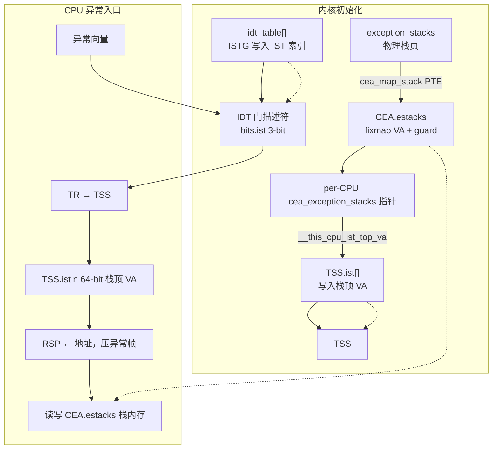
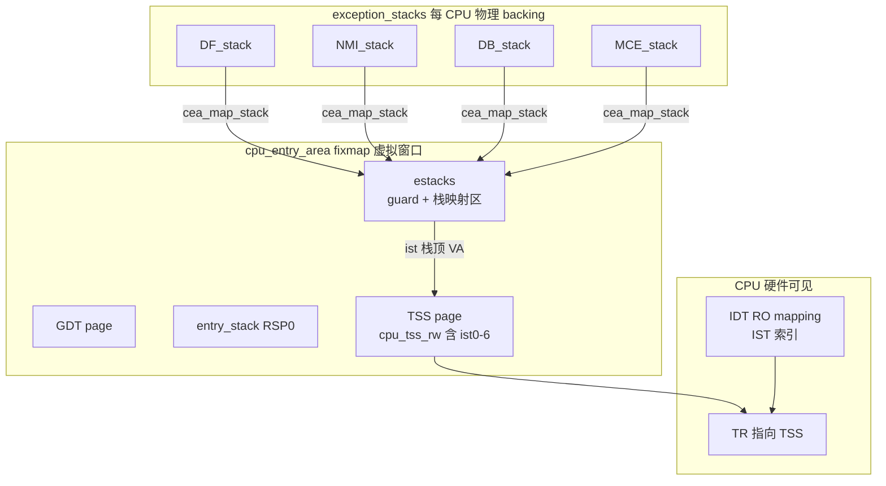
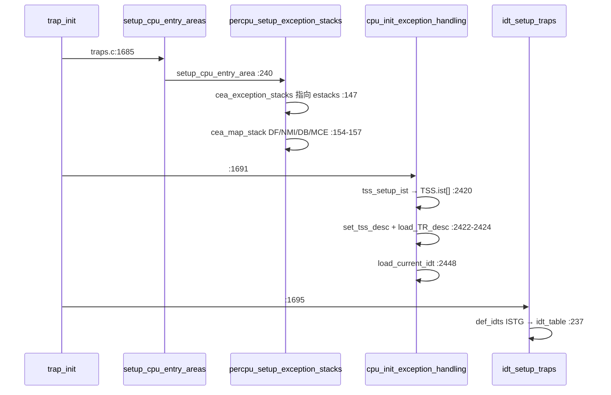
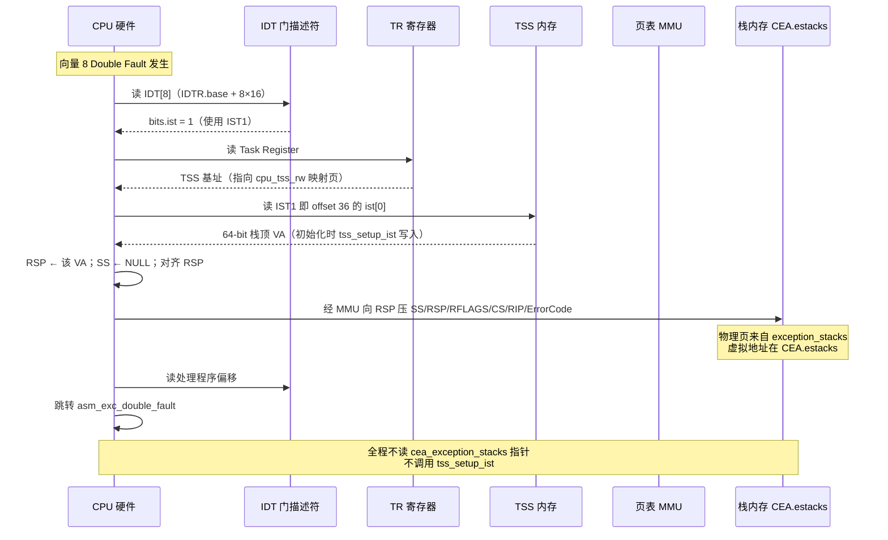
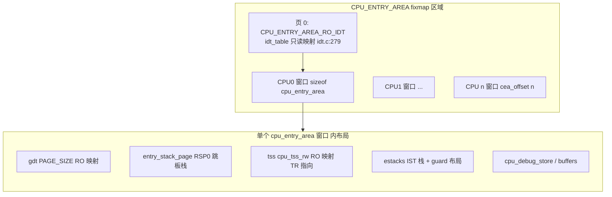

# x86-64 任务状态段（TSS）与中断栈表（IST）详解

**版本**: 3.6  
**日期**: 2026-06-21  
**作者**: Linux 内核启动文档项目

> **文档导航**: [返回总索引](DOCUMENT_INDEX.md) | [IDT 演进](LINUX_KERNEL_IDT_EVOLUTION.md) | [内核启动](LINUX_KERNEL_INIT.md)

---

## 目录

1. [概述](#1-概述)
2. [硬件：64 位 TSS 结构](#2-硬件64-位-tss-结构)
3. [硬件：IST 机制](#3-硬件ist-机制)
4. [数据栈 IST 与影子栈 SSP](#4-数据栈-ist-与影子栈-ssp)
5. [Linux 数据结构总览](#5-linux-数据结构总览)（含 [CEA 全景 §5.4](#54-cpu-entry-area-cea-全景)）
6. [Linux 七个 IST 槽位：定义、分配与使用](#6-linux-七个-ist-槽位定义分配与使用)
7. [Linux IST 栈内存布局与分配](#7-linux-ist-栈内存布局与分配)
8. [Linux 初始化时序](#8-linux-初始化时序)
9. [Linux 异常入口路径](#9-linux-异常入口路径)
10. [IST 与 IDT 的集成](#10-ist-与-idt-的集成)
11. [为什么需要 IST](#11-为什么需要-ist)（含 [§11.4 IST 使用后的状态恢复](#114-ist-使用后的状态恢复)）
12. [启动早期约束](#12-启动早期约束)
13. [调试与验证](#13-调试与验证)
14. [附录：TSS 角色演变与 Entry Trampoline](#14-附录tss-角色演变与-entry-trampoline)
15. [参考文献](#15-参考文献)

---

## 1. 概述

### 1.1 TSS 与 IST 各自是什么

**TSS (Task State Segment)** 在 x86-64 中是一个 104 字节的内存数据结构，由 **TR 寄存器**指向。硬件任务切换在 64 位模式下已废弃，但 TSS **必须存在**（Intel SDM Vol 3A §7.7）。

**IST (Interrupt Stack Table)** 是 TSS 中的 7 个 64 位栈指针（IST1–IST7），配合 IDT 门描述符中的 3 位 IST 索引字段，使特定中断/异常可以**强制切换到预先分配好的独立栈**。

### 1.2 三者的存储与引用关系

| 存储对象 | 物理位置 | 作用 |
|---------|---------|------|
| IST 索引（0–7） | IDT 门描述符的 3-bit 字段 | 告诉 CPU「用 TSS 中第几号 IST 指针」 |
| 数据栈指针（RSP） | TSS 的 `ist[0..6]`（对应 IST1–IST7） | 异常压栈时切换到的**数据栈** |
| 影子栈指针（SSP） | 内存中的一张表，基址由 `IA32_INTERRUPT_SSP_TABLE` MSR 指向 | CET 影子栈切换（与 TSS 中的 RSP 独立） |

IDT 里**只有 3 个比特的索引**，存不下 64 位地址；真正的大指针数组在 TSS（数据栈）和 MSR 指向的内存表（影子栈）中。

> **为何 TSS 与 IDT 都要配置？** TSS 提供 7 个栈**地址**，IDT 每个向量声明**是否使用 IST 及用几号**——详见 [§6.3](#63-tss-与-idt-的分工为什么两侧都要配置-ist)。

### 1.3 Per-CPU 作用域

TSS 和 IST 都是 **Per-CPU** 的：

- 每个逻辑 CPU 有独立的 TR 寄存器和 TSS 内存
- 中断路由到某个 CPU 后，**只读取该 CPU 的 TSS**
- 两个核心不能共用同一个 IST 栈（并发 NMI 会互相踩踏）

IST 是 **Per-CPU 的系统保留栈**，不是 Per-Thread——无论当前跑哪个线程，致命异常都跳到当前核心的固定 IST 栈。

### 1.4 工作流程（简图）

```
异常/中断发生
    │
    ▼
查 IDT[vector] → 读取 IST 字段
    │
    ├─ IST = 0 → 使用修改后的 legacy 栈切换（RSP0 或当前栈）
    │
    └─ IST = N (1–7) → 读 TR → TSS.ist[N-1] → RSP = 该地址
                          │
                          ▼
                    向新栈压 SS/RSP/RFLAGS/CS/RIP（64 位模式无条件压 SS:RSP）
                          │
                          ▼
                    跳转到 IDT 中的处理程序
```

---

## 2. 硬件：64 位 TSS 结构

### 2.1 SDM Figure 7-11 布局

Intel SDM Vol 3A §7.7, Figure 7-11 定义的 64-bit TSS（共 **104 字节 / 0x68**）：

| 偏移 | 字段 | 大小 |
|------|------|------|
| 0–3 | Reserved | 4 B |
| 4–11 | RSP0 | 8 B |
| 12–19 | RSP1 | 8 B |
| 20–27 | RSP2 | 8 B |
| 28–35 | Reserved | 8 B |
| 36–43 | IST1 | 8 B |
| 44–51 | IST2 | 8 B |
| 52–59 | IST3 | 8 B |
| 60–67 | IST4 | 8 B |
| 68–75 | IST5 | 8 B |
| 76–83 | IST6 | 8 B |
| 84–91 | IST7 | 8 B |
| 92–99 | Reserved | 8 B |
| 100–101 | Reserved | 2 B |
| 102–103 | I/O Map Base Address | 2 B |

Reserved 位必须为零。

### 2.2 64 位 TSS 描述符

64 位模式下 TSS 描述符占 GDT 中 **两个连续的 8 字节条目**（共 16 字节），Type 为 `1001b`（Available 64-bit TSS）或 `1011b`（Busy）。详见 SDM Vol 3A §7.2.3。

### 2.3 SDM 与 Linux `struct x86_hw_tss` 的对应

```c
// arch/x86/include/asm/processor.h
struct x86_hw_tss {
    u32     reserved1;
    u64     sp0;
    u64     sp1;
    u64     sp2;          /* Linux 用作 syscall 临时保存用户 RSP */
    u64     reserved2;
    u64     ist[7];       /* IST1–IST7 */
    u32     reserved3;
    u32     reserved4;
    u16     reserved5;
    u16     io_bitmap_base;
} __attribute__((packed));
```

字段偏移与 SDM 完全一致。Linux 对 `sp2` 的复用见 [§14.2](#142-entry-trampoline-与-sp2)。

---

## 3. 硬件：IST 机制

### 3.1 SDM 官方描述（§6.14.5）

> "The IST mechanism is only available in IA-32e mode. It is part of the 64-bit mode TSS. The motivation for the IST mechanism is to provide a method for **specific interrupts (such as NMI, double-fault, and machine-check) to always execute on a known good stack**."

要点：

- 仅在 IA-32e（64 位）模式下可用
- Legacy 任务切换在 64 位模式下不可用，IST 是其替代
- IDT 门描述符中 3-bit IST 字段引用 TSS 中的 IST1–IST7
- **IST = 0** 时使用修改后的 legacy 栈切换机制

### 3.2 栈切换优先级（SDM §6.14.4）

CPU 决定新 RSP 的逻辑：

```
IF (IDT.IST != 0) {
    RSP = TSS.IST[IDT.IST - 1]    // 注意 1-based → 0-based 转换
} ELSE IF (CPL 改变) {
    RSP = TSS.RSP0
} ELSE {
    RSP = 当前 RSP               // 同特权级，不换栈
}
```

**IST 优先级高于 RSP0**，且**无论从哪个特权级触发都生效**——这是 IST 作为「最后防线」的关键。

运行时硬件逐步路径（IDT → TSS → 栈 VA，不查 `cea_exception_stacks` 指针）见 [§5.3.7](#537-运行时-ist-栈切换idt--tss--栈内存不是查-cea_exception_stacks)。

64 位模式下 privilege-level 切换时 **不加载新的 SS 描述符**，SS 被强制为 NULL，RPL 设为新 CPL；旧的 SS:RSP 被压到新栈上。IRET 时恢复。

### 3.3 64 位中断栈帧（SDM §6.14.2）

与 32 位模式的重要区别：

| 行为 | 32 位 | 64 位 |
|------|-------|-------|
| SS:RSP 压栈 | 仅 CPL 改变时 | **无条件**压入 |
| 每项大小 | 16 或 32 bit | 固定 8 字节 |
| RSP 对齐 | — | 压栈前 16 字节对齐 |

栈帧布局（低地址 = 新 RSP）：

```
+0   Error Code（部分异常有）
+8   RIP
+16  CS
+24  RFLAGS
+32  RSP（旧）
+40  SS（旧）
```

CPU **不会**自动保存通用寄存器；Linux 在入口汇编中手动保存。

### 3.4 编号体系：三套索引的对照

这是最容易混淆的地方：

| 命名体系 | 范围 | 用途 |
|---------|------|------|
| SDM 硬件名 | IST1 – IST7 | 手册与 Figure 7-11 |
| TSS 数组 | `ist[0]` – `ist[6]` | Linux C 代码索引 |
| IDT 门描述符 | 0 – 7 | 0 = 不用 IST；1–7 对应 IST1–IST7 |

转换关系：

```
IDT.IST = N        →  TSS.ist[N - 1]     (N = 1..7)
Linux IST_INDEX_x  →  TSS.ist[IST_INDEX_x]
IDT.IST            =  IST_INDEX_x + 1     (ISTG 宏负责 +1)
```

---

## 4. 数据栈 IST 与影子栈 SSP

Intel CET（Control-flow Enforcement Technology）引入的影子栈与 TSS 中的 IST **是两套独立机制**：

| | 数据栈 (RSP) | 影子栈 (SSP) |
|---|-------------|-------------|
| 指针存放位置 | TSS 的 IST1–IST7 | 内存表，由 `IA32_INTERRUPT_SSP_TABLE` MSR 指向 |
| 作用 | 异常帧、局部变量、C 函数调用 | 控制流完整性（返回地址保护） |
| Linux 当前使用 | 全面使用（#DF/NMI/#DB/#MC/#VC） | 需 `CONFIG_X86_CET` |

SDM Figure 6-10 中的 `IA32_INTERRUPT_SSP_TABLE` 是 **MSR**，不是 IDT 或 TSS 的一部分。操作系统分配内存表、写入 MSR；每个 CPU 有独立的 MSR 实例。

---

## 5. Linux 数据结构总览

### 5.1 层次关系

```
Per-CPU
├── cpu_tss_rw (struct tss_struct)          ← TR 指向 x86_tss 部分
│   ├── x86_hw_tss                          ← 硬件可见的 104 字节
│   └── io_bitmap                           ← I/O 权限位图（软件扩展）
│
├── exception_stacks (struct exception_stacks)  ← IST 栈物理存储（无 guard page）
├── cea_exception_stacks *                  ← 指向 CEA 中带 guard page 的映射
│
├── entry_stack_storage                     ← Entry Trampoline Stack（RSP0 用）
└── cpu_entry_area *                        ← 上述结构的 fixmap 虚拟映射
```

### 5.2 关键结构体

**`struct tss_struct`**（`arch/x86/include/asm/processor.h`）：

```c
struct tss_struct {
    struct x86_hw_tss   x86_tss;    /* 必须不跨页边界 */
    struct x86_io_bitmap io_bitmap;
} __aligned(PAGE_SIZE);
```

**`struct cpu_entry_area`**（`arch/x86/include/asm/cpu_entry_area.h`）将 GDT、entry stack、TSS、异常栈等映射到 fixmap 区域 `CPU_ENTRY_AREA`：

```c
struct cpu_entry_area {
    char gdt[PAGE_SIZE];
    struct entry_stack_page entry_stack_page;
    struct tss_struct tss;
    struct cea_exception_stacks estacks;   /* IST 栈 + guard pages */
    /* ... debug store 等 ... */
};
```

**Per-CPU 声明**（`arch/x86/kernel/process.c`）：

```c
DEFINE_PER_CPU_PAGE_ALIGNED(struct tss_struct, cpu_tss_rw) = {
    .x86_tss = {
        .sp0 = (1UL << (BITS_PER_LONG-1)) + 1,  /* 毒值，cpu_init 中覆盖 */
        .io_bitmap_base = IO_BITMAP_OFFSET_INVALID,
    },
};
```

注意：`ist[]` **不在**静态初始化器中赋值，而是在 `tss_setup_ist()` 中运行时填充。

### 5.3 cea_exception_stacks：存储位置与 IDT/TSS 的关系

IST 相关内存在 Linux 里不是「TSS 一块、IDT 一块、cea 一块地址表」这么简单，而是 **三层存储 + 两类硬件配置**，初始化时串成一条链。

#### 5.3.1 三层存储模型

| 层次 | 内核对象 | 定义位置 | 存什么 | 谁主要使用 |
|------|---------|---------|--------|-----------|
| **① 物理 backing** | `struct exception_stacks exception_stacks` | `cpu_entry_area.c:18` 静态 per-CPU | IST 栈的**实际字节**（连续排列，无 guard） | 页表映射的**物理页来源** |
| **② CEA 虚拟映射** | `struct cea_exception_stacks estacks`（嵌在 `cpu_entry_area` 内） | `cpu_entry_area.h:118` | fixmap **虚拟布局**：guard 空洞 + 映射后的可用栈 | **CPU 压栈**、内核读写的 VA |
| **③ 硬件配置** | `TSS.ist[]` + `IDT[].bits.ist` | `cpu_tss_rw` / `idt_table[]` | 64-bit **栈顶 VA** / 3-bit **IST 索引** | **CPU 硬件**异常入口 |

`cea_exception_stacks` 这个名字在源码里出现 **两次**，不要混为一谈：

| 名称 | 类型 | 含义 |
|------|------|------|
| `struct cea_exception_stacks` | 结构体类型 | CEA 内 `estacks` 字段的布局（guard + stack 槽位） |
| `cea_exception_stacks` | per-CPU **指针变量** | `DEFINE_PER_CPU(..., cea_exception_stacks)`，指向 `&get_cpu_entry_area(cpu)->estacks`（`cpu_entry_area.c:147`） |

`__this_cpu_ist_top_va(DF)` 等宏通过该指针计算栈顶：

```c
// cpu_entry_area.h:147-148
#define __this_cpu_ist_top_va(name) \
    CEA_ESTACK_TOP(__this_cpu_read(cea_exception_stacks), name)
```

#### 5.3.2 物理页如何进入 CEA

`exception_stacks` 在编译期按 CPU 分配好栈数组；启动时 `percpu_setup_exception_stacks()` 做两件事：

1. `per_cpu(cea_exception_stacks, cpu) = &cea->estacks` — 保存 CEA 虚拟地址
2. `cea_map_stack(DF/NMI/...)` — 把 `exception_stacks` 里各 `_stack` 的**物理页**映射到 `cea->estacks.*_stack` 的**虚拟页**

```c
// cpu_entry_area.c:133-137
#define cea_map_stack(name) do { \
    cea_map_percpu_pages(cea->estacks.name##_stack, \
                         estacks->name##_stack, npages, PAGE_KERNEL); \
} while (0)
```

Guard 页只存在于 **CEA 虚拟布局**（`ESTACKS_MEMBERS(PAGE_SIZE, ...)`），通常**不映射物理页**；栈溢出触及 guard 即 fault。`exception_stacks` 侧 guard 大小为 0，物理页连续存放。

CEA 整体位于 fixmap 的 `CPU_ENTRY_AREA` 区域，每 CPU 窗口由 `get_cpu_entry_area(cpu)` 计算（`cpu_entry_area.c:70-75`）：

```c
unsigned long va = CPU_ENTRY_AREA_PER_CPU + cea_offset(cpu) * CPU_ENTRY_AREA_SIZE;
```

#### 5.3.3 与 IDT、TSS 的分工（总览）



| 组件 | 存储内容 | 与 cea_exception_stacks 的关系 |
|------|---------|-------------------------------|
| **IDT** | 每向量 3-bit IST 索引（0–7） | **无直接关系**；只告诉 CPU 读 TSS 第几号槽 |
| **TSS.ist[]** | 7×64-bit 栈顶 **虚拟地址** | 值来自 `__this_cpu_ist_top_va()`，指向 **CEA.estacks** 中各 `_stack` 的高地址 |
| **CEA.estacks** | 映射后的 IST **栈内存** | `cea_exception_stacks` 指针指向此处；CPU 通过 TSS 里的 VA 访问 |
| **exception_stacks** | 栈的**物理 backing** | 经 PTE 与 CEA.estacks 中同名 `_stack` 字段共享物理页 |

**数据流（初始化）**：

```
exception_stacks.DF_stack  ──PTE──►  CEA.estacks.DF_stack  (fixmap VA)
                                           ▲
__this_cpu_ist_top_va(DF)  ──计算栈顶──►  │
                                           │
tss_setup_ist()  ──写入──►  TSS.ist[IST_INDEX_DF]  (该 VA)

ISTG(X86_TRAP_DF, ..., IST_INDEX_DF)  ──写入──►  IDT[8].bits.ist = 1
```

**数据流（运行时 #DF）**：

```
CPU: IDT[8].IST=1 → TSS.ist[0] → RSP = 栈顶 VA → 在 CEA.estacks.DF_stack 上压帧
（不调用 tss_setup_ist，不读 cea_exception_stacks 指针；硬件只读 TSS）
```

#### 5.3.4 单 CPU 内存关系图



CEA 内 `estacks` 虚拟布局（高地址在上，栈向下增长）：

```
  DF_stack_guard   [通常未映射，访问 fault]
  DF_stack         ← TSS.ist[IST_INDEX_DF] 栈顶
  NMI_stack_guard
  NMI_stack        ← TSS.ist[IST_INDEX_NMI]
  DB_stack         ← TSS.ist[IST_INDEX_DB]
  MCE_stack        ← TSS.ist[IST_INDEX_MCE]
  VC_stack / VC2_stack ...
  IST_top_guard
```

TSS 页与 `estacks` **同属一个** `cpu_entry_area` 结构体，但角色不同：TSS 存 **指针**，estacks 存 **栈内容**。

#### 5.3.5 初始化时序



完整调用链见 §8.1。

#### 5.3.6 软件在何时直接访问 cea_exception_stacks

| 场景 | 用途 |
|------|------|
| `tss_setup_ist()` | 初始化时算栈顶 VA 写入 TSS |
| `dumpstack_64.c` | oops 时判断 RSP 是否落在 IST 栈范围 |
| `noinstr.c` / `#VC` | 嵌套时临时改 `TSS.ist[IST_INDEX_VC]`（改的是 TSS，地址仍源自 CEA） |
| KVM / FRED | 读取主机 IST 栈地址填入 VMCS 或 FRED MSR |

正常运行时 IST 异常入口 **不读** `cea_exception_stacks` 指针——CPU 只读 **TSS**；该指针供**内核软件**在初始化与诊断时使用。

#### 5.3.7 运行时 IST 栈切换：IDT → TSS → 栈内存（不是「查 cea_exception_stacks」）

常见误解是：异常时 CPU 依次查 **IDT → TSS → cea_exception_stacks 指针 → 栈**。  
**正确路径只有两级硬件查表**：**IDT（IST 索引）→ TSS（64-bit 栈顶 VA）→ 按 VA 访问栈内存**。`cea_exception_stacks` 是内核软件指针，**不参与** CPU 异常入口。

##### SDM 规定（硬件逐步做什么）

**Step 1 — 读 IDT 门描述符的 IST 字段**（Vol 3A §6.14.1 *64-Bit Mode IDT*, Figure 6-7）：

> Each 64-bit gate descriptor contains a **3-bit IST index** field. If the index is **non-zero**, the processor loads the corresponding IST pointer from the TSS **before** delivering the interrupt or exception.

**Step 2 — 从 TSS 加载 IST 指针到 RSP**（Vol 3A §6.14.5 *Interrupt Stack Table*）：

> The IST pointers are referenced by the 3-bit IST index field of the 64-bit gate descriptors. … When an interrupt occurs, the processor loads the pointer from the corresponding IST entry into **RSP**.

**Step 3 — 在新 RSP 上压栈并跳转**（§6.14.4 *Stack Switching in IA-32e Mode*, §6.14.2 *64-Bit Mode Stack Frame*）：

- IST 切换时 SS 强制为 NULL，旧 SS:RSP 压入新栈
- 64 位模式**无条件**压 SS:RSP，每项 8 字节

SDM **未定义**任何「第三级」去查 `cea_exception_stacks` 或 per-CPU 变量——TSS 里的 IST 条目已是**完整的 64-bit 线性地址**。

##### 运行时硬件时序（以 #DF 为例）



##### 初始化 vs 运行时对照

| 步骤 | 初始化（软件，`trap_init` 路径） | 运行时（CPU 硬件） |
|------|--------------------------------|-------------------|
| 1 | `cea_map_stack()` 建立 `exception_stacks` → CEA.estacks PTE | — |
| 2 | `cea_exception_stacks = &cea->estacks`（软件指针） | **不读**该指针 |
| 3 | `__this_cpu_ist_top_va(DF)` **计算**栈顶 VA | — |
| 4 | `tss_setup_ist()` **写入** `TSS.ist[0]` | **读取** `TSS.ist[0]` → RSP |
| 5 | `ISTG` **写入** `IDT[8].bits.ist = 1` | **读取** `IDT[8].bits.ist` |
| 6 | `load_TR_desc()` / `load_current_idt()` | 使用已加载的 TR、IDTR |
| 7 | — | 在栈顶 VA 处压异常帧（MMU 解析到 CEA 栈页） |

**结论**：CEA / `cea_exception_stacks` 在**初始化**阶段参与「把栈顶 VA 算出来并写入 TSS」；**运行时** CPU 只持有 TSS 里已写好的 VA，直接访问对应虚拟地址上的栈内存。

##### Linux 内核源码对照

**初始化链（软件写配置，供日后硬件读）**：

```c
// cpu_entry_area.c:147 — 软件指针，仅内核使用
per_cpu(cea_exception_stacks, cpu) = &cea->estacks;

// cpu/common.c:2379 — 从 CEA 算栈顶，写入 TSS
tss->x86_tss.ist[IST_INDEX_DF] = __this_cpu_ist_top_va(DF);

// idt.c:103, :45-46 — 写 IDT IST 索引（IST_INDEX_DF+1 = 1）
ISTG(X86_TRAP_DF, asm_exc_double_fault, IST_INDEX_DF)
// → G(..., _ist + 1, ...) → idt_table[8].bits.ist = 1
```

**运行时链（硬件 + 入口汇编，不碰 cea_exception_stacks）**：

```asm
// entry_64.S:518-537 — idtentry_df
// CPU 已完成 IDT→TSS→RSP 切换并压硬件帧
call    paranoid_entry          /* 在 IST 栈上保存通用寄存器 */
call    exc_double_fault        /* traps.c:597 */
```

```c
// dumpstack_64.c:103 — 仅 oops 诊断时软件才读 cea_exception_stacks
begin = (unsigned long)__this_cpu_read(cea_exception_stacks);
```

全内核 **`grep cea_exception_stacks`** 仅出现在：初始化赋值、`__this_cpu_ist_top_va` 宏展开、栈回溯、`#VC` 辅助判断——**无一在 IDT 异常硬件入口路径**。

##### 为何栈内存「看起来像是 CEA」但 CPU 不「查 cea_exception_stacks」

```
初始化时：
  __this_cpu_ist_top_va(DF)
    = CEA_ESTACK_TOP(cea_exception_stacks, DF)
    = &cea->estacks.DF_stack + sizeof(DF_stack)    // 栈顶 VA

  TSS.ist[0] = 上述 VA    // 拷贝进 TSS，此后通常不变

运行时：
  CPU: RSP = TSS.ist[0]   // 已是 CEA.estacks 区域内的 VA
  MMU: VA → PTE → exception_stacks 物理页
  CPU: 在该 VA 压栈

  （cea_exception_stacks 指针变量不再参与）
```

**准确表述**：

- ✅ 异常时：**IDT 查 IST 索引 → TSS 取栈顶 VA → 在该 VA（CEA 映射的栈页）上压栈**
- ❌ 异常时：**IDT → TSS → 查 cea_exception_stacks 指针 → 栈**（多了一步，且不存在）

`cea_exception_stacks` 是 Linux 为了**方便内核代码定位 CEA.estacks** 而设的 per-CPU 指针；**TSS.ist[]** 才是 CPU 硬件认的「IST 栈地址寄存器文件」。

### 5.4 CPU Entry Area（CEA）全景

源码中 **`cea_` 前缀即 CPU Entry Area 的缩写**（如 `cea_set_pte()`、`cea_offset()`、`cea_exception_stacks`、`cea_map_stack()`）。CEA 是 x86-64 上**每个逻辑 CPU 一份**、位于 **fixmap 固定虚拟地址窗口**内的入口相关数据结构集合——从用户态陷入内核（中断、异常、syscall 早期路径）时，CPU 和入口汇编必须能**在不依赖进程上下文**的情况下找到 GDT、TSS、入口栈、IST 栈等。

#### 5.4.1 重要澄清：CEA 不是「指针容器」

`cpu_entry_area.h` 对 `struct cpu_entry_area` 的注释写得很明确：

> Every field is a **virtual alias** of some other allocated backing store.  
> There is **no direct allocation** of a struct cpu_entry_area.

因此：

| 常见误解 | 源码事实 |
|---------|---------|
| `cpu_entry_area` 是根结构，内含指向各子组件的指针 | ❌ 字段是**内嵌布局**（`gdt[]`、`entry_stack_page`、`tss`、`estacks` 等），不是指针数组 |
| `cea_exception_stacks` 就是 `exception_stacks` | ❌ 前者是 CEA 内 **`estacks` 的 fixmap 视图**（含 guard 空洞）；后者是 **per-CPU 物理 backing**（`cpu_entry_area.c:18`） |
| `ist` 是 CEA 里单独一块 | ❌ **IST 指针**在 **TSS** 的 `x86_tss.ist[]`；**IST 栈内存**在 CEA 的 **`estacks`** |

x86-64 上 **`get_cpu_entry_area(cpu)` 用公式算 VA**，不依赖 per-CPU 指针变量（`cpu_entry_area.c:70-75`）：

```c
unsigned long va = CPU_ENTRY_AREA_PER_CPU + cea_offset(cpu) * CPU_ENTRY_AREA_SIZE;
return (struct cpu_entry_area *) va;
```

#### 5.4.2 fixmap 虚拟地址布局

CEA 占据 P4D 级 fixmap 槽位（`pgtable_64_types.h:183-184`）：

```c
#define CPU_ENTRY_AREA_PGD    (-4UL)
#define CPU_ENTRY_AREA_BASE   (CPU_ENTRY_AREA_PGD << P4D_SHIFT)
```

`pgtable_areas.h` 将区域划分为：

```c
#define CPU_ENTRY_AREA_RO_IDT    CPU_ENTRY_AREA_BASE          /* 第 0 页：只读 IDT 映射 */
#define CPU_ENTRY_AREA_PER_CPU   (CPU_ENTRY_AREA_RO_IDT + PAGE_SIZE)  /* 之后：每 CPU 窗口 */
```



启用 KASLR 时，每 CPU 的 `cea_offset(cpu)` 随机化（`init_cea_offsets()`，`cpu_entry_area.c:28-57`），但**窗口大小与内部字段偏移固定**。

#### 5.4.3 `struct cpu_entry_area` 各字段与 backing store

| CEA 内字段 | 类型 / 作用 | 物理 backing（per-CPU） | 映射函数 |
|-----------|------------|------------------------|---------|
| `gdt[]` | GDT 的 fixmap **只读**视图 | `get_cpu_gdt_paddr(cpu)` 处真实 GDT | `cea_set_pte(&cea->gdt, ...)` :199 |
| `entry_stack_page` | **Entry trampoline stack**（`TSS.sp0` 指向此处） | `entry_stack_storage` :15 | `cea_map_percpu_pages` :201-203 |
| `tss` | **TSS**（含 `ist[]`、`sp0`）；TR 经 GDT 指向此映射 | `cpu_tss_rw`（`process.c`） | `cea_map_percpu_pages(&cea->tss, &cpu_tss_rw, ...)` :233-234 |
| `estacks` | **IST 异常栈** fixmap 布局（guard + 栈页） | `exception_stacks` :18 | `cea_map_stack()` :154-157 |
| `cpu_debug_store` 等 | Intel 性能监控 debug store | `cpu_debug_store` 等 | `percpu_setup_debug_store()` |

**与 IST 的关系**：`estacks` 提供栈**内存**；同窗口内的 `tss.x86_tss.ist[]` 保存栈**顶 VA**（初始化时由 `tss_setup_ist()` 写入）。二者在同一 `cpu_entry_area` 结构体内相邻，但职责不同（§5.3）。

**IDT 与 CEA 区域**：`idt_table` 本体在普通内核内存；`idt_map_in_cea()`（`idt.c:271-281`）在 CEA **第 0 页**建立**只读 alias**，使 `sidt` 不泄露内核地址，并防止任意写破坏 IDT：

```c
cea_set_pte(CPU_ENTRY_AREA_RO_IDT_VADDR, __pa_symbol(idt_table), PAGE_KERNEL_RO);
idt_descr.address = CPU_ENTRY_AREA_RO_IDT;
```

#### 5.4.4 Entry stack（跳板栈）与 KPTI

`entry_stack_page` 即 §14 所述 **entry trampoline stack**：64 位下用户态→内核态中断时，CPU 先从 `TSS.sp0` 落在此 4KB 栈，再经 `sync_regs()` 复制到进程内核栈。

`cea_set_pte()` 注释（`cpu_entry_area.c:84-86`）指出 CEA 映射在**用户页表与内核页表间共享**（`_PAGE_GLOBAL`），以便 PTI 下用户态陷入时仍能访问入口栈。PTI 还会 clone 整个 CEA 区域到用户可见页表（`pti.c:449-456` `pti_clone_p4d(CPU_ENTRY_AREA_BASE)`）。

#### 5.4.5 为何集中设计 CEA

| 动机 | 源码/行为依据 |
|------|-------------|
| **入口路径可靠** | 中断/异常早期不能依赖进程 mm；固定 fixmap VA + 每 CPU 窗口，`get_cpu_entry_area()` 可 `noinstr` 调用 |
| **页表切换安全** | PTI 下 CR3 切换后仍需访问 GDT、TSS、entry stack；CEA 在用户/内核页表均映射 |
| **安全 hardening** | IDT 只读映射防篡改；TSS/GDT 在 64 位下 RO 映射（`setup_cpu_entry_area` :181-183） |
| **地址可预测** | `cpu_entry_stack(cpu)`、`__this_cpu_ist_top_va()` 等通过固定偏移计算，无需动态分配 |
| **虚拟化** | KVM 等从 CEA 读取主机 IST 栈顶地址填入 VMCS / FRED MSR（§5.3.6） |

#### 5.4.6 初始化入口

```c
// traps.c:1684-1685
setup_cpu_entry_areas();
  └─ init_cea_offsets()           // cpu_entry_area.c:267
  └─ for_each_possible_cpu(cpu)
       setup_cpu_entry_area(cpu)  // :177 — GDT / entry stack / TSS / estacks PTE
```

完整时序见 §5.3.5、§8.1。IST 相关路径：**`exception_stacks` 分配物理页 → `cea_map_stack` 映射到 `cea->estacks` → `tss_setup_ist` 把栈顶 VA 写入同窗口的 `tss.x86_tss.ist[]` → `load_TR_desc()`**。

#### 5.4.7 与本文其他章节的关系

| 主题 | 章节 |
|------|------|
| IST 栈三层存储、`cea_exception_stacks` 指针 | §5.3 |
| 运行时 IDT→TSS→栈 VA（不查 cea 指针） | §5.3.7 |
| Entry trampoline 与 `sp0` | §14.2 |
| `trap_init` 初始化顺序 | §8.1 |

---

## 6. Linux 七个 IST 槽位：定义、分配与使用

这是本文的核心章节。硬件提供 7 个 IST 槽位，Linux **实际使用了 5 个**，其余 2 个保留未用。

### 6.1 完整对照表

| SDM | TSS 字段 | Linux 宏 | 值 | 异常/中断 | 向量 | IDT.IST | 栈变量名 | 启用条件 |
|-----|---------|---------|-----|----------|------|---------|---------|---------|
| IST1 | `ist[0]` | `IST_INDEX_DF` | 0 | Double Fault (#DF) | 8 | 1 | `DF_stack` | 始终 |
| IST2 | `ist[1]` | `IST_INDEX_NMI` | 1 | NMI | 2 | 2 | `NMI_stack` | 始终 |
| IST3 | `ist[2]` | `IST_INDEX_DB` | 2 | Debug (#DB) | 1 | 3 | `DB_stack` | 始终 |
| IST4 | `ist[3]` | `IST_INDEX_MCE` | 3 | Machine Check (#MC) | 18 | 4 | `MCE_stack` | `CONFIG_X86_MCE` |
| IST5 | `ist[4]` | `IST_INDEX_VC` | 4 | VMM Communication (#VC) | 29 | 5 | `VC_stack` | `CONFIG_AMD_MEM_ENCRYPT` + SEV-ES |
| IST6 | `ist[5]` | — | — | **未使用** | — | — | — | — |
| IST7 | `ist[6]` | — | — | **未使用** | — | — | — | — |

常量定义（`arch/x86/include/asm/page_64_types.h:24-31`）：

```c
/*
 * tss.ist[] 的下标；硬件共 7 个 IST 槽（IST1–IST7 对应 ist[0]–ist[6]）。
 * IDT 门描述符里的 IST 字段存的是 1-based 编号（IST_INDEX + 1），0 表示不用 IST。
 */
#define IST_INDEX_DF    0   /* IST1 → #DF  Double Fault（双重故障），向量 8  */
#define IST_INDEX_NMI   1   /* IST2 → NMI  不可屏蔽中断，向量 2              */
#define IST_INDEX_DB    2   /* IST3 → #DB  Debug（调试异常），向量 1          */
#define IST_INDEX_MCE   3   /* IST4 → #MC  Machine Check（机器检查），向量 18 */
#define IST_INDEX_VC    4   /* IST5 → #VC  VMM Communication（SEV-ES GHCB），向量 29 */
/* 无 IST_INDEX_5 / IST_INDEX_6 — ist[5]、ist[6] 保持 0，无 IDT 表项绑定 */
```

各宏与异常/中断的对应关系（`idt.c:84-116` 中 `ISTG` 绑定）：

| `IST_INDEX_*` | TSS | IDT.IST | 向量 | 异常名 | 典型触发场景 |
|---------------|-----|---------|------|--------|-------------|
| `DF` | `ist[0]` | 1 | 8 | **#DF** Double Fault | 处理 #PF/#TS 等时再 fault；或 IRET 失败 |
| `NMI` | `ist[1]` | 2 | 2 | **NMI** | 硬件 NMI 引脚、PMI、某些 MCE 路径 |
| `DB` | `ist[2]` | 3 | 1 | **#DB** Debug | `INT3`、单步、`DR` 断点/监视点 |
| `MCE` | `ist[3]` | 4 | 18 | **#MC** Machine Check | 不可恢复硬件错误（需 `CONFIG_X86_MCE`） |
| `VC` | `ist[4]` | 5 | 29 | **#VC** VMM Communication | AMD SEV-ES 客户机经 GHCB 请求主机（需 `CONFIG_AMD_MEM_ENCRYPT`） |
| — | `ist[5]` | — | — | *未使用* | — |
| — | `ist[6]` | — | — | *未使用* | — |

说明：`IST_INDEX_*` 是 **TSS `ist[]` 的 0-based 下标**；CPU 手册里的 IST1–IST7 即 `ist[0]`–`ist[6]`。`#DE`（除零，向量 0）等普通异常 **不** 使用 IST，走当前 RSP。

### 6.2 TSS 中写入 IST 指针

`arch/x86/kernel/cpu/common.c`：

```c
static inline void tss_setup_ist(struct tss_struct *tss)
{
    tss->x86_tss.ist[IST_INDEX_DF]  = __this_cpu_ist_top_va(DF);
    tss->x86_tss.ist[IST_INDEX_NMI] = __this_cpu_ist_top_va(NMI);
    tss->x86_tss.ist[IST_INDEX_DB]  = __this_cpu_ist_top_va(DB);
    tss->x86_tss.ist[IST_INDEX_MCE] = __this_cpu_ist_top_va(MCE);
    tss->x86_tss.ist[IST_INDEX_VC]  = __this_cpu_ist_top_va(VC);
}
```

宏 `__this_cpu_ist_top_va(name)` 展开为 CEA 中对应异常栈的**栈顶虚拟地址**（**VA**，Virtual Address；相对 **PA** Physical Address 物理地址，经 MMU 页表翻译后访问实际内存。栈向下增长，顶 = 高地址）：

```c
// arch/x86/include/asm/cpu_entry_area.h
#define __this_cpu_ist_top_va(name) \
    CEA_ESTACK_TOP(__this_cpu_read(cea_exception_stacks), name)
```

### 6.3 TSS 与 IDT 的分工：为什么两侧都要配置 IST

IST 指针在 TSS 里，但**仅配置 TSS 不够**——还必须让每个 IDT 表项声明「这次异常用不用 IST、用几号」。二者缺一不可。

#### 6.3.1 各自存什么、各管什么

| 组件 | 物理位置 | 存储内容 | 作用 |
|------|---------|---------|------|
| **TSS** | 由 TR 指向的内存（每 CPU 一份） | IST1–IST7 共 7 个 **64 位栈地址** | 提供备用栈的**实际 RSP 值** |
| **IDT 门描述符** | `idt_table[vector]`（每向量 16 字节） | **3-bit IST 索引**（0–7） | 告诉 CPU **本次**是否换 IST 栈、用 **IST 几号** |

SDM 对此的表述（Vol 3A §6.14.5 *Interrupt Stack Table*）：

> The IST mechanism … is part of the 64-bit mode TSS. … The IST pointers are **referenced by the 3-bit IST index field** of the 64-bit gate descriptors.

以及（§6.14.1 *64-Bit Mode IDT*，Figure 6-7）：

> Each 64-bit gate descriptor contains a **3-bit IST index** field. If the index is **non-zero**, the processor loads the corresponding IST pointer from the TSS **before** delivering the interrupt or exception.

要点：

- TSS 是**地址表**（7 个槽位），不含「#DF 用哪块、#PF 用哪块」的 per-vector 规则
- IDT 是**选择器**（每个向量独立 3 bit），放不下 64 位地址，只能存索引 0–7
- **IST = 0** 表示不使用 IST，走 §3.2 的 legacy/RSP0 路径；**IST = N (1–7)** 才读 `TSS.IST[N-1]`

#### 6.3.2 硬件处理流程

结合 §3.2 的栈切换逻辑，CPU 在异常/中断入口的完整决策链为：

```
1. 根据向量号查 IDT[vector]（IDTR 基址 + vector × 16）
2. 读该门描述符的 IST 字段（3 bit）
   ├─ IST = 0  → 不使用 IST；若 CPL 改变则 RSP = TSS.RSP0，否则保持当前 RSP
   └─ IST = N  → 读 TR → 定位 TSS → RSP = TSS.IST[N-1]（N = 1..7）
3. 向新 RSP 压入 SS/RSP/RFLAGS/CS/RIP（64 位模式无条件压 SS:RSP，§3.3）
4. 跳转到门描述符中的处理程序偏移
```

因此：**TSS 回答「7 块备用栈分别在哪」；IDT 回答「这次异常去取第几块」**。没有 IDT 里的 IST 字段，CPU 即使 TR 已指向填好地址的 TSS，也不知道该读 `ist[0]` 还是 `ist[1]`，甚至不知道要不要读。

#### 6.3.3 为什么不能只在一边配置

**只在 TSS 里写地址、不在 IDT 里绑定**——无效。硬件按向量查 IDT，IST 字段默认为 0 的条目（如 #PF、#GP）**永远不会**读取 TSS 的 `ist[]`，即使用户态/内核态触发 #DF 所需的独立栈地址已经写在 `ist[0]` 里，只要 IDT[8] 的 IST 仍为 0，#DF 仍会在当前（可能已损坏的）栈上压帧。

**只在 IDT 里写 IST 索引、不在 TSS 里填地址**——更危险。CPU 会按索引去读 TSS 中对应槽位；若该值为 0 或未初始化，RSP 指向无效地址 → 压栈再次 fault → Triple Fault。

Linux 启动顺序因此强制：**先** `tss_setup_ist()` + `ltr`，**后** `idt_setup_traps()` 写入带 IST 的 `def_idts[]`（详见 §8.1）。

#### 6.3.4 Linux 内核中的两侧配置（源码对照）

**TSS 侧：写入 7 个槽位中的实际栈顶地址**

`arch/x86/kernel/cpu/common.c` — `tss_setup_ist()`，在 `cpu_init_exception_handling()` 里调用：

```c
static inline void tss_setup_ist(struct tss_struct *tss)
{
    tss->x86_tss.ist[IST_INDEX_DF]  = __this_cpu_ist_top_va(DF);
    tss->x86_tss.ist[IST_INDEX_NMI] = __this_cpu_ist_top_va(NMI);
    tss->x86_tss.ist[IST_INDEX_DB]  = __this_cpu_ist_top_va(DB);
    tss->x86_tss.ist[IST_INDEX_MCE] = __this_cpu_ist_top_va(MCE);
    tss->x86_tss.ist[IST_INDEX_VC]  = __this_cpu_ist_top_va(VC);
}
```

**IDT 侧：为每个向量指定 IST 索引**

`arch/x86/include/asm/desc_defs.h` — 门描述符中的 3-bit IST 字段：

```c
struct idt_bits {
    u16     ist  : 3,    /* 对应 SDM Figure 6-7 的 IST 字段 */
            zero : 5,
            type : 5,
            dpl  : 2,
            p    : 1;
} __attribute__((packed));
```

`arch/x86/kernel/idt.c` — `ISTG` 宏把 Linux 的 0-based `IST_INDEX_*` 转为 SDM 的 1-based IDT.IST 值：

```c
/*
 * Interrupt gate with interrupt stack. The _ist index is the index in
 * the tss.ist[] array, but for the descriptor it needs to start at 1.
 */
#define ISTG(_vector, _addr, _ist) \
    G(_vector, _addr, _ist + 1, GATE_INTERRUPT, DPL0, __KERNEL_CS)
```

`G` 宏将 `_ist + 1` 写入 `bits.ist`；`idt_setup_from_table()` → `idt_init_desc()` 将其拷贝进 `idt_table[]`：

```c
// arch/x86/include/asm/desc.h
static inline void idt_init_desc(gate_desc *gate, const struct idt_data *d)
{
    gate->bits = d->bits;   /* 含 bits.ist → 写入 IDT 门描述符 */
    /* ... offset、segment 等 ... */
}
```

**完整示例：#DF（向量 8）两侧如何配合**

| 步骤 | 位置 | 值 | 含义 |
|------|------|-----|------|
| 1 | `tss->x86_tss.ist[IST_INDEX_DF]` 即 `ist[0]` | `__this_cpu_ist_top_va(DF)` | TSS 侧：IST1 的数据栈地址 |
| 2 | `ISTG(X86_TRAP_DF, asm_exc_double_fault, IST_INDEX_DF)` | `bits.ist = 0 + 1 = 1` | IDT 侧：向量 8 使用 IST1 |
| 3 | CPU 处理 #DF | 读 IDT[8].IST=1 → `TSS.ist[0]` | 硬件完成索引→地址解析 |

同一 TSS 中 `ist[1]` 存的是 NMI 栈，但只有 IDT[2]（NMI 向量）的 IST=2 时 CPU 才会去读它；#DF 永远不会误用 NMI 的栈。

**对比：#PF 不使用 IST**

```c
INTG(X86_TRAP_PF, asm_exc_page_fault),   /* bits.ist = DEFAULT_STACK = 0 */
```

IST=0 时 CPU 不查 `ist[]`——这正是「per-vector 选择」必须由 IDT 而非 TSS 单独完成的体现。

#### 6.3.5 IDT 表项实例（`def_idts[]`）

`arch/x86/kernel/idt.c` 的 `def_idts[]`：

```c
static const __initconst struct idt_data def_idts[] = {
    INTG(X86_TRAP_DE,  asm_exc_divide_error),               /* IST=0 */
    ISTG(X86_TRAP_NMI, asm_exc_nmi, IST_INDEX_NMI),         /* IDT.IST=2 */
    /* ... 其他 IST=0 的异常 ... */
    ISTG(X86_TRAP_DF,  asm_exc_double_fault, IST_INDEX_DF), /* IDT.IST=1 */
    ISTG(X86_TRAP_DB,  asm_exc_debug, IST_INDEX_DB),        /* IDT.IST=3 */
#ifdef CONFIG_X86_MCE
    ISTG(X86_TRAP_MC,  asm_exc_machine_check, IST_INDEX_MCE),/* IDT.IST=4 */
#endif
#ifdef CONFIG_AMD_MEM_ENCRYPT
    ISTG(X86_TRAP_VC,  asm_exc_vmm_communication, IST_INDEX_VC), /* IDT.IST=5 */
#endif
    /* ... */
};
```

**常见笔误**：`X86_TRAP_DF` 在 Linux 中**一定**使用 IST（`ISTG` 宏），不是 `IST=0`。若 #DF 不使用 IST，当前栈损坏时会直接 Triple Fault。`ISTG` 的 `+1` 转换见 §6.3.4。

### 6.4 软件层面的额外栈（不占硬件 IST 槽位）

Linux 还维护了一些**不对应硬件 IST6/IST7** 的软件栈：

| 栈 | 位置 | 用途 | 与硬件 IST 的关系 |
|----|------|------|------------------|
| `VC2_stack` | CEA `estacks` | #VC 嵌套时的 fallback | 复用 `IST_INDEX_VC`，运行时修改 `ist[IST_INDEX_VC]` 指向 VC2 |
| `entry_stack` | CEA `entry_stack_page` | 普通中断/异常的 RSP0 跳板 | 写入 `TSS.sp0`，**不是 IST** |
| `hardirq_stack` | 独立 per-CPU 分配 | 设备中断处理 | 软件切换，不用 IST |

**#VC 的 IST 动态调整**（`arch/x86/coco/sev/noinstr.c`）：

处理嵌套 #VC 时，内核临时修改 `cpu_tss_rw.x86_tss.ist[IST_INDEX_VC]`，使其指向 `VC2_stack` 顶部；处理完毕后恢复。这是**软件复用 IST5 槽位**，而非使用 IST6。

`VC2_stack` 在 `cpu_entry_area.c` 中仅当 SEV-ES guest 活跃时才映射：

```c
if (IS_ENABLED(CONFIG_AMD_MEM_ENCRYPT)) {
    if (cc_platform_has(CC_ATTR_GUEST_STATE_ENCRYPT)) {
        cea_map_stack(VC);
        cea_map_stack(VC2);
    }
}
```

### 6.5 各 IST 异常的设计理由

| IST | 为什么需要独立栈 |
|-----|----------------|
| **#DF** | 通常意味着当前栈已损坏（栈溢出导致 #PF 嵌套）；必须在已知良好的栈上才能压入异常帧并 panic |
| **NMI** | 不可屏蔽，可在任意时刻打断（包括正在修改栈的指令中间）；需要与被打断的栈隔离 |
| **#DB** | 调试器自身可能触发 #DB；单步执行调试器代码时不能覆盖被调试任务的栈帧 |
| **#MC** | 硬件错误，当前栈所在内存可能已损坏 |
| **#VC** | SEV-ES 虚拟化通信异常，需要支持嵌套且能在加密 guest 中安全执行 |

### 6.6 不使用 IST 的异常

大多数异常（#DE、#PF、#GP、#UD 等）的 IDT 条目中 **IST=0**。这些异常发生时栈通常完好；若栈已损坏，会级联为 #DF，由 IST1 接管。

#PF 不使用 IST 的原因：Linux 在线程栈底设置了 **Guard Page**，栈溢出先触发 #PF，#PF 处理程序在进程内核栈上检测到溢出并安全终止进程。只有 Guard Page 被跳过的极端情况才会 #DF。

### 6.7 FRED 模式下的变化

当 CPU 支持 FRED（Flexible Return and Event Delivery）时，IST 通过 IDT 的路径被替换为 **FRED event delivery**，RSP 由 FRED MSR 指定（`arch/x86/kernel/fred.c`）：

```c
wrmsrq(MSR_IA32_FRED_RSP1, __this_cpu_ist_top_va(DB));
wrmsrq(MSR_IA32_FRED_RSP2, __this_cpu_ist_top_va(NMI));
wrmsrq(MSR_IA32_FRED_RSP3, __this_cpu_ist_top_va(DF));
```

`cpu_init_exception_handling()` 在 FRED 模式下跳过 `tss_setup_ist()` 和 `idt_setup_traps()`，改走 `cpu_init_fred_exceptions()`。

---

## 7. Linux IST 栈内存布局与分配

### 7.1 异常栈在内存中的排列

`arch/x86/include/asm/cpu_entry_area.h` 用宏定义栈的物理排列顺序：

```c
enum exception_stack_ordering {
    ESTACK_DF,
    ESTACK_NMI,
    ESTACK_DB,
    ESTACK_MCE,
    ESTACK_VC,
    ESTACK_VC2,
    N_EXCEPTION_STACKS    /* = 6 */
};

struct exception_stacks {
    ESTACKS_MEMBERS(0, VC_EXCEPTION_STKSZ)
    /* 展开为 DF_stack, NMI_stack, DB_stack, MCE_stack, VC_stack, VC2_stack */
};

struct cea_exception_stacks {
    ESTACKS_MEMBERS(PAGE_SIZE, EXCEPTION_STKSZ)
    /* 每个栈前面加一个 PAGE_SIZE 的 guard page */
};
```

每个 CPU 有 **6 个软件异常栈**（对应 5 个硬件 IST + 1 个 VC2 fallback），但硬件 IST 槽位只有 5 个被赋值。

### 7.2 栈大小

```c
// arch/x86/include/asm/page_64_types.h
#define EXCEPTION_STACK_ORDER (1 + KASAN_STACK_ORDER)
#define EXCEPTION_STKSZ (PAGE_SIZE << EXCEPTION_STACK_ORDER)
```

| 配置 | 每栈大小 | 页数 |
|------|---------|------|
| 无 KASAN | 8 KB | 2 页 |
| 有 KASAN | 16 KB | 4 页 |

**所有 IST 栈（包括 #DF）大小相同**，不存在单独的 `DOUBLEFAULT_STACK_ORDER`。

### 7.3 分配与映射流程

`arch/x86/mm/cpu_entry_area.c`：

```c
static DEFINE_PER_CPU_PAGE_ALIGNED(struct exception_stacks, exception_stacks);

static void __init percpu_setup_exception_stacks(unsigned int cpu)
{
    struct exception_stacks *estacks = per_cpu_ptr(&exception_stacks, cpu);
    struct cpu_entry_area *cea = get_cpu_entry_area(cpu);

    per_cpu(cea_exception_stacks, cpu) = &cea->estacks;

    cea_map_stack(DF);
    cea_map_stack(NMI);
    cea_map_stack(DB);
    cea_map_stack(MCE);
    /* VC / VC2 条件映射，见 §6.4 */
}
```

物理页存储在 `exception_stacks`（per-CPU 数组），通过 fixmap 映射到 CEA 中带 guard page 的 `estacks` 布局；详见 §5.3。TSS 中的 IST 指针指向 CEA 映射的**栈顶**。

### 7.4 内存布局示意

```
CPU N 的 CEA 异常栈区域（高地址在上）:

  ┌─────────────────────┐ ← IST1 (DF)  栈顶 = ist[IST_INDEX_DF]
  │     DF_stack        │
  ├─ guard page ────────┤
  │     NMI_stack       │ ← IST2
  ├─ guard page ────────┤
  │     DB_stack        │ ← IST3
  ├─ guard page ────────┤
  │     MCE_stack       │ ← IST4
  ├─ guard page ────────┤
  │     VC_stack        │ ← IST5
  ├─ guard page ────────┤
  │     VC2_stack       │ ← 软件 fallback（非独立硬件 IST 槽）
  └─ IST_top_guard ─────┘
```

---

## 8. Linux 初始化时序

### 8.1 正确的启动顺序

实际代码路径（Boot CPU 的 `trap_init()`，源码树：`/Users/weli/works/linux`）：

```
trap_init()                                         traps.c:1682
  ├─ setup_cpu_entry_areas()                        cpu_entry_area.c:263
  ├─ sev_es_init_vc_handling()                      coco/sev/core.c:1230
  ├─ cpu_init_exception_handling(true)              cpu/common.c:2410
  │    ├─ setup_getcpu(cpu)                         cpu/common.c:2354  (调用 :2416)
  │    ├─ tss_setup_ist(tss)                        cpu/common.c:2376  (调用 :2420)
  │    ├─ tss_setup_io_bitmap(tss)                  cpu/common.c:2390  (调用 :2421)
  │    ├─ set_tss_desc(...)                         include/asm/desc.h:190  (调用 common.c:2422)
  │    ├─ load_TR_desc()                            include/asm/desc.h:254  (调用 common.c:2424)
  │    └─ load_current_idt()                        idt.c:183  (调用 common.c:2448，非 FRED 路径)
  ├─ idt_setup_traps()                              idt.c:235  (调用 traps.c:1695，非 FRED 路径)
  │    └─ idt_setup_from_table(..., def_idts, ...)  idt.c:237
  └─ cpu_init()                                     cpu/common.c:2466  (调用 traps.c:1697)
       └─ load_sp0(cpu_entry_stack(cpu) + 1)        cpu/common.c:2506
```

路径均相对于 `arch/x86/`。Secondary CPU 不调用 `trap_init()`，在 `start_secondary()`（`smpboot.c:229`）中调用 `cpu_init_exception_handling(false)`（`:248`），经同步点后进入 `cpu_init()`（`:275`）。

**关键约束**：`idt_setup_traps()`（写入 IST 条目）必须在 `cpu_init_exception_handling()`（设置 TSS + ltr）**之后**调用。在此之前 IDT 中的 IST 字段必须全为 0。

### 8.2 启动阶段 IDT 状态

| 阶段 | IDT 表 | IST 字段 | TSS/TR 状态 |
|------|--------|---------|------------|
| `startup_64_setup_gdt_idt` | `bringup_idt_table` | 全 0 | TR 未设置 |
| `idt_setup_early_handler` | 早期 handler 数组 | 全 0 | TR 未设置 |
| `idt_setup_early_traps` | `idt_table` + `early_idts` | 全 0 | TR 未设置 |
| `trap_init` → `cpu_init_exception_handling` | — | — | TSS 初始化 + ltr |
| `trap_init` → `idt_setup_traps` | `idt_table` + `def_idts` | #DF/NMI/#DB/#MC/#VC 非 0 | TR 已就绪 |

Secondary CPU 在 `start_secondary()`（`smpboot.c:229`）中调用 `cpu_init_exception_handling(false)`（`:248`），再进入 `cpu_init()`（`:275`），不重复走 `trap_init()`。

### 8.3 TR 加载

```c
// arch/x86/include/asm/desc.h
#define set_tss_desc(cpu, addr) __set_tss_desc(cpu, GDT_ENTRY_TSS, addr)

static inline void native_load_tr_desc(void)
{
    load_tr((GDT_ENTRY_TSS * 8));   // ltr 指令
}
```

TSS 描述符写入 Boot CPU 的 GDT（`GDT_ENTRY_TSS`），每个 CPU 在 `setup_cpu_entry_area()` 中映射自己的 TSS 页。

---

## 9. Linux 异常入口路径

IST 异常进入内核后，Linux 根据**来源特权级**走不同路径。核心原则（来自 `entry_64.S` 注释）：

- **用户态触发**：切换到进程内核栈（`sync_regs`），释放 IST 栈
- **内核态触发**：留在 IST 栈上，走 `paranoid_entry` / `paranoid_exit`

### 9.1 #DF — 始终 paranoid

```asm
// arch/x86/entry/entry_64.S — idtentry_df 宏
call    paranoid_entry
movq    %rsp, %rdi
call    exc_double_fault
jmp     paranoid_exit
```

#DF **不区分**用户/内核来源，始终在 IST 栈上处理（因为触发 #DF 的前提就是栈可能已损坏）。

### 9.2 #DB / #MC — 双路径

```asm
// idtentry_mce_db 宏
testb   $3, CS-ORIG_RAX(%rsp)
jnz     .Lfrom_usermode_switch_stack    // 用户态 → noist_exc_* → sync_regs
call    paranoid_entry                    // 内核态 → 留在 IST 栈
call    exc_debug / exc_machine_check
jmp     paranoid_exit
```

### 9.3 NMI — 特殊处理

NMI 入口（`asm_exc_nmi`）逻辑最复杂：

- **用户态 NMI**：`swapgs` → 切 CR3 → 复制帧到 `cpu_current_top_of_stack`（进程内核栈），类似 `sync_regs`
- **内核态 NMI**：留在 IST 栈，有嵌套 NMI 检测（`nmi_executing` 变量 + `repeat_nmi` 机制）
- NMI 处理期间**不开启 IRQ**（NMI 本身不可屏蔽）

### 9.4 #VC — IST 切换与 fallback

#VC 在 IST 栈上进入后，内核态路径会调用 `vc_switch_off_ist()` 切回被打断的栈（若安全）或 `VC2_stack`（fallback），以释放 IST 栈供嵌套 #VC 使用。详见 `entry_64.S` 的 `idtentry_vc` 宏和 `arch/x86/coco/sev/noinstr.c`。

### 9.5 paranoid_entry 做什么

`paranoid_entry`（`entry_64.S`）在 IST 栈上执行，处理：

1. 保存通用寄存器（`PUSH_AND_CLEAR_REGS`）
2. 切换到内核 CR3（PTI 场景）
3. 处理 GSBASE / SWAPGS（FSGSBASE 或 legacy 负地址约定）
4. 设置 SPEC_CTRL（IBRS 等缓解措施）

**IST 栈切换由硬件在入口汇编之前完成**；`paranoid_entry` 是软件层面的「内核态安全网」，与 Entry Trampoline Stack（RSP0）是**独立且不交集**的两套机制。

### 9.6 路径总览

```
                    硬件 IST 切换（RSP → IST 栈）
                              │
              ┌───────────────┼───────────────┐
              │               │               │
           用户态来源       内核态来源       #DF（任意来源）
              │               │               │
         sync_regs /      paranoid_entry    paranoid_entry
         切进程内核栈      留在 IST 栈        留在 IST 栈
              │               │               │
         exc_* (C)         exc_* (C)         exc_* (C)
              │               │               │
         iret 返回          paranoid_exit     panic
```

---

## 10. IST 与 IDT 的集成

### 10.1 64 位 IDT 门描述符

16 字节，IST 字段位于 byte 4 的低 3 位（SDM Figure 6-7）。Linux 结构（`arch/x86/include/asm/desc_defs.h`）：

```c
struct idt_bits {
    u16 ist  : 3,
        zero : 5,
        type : 5,
        dpl  : 2,
        p    : 1;
} __attribute__((packed));
```

64 位模式下**不支持任务门**（访问任务门触发 #GP），IST 是获得独立栈的唯一硬件机制。

### 10.2 IST 值转换示例

| 异常 | IST_INDEX | IDT.IST (ISTG+1) | TSS 字段 |
|------|-----------|-------------------|---------|
| #DF | 0 | 1 | ist[0] |
| NMI | 1 | 2 | ist[1] |
| #DB | 2 | 3 | ist[2] |
| #MC | 3 | 4 | ist[3] |
| #VC | 4 | 5 | ist[4] |

---

## 11. 为什么需要 IST

### 11.1 核心问题

没有 IST 时，所有异常（包括 #DF、NMI）都在**当前栈**上压入异常帧。若当前栈已损坏：

```
#PF（栈溢出）→ 压栈失败 → #DF → 仍在损坏的栈上压栈 → Triple Fault → CPU 复位
```

系统重启且无任何日志。

### 11.2 有 IST 时

```
#PF（栈溢出）→ 压栈失败 → #DF
    → CPU 查 IDT: IST=1 → 切换到 IST1（干净的 DF_stack）
    → 成功压栈 → exc_double_fault() → panic + oops 日志
```

§11.2 描述的是**典型栈溢出路径**——系统不会从 #DF 正常返回，因此不存在「恢复后继续运行」的问题（见 §11.4）。

### 11.3 同特权级不查 RSP0 的含义

内核态触发 IST=0 的异常（如 #PF）时，CPU **不会**读取 TSS.RSP0，而是继续使用当前 RSP。这意味着：

- 即使 TSS.RSP0 指向完全有效的栈，CPU 也不会用它
- 若 RSP 已被 bug 损坏，普通异常无法恢复
- **IST 的价值正在于此**：对 #DF/NMI/#MC/#DB，无论当前特权级，都强制换栈

### 11.4 IST 使用后的「状态恢复」

「恢复 IST 到 good state」需要区分两层含义：**TSS 里的 IST 指针**（配置）和 **IST 栈内存里的内容**（运行时数据）。Linux 对二者的处理不同。

#### 11.4.1 两层「状态」分别指什么

| 层次 | 内容 | 「Good state」的含义 |
|------|------|-------------------|
| **TSS 配置** | `TSS.ist[n]` 中的 64 位地址 | 仍指向该 IST 栈的**栈顶**（`__this_cpu_ist_top_va(...)`） |
| **栈内存** | IST 栈页上的压栈数据、局部变量 | 空栈或可被下次异常覆盖的「脏」数据 |

SDM（Vol 3A §6.14.5）规定：发生 IST 切换时，CPU 将 TSS 中对应 IST 指针的**完整值**加载到 RSP——**不会**在 TSS 里递减该指针。TSS 中的 IST 条目始终是「下次 IST 切换时的目标 RSP」，而不是「当前栈顶位置」。

#### 11.4.2 典型 #DF 路径：不恢复，直接停机

§11.2 的栈溢出场景走 `exc_double_fault()`（`traps.c:597`），最终：

```c
pr_emerg("PANIC: double fault, error_code: 0x%lx\n", error_code);
die("double fault", regs, error_code);
panic("Machine halted.");
```

这是 **noreturn** 路径：不会 `iret` 回到 faulting 上下文，**不需要**也**不会**清理 IST 栈或修改 `TSS.ist[IST_INDEX_DF]`。机器 halt 后，Per-CPU IST 配置仍保持初始化时的栈顶地址，但已无意义。

入口汇编虽写了 `jmp paranoid_exit`（`entry_64.S:537`），正常 #DF 处理函数不会返回到该路径。

#### 11.4.3 可返回的 IST 异常：指针不变，栈内存复用

对 **#DB、#MC**（内核态）、**NMI** 等**会正常返回**的 IST 异常，恢复机制如下：

**TSS.ist[] 指针——通常全程不改**

初始化时 `tss_setup_ist()`（`cpu/common.c:2376`）写入栈顶地址后，除 #VC 嵌套（§11.4.4）外 **Linux 不再修改** `ist[]`。每次 IST 切换，硬件都把 RSP 设为该固定栈顶。

**返回路径——RSP 回到被打断的栈，而非 IST 栈**

- 内核态：`paranoid_exit`（`entry_64.S:965`）→ `restore_regs_and_return_to_kernel` → **IRET** 从 IST 栈帧弹出旧的 SS/RSP，RSP 回到**被打断时的内核栈**
- 用户态：`sync_regs` 把帧复制到进程内核栈后 IRET，同样离开 IST 栈

IRET 之后，IST 栈上留下本次异常的「脏」帧和 `paranoid_entry` 压入的寄存器——**软件不擦除**。下次同一 IST 槽位再次触发时，CPU 仍从 `TSS.ist[n]`（栈顶）开始压栈，**直接覆盖**旧内容。这就是 IST 栈的复用模型：**good state = 指针仍指向栈顶 + 下次使用时硬件重置 RSP**。

```
第一次 #DB（内核态）:
  RSP → TSS.ist[2]（DB 栈顶）→ 压帧 → 处理 → IRET → 回到原内核栈
  DB_stack 内存: [脏数据，无人清理]

第二次 #DB:
  RSP ← TSS.ist[2]（同一栈顶）→ 新帧覆盖旧脏数据 ✅
```

#### 11.4.3.1 常见误解：不是每次异常都调用 `tss_setup_ist()`

栈内存的「覆盖式复用」**不是**软件再次执行 `tss_setup_ist()` 去 refresh TSS，而是 **CPU 硬件**在每次 IST 异常入口重复同一套动作。

**`tss_setup_ist()` 只在初始化时调用一次**

全内核仅一处调用点（Secondary CPU 启动时各执行一次）：

```c
// arch/x86/kernel/cpu/common.c:2410 cpu_init_exception_handling()
tss_setup_ist(tss);   // :2420
```

作用是把各 IST 栈的**栈顶虚拟地址**写入 `TSS.ist[]`。之后正常运行期间这些指针**保持不变**（#VC 嵌套见 §11.4.4）。

**每次 IST 异常：纯硬件，不经过任何 C 函数**

```
异常 → CPU 读 IDT.IST → 读 TR → 读 TSS.ist[n] → RSP = 该地址
     → 向 RSP 压 SS/RSP/RFLAGS/CS/RIP（及可选 Error Code）
```

不调用 `tss_setup_ist()`，也不改写 `TSS.ist[n]`——只是**读取**已有指针并设 RSP，再从栈顶往下压新帧，从而覆盖旧脏数据。

| | `tss_setup_ist()` | 硬件 IST 切换 |
|---|------------------|--------------|
| **何时** | CPU 初始化（`trap_init` / `start_secondary` 路径） | 每次 IDT 条目 IST≠0 的异常/中断 |
| **执行者** | 内核软件 | CPU 硬件 |
| **对 TSS.ist[]** | **写入**栈顶地址（初始化） | **只读**，加载到 RSP |
| **对栈内存** | 不涉及 | 从栈顶压入新异常帧，覆盖旧内容 |

**时间线对照**：

```
初始化（一次）:
  tss_setup_ist()
    → TSS.ist[IST_INDEX_DB] = __this_cpu_ist_top_va(DB)   /* 写一次 */

第 1 次 #DB:
  [硬件] RSP ← TSS.ist[2]  →  压帧  →  处理  →  IRET 回原内核栈
  DB_stack: 脏数据；TSS.ist[2]: 未变

第 2 次 #DB:
  [硬件] RSP ← TSS.ist[2]（同一地址）→  新帧覆盖旧脏数据
  /* 全程无 tss_setup_ist() */
```

**结论**：IST 的 good state 复用模型是 **「TSS 指针固定指向栈顶 + 硬件每次从栈顶重新压栈」**，不是「每次异常重新 `tss_setup_ist()` refresh 一下」。

#### 11.4.4 例外：#VC 运行时修改并恢复 TSS.ist[]

#VC 是唯一在运行时**主动改 TSS.ist[]** 以支持嵌套的路径（`coco/sev/noinstr.c`）：

```c
void noinstr __sev_es_ist_enter(struct pt_regs *regs)
{
    new_ist = old_ist = __this_cpu_read(cpu_tss_rw.x86_tss.ist[IST_INDEX_VC]);
    if (on_vc_stack(regs))
        new_ist = regs->sp;          /* 嵌套时在栈上留空位 */
    new_ist -= sizeof(old_ist);
    *(unsigned long *)new_ist = old_ist;  /* 保存原指针 */
    this_cpu_write(cpu_tss_rw.x86_tss.ist[IST_INDEX_VC], new_ist);
}

void noinstr __sev_es_ist_exit(void)
{
    ist = __this_cpu_read(cpu_tss_rw.x86_tss.ist[IST_INDEX_VC]);
    this_cpu_write(cpu_tss_rw.x86_tss.ist[IST_INDEX_VC],
                   *(unsigned long *)ist);  /* 从栈上恢复旧指针 */
}
```

这里「恢复 good state」是**显式**的：把 `ist[IST_INDEX_VC]` 从嵌套时的中间值写回 `__this_cpu_ist_top_va(VC)`。

#### 11.4.5 NMI 嵌套：改栈帧，不改 TSS.ist[]

NMI 嵌套时（`entry_64.S:1105` 起），Linux 在 **NMI IST 栈**上操纵 `nmi_executing` 标志和 iret 帧，使嵌套 NMI 跳转到 `repeat_nmi`，**不修改** `TSS.ist[IST_INDEX_NMI]`。外层 NMI 返回后，栈顶标志位被清除，下次 NMI 仍从同一 `ist[1]` 地址进入。

#### 11.4.6 #DF 的特殊可恢复路径（ESPFIX64）

`exc_double_fault()` 在 **ESPFIX64** 场景下可以 `return`（`traps.c:658`）：当 IRET 在 espfix 栈上 fault 被提升为 #DF 时，内核修改 `regs` 使其经 `paranoid_exit` 返回到 `#GP` 处理程序，而非 panic。此路径仍**不修改** `TSS.ist[IST_INDEX_DF]`，仅调整当前 `pt_regs` 的 ip/sp 实现控制流转移。

#### 11.4.7 小结

| 场景 | TSS.ist[] 是否恢复 | IST 栈内存是否清理 | 系统是否继续运行 |
|------|-------------------|-------------------|----------------|
| #DF 栈溢出（§11.2） | 不需要（指针未改） | 不需要 | ❌ panic/halt |
| #DB/#MC 正常返回 | 不需要（指针未改） | 不清理，下次覆盖 | ✅ |
| NMI 嵌套 | 不需要 | 清 `nmi_executing` 标志 | ✅ |
| #VC 嵌套 | **显式恢复**（`__sev_es_ist_exit`） | 指针恢复即等价于释放栈空间 | ✅ |

**核心结论**：Linux 的 IST「good state」主要指 **`TSS.ist[n]` 始终指向栈顶**；栈页内容靠**下次硬件 IST 切换从栈顶重新压栈**来隐式「复位」，而非 exception handler 返回时逐字节清零。只有 #VC 嵌套需要在软件层显式 restore `TSS.ist[]`。

---

## 12. 启动早期约束

若在 TSS 初始化（`ltr`）之前加载带 IST≠0 的 IDT，触发 #DF 时：

1. CPU 读 IDT → IST=1
2. 读 TR → TSS 未初始化或 IST 指针为 0
3. RSP = 0 → 压栈 #PF → Triple Fault → 重启

Linux 的防护：

- `bringup_idt_table` / `early_idts` / `def_idts` 在 `trap_init()` 之前**不安装**
- `idt_setup_early_traps()` 只装 IST=0 的条目
- `def_idts` 中的 IST 条目在 `cpu_init_exception_handling()` 完成 TSS 设置**之后**才通过 `idt_setup_traps()` 写入

详见 [LINUX_KERNEL_IDT_EVOLUTION.md](LINUX_KERNEL_IDT_EVOLUTION.md)。

---

## 13. 调试与验证

### 13.1 GDB 查看 TSS

```gdb
(gdb) info registers tr
(gdb) x/26xg <TSS 基址>
# +0x24: ist[0] (DF)
# +0x2c: ist[1] (NMI)
# +0x34: ist[2] (DB)
# +0x3c: ist[3] (MCE)
# +0x44: ist[4] (VC)
# +0x4c: ist[5] (应为 0)
# +0x54: ist[6] (应为 0)
```

### 13.2 查看 IDT 的 IST 字段

```gdb
(gdb) x/2xg idt_table + 8*16    # #DF, vector 8
# byte 5 的低 3 位 = IST 值（#DF 应为 1）
```

### 13.3 栈回溯识别 IST 栈

`arch/x86/kernel/dumpstack_64.c` 通过 `in_exception_stack()` 判断地址是否在 CEA 异常栈范围内，并在 oops 输出中标注栈类型（`#DF`、`NMI`、`#DB`、`#MC`、`#VC`、`#VC2`）。

---

## 14. 附录：TSS 角色演变与 Entry Trampoline

### 14.1 TSS 角色演变（简表）

| 时代 | TSS 数量 | 用途 |
|------|---------|------|
| x86-32 硬件任务切换 | 每进程一个 | CPU 自动保存/恢复全部寄存器 |
| Linux ≥ 2.4 | 每 CPU 一个 | 仅 RSP0 + IST + I/O bitmap |
| x86-64 Linux | 每 CPU 一个 | RSP0 → entry trampoline；IST → 异常专用栈 |

### 14.2 Entry Trampoline 与 sp2

64 位 Linux 中 **TSS.sp0 指向 entry trampoline stack**（固定 per-CPU 页），不是进程内核栈：

```c
// arch/x86/kernel/cpu/common.c — cpu_init()
load_sp0((unsigned long)(cpu_entry_stack(cpu) + 1));
```

普通中断/异常流程：CPU 硬件压栈到 trampoline → `sync_regs()` 复制帧到进程内核栈（`cpu_current_top_of_stack`）。

`syscall` 不经过 IDT，直接从 `cpu_current_top_of_stack` 获取内核栈；用户 RSP 临时存入 `TSS.sp2`：

```asm
// arch/x86/entry/entry_64.S — entry_SYSCALL_64
movq    %rsp, PER_CPU_VAR(cpu_tss_rw + TSS_sp2)
movq    PER_CPU_VAR(cpu_current_top_of_stack), %rsp
```

**Entry Trampoline 与 IST 完全独立**：前者服务于 IST=0 的普通异常路径；后者由硬件在异常入口前直接切换 RSP。

### 14.3 上下文切换时更新什么

进程切换（`__switch_to`）更新 `cpu_current_top_of_stack`，**不更新** TSS.sp0（标准 64 位配置）也不更新 IST 指针。IST 栈地址在 `trap_init()` 时设定后不变（#VC 嵌套时临时修改 `ist[IST_INDEX_VC]` 除外）。

---

## 15. 参考文献

### 15.1 Intel/AMD 手册

1. **Intel SDM Vol 3A**
   - §6.14.1: 64-Bit Mode IDT
   - §6.14.2: 64-Bit Mode Stack Frame
   - §6.14.4: Stack Switching in IA-32e Mode
   - §6.14.5: Interrupt Stack Table
   - §7.7: Task Management in 64-bit Mode (Figure 7-11)
   - §7.2.3: TSS Descriptor in 64-bit mode

2. **AMD64 Architecture Programmer's Manual, Volume 2** — §8.9 Long Mode Interrupt Stack

### 15.2 Linux 内核源码（IST 相关）

| 文件 | 内容 |
|------|------|
| `arch/x86/include/asm/page_64_types.h` | `IST_INDEX_*` 常量、`EXCEPTION_STKSZ` |
| `arch/x86/include/asm/processor.h` | `struct x86_hw_tss`、`struct tss_struct` |
| `arch/x86/include/asm/cpu_entry_area.h` | 异常栈布局、`__this_cpu_ist_top_va` |
| `arch/x86/mm/cpu_entry_area.c` | IST 栈分配与 CEA 映射 |
| `arch/x86/kernel/cpu/common.c` | `tss_setup_ist()`、`cpu_init_exception_handling()` |
| `arch/x86/kernel/idt.c` | `def_idts[]`、`ISTG` 宏 |
| `arch/x86/kernel/traps.c` | `trap_init()` |
| `arch/x86/entry/entry_64.S` | `paranoid_entry`、`idtentry_mce_db`、`idtentry_df`、`asm_exc_nmi` |
| `arch/x86/include/asm/idtentry.h` | `DEFINE_IDTENTRY_DF`、`DECLARE_IDTENTRY_IST` |
| `arch/x86/coco/sev/noinstr.c` | #VC IST 动态切换 |
| `arch/x86/kernel/dumpstack_64.c` | IST 栈回溯识别 |

### 15.3 相关文档

- [LINUX_KERNEL_IDT_EVOLUTION.md](LINUX_KERNEL_IDT_EVOLUTION.md) — 两阶段 IDT 设计
- [LINUX_KERNEL_INIT.md](LINUX_KERNEL_INIT.md) — 启动流程中 TSS 初始化时机
- [KASAN_INSTRUMENTATION_AND_INIT_ORDER.md](KASAN_INSTRUMENTATION_AND_INIT_ORDER.md) — 与 IST 独立的另一初始化约束

---

**文档结束**
