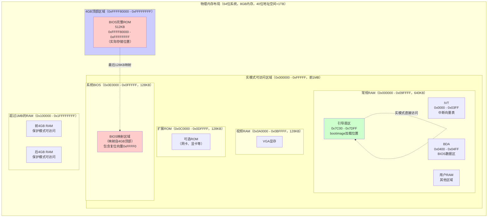

# x86 CPU 运行模式详解

本文档详细解释 x86 CPU 的运行模式（实模式和保护模式），包括模式特性、地址计算、段寄存器使用、模式切换等核心概念。

## 实模式（Real Mode）与保护模式（Protected Mode）详解

**实模式（Real Mode）**

实模式是 x86 CPU 的默认启动模式，也是最早的 x86 架构（8086/8088）的工作模式。

**特点：**

1. **16 位地址空间**
   - 使用段地址（Segment）和偏移地址（Offset）的组合
   - 物理地址 = 段地址 × 16 + 偏移地址
   - 例如：`0x07C0:0x0000` = `0x07C0 × 16 + 0x0000` = `0x7C00`
   - 最大可访问地址：`0xFFFF:0xFFFF` = `0x10FFEF`（约 1MB + 64KB）

2. **直接访问物理内存**
   - 没有内存保护机制
   - 任何程序都可以访问任何内存地址
   - 没有权限检查，没有虚拟内存

3. **中断向量表（IVT）**
   - 固定位置：`0x0000:0000` 到 `0x0000:03FF`（1024 字节）
   - 每个中断向量占 4 字节（段地址 2 字节 + 偏移地址 2 字节）
   - 共 256 个中断向量（0x00 - 0xFF）

4. **单任务执行**
   - 不支持多任务
   - 不支持任务切换
   - 程序直接控制 CPU

5. **寄存器限制**
   - 16 位寄存器（AX, BX, CX, DX, SI, DI, BP, SP）
   - 段寄存器（CS, DS, ES, SS, FS, GS）
   - 标志寄存器（FLAGS）

**保护模式（Protected Mode）**

保护模式是 x86 CPU 引入的工作模式，提供了内存保护、多任务等现代操作系统需要的功能。**80286 首次引入保护模式，80386 扩展为 32 位保护模式。**

**保护模式的历史演进：**

| CPU | 数据总线 | 地址总线 | 保护模式特性 | 地址空间 |
|-----|---------|---------|------------|---------|
| **80286** | 16 位 | 24 位 | **16 位保护模式**（首次引入） | 16MB |
| **80386+** | 32 位 | 32 位 | **32 位保护模式**（扩展） | 4GB |

**关键澄清：80286 的保护模式仍然是保护模式，不是"中间模式"**

- **80286 的保护模式**：完整的保护模式，有内存保护、特权级、多任务支持
- **与 80386 的区别**：80286 使用 16 位段，80386 使用 32 位段
- **不是"中间模式"**：这是保护模式的早期版本，不是实模式和保护模式的中间状态

**特点：**

1. **地址空间（取决于 CPU）**
   - **80286**：可以访问 16MB 的线性地址空间（`0x000000 - 0xFFFFFF`）
   - **80386+**：可以访问 4GB 的线性地址空间（`0x00000000` - `0xFFFFFFFF`）
   - 使用段选择子和偏移地址
   - 通过段描述符表（GDT/LDT）进行地址转换

2. **内存保护机制**
   - **段级保护**：通过段描述符设置访问权限（读/写/执行）
   - **页级保护**：通过页表设置页面权限（读/写/执行）
   - **特权级（Ring）**：Ring 0（内核）、Ring 1-2（驱动）、Ring 3（用户程序）
   - **权限检查**：CPU 硬件自动检查访问权限

3. **中断描述符表（IDT）**
   - 位置由 IDTR 寄存器指定（不固定）
   - 每个中断描述符占 8 字节（包含段选择子、偏移地址、权限等）
   - 支持中断门、陷阱门、任务门

4. **多任务支持**
   - 支持任务切换
   - 每个任务有独立的地址空间
   - 通过任务状态段（TSS）管理任务

5. **虚拟内存**
   - 支持分页机制
   - 可以将虚拟地址映射到物理地址
   - 支持页面交换（swap）

**实模式 vs 保护模式对比：**

| 特性 | 实模式（Real Mode） | 80286 保护模式 | 80386+ 保护模式 |
|------|-------------------|--------------|---------------|
| **数据总线** | 16 位 | 16 位 | 32 位 |
| **地址总线** | 20 位（8086）或 24 位（80286+） | 24 位 | 32 位 |
| **地址空间** | 1MB（20 位）或 1MB（24 位，但实模式限制） | 16MB（24 位） | 4GB（32 位） |
| **段大小** | 16 位段地址 | 16 位段（段描述符） | 32 位段（段描述符） |
| **地址计算** | 段地址 × 16 + 偏移 | 段选择子 → 段描述符 → 线性地址 | 段选择子 → 段描述符 → 线性地址 |
| **内存保护** | ❌ 无 | ✅ 有（段级） | ✅ 有（段级 + 页级） |
| **特权级** | ❌ 无 | ✅ 有（Ring 0-3） | ✅ 有（Ring 0-3） |
| **中断表** | IVT（固定位置） | IDT（可配置位置） | IDT（可配置位置） |
| **多任务** | ❌ 不支持 | ✅ 支持 | ✅ 支持 |
| **虚拟内存** | ❌ 不支持 | ❌ 不支持（无分页） | ✅ 支持（分页） |
| **寄存器** | 16 位 | 16 位 | 32 位 |
| **使用场景** | BIOS、引导程序 | 早期多任务操作系统 | 现代操作系统 |

**关键澄清：**

1. **80286 的保护模式仍然是保护模式**：
   - 有完整的内存保护机制
   - 有特权级（Ring 0-3）
   - 支持多任务
   - **不是"中间模式"**，而是保护模式的早期版本

2. **80286 vs 80386 保护模式的区别**：
   - **80286**：16 位段，24 位地址空间（16MB），无分页
   - **80386+**：32 位段，32 位地址空间（4GB），有分页

3. **访问 24 位地址总线算什么模式？**
   - **实模式**：即使有 24 位地址总线，实模式仍然只能访问前 1MB
   - **保护模式**：在保护模式下，80286 可以访问完整的 16MB（24 位地址空间）
   - **结论**：访问 24 位地址总线需要保护模式，不是"中间模式"

**关键问题：实模式需要段寄存器访问内存，而保护模式不需要，对吗？**

**答案：不对。实模式和保护模式都需要使用段寄存器，但使用方式不同。实模式使用段地址直接计算物理地址，保护模式使用段选择子通过段描述符计算线性地址。**

**详细说明：**

1. **实模式：必须使用段寄存器**
   ```asm
   ; 实模式内存访问示例
   
   ; 方式 1：使用段寄存器（必须）
   mov ax, 0x07C0      ; 段地址
   mov ds, ax           ; 设置数据段寄存器
   mov bx, 0x0000       ; 偏移地址
   mov al, [bx]         ; 访问 0x07C0:0x0000 = 0x7C00
   
   ; 方式 2：使用段前缀（必须）
   mov ax, [0x7C00]     ; 错误！实模式不能直接使用线性地址
   mov ax, ds:[0x0000]  ; 正确！使用段寄存器 DS
   mov ax, es:[0x0000]  ; 正确！使用段寄存器 ES
   
   ; 方式 3：显式段地址（必须）
   mov ax, 0x07C0
   mov ds, ax
   mov si, 0x0000
   lodsb                ; 从 DS:SI 读取，访问 0x07C0:0x0000 = 0x7C00
   ```

2. **保护模式：也需要使用段寄存器（但方式不同）**
   ```asm
   ; 保护模式内存访问示例（32 位）
   
   ; 方式 1：使用段选择子（必须，但通过 GDT 转换）
   mov ax, 0x10         ; 段选择子（指向 GDT[2]，数据段）
   mov ds, ax           ; 设置数据段寄存器（段选择子）
   mov ebx, 0x00000000  ; 32 位偏移地址
   mov al, [ebx]        ; 访问：段选择子 → GDT[2] → 线性地址 + 偏移
   
   ; 方式 2：扁平内存模型（仍然需要段寄存器，但基址为 0）
   ; 在扁平内存模型中，段描述符的基址为 0，界限为 4GB
   ; 因此线性地址 = 偏移地址（段寄存器仍然需要，但基址为 0）
   mov ax, 0x10         ; 段选择子（数据段，基址 = 0）
   mov ds, ax           ; 设置数据段寄存器
   mov ebx, 0x00007C00  ; 32 位偏移地址
   mov al, [ebx]        ; 访问：0 + 0x7C00 = 0x7C00（线性地址）
   
   ; 方式 3：64 位长模式（段寄存器基本不使用，除了 FS/GS）
   ; 64 位模式下，CS、DS、ES、SS 被忽略（基址为 0）
   ; 只有 FS 和 GS 可以用于线程本地存储
   mov rax, [0x7C00]    ; 64 位模式下可以直接使用线性地址
   mov rax, fs:[0x0000] ; FS 可以用于线程本地存储
   ```

3. **实模式 vs 保护模式的段寄存器使用对比**

   | 特性 | 实模式 | 保护模式（32 位） | 长模式（64 位） |
   |------|--------|-----------------|---------------|
   | **段寄存器含义** | 段地址（16 位） | 段选择子（16 位） | 基本不使用（除了 FS/GS） |
   | **地址计算** | 段地址 × 16 + 偏移 | 段选择子 → GDT → 基址 + 偏移 | 直接使用线性地址 |
   | **是否必须** | ✅ 必须使用 | ✅ 必须使用（但可通过扁平模型简化） | ❌ 基本不使用 |
   | **示例** | `mov ax, [bx]`（使用 DS） | `mov eax, [ebx]`（使用 DS，但基址可能为 0） | `mov rax, [rbx]`（不使用段寄存器） |

4. **实模式汇编示例（必须使用段寄存器）**
   ```asm
   ; 实模式：访问内存地址 0x7C00
   
   ; 方法 1：设置段寄存器
   mov ax, 0x07C0       ; 段地址 = 0x07C0
   mov ds, ax           ; DS = 0x07C0
   mov bx, 0x0000       ; 偏移 = 0x0000
   mov al, [bx]         ; 访问 DS:BX = 0x07C0:0x0000 = 0x7C00
   
   ; 方法 2：使用段前缀
   mov ax, 0x0000
   mov ds, ax           ; DS = 0x0000
   mov bx, 0x7C00       ; 偏移 = 0x7C00
   mov al, [bx]         ; 访问 DS:BX = 0x0000:0x7C00 = 0x7C00
   
   ; 方法 3：使用 ES 段寄存器
   mov ax, 0x07C0
   mov es, ax           ; ES = 0x07C0
   mov di, 0x0000
   mov al, es:[di]      ; 访问 ES:DI = 0x07C0:0x0000 = 0x7C00
   ```

5. **保护模式汇编示例（仍然需要段寄存器，但方式不同）**
   ```asm
   ; 保护模式（32 位）：访问内存地址 0x7C00
   
   ; 步骤 1：设置 GDT（全局描述符表）
   gdt:
       ; 索引 0：空描述符
       dd 0x00000000
       dd 0x00000000
       
       ; 索引 1：代码段（0x08），基址 = 0，界限 = 4GB
       dw 0xFFFF        ; 界限（低 16 位）
       dw 0x0000        ; 基址（低 16 位）
       db 0x00          ; 基址（中 8 位）
       db 0x9A          ; 访问权限：可执行、可读、Ring 0
       db 0xCF          ; 标志：32 位，粒度 4KB
       db 0x00          ; 基址（高 8 位）
       
       ; 索引 2：数据段（0x10），基址 = 0，界限 = 4GB
       dw 0xFFFF        ; 界限（低 16 位）
       dw 0x0000        ; 基址（低 16 位）
       db 0x00          ; 基址（中 8 位）
       db 0x92          ; 访问权限：可读写、Ring 0
       db 0xCF          ; 标志：32 位，粒度 4KB
       db 0x00          ; 基址（高 8 位）
   
   ; 步骤 2：切换到保护模式
   lgdt [gdt_descriptor]
   mov eax, cr0
   or eax, 1
   mov cr0, eax
   jmp 0x08:protected_mode_code
   
   ; 步骤 3：保护模式下访问内存（仍然需要段寄存器）
   .code32
   protected_mode_code:
       mov ax, 0x10     ; 段选择子（索引 2，数据段）
       mov ds, ax       ; DS = 0x10（段选择子，不是段地址！）
       mov ebx, 0x7C00  ; 32 位偏移地址
       mov al, [ebx]    ; 访问：段选择子 0x10 → GDT[2] → 基址 0 + 偏移 0x7C00 = 0x7C00
       
       ; 注意：虽然段寄存器仍然需要，但通过扁平内存模型（基址 = 0）
       ; 线性地址 = 偏移地址，看起来像"不需要段寄存器"
       ; 但实际上段寄存器仍然在使用，只是基址为 0
   ```

6. **64 位长模式（段寄存器基本不使用）**
   ```asm
   ; 64 位长模式：访问内存地址 0x7C00
   
   .code64
   long_mode_code:
       ; 64 位模式下，CS、DS、ES、SS 被忽略（基址固定为 0）
       ; 可以直接使用线性地址，不需要段寄存器
       mov rax, [0x7C00]    ; 直接访问线性地址 0x7C00
       mov rbx, 0x7C00
       mov rax, [rbx]       ; 使用寄存器间接访问
       
       ; FS 和 GS 仍然可以使用（用于线程本地存储）
       mov rax, fs:[0x0000] ; FS 可以用于线程本地存储
       mov rax, gs:[0x0000] ; GS 可以用于线程本地存储
   ```

**总结：**

1. **实模式**：必须使用段寄存器，段地址 × 16 + 偏移 = 物理地址
2. **保护模式（32 位）**：必须使用段寄存器，但通过段选择子和 GDT 转换，扁平内存模型中基址为 0
3. **长模式（64 位）**：基本不使用段寄存器（除了 FS/GS），直接使用线性地址

**关键点**：保护模式仍然需要段寄存器，只是使用方式不同（段选择子 vs 段地址），在扁平内存模型中看起来像"不需要"，但实际上段寄存器仍然在使用。

**模式切换：**

1. **实模式 → 保护模式**
   ```asm
   ; 1. 设置 GDT（全局描述符表）
   lgdt [gdt_descriptor]
   
   ; 2. 设置 CR0 寄存器的 PE 位（Protection Enable）
   mov eax, cr0
   or eax, 1
   mov cr0, eax
   
   ; 3. 远跳转到保护模式代码
   jmp 0x08:protected_mode_code
   ```
   
   **`0x08` 的含义：段选择子（Segment Selector）**
   
   `0x08` 是保护模式下的**段选择子**，不是实模式的段地址。
   
   **段选择子的结构（16位）：**
   ```
   Bit 15-3: 索引（Index）- 指向GDT中的描述符
   Bit 2:    TI（Table Indicator）- 0=GDT, 1=LDT
   Bit 1-0:  RPL（Requested Privilege Level）- 特权级（0-3）
   ```
   
   **`0x08` 的解析：**
   - **二进制**：`0000 0000 0000 1000`
   - **索引**：`0x08 / 8 = 1`（每个描述符占8字节）
   - **TI**：`0`（使用GDT）
   - **RPL**：`0`（Ring 0，最高特权级）
   - **含义**：指向GDT中的第1个描述符（索引1），通常是代码段描述符
   
   **为什么是索引1？**
   
   GDT的结构通常是：
   ```
   GDT[0]: 空描述符（NULL descriptor，必须为0）
   GDT[1]: 代码段描述符（Code segment descriptor）
   GDT[2]: 数据段描述符（Data segment descriptor）
   ...
   ```
   
   - 索引0是空描述符，不能使用
   - 索引1通常是代码段描述符（32位，可执行，Ring 0）
   - 所以 `0x08`（索引1）指向代码段
   
   **段选择子 vs 实模式段地址：**
   
   | 特性 | 实模式段地址 | 保护模式段选择子 |
   |------|------------|----------------|
   | **格式** | 16位段地址（如 `0x07C0`） | 16位选择子（如 `0x08`） |
   | **含义** | 段基址 = 段地址 × 16 | 索引GDT/LDT中的描述符 |
   | **计算** | 物理地址 = 段地址 × 16 + 偏移 | 线性地址 = 段描述符基址 + 偏移 |
   | **示例** | `0x07C0:0x0000` = `0x7C00` | `0x08:offset` = 通过GDT[1]计算 |
   
   **完整的GDT示例：**
   ```asm
   gdt:
       ; 索引0：空描述符（必须为0）
       dd 0x00000000
       dd 0x00000000
       
       ; 索引1：32位代码段（0x08）
       dw 0xFFFF      ; 段界限（低16位）
       dw 0x0000      ; 段基址（低16位）
       db 0x00        ; 段基址（中8位）
       db 0x9A        ; 访问权限：可执行、可读、Ring 0
       db 0xCF        ; 标志：32位，粒度4KB
       db 0x00        ; 段基址（高8位）
       
       ; 索引2：32位数据段（0x10）
       dw 0xFFFF
       dw 0x0000
       db 0x00
       db 0x92        ; 访问权限：可读写、Ring 0
       db 0xCF
       db 0x00
   
   gdt_descriptor:
       dw gdt_end - gdt - 1  ; GDT大小
       dd gdt                ; GDT地址
   gdt_end:
   ```
   
   在这个例子中：
   - `0x08` = 索引1 = 代码段描述符
   - `0x10` = 索引2 = 数据段描述符

2. **保护模式 → 实模式**
   ```asm
   ; 1. 清除 CR0 寄存器的 PE 位
   mov eax, cr0
   and eax, 0xFFFFFFFE
   mov cr0, eax
   
   ; 2. 远跳转到实模式代码
   jmp 0x0000:real_mode_code
   ```

**x86 架构的演进历史：**

| CPU | 数据总线 | 地址总线 | 实模式地址空间 | 保护模式地址空间 | 保护模式特性 |
|-----|---------|---------|--------------|----------------|------------|
| **8086/8088** | 16 位 | 20 位 | 1MB | ❌ 不支持保护模式 | - |
| **80286** | 16 位 | 24 位 | 1MB（限制） | 16MB | ✅ 16 位保护模式（首次引入） |
| **80386** | 32 位 | 32 位 | 1MB（限制） | 4GB | ✅ 32 位保护模式（扩展） |
| **80486+** | 32 位 | 32 位 | 1MB（限制） | 4GB | ✅ 32 位保护模式（增强） |
| **x86-64** | 64 位 | 40-52 位 | 1MB（限制） | 256TB+ | ✅ 长模式（64 位） |

**关键问题：x86 架构有只有 16bit 内存长度的架构吗？**

**答案：没有。即使是 8086/8088（最早的 x86 CPU），也有 20 位地址总线，可以访问 1MB 内存。**

**详细说明：**

1. **8086/8088（最早的 x86 CPU）**
   - **数据总线**：16 位
   - **地址总线**：20 位（不是 16 位！）
   - **可访问内存**：1MB（`0x00000 - 0xFFFFF`）
   - **实模式**：可以访问完整的 1MB
   - **保护模式**：不支持（80286 才引入）

2. **为什么 8086 有 20 位地址总线？**
   - 8086 设计时使用**段地址 + 偏移地址**的方式
   - 段地址（16 位）× 16 + 偏移地址（16 位）= 20 位物理地址
   - 因此需要 20 位地址总线来访问 1MB 内存

3. **地址总线 vs 数据总线**
   - **数据总线**：决定 CPU 一次可以传输多少位数据（16 位、32 位、64 位）
   - **地址总线**：决定 CPU 可以访问多少内存（20 位 = 1MB，24 位 = 16MB，32 位 = 4GB）
   - **两者独立**：16 位 CPU 可以有 20 位、24 位或 32 位地址总线

**关键问题：8086/8088 这种机器的 BIOS 多大，是否需要用满 20 位地址总线？**

**答案：8086/8088 的 BIOS 通常是 8KB - 64KB，不需要用满 20 位地址总线。BIOS 存储在地址空间顶部（如 `0xF0000-0xFFFFF`，64KB），但实际 BIOS 可能更小。**

**详细说明：**

1. **8086/8088 的 BIOS 大小**
   - **IBM PC（1981）**：8KB - 64KB
   - **IBM PC/XT（1983）**：标准 64KB ROM
   - **典型大小**：64KB（`0xF0000 - 0xFFFFF`）

2. **BIOS 存储位置（8086/8088，20 位地址总线）**
   ```
   20 位地址空间（1MB = 0x100000）：
   
   0x00000 - 0x9FFFF：常规 RAM（640KB）
   0xA0000 - 0xBFFFF：视频 RAM（128KB）
   0xC0000 - 0xDFFFF：扩展 ROM（128KB）
   0xE0000 - 0xEFFFF：系统 BIOS 扩展（64KB，可选）
   0xF0000 - 0xFFFFF：系统 BIOS（64KB）← BIOS 存储位置
   
   如果 BIOS 是 64KB：
   - 完整 BIOS：0xF0000 - 0xFFFFF（64KB，1MB 地址空间顶部）
   - 计算：0x100000 - 0x10000 = 0xF0000
   - 复位向量：0xFFFF0（在 BIOS 的最后 16 字节）
   
   如果 BIOS 是 32KB：
   - 完整 BIOS：0xF8000 - 0xFFFFF（32KB，1MB 地址空间顶部）
   - 计算：0x100000 - 0x8000 = 0xF8000
   - 复位向量：0xFFFF0（在 BIOS 的最后 16 字节）
   ```

3. **是否需要用满 20 位地址总线？**
   - **不需要**：BIOS 通常只有 8KB - 64KB，远小于 1MB
   - **地址空间分配**：前 1MB 中，只有最后 64KB - 128KB 用于 BIOS
   - **实际使用**：BIOS 只占用地址空间顶部的一小部分，不需要用满 20 位地址总线

4. **8086/8088 的地址空间使用**
   ```
   20 位地址总线可以访问 1MB（0x00000 - 0xFFFFF）：
   
   - 0x00000 - 0x9FFFF：640KB（常规 RAM）
   - 0xA0000 - 0xBFFFF：128KB（视频 RAM）
   - 0xC0000 - 0xDFFFF：128KB（扩展 ROM）
   - 0xE0000 - 0xEFFFF：64KB（系统 BIOS 扩展，可选）
   - 0xF0000 - 0xFFFFF：64KB（系统 BIOS）
   
   总计：640KB + 128KB + 128KB + 64KB + 64KB = 1024KB = 1MB
   
   注意：BIOS 只占用最后 64KB，不需要用满 20 位地址总线
   ```

**长模式（Long Mode，64 位）：**

长模式是 64 位 x86 CPU（x86-64）的工作模式，是保护模式的扩展：

- **64 位地址空间**：可以访问 256TB 或更大的地址空间
- **扁平内存模型**：段寄存器基本不使用（除了 FS/GS）
- **兼容模式**：可以在长模式下运行 32 位程序
- **现代操作系统**：Linux、Windows 64 位版本都在长模式下运行

**实模式地址与物理内存的映射关系：**

**关键问题：实模式运行时的地址对应物理内存的哪部分？**

**答案：实模式下的地址（0x000000 - 0xFFFFF）直接对应物理内存的前1MB，这是硬件层面的直接映射。**

**详细映射关系：**

1. **实模式地址空间（0x000000 - 0xFFFFF）**
   ```
   实模式地址范围：0x000000 - 0xFFFFF（1MB）
   
   地址映射：
   - 0x000000 - 0x09FFFF：常规RAM（约640KB）
     └─ 包括：IVT、BDA、用户程序、引导扇区（0x7C00）等
   - 0x0A0000 - 0x0BFFFF：视频RAM（128KB）
     └─ VGA显存区域
   - 0x0C0000 - 0x0DFFFF：扩展BIOS ROM（128KB）
     └─ 可选ROM（如网卡、显卡的ROM）
   - 0x0E0000 - 0x0EFFFF：系统BIOS扩展（64KB）
     └─ 未使用或保留
   - 0x0F0000 - 0x0FFFFF：系统BIOS（64KB）
     └─ BIOS的最后64KB，包含复位向量（0xFFFF0）
   ```

2. **物理内存的直接映射**
   - **实模式地址 = 物理地址**（在前1MB范围内）
   - 例如：实模式地址 `0x7C00` = 物理地址 `0x7C00`
   - 例如：实模式地址 `0xFFFF0` = 物理地址 `0xFFFF0`
   - **没有地址转换**：实模式下CPU直接使用物理地址

3. **BIOS ROM的特殊映射**
   ```
   BIOS完整存储位置：0xFFFF80000 - 0xFFFFFFFF（4GB顶部，512KB示例）
   
   但最后128KB同时映射到实模式可访问区域：
   - 0x0E0000 - 0x0FFFFF：映射到BIOS ROM的最后128KB
   
   这样设计的原因：
   - CPU复位后从0xFFFF0开始执行（实模式可访问）
   - BIOS代码需要能在实模式下访问
   - 通过硬件地址解码实现双重映射
   
   **重要澄清：映射 vs 复制**
   
   **关键问题1：映射到前1MB的128KB BIOS代码，是被复制到DRAM里面的1MB了吗？**
   
   **答案：不是复制，而是映射。真实硬件是硬件地址映射，QEMU是内存别名。**
   
   **关键问题2：4GB顶部的完整BIOS（0xFFFF80000-0xFFFFFFFF），是映射地址还是拷贝到RAM？**
   
   **答案：也是映射，不是拷贝。无论是128KB映射部分还是4GB顶部的完整BIOS，都是硬件地址映射，BIOS代码始终存储在Flash ROM芯片中，没有复制到DRAM。**
   
   **真实硬件（硬件地址映射）：**
   
   - **不是复制**：BIOS代码仍然存储在Flash ROM芯片中
   - **硬件映射**：通过内存控制器（Chipset）的地址解码器实现
   - **访问机制**：CPU访问地址`0xE0000-0xFFFFF`或`0xFFFF80000-0xFFFFFFFF`时，硬件自动路由到Flash ROM芯片
   - **物理位置**：BIOS代码**不在DRAM中**，仍然在Flash ROM芯片中
   - **双重映射**：同一块Flash ROM内容通过硬件地址解码映射到两个地址范围：
     - `0xFFFF80000 - 0xFFFFFFFF`（4GB顶部，完整BIOS）← **也是映射，不是拷贝**
     - `0xE0000 - 0xFFFFF`（前1MB，最后128KB）← **也是映射，不是拷贝**
   ```

   > **详细说明**：关于BIOS ROM双重映射的完整解释，请参见 [BIOS_MEMORY_LAYOUT.md - BIOS ROM的特殊映射](BIOS_MEMORY_LAYOUT.md#bios-rom的特殊映射) 章节。

4. **引导扇区的加载位置**
   ```
   引导扇区加载到：0x7C00（实模式地址）
   
   这对应物理内存的：
   - 物理地址：0x7C00
   - 位于前1MB的常规RAM区域
   - 实模式下可以直接访问
   ```

**实际内存布局示例：**

假设系统有8GB物理内存，BIOS是512KB：

```
物理内存布局（64位系统，40位物理地址空间 = 1TB）：

0x0000000000000000 - 0x000000000009FFFF (640KB)
├─ 常规RAM
├─ IVT (0x0000 - 0x03FF)
├─ BDA (0x0400 - 0x04FF)
└─ 引导扇区 (0x7C00 - 0x7DFF)

0x00000000000A0000 - 0x00000000000BFFFF (128KB)
└─ 视频RAM

0x00000000000C0000 - 0x00000000000DFFFF (128KB)
└─ 扩展BIOS ROM

0x00000000000E0000 - 0x00000000000FFFFF (128KB)
└─ 系统BIOS（映射自4GB顶部的BIOS ROM）

0x0000000000100000 - 0x0000000001FFFFFF (前4GB RAM)
└─ 常规RAM（保护模式可访问）

0x0000000002000000 - 0x000000001FFFFFFFF (后4GB RAM)
└─ 超过4GB的RAM（保护模式可访问）

0x00000000FFFF80000 - 0x00000000FFFFFFFF (512KB)
└─ BIOS完整ROM（4GB顶部）
```

**实模式访问的限制：**

1. **只能访问前1MB**
   - 实模式地址范围：`0x000000` - `0xFFFFF`
   - 对应物理内存：前1MB
   - 超过1MB的物理内存：实模式下无法直接访问

2. **A20地址线的影响**
   - 8086/8088：20位地址总线，最大地址 `0xFFFFF`
   - 80286+：21位地址总线，最大地址 `0x10FFEF`（需要A20使能）
   - A20未使能时：地址 `0x100000` 会回绕到 `0x000000`

3. **地址回绕（Address Wraparound）**
   ```
   实模式地址计算：
   0xFFFF:0x0010 = 0xFFFF0 + 0x0010 = 0x100000
   
   如果A20未使能：
   0x100000 → 回绕到 0x000000
   
   如果A20已使能：
   0x100000 → 实际访问 0x100000（但超出实模式范围）
   ```

**物理内存布局可视化：**



**关键说明：**

1. **BIOS的双重存在**
   - **完整BIOS**：存储在4GB顶部（`0xFFFF80000 - 0xFFFFFFFF`），这是实际的Flash ROM位置
   - **BIOS映射**：最后128KB映射到实模式可访问的 `0xE0000 - 0xFFFFF`
   - **为什么需要映射**：CPU复位后从 `0xFFFF0` 开始执行，必须在实模式可访问范围内
   - > **详细说明**：关于BIOS ROM双重映射的完整解释，请参见 [BIOS_MEMORY_LAYOUT.md - BIOS ROM的特殊映射](BIOS_MEMORY_LAYOUT.md#bios-rom的特殊映射) 章节。

2. **实模式1MB区域在物理内存中的实际位置**

   **关键答案：实模式的1MB中，前896KB（0x000000 - 0xDFFFF）对应物理内存的最开始896KB，这是真正的DRAM芯片。**

   **详细说明：**
   
   - **0x000000 - 0xDFFFF（896KB）**：
     - **位置**：物理内存的最开始896KB
     - **类型**：真正的DRAM（动态随机存取存储器）
     - **对应关系**：实模式地址 = 物理地址（直接对应）
     - **包含内容**：
       - **常规RAM（0x000000 - 0x09FFFF，640KB）**：物理RAM的最开始640KB
         - IVT、BDA、引导扇区（0x7C00）、用户程序
       - **视频RAM（0x0A0000 - 0x0BFFFF，128KB）**：VGA显存（硬件映射到显卡）
       - **扩展ROM（0x0C0000 - 0x0DFFFF，128KB）**：可选ROM（硬件映射到扩展卡）
   
   - **0xE0000 - 0xFFFFF（128KB）**：
     - **位置**：**不是物理RAM，是BIOS ROM的映射**
     - **类型**：BIOS Flash ROM的映射区域
     - **实际存储位置**：4GB顶部（`0xFFFF80000 - 0xFFFFFFFF`）
     - **映射方式**：通过硬件地址解码器映射到前1MB
     - **包含内容**：系统BIOS的最后128KB，包含复位向量（0xFFFF0）

   > **关于"4GB顶部"的详细解释，请参见 [BIOS_MEMORY_LAYOUT.md - 为什么 BIOS 存储在 4GB 地址空间顶部？](BIOS_MEMORY_LAYOUT.md#问题-2为什么-bios-存储在-4gb-地址空间顶部)**

---

## 相关文档

- [BIOS 内存布局与地址映射详解](BIOS_MEMORY_LAYOUT.md)
- [BIOS 内存模式 Q&A](BIOS_MEMORY_QA.md)
- [Linux 用户空间内存模型详解](LINUX_USERSPACE_MEMORY.md) - Linux 用户空间的内存模型和汇编内存访问
- [BIOS 中断处理完整指南](BIOS_INTERRUPT_COMPLETE.md)
