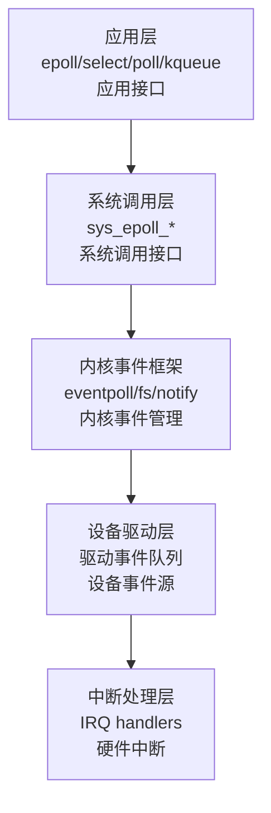
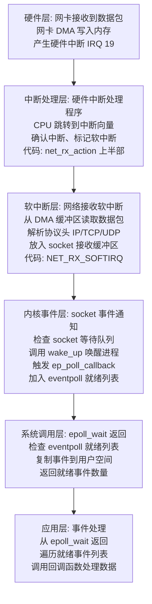
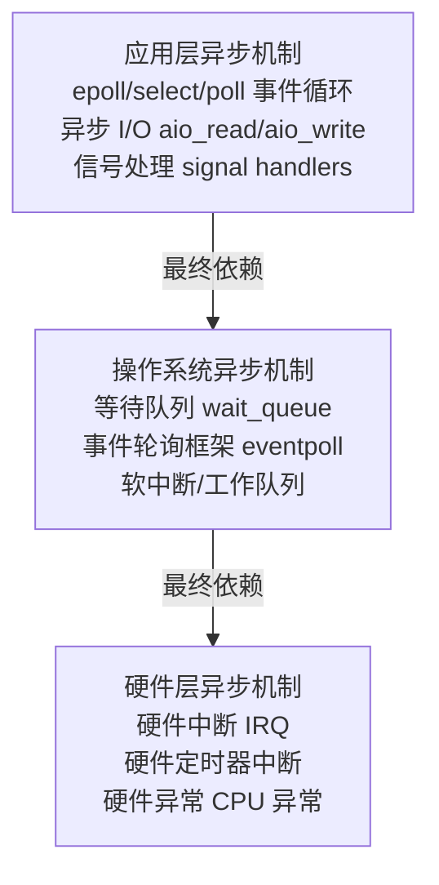
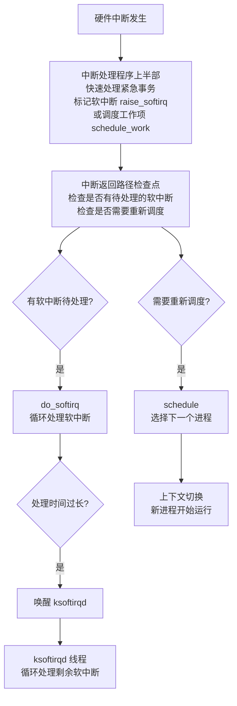

# QEMU → SeaBIOS → Linux Kernel 启动流程详解

本文档详细介绍了从 QEMU 虚拟硬件启动到 Linux 内核接管系统的完整流程，包括 SeaBIOS 的加载、中断服务初始化，以及内核如何接管 BIOS 并建立自己的中断处理机制。

---

## 目录

1. [QEMU 加载 SeaBIOS](#1-qemu-加载-seabios)
2. [SeaBIOS 初始化中断服务](#2-seabios-初始化中断服务)
3. [Linux 内核接管 BIOS](#3-linux-内核接管-bios)

---

## 1. QEMU 加载 SeaBIOS

### 1.1 系统固件初始化入口

QEMU 在创建 PC 虚拟机时，会调用系统固件初始化函数来加载 BIOS。源代码位置：`qemu/hw/i386/pc_sysfw.c:215-285`

```c
// QEMU 系统固件初始化函数：决定如何加载 BIOS（SeaBIOS）
void pc_system_firmware_init(PCMachineState *pcms,
                             MemoryRegion *rom_memory)
{
    PCMachineClass *pcmc = PC_MACHINE_GET_CLASS(pcms);
    int i;
    BlockBackend *pflash_blk[ARRAY_SIZE(pcms->flash)];  // pflash 块设备数组

    // 如果 PCI 未启用（老式 PC），直接加载 BIOS ROM
    if (!pcmc->pci_enabled) {
        // 如果没有指定 IGVM 文件，则加载默认的 bios.bin（SeaBIOS）
        if (!X86_MACHINE(pcms)->igvm) {
            x86_bios_rom_init(X86_MACHINE(pcms), "bios.bin", rom_memory, true);
        }
        return;
    }

    // 将传统的 -drive if=pflash 命令行参数映射到机器属性
    for (i = 0; i < ARRAY_SIZE(pcms->flash); i++) {
        pflash_cfi01_legacy_drive(pcms->flash[i],
                                  drive_get(IF_PFLASH, 0, i));
        pflash_blk[i] = pflash_cfi01_get_blk(pcms->flash[i]);  // 获取块设备指针
    }

    // 检查 pflash 配置：不允许有间隙（如果 pflash1 存在，pflash0 必须存在）
    for (i = 1; i < ARRAY_SIZE(pcms->flash); i++) {
        if (pflash_blk[i] && !pflash_blk[i - 1]) {
            error_report("pflash%d requires pflash%d", i, i - 1);
            exit(1);
        }
    }

    // 如果没有配置 pflash0，使用 ROM 模式加载 BIOS
    if (!pflash_blk[0]) {
        // 除非使用 IGVM，否则加载默认的 bios.bin
        if (!X86_MACHINE(pcms)->igvm) {
            x86_bios_rom_init(X86_MACHINE(pcms), "bios.bin", rom_memory, false);
        }
    } else {
        // 如果配置了 pflash，检查 KVM 是否支持只读内存执行
        if (kvm_enabled() && !kvm_readonly_mem_enabled()) {
            // 旧版 KVM 无法从设备内存执行代码，需要只读内存支持
            error_report("pflash with kvm requires KVM readonly memory support");
            exit(1);
        }

        // 映射 flash 内存区域
        pc_system_flash_map(pcms, rom_memory);
    }

    // 清理未使用的 flash 设备
    pc_system_flash_cleanup_unused(pcms);

    // 使用 IGVM 时不应该配置 pflash 设备
    if (X86_MACHINE(pcms)->igvm) {
        for (i = 0; i < ARRAY_SIZE(pcms->flash); i++) {
            if (pcms->flash[i]) {
                error_report("pflash devices cannot be configured when "
                             "using IGVM");
                exit(1);
            }
        }
    }
}
```

**关键点：**
- 第 228 行或 254 行：如果没有配置 pflash，调用 `x86_bios_rom_init()` 加载默认的 `bios.bin`（SeaBIOS）
- 第 267 行：如果配置了 pflash，则映射 flash 内存区域

### 1.2 BIOS ROM 加载实现

源代码位置：`qemu/hw/i386/x86-common.c:1027-1092`

```c
// 实际加载 BIOS ROM 文件到内存的函数
void x86_bios_rom_init(X86MachineState *x86ms, const char *default_firmware,
                       MemoryRegion *rom_memory, bool isapc_ram_fw)
{
    const char *bios_name;
    char *filename;
    int bios_size;
    ssize_t ret;

    // 步骤 1: 确定 BIOS 文件名（优先使用用户指定的，否则使用默认的 "bios.bin"）
    bios_name = MACHINE(x86ms)->firmware ?: default_firmware;
    
    // 步骤 2: 查找 BIOS 文件路径
    filename = qemu_find_file(QEMU_FILE_TYPE_BIOS, bios_name);
    if (filename) {
        bios_size = get_image_size(filename, NULL);  // 获取文件大小
    } else {
        bios_size = -1;  // 文件未找到
    }
    
    // 步骤 3: 验证 BIOS 文件大小（必须大于 0 且是 64KB 的倍数）
    if (bios_size <= 0 ||
        (bios_size % 65536) != 0) {
        goto bios_error;
    }
    
    // 步骤 4: 初始化 BIOS 内存区域
    if (machine_require_guest_memfd(MACHINE(x86ms))) {
        // 使用 guest_memfd（用于安全虚拟机，如 TDX）
        memory_region_init_ram_guest_memfd(&x86ms->bios, NULL, "pc.bios",
                                           bios_size, &error_fatal);
        if (is_tdx_vm()) {
            tdx_set_tdvf_region(&x86ms->bios);  // TDX 特殊配置
        }
    } else {
        // 普通 RAM 内存区域
        memory_region_init_ram(&x86ms->bios, NULL, "pc.bios",
                               bios_size, &error_fatal);
    }
    
    // 步骤 5: 加载 BIOS 文件到内存
    if (sev_enabled() || is_tdx_vm()) {
        // 机密计算环境（SEV/TDX）：直接加载文件，不支持复位
        void *ptr = memory_region_get_ram_ptr(&x86ms->bios);
        load_image_size(filename, ptr, bios_size);  // 直接加载文件内容
        x86_firmware_configure(0x100000000ULL - bios_size, ptr, bios_size);
    } else {
        // 普通环境：注册为 ROM，支持复位时重新加载
        memory_region_set_readonly(&x86ms->bios, !isapc_ram_fw);
        // 将 BIOS 文件添加到 ROM，地址为 0xFFFFFFFF - bios_size（内存顶部）
        ret = rom_add_file_fixed(bios_name, (uint32_t)(-bios_size), -1);
        if (ret != 0) {
            goto bios_error;
        }
    }
    g_free(filename);

    // 步骤 6: 将 BIOS 的最后 128KB 映射到 ISA 空间（0xE0000-0xFFFFF）
    if (!machine_require_guest_memfd(MACHINE(x86ms))) {
        x86_isa_bios_init(&x86ms->isa_bios, rom_memory, &x86ms->bios,
                          !isapc_ram_fw);
    }

    // 步骤 7: 将整个 BIOS 映射到内存顶部（ROM 内存区域）
    memory_region_add_subregion(rom_memory,
                                (uint32_t)(-bios_size),  // 地址：4GB - bios_size
                                &x86ms->bios);
    return;

bios_error:
    fprintf(stderr, "qemu: could not load PC BIOS '%s'\n", bios_name);
    exit(1);
}
```

**关键步骤：**
1. **第 1036 行**：确定 BIOS 文件名（默认 `bios.bin`，即 SeaBIOS）
2. **第 1037-1042 行**：查找并获取 BIOS 文件大小
3. **第 1054-1055 行**：初始化 BIOS 内存区域（`pc.bios`）
4. **第 1070 行**：将 BIOS 文件加载到内存顶部（`0x100000000 - bios_size`，即 4GB 以下）
5. **第 1084-1086 行**：将 BIOS 内存区域映射到 ROM 内存空间

**内存布局：**
- BIOS 被映射到物理地址 `0xFFFFFFFF - bios_size` 到 `0xFFFFFFFF`
- 最后 128KB 同时映射到 ISA 空间 `0xE0000-0xFFFFF`
- CPU 复位后从 `0xFFFF0`（BIOS 入口点）开始执行

### 1.3 QEMU 软件实现 vs. 真实硬件加载 BIOS 的区别

QEMU 的 `x86_bios_rom_init()` 函数通过软件模拟 BIOS 的加载过程，与真实硬件存在显著差异。理解这些差异有助于更好地理解虚拟化的工作原理。

#### 1.3.1 存储介质差异

- **存储介质**
  - **真实硬件**: Flash ROM 芯片（如 SPI Flash、EEPROM）
  - **QEMU 软件实现**: 文件系统中的二进制文件（`bios.bin`）

- **物理位置**
  - **真实硬件**: 主板上的专用 ROM 芯片
  - **QEMU 软件实现**: 宿主机文件系统（如 `/usr/share/qemu/bios.bin`）

- **持久性**
  - **真实硬件**: 断电后内容保持不变
  - **QEMU 软件实现**: 文件内容由文件系统管理

- **访问方式**
  - **真实硬件**: CPU 通过内存映射 I/O 直接读取
  - **QEMU 软件实现**: QEMU 进程读取文件，写入模拟内存

**真实硬件示例：**
```
主板 Flash ROM 芯片
    ↓
CPU 内存控制器
    ↓
内存映射到 0xF0000-0xFFFFF
    ↓
CPU 直接从 ROM 读取指令
```

**QEMU 实现：**
```
宿主机文件系统：bios.bin
    ↓
QEMU 进程：read() 系统调用读取文件
    ↓
QEMU 内存管理：memory_region_init_ram()
    ↓
模拟内存映射到客户机 0xF0000-0xFFFFF
    ↓
客户机 CPU 从模拟内存读取（实际是 QEMU 管理的 RAM）
```

#### 1.3.2 加载时机和方式

**真实硬件：**
- **加载时机**：BIOS 代码永久存储在 ROM 芯片中，无需"加载"
- **加载方式**：CPU 复位后，内存控制器自动将 ROM 内容映射到内存地址空间
- **过程**：
  1. 系统加电
  2. CPU 复位，程序计数器（PC）指向 `0xFFFF0`
  3. 内存控制器将 ROM 芯片映射到 `0xF0000-0xFFFFF`
  4. CPU 直接从 ROM 读取并执行指令（**无需复制到 RAM**）

**QEMU 软件实现：**
- **加载时机**：QEMU 启动时，在创建虚拟机之前
- **加载方式**：QEMU 进程读取 BIOS 文件，写入模拟的 RAM 内存区域
- **过程**：
  1. QEMU 启动，调用 `x86_bios_rom_init()`
  2. 查找 BIOS 文件（`bios.bin`）
  3. 读取文件内容到 QEMU 进程内存
  4. 创建内存区域（`memory_region_init_ram()`）
  5. 将文件内容复制到模拟内存（`rom_add_file_fixed()` 或 `load_image_size()`）
  6. 映射到客户机地址空间 `0xF0000-0xFFFFF`

**关键代码分析：**

```c
// QEMU 需要显式读取文件并复制到内存
if (sev_enabled() || is_tdx_vm()) {
    void *ptr = memory_region_get_ram_ptr(&x86ms->bios);
    load_image_size(filename, ptr, bios_size);  // 从文件读取并复制
    x86_firmware_configure(0x100000000ULL - bios_size, ptr, bios_size);
} else {
    // 注册为 ROM，在复位时重新加载
    ret = rom_add_file_fixed(bios_name, (uint32_t)(-bios_size), -1);
}
```

#### 1.3.3 内存映射机制

**真实硬件：**
- **ROM 芯片**：物理上连接到内存总线，通过**内存映射 I/O（MMIO）**访问
- **只读特性**：硬件层面只读，CPU 无法修改 ROM 内容
- **地址映射**：由芯片组（Chipset）的**内存控制器**硬件实现
- **映射关系**：ROM 芯片的物理内容直接映射到内存地址，**无需 RAM 参与**

```
物理 ROM 芯片（Flash）
    ↓ [硬件连接]
内存控制器（Chipset）
    ↓ [地址解码]
CPU 地址空间 0xF0000-0xFFFFF
    ↓
CPU 读取指令（直接从 ROM 芯片）
```

**QEMU 实现：**
- **模拟 RAM**：BIOS 内容存储在 QEMU 管理的**普通 RAM** 中（虽然是"ROM"区域）
- **只读模拟**：通过 `memory_region_set_readonly()` **软件模拟**只读特性
- **地址映射**：由 QEMU 的**内存管理子系统**软件实现
- **映射关系**：QEMU 维护地址到内存区域的映射表，客户机访问时由 QEMU 处理

```c
// QEMU 创建可读写的 RAM 区域（虽然模拟 ROM）
memory_region_init_ram(&x86ms->bios, NULL, "pc.bios", bios_size, &error_fatal);

// 然后软件模拟只读特性
memory_region_set_readonly(&x86ms->bios, !isapc_ram_fw);
```

```
宿主机 RAM（QEMU 进程内存）
    ↓ [软件管理]
QEMU MemoryRegion 对象
    ↓ [地址映射表]
客户机地址空间 0xF0000-0xFFFFF
    ↓
客户机 CPU 访问（触发 QEMU 内存访问处理）
```

#### 1.3.4 复位（Reset）行为

**真实硬件：**
- **ROM 内容不变**：复位时 ROM 芯片内容保持不变
- **无需重新加载**：CPU 复位后直接访问 ROM，内容始终可用
- **硬件保证**：ROM 芯片是**非易失性存储**，断电后内容仍保留

**QEMU 实现：**
- **需要重新加载**：复位时，如果使用 `rom_add_file_fixed()`，QEMU 会重新从文件加载
- **文件依赖**：BIOS 内容依赖于文件系统上的 `bios.bin` 文件
- **软件模拟**：通过 `rom_add_file_fixed()` 注册，复位时自动重新加载

```c
// 普通环境：注册为 ROM，支持复位时重新加载
ret = rom_add_file_fixed(bios_name, (uint32_t)(-bios_size), -1);
// ↑ 这个调用会注册一个回调，在复位时重新加载文件
```

**特殊环境（SEV/TDX）：**
```c
// 机密计算环境：不支持复位，直接加载
if (sev_enabled() || is_tdx_vm()) {
    // 直接加载文件，不复位时重新加载
    load_image_size(filename, ptr, bios_size);
}
```

#### 1.3.5 性能和开销

- **访问速度**
  - **真实硬件**: 直接从 ROM 读取（较慢，但稳定）
  - **QEMU 实现**: 从 RAM 读取（较快，但有软件层开销）

- **启动开销**
  - **真实硬件**: 无加载开销（ROM 已就绪）
  - **QEMU 实现**: 需要读取文件、分配内存、复制数据

- **内存占用**
  - **真实硬件**: ROM 不占用系统 RAM
  - **QEMU 实现**: BIOS 内容占用 QEMU 进程内存（RAM）

- **可修改性**
  - **真实硬件**: 需要专用工具刷写 ROM
  - **QEMU 实现**: 直接修改文件即可（但需要重启 QEMU）

#### 1.3.6 可配置性和灵活性

**真实硬件：**
- **固定内容**：BIOS 内容在制造时或用户刷写时确定
- **修改困难**：需要专用工具（如编程器）或 BIOS 更新程序
- **版本固定**：一旦刷写，版本固定直到下次更新

**QEMU 实现：**
- **灵活配置**：可以通过命令行参数指定不同的 BIOS 文件
- **易于修改**：直接替换 `bios.bin` 文件即可
- **多版本支持**：可以为不同虚拟机使用不同的 BIOS 版本

```bash
# QEMU 可以指定不同的 BIOS 文件
qemu-system-x86_64 -bios custom_bios.bin
```

#### 1.3.7 安全性考虑

**真实硬件：**
- **物理保护**：ROM 芯片物理上只读，难以被恶意软件修改
- **硬件信任根**：BIOS 作为系统信任根，由硬件保证完整性

**QEMU 实现：**
- **文件系统安全**：依赖宿主机文件系统权限保护 BIOS 文件
- **内存保护**：通过软件模拟只读，但可能被 QEMU 内部代码修改
- **安全增强**：支持 SEV/TDX 等机密计算技术，提供额外保护

```c
// SEV/TDX 环境：额外的安全配置
if (is_tdx_vm()) {
    tdx_set_tdvf_region(&x86ms->bios);  // TDX 特殊安全配置
}
```

#### 1.3.8 总结对比表

- **存储**
  - **真实硬件**: Flash ROM 芯片
  - **QEMU 软件实现**: 文件系统中的二进制文件

- **加载方式**
  - **真实硬件**: 硬件自动映射，无需加载
  - **QEMU 软件实现**: 软件读取文件并复制到 RAM

- **内存类型**
  - **真实硬件**: 物理 ROM（非易失性）
  - **QEMU 软件实现**: 模拟 RAM（易失性，但标记为只读）

- **复位行为**
  - **真实硬件**: ROM 内容不变
  - **QEMU 软件实现**: 可配置重新加载或保持不变

- **访问路径**
  - **真实硬件**: CPU → 内存控制器 → ROM 芯片
  - **QEMU 软件实现**: 客户机 CPU → QEMU 内存管理 → 宿主机 RAM

- **修改方式**
  - **真实硬件**: 需要专用工具刷写
  - **QEMU 软件实现**: 直接修改文件

- **性能**
  - **真实硬件**: ROM 读取较慢但稳定
  - **QEMU 软件实现**: RAM 读取快但有软件开销

- **灵活性**
  - **真实硬件**: 固定内容
  - **QEMU 软件实现**: 可配置不同 BIOS 文件

**核心区别总结：**

1. **真实硬件**：BIOS 存储在**物理 ROM 芯片**中，CPU 通过**硬件内存映射**直接访问，内容**永久存储**，复位时**无需重新加载**。

2. **QEMU 实现**：BIOS 存储在**文件系统**中，QEMU 在启动时**读取文件**并复制到**模拟的 RAM 内存**，通过**软件内存管理**模拟 ROM 行为，复位时可选择**重新加载文件**。

这种软件模拟方式虽然增加了灵活性，但也引入了文件 I/O 开销和内存占用，是虚拟化技术中常见的权衡。

---

## 2. SeaBIOS 初始化中断服务

### 2.1 POST 入口点

CPU 复位后，从 `0xFFFF0` 跳转到 SeaBIOS 的 POST（Power-On Self-Test）入口。源代码位置：`seabios/src/post.c:302-337`

```c
// POST 初始化：代码重定位和初始化
// VISIBLE32INIT: 在 32 位初始化代码段中可见
void VISIBLE32INIT
dopost(void)
{
    // 标记代码为可变（允许修改）
    code_mutable_preinit();

    // 检测 RAM 并设置内部内存分配器
    qemu_preinit();        // QEMU 平台特定初始化
    coreboot_preinit();    // Coreboot 平台特定初始化
    malloc_preinit();      // 初始化内存分配器

    // 重定位初始化代码并调用主初始化函数
    reloc_preinit(maininit, NULL);
}

// POST 入口点：BIOS 初始化阶段
// 此函数使 0xc0000-0xfffff 内存区域可读写，然后调用 dopost()
// VISIBLE32FLAT: 在 32 位平坦地址空间中可见
void VISIBLE32FLAT
handle_post(void)
{
    // 只在 QEMU 或 Coreboot 环境下执行
    if (!CONFIG_QEMU && !CONFIG_COREBOOT)
        return;

    // 初始化串口调试输出
    serial_debug_preinit();
    debug_banner();  // 打印调试横幅

    // 检查是否在 Xen 虚拟化环境下运行
    xen_preinit();

    // 允许写入 BIOS 区域（0xf0000），以便修改 BIOS 代码
    make_bios_writable();

    // 现在内存可读写，开始 POST 处理流程
    dopost();
}
```

### 2.2 主初始化流程

源代码位置：`seabios/src/post.c:196-235`

```c
// SeaBIOS 主初始化函数：按顺序初始化所有子系统
static void
maininit(void)
{
    // 阶段 1: 初始化内部接口（包括中断向量表 IVT）
    // interface_init() 内部会调用 ivt_init() 初始化中断向量表
    interface_init();  // 初始化 IVT、BDA、EBDA 等
                      // 调用链：interface_init() → ivt_init()（第 113 行）
                      // 
                      // **为什么 IVT 必须先于 PIC 初始化？**
                      // 1. IVT 是 CPU 查找中断处理程序的表，位于内存 0x0000:0000
                      // 2. 即使 PIC 未初始化，CPU 仍可能收到中断（NMI、硬件故障等）
                      // 3. 如果 IVT 未初始化，CPU 可能跳转到随机地址，导致系统崩溃
                      // 4. PIC 初始化过程中可能触发中断，需要 IVT 中有有效的处理程序

    // 阶段 2: 设置平台硬件（PIC、定时器等）
    platform_hardware_setup();  // 初始化 8259A PIC、定时器、时钟
                                // 
                                // **IVT 与 PIC 的关系：**
                                // 1. IVT 提供中断处理程序地址表（基础设施）
                                // 2. PIC 配置中断向量映射（ICW2），将硬件 IRQ 映射到 CPU 向量
                                // 3. PIC 配置的向量（如 0x08-0x0F）必须对应 IVT 中的有效处理程序
                                // 4. 当硬件中断发生时：硬件 → PIC → CPU → 查找 IVT → 执行处理程序

    // 阶段 3: 硬件设备初始化（根据配置决定是否并行执行）
    // 如果允许在 option ROM 期间使用线程，则提前启动硬件初始化
    if (threads_during_optionroms())
        device_hardware_setup();  // 并行初始化设备（USB、磁盘等）

    // 阶段 4: 初始化显示系统
    vgarom_setup();         // 设置 VGA ROM
    sercon_setup();         // 设置串口控制台
    enable_vga_console();    // 启用 VGA 控制台

    // 阶段 5: 同步硬件初始化（如果之前没有并行执行）
    if (!threads_during_optionroms()) {
        device_hardware_setup();  // 同步初始化所有硬件设备
        wait_threads();           // 等待所有线程完成
    }

    // 阶段 6: 运行 Option ROM（扩展卡固件，如网卡、RAID 卡等）
    optionrom_setup();

    // 阶段 7: 显示交互式启动菜单（允许用户选择启动顺序）
    interactive_bootmenu();
    wait_threads();

    // 阶段 8: 准备引导（最终化数据结构）
    prepareboot();  // 准备 E820 内存映射、CD-ROM 等

    // 阶段 9: 写保护 BIOS 内存（防止后续修改）
    make_bios_readonly();

    // 阶段 10: 调用 INT 19h 启动引导过程（加载引导扇区）
    startBoot();  // 跳转到 INT 19h 处理程序
}
```

**关键步骤：**
1. **第 200 行**：调用 `interface_init()` 初始化接口（包括中断向量表）
2. **第 203 行**：调用 `platform_hardware_setup()` 设置平台硬件（包括 PIC）
3. **第 234 行**：调用 `startBoot()` 启动引导过程

### 2.3 中断向量表（IVT）初始化

**调用时机：** `ivt_init()` 在 SeaBIOS POST 初始化流程中被调用，具体调用链如下：

```
CPU 复位 → 0xFFFF0（BIOS 入口点）
    ↓
handle_post()（POST 入口函数）
    ↓
dopost()（POST 处理函数）
    ↓
reloc_preinit(maininit, NULL)（代码重定位后调用主初始化）
    ↓
maininit()（主初始化函数）
    ↓
interface_init()（接口初始化函数，第 200 行调用）
    ↓
ivt_init()（中断向量表初始化，第 113 行调用）← 这里！
```

**调用位置：** `seabios/src/post.c:113`（在 `interface_init()` 函数中）

**调用时机说明：**
- `ivt_init()` 在 SeaBIOS POST 的**早期阶段**被调用
- 在 `maininit()` 函数的**第一个阶段**（接口初始化阶段）执行
- 在硬件初始化（PIC、定时器等）**之前**完成，因为后续硬件初始化可能需要使用中断服务
- 在代码重定位完成后调用，确保所有函数地址已正确

源代码位置：`seabios/src/post.c:32-71`

```c
// 初始化中断向量表（IVT）：设置所有 256 个中断向量的处理程序
// IVT 位于物理内存 0x0000:0000，每个向量占 4 字节（段:偏移）
// 调用时机：在 interface_init() 中被调用，属于 POST 早期初始化阶段
static void
ivt_init(void)
{
    dprintf(3, "init ivt\n");

    // 步骤 1: 将所有 256 个中断向量初始化为默认处理程序
    // entry_iret_official: 直接执行 IRET 返回，不做任何处理
    int i;
    for (i=0; i<256; i++)
        SET_IVT(i, FUNC16(entry_iret_official));

    // 步骤 2: 预先为 8259A PIC 的硬件中断向量设置处理程序
    // 注意：此时 PIC 还没有初始化，但先设置好处理程序，为后续 PIC 初始化做准备
    // BIOS_HWIRQ0_VECTOR 通常是 0x08（IRQ0-7，主 PIC）
    for (i=BIOS_HWIRQ0_VECTOR; i<BIOS_HWIRQ0_VECTOR+8; i++)
        SET_IVT(i, FUNC16(entry_hwpic1));  // 主 PIC 硬件中断处理程序（向量 0x08-0x0F）
    
    // BIOS_HWIRQ8_VECTOR 通常是 0x70（IRQ8-15，从 PIC）
    for (i=BIOS_HWIRQ8_VECTOR; i<BIOS_HWIRQ8_VECTOR+8; i++)
        SET_IVT(i, FUNC16(entry_hwpic2));  // 从 PIC 硬件中断处理程序（向量 0x70-0x77）
    // 
    // 关键点：这些处理程序在 PIC 初始化之前就已经设置好了
    // 这样当 pic_setup() 初始化 PIC 时，如果发生中断，IVT 中已经有有效的处理程序

    // 步骤 3: 初始化软件中断处理程序（BIOS 服务）
    // **重要：BIOS 不仅设置硬件中断处理程序，还设置软件中断服务程序**
    // 这些软件中断是 BIOS 提供给引导程序和早期系统软件的 API
    SET_IVT(0x02, FUNC16(entry_02));        // NMI（不可屏蔽中断）
    SET_IVT(0x05, FUNC16(entry_05));        // INT 05h: 打印屏幕服务
    SET_IVT(0x10, FUNC16(entry_10));        // INT 10h: 视频服务（显示字符、图形等）
    SET_IVT(0x11, FUNC16(entry_11));        // INT 11h: 获取设备列表
    SET_IVT(0x12, FUNC16(entry_12));        // INT 12h: 获取内存大小
    SET_IVT(0x13, FUNC16(entry_13_official)); // INT 13h: 磁盘服务（读/写扇区）
    SET_IVT(0x14, FUNC16(entry_14));        // INT 14h: 串口服务
    SET_IVT(0x15, FUNC16(entry_15_official)); // INT 15h: 系统服务（APM、内存等）
    SET_IVT(0x16, FUNC16(entry_16));        // INT 16h: 键盘服务（读取按键）
    SET_IVT(0x17, FUNC16(entry_17));        // INT 17h: 打印机服务
    SET_IVT(0x18, FUNC16(entry_18));        // INT 18h: 启动 ROM BASIC（已废弃）
    SET_IVT(0x19, FUNC16(entry_19_official)); // INT 19h: 引导加载服务（加载引导扇区）
    SET_IVT(0x1a, FUNC16(entry_1a_official)); // INT 1Ah: 实时时钟服务
    SET_IVT(0x40, FUNC16(entry_40));        // INT 40h: 软盘服务（重定向到 INT 13h）
    //
    // **BIOS 软件中断服务程序总结：**
    // - INT 10h: 视频服务（显示字符、设置显示模式等）
    // - INT 13h: 磁盘服务（读取/写入扇区，这是引导加载程序最常用的服务）
    // - INT 15h: 系统服务（APM 电源管理、内存检测等）
    // - INT 16h: 键盘服务（读取按键输入）
    // - INT 19h: 引导加载服务（加载并执行引导扇区）
    // - 等等...
    // 这些软件中断是 BIOS 提供给引导程序和早期系统软件的标准 API
    //
    // **对比：Linux 内核的 IDT 也设置软件中断服务程序（系统调用）**
    // - 内核的 IDT 不仅设置硬件中断处理程序（IRQ），还设置系统调用入口
    // - 传统方式（32位）：INT 0x80 - 系统调用中断（通过 IDT）
    // - 现代方式（64位）：syscall/sysenter 指令（不通过 IDT，使用 MSR）
    // - 参见：linux/arch/x86/kernel/idt.c 和 linux/arch/x86/entry/entry_64.S
    //
    // **总结：BIOS IVT 和 Kernel IDT 都设置软件中断服务程序**
    // 1. BIOS IVT：设置 BIOS 服务（INT 10h, INT 13h, INT 15h 等）
    // 2. Kernel IDT：设置系统调用（INT 0x80，或通过 syscall 指令）
    // 两者都不仅处理硬件中断，还提供软件中断服务接口
    //
    // **重要说明：中断向量号 vs 内存地址**
    // - 这些数字（0x02, 0x10, 0x13 等）是中断向量号，不是内存地址
    // - 中断向量号是 IVT 的索引（0-255），由 x86 CPU 硬件约定
    // - IVT 位于物理内存 0x0000:0000，每个向量占 4 字节（段:偏移，各 2 字节）
    // - 向量号对应的 IVT 条目地址 = 0x0000:0000 + (向量号 × 4)
    //   例如：向量 0x10 的 IVT 条目在内存地址 0x0000:0040（0x10 × 4 = 0x40）
    // - 这是 x86 CPU 的硬件约定，在实模式下固定使用
    // - UEFI 在启动时也使用实模式和 IVT，但之后切换到保护模式/长模式，使用 IDT

    // 步骤 4: INT 60h-66h 保留给用户中断（设置为空，覆盖默认值）
    for (i=0x60; i<=0x66; i++)
        SET_IVT(i, SEGOFF(0, 0));  // 段:偏移 = 0:0（无效地址）

    // 步骤 5: 将向量 0x79 设置为 0（用于某些保护系统，覆盖默认值）
    SET_IVT(0x79, SEGOFF(0, 0));
    //
    // **总结：ivt_init() 为所有 256 个中断向量都设置了条目**
    // 1. 首先全部初始化为默认处理程序（entry_iret_official）
    // 2. 然后为特定的中断设置具体的处理程序（覆盖默认值）
    // 3. 有些向量被设置为空（0x60-0x66, 0x79），表示不使用
    // 4. 未明确设置的中断向量保持默认处理程序（entry_iret_official）
    //
    // **默认处理程序何时被替换为实际处理程序？**
    // 
    // 有两个层面的替换：
    // 
    // 1. BIOS 内部替换（在 ivt_init() 函数内部）：
    //    - 步骤 1：先为所有 256 个向量设置默认处理程序 entry_iret_official
    //    - 步骤 2-5：立即为特定的中断（BIOS 服务）设置实际处理程序，覆盖默认值
    //    - 所以对于 BIOS 服务中断（如 INT 10h, INT 13h），在 ivt_init() 执行完成后
    //      就已经是实际处理程序了（entry_10, entry_13_official 等）
    // 
    // 2. 内核接管替换（内核加载后）：
    //    - 内核早期启动时（startup_64）调用 idt_setup_early_traps() 建立 IDT
    //    - 内核建立自己的 IDT（中断描述符表），完全替换 BIOS 的 IVT
    //    - 此时所有中断都路由到内核的处理程序，BIOS 的 IVT 不再使用
    //    - 参见：linux/arch/x86/kernel/idt.c:216-227 (idt_setup_early_traps)
    //    - 参见：linux/arch/x86/kernel/idt.c:281-315 (idt_setup_apic_and_irq_gates)
}
```

**关键点：**
- **第 39-40 行**：**为所有 256 个中断向量都设置条目**，初始化为默认处理程序 `entry_iret_official`
  - `entry_iret_official`：直接执行 `IRET` 指令返回，不做任何处理
  - 这确保了即使发生未预期的中断，CPU 也能安全返回，不会崩溃
- **第 43-46 行**：**预先为 8259A PIC 的硬件中断向量设置处理程序**（覆盖默认值）
  - 向量 0x08-0x0F（IRQ0-7）→ `entry_hwpic1`（主 PIC 处理程序）
  - 向量 0x70-0x77（IRQ8-15）→ `entry_hwpic2`（从 PIC 处理程序）
  - **注意**：此时 PIC 还没有初始化，但先设置好处理程序，确保后续 PIC 初始化时如果发生中断，IVT 中已有有效处理程序
- **第 49-62 行**：设置软件中断处理程序（覆盖默认值），包括：
  - `INT 10h`：视频服务
  - `INT 13h`：磁盘服务（第 54 行）
  - `INT 15h`：系统服务
  - `INT 16h`：键盘服务
  - `INT 19h`：引导加载服务
  - 等等

**ivt_init() 为所有 256 个中断向量都设置了条目**

是的，`ivt_init()` **为所有 256 个中断向量都设置了条目**，采用"先全部初始化，再覆盖特定向量"的策略：

- **步骤 1**
  - **向量范围**: 0-255（全部）
  - **处理程序**: `entry_iret_official`
  - **说明**: 默认处理程序：直接执行 IRET 返回

- **步骤 2**
  - **向量范围**: 0x08-0x0F, 0x70-0x77
  - **处理程序**: `entry_hwpic1/entry_hwpic2`
  - **说明**: 硬件中断处理程序（覆盖默认值）

- **步骤 3**
  - **向量范围**: 0x02, 0x05, 0x10-0x1A, 0x40
  - **处理程序**: 具体处理程序
  - **说明**: BIOS 软件中断服务（覆盖默认值）

- **步骤 4**
  - **向量范围**: 0x60-0x66
  - **处理程序**: `SEGOFF(0, 0)`
  - **说明**: 用户中断保留区（设置为空）

- **步骤 5**
  - **向量范围**: 0x79
  - **处理程序**: `SEGOFF(0, 0)`
  - **说明**: 保护系统保留（设置为空）

- **最终状态**
  - **向量范围**: 其他未设置的向量
  - **处理程序**: `entry_iret_official`
  - **说明**: 保持默认处理程序

**为什么需要为所有向量设置条目？**

1. **安全性**：即使发生未预期的中断（如硬件故障、软件错误），CPU 也能安全返回，不会跳转到随机地址导致系统崩溃
2. **CPU 要求**：x86 CPU 要求 IVT 必须包含所有 256 个向量，每个向量都必须有有效的地址（即使是默认处理程序）
3. **防御性编程**：为所有向量设置默认处理程序，确保系统的健壮性

**默认处理程序 `entry_iret_official` 的作用：**

```asm
// seabios/src/romlayout.S:680-682
entry_iret_official:
    iretw    // 直接返回，不做任何处理
```

- 当发生未处理的中断时，CPU 会跳转到 `entry_iret_official`
- 该函数直接执行 `IRET` 指令，返回到中断发生前的状态
- 这确保了即使是不应该发生的中断，也不会导致系统崩溃

**初始化流程总结：**

```
ivt_init() 执行
    ↓
步骤 1: 为所有 256 个向量设置默认处理程序（entry_iret_official）
    ├─ 向量 0 → entry_iret_official
    ├─ 向量 1 → entry_iret_official
    ├─ ...
    └─ 向量 255 → entry_iret_official
    ↓
步骤 2: 覆盖硬件中断向量（0x08-0x0F, 0x70-0x77）
    ├─ 向量 0x08 → entry_hwpic1
    ├─ ...
    └─ 向量 0x77 → entry_hwpic2
    ↓
步骤 3: 覆盖软件中断向量（0x02, 0x05, 0x10-0x1A, 0x40）
    ├─ 向量 0x10 → entry_10
    ├─ 向量 0x13 → entry_13_official
    └─ ...
    ↓
步骤 4-5: 设置保留向量为空（0x60-0x66, 0x79）
    ↓
最终结果: 所有 256 个向量都有条目
    ├─ 已设置具体处理程序的向量：使用具体处理程序（BIOS 服务）
    ├─ 设置为空的向量：SEGOFF(0, 0)
    └─ 其他向量：保持默认处理程序（entry_iret_official）
    ↓
【BIOS 阶段完成，IVT 初始化完成】
    ↓
【内核加载后】
    ↓
内核早期启动（startup_64）
    ↓
调用 idt_setup_early_traps() 建立 IDT
    ├─ 建立内核的 IDT（中断描述符表）
    ├─ 设置早期陷阱处理程序（CPU 异常）
    └─ 加载 IDT 到 CPU（load_idt）
    ↓
【从这一刻起，CPU 使用内核的 IDT，BIOS 的 IVT 不再使用】
    ↓
内核继续初始化
    ├─ 重新编程 PIC（init_8259A）
    ├─ 设置 APIC 中断门（idt_setup_apic_and_irq_gates）
    └─ 完成中断系统接管
```

**默认处理程序何时被替换为实际处理程序？**

有两个层面的替换：

1. **BIOS 内部替换（在 `ivt_init()` 函数内部）**：
   - **步骤 1**：先为所有 256 个向量设置默认处理程序 `entry_iret_official`
   - **步骤 2-5**：立即为特定的中断（BIOS 服务）设置实际处理程序，覆盖默认值
   - **结果**：对于 BIOS 服务中断（如 INT 10h, INT 13h），在 `ivt_init()` 执行完成后就已经是实际处理程序了（`entry_10`, `entry_13_official` 等）
   - **时机**：BIOS POST 初始化阶段，在 `interface_init()` 中调用

2. **内核接管替换（内核加载后）**：
   - **时机**：内核早期启动时（`startup_64`）调用 `idt_setup_early_traps()` 建立 IDT
   - **过程**：
     - 内核建立自己的 IDT（中断描述符表），完全替换 BIOS 的 IVT
     - 使用 `load_idt(&idt_descr)` 加载 IDT 到 CPU 的 IDTR 寄存器
     - 从这一刻起，CPU 使用内核的 IDT，BIOS 的 IVT 不再使用
   - **源代码位置**：
     - `linux/arch/x86/kernel/head_64.S:1897` - 调用 `__pi_startup_64_setup_gdt_idt`
     - `linux/arch/x86/kernel/head64.c:1932` - 调用 `idt_setup_early_handler()`
     - `linux/arch/x86/kernel/idt.c:216-227` - `idt_setup_early_traps()` 实现
     - `linux/arch/x86/kernel/idt.c:281-315` - `idt_setup_apic_and_irq_gates()` 完成接管

**替换时机总结：**

- **BIOS 服务中断**（INT 10h, INT 13h 等）
  - **默认处理程序替换时机**: 在 `ivt_init()` 内部立即替换
  - **实际处理程序**: `entry_10`, `entry_13_official` 等
  - **说明**: BIOS POST 阶段完成

- **硬件中断**（IRQ0-15）
  - **默认处理程序替换时机**: 在 `ivt_init()` 内部立即替换
  - **实际处理程序**: `entry_hwpic1`, `entry_hwpic2`
  - **说明**: BIOS POST 阶段完成

- **其他未设置的中断**
  - **默认处理程序替换时机**: 保持默认处理程序，直到内核加载
  - **实际处理程序**: `entry_iret_official`
  - **说明**: 内核加载后由 IDT 接管

- **所有中断**
  - **默认处理程序替换时机**: 内核加载后，建立 IDT 完全替换 IVT
  - **实际处理程序**: 内核的处理程序
  - **说明**: 内核早期启动阶段

**关键点：**
1. **BIOS 服务中断**：在 `ivt_init()` 执行完成后就已经是实际处理程序了，**不需要等到内核加载**
2. **内核接管**：内核加载后建立 IDT，完全替换 BIOS 的 IVT，此时所有中断都路由到内核处理程序
3. **默认处理程序的作用**：为未设置的中断提供安全的后备处理，防止系统崩溃，直到内核接管

**中断向量号 vs 内存地址：**

这些数字（如 `0x02`, `0x10`, `0x13`）是**中断向量号**（中断向量表的索引），不是内存地址：

| 概念 | 说明 | 示例 |
|------|------|------|
| **中断向量号** | IVT 的索引（0-255），由 x86 CPU 硬件约定 | `0x10`, `0x13`, `0x19` |
| **IVT 位置** | 物理内存固定地址 `0x0000:0000`（段:偏移格式） | `0x0000:0000` |
| **IVT 条目地址** | 向量号对应的 IVT 条目在内存中的地址 | 向量 `0x10` → 内存地址 `0x0000:0040`（`0x10 × 4`） |
| **IVT 条目内容** | 每个条目 4 字节：段地址（2 字节）+ 偏移地址（2 字节） | `段:偏移` 格式的处理程序地址 |

**计算公式：**
```
IVT 条目内存地址 = 0x0000:0000 + (中断向量号 × 4)
```

**示例：**
- 向量 `0x10`（INT 10h）的 IVT 条目在内存地址 `0x0000:0040`（`0x10 × 4 = 0x40`）
- 向量 `0x13`（INT 13h）的 IVT 条目在内存地址 `0x0000:004C`（`0x13 × 4 = 0x4C`）
- 向量 `0x19`（INT 19h）的 IVT 条目在内存地址 `0x0000:0064`（`0x19 × 4 = 0x64`）

**重要澄清：IVT 条目 vs 中断服务代码**

**IVT 条目不是中断服务代码本身，而是指向中断服务代码的地址（指针）**：

| 概念 | 说明 | 位置 |
|------|------|------|
| **IVT 条目** | 存储中断处理程序的地址（段:偏移，4 字节） | 内存 `0x0000:0000` 开始的 IVT 表 |
| **中断服务代码** | 实际的处理程序代码（机器指令） | BIOS 代码段（如 `0xF000:xxxx`） |

**工作流程：**
```
1. 发生中断（如 INT 10h）
   ↓
2. CPU 查找 IVT 条目（内存地址 0x0000:0040）
   ↓
3. 读取 IVT 条目内容（例如：段=0xF000, 偏移=0x1234）
   ↓
4. CPU 跳转到该地址（0xF000:0x1234）执行中断服务代码
   ↓
5. 执行实际的处理程序代码（entry_10 函数）
```

**代码示例：**

```c
// seabios/src/post.c:ivt_init() - 第 51 行
SET_IVT(0x10, FUNC16(entry_10));
// ↑ 这行代码的作用：
//   1. 找到 IVT 条目（内存地址 0x0000:0040）
//   2. 将 entry_10 函数的地址（段:偏移）写入该条目
//   3. entry_10 函数本身位于 BIOS 代码段（如 0xF000:xxxx）
//   4. IVT 条目只存储地址，不存储代码

// 当程序执行 INT 10h 时：
//   1. CPU 读取内存 0x0000:0040 处的 IVT 条目
//   2. 获取 entry_10 的地址（例如 0xF000:0x1234）
//   3. 跳转到 0xF000:0x1234 执行 entry_10 函数的代码
```

**内存布局示意：**

```
内存地址          内容                    说明
─────────────────────────────────────────────────────────
0x0000:0000      [IVT 条目 0]             向量 0 的地址（4 字节）
0x0000:0004      [IVT 条目 1]             向量 1 的地址（4 字节）
...
0x0000:0040      [IVT 条目 0x10]          向量 0x10 的地址（段:偏移）
                ├─ 偏移低字节 (0x34)      entry_10 的偏移地址
                ├─ 偏移高字节 (0x12)
                ├─ 段低字节 (0x00)        entry_10 的段地址
                └─ 段高字节 (0xF0)
...
0xF000:1234      [entry_10 代码]          实际的中断服务代码（机器指令）
                ├─ push bp               处理程序的开始
                ├─ mov bp, sp
                └─ ...                   实际的视频服务代码
```

**这是 x86 CPU 的硬件约定：**
- **实模式**：CPU 固定从内存 `0x0000:0000` 读取 IVT
- **保护模式/长模式**：使用 IDT（中断描述符表），位置由 IDTR 寄存器指定，不固定
- **UEFI 环境**：
  - **启动阶段**（实模式）：使用 IVT，位于 `0x0000:0000`，与 BIOS 相同
  - **运行阶段**（保护模式/长模式）：切换到 IDT，位置由 UEFI 固件或操作系统指定
  - **中断向量号约定**：软件中断向量号（如 `0x10`, `0x13`）在 UEFI 中通常不使用，因为 UEFI 使用函数调用而非中断服务

### 2.4 平台硬件设置（PIC 初始化）

**调用时机：** `platform_hardware_setup()` 在 `maininit()` 的"阶段 2"中被调用，位于 IVT 初始化之后、引导流程之前。

**调用位置：** `seabios/src/post.c:203`（在 `maininit()` 函数中）

**为什么 IVT 必须先于 PIC 初始化？**

IVT（中断向量表）和 PIC（可编程中断控制器）之间存在依赖关系，必须按正确顺序初始化：

1. **IVT 是中断处理的基础设施**：
   - IVT 位于内存 `0x0000:0000`，包含 256 个中断向量（每个 4 字节）
   - CPU 在收到中断时，会查找 IVT 获取中断处理程序的地址
   - **即使 PIC 未初始化，CPU 仍可能收到中断**（如 NMI、硬件故障、调试中断等）

2. **PIC 初始化可能触发中断**：
   - PIC 初始化过程中需要配置硬件寄存器（发送 ICW1-ICW4）
   - 如果此时发生硬件中断，CPU 会查找 IVT
   - 如果 IVT 未初始化，CPU 可能跳转到随机地址，导致系统崩溃

3. **PIC 配置依赖 IVT**：
   - PIC 通过 ICW2 配置中断向量基址（如 0x08-0x0F 对应 IRQ0-7）
   - 这些向量必须已经在 IVT 中有有效的处理程序
   - IVT 在初始化时已经为硬件中断向量（0x08-0x0F, 0x70-0x77）设置了默认处理程序

4. **中断处理流程**：
   ```
   硬件设备 → PIC（8259A）→ CPU（INTR 引脚）→ 查找 IVT → 执行处理程序
   ```
   - PIC 负责将硬件 IRQ 转换为 CPU 中断向量
   - CPU 使用该向量在 IVT 中查找处理程序地址
   - 如果 IVT 未初始化，整个中断处理链会失败

**IVT 与 PIC 的协作关系：**

- **IVT**
  - **作用**: 提供中断处理程序地址表
  - **初始化顺序**: 第 1 步
  - **依赖关系**: 无依赖，是基础设施

- **PIC**
  - **作用**: 将硬件 IRQ 路由到 CPU 向量
  - **初始化顺序**: 第 2 步
  - **依赖关系**: 依赖 IVT 已初始化

**重要说明：8259A PIC 只处理部分中断**

8259A PIC **并没有覆盖所有中断**，它只处理**硬件中断（IRQ0-15）**：

- **CPU 异常**
  - **向量范围**: 0-31
  - **8259A PIC 是否处理**: ❌ 否
  - **说明**: CPU 内部异常（除零、页错误、调试等），不经过 PIC

- **NMI（不可屏蔽中断）**
  - **向量范围**: 0x02
  - **8259A PIC 是否处理**: ❌ 否
  - **说明**: 硬件故障、内存校验错误等，直接到 CPU，不经过 PIC

- **8259A 硬件中断**
  - **向量范围**: 0x08-0x0F, 0x70-0x77
  - **8259A PIC 是否处理**: ✅ 是
  - **说明**: IRQ0-15，由 PIC 路由到 CPU

- **软件中断（BIOS 服务）**
  - **向量范围**: 0x10, 0x13, 0x15 等
  - **8259A PIC 是否处理**: ❌ 否
  - **说明**: 由 `INT` 指令触发，不经过 PIC

- **用户中断**
  - **向量范围**: 0x60-0x66
  - **8259A PIC 是否处理**: ❌ 否
  - **说明**: 保留给用户程序使用

- **其他向量**
  - **向量范围**: 其他
  - **8259A PIC 是否处理**: ❌ 否
  - **说明**: 未使用或保留

**8259A PIC 覆盖的中断：**

- **IRQ0-7**（主 PIC）→ 映射到向量 **0x08-0x0F**
  - IRQ0：系统定时器
  - IRQ1：键盘
  - IRQ2：从 PIC 级联
  - IRQ3：串口 COM2
  - IRQ4：串口 COM1
  - IRQ5：并行口 LPT2（或声卡）
  - IRQ6：软盘控制器
  - IRQ7：并行口 LPT1

- **IRQ8-15**（从 PIC）→ 映射到向量 **0x70-0x77**
  - IRQ8：实时时钟（RTC）
  - IRQ9：重定向到 IRQ2（兼容性）
  - IRQ10-12：保留或 PCI 设备
  - IRQ13：数学协处理器
  - IRQ14：主 IDE 控制器
  - IRQ15：从 IDE 控制器

**8259A PIC 不处理的中断示例：**

1. **CPU 异常**（向量 0-31）：
   - 向量 0：除零错误
   - 向量 1：调试异常
   - 向量 3：断点异常
   - 向量 14：页错误
   - 等等

2. **软件中断**（由 `INT` 指令触发）：
   - `INT 10h`：视频服务（不经过 PIC）
   - `INT 13h`：磁盘服务（不经过 PIC）
   - `INT 15h`：系统服务（不经过 PIC）
   - `INT 19h`：引导加载服务（不经过 PIC）

3. **NMI**（向量 0x02）：
   - 不可屏蔽中断，直接到 CPU，不经过 PIC

**代码证据：**

```c
// seabios/src/hw/pic.h:31-32
#define BIOS_HWIRQ0_VECTOR 0x08  // 主 PIC：IRQ0-7 → 向量 0x08-0x0F
#define BIOS_HWIRQ8_VECTOR 0x70   // 从 PIC：IRQ8-15 → 向量 0x70-0x77

// seabios/src/post.c:ivt_init() - 第 43-46 行
// IVT 初始化时，只为 PIC 的 16 个硬件中断向量设置处理程序
for (i=BIOS_HWIRQ0_VECTOR; i<BIOS_HWIRQ0_VECTOR+8; i++)  // 0x08-0x0F
    SET_IVT(i, FUNC16(entry_hwpic1));
for (i=BIOS_HWIRQ8_VECTOR; i<BIOS_HWIRQ8_VECTOR+8; i++)  // 0x70-0x77
    SET_IVT(i, FUNC16(entry_hwpic2));

// 但 IVT 有 256 个向量，其他向量用于：
// - CPU 异常（0-31）
// - 软件中断（0x10, 0x13, 0x15 等）
// - NMI（0x02）
// - 用户中断（0x60-0x66）
```

**总结：**

- **8259A PIC 只处理 16 个硬件中断**（IRQ0-15），映射到向量 0x08-0x0F 和 0x70-0x77
- **CPU 有 256 个中断向量**，PIC 只覆盖其中的 16 个
- **其他中断**（CPU 异常、软件中断、NMI 等）**不经过 PIC**，直接由 CPU 处理
- **IVT 必须初始化所有 256 个向量**，因为任何向量都可能被使用，而不仅仅是 PIC 处理的 16 个

**代码证据：**

```c
// seabios/src/post.c:ivt_init() - 第 43-46 行
// IVT 初始化时，预先为 PIC 的中断向量设置处理程序（此时 PIC 还未初始化）
for (i=BIOS_HWIRQ0_VECTOR; i<BIOS_HWIRQ0_VECTOR+8; i++)
    SET_IVT(i, FUNC16(entry_hwpic1));  // 主 PIC 处理程序（向量 0x08-0x0F）
for (i=BIOS_HWIRQ8_VECTOR; i<BIOS_HWIRQ8_VECTOR+8; i++)
    SET_IVT(i, FUNC16(entry_hwpic2));  // 从 PIC 处理程序（向量 0x70-0x77）
// ↑ 关键：这些处理程序在 PIC 初始化之前就已经设置好了

// seabios/src/hw/pic.c:pic_setup() - 第 62-66 行
// PIC 初始化时，配置中断向量基址，这些向量已经在 IVT 中有处理程序了
void pic_setup(void)
{
    pic_reset(BIOS_HWIRQ0_VECTOR, BIOS_HWIRQ8_VECTOR);
    // ↑ 配置 PIC 将 IRQ0-7 映射到向量 0x08-0x0F，IRQ8-15 映射到 0x70-0x77
    //   这些向量已经在 ivt_init() 中预先设置了处理程序（entry_hwpic1/entry_hwpic2）
    //   所以即使 PIC 初始化过程中发生中断，IVT 中也有有效的处理程序
}
```

**初始化顺序总结：**

```
1. ivt_init() 执行（在 interface_init() 中）
   ├─ 初始化所有 256 个向量为默认处理程序
   ├─ 预先为 PIC 向量（0x08-0x0F, 0x70-0x77）设置处理程序 ← 关键步骤
   │   └─ entry_hwpic1（主 PIC）和 entry_hwpic2（从 PIC）
   └─ 设置软件中断处理程序（INT 10h, INT 13h 等）

2. pic_setup() 执行（在 platform_hardware_setup() 中）
   ├─ 配置 PIC 将 IRQ0-7 映射到向量 0x08-0x0F
   ├─ 配置 PIC 将 IRQ8-15 映射到向量 0x70-0x77
   └─ 这些向量在步骤 1 中已经设置了处理程序，所以是安全的
```

**为什么这样设计？**

- **安全考虑**：如果 PIC 初始化过程中发生硬件中断，IVT 中必须有有效的处理程序
- **依赖关系**：PIC 配置的向量必须对应 IVT 中已存在的处理程序
- **初始化顺序**：先建立基础设施（IVT），再配置硬件（PIC）

源代码位置：`seabios/src/post.c:137-158`

```c
// 平台硬件设置：初始化 PC 基本硬件组件
// 这些函数按顺序执行，每个函数初始化特定的硬件子系统
static void
platform_hardware_setup(void)
{
    // 步骤 1: 设置 DMA（直接内存访问）控制器
    // 确保传统 DMA 不在运行，避免冲突
    // 执行顺序：必须在其他硬件初始化之前
    dma_setup();
    // 示例：dma_setup() 内部会：
    //   - 禁用所有 DMA 通道
    //   - 重置 DMA 控制器寄存器
    //   - 配置 DMA 页面寄存器

    // 步骤 2: 初始化基础 PC 硬件
    // 执行顺序：DMA 设置后，基础硬件初始化
    pic_setup();      // 初始化 8259A 可编程中断控制器（PIC）
                      // 配置 IRQ0-7 映射到向量 0x08-0x0F，IRQ8-15 映射到 0x70-0x77
                      // 示例执行流程：
                      //   1. 屏蔽所有中断（outb(0xff, PIC_MASTER_IMR)）
                      //   2. 发送 ICW1-ICW4 初始化命令序列
                      //   3. 配置中断向量映射
                      //   4. 恢复中断屏蔽位
    
    thread_setup();   // 设置多线程支持
                      // 示例：初始化线程数据结构，设置线程调度器
    
    mathcp_setup();   // 初始化数学协处理器（FPU）
                      // 示例：检测 FPU 存在，初始化 FPU 控制寄存器

    // 步骤 3: 平台特定设置
    // 执行顺序：基础硬件初始化后，平台特定初始化
    qemu_platform_setup();      // QEMU 虚拟化平台特定初始化
                                 // 示例：检测 QEMU 环境，初始化 fw_cfg 接口
                                 //       设置虚拟硬件参数
    
    coreboot_platform_setup();   // Coreboot 固件平台特定初始化
                                 // 示例：读取 Coreboot 表，初始化 CBFS

    // 步骤 4: 设置定时器和周期性时钟中断
    // 执行顺序：平台设置后，定时器初始化（依赖 PIC 已初始化）
    timer_setup();   // 初始化定时器（8254 PIT）
                     // 示例执行流程：
                     //   1. 配置 PIT 通道 0（系统时钟）
                     //   2. 设置定时器频率（通常 18.2 Hz，约 55ms）
                     //   3. 配置定时器模式
    
    clock_setup();   // 设置时钟中断（IRQ0），每 55ms 触发一次
                     // 示例执行流程：
                     //   1. 注册 IRQ0 中断处理程序
                     //   2. 启用定时器中断
                     //   3. 初始化系统时钟计数器
                     //   注意：依赖 timer_setup() 和 pic_setup() 已完成

    // 步骤 5: 初始化 TPM（可信平台模块）
    // 执行顺序：最后初始化，因为不是关键路径
    tpm_setup();
    // 示例：检测 TPM 设备，初始化 TPM 接口
}
```

**函数执行顺序示例：**

假设系统启动时调用 `platform_hardware_setup()`，执行顺序如下：

```
platform_hardware_setup() 被调用
    ↓
1. dma_setup()
   ├─ 禁用 DMA 通道 0-7
   ├─ 重置 DMA 控制器
   └─ 配置 DMA 页面寄存器
    ↓
2. pic_setup()
   ├─ 屏蔽所有中断（0xFF → PIC_MASTER_IMR）
   ├─ 发送 ICW1（0x11 → PIC_MASTER_CMD）
   ├─ 发送 ICW2（0x08 → PIC_MASTER_IMR）映射 IRQ0-7 到向量 0x08-0x0F
   ├─ 发送 ICW3（级联配置）
   ├─ 发送 ICW4（工作模式）
   └─ 重复上述步骤配置从 PIC（IRQ8-15 → 0x70-0x77）
    ↓
3. thread_setup()
   └─ 初始化线程管理数据结构
    ↓
4. mathcp_setup()
   └─ 检测并初始化 FPU
    ↓
5. qemu_platform_setup()
   └─ 初始化 QEMU 特定接口（fw_cfg）
    ↓
6. timer_setup()
   ├─ 配置 PIT 通道 0
   └─ 设置定时器频率（18.2 Hz）
    ↓
7. clock_setup()
   ├─ 注册 IRQ0 处理程序（依赖 PIC 和定时器已初始化）
   └─ 启用时钟中断
    ↓
8. tpm_setup()
   └─ 初始化 TPM（如果存在）
    ↓
函数返回，硬件初始化完成
```

**关键依赖关系：**
- `clock_setup()` **依赖** `timer_setup()` 和 `pic_setup()`（需要定时器和中断控制器已就绪）
- `qemu_platform_setup()` **依赖** 基础硬件已初始化（可能需要访问 I/O 端口）
- 所有函数**依赖** `dma_setup()`（避免 DMA 冲突）

**关键点：**
- `dma_setup()` 必须在最前面执行，避免 DMA 冲突
- `pic_setup()` 初始化中断控制器，后续中断相关初始化都依赖它
- `timer_setup()` 和 `clock_setup()` 必须按顺序执行，时钟中断依赖定时器

### 2.5 BIOS 加载内核的完整流程

SeaBIOS 完成初始化后，通过 INT 19h 引导加载服务启动引导过程，最终加载操作系统内核。本节详细说明从 BIOS 到内核加载的完整流程。

#### 2.4.1 引导流程概述

```
SeaBIOS POST 完成
    ↓
调用 startBoot() → INT 19h
    ↓
INT 19h 处理程序（handle_19）
    ↓
选择引导设备（软盘/硬盘/CD-ROM）
    ↓
读取引导扇区到 0x7C00
    ↓
执行引导扇区代码
    ↓
引导扇区加载 Bootloader（如 GRUB）
    ↓
Bootloader 加载内核镜像
    ↓
跳转到内核入口点
```

#### 2.4.2 INT 19h 引导加载服务

**源代码位置：`seabios/src/post.c:182-193`**

```c
// 开始引导过程：在 16 位模式下调用 INT 19h
void VISIBLE32FLAT
startBoot(void)
{
    // 清除低内存分配（PMM 规范要求）
    memset((void*)BUILD_STACK_ADDR, 0, BUILD_EBDA_MINIMUM - BUILD_STACK_ADDR);

    dprintf(3, "Jump to int19\n");
    struct bregs br;
    memset(&br, 0, sizeof(br));
    br.flags = F_IF;  // 设置中断标志（允许中断）
    call16_int(0x19, &br);  // 调用 INT 19h 引导加载服务
}
```

**源代码位置：`seabios/src/boot.c:1040-1046`**

```c
// INT 19h 引导加载服务入口点
void VISIBLE32FLAT
handle_19(void)
{
    debug_enter(NULL, DEBUG_HDL_19);
    BootSequence = 0;  // 重置引导序列号
    do_boot(0);        // 从第一个引导设备开始尝试
}
```

#### 2.4.3 引导设备选择和扇区读取

**源代码位置：`seabios/src/boot.c:882-917`**

```c
// 从磁盘引导（软盘或硬盘）
static void
boot_disk(u8 bootdrv, int checksig)
{
    u16 bootseg = 0x07c0;  // 引导扇区加载地址：段地址 0x07C0
                           // 物理地址 = 0x07C0 * 16 + 0x0000 = 0x7C00

    // 步骤 1: 使用 INT 13h 读取引导扇区（512 字节）
    struct bregs br;
    memset(&br, 0, sizeof(br));
    br.flags = F_IF;      // 允许中断
    br.dl = bootdrv;      // DL = 驱动器号（0x00 软盘，0x80 硬盘）
    br.es = bootseg;      // ES = 目标段地址（0x07C0）
    br.ah = 2;            // AH = 0x02：读扇区功能
    br.al = 1;            // AL = 读取扇区数（1 个扇区 = 512 字节）
    br.cl = 1;            // CL = 扇区号（第 1 个扇区）
    call16_int(0x13, &br);  // 调用 INT 13h 磁盘服务

    // 步骤 2: 检查读取是否成功
    if (br.flags & F_CF) {  // CF（进位标志）表示错误
        printf("Boot failed: could not read the boot disk\n\n");
        return;
    }

    // 步骤 3: 验证引导扇区签名（0xAA55）
    if (checksig) {
        struct mbr_s *mbr = (void*)0;  // 在段 0x07C0 的偏移 0 处
        if (GET_FARVAR(bootseg, mbr->signature) != MBR_SIGNATURE) {
            printf("Boot failed: not a bootable disk\n\n");
            return;
        }
    }

    // 步骤 4: 跳转到引导扇区程序执行（0x0000:0x7C00）
    u16 bootip = (bootseg & 0x0fff) << 4;
    bootseg &= 0xf000;
    call_boot_entry(SEGOFF(bootseg, bootip), bootdrv);
}
```

#### 2.4.4 BIOS 如何加载 Bootloader

引导扇区程序（512 字节）通常太小，无法直接加载内核，因此采用多阶段引导。本节详细说明 BIOS 如何加载 bootloader（以 GRUB 为例）。

**阶段 1：BIOS 加载引导扇区（MBR）**

**MBR 结构（512 字节）：**
```
偏移      大小    内容
0x000     446     引导代码（第一阶段 bootloader）
0x1BE     16      分区表项 1
0x1CE     16      分区表项 2
0x1DE     16      分区表项 3
0x1EE     16      分区表项 4
0x1FE     2       引导签名（0xAA55）
```

**阶段 2：GRUB 引导扇区加载 GRUB Core**

**重要说明：** 引导扇区代码**不是 SeaBIOS 的一部分**。它是由 GRUB 安装程序（`grub-install`）写入磁盘第一个扇区的。SeaBIOS 只负责通过 INT 13h 读取这个扇区到 `0x7C00`，然后跳转执行。

**GRUB 引导扇区代码的真实实现：**

**源代码位置：`grub/grub-core/boot/i386/pc/boot.S`**

GRUB 引导扇区代码的主要任务：

1. **初始化环境**：设置段寄存器、栈指针
2. **检测磁盘访问模式**：尝试使用 LBA 模式，失败则回退到 CHS 模式
3. **读取 GRUB Core**：从磁盘的特定扇区（`kernel_sector`）读取 GRUB Core 到内存 `0x8000`
4. **跳转到 GRUB Core**：将控制权交给 GRUB Core

**关键代码解析：**

```asm
// grub/grub-core/boot/i386/pc/boot.S:124-483

_start:
start:
    // GRUB 引导扇区从 0x7C00 开始执行
    // BIOS 跳转到这里时：CS:IP = 0:0x7C00
    
    // 步骤 1: 关闭中断，设置段寄存器
    cli                     // 关闭中断（此时还不安全）
    
    // 修复某些 BIOS 的 bug：如果 DL 寄存器值不正确，设置为 0x80（第一个硬盘）
    testb   $0x80, %dl      // 检查是否是硬盘（0x80-0x8F）
    jz      2f
    testb   $0x70, %dl      // 忽略无效的驱动器号
    jz      1f
2:
    movb    $0x80, %dl      // 强制设置为第一个硬盘
1:
    // 长跳转：修复某些 BIOS 跳转到 07C0:0000 而不是 0000:7C00 的问题
    ljmp    $0, $real_start

real_start:
    // 步骤 2: 设置数据段和栈段
    xorw    %ax, %ax
    movw    %ax, %ds        // 数据段 = 0
    movw    %ax, %ss        // 栈段 = 0
    movw    $GRUB_BOOT_MACHINE_STACK_SEG, %sp  // 栈指针 = 0x2000
    sti                     // 重新启用中断
    
    // 步骤 3: 保存启动驱动器号
    pushw   %dx             // 保存 DL（驱动器号）
    
    // 步骤 4: 显示 "GRUB " 消息
    MSG(notification_string)  // 调用消息打印函数
    
    // 步骤 5: 检测是否支持 LBA 模式
    movw    $disk_address_packet, %si  // 设置磁盘地址包指针
    movb    $0x41, %ah      // INT 13h 功能 0x41：检查扩展磁盘访问
    movw    $0x55aa, %bx    // 签名
    int     $0x13           // 调用 BIOS
    
    jc      LOCAL(chs_mode)  // 如果失败，使用 CHS 模式
    cmpw    $0xaa55, %bx    // 验证签名
    jne     LOCAL(chs_mode)  // 如果不匹配，使用 CHS 模式
    
    // 步骤 6: 使用 LBA 模式读取 GRUB Core
LOCAL(lba_mode):
    // 准备磁盘地址包（Disk Address Packet, DAP）
    movw    $0x0010, (%si)  // DAP 大小 = 16 字节
    movw    $1, 2(%si)      // 读取 1 个扇区
    movw    $GRUB_BOOT_MACHINE_BUFFER_SEG, 6(%si)  // 缓冲区段 = 0x7000
    
    // 设置要读取的扇区号（从引导扇区的 kernel_sector 字段读取）
    movl    LOCAL(kernel_sector), %ebx      // 低 32 位扇区号
    movl    %ebx, 8(%si)                    // 写入 DAP
    movl    LOCAL(kernel_sector_high), %ebx // 高 32 位扇区号
    movl    %ebx, 12(%si)                   // 写入 DAP
    
    // 调用 INT 13h 扩展读（AH=0x42）
    movb    $0x42, %ah      // INT 13h 功能 0x42：扩展读
    int     $0x13           // 读取扇区到 0x7000:0x0000
    
    jc      LOCAL(chs_mode)  // 如果失败，回退到 CHS 模式
    movw    $GRUB_BOOT_MACHINE_BUFFER_SEG, %bx
    jmp     LOCAL(copy_buffer)
    
    // 步骤 7: 使用 CHS 模式读取（如果 LBA 不支持）
LOCAL(chs_mode):
    // 获取磁盘几何信息（柱面、磁头、扇区数）
    movb    $8, %ah         // INT 13h 功能 0x08：获取磁盘参数
    int     $0x13
    jnc     LOCAL(final_init)
    
    // 如果失败且是软盘，尝试软盘探测
    popw    %dx
    testb   %dl, %dl        // DL = 0 表示软盘
    jnb     LOCAL(floppy_probe)
    
    // 硬盘探测失败，显示错误
    ERR(hd_probe_error_string)

LOCAL(final_init):
    // 计算 CHS 地址（柱面、磁头、扇区）
    // 将 kernel_sector（LBA）转换为 CHS 格式
    movl    LOCAL(kernel_sector), %eax
    xorl    %edx, %edx
    divl    (%si)           // 除以每柱面扇区数，得到扇区号
    movb    %dl, %cl        // 保存扇区号（在 CL 的低 6 位）
    
    xorw    %dx, %dx
    divl    4(%si)          // 除以磁头数，得到柱面号
    movb    %al, %ch        // 柱面号的低 8 位
    movb    %dl, %dh        // 磁头号
    
    // 调用 INT 13h 标准读（AH=0x02）
    popw    %dx             // 恢复驱动器号
    movw    $GRUB_BOOT_MACHINE_BUFFER_SEG, %bx
    movw    %bx, %es        // 设置目标段
    xorw    %bx, %bx        // 偏移 = 0
    movw    $0x0201, %ax    // 功能 0x02，读取 1 个扇区
    int     $0x13           // 读取到 0x7000:0x0000
    
    jc      LOCAL(read_error)
    movw    %es, %bx

    // 步骤 8: 将 GRUB Core 从缓冲区复制到最终地址
LOCAL(copy_buffer):
    // 从 0x7000:0x0000 复制到 0x0000:0x8000（GRUB_BOOT_MACHINE_KERNEL_ADDR）
    pusha
    pushw   %ds
    
    movw    $0x100, %cx     // 复制 512 字节（0x100 字）
    movw    %bx, %ds        // 源段 = 0x7000
    xorw    %si, %si        // 源偏移 = 0
    movw    $GRUB_BOOT_MACHINE_KERNEL_ADDR, %di  // 目标偏移 = 0x8000
    movw    %si, %es        // 目标段 = 0x0000
    
    cld                     // 方向标志：向前
    rep movsw               // 重复复制字（DS:SI -> ES:DI）
    
    popw    %ds
    popa
    
    // 步骤 9: 跳转到 GRUB Core
    jmp     *(LOCAL(kernel_address))  // 跳转到 0x8000（GRUB Core 入口点）

// 关键数据定义
LOCAL(kernel_address):
    .word   GRUB_BOOT_MACHINE_KERNEL_ADDR  // 0x8000：GRUB Core 加载地址

LOCAL(kernel_sector):
    .long   1               // GRUB Core 所在的扇区号（由 grub-setup 写入）
LOCAL(kernel_sector_high):
    .long   0               // 高 32 位扇区号（用于大磁盘）

notification_string:
    .asciz "GRUB "          // 启动时显示的消息
```

**关键地址和常量：**

- **`GRUB_BOOT_MACHINE_KERNEL_ADDR`**：`0x8000` - GRUB Core 加载地址
- **`GRUB_BOOT_MACHINE_BUFFER_SEG`**：`0x7000` - 临时缓冲区段（读取扇区时使用）
- **`GRUB_BOOT_MACHINE_STACK_SEG`**：`0x2000` - 栈段地址
- **`kernel_sector`**：GRUB Core 所在的扇区号（由 `grub-setup` 在安装时写入）

**GRUB 引导扇区的工作流程：**

```
SeaBIOS 读取 MBR 到 0x7C00
    ↓
GRUB 引导扇区代码开始执行（0x7C00）
    ├─ 初始化段寄存器和栈
    ├─ 检测磁盘访问模式（LBA 或 CHS）
    ├─ 从 kernel_sector 读取 GRUB Core（512 字节）
    │   └─ 先读到临时缓冲区 0x7000:0x0000
    ├─ 复制到最终地址 0x0000:0x8000
    └─ 跳转到 0x8000（GRUB Core 入口点）
    ↓
GRUB Core 开始执行
```

**注意：** GRUB 引导扇区只读取第一个 512 字节的 GRUB Core。完整的 GRUB Core 可能跨越多个扇区，后续的加载由 GRUB Core 自身完成。

**GRUB 如何从 512 字节限制跨越到加载完整 GRUB Core？**

GRUB 使用了一个巧妙的设计，通过"块列表"（blocklist）机制实现从 512 字节限制到加载完整 GRUB Core 的跨越：

**设计原理：**

1. **引导扇区只读取第一个 512 字节**：
   - 引导扇区（`boot.S`）读取第一个扇区到 `0x8000`
   - 这 512 字节包含 `diskboot.S` 的代码（约 400 字节）和块列表数据（12 字节）

2. **第一个 512 字节的结构**：
   ```
   0x8000 - 0x81F3: diskboot.S 代码（加载剩余扇区的代码）
   0x81F4 - 0x81FF: 块列表（blocklist）数据
   ```

3. **块列表（blocklist）机制**：
   - 块列表存储在第一个 512 字节的末尾（`0x200 - 12` 字节处）
   - 每个块列表条目 12 字节，包含：
     - `start`（8 字节）：起始扇区号（LBA）
     - `len`（2 字节）：要读取的扇区数
     - `segment`（2 字节）：目标内存段地址
   - 由 `grub-mkimage` 在安装时写入，记录了 GRUB Core 的所有扇区位置

4. **diskboot.S 加载剩余扇区**：
   - `diskboot.S` 读取块列表，知道需要读取哪些扇区
   - 循环读取每个块列表条目指定的扇区
   - 将读取的扇区复制到目标内存地址

**源代码位置：`grub/grub-core/boot/i386/pc/diskboot.S:38-341`**

```asm
// diskboot.S - GRUB Core 的第一个 512 字节，负责加载剩余的扇区
start:
_start:
    // 这个代码被加载到 0x8000，是 GRUB Core 的第一个 512 字节
    
    // 步骤 1: 保存驱动器号
    pushw   %dx
    
    // 步骤 2: 显示 "loading" 消息
    MSG(notification_string)  // 显示 "loading"
    
    // 步骤 3: 设置块列表指针
    movw    $LOCAL(firstlist), %di  // 指向第一个块列表条目
    
    // 步骤 4: 循环读取块列表中的每个扇区块
LOCAL(bootloop):
    // 检查是否还有扇区要读取
    cmpw    $0, 8(%di)  // 检查 len 字段（偏移 8）
    je      LOCAL(bootit)  // 如果为 0，跳转到启动代码
    
LOCAL(setup_sectors):
    // 检测使用 LBA 还是 CHS 模式
    cmpb    $0, -1(%si)
    je      LOCAL(chs_mode)
    
    // LBA 模式：使用 INT 13h 扩展读（AH=0x42）
LOCAL(lba_mode):
    // 从块列表读取扇区信息
    movl    (%di), %ebx      // start 低 32 位（偏移 0）
    movl    4(%di), %ecx     // start 高 32 位（偏移 4）
    movw    8(%di), %ax      // len（偏移 8）
    
    // 准备磁盘地址包（DAP）
    movw    $0x0010, (%si)   // DAP 大小 = 16 字节
    movw    %ax, 2(%si)      // 扇区数
    movl    %ebx, 8(%si)     // 起始扇区（低 32 位）
    movl    %ecx, 12(%si)    // 起始扇区（高 32 位）
    movw    $GRUB_BOOT_MACHINE_BUFFER_SEG, 6(%si)  // 缓冲区段 = 0x7000
    
    // 调用 INT 13h 扩展读
    movb    $0x42, %ah
    int     $0x13
    
    jc      LOCAL(read_error)
    
    // 步骤 5: 将读取的扇区复制到目标地址
LOCAL(copy_buffer):
    // 从临时缓冲区（0x7000:0x0000）复制到目标段（块列表中的 segment）
    movw    10(%di), %es     // 目标段（偏移 10）
    // ... 复制代码 ...
    
    // 步骤 6: 更新块列表指针，继续下一个块
    subw    $GRUB_BOOT_MACHINE_LIST_SIZE, %di  // 移动到下一个块列表条目
    jmp     LOCAL(bootloop)   // 继续循环
    
LOCAL(bootit):
    // 所有扇区加载完成，跳转到 GRUB Core 的 C 代码入口点
    ljmp    $0, $(GRUB_BOOT_MACHINE_KERNEL_ADDR + 0x200)
    // ↑ 跳转到 0x8200（0x8000 + 0x200），这是 startup.S 的入口点
```

**块列表结构：**

```c
// grub/include/grub/offsets.h:151-156
struct grub_pc_bios_boot_blocklist
{
    grub_uint64_t start;    // 起始扇区号（LBA，8 字节）
    grub_uint16_t len;      // 要读取的扇区数（2 字节）
    grub_uint16_t segment;  // 目标内存段地址（2 字节）
} GRUB_PACKED;
```

**完整加载流程：**

```
1. BIOS 读取引导扇区到 0x7C00
    ↓
2. 引导扇区读取第一个 GRUB Core 扇区到 0x8000
   ├─ 包含 diskboot.S 代码（~400 字节）
   └─ 包含块列表数据（12 字节，在末尾）
    ↓
3. 引导扇区跳转到 0x8000（diskboot.S 入口）
    ↓
4. diskboot.S 执行（第一个 512 字节）
   ├─ 读取块列表（知道需要读取哪些扇区）
   ├─ 循环读取每个块列表条目指定的扇区
   │   ├─ 使用 INT 13h 读取扇区到临时缓冲区（0x7000）
   │   └─ 复制到目标地址（块列表中的 segment）
   └─ 所有扇区加载完成后，跳转到 0x8200
    ↓
5. 跳转到 0x8200（GRUB Core 的 C 代码入口点，startup.S）
   └─ 此时完整的 GRUB Core 已加载到内存
    ↓
6. startup.S 调用 grub_main()，GRUB Core 开始执行
```

**关键设计点：**

1. **自举机制**：第一个 512 字节包含加载代码（diskboot.S），可以加载剩余的扇区
2. **块列表**：存储在第一个 512 字节的末尾，由 `grub-mkimage` 在安装时写入
3. **分段加载**：GRUB Core 可能分散在磁盘的不同位置（由于文件系统碎片），块列表记录了每个片段的位置
4. **内存布局**：
   - `0x8000-0x81FF`：第一个 512 字节（diskboot.S + 块列表）
   - `0x8200+`：GRUB Core 的剩余部分（C 代码、模块等）

**为什么需要块列表？**

- GRUB Core 可能很大（几 KB 到几十 KB），跨越多个扇区
- GRUB Core 可能分散在磁盘的不同位置（文件系统碎片）
- 块列表记录了每个片段的位置，允许分段加载
- 引导扇区只有 512 字节，无法包含完整的加载逻辑，所以将加载逻辑放在第一个 GRUB Core 扇区中

**阶段 3：GRUB Core 从实模式切换到保护模式（仅 BIOS）**

在 BIOS 模式下，GRUB Core 需要从实模式切换到保护模式。这个过程发生在 `startup_raw.S` 中：

**源代码位置：`grub/grub-core/boot/i386/pc/startup_raw.S:76-104`**

```asm
// startup_raw.S - GRUB Core 的实模式入口点（0x8200）
LOCAL (codestart):
    cli     // 禁用中断，准备模式切换
    
    // 设置实模式段寄存器
    xorw    %ax, %ax
    movw    %ax, %ds
    movw    %ax, %ss
    movw    %ax, %es
    
    // 设置实模式栈
    movl    $GRUB_MEMORY_MACHINE_REAL_STACK, %ebp
    movl    %ebp, %esp
    
    sti     // 重新启用中断
    
    // 保存启动驱动器号
    movb    %dl, LOCAL(boot_drive)
    
    // 重置磁盘系统
    int     $0x13
    
    // 关键步骤：从实模式切换到保护模式
    calll   real_to_prot
    
    // 切换到保护模式代码（.code32）
    .code32
    
    // 启用 A20 地址线（访问 1MB 以上内存）
    cld
    call    grub_gate_a20
```

**模式切换的关键步骤（real_to_prot）：**

**源代码位置：`grub/grub-core/kern/i386/realmode.S:133-195`**

```asm
// real_to_prot - 从实模式切换到保护模式
real_to_prot:
    .code16
    cli     // 禁用中断
    
    // 步骤 1: 加载全局描述符表（GDT）
    xorw    %ax, %ax
    movw    %ax, %ds
    lgdtl   gdtdesc  // 加载 GDT 描述符
    
    // 步骤 2: 设置 CR0 的 PE 位（Protected Mode Enable）
    movl    %cr0, %eax
    orl     $GRUB_MEMORY_CPU_CR0_PE_ON, %eax  // 设置 PE 位
    movl    %eax, %cr0
    
    // 步骤 3: 跳转到保护模式代码段，刷新预取队列
    ljmpl   $GRUB_MEMORY_MACHINE_PROT_MODE_CSEG, $protcseg
    
    .code32
protcseg:
    // 步骤 4: 重新加载所有段寄存器（使用保护模式段选择子）
    movw    $GRUB_MEMORY_MACHINE_PROT_MODE_DSEG, %ax
    movw    %ax, %ds
    movw    %ax, %es
    movw    %ax, %fs
    movw    %ax, %gs
    movw    %ax, %ss
    
    // 步骤 5: 切换到保护模式栈
    movl    (%esp), %eax
    movl    %eax, GRUB_MEMORY_MACHINE_REAL_STACK
    
    movl    protstack, %eax
    movl    %eax, %esp
    movl    %eax, %ebp
    
    // 步骤 6: 保存实模式 IDT，加载保护模式 IDT（空）
    sidt    LOCAL(realidt)  // 保存实模式 IDT
    lidt    protidt         // 加载保护模式 IDT（空）
    
    ret     // 返回，现在在保护模式下
```

**A20 地址线简介：**

A20（Address Line 20）是 x86 架构中的第 21 根地址线（从 0 开始计数），用于访问 1MB 以上的内存。

**历史背景：**

1. **8086/8088 的限制**：
   - 早期 8086/8088 CPU 只有 20 根地址线（A0-A19）
   - 最大寻址空间：2^20 = 1MB（0x00000 - 0xFFFFF）
   - 地址计算：段地址 × 16 + 偏移地址（最大 0xFFFF:0xFFFF = 0x10FFEF）

2. **地址回绕问题**：
   - 在 8086 上，地址 0xFFFF:0x0010 = 0x100000 会回绕到 0x00000
   - 这是为了兼容某些早期软件（如 DOS）的 bug

3. **80286 的改进**：
   - 80286 引入了 24 根地址线（A0-A23），可访问 16MB
   - 但为了兼容性，A20 地址线默认被**禁用**（强制为 0）
   - 这导致地址 0x100000 仍然回绕到 0x00000

4. **A20 Gate（A20 门）**：
   - A20 Gate 是一个硬件开关，控制 A20 地址线是否有效
   - 当 A20 被禁用时，访问 0x100000 会回绕到 0x00000
   - 当 A20 被启用时，可以正常访问 1MB 以上的内存

**为什么需要启用 A20？**

- **保护模式需求**：保护模式需要访问 1MB 以上的内存（用于内核、驱动等）
- **32 位寻址**：32 位保护模式可以寻址 4GB（0x00000000 - 0xFFFFFFFF）
- **内存管理**：现代操作系统需要管理大量内存，必须启用 A20

**A20 的启用方法：**

1. **BIOS 调用**（最可靠）：`INT 15h, AX=2401h`
2. **系统控制端口 A**（0x92）：快速方法，但可能不兼容所有硬件
3. **键盘控制器**（8042）：传统方法，兼容性好但较慢

**启用 A20 地址线：**

**源代码位置：`grub/grub-core/boot/i386/pc/startup_raw.S:135-214`**

```asm
// grub_gate_a20 - 启用 A20 地址线，允许访问 1MB 以上内存
grub_gate_a20:
    // 首先检查 A20 是否已启用
    call    gate_a20_check_state
    testb   %al, %al
    jnz     gate_a20_try_bios
    ret     // 已启用，直接返回
    
gate_a20_try_bios:
    // 方法 1: 尝试使用 BIOS 调用（INT 15h, AX=2401h）
    pushl   %ebp
    call    prot_to_real  // 临时切换回实模式
    .code16
    movw    $0x2401, %ax
    int     $0x15
    calll   real_to_prot  // 切换回保护模式
    .code32
    popl    %ebp
    
    call    gate_a20_check_state
    testb   %al, %al
    jnz     gate_a20_try_system_control_port_a
    ret
    
gate_a20_try_system_control_port_a:
    // 方法 2: 尝试使用系统控制端口 A（0x92）
    inb     $0x92
    andb    $(~0x03), %al
    orb     $0x02, %al
    outb    $0x92
    
    call    gate_a20_check_state
    testb   %al, %al
    jnz     gate_a20_try_keyboard_controller
    ret
    
gate_a20_try_keyboard_controller:
    // 方法 3: 尝试使用键盘控制器（8042）
    call    gate_a20_flush_keyboard_buffer
    
    movb    $0xd1, %al
    outb    $0x64  // 发送命令到键盘控制器
    
    // 等待键盘控制器就绪
    // ... 等待代码 ...
    
    movb    $0xdf, %al
    outb    $0x60  // 启用 A20
    
    call    gate_a20_check_state
    testb   %al, %al
    jnz     gate_a20_try_bios  // 失败，重试 BIOS 方法
    ret
```

**模式切换的完整流程（BIOS）：**

```
1. diskboot.S（实模式，.code16）
   └─ 加载完 GRUB Core 后，跳转到 0x8200
    ↓
2. startup_raw.S（实模式，.code16）
   ├─ 设置实模式环境（段寄存器、栈）
   ├─ 调用 real_to_prot() 切换到保护模式
   │   ├─ 加载 GDT
   │   ├─ 设置 CR0.PE 位
   │   ├─ 跳转到保护模式代码段
   │   └─ 重新加载段寄存器
   ├─ 调用 grub_gate_a20() 启用 A20 地址线
   └─ 解压 GRUB Core（如果需要）
    ↓
3. startup.S（保护模式，.code32）
   └─ 调用 grub_main()，GRUB Core 开始执行
```

**UEFI 与 BIOS 的差异：**

**UEFI 模式下的启动：**

**源代码位置：`grub/grub-core/kern/i386/efi/startup.S:26-36`**

```asm
// startup.S - UEFI 模式下的 GRUB Core 入口点
start:
_start:
    .code32  // UEFI 已经在保护模式下运行
    
    // UEFI 通过栈传递参数
    movl    4(%esp), %eax
    movl    %eax, EXT_C(grub_efi_image_handle)
    movl    8(%esp), %eax
    movl    %eax, EXT_C(grub_efi_system_table)
    
    // 直接调用 grub_main()，无需模式切换
    call    EXT_C(grub_main)
    ret
```

**关键差异总结：**

| 特性 | BIOS 模式 | UEFI 模式 |
|------|----------|-----------|
| **初始模式** | 实模式（16 位） | 保护模式（32 位）或长模式（64 位） |
| **模式切换** | 需要（real_to_prot） | 不需要 |
| **A20 地址线** | 需要手动启用 | 已启用 |
| **GDT 设置** | 需要手动设置 | 已由 UEFI 设置 |
| **启动入口** | `startup_raw.S`（实模式）→ `startup.S`（保护模式） | `startup.S`（保护模式） |
| **参数传递** | 通过寄存器（%edx = 启动驱动器） | 通过栈（EFI_HANDLE, EFI_SYSTEM_TABLE） |
| **BIOS 服务** | 可用（通过 prot_to_real） | 不可用（使用 UEFI 服务） |

**为什么 BIOS 需要模式切换？**

1. **历史兼容性**：BIOS 设计于 1980 年代，当时只有实模式
2. **硬件限制**：早期 CPU 只支持实模式，保护模式是后来添加的
3. **启动流程**：BIOS 在实模式下启动，需要引导程序自行切换到保护模式
4. **内存访问**：实模式只能访问 1MB 以下内存，需要启用 A20 地址线才能访问更多内存

**为什么 UEFI 不需要模式切换？**

1. **现代设计**：UEFI 设计于 2000 年代，直接在现代 CPU 上运行
2. **保护模式启动**：UEFI 固件本身就在保护模式（或长模式）下运行
3. **统一接口**：UEFI 提供统一的接口（EFI 服务），不需要直接访问硬件
4. **内存管理**：UEFI 已经启用了完整的内存管理，包括 A20 地址线

**阶段 4：GRUB Core 初始化和显示菜单**

GRUB Core 在保护模式下开始执行，执行以下操作：

**源代码位置：`grub/grub-core/kern/main.c:268-315`**

```c
// GRUB Core 主入口函数
void grub_main (void)
{
    // 步骤 1: 初始化机器（设置内存、中断等）
    grub_machine_init ();
    
    // 步骤 2: 加载配置文件（如果有嵌入的配置）
    grub_load_config ();
    
    // 步骤 3: 加载预加载的模块（文件系统驱动等）
    grub_load_modules ();
    
    // 步骤 4: 设置根设备和前缀路径
    grub_set_prefix_and_root ();
    
    // 步骤 5: 注册核心命令
    grub_register_core_commands ();
    
    // 步骤 6: 执行嵌入的配置（如果有）
    if (load_config)
        grub_parser_execute (load_config);
    
    // 步骤 7: 加载 normal 模式模块并进入 normal 模式
    grub_load_normal_mode ();  // 加载 normal 模块，然后执行 "normal" 命令
    grub_rescue_run ();        // 如果 normal 模式失败，进入 rescue 模式
}
```

**源代码位置：`grub/grub-core/kern/main.c:230-240`**

```c
// 加载 normal 模式模块并执行
static void grub_load_normal_mode (void)
{
    // 加载 normal 模块（包含菜单显示和命令解析功能）
    grub_dl_load ("normal");
    
    // 执行 "normal" 命令，进入 normal 模式
    grub_command_execute ("normal", 0, 0);
}
```

**源代码位置：`grub/grub-core/normal/main.c:299-310`**

```c
// 进入 normal 模式
void grub_enter_normal_mode (const char *config)
{
    // 调用 grub_normal_execute 读取配置文件并显示菜单
    grub_normal_execute (config, 0, 0);
    
    // 如果菜单退出或没有菜单，进入命令行模式
    grub_cmdline_run (0, 1);
}
```

**源代码位置：`grub/grub-core/normal/main.c:260-295`**

```c
// 读取配置文件并执行菜单或命令行
void grub_normal_execute (const char *config, int nested, int batch)
{
    grub_menu_t menu = 0;
    
    // 步骤 1: 读取 GRUB 配置文件（/boot/grub/grub.cfg）
    if (config)
    {
        menu = read_config_file (config);  // 解析配置文件，构建菜单结构
    }
    
    // 步骤 2: 如果有菜单项且不是批处理模式，显示菜单
    if (! batch)
    {
        if (menu && menu->size)  // 如果菜单不为空
        {
            // 显示菜单并等待用户选择
            grub_show_menu (menu, nested, 0);
        }
    }
}
```

**源代码位置：`grub/grub-core/normal/menu.c:856-884`**

```c
// 显示菜单并处理用户选择
static grub_err_t show_menu (grub_menu_t menu, int nested, int autobooted)
{
    while (1)
    {
        int boot_entry;
        grub_menu_entry_t e;
        int auto_boot;
        
        // 显示菜单，等待用户选择或超时
        boot_entry = run_menu (menu, nested, &auto_boot);
        
        if (boot_entry < 0)
            break;  // 用户按 ESC 退出菜单
        
        // 获取选中的菜单项
        e = grub_menu_get_entry (menu, boot_entry);
        if (! e)
            continue;
        
        // 执行选中的菜单项
        if (auto_boot)
            // 自动启动（超时后自动选择默认项）
            grub_menu_execute_with_fallback (menu, e, autobooted, ...);
        else
            // 用户手动选择
            grub_menu_execute_entry (e, 0);
        
        if (autobooted)
            break;  // 自动启动后退出菜单循环
    }
}
```

**菜单显示流程：**

```
GRUB Core 启动（grub_main）
    ↓
初始化机器、加载模块
    ↓
加载 normal 模式模块
    ↓
执行 "normal" 命令 → grub_enter_normal_mode()
    ↓
读取配置文件（/boot/grub/grub.cfg）
    ↓
解析菜单项，构建菜单结构
    ↓
显示菜单（grub_show_menu）
    ├─ 显示菜单项列表
    ├─ 等待用户选择或超时
    └─ 如果超时，自动选择默认项
    ↓
用户选择菜单项（或超时自动选择）
    ↓
执行菜单项（grub_menu_execute_entry）
    ├─ 执行菜单项中的命令（如 "linux" 和 "initrd"）
    └─ 加载内核和 initramfs
    ↓
调用 grub_linux_boot() 跳转到内核
```

**阶段 4：GRUB 加载 Linux 内核**

当用户在菜单中选择了启动项（或超时自动选择）后，GRUB 执行菜单项中的命令：

1. **执行 `linux` 命令**：加载内核镜像（`grub_cmd_linux` 函数）

**源代码位置：`grub/grub-core/loader/i386/linux.c:680-1046`**

**源代码位置：`grub/grub-core/loader/i386/linux.c:680-1046`**

```c
// GRUB 加载 Linux 内核的命令处理函数
grub_cmd_linux (grub_command_t cmd, int argc, char *argv[])
{
    grub_file_t file = 0;
    struct linux_kernel_header lh;
    grub_uint64_t preferred_address = GRUB_LINUX_BZIMAGE_ADDR;  // 0x100000 (1MB)
    
    // 步骤 1: 打开内核文件（如 /boot/vmlinuz-5.x.x）
    file = grub_file_open (argv[0]);
    
    // 步骤 2: 读取整个内核文件到内存缓冲区
    len = grub_file_size (file);
    kernel = grub_malloc (len);
    if (grub_file_read (file, kernel, len) != len)
        goto fail;
    
    // 步骤 3: 解析内核头部（Linux Boot Protocol）
    grub_memcpy (&lh, kernel, sizeof (lh));
    
    // 验证内核签名（必须是 "HdrS" 0x53726448）
    if (lh.header != grub_cpu_to_le32_compile_time (GRUB_LINUX_MAGIC_SIGNATURE))
        goto fail;
    
    // 验证引导标志（必须是 0xAA55）
    if (lh.boot_flag != grub_cpu_to_le16_compile_time (0xaa55))
        goto fail;
    
    // 步骤 4: 计算内核加载地址
    // 如果内核支持重定位，使用内核指定的地址（pref_address）
    // 否则使用默认地址 0x100000（1MB）
    if (relocatable)
        preferred_address = grub_le_to_cpu64 (lh.pref_address);
    else
        preferred_address = GRUB_LINUX_BZIMAGE_ADDR;  // 0x100000
    
    // 步骤 5: 分配内存并加载内核镜像
    // prot_mode_target 是内核实际加载的物理地址
    if (allocate_pages (prot_size, &align, min_align, relocatable, preferred_address))
        goto fail;
    
    // 步骤 6: 设置内核启动参数（boot_params）
    grub_memset (&linux_params, 0, sizeof (linux_params));
    
    // 计算 code32_start：内核的 32 位入口点地址
    // code32_start 是内核头部中的字段，表示内核入口点相对于 0x100000 的偏移
    linux_params.code32_start = prot_mode_target + lh.code32_start - GRUB_LINUX_BZIMAGE_ADDR;
    
    // 设置其他启动参数
    linux_params.type_of_loader = GRUB_LINUX_BOOT_LOADER_TYPE;  // 0x72 = GRUB
    linux_params.cmd_line_ptr = ...;  // 内核命令行参数地址
    linux_params.ramdisk_image = ...;  // initramfs 地址
    linux_params.ramdisk_size = ...;   // initramfs 大小
    
    // 步骤 7: 复制内核镜像到目标地址
    // prot_mode_mem 是内核镜像的目标内存地址
    len = prot_file_size;
    grub_memcpy (prot_mode_mem, kernel + kernel_offset, len);
    
    // 步骤 8: 注册引导函数
    grub_loader_set (grub_linux_boot, grub_linux_unload, 0);
}
```

4. **加载 initramfs**（`grub_cmd_initrd` 命令）：
   - 读取 initramfs 文件到内存
   - 设置 `linux_params.ramdisk_image` 和 `linux_params.ramdisk_size`

**阶段 5：GRUB 跳转到内核入口点**

当菜单项执行完成后（内核和 initramfs 已加载），GRUB 调用 `grub_linux_boot()` 函数：

**源代码位置：`grub/grub-core/loader/i386/linux.c:446-667`**

```c
// GRUB 引导 Linux 内核的函数
static grub_err_t
grub_linux_boot (void)
{
    struct grub_linux_boot_ctx ctx;
    struct grub_relocator32_state state;
    void *real_mode_mem;
    
    // 步骤 1: 分配实模式内存（用于 boot_params 结构）
    // 实模式代码需要访问 boot_params，通常分配在低内存区域
    ctx.real_size = ALIGN_UP (cl_offset + maximal_cmdline_size, 4096);
    grub_mmap_iterate (grub_linux_boot_mmap_find, &ctx);
    
    // 步骤 2: 准备 boot_params 结构
    // 将 linux_params 复制到实模式内存
    ctx.params = real_mode_mem;
    *ctx.params = linux_params;
    ctx.params->cmd_line_ptr = ctx.real_mode_target + cl_offset;
    grub_memcpy ((char *) ctx.params + cl_offset, linux_cmdline, maximal_cmdline_size);
    
    // 步骤 3: 填充 E820 内存映射表
    // 内核需要知道系统的内存布局
    ctx.e820_num = 0;
    grub_mmap_iterate (grub_linux_boot_mmap_fill, &ctx);
    ctx.params->mmap_size = ctx.e820_num;
    
    // 步骤 4: 设置寄存器状态，准备跳转到内核
    state.ebp = state.edi = state.ebx = 0;
    state.esi = ctx.real_mode_target;        // ESI = boot_params 地址
    state.esp = ctx.real_mode_target;        // ESP = 栈指针
    state.eip = ctx.params->code32_start;    // EIP = 内核入口点地址
    
    // 步骤 5: 跳转到内核（通过 relocator）
    // grub_relocator32_boot() 会：
    //   1. 切换到保护模式（如果还在实模式）
    //   2. 设置 GDT
    //   3. 跳转到 state.eip（内核入口点）
    return grub_relocator32_boot (relocator, state, 0);
}
```

**关键地址和参数：**

- **`GRUB_LINUX_BZIMAGE_ADDR`**：`0x100000`（1MB）- 内核默认加载地址
- **`code32_start`**：内核头部字段，表示内核入口点相对于 `0x100000` 的偏移
- **`prot_mode_target`**：内核实际加载的物理地址（通常是 `0x100000` 或内核指定的地址）
- **`state.eip`**：最终跳转的地址 = `prot_mode_target + code32_start - 0x100000`

**跳转流程：**

```
grub_linux_boot() 被调用
    ↓
分配实模式内存（boot_params）
    ↓
准备 boot_params 结构
    ├─ code32_start: 内核入口点地址
    ├─ cmd_line_ptr: 内核命令行参数地址
    ├─ ramdisk_image: initramfs 地址
    └─ e820_map: 内存映射表
    ↓
设置寄存器状态
    ├─ ESI = boot_params 地址（传递给内核）
    ├─ ESP = 栈指针
    └─ EIP = code32_start（内核入口点）
    ↓
grub_relocator32_boot()
    ├─ 切换到保护模式（如果还在实模式）
    ├─ 设置 GDT
    └─ 跳转到 EIP（内核入口点）
    ↓
内核开始执行（startup_32 或 startup_64）
```

**完整内存布局（引导过程）：**

```
内存地址范围              内容
─────────────────────────────────────────
0x000000 - 0x0003FF      IVT（中断向量表）
0x000400 - 0x0004FF      BDA（BIOS 数据区）
0x000500 - 0x0007FF      可用空间
0x000800 - 0x0009FF      引导扇区栈空间
0x000A00 - 0x000BFF      可用空间
0x000C00 - 0x000FFF      可用空间
0x001000 - 0x001FFF      可用空间
...
0x007C00 - 0x007DFF      引导扇区（MBR）← BIOS 加载到这里
0x007E00 - 0x007FFF      引导扇区栈
0x008000 - 0x009FFF      GRUB Core（第二阶段）← 引导扇区加载
0x00A000 - 0x00BFFF      GRUB 文件系统驱动
...
0x0100000 (1MB) - ...    内核镜像（vmlinuz）← GRUB 加载
0x0200000 - ...          initramfs ← GRUB 加载
...
0xF0000 - 0xFFFFF        BIOS ROM
```

**关键步骤总结：**

1. **BIOS → 引导扇区**：
   - BIOS 调用 INT 13h（AH=0x02）读取磁盘第一个扇区
   - 加载到 `0x7C00`，验证签名 `0xAA55`
   - 跳转到 `0x0000:0x7C00` 执行

2. **引导扇区 → GRUB Core**：
   - 引导扇区代码读取活动分区的引导扇区
   - 加载 GRUB Core 到 `0x8000` 或更高地址
   - 跳转到 GRUB Core

3. **GRUB Core → 内核**：
   - GRUB 初始化文件系统，读取配置文件
   - 使用 INT 13h 扩展读（AH=0x42）或文件系统驱动读取内核文件
   - 加载内核到 `0x100000`（1MB），initramfs 到更高地址
   - 切换到保护模式/长模式
   - 跳转到内核入口点

**关键内存地址：**
- `0x7C00`：引导扇区（MBR）加载地址
- `0x8000`：GRUB Core 通常加载地址
- `0x100000`（1MB）：内核镜像加载地址
- `0xFFFFFFFF - bios_size`：BIOS ROM 地址

---

## 3. Linux 内核接管 BIOS

### 3.1 GRUB 如何加载内核到 head_64.S 入口点

在 GRUB 跳转到内核之前，需要完成以下步骤：

**源代码位置：`grub/grub-core/loader/i386/linux.c`**

#### 3.1.1 内核镜像结构

Linux 内核镜像（bzImage）包含两部分：

1. **Setup 代码**（实模式代码）：
   - 大小：通常 4-64 个扇区（由 `setup_sects` 字段指定）
   - 功能：切换到保护模式/长模式，解压内核

2. **压缩的内核代码**：
   - 位置：setup 代码之后
   - 格式：gzip 压缩的 vmlinux
   - 加载地址：`0x100000`（1MB）或内核指定的地址

#### 3.1.2 GRUB 加载内核的完整流程

**步骤 1：读取内核文件头部**

```c
// grub/grub-core/loader/i386/linux.c:680-725
grub_cmd_linux (grub_command_t cmd, int argc, char *argv[])
{
    // 打开内核文件（如 /boot/vmlinuz-5.x.x）
    file = grub_file_open (argv[0]);
    
    // 读取整个文件到内存
    len = grub_file_size (file);
    kernel = grub_malloc (len);
    grub_file_read (file, kernel, len);
    
    // 解析内核头部（前 512+ 字节）
    grub_memcpy (&lh, kernel, sizeof (lh));
    
    // 验证内核签名
    // lh.header 必须是 "HdrS" (0x53726448)
    // lh.boot_flag 必须是 0xAA55
}
```

**步骤 2：计算内核加载地址**

```c
// grub/grub-core/loader/i386/linux.c:691-823
// 默认加载地址：0x100000 (1MB)
grub_uint64_t preferred_address = GRUB_LINUX_BZIMAGE_ADDR;  // 0x100000

// 如果内核支持重定位，使用内核指定的地址
if (relocatable)
    preferred_address = grub_le_to_cpu64 (lh.pref_address);
else
    preferred_address = GRUB_LINUX_BZIMAGE_ADDR;

// 分配内存并加载内核
allocate_pages (prot_size, &align, min_align, relocatable, preferred_address);
// prot_mode_target 是内核实际加载的物理地址
```

**步骤 3：设置内核启动参数**

```c
// grub/grub-core/loader/i386/linux.c:820-823
// code32_start 是内核的入口点地址
// lh.code32_start 是内核头部中的字段，表示相对于 0x100000 的偏移
linux_params.code32_start = prot_mode_target + lh.code32_start - GRUB_LINUX_BZIMAGE_ADDR;

// 设置其他参数
linux_params.type_of_loader = GRUB_LINUX_BOOT_LOADER_TYPE;  // 0x72
linux_params.cmd_line_ptr = ...;  // 内核命令行参数
linux_params.ramdisk_image = ...;  // initramfs 地址
```

**步骤 4：复制内核镜像到目标地址**

```c
// grub/grub-core/loader/i386/linux.c:1037-1039
// 将内核镜像（压缩部分）复制到目标地址
len = prot_file_size;
grub_memcpy (prot_mode_mem, kernel + kernel_offset, len);
// prot_mode_mem 指向 prot_mode_target（通常是 0x100000）
```

**步骤 5：跳转到内核入口点**

```c
// grub/grub-core/loader/i386/linux.c:446-667
grub_linux_boot (void)
{
    // 准备 boot_params 结构（包含 code32_start）
    *ctx.params = linux_params;
    
    // 设置寄存器状态
    struct grub_relocator32_state state;
    state.esi = ctx.real_mode_target;        // ESI = boot_params 地址
    state.esp = ctx.real_mode_target;        // ESP = 栈指针
    state.eip = ctx.params->code32_start;    // EIP = 内核入口点
    
    // 跳转到内核（通过 relocator 切换到保护模式并跳转）
    return grub_relocator32_boot (relocator, state, 0);
}
```

**步骤 6：Relocator 执行跳转**

```c
// grub/grub-core/lib/i386/relocator.c:75-117
grub_relocator32_boot (struct grub_relocator *rel, struct grub_relocator32_state state, ...)
{
    // 设置寄存器值
    grub_relocator32_eip = state.eip;  // 内核入口点地址
    grub_relocator32_esi = state.esi;  // boot_params 地址
    
    // 准备 relocator 代码（切换到保护模式并跳转）
    grub_memmove (relocator_mem, &grub_relocator32_start, ...);
    
    // 执行跳转（关闭中断，切换到保护模式，跳转到 state.eip）
    asm volatile ("cli");
    ((void (*) (void)) relst) ();  // 跳转到 relocator 代码
    // relocator 代码会：
    //   1. 切换到保护模式
    //   2. 设置 GDT
    //   3. 跳转到 state.eip（内核入口点）
}
```

**内核入口点说明：**

- **`code32_start`**：内核头部字段，表示内核入口点相对于 `0x100000` 的偏移
- **实际入口地址**：`prot_mode_target + code32_start - 0x100000`
- **对于 64 位内核**：入口点通常是 `startup_32`（32 位保护模式代码），然后切换到长模式，最终跳转到 `startup_64`

#### 3.1.3 内核启动参数传递

GRUB 通过 `boot_params` 结构（Linux Boot Protocol）向内核传递参数：

- **`code32_start`**：内核入口点地址（传递给内核，内核从这里开始执行）
- **`cmd_line_ptr`**：内核命令行参数地址（如 `root=/dev/sda1`）
- **`ramdisk_image`**：initramfs 地址
- **`ramdisk_size`**：initramfs 大小
- **`e820_map`**：系统内存映射表
- **`esi` 寄存器**：包含 `boot_params` 的地址（内核通过 `%esi` 访问）

### 3.2 内核早期启动（64 位）

**说明**：内核从 GRUB 跳转后，首先执行的是内核镜像中的 setup 代码（实模式），然后切换到保护模式，最终到达 `startup_64`。GRUB 跳转的地址是 `code32_start`，这是 setup 代码的入口点。

源代码位置：`linux/arch/x86/kernel/head_64.S:38-100`

```asm
// Linux 内核 64 位启动入口点
// 此时 CPU 已处于 64 位长模式（CS.L = 1, CS.D = 0）
// Bootloader 已经加载了身份映射页表（物理地址 = 线性地址）
SYM_CODE_START_NOALIGN(startup_64)
	UNWIND_HINT_END_OF_STACK
	
	// 步骤 1: 保存 boot_params 结构地址
	// %RSI 包含 bootloader 提供的 boot_params 物理地址
	// 保存到 %R15，避免后续 C 函数调用破坏它
	mov	%rsi, %r15

	// 步骤 2: 设置初始内核栈（用于 verify_cpu() 等函数）
	leaq	__top_init_kernel_stack(%rip), %rsp

	// 步骤 3: 设置 GS 段基址（用于 per-CPU 数据）
	// 在 SMP 系统中，启动 CPU 使用 init 数据段，直到 per-CPU 区域设置完成
	movl	$MSR_GS_BASE, %ecx  // MSR 寄存器编号
	xorl	%eax, %eax          // 清零 EAX（GS 基址低 32 位）
	xorl	%edx, %edx          // 清零 EDX（GS 基址高 32 位）
	wrmsr                      // 写入 MSR，设置 GS 基址为 0

	// 步骤 4: 设置 GDT（全局描述符表）和早期 IDT（中断描述符表）
	// 这是内核接管中断系统的第一步
	call	__pi_startup_64_setup_gdt_idt

	// 步骤 5: 切换到内核代码段（__KERNEL_CS），确保 IRET 正常工作
	pushq	$__KERNEL_CS        // 压入内核代码段选择子
	leaq	.Lon_kernel_cs(%rip), %rax  // 获取标签地址
	pushq	%rax                // 压入返回地址
	lretq                       // 长返回：弹出 CS 和 RIP，切换到内核代码段

.Lon_kernel_cs:
	ANNOTATE_NOENDBR
	UNWIND_HINT_END_OF_STACK

#ifdef CONFIG_AMD_MEM_ENCRYPT
	// 步骤 6: 激活内存加密（SEV/SME），如果支持
	// 必须在执行 CPUID 之前完成，因为需要设置 SEV-SNP CPUID 表
	movq	%r15, %rdi          // 传递 boot_params 指针作为参数
	call	__pi_sme_enable
#endif

	// 步骤 7: 验证和清理 CPU 配置
	call verify_cpu
```

**关键步骤：**
- **第 74 行**：调用 `__pi_startup_64_setup_gdt_idt` 设置 GDT 和早期 IDT
- 此时内核已切换到 64 位长模式

### 3.2 早期 IDT 设置

源代码位置：`linux/arch/x86/kernel/head64.c:276-292`

```c
	// 步骤 1: 设置早期中断处理程序
	// 建立内核自己的 IDT，取代 BIOS 的 IVT
	// 此时中断将路由到内核处理程序，而不是 BIOS
	idt_setup_early_handler();

	// 步骤 2: TDX（Trust Domain Extensions）早期初始化
	// 在调用 cc_platform_has() 之前需要完成
	tdx_early_init();

	// 步骤 3: 复制引导数据（从实模式数据区域）
	copy_bootdata(__va(real_mode_data));

	// 步骤 4: 在启动 CPU（BSP）上早期加载微码更新
	// 微码更新修复 CPU 硬件缺陷，必须在早期加载
	load_ucode_bsp();

	// 步骤 5: 设置内核高地址映射
	// 将 early_top_pgt 的最后一个条目复制到 init_top_pgt
	init_top_pgt[511] = early_top_pgt[511];

	// 步骤 6: 启动内核预留区域初始化，最终调用 start_kernel()
	x86_64_start_reservations(real_mode_data);
}
```

**关键点：**
- **第 276 行**：`idt_setup_early_handler()` 设置早期中断处理程序

源代码位置：`linux/arch/x86/kernel/idt.c:216-227`

```c
/**
 * idt_setup_early_traps - 初始化 IDT 表，设置早期陷阱处理程序
 *
 * 在 x86_64 上，这些陷阱不使用中断栈（IST），因为在 cpu_init() 调用
 * 并设置 TSS 之前无法工作。IST 变体在那之后安装。
 */
void __init idt_setup_early_traps(void)
{
	// 步骤 1: 从 early_idts 表设置 IDT 条目
	// early_idts 包含早期需要的异常处理程序（如页故障、除零等）
	idt_setup_from_table(idt_table, early_idts, ARRAY_SIZE(early_idts),
			     true);
	
	// 步骤 2: 加载 IDT 到 CPU
	// 使用 LIDT 指令将 idt_descr 加载到 IDTR 寄存器
	// 从这一刻起，CPU 使用内核的 IDT 而不是 BIOS 的 IVT
	load_idt(&idt_descr);
}
```

**说明：**
- 内核建立自己的 IDT（中断描述符表），取代 BIOS 的 IVT
- 早期陷阱处理程序用于处理 CPU 异常（如页故障、除零等）

### 3.3 中断控制器接管

#### 3.3.1 8259A PIC 重新编程

源代码位置：`linux/arch/x86/kernel/i8259.c:349-399`

```c
// 重新编程 8259A PIC：将硬件中断从 BIOS 的向量（0x08-0x0F, 0x70-0x77）
// 重映射到内核的向量（0x20-0x2F），避免与 CPU 异常向量（0-31）冲突
static void init_8259A(int auto_eoi)
{
	unsigned long flags;

	i8259A_auto_eoi = auto_eoi;  // 保存自动 EOI 设置

	raw_spin_lock_irqsave(&i8259A_lock, flags);  // 加锁保护

	// 步骤 1: 屏蔽主 PIC 的所有中断（0xFF = 所有位都屏蔽）
	outb(0xff, PIC_MASTER_IMR);

	// 步骤 2: 初始化主 PIC（8259A-1）
	// ICW1: 0x11 = 边沿触发、级联模式、需要 ICW4
	outb_pic(0x11, PIC_MASTER_CMD);

	// ICW2: 将主 PIC 的 IRQ0-7 映射到 ISA_IRQ_VECTOR(0)（通常是 0x20-0x27）
	// 这覆盖了 BIOS 的配置（BIOS 映射到 0x08-0x0F）
	outb_pic(ISA_IRQ_VECTOR(0), PIC_MASTER_IMR);

	// ICW3: 主 PIC 在 IR2 上有从 PIC（级联）
	outb_pic(1U << PIC_CASCADE_IR, PIC_MASTER_IMR);

	// ICW4: 设置主 PIC 的工作模式
	if (auto_eoi)
		// 自动 EOI 模式：中断处理完成后自动发送 EOI
		outb_pic(MASTER_ICW4_DEFAULT | PIC_ICW4_AEOI, PIC_MASTER_IMR);
	else
		// 正常 EOI 模式：需要手动发送 EOI
		outb_pic(MASTER_ICW4_DEFAULT, PIC_MASTER_IMR);

	// 步骤 3: 初始化从 PIC（8259A-2）
	// ICW1: 选择从 PIC 初始化
	outb_pic(0x11, PIC_SLAVE_CMD);

	// ICW2: 将从 PIC 的 IRQ8-15 映射到 ISA_IRQ_VECTOR(8)（通常是 0x28-0x2F）
	// 这覆盖了 BIOS 的配置（BIOS 映射到 0x70-0x77）
	outb_pic(ISA_IRQ_VECTOR(8), PIC_SLAVE_IMR);
	
	// ICW3: 从 PIC 连接到主 PIC 的 IR2
	outb_pic(PIC_CASCADE_IR, PIC_SLAVE_IMR);
	
	// ICW4: 设置从 PIC 的工作模式
	outb_pic(SLAVE_ICW4_DEFAULT, PIC_SLAVE_IMR);

	// 步骤 4: 根据 EOI 模式设置中断确认函数
	if (auto_eoi)
		// AEOI 模式：确认时只需屏蔽中断
		i8259A_chip.irq_mask_ack = disable_8259A_irq;
	else
		// 正常模式：确认时需要屏蔽并发送 EOI
		i8259A_chip.irq_mask_ack = mask_and_ack_8259A;

	// 步骤 5: 等待 PIC 初始化完成（硬件需要时间）
	udelay(100);

	// 步骤 6: 恢复之前保存的中断屏蔽位
	outb(cached_master_mask, PIC_MASTER_IMR);
	outb(cached_slave_mask, PIC_SLAVE_IMR);

	raw_spin_unlock_irqrestore(&i8259A_lock, flags);  // 解锁
}
```

**关键点：**
- **第 365 行**：将主 PIC 的 IRQ0-7 重映射到 `ISA_IRQ_VECTOR(0)`（通常是 0x20-0x27），避免与 CPU 异常向量（0-31）冲突
- **第 378 行**：将从 PIC 的 IRQ8-15 重映射到 `ISA_IRQ_VECTOR(8)`（通常是 0x28-0x2F）
- 这**完全覆盖了 BIOS 的 PIC 配置**，硬件中断不再路由到 BIOS 代码

#### 3.3.2 APIC 和中断门设置

源代码位置：`linux/arch/x86/kernel/idt.c:281-315`

```c
/**
 * idt_setup_apic_and_irq_gates - 设置 APIC/SMP 和普通中断门
 * 
 * 这是内核完全接管中断系统的最后一步：
 * 1. 设置 APIC 相关的中断门
 * 2. 为所有外部中断（IRQ）设置中断门
 * 3. 加载 IDT，此时 BIOS 的 IVT 被完全取代
 */
void __init idt_setup_apic_and_irq_gates(void)
{
	int i = FIRST_EXTERNAL_VECTOR;  // 第一个外部中断向量（通常是 0x20）
	void *entry;

	// 步骤 1: 从 apic_idts 表设置 APIC 相关的中断门
	// 包括本地 APIC 中断、SMP IPI 等
	idt_setup_from_table(idt_table, apic_idts, ARRAY_SIZE(apic_idts), true);

	// 步骤 2: 为所有外部中断（IRQ）设置中断门
	// FIRST_EXTERNAL_VECTOR 到 FIRST_SYSTEM_VECTOR 是 IRQ 向量范围
	for_each_clear_bit_from(i, system_vectors, FIRST_SYSTEM_VECTOR) {
		// 计算中断入口地址：irq_entries_start + 对齐偏移
		entry = irq_entries_start + IDT_ALIGN * (i - FIRST_EXTERNAL_VECTOR);
		set_intr_gate(i, entry);  // 设置中断门（自动关闭中断）
	}

#ifdef CONFIG_X86_LOCAL_APIC
	// 步骤 3: 为系统向量设置中断门（APIC 伪中断等）
	for_each_clear_bit_from(i, system_vectors, NR_VECTORS) {
		// 不设置 system_vectors 位图中未分配的系统向量
		// 否则它们会出现在 /proc/interrupts 中
		entry = spurious_entries_start + IDT_ALIGN * (i - FIRST_SYSTEM_VECTOR);
		set_intr_gate(i, entry);
	}
#endif
	
	// 步骤 4: 将 IDT 映射到 CPU 入口区域并重新加载
	// CPU 入口区域是内核中的固定只读区域，用于存放 IDT 等关键数据结构
	idt_map_in_cea();
	load_idt(&idt_descr);  // 加载 IDT：此时 BIOS IVT 被完全取代

	// 步骤 5: 将 IDT 表设置为只读（防止被恶意修改）
	set_memory_ro((unsigned long)&idt_table, 1);

	// 步骤 6: 标记 IDT 设置完成
	idt_setup_done = true;
}
```

**说明：**
- **第 289 行**：设置 APIC 相关的中断门
- **第 291-294 行**：为外部中断（IRQ）设置中断门，指向 `irq_entries_start`
- **第 309 行**：加载新的 IDT（`load_idt(&idt_descr)`），**此时 BIOS 的 IVT 被完全取代**

### 3.4 接管完成标志

从内核加载 IDT 并重新编程 PIC 的那一刻起：
1. **硬件中断不再路由到 BIOS**：PIC 被重新编程，中断向量映射到内核的 IDT
2. **软件中断被内核接管**：所有 `INT` 指令触发的异常由内核的 IDT 处理
3. **BIOS 代码不再执行**：除了可能的 UEFI Runtime Services，BIOS 固件代码基本不再被调用

### 3.6 UEFI 中断处理机制

**重要说明：UEFI 与 BIOS 在中断处理机制上有根本性差异。**

**UEFI 中断处理的特点：**

1. **不使用传统 IVT**：
   - UEFI **不使用**实模式下的中断向量表（IVT）
   - UEFI 固件本身在保护模式（32位）或长模式（64位）下运行
   - 使用 **IDT（中断描述符表）**，而不是 IVT

2. **事件驱动机制**：
   - UEFI 采用**事件驱动**的方式处理硬件和软件事件
   - 通过 **EFI_BOOT_SERVICES** 提供事件注册和处理机制
   - 不使用传统的 `INT` 指令调用服务，而是使用**函数调用**

3. **IDT 设置**：
   - UEFI 固件在启动时建立自己的 IDT
   - IDT 位置由 UEFI 固件指定（通过 IDTR 寄存器）
   - 主要用于处理 CPU 异常和硬件中断

4. **中断服务接口**：
   - **不提供软件中断服务**（如 BIOS 的 INT 10h, INT 13h）
   - 使用 **EFI 服务**（函数调用接口）替代传统中断服务
   - 通过 `EFI_SYSTEM_TABLE` 访问各种服务

**UEFI 中断处理流程：**

```
1. UEFI 固件启动（保护模式/长模式）
   ├─ 建立 IDT（中断描述符表）
   ├─ 设置 CPU 异常处理程序
   ├─ 设置硬件中断处理程序（通过 APIC）
   └─ 初始化 EFI_BOOT_SERVICES
    ↓
2. UEFI 驱动程序/应用程序注册事件处理程序
   ├─ 使用 CreateEvent() 创建事件
   ├─ 使用 RegisterProtocolNotify() 注册协议通知
   └─ 使用 SetTimer() 设置定时器事件
    ↓
3. 事件发生时，UEFI 调用注册的处理程序
   ├─ 硬件中断 → APIC → IDT → 中断处理程序 → 事件处理程序
   ├─ 定时器事件 → 定时器中断 → 事件处理程序
   └─ 协议事件 → 协议通知 → 事件处理程序
    ↓
4. 操作系统加载后，调用 ExitBootServices()
   ├─ 退出 UEFI Boot Services
   ├─ 释放 UEFI 控制的内存
   └─ 操作系统接管中断处理
```

**UEFI vs BIOS 中断处理对比：**

| 特性 | BIOS（SeaBIOS） | UEFI |
|------|----------------|------|
| **中断表类型** | IVT（中断向量表，实模式） | IDT（中断描述符表，保护模式/长模式） |
| **中断表位置** | 固定地址 `0x0000:0000` | 由 IDTR 寄存器指定（不固定） |
| **运行模式** | 实模式（16位） | 保护模式（32位）或长模式（64位） |
| **软件中断服务** | ✅ 提供（INT 10h, 13h, 15h 等） | ❌ 不提供（使用 EFI 服务） |
| **服务调用方式** | `INT` 指令（软件中断） | 函数调用（通过 EFI_SYSTEM_TABLE） |
| **硬件中断处理** | 通过 PIC + IVT | 通过 APIC + IDT |
| **事件处理机制** | 中断驱动 | 事件驱动（CreateEvent, RegisterProtocolNotify） |
| **中断处理程序设置** | `ivt_init()` 设置 IVT 条目 | UEFI 固件内部设置 IDT |

**UEFI 中断处理的关键接口：**

```c
// UEFI Boot Services 提供的事件处理接口
EFI_BOOT_SERVICES {
    // 创建事件
    EFI_CREATE_EVENT (
        IN UINT32 Type,              // 事件类型
        IN EFI_TPL NotifyTpl,        // 通知优先级
        IN EFI_EVENT_NOTIFY NotifyFunction,  // 通知函数
        IN VOID *NotifyContext,      // 通知上下文
        OUT EFI_EVENT *Event         // 返回的事件句柄
    );
    
    // 注册协议通知
    EFI_REGISTER_PROTOCOL_NOTIFY (
        IN EFI_GUID *Protocol,       // 协议 GUID
        IN EFI_EVENT_NOTIFY Event,   // 事件通知函数
        OUT VOID **Registration      // 注册句柄
    );
    
    // 设置定时器
    EFI_SET_TIMER (
        IN EFI_EVENT Event,          // 事件句柄
        IN EFI_TIMER_DELAY Type,     // 定时器类型
        IN UINT64 TriggerTime       // 触发时间
    );
}
```

**UEFI 中断处理示例：**

```c
// UEFI 驱动程序注册硬件中断处理程序
EFI_STATUS
MyDriverInterruptHandler (
    IN EFI_EXCEPTION_TYPE InterruptType,
    IN EFI_SYSTEM_CONTEXT SystemContext
)
{
    // 处理硬件中断
    // ...
    return EFI_SUCCESS;
}

// 注册中断处理程序（通过 UEFI 固件）
// UEFI 固件内部会设置 IDT 条目，指向这个处理程序
```

**关键点总结：**

1. **UEFI 不使用 IVT**：UEFI 在保护模式/长模式下运行，使用 IDT 而不是 IVT
2. **事件驱动**：UEFI 使用事件驱动机制，而不是传统的中断驱动
3. **函数调用**：UEFI 使用函数调用（EFI 服务）而不是 `INT` 指令
4. **固件管理**：UEFI 固件内部管理 IDT 的设置，应用程序通过 EFI 服务访问
5. **操作系统接管**：操作系统加载后调用 `ExitBootServices()` 退出 UEFI 环境，接管中断处理

**与 BIOS 的根本差异：**

- **BIOS**：实模式 → IVT → `INT` 指令 → 中断服务程序
- **UEFI**：保护模式/长模式 → IDT → 事件驱动 → EFI 服务（函数调用）

UEFI 的设计更加现代化，提供了更好的抽象和模块化，但不再提供传统的软件中断服务（如 INT 10h, INT 13h）。

### 3.5 BIOS IVT 与 Kernel IDT 的软件中断服务程序对比

**重要结论：BIOS 的 IVT 和 Kernel 的 IDT 都不仅设置硬件中断处理程序，还设置软件中断服务程序。**

**BIOS IVT 设置的软件中断服务程序：**

| 中断向量 | 服务名称 | 功能说明 | 使用场景 |
|---------|---------|---------|---------|
| **INT 10h** | 视频服务 | 显示字符、设置显示模式、图形操作 | 引导程序显示启动信息 |
| **INT 13h** | 磁盘服务 | 读取/写入扇区、获取磁盘参数 | **引导程序加载内核** |
| **INT 15h** | 系统服务 | APM 电源管理、内存检测、系统配置 | 获取系统信息 |
| **INT 16h** | 键盘服务 | 读取按键输入、检查按键状态 | 交互式引导菜单 |
| **INT 19h** | 引导加载服务 | 加载并执行引导扇区 | **BIOS 启动引导过程** |
| **INT 1Ah** | 实时时钟服务 | 读取/设置系统时间 | 时间管理 |

**这些软件中断是 BIOS 提供给引导程序和早期系统软件的标准 API。**

**重要说明：软件中断与硬件中断的关系（以 INT 16h 为例）**

虽然 INT 16h 是软件中断（由用户程序主动调用），但它确实需要处理键盘对应的硬件中断。它们的关系如下：

**键盘硬件中断（IRQ1，向量 0x09）：**

1. **硬件中断产生**：
   - 用户按下键盘 → 键盘控制器产生 IRQ1 硬件中断
   - PIC 将 IRQ1 映射到向量 0x09（BIOS_HWIRQ0_VECTOR + 1 = 0x08 + 1）

2. **硬件中断处理**：
   - CPU 查找 IVT 条目 0x09 → 跳转到 `entry_hwpic1`（主 PIC 硬件中断处理程序）
   - `entry_hwpic1` 调用 `handle_09()`（键盘硬件中断处理程序）

3. **数据接收和存储**：
   ```c
   // seabios/src/hw/ps2port.c:389-417
   void handle_09(void)  // 键盘硬件中断处理程序（向量 0x09）
   {
       // 从键盘控制器读取扫描码
       u8 v = inb(PORT_PS2_DATA);
       
       // 处理按键数据
       process_key(v);  // 调用 process_key() 处理扫描码
       
       // 发送 EOI（End of Interrupt）给 PIC
       pic_eoi1();
   }
   ```

4. **数据放入缓冲区**：
   ```c
   // seabios/src/kbd.c:582-599
   void process_key(u8 key)
   {
       // 处理扫描码，转换为按键码
       __process_key(key);
   }
   
   // seabios/src/kbd.c:456-579
   void __process_key(u8 scancode)
   {
       // 将扫描码转换为按键码（考虑 Shift、Ctrl、Alt 等修饰键）
       u16 keycode = ...;  // 转换逻辑
       
       // 将按键码放入键盘缓冲区（BDA - BIOS Data Area）
       if (keycode)
           enqueue_key(keycode);  // 存储到缓冲区
   }
   ```

**INT 16h 软件中断服务：**

1. **用户程序调用**：
   ```asm
   mov ah, 0x00  ; INT 16h/AH=00h: 读取按键
   int 0x16      ; 调用 INT 16h 软件中断
   ; 返回：AX = 按键码
   ```

2. **软件中断处理**：
   ```c
   // seabios/src/kbd.c:244-270
   void handle_16(struct bregs *regs)  // INT 16h 软件中断处理程序
   {
       switch (regs->ah) {
       case 0x00: handle_1600(regs); break;  // 读取按键
       case 0x01: handle_1601(regs); break;  // 检查按键状态
       // ...
       }
   }
   ```

3. **从缓冲区读取数据**：
   ```c
   // seabios/src/kbd.c:117-120
   void handle_1600(struct bregs *regs)  // INT 16h/AH=00h: 读取按键
   {
       dequeue_key(regs, 1, 0);  // 从缓冲区读取按键码
       // 返回：AX = 按键码
   }
   ```

**完整流程：**

```
1. 用户按下键盘
   ↓
2. 键盘硬件产生 IRQ1 中断
   ↓
3. PIC 路由到向量 0x09
   ↓
4. CPU 查找 IVT[0x09] → entry_hwpic1 → handle_09()
   ↓
5. handle_09() 读取扫描码 → process_key() → __process_key() → enqueue_key()
   ↓
6. 按键数据存储到键盘缓冲区（BDA）
   ↓
7. 用户程序调用 INT 16h
   ↓
8. CPU 查找 IVT[0x16] → entry_16 → handle_16() → handle_1600() → dequeue_key()
   ↓
9. 从缓冲区读取按键数据，返回给用户程序
```

**关键点总结：**

1. **硬件中断（IRQ1，向量 0x09）**：
   - **触发方式**：硬件自动触发（用户按下键盘）
   - **处理程序**：`handle_09()`（硬件中断处理程序）
   - **功能**：接收键盘数据并存储到缓冲区
   - **时机**：异步（按键时立即触发）

2. **软件中断（INT 16h，向量 0x16）**：
   - **触发方式**：用户程序主动调用（`INT 0x16` 指令）
   - **处理程序**：`handle_16()`（软件中断服务程序）
   - **功能**：从缓冲区读取数据并返回给用户程序
   - **时机**：同步（用户程序需要时调用）

3. **它们的关系**：
   - **硬件中断负责"输入"**：接收键盘数据并存储
   - **软件中断负责"输出"**：从缓冲区读取数据并返回
   - **缓冲区是桥梁**：硬件中断写入，软件中断读取

**类似的设计模式：**

其他 BIOS 软件中断服务也有类似的设计：
- **INT 13h（磁盘服务）**：硬件中断（IRQ14/IRQ15，IDE 控制器）处理磁盘 I/O 完成，软件中断提供读取/写入扇区的 API
- **INT 10h（视频服务）**：硬件中断（IRQ0，定时器）可能用于屏幕刷新，软件中断提供显示字符/图形的 API

**重要澄清：硬件中断与软件中断的独立性**

**如果用户程序不主动调用 INT 16h，系统仍然会处理按键！**

关键点：
1. **硬件中断是自动的**：
   - 用户按下键盘 → IRQ1 硬件中断自动触发
   - `handle_09()` 硬件中断处理程序**会自动执行**，无论用户程序是否调用 INT 16h
   - 按键数据**会自动存储到缓冲区**（通过 `enqueue_key()`）

2. **软件中断是可选的**：
   - INT 16h 只是从缓冲区**读取**数据的接口
   - 如果用户程序不调用 INT 16h，数据会**留在缓冲区中**，但硬件中断已经处理了按键

3. **缓冲区机制**：
   ```c
   // seabios/src/kbd.c:32-52
   u8 enqueue_key(u16 keycode)
   {
       // 检查缓冲区是否已满
       if (buffer_tail == buffer_head)
           return 0;  // 缓冲区满，返回失败
       
       // 将按键码存入缓冲区
       SET_FARVAR(SEG_BDA, *(u16*)(temp_tail+0), keycode);
       SET_BDA(kbd_buf_tail, buffer_tail);
       return 1;  // 成功
   }
   ```
   - 缓冲区有固定大小（通常 16-32 个按键）
   - 如果缓冲区满了，新的按键数据会丢失（`enqueue_key()` 返回 0）

4. **两种场景对比**：

   **场景 A：用户程序调用 INT 16h**
   ```
   按键 → 硬件中断 → 数据存入缓冲区 → 用户程序调用 INT 16h → 从缓冲区读取数据
   ```
   - 数据被及时读取和使用
   - 缓冲区有空间接收新按键

   **场景 B：用户程序不调用 INT 16h**
   ```
   按键 → 硬件中断 → 数据存入缓冲区 → [数据留在缓冲区中]
   ```
   - 硬件中断仍然处理了按键（数据已存入缓冲区）
   - 但数据没有被读取，会一直留在缓冲区中
   - 如果缓冲区满了，后续按键会丢失

5. **实际影响**：
   - **硬件中断处理是必须的**：即使不调用 INT 16h，硬件中断也会执行，数据会存入缓冲区
   - **软件中断只是访问接口**：INT 16h 只是读取缓冲区数据的 API
   - **数据丢失风险**：如果长时间不调用 INT 16h，缓冲区满了之后，新按键会丢失

**总结：**

- **硬件中断（IRQ1）是自动的**：无论是否调用 INT 16h，硬件中断都会处理按键并存储到缓冲区
- **软件中断（INT 16h）是可选的**：只是从缓冲区读取数据的接口
- **如果用户程序不调用 INT 16h**：
  - ✅ 硬件中断仍然会处理按键（数据存入缓冲区）
  - ❌ 但数据不会被读取和使用（留在缓冲区中）
  - ⚠️ 缓冲区满了之后，新按键会丢失

**类比：**
- 硬件中断 = 邮递员将信件放入邮箱（自动发生）
- 软件中断 = 你打开邮箱取信（需要主动操作）
- 即使你不取信，邮递员仍然会投递信件，但邮箱满了之后，新信件可能无法投递

**Kernel IDT 设置的软件中断服务程序：**

| 中断向量/机制 | 服务名称 | 功能说明 | 使用场景 |
|-------------|---------|---------|---------|
| **INT 0x80**（32位） | 系统调用 | 用户空间程序调用内核服务 | 传统 32 位系统调用 |
| **syscall 指令**（64位） | 系统调用 | 用户空间程序调用内核服务 | 现代 64 位系统调用（不通过 IDT） |
| **sysenter 指令**（32位） | 系统调用 | 用户空间程序调用内核服务 | 快速系统调用（不通过 IDT） |

**系统调用是内核提供给用户空间程序的标准 API。**

**对比总结：**

| 特性 | BIOS IVT | Kernel IDT |
|------|----------|------------|
| **硬件中断** | ✅ 设置（IRQ0-15，向量 0x08-0x0F, 0x70-0x77） | ✅ 设置（IRQ0-15，向量 0x20-0x2F 或 APIC 向量） |
| **软件中断服务** | ✅ 设置（INT 10h, 13h, 15h, 16h, 19h 等） | ✅ 设置（INT 0x80 系统调用，或 syscall 指令） |
| **服务对象** | 引导程序和早期系统软件 | 用户空间程序 |
| **服务类型** | 硬件抽象层（HAL）服务 | 操作系统服务 |
| **调用方式** | `INT` 指令（软件中断） | `INT 0x80` 或 `syscall` 指令 |

**关键点：**

1. **BIOS IVT**：
   - 不仅处理硬件中断（IRQ），还提供软件中断服务（INT 10h, 13h 等）
   - 这些服务是 BIOS 提供给引导程序的标准 API
   - 最常用的是 **INT 13h（磁盘服务）**，引导程序用它来读取内核

2. **Kernel IDT**：
   - 不仅处理硬件中断（IRQ），还提供系统调用接口
   - 系统调用是内核提供给用户空间程序的标准 API
   - 传统方式：**INT 0x80**（通过 IDT）
   - 现代方式：**syscall/sysenter 指令**（不通过 IDT，使用 MSR）

3. **设计模式**：
   - 两者都采用"硬件中断 + 软件服务"的设计模式
   - BIOS 提供硬件抽象层服务（HAL）
   - 内核提供操作系统服务（OS）

**源代码位置：**

- **BIOS 软件中断设置**：`seabios/src/post.c:568-582`（ivt_init 函数）
- **内核系统调用设置**：
  - 32位 INT 0x80：`linux/arch/x86/entry/entry_32.S`
  - 64位 syscall：`linux/arch/x86/entry/entry_64.S`（使用 MSR，不通过 IDT）

---

## 总结：完整流程时间线

| 阶段 | 控制主体 | 关键动作 | 源代码位置 |
|------|----------|----------|------------|
| **QEMU 启动** | QEMU | 加载 `bios.bin`（SeaBIOS）到内存顶部 | `qemu/hw/i386/x86-common.c:1027-1092` |
| **CPU 复位** | CPU 硬件 | 从 `0xFFFF0` 开始执行 BIOS 代码 | - |
| **SeaBIOS POST** | SeaBIOS | 初始化 IVT、BDA、硬件设备 | `seabios/src/post.c:196-235` |
| **IVT 初始化** | SeaBIOS | 设置所有中断向量（软件和硬件） | `seabios/src/post.c:32-71` |
| **PIC 初始化** | SeaBIOS | 配置 8259A PIC，映射 IRQ 到向量 08h-0Fh, 70h-77h | `seabios/src/post.c:144` |
| **引导加载** | SeaBIOS | 调用 INT 19h 加载引导扇区到 0x7C00 | `seabios/src/post.c:192` |
| **GRUB 引导扇区** | GRUB | 初始化环境，检测 LBA/CHS，读取 GRUB Core 第一个扇区 | `grub/grub-core/boot/i386/pc/boot.S:124-483` |
| **GRUB Core 加载** | GRUB | diskboot.S 使用块列表加载完整 GRUB Core | `grub/grub-core/boot/i386/pc/diskboot.S:38-341` |
| **模式切换（BIOS）** | GRUB | startup_raw.S 切换到保护模式，启用 A20 | `grub/grub-core/boot/i386/pc/startup_raw.S:76-104` |
| **GRUB Core 初始化** | GRUB | startup.S 调用 grub_main()，加载模块和配置 | `grub/grub-core/kern/i386/pc/startup.S:55-124` |
| **GRUB 菜单显示** | GRUB | 解析 grub.cfg，显示启动菜单 | `grub/grub-core/normal/menu.c:run_menu()` |
| **内核加载** | GRUB | grub_cmd_linux 读取内核镜像，设置 boot_params | `grub/grub-core/loader/i386/linux.c:grub_cmd_linux()` |
| **跳转到内核** | GRUB | grub_linux_boot 通过 relocator 跳转到内核入口点 | `grub/grub-core/loader/i386/linux.c:grub_linux_boot()` |
| **内核早期启动** | Linux Kernel | 建立早期 IDT，设置 GDT | `linux/arch/x86/kernel/head_64.S:74` |
| **IDT 接管** | Linux Kernel | 建立完整 IDT，加载到 CPU | `linux/arch/x86/kernel/idt.c:222-227` |
| **PIC 重编程** | Linux Kernel | 重映射 IRQ 到 0x20-0x2F，覆盖 BIOS 配置 | `linux/arch/x86/kernel/i8259.c:349-399` |
| **APIC 设置** | Linux Kernel | 设置 APIC 中断门，完成接管 | `linux/arch/x86/kernel/idt.c:284-315` |
| **驱动初始化** | Linux Kernel | 驱动注册自己的中断处理程序 | - |

---

## 关键源代码文件索引

### QEMU 相关
- `qemu/hw/i386/pc_sysfw.c:215-285` - 系统固件初始化入口
- `qemu/hw/i386/x86-common.c:1027-1092` - BIOS ROM 加载实现

### SeaBIOS 相关
- `seabios/src/post.c:32-71` - IVT 初始化
- `seabios/src/post.c:102-123` - 接口初始化（调用 ivt_init）
- `seabios/src/post.c:137-158` - 平台硬件设置（PIC 初始化）
- `seabios/src/post.c:196-235` - 主初始化流程
- `seabios/src/romlayout.S:496-527` - 通用中断处理入口（ExtraStack）
- `seabios/src/romlayout.S:548-566` - 软件中断入口宏定义
- `seabios/src/romlayout.S:605-608` - INT 13h 固定入口点
- `seabios/src/disk.c:739-770` - INT 13h C 处理程序
- `seabios/src/boot.c:boot_disk()` - INT 19h 引导加载服务

### GRUB 相关
- `grub/grub-core/boot/i386/pc/boot.S:124-483` - GRUB 引导扇区代码（MBR）
- `grub/grub-core/boot/i386/pc/diskboot.S:38-341` - GRUB Core 第一个扇区，使用块列表加载剩余部分
- `grub/grub-core/boot/i386/pc/startup_raw.S:76-104` - GRUB Core 实模式入口，切换到保护模式
- `grub/grub-core/kern/i386/pc/startup.S:55-124` - GRUB Core 保护模式入口，调用 grub_main()
- `grub/grub-core/kern/i386/realmode.S:133-195` - 实模式到保护模式切换（real_to_prot）
- `grub/grub-core/kern/i386/realmode.S:217-279` - 保护模式到实模式切换（prot_to_real）
- `grub/grub-core/kern/main.c:268-315` - GRUB Core 主函数（grub_main）
- `grub/grub-core/normal/main.c:grub_normal_execute()` - 解析 grub.cfg 配置文件
- `grub/grub-core/normal/menu.c:run_menu()` - 显示和交互式菜单
- `grub/grub-core/loader/i386/linux.c:grub_cmd_linux()` - 加载 Linux 内核镜像
- `grub/grub-core/loader/i386/linux.c:grub_linux_boot()` - 跳转到 Linux 内核入口点
- `grub/grub-core/lib/i386/relocator.c:grub_relocator32_boot()` - 32 位模式跳转器
- `grub/include/grub/i386/pc/boot.h` - GRUB PC BIOS 平台常量定义
- `grub/include/grub/offsets.h:151-156` - 块列表结构定义

### Linux 内核相关
- `linux/arch/x86/kernel/head_64.S:38-100` - 64 位内核启动入口
- `linux/arch/x86/kernel/head64.c:276` - 早期 IDT 设置调用
- `linux/arch/x86/kernel/idt.c:216-227` - 早期陷阱 IDT 设置
- `linux/arch/x86/kernel/idt.c:284-315` - APIC 和中断门设置
- `linux/arch/x86/kernel/i8259.c:349-399` - 8259A PIC 重新编程

---

## 参考资料

- [SeaBIOS 中断服务实现分析](./intro.txt) - 详细的中断处理机制说明
- Intel x86 架构手册 - 中断和异常处理
- Linux 内核源码文档 - `Documentation/x86/`

---

## 4. 引导扇区程序：从 SeaBIOS 到用户代码的执行

### 4.1 引导扇区程序概述

引导扇区（Boot Sector）是存储在磁盘第一个扇区（512 字节）的特殊程序。BIOS 完成初始化后，会调用 INT 19h 服务加载并执行引导扇区程序。本节通过一个最小化的引导扇区程序，详细说明 QEMU 和 SeaBIOS 如何协作完成引导过程。

### 4.2 最小引导扇区程序代码

```asm
; boot.asm - 最小引导扇区程序
; 这是一个 512 字节的引导扇区程序，BIOS 会将其加载到内存地址 0x7C00 处执行

org 0x7C00
; org 指令：设置程序的起始地址为 0x7C00
; BIOS 会将引导扇区加载到内存地址 0x7C00 处，所以程序需要知道这个地址
; 这样后续的标签和变量地址才能正确计算

bits 16
; bits 指令：指定汇编器生成 16 位代码
; 引导扇区程序运行在实模式下，使用 16 位寄存器

start:
; start 标签：程序的入口点
; BIOS 会从引导扇区的第一个字节开始执行，所以这里就是程序的开始

    mov ax, 0x0003      ; 设置80x25文本模式
; mov 指令：将立即数 0x0003 移动到寄存器 ax
; ax 是累加寄存器（16位），0x0003 表示设置显示模式为 80x25 文本模式
; 这是 BIOS 视频服务（INT 0x10）的功能号

    int 0x10
; int 指令：调用 BIOS 中断 0x10（视频服务中断）
; 配合 ax=0x0003，这个中断调用会设置显示模式为 80 列 x 25 行的文本模式
; 清空屏幕并准备显示文本

    mov si, msg
; mov 指令：将 msg 标签的地址移动到寄存器 si
; si 是源索引寄存器（Source Index），用于字符串操作
; msg 是后面定义的消息字符串的地址

    mov ah, 0x0E
; mov 指令：将 0x0E 移动到寄存器 ah（ax 的高 8 位）
; ah=0x0E 是 BIOS 视频服务的功能号，表示"在 TTY 模式下显示字符"
; 这个功能会在当前光标位置显示字符，并自动移动光标

.print:
; .print 标签：打印循环的开始
; 点号（.）表示这是一个局部标签，属于 start 标签的作用域

    lodsb
; lodsb 指令：Load String Byte，从字符串加载一个字节
; 从 si 寄存器指向的内存地址读取一个字节到 al 寄存器，然后 si 自动加 1
; al 是 ax 的低 8 位，用于存储单个字符

    test al, al
; test 指令：测试 al 寄存器的值
; test al, al 会检查 al 是否为零（通过 al AND al 操作）
; 如果 al 为零，零标志位（ZF）会被设置

    jz .halt
; jz 指令：Jump if Zero，如果零标志位被设置则跳转
; 如果 al 为零（字符串结束符），跳转到 .halt 标签
; 否则继续执行下一条指令

    int 0x10
; int 指令：再次调用 BIOS 中断 0x10
; 此时 ah=0x0E（之前设置的），al 包含要显示的字符
; 这个中断调用会在屏幕上显示 al 中的字符

    jmp .print
; jmp 指令：无条件跳转到 .print 标签
; 继续循环，读取并显示下一个字符

.halt:
; .halt 标签：程序结束，进入无限循环
; 当字符串打印完成后，程序跳转到这里

    jmp $
; jmp 指令：跳转到当前地址（$ 表示当前地址）
; 这是一个无限循环，程序会一直在这里执行
; 引导扇区程序执行完后应该进入无限循环，等待用户操作或加载操作系统

msg db "Hello from Boot Sector!", 0
; db 指令：Define Byte，定义字节数据
; msg 是标签，指向这个字符串的起始地址
; "Hello from Boot Sector!" 是要显示的字符串
; 0 是字符串结束符（null terminator），用于标识字符串的结束

times 510-($-$$) db 0
; times 指令：重复指定次数的操作
; 
; 为什么是 510 字节？
; - 引导扇区的总大小必须是 512 字节（一个扇区的大小）
; - 最后 2 字节（第 511-512 字节）必须存储引导扇区标志 0xAA55
; - 因此，程序代码和数据部分最多只能占用前 510 字节（第 1-510 字节）
;
; 计算过程：
; - $ 表示当前地址（msg 字符串定义后的地址）
; - $$ 表示程序起始地址（org 0x7C00，即 0x7C00）
; - ($-$$) 计算从程序开始到当前位置已经使用的字节数
; - 510-($-$$) 计算还需要填充多少个 0 字节，才能让程序部分正好是 510 字节
;
; 示例：如果程序已经用了 50 字节，那么 510-50=460，需要填充 460 个 0
; 这样：50 字节程序 + 460 字节填充 = 510 字节，再加上 2 字节标志 = 512 字节

dw 0xAA55          ; 引导扇区标志
; dw 指令：Define Word，定义一个字（2 字节）的数据
; 0xAA55 是引导扇区的魔数（magic number）
; BIOS 会检查引导扇区的最后两个字节是否为 0xAA55
; 如果不是这个值，BIOS 会认为这不是有效的引导扇区，不会执行
; 注意：x86 是小端序，所以 0x55 在低地址，0xAA 在高地址
```

### 4.3 SeaBIOS 如何加载引导扇区

#### 4.3.1 INT 19h 引导加载服务

当 SeaBIOS 完成 POST 初始化后，会调用 `startBoot()` 函数触发 INT 19h，开始引导过程。

**源代码位置：`seabios/src/post.c:182-193`**

```c
// 开始引导过程：在 16 位模式下调用 INT 19h
void VISIBLE32FLAT
startBoot(void)
{
    // 清除低内存分配（PMM 规范要求）
    memset((void*)BUILD_STACK_ADDR, 0, BUILD_EBDA_MINIMUM - BUILD_STACK_ADDR);

    dprintf(3, "Jump to int19\n");
    struct bregs br;
    memset(&br, 0, sizeof(br));
    br.flags = F_IF;  // 设置中断标志（允许中断）
    call16_int(0x19, &br);  // 调用 INT 19h 引导加载服务
}
```

#### 4.3.2 INT 19h 处理程序

**源代码位置：`seabios/src/boot.c:1040-1046`**

```c
// INT 19h 引导加载服务入口点
void VISIBLE32FLAT
handle_19(void)
{
    debug_enter(NULL, DEBUG_HDL_19);
    BootSequence = 0;  // 重置引导序列号
    do_boot(0);        // 从第一个引导设备开始尝试
}
```

#### 4.3.3 引导设备选择

**源代码位置：`seabios/src/boot.c:987-1025`**

```c
// 确定下一个引导方法并尝试引导
static void
do_boot(int seq_nr)
{
    if (! CONFIG_BOOT)
        panic("Boot support not compiled in.\n");

    if (seq_nr >= BEVCount)
        boot_fail();  // 所有设备都失败

    // 引导指定的 BEV（Boot Execution Vector）类型
    struct bev_s *ie = &BEV[seq_nr];
    switch (ie->type) {
    case IPL_TYPE_FLOPPY:
        printf("Booting from Floppy...\n");
        boot_disk(0x00, CheckFloppySig);  // 从软盘引导（驱动器 0x00）
        break;
    case IPL_TYPE_HARDDISK:
        printf("Booting from Hard Disk...\n");
        boot_disk(0x80, 1);  // 从硬盘引导（驱动器 0x80）
        break;
    case IPL_TYPE_CDROM:
        boot_cdrom((void*)ie->vector);
        break;
    // ... 其他引导类型
    }

    // 引导失败：调用 INT 18h 恢复函数（尝试下一个设备）
    struct bregs br;
    memset(&br, 0, sizeof(br));
    br.flags = F_IF;
    call16_int(0x18, &br);
}
```

#### 4.3.4 读取引导扇区到内存

**源代码位置：`seabios/src/boot.c:882-917`**

```c
// 从磁盘引导（软盘或硬盘）
static void
boot_disk(u8 bootdrv, int checksig)
{
    u16 bootseg = 0x07c0;  // 引导扇区加载地址：段地址 0x07C0
                           // 物理地址 = 0x07C0 * 16 + 0x0000 = 0x7C00

    // 步骤 1: 使用 INT 13h 读取引导扇区
    struct bregs br;
    memset(&br, 0, sizeof(br));
    br.flags = F_IF;      // 允许中断
    br.dl = bootdrv;      // DL = 驱动器号（0x00 软盘，0x80 硬盘）
    br.es = bootseg;      // ES = 目标段地址（0x07C0）
    br.ah = 2;            // AH = 0x02：读扇区功能
    br.al = 1;            // AL = 读取扇区数（1 个扇区 = 512 字节）
    br.cl = 1;            // CL = 扇区号（第 1 个扇区）
    call16_int(0x13, &br);  // 调用 INT 13h 磁盘服务

    // 步骤 2: 检查读取是否成功
    if (br.flags & F_CF) {  // CF（进位标志）表示错误
        printf("Boot failed: could not read the boot disk\n\n");
        return;
    }

    // 步骤 3: 验证引导扇区签名（可选）
    if (checksig) {
        struct mbr_s *mbr = (void*)0;  // 在段 0x07C0 的偏移 0 处
        // 检查最后两个字节是否为 0xAA55
        if (GET_FARVAR(bootseg, mbr->signature) != MBR_SIGNATURE) {
            printf("Boot failed: not a bootable disk\n\n");
            return;
        }
    }

    // 步骤 4: 规范化段:偏移地址格式
    // bootseg:bootip = 0x07C0:0x0000 → 0x0000:0x7C00
    u16 bootip = (bootseg & 0x0fff) << 4;  // 提取偏移部分
    bootseg &= 0xf000;                      // 提取段部分

    // 步骤 5: 跳转到引导扇区程序执行
    call_boot_entry(SEGOFF(bootseg, bootip), bootdrv);
    // 实际执行：跳转到 0x0000:0x7C00，开始执行引导扇区代码
}
```

**关键点说明：**

1. **内存地址计算**：
   - 段地址 `0x07C0` × 16 + 偏移 `0x0000` = 物理地址 `0x7C00`
   - 这是 BIOS 规范规定的引导扇区加载地址

2. **INT 13h 调用参数**：
   - `AH=0x02`：读扇区功能
   - `AL=1`：读取 1 个扇区（512 字节）
   - `DL`：驱动器号（0x00=软盘A，0x80=第一个硬盘）
   - `ES:BX`：目标缓冲区地址（0x07C0:0x0000）

3. **引导扇区验证**：
   - 检查最后两个字节是否为 `0xAA55`
   - 如果不是，BIOS 认为这不是有效的引导扇区

### 4.4 完整引导流程

```
QEMU 启动
    ↓
加载 SeaBIOS 到内存顶部（0xFFFFFFFF - bios_size）
    ↓
CPU 复位，从 0xFFFF0 开始执行 SeaBIOS
    ↓
SeaBIOS POST 初始化
    ├─ 初始化 IVT（中断向量表）
    ├─ 初始化 PIC（中断控制器）
    ├─ 初始化硬件设备
    └─ 调用 startBoot() → INT 19h
    ↓
INT 19h 处理程序（handle_19）
    ├─ 重置引导序列号
    └─ 调用 do_boot(0)
    ↓
do_boot() 选择引导设备
    ├─ 软盘（0x00）
    ├─ 硬盘（0x80）← 通常选择这个
    └─ CD-ROM 等
    ↓
boot_disk() 读取引导扇区
    ├─ 调用 INT 13h（AH=0x02）读取第一个扇区
    ├─ 加载到内存地址 0x7C00（段:偏移 = 0x07C0:0x0000）
    ├─ 验证引导扇区签名（0xAA55）
    └─ 跳转到 0x0000:0x7C00 执行
    ↓
引导扇区程序执行（boot.asm）
    ├─ 设置显示模式（INT 10h, AH=0x00, AL=0x03）
    ├─ 打印消息（INT 10h, AH=0x0E）
    └─ 进入无限循环（jmp $）
    ↓
（实际引导扇区会加载操作系统或更复杂的 bootloader）
```

### 4.5 关键内存地址和中断服务

| 地址/中断 | 说明 | 用途 |
|-----------|------|------|
| `0x7C00` | 引导扇区加载地址 | BIOS 将引导扇区加载到此地址 |
| `0x07C0:0x0000` | 引导扇区段:偏移格式 | 等价于物理地址 0x7C00 |
| `INT 10h` | BIOS 视频服务 | 设置显示模式、显示字符 |
| `INT 13h` | BIOS 磁盘服务 | 读取/写入磁盘扇区 |
| `INT 19h` | BIOS 引导加载服务 | 加载并执行引导扇区 |

### 4.6 在 QEMU 中测试引导扇区

要测试这个引导扇区程序，可以按以下步骤操作：

1. **编译引导扇区程序**：
```bash
nasm -f bin boot.asm -o boot.bin
```

2. **创建虚拟磁盘并写入引导扇区**：
```bash
dd if=/dev/zero of=disk.img bs=512 count=2880  # 创建 1.44MB 软盘镜像
dd if=boot.bin of=disk.img bs=512 count=1 conv=notrunc  # 写入引导扇区
```

3. **在 QEMU 中启动**：
```bash
qemu-system-x86_64 -fda disk.img
```

4. **预期结果**：
   - QEMU 窗口显示 "Hello from Boot Sector!"
   - 程序进入无限循环，等待用户操作

### 4.7 总结

本节通过一个最小化的引导扇区程序，详细说明了：

1. **引导扇区的结构**：512 字节，最后 2 字节必须是 `0xAA55`
2. **SeaBIOS 的引导流程**：从 INT 19h 到读取引导扇区的完整过程
3. **内存布局**：引导扇区被加载到固定的 `0x7C00` 地址
4. **BIOS 服务调用**：使用 INT 10h 显示文本，INT 13h 读取磁盘

这个简单的引导扇区程序展示了 BIOS 和用户代码之间的交互：BIOS 提供底层硬件服务（通过中断），用户代码通过调用这些服务完成基本功能。在实际系统中，引导扇区会加载更复杂的 bootloader（如 GRUB），然后由 bootloader 加载操作系统内核。

---

## 5. boot.asm 与 GRUB boot.S 的相似之处

通过对比本文档中的最小引导扇区程序（`boot.asm`）和 GRUB 的引导扇区代码（`boot.S`），可以发现它们在结构和实现上有很多相似之处，这反映了引导扇区程序的通用设计模式。

### 5.1 基本结构相似性

| 特性 | boot.asm | GRUB boot.S | 说明 |
|------|----------|-------------|------|
| **程序大小** | 512 字节 | 512 字节 | 引导扇区固定为 1 个扇区大小 |
| **起始地址** | `org 0x7C00` | 从 `0x7C00` 开始执行 | BIOS 规范规定的加载地址 |
| **运行模式** | 实模式（16 位） | 实模式（16 位） | `bits 16` 或 `.code16` |
| **引导签名** | `dw 0xAA55` | `.word GRUB_BOOT_MACHINE_SIGNATURE` | 最后 2 字节必须是 `0xAA55` |
| **入口标签** | `start:` | `_start:` / `start:` | 程序的入口点 |

### 5.2 初始化流程相似性

**boot.asm 的初始化：**
```asm
start:
    mov ax, 0x0003      ; 设置显示模式
    int 0x10            ; 调用 BIOS 视频服务
    mov si, msg         ; 设置字符串指针
    mov ah, 0x0E        ; 设置打印功能号
```

**GRUB boot.S 的初始化：**
```asm
_start:
    cli                 ; 关闭中断
    ljmp $0, $real_start ; 修复段寄存器
real_start:
    xorw %ax, %ax       ; 清零 AX
    movw %ax, %ds       ; 设置数据段
    movw %ax, %ss       ; 设置栈段
    movw $GRUB_BOOT_MACHINE_STACK_SEG, %sp  ; 设置栈指针
    sti                 ; 重新启用中断
```

**相似之处：**
1. **都需要初始化段寄存器**：虽然 boot.asm 没有显式设置，但都依赖 BIOS 提供的初始环境
2. **都使用 BIOS 中断服务**：boot.asm 使用 INT 10h 显示文本，GRUB 使用 INT 13h 读取磁盘
3. **都从固定地址开始执行**：BIOS 将两者都加载到 `0x7C00`

### 5.3 BIOS 服务调用模式

**boot.asm 使用 INT 10h：**
```asm
mov ax, 0x0003      ; 功能：设置显示模式
int 0x10            ; 调用 BIOS 视频服务

mov ah, 0x0E        ; 功能：TTY 模式显示字符
int 0x10            ; 显示字符（al 中）
```

**GRUB boot.S 使用 INT 13h：**
```asm
movb $0x42, %ah     ; 功能：扩展读（LBA 模式）
int $0x13           ; 调用 BIOS 磁盘服务

movb $0x02, %ah     ; 功能：标准读（CHS 模式）
int $0x13           ; 读取磁盘扇区
```

**相似之处：**
1. **都通过寄存器传递参数**：AH 存放功能号，其他寄存器存放参数
2. **都通过 INT 指令调用 BIOS 服务**：这是实模式下访问 BIOS 服务的标准方式
3. **都依赖 BIOS 提供的底层硬件抽象**：视频输出和磁盘访问都通过 BIOS 完成

### 5.4 内存布局相似性

| 地址范围 | boot.asm | GRUB boot.S | 用途 |
|----------|----------|-------------|------|
| `0x7C00-0x7DFF` | 引导扇区代码 | 引导扇区代码 | 程序主体 |
| `0x7DFE-0x7DFF` | `0xAA55` 签名 | `0xAA55` 签名 | 引导扇区标志 |
| `0x2000` | 未使用 | 栈段（`GRUB_BOOT_MACHINE_STACK_SEG`） | GRUB 设置栈 |
| `0x7000` | 未使用 | 临时缓冲区（`GRUB_BOOT_MACHINE_BUFFER_SEG`） | GRUB 读取扇区 |
| `0x8000` | 未使用 | GRUB Core 加载地址 | GRUB 加载下一阶段 |

**相似之处：**
1. **都从 `0x7C00` 开始**：这是 BIOS 规范规定的标准地址
2. **都占用 512 字节**：一个扇区的大小
3. **都在最后 2 字节存储 `0xAA55`**：BIOS 验证引导扇区的标志

### 5.5 代码组织模式

**boot.asm 的结构：**
```asm
org 0x7C00          ; 设置起始地址
bits 16              ; 16 位模式

start:               ; 入口点
    ; 初始化代码
    ; 主循环
    ; 结束处理

msg db "...", 0      ; 数据定义
times 510-($-$$) db 0 ; 填充到 510 字节
dw 0xAA55            ; 引导签名
```

**GRUB boot.S 的结构：**
```asm
.code16              ; 16 位模式
_start:              ; 入口点
    ; 初始化代码
    ; 磁盘读取代码
    ; 跳转到下一阶段

LOCAL(kernel_address): .word ...  ; 数据定义
.org GRUB_BOOT_MACHINE_PART_END   ; 对齐到分区表
.word GRUB_BOOT_MACHINE_SIGNATURE  ; 引导签名
```

**相似之处：**
1. **都使用标签定义入口点**：`start:` 或 `_start:`
2. **都定义数据区域**：boot.asm 定义消息字符串，GRUB 定义扇区号和地址
3. **都使用填充确保大小**：boot.asm 使用 `times`，GRUB 使用 `.org` 对齐
4. **都在最后存储引导签名**：`0xAA55`

### 5.6 关键差异

虽然两者有很多相似之处，但 GRUB boot.S 比 boot.asm 更复杂：

| 特性 | boot.asm | GRUB boot.S |
|------|----------|-------------|
| **复杂度** | 简单演示程序 | 生产级 bootloader |
| **功能** | 仅显示消息 | 读取并加载 GRUB Core |
| **磁盘访问** | 无 | 支持 LBA 和 CHS 模式 |
| **错误处理** | 无 | 完整的错误处理和回退机制 |
| **BIOS 兼容性** | 基本 | 处理各种 BIOS bug 和变体 |
| **下一阶段** | 无（无限循环） | 加载并跳转到 GRUB Core |

### 5.7 设计模式总结

通过对比可以发现，引导扇区程序遵循以下通用设计模式：

1. **固定大小约束**：必须正好 512 字节，最后 2 字节是 `0xAA55`
2. **固定加载地址**：BIOS 总是加载到 `0x7C00`
3. **实模式运行**：必须使用 16 位代码和实模式寻址
4. **BIOS 服务依赖**：通过 INT 指令调用 BIOS 提供的硬件服务
5. **最小化设计**：代码必须尽可能小，因为只有 512 字节可用
6. **链式加载**：通常只加载下一阶段，而不是直接加载操作系统

这些相似之处反映了引导扇区程序作为系统启动链中第一个用户代码的通用需求和约束。无论是简单的演示程序还是复杂的 bootloader，都必须遵循这些基本规则。

### 5.8 UEFI 与 BIOS 在引导机制上的根本差异

**重要说明：** 上述设计模式（固定大小、固定地址、实模式等）**仅适用于 BIOS 模式**。UEFI 采用了完全不同的引导机制，从根本上避免了这些限制。

**UEFI 引导机制：**

1. **不使用引导扇区**：
   - UEFI **不使用** 512 字节的 MBR 引导扇区
   - UEFI 使用 **EFI 系统分区（ESP）**，这是一个 FAT32 文件系统分区
   - 引导加载程序是标准的 **PE 格式可执行文件**（.efi），大小不受限制

2. **文件系统引导**：
   - UEFI 固件内置文件系统驱动（支持 FAT12/16/32）
   - 直接从文件系统读取引导加载程序（如 `\EFI\BOOT\BOOTX64.EFI`）
   - 不需要手动解析磁盘扇区

3. **保护模式/长模式启动**：
   - **UEFI 固件本身已经在保护模式（32位）或长模式（64位）下运行**
   - **UEFI 不使用实模式**，引导加载程序直接以保护模式/长模式启动
   - 无需模式切换，无需启用 A20 地址线

4. **统一接口（EFI 服务）**：
   - 不通过 INT 指令调用硬件服务
   - 使用 **EFI 服务**（函数调用接口）
   - 提供统一的硬件抽象层（HAL）

5. **参数传递**：
   - 通过栈传递参数（EFI_HANDLE, EFI_SYSTEM_TABLE）
   - 不依赖寄存器传递启动信息

**UEFI vs BIOS 引导对比：**

| 特性 | BIOS 模式 | UEFI 模式 |
|------|----------|-----------|
| **引导扇区** | 512 字节 MBR，固定地址 0x7C00 | 无引导扇区，使用文件系统 |
| **引导加载程序格式** | 原始二进制代码 | PE 格式可执行文件（.efi） |
| **初始运行模式** | 实模式（16 位） | 保护模式（32 位）或长模式（64 位） |
| **模式切换** | 需要（real_to_prot） | 不需要 |
| **A20 地址线** | 需要手动启用 | 已启用 |
| **GDT/IDT** | 需要手动设置 | 已由 UEFI 设置 |
| **硬件访问** | 通过 INT 指令调用 BIOS 服务 | 通过 EFI 服务（函数调用） |
| **文件系统** | 引导加载程序需要自己实现 | UEFI 内置文件系统驱动 |
| **代码大小限制** | 512 字节（引导扇区） | 无限制（标准可执行文件） |
| **参数传递** | 通过寄存器（%edx = 启动驱动器） | 通过栈（EFI_HANDLE, EFI_SYSTEM_TABLE） |

**UEFI 引导流程：**

```
1. UEFI 固件启动（保护模式/长模式）
   ├─ 初始化硬件
   ├─ 加载 EFI 系统分区（ESP）
   └─ 查找引导加载程序（\EFI\BOOT\BOOTX64.EFI）
    ↓
2. UEFI 加载引导加载程序（PE 格式）
   ├─ 解析 PE 文件格式
   ├─ 加载到内存（任意地址）
   └─ 传递 EFI_HANDLE 和 EFI_SYSTEM_TABLE
    ↓
3. 引导加载程序执行（保护模式/长模式）
   ├─ 直接调用 EFI 服务（无需 INT 指令）
   ├─ 读取配置文件（通过文件系统）
   ├─ 加载内核镜像
   └─ 调用 ExitBootServices() 退出 UEFI 环境
    ↓
4. 跳转到内核（保护模式/长模式）
   └─ 内核继续在保护模式/长模式下运行
```

**为什么 UEFI 不使用实模式？**

1. **现代设计**：UEFI 设计于 2000 年代，直接面向现代 CPU（支持保护模式和长模式）
2. **固件实现**：UEFI 固件本身就在保护模式/长模式下运行，没有实模式阶段
3. **性能考虑**：保护模式/长模式提供更好的内存管理和性能
4. **安全性**：保护模式提供内存保护，提高系统安全性
5. **兼容性**：现代硬件（64 位 CPU）主要使用长模式，实模式主要用于兼容性

**总结：**

- **BIOS 模式**：必须遵循 512 字节引导扇区的限制，从实模式启动，需要手动切换到保护模式
- **UEFI 模式**：完全不同的机制，使用文件系统和标准可执行文件，直接在保护模式/长模式下运行，**不使用实模式**

因此，上述引导扇区程序的设计模式（固定大小、固定地址、实模式等）**仅适用于 BIOS 模式**，UEFI 模式采用了更现代、更灵活的引导机制。

---

## 附录：键盘中断处理代码分析

以下代码演示了如何直接处理键盘硬件中断（INT 09h），展示了硬件中断与软件中断的实际应用。

### 代码概述

这段代码实现了一个键盘输入处理演示程序，它：
1. **直接挂钩硬件中断**（INT 09h，键盘硬件中断）
2. **在中断处理程序中读取按键**（直接从键盘端口读取扫描码）
3. **显示按键消息**（当用户按下按键时显示 "'x' was pressed!"）
4. **调用原始 BIOS 处理程序**（保持系统兼容性）

### 关键代码分析

#### 1. 中断向量表（IVT）的修改

```asm
setup_keyboard_handler:
    cli                 ; 关中断，防止在设置过程中被中断
    
    ; 保存原始中断向量
    mov ax, 0
    mov es, ax          ; es = 0（中断向量表在段 0）
    mov bx, 0x09 * 4    ; INT 09h 向量地址 = 0x0024
    
    ; 读取原始向量
    mov ax, [es:bx]     ; 读取偏移地址（低 2 字节）
    mov [old_int09_offset], ax
    mov ax, [es:bx+2]   ; 读取段地址（高 2 字节）
    mov [old_int09_segment], ax
    
    ; 设置新的中断向量
    mov word [es:bx], keyboard_handler
    mov [es:bx+2], cs   ; 设置段地址为当前代码段
    
    sti                 ; 开中断，允许中断处理
```

**分析：**

- **IVT 位置**：`0x0000:0000`，INT 09h 的条目在 `0x0000:0024`（`0x09 × 4 = 0x24`）
- **保存原始向量**：必须保存，以便后续调用原始 BIOS 处理程序
- **设置新向量**：将 IVT[0x09] 指向自定义的 `keyboard_handler`
- **关中断（CLI）**：修改 IVT 时必须关中断，防止在修改过程中发生中断导致系统崩溃

**与之前讨论的关系：**

- 这段代码直接修改了 BIOS 在 `ivt_init()` 中设置的 IVT 条目
- 原始 IVT[0x09] 指向 `entry_hwpic1`（主 PIC 硬件中断处理程序）
- 现在被替换为自定义的 `keyboard_handler`

#### 2. 硬件中断处理程序

```asm
keyboard_handler:
    ; 保存所有寄存器
    push ax
    push bx
    push cx
    push dx
    push si
    push ds
    push es
    
    ; 从键盘端口读取扫描码
    in al, 0x60         ; 0x60 是键盘数据端口
    
    ; 检查是否是按键释放
    test al, 0x80      ; 最高位：0=按下，1=释放
    jnz .key_release
    
    ; 处理按键按下
    mov [last_scancode], al
    call scancode_to_ascii
    
    ; 显示消息
    mov ah, 0x0E
    mov al, 0x27       ; 单引号
    int 0x10
    mov al, [last_ascii]
    int 0x10
    mov al, 0x27
    int 0x10
    mov si, msg_was_pressed
    call print_string_interrupt
    
    ; 发送 EOI 到 PIC
.skip_display:
    mov al, 0x20
    out 0x20, al       ; 主 PIC 命令端口
    
    ; 调用原始 BIOS 处理程序
    pushf
    call far [old_int09_offset]
    
.key_release:
    mov al, 0x20
    out 0x20, al
    pushf
    call far [old_int09_offset]
    
.done:
    pop es
    pop ds
    pop si
    pop dx
    pop cx
    pop bx
    pop ax
    iret               ; 中断返回
```

**分析：**

1. **寄存器保存**：
   - 中断处理程序必须保存所有使用的寄存器
   - 使用 `push` 保存，`pop` 恢复

2. **读取键盘数据**：
   - `in al, 0x60`：从键盘数据端口（0x60）读取扫描码
   - 这与 SeaBIOS 的 `handle_09()` 中的 `inb(PORT_PS2_DATA)` 相同

3. **扫描码处理**：
   - 扫描码最高位：0 = 按下，1 = 释放
   - 只处理按键按下事件，忽略释放事件

4. **EOI（End of Interrupt）**：
   - `mov al, 0x20; out 0x20, al`：发送 EOI 到主 PIC
   - 这与 SeaBIOS 的 `pic_eoi1()` 相同
   - **必须发送 EOI**，否则 PIC 不会处理下一个中断

5. **调用原始处理程序**：
   - `call far [old_int09_offset]`：调用原始 BIOS 键盘处理程序
   - 这确保了 BIOS 的键盘缓冲区（BDA）仍然被更新
   - 保持了系统兼容性

6. **中断返回**：
   - `iret`：恢复 IP、CS、FLAGS，继续执行被中断的程序

#### 3. 主循环：等待中断

```asm
main_loop:
    hlt                 ; 暂停 CPU，等待中断（节省电力）
    jmp main_loop       ; 如果从 hlt 唤醒，继续循环
```

**分析：**

- **HLT 指令**：暂停 CPU，直到发生中断
- **中断唤醒**：当键盘中断发生时，CPU 被唤醒，执行 `keyboard_handler`
- **异步处理**：不需要轮询键盘，中断会自动触发处理程序

### 与之前讨论的关系

#### 1. 硬件中断 vs 软件中断

| 特性 | 本代码（直接处理硬件中断） | INT 16h（软件中断） |
|------|------------------------|-------------------|
| **中断向量** | INT 09h（硬件中断，IRQ1） | INT 16h（软件中断） |
| **触发方式** | 硬件自动触发（按键时） | 用户程序主动调用 |
| **数据来源** | 直接从键盘端口读取（0x60） | 从键盘缓冲区读取 |
| **处理时机** | 异步（按键时立即触发） | 同步（用户程序需要时） |
| **使用场景** | 实时响应、自定义处理 | 标准键盘输入 API |

#### 2. 中断处理流程对比

**本代码的处理流程：**

```
用户按下键盘
    ↓
IRQ1 硬件中断 → 向量 0x09
    ↓
keyboard_handler（自定义处理程序）
    ├─ 读取扫描码（in al, 0x60）
    ├─ 转换为 ASCII
    ├─ 显示消息
    ├─ 发送 EOI
    └─ 调用原始 BIOS 处理程序（更新缓冲区）
    ↓
返回被中断的程序
```

**标准 INT 16h 的处理流程：**

```
用户按下键盘
    ↓
IRQ1 硬件中断 → 向量 0x09
    ↓
handle_09()（BIOS 硬件中断处理程序）
    ├─ 读取扫描码
    ├─ process_key() → enqueue_key()
    └─ 数据存入缓冲区
    ↓
用户程序调用 INT 16h
    ↓
handle_16()（BIOS 软件中断处理程序）
    ├─ dequeue_key()
    └─ 从缓冲区读取数据
```

#### 3. 关键设计模式

1. **中断向量替换（Hooking）**：
   - 保存原始中断向量
   - 设置新的中断向量指向自定义处理程序
   - 在自定义处理程序中调用原始处理程序（链式调用）

2. **中断处理程序规范**：
   - 保存所有寄存器
   - 快速执行（中断处理程序应该尽可能快）
   - 发送 EOI 到 PIC
   - 使用 `iret` 返回

3. **硬件端口访问**：
   - `in al, 0x60`：读取键盘数据端口
   - `out 0x20, al`：写入 PIC 命令端口
   - 直接访问硬件，不通过 BIOS 服务

### 代码的优缺点

**优点：**

1. **实时响应**：直接处理硬件中断，响应速度快
2. **完全控制**：可以自定义键盘处理逻辑
3. **系统兼容**：调用原始 BIOS 处理程序，保持兼容性

**缺点：**

1. **复杂性**：需要处理硬件细节（扫描码、EOI 等）
2. **兼容性风险**：直接修改 IVT 可能影响其他程序
3. **代码大小**：中断处理程序增加了代码大小（在 512 字节限制下很重要）

### 实际应用场景

1. **引导程序**：在引导过程中需要实时响应键盘输入
2. **调试工具**：需要捕获所有键盘事件
3. **安全程序**：需要拦截键盘输入（如密码输入保护）

### 与 SeaBIOS 实现的对比

| 特性 | 本代码 | SeaBIOS |
|------|--------|---------|
| **中断处理** | 直接处理硬件中断 | 硬件中断 + 软件中断（INT 16h） |
| **数据存储** | 不存储（只显示） | 存储到键盘缓冲区（BDA） |
| **API 提供** | 无（直接处理） | 提供 INT 16h API |
| **使用场景** | 演示、特殊用途 | 标准 BIOS 服务 |

### 总结

这段代码展示了：

1. **硬件中断的直接处理**：不通过 BIOS 软件中断（INT 16h），直接处理硬件中断（INT 09h）
2. **中断向量表的修改**：如何保存和替换 IVT 条目
3. **中断处理程序规范**：寄存器保存、EOI 发送、原始处理程序调用
4. **硬件端口访问**：直接读取键盘数据端口

**关键理解：**

- **硬件中断是自动的**：无论是否调用 INT 16h，硬件中断都会触发
- **可以直接处理硬件中断**：不需要通过 BIOS 软件中断服务
- **必须保持系统兼容性**：调用原始 BIOS 处理程序，确保系统正常工作
- **中断处理程序必须快速**：应该尽快完成处理并返回

这段代码是理解硬件中断和软件中断关系的很好示例，展示了如何在实际应用中直接处理硬件中断。

### 重要澄清：INT 09h 键盘硬件中断

**Demo 程序处理的是 INT 09h（键盘硬件中断）**

**Demo 程序的处理对象：**

```asm
mov bx, 0x09 * 4    ; INT 09h 向量地址 = 0x0024
```

- Demo 程序挂钩的是 **INT 09h**（向量 0x09）
- 这是**键盘硬件中断**（IRQ1）
- 当用户按下键盘时，硬件自动触发 IRQ1 → PIC 路由到向量 0x09 → 调用 `keyboard_handler`

### 硬件中断编号（IRQ）vs 中断向量号（IVT/IDT 索引）

**重要概念区分：**

#### 1. 硬件中断编号（IRQ - Interrupt Request）

**IRQ 是硬件层面的编号，由硬件设备决定：**

| IRQ | 设备 | 说明 |
|-----|------|------|
| **IRQ0** | 系统定时器 | 硬件固定：定时器芯片 |
| **IRQ1** | 键盘 | 硬件固定：键盘控制器 |
| **IRQ2** | 从 PIC 级联 | 硬件固定：PIC 级联 |
| **IRQ3** | 串口 COM2 | 硬件固定：串口控制器 |
| **IRQ4** | 串口 COM1 | 硬件固定：串口控制器 |
| **IRQ6** | 软盘控制器 | 硬件固定：软盘控制器 |
| **IRQ14** | 主 IDE 控制器 | 硬件固定：IDE 控制器 |
| **IRQ15** | 从 IDE 控制器 | 硬件固定：IDE 控制器 |

**IRQ 的特点：**

1. **硬件固定**：IRQ 编号由硬件设备决定，不能随意更改
   - 键盘总是使用 IRQ1
   - 定时器总是使用 IRQ0
   - 这是**硬件设计决定的**

2. **PIC 管理**：8259A PIC 管理 16 个 IRQ（IRQ0-15）
   - 主 PIC 管理 IRQ0-7
   - 从 PIC 管理 IRQ8-15

3. **可配置性**：虽然 IRQ 编号固定，但可以：
   - **禁用/启用**某个 IRQ（通过 PIC 的 IMR）
   - **重映射**到不同的中断向量（通过 PIC 的 ICW2）

#### 2. 中断向量号（IVT/IDT 索引）

**中断向量号是 CPU 层面的编号，用于查找中断处理程序：**

**重要：x86 架构总共有 256 个中断向量号（0-255）**

- **IVT（实模式）**：256 个条目（0-255），每个条目 4 字节
- **IDT（保护模式/长模式）**：256 个条目（0-255），每个条目 8 字节（32位）或 16 字节（64位）

| 向量号范围 | 用途 | 说明 | 数量 |
|-----------|------|------|------|
| **0-31** | CPU 异常 | CPU 硬件固定（如向量 0=除零，向量 14=页错误） | 32 个 |
| **0x08-0x0F** | 硬件中断（IRQ0-7） | **可配置**：由 PIC 的 ICW2 决定 | 8 个 |
| **0x70-0x77** | 硬件中断（IRQ8-15） | **可配置**：由 PIC 的 ICW2 决定 | 8 个 |
| **0x10, 0x16** 等 | 软件中断 | **可配置**：由 BIOS/操作系统决定 | 可变 |
| **其他（0x20-0x6F, 0x78-0xFF）** | 保留/未使用 | 可用于软件中断或其他用途 | 可变 |

**总计：256 个中断向量号（0x00-0xFF）**

**中断向量号的特点：**

1. **部分固定，部分可配置**：
   - **CPU 异常向量（0-31）**：CPU 硬件固定，不能更改
   - **硬件中断向量（0x08-0x0F, 0x70-0x77）**：**可配置**，由 PIC 的 ICW2 决定
   - **软件中断向量（0x10+）**：**可配置**，由 BIOS/操作系统决定

2. **PIC 重映射**：
   ```c
   // BIOS 配置：IRQ0-7 → 向量 0x08-0x0F
   // 内核配置：IRQ0-7 → 向量 0x20-0x27
   ```
   - IRQ 编号不变（IRQ1 仍然是 IRQ1）
   - 但可以映射到不同的向量号（0x09 或 0x21）

#### 3. IRQ 到中断向量号的映射

**映射关系（BIOS 默认配置）：**

```
硬件设备 → IRQ → PIC → 中断向量号 → IVT/IDT → 处理程序
```

**示例：键盘中断**

**BIOS 默认配置：**
```
键盘硬件 → IRQ1 → 主 PIC → 向量 0x09 → IVT[0x09] → handle_09()
```

**内核配置（重新编程 PIC 后）：**
```
键盘硬件 → IRQ1 → 主 PIC → 向量 0x21 → IDT[0x21] → 内核键盘处理程序
```

**SeaBIOS 如何完成 IRQ1 → 向量 0x09 的映射：**

**源代码位置：`seabios/src/hw/pic.h:31-32`**

```c
// 定义硬件中断向量的基址
#define BIOS_HWIRQ0_VECTOR 0x08  // 主 PIC：IRQ0-7 的基址向量
#define BIOS_HWIRQ8_VECTOR 0x70   // 从 PIC：IRQ8-15 的基址向量
```

**源代码位置：`seabios/src/hw/pic.c:62-66`**

```c
// PIC 初始化函数
void pic_setup(void)
{
    dprintf(3, "init pic\n");
    // 调用 pic_reset() 配置 PIC
    // 参数：irq0 = 0x08（IRQ0-7 的基址向量）
    //       irq8 = 0x70（IRQ8-15 的基址向量）
    pic_reset(BIOS_HWIRQ0_VECTOR, BIOS_HWIRQ8_VECTOR);
}
```

**源代码位置：`seabios/src/hw/pic.c:41-59`**

```c
// PIC 重置和配置函数
void pic_reset(u8 irq0, u8 irq8)
{
    if (!CONFIG_HARDWARE_IRQ)
        return;
    
    // 步骤 1: 发送 ICW1（初始化命令字 1）
    // 0x11 = 边沿触发、级联模式、需要 ICW4
    outb(0x11, PORT_PIC1_CMD);  // 主 PIC 命令端口 0x20
    outb(0x11, PORT_PIC2_CMD);  // 从 PIC 命令端口 0xA0
    
    // 步骤 2: 发送 ICW2（初始化命令字 2）- 关键步骤！
    // ICW2 配置中断向量基址
    // irq0 = 0x08，这是中断向量基址（不是 IRQ 编号！）
    // PIC 会自动计算：实际向量 = 基址 + IRQ 编号
    // 因此：
    //   IRQ0 → 向量 0x08（0x08 + 0）
    //   IRQ1 → 向量 0x09（0x08 + 1）← 键盘中断
    //   IRQ2 → 向量 0x0A（0x08 + 2）
    //   ...
    //   IRQ7 → 向量 0x0F（0x08 + 7）
    outb(irq0, PORT_PIC1_DATA);  // 主 PIC 数据端口 0x21，写入 0x08（向量基址）
    outb(irq8, PORT_PIC2_DATA);  // 从 PIC 数据端口 0xA1，写入 0x70（向量基址）
    
    // 步骤 3: 发送 ICW3（初始化命令字 3）- 级联配置
    outb(0x04, PORT_PIC1_DATA);  // 主 PIC：从 PIC 连接到 IR2
    outb(0x02, PORT_PIC2_DATA);  // 从 PIC：连接到主 PIC 的 IR2
    
    // 步骤 4: 发送 ICW4（初始化命令字 4）- 工作模式
    outb(0x01, PORT_PIC1_DATA);  // 8086 模式
    outb(0x01, PORT_PIC2_DATA);  // 8086 模式
    
    // 步骤 5: 屏蔽所有中断（除了级联的从 PIC）
    pic_irqmask_write(PIC_IRQMASK_DEFAULT);
}
```

**关键代码解析：**

1. **ICW2 的作用**：
   ```c
   outb(irq0, PORT_PIC1_DATA);  // irq0 = 0x08
   ```
   - 这行代码将 `0x08` 写入主 PIC 的数据端口（0x21）
   - PIC 会将这个值作为 IRQ0-7 的**基址向量**
   - **IRQ1（键盘）的向量 = 基址 + IRQ 编号 = 0x08 + 1 = 0x09**

2. **向量计算**：
   ```c
   // seabios/src/hw/pic.c:74-78
   if (hwirq < 8)
       vector = BIOS_HWIRQ0_VECTOR + hwirq;  // IRQ1 → 0x08 + 1 = 0x09
   else
       vector = BIOS_HWIRQ8_VECTOR + hwirq - 8;
   ```

3. **0x09 如何指向 `entry_hwpic1`**：

   **源代码位置：`seabios/src/post.c:43-44`**
   ```c
   // 初始化所有硬件中断向量（0x08-0x0F）为默认硬件中断处理程序
   for (i=BIOS_HWIRQ0_VECTOR; i<BIOS_HWIRQ0_VECTOR+8; i++)
       SET_IVT(i, FUNC16(entry_hwpic1));
   // 循环执行：
   //   SET_IVT(0x08, FUNC16(entry_hwpic1));  // IRQ0
   //   SET_IVT(0x09, FUNC16(entry_hwpic1));  // IRQ1（键盘）← 关键！
   //   SET_IVT(0x0A, FUNC16(entry_hwpic1));  // IRQ2
   //   ...
   //   SET_IVT(0x0F, FUNC16(entry_hwpic1));  // IRQ7
   ```

   **`entry_hwpic1` 的定义**：

   **源代码位置：`seabios/src/romlayout.S:571`**
   ```asm
   DECL_IRQ_ENTRY hwpic1
   ```
   这个宏会展开为：
   ```asm
   // seabios/src/romlayout.S:543-545
   .macro DECL_IRQ_ENTRY num
       DECLFUNC entry_\num
       IRQ_ENTRY \num
   .endm
   
   // seabios/src/romlayout.S:536-541
   .macro IRQ_ENTRY num
       .global entry_\num
       entry_\num:
           pushl $ handle_\num      // 将 handle_hwpic1 的地址压栈
           jmp irqentry_extrastack  // 跳转到通用中断处理入口
   .endm
   ```
   因此，`entry_hwpic1` 会调用 `handle_hwpic1` 函数。

   **`handle_hwpic1` 函数**：

   **源代码位置：`seabios/src/hw/pic.c:103-108`**
   ```c
   // 处理未使用的硬件中断的默认处理程序
   void VISIBLE16
   handle_hwpic1(void)
   {
       dprintf(DEBUG_ISR_hwpic1, "handle_hwpic1 irq=%x\n", pic_isr1_read());
       pic_eoi1();  // 发送 EOI（End of Interrupt）信号给 PIC
   }
   ```

   **完整调用链**：
   ```
   键盘按下 → IRQ1 触发 → PIC 计算向量 0x09 → CPU 查找 IVT[0x09]
   ↓
   IVT[0x09] = entry_hwpic1（由 ivt_init() 设置）
   ↓
   entry_hwpic1（汇编入口）
   ↓
   pushl $ handle_hwpic1
   jmp irqentry_extrastack
   ↓
   handle_hwpic1()（C 函数）
   ↓
   pic_eoi1()（发送 EOI）
   ```

4. **PIC 端口地址（硬件固定）**：
   ```c
   // seabios/src/hw/pic.h:12-15
   #define PORT_PIC1_CMD          0x0020  // 主 PIC 命令端口
   #define PORT_PIC1_DATA         0x0021  // 主 PIC 数据端口
   #define PORT_PIC2_CMD          0x00a0  // 从 PIC 命令端口
   #define PORT_PIC2_DATA         0x00a1  // 从 PIC 数据端口
   ```
   
   **这些端口地址是硬件固定的，不是 CPU 决定的！**
   
   - **0x20/0x21**：主 PIC（8259A）的命令端口和数据端口
   - **0xA0/0xA1**：从 PIC（8259A）的命令端口和数据端口
   - 这些地址由 **IBM PC/AT 架构标准**决定，是 8259A PIC 芯片的硬件设计
   - 所有兼容 IBM PC/AT 的系统都必须使用这些端口地址
   - Linux 内核也使用相同的端口地址：
     ```c
     // linux/arch/x86/include/asm/i8259.h:15-21
     #define PIC_MASTER_CMD		0x20
     #define PIC_MASTER_IMR		0x21  // IMR = Interrupt Mask Register（中断屏蔽寄存器）
     #define PIC_SLAVE_CMD		0xa0
     #define PIC_SLAVE_IMR		0xa1
     ```
   
   **为什么是硬件固定？**
   - 8259A PIC 芯片在硬件设计时就固定了这些 I/O 端口地址
   - 主板上的地址解码电路将这些地址路由到 PIC 芯片
   - 这是 **x86 PC 架构的标准**，不能更改

5. **CPU 如何找到这些端口地址？**

   **x86 CPU 的 I/O 端口寻址机制：**
   
   x86 CPU 使用**独立的 I/O 地址空间**（与内存地址空间分离），通过专门的 I/O 指令访问：
   
   **源代码位置：`seabios/src/x86.h:150-161`**
   ```c
   // 输出字节到 I/O 端口
   static inline void outb(u8 value, u16 port) {
       // 使用 x86 的 outb 指令：outb %al, %dx
       // %al = value（要写入的数据）
       // %dx = port（端口地址）
       __asm__ __volatile__("outb %b0, %w1" : : "a"(value), "Nd"(port));
   }
   
   // 从 I/O 端口读取字节
   static inline u8 inb(u16 port) {
       u8 value;
       // 使用 x86 的 inb 指令：inb %dx, %al
       // %dx = port（端口地址）
       // %al = value（读取的数据）
       __asm__ __volatile__("inb %w1, %b0" : "=a"(value) : "Nd"(port));
       return value;
   }
   ```
   
   **CPU 访问 I/O 端口的完整流程：**
   
   ```
   1. CPU 执行 outb(0x08, 0x21) 或 inb(0x21)
      ↓
   2. CPU 将端口地址 0x21 放在地址总线上（I/O 地址空间）
      ↓
   3. CPU 发出 I/O 读写信号（IOR#/IOW# 引脚）
      ↓
   4. 主板上的地址解码电路（Address Decoder）检测到：
      - 地址总线 = 0x21
      - I/O 信号有效
      ↓
   5. 地址解码电路将信号路由到对应的硬件设备（PIC 芯片）
      ↓
   6. PIC 芯片接收数据/发送数据
   ```
   
   **关键点：**
   
   - **I/O 地址空间独立于内存地址空间**：
     - 内存地址：0x00000000 - 0xFFFFFFFF（32位系统）
     - I/O 地址：0x0000 - 0xFFFF（16位，64K 端口）
     - CPU 使用不同的指令访问：
       - 内存：`mov [0x1000], al`（访问内存地址 0x1000）
       - I/O：`outb %al, $0x21`（访问 I/O 端口 0x21）
   
   - **地址解码电路（Address Decoder）**：
     - 位于主板上（或芯片组中）
     - 监听地址总线和 I/O 控制信号
     - 根据地址范围将信号路由到对应设备：
       ```
       0x20-0x3F → 主 PIC（8259A）
       0xA0-0xBF → 从 PIC（8259A）
       0x60-0x6F → 键盘控制器（8042）
       0x70-0x7F → CMOS/RTC
       ...
       ```
     
     **地址解码电路的实现原理（数字电路基础）：**
     
     地址解码器使用**组合逻辑电路**（由逻辑门组成）来识别特定的地址范围：
     
     **1. 基本逻辑门：**
     ```
     AND 门（与门）：所有输入为 1 时，输出为 1
     OR  门（或门）：任一输入为 1 时，输出为 1
     NOT 门（非门）：输入取反
     ```
     
     **2. 地址解码示例（识别端口 0x21）：**
     
     端口地址 0x21 的二进制：`0010 0001`
     
     ```
     地址总线：A7 A6 A5 A4 A3 A2 A1 A0
               0  0  1  0  0  0  0  1  (0x21)
     
     地址解码逻辑（识别 0x20-0x3F 范围）：
     - A7 = 0（高位为 0）
     - A6 = 0
     - A5 = 1
     - A4 = 0
     - A3 = X（可以是 0 或 1，表示范围）
     - A2 = X
     - A1 = X
     - A0 = X
     
     解码表达式：
     PIC1_CS = NOT(A7) AND NOT(A6) AND A5 AND NOT(A4) AND IOR#
              ↑
              当 A7=0, A6=0, A5=1, A4=0 时，且 I/O 读信号有效
              输出 PIC1_CS（主 PIC 片选信号）= 1
     ```
     
     **3. 数字电路实现（简化版）：**
     
     ```
     地址总线──┐
               │
               ├─[NOT]──┐
               │        │
               ├─[NOT]──┤
               │        │
               ├────────┤
               │        │
               ├─[NOT]──┤
               │        │
               └────────┤
                        │
     IOR# 信号 ─────────┤
                        │
                        ├─[AND]──→ PIC1_CS（主 PIC 片选信号）
                        │
     其他地址线 ────────┘
     ```
     
     **4. 实际电路（使用逻辑门实现）：**
     
     对于端口 0x21（`0010 0001`），识别范围 0x20-0x3F（`001x xxxx`）：
     
     ```
     PIC1_CS = NOT(A7) · NOT(A6) · A5 · NOT(A4) · IOR#
     
     其中：
     - NOT(A7) = A7 取反（A7=0 时输出 1）
     - NOT(A6) = A6 取反（A6=0 时输出 1）
     - A5 = A5（A5=1 时输出 1）
     - NOT(A4) = A4 取反（A4=0 时输出 1）
     - IOR# = I/O 读信号（低电平有效）
     
     当所有条件满足时，PIC1_CS = 1（激活主 PIC）
     ```
     
     **5. 多个设备的地址解码：**
     
     主板上有多个设备，每个设备都有自己的片选信号：
     
     ```
     地址解码器输出：
     ├─ PIC1_CS（0x20-0x3F）→ 主 PIC
     ├─ PIC2_CS（0xA0-0xBF）→ 从 PIC
     ├─ KBD_CS（0x60-0x6F）→ 键盘控制器
     ├─ RTC_CS（0x70-0x7F）→ CMOS/RTC
     └─ ...
     ```
     
     每个片选信号由不同的地址位组合产生：
     ```
     PIC1_CS = NOT(A7) · NOT(A6) · A5 · NOT(A4) · IOR#
     PIC2_CS = A7 · NOT(A6) · A5 · NOT(A4) · IOR#
     KBD_CS  = NOT(A7) · A6 · A5 · NOT(A4) · IOR#
     ...
     ```
     
     **6. 硬件实现方式：**
     
     - **早期系统**：使用独立的逻辑门芯片（如 74LS138 3-8 解码器）
     - **现代系统**：集成在芯片组（Chipset）中，使用可编程逻辑器件（PLD）或专用解码电路
     - **优势**：可以灵活配置地址映射，支持即插即用（PnP）
     
     **7. 完整的数据传输流程：**
     
     ```
     CPU 执行：outb(0x08, 0x21)
     
     1. CPU 将端口地址 0x21 放在地址总线（A7-A0 = 0010 0001）
     2. CPU 将数据 0x08 放在数据总线（D7-D0 = 0000 1000）
     3. CPU 发出 IOW# 信号（I/O 写，低电平有效）
     
     4. 地址解码电路检测：
        - A7=0, A6=0, A5=1, A4=0 → 匹配 0x20-0x3F 范围
        - IOW# 有效
        - 输出 PIC1_CS = 1（激活主 PIC）
     
     5. 主 PIC 芯片：
        - 收到 PIC1_CS 信号
        - 检测到 IOW# 信号
        - 从数据总线读取 0x08
        - 根据地址线 A0 判断：
          - A0=0 → 命令端口（0x20）
          - A0=1 → 数据端口（0x21）← 当前情况
        - 将 0x08 写入 PIC 的数据寄存器（ICW2）
     ```
     
     **总结：**
     - 地址解码电路使用**组合逻辑**（逻辑门）识别地址范围
     - 当地址匹配时，输出**片选信号**（CS）激活对应设备
     - 设备根据片选信号和 I/O 控制信号（IOR#/IOW#）决定是否响应
     - 这是**硬件自动完成**的，无需软件干预
   
   - **x86 I/O 指令**：
     ```asm
     ; 输出指令
     outb %al, $0x21    ; 输出字节到端口 0x21
     outw %ax, $0x21    ; 输出字到端口 0x21
     outl %eax, $0x21   ; 输出双字到端口 0x21
     
     ; 输入指令
     inb $0x21, %al     ; 从端口 0x21 读取字节
     inw $0x21, %ax     ; 从端口 0x21 读取字
     inl $0x21, %eax    ; 从端口 0x21 读取双字
     ```
   
   - **与内存访问的区别**：
     ```c
     // 内存访问（使用内存地址空间）
     char *ptr = (char*)0x1000;
     *ptr = 0x08;  // CPU 通过内存总线访问
     
     // I/O 访问（使用 I/O 地址空间）
     outb(0x08, 0x21);  // CPU 通过 I/O 总线访问
     ```
   
   **实际硬件连接：**
   
   ```
   CPU
    |
    ├─ 地址总线（Address Bus）
    ├─ 数据总线（Data Bus）
    ├─ IOR# 引脚（I/O 读信号）
    └─ IOW# 引脚（I/O 写信号）
         |
         ↓
   主板地址解码电路
         |
         ├─ 0x20-0x3F → 主 PIC（8259A）
         ├─ 0xA0-0xBF → 从 PIC（8259A）
         ├─ 0x60-0x6F → 键盘控制器
         └─ ...
   ```
   
   **总结：**
   - CPU 通过 `outb`/`inb` 指令访问 I/O 端口
   - 端口地址放在地址总线上（I/O 地址空间）
   - 主板地址解码电路将地址路由到对应硬件设备
   - **0x21 是硬件固定的**，因为地址解码电路硬编码了这个映射关系

**完整映射流程：**

```
1. pic_setup() 被调用
   ↓
2. 调用 pic_reset(0x08, 0x70)
   ↓
3. 发送 ICW1（初始化命令）
   ↓
4. 发送 ICW2（配置向量基址）
   ├─ 主 PIC：outb(0x08, 0x21)  ← 关键！
   │   └─ IRQ0 → 向量 0x08
   │   └─ IRQ1 → 向量 0x09  ← 键盘
   │   └─ IRQ2 → 向量 0x0A
   │   └─ ...
   └─ 从 PIC：outb(0x70, 0xA1)
       └─ IRQ8 → 向量 0x70
       └─ ...
   ↓
5. 发送 ICW3（级联配置）
   ↓
6. 发送 ICW4（工作模式）
   ↓
7. 配置完成：IRQ1 → 向量 0x09
```

**对比：内核如何重新映射到 0x21**

```c
// linux/arch/x86/kernel/i8259.c:init_8259A()
// 内核重新编程 PIC，将 IRQ0-7 映射到 0x20-0x27
outb_pic(ISA_IRQ_VECTOR(0), PIC_MASTER_IMR);
// ISA_IRQ_VECTOR(0) = 0x20
// 因此：IRQ1（键盘）→ 向量 0x21（0x20 + 1）
```

**关键点：**

1. **IRQ 编号是硬件固定的**：
   - 键盘总是 IRQ1（硬件决定，不能更改）
   - 定时器总是 IRQ0（硬件决定，不能更改）

2. **中断向量号是可配置的**：
   - **BIOS 默认**：IRQ1 → 向量 0x09
   - **内核配置**：IRQ1 → 向量 0x21
   - **可以配置为其他值**：通过 PIC 的 ICW2 可以配置 IRQ1 映射到任意向量号（只要不与 CPU 异常向量冲突）

3. **映射关系由 PIC 的 ICW2 决定**：
   - ICW2 配置 PIC 将 IRQ 映射到哪个向量号
   - 不同的系统（BIOS/内核）可以使用不同的映射
   - **0x09 不是必须的**，只是 BIOS 的默认配置

**回答：键盘的硬件中断编号必须是 0x09 吗？**

- ❌ **不是必须的**
- ✅ **IRQ1 是硬件固定的**（键盘总是使用 IRQ1）
- ⚠️ **但中断向量号 0x09 是可配置的**（可以通过 PIC 的 ICW2 配置为其他值）
- 📌 **BIOS 默认配置**：IRQ1 → 向量 0x09（这是 BIOS 的选择，不是硬件要求）
- 📌 **内核配置**：IRQ1 → 向量 0x21（内核重新编程 PIC 后）
- 📌 **理论上可以配置为**：IRQ1 → 向量 0x20-0xFF 中的任意值（只要不与 CPU 异常向量 0-31 冲突）

### 总结对比

| 概念 | 固定性 | 说明 | 示例 |
|------|--------|------|------|
| **IRQ 编号** | ✅ **硬件固定** | 由硬件设备决定 | 键盘 = IRQ1（固定） |
| **中断向量号** | ⚠️ **部分固定，部分可配置** | CPU 异常固定，硬件中断可配置 | IRQ1 → 向量 0x09（BIOS）或 0x21（内核） |
| **IVT/IDT 条目** | ❌ **完全可配置** | 由 BIOS/操作系统设置 | IVT[0x09] = handle_09() |

**回答用户的问题：**

**"硬件中断编号是 CPU 定死的吗？"**

- ✅ **IRQ 编号是硬件固定的**（键盘 = IRQ1，定时器 = IRQ0）
- ⚠️ **但中断向量号是可配置的**（IRQ1 可以映射到 0x09 或 0x21）
- ⚠️ **CPU 异常向量（0-31）是 CPU 固定的**，但硬件中断向量（0x08+）是可配置的

---

## 应用层事件机制与操作系统实现

### 应用层面的程序注册事件、响应事件是异步的吗？

**答案：是的，应用层的事件机制本质上是异步的。**

#### 1. 应用层事件模型的异步特性

**事件驱动编程模型：**

```c
// 典型的应用层事件注册（以 epoll 为例）
int epoll_fd = epoll_create1(0);
struct epoll_event event;
event.events = EPOLLIN;  // 注册可读事件
event.data.fd = socket_fd;
epoll_ctl(epoll_fd, EPOLL_CTL_ADD, socket_fd, &event);

// 事件循环（异步等待）
while (1) {
    int nfds = epoll_wait(epoll_fd, events, MAX_EVENTS, -1);
    for (int i = 0; i < nfds; i++) {
        // 响应事件（异步回调）
        handle_event(events[i]);
    }
}
```

**异步特性体现在：**

1. **非阻塞等待**：
   - 应用调用 `epoll_wait()`、`select()`、`poll()` 时，**不会阻塞等待特定事件**
   - 而是**注册感兴趣的事件**，然后**异步等待**这些事件的发生
   - 当事件发生时，操作系统**异步通知**应用程序

2. **事件回调机制**：
   - 应用注册事件处理器（回调函数）
   - 当事件发生时，操作系统**异步触发**回调
   - 应用代码的执行流程是**事件驱动的**，而非顺序执行

3. **并发处理能力**：
   - 单个线程可以同时等待多个事件源（文件描述符、信号、定时器等）
   - 事件发生时，应用**异步响应**，无需轮询

#### 2. 同步 vs 异步对比

**同步模型（阻塞式）：**
```c
// 同步阻塞：必须等待数据到达
char buffer[1024];
int n = read(socket_fd, buffer, sizeof(buffer));  // 阻塞直到数据到达
process_data(buffer, n);
```

**异步模型（事件驱动）：**
```c
// 异步非阻塞：注册事件，继续执行其他任务
epoll_ctl(epoll_fd, EPOLL_CTL_ADD, socket_fd, &event);
// ... 可以继续执行其他代码 ...
epoll_wait(epoll_fd, events, MAX_EVENTS, -1);  // 异步等待，事件到达时返回
```

### 操作系统层面如何实现事件机制？

操作系统通过**多层次的抽象**实现事件机制，从底层硬件中断到上层应用接口。

#### 1. 事件机制的层次架构



#### 2. 内核事件机制实现（以 epoll 为例）

**核心数据结构：**

```c
// linux/fs/eventpoll.c
struct eventpoll {
    struct rb_root rbr;              // 红黑树：管理所有注册的文件描述符
    struct list_head rdllist;        // 就绪列表：存储已就绪的事件
    wait_queue_head_t wq;            // 等待队列：epoll_wait() 的等待队列
    struct file *file;               // 关联的文件对象
};

struct epitem {
    struct rb_node rbn;              // 红黑树节点
    struct list_head rdllink;        // 就绪列表节点
    struct epoll_filefd ffd;         // 文件描述符信息
    struct eventpoll *ep;            // 所属的 eventpoll
    struct epoll_event event;        // 用户注册的事件
};
```

**事件注册流程：**

```
1. 应用调用 epoll_ctl(EPOLL_CTL_ADD, fd, event)
   ↓
2. 内核创建 epitem，插入 eventpoll 的红黑树
   ↓
3. 调用文件操作表的 poll() 方法（如 socket 的 sock_poll()）
   ↓
4. 将当前进程加入文件的等待队列（wait_queue）
   ↓
5. 注册完成，应用继续执行（非阻塞）
```

**事件通知流程：**

```
1. 硬件中断发生（如网络数据到达）
   ↓
2. 中断处理程序处理硬件事件
   ↓
3. 设备驱动调用 wake_up() 唤醒等待队列
   ↓
4. 内核检查文件的就绪状态
   ↓
5. 如果就绪，将 epitem 加入 eventpoll 的 rdllist
   ↓
6. 唤醒在 epoll_wait() 中等待的进程
   ↓
7. 应用从 epoll_wait() 返回，获取就绪事件列表
```

**关键代码路径：**

```c
// linux/fs/eventpoll.c:ep_poll_callback()
// 当文件描述符就绪时，内核调用此回调
static int ep_poll_callback(wait_queue_entry_t *wait, unsigned mode, int sync, void *key)
{
    struct epitem *epi = ep_item_from_wait(wait);
    struct eventpoll *ep = epi->ep;
    
    // 将事件加入就绪列表
    if (!ep_is_linked(&epi->rdllink))
        list_add_tail(&epi->rdllink, &ep->rdllist);
    
    // 唤醒等待的进程
    if (waitqueue_active(&ep->wq))
        wake_up(&ep->wq);
    
    return 1;
}
```

#### 3. 其他事件机制实现

**信号（Signal）：**
- 内核维护进程的信号位图（`task_struct->pending`）
- 信号到达时设置对应位，进程从内核态返回用户态时检查并处理信号
- 实现位置：`linux/kernel/signal.c`

**文件系统事件（inotify）：**
- 内核维护文件系统的监控列表
- 文件系统操作触发事件，内核通知监控进程
- 实现位置：`linux/fs/notify/inotify/`

**定时器事件：**
- 基于硬件定时器中断（IRQ0）
- 内核维护定时器队列，中断处理程序检查并触发到期定时器
- 实现位置：`linux/kernel/time/`

### Linux 内核中的 Top Half 和 Bottom Half

在 Linux 内核中，为了高效、安全地处理硬件中断，内核将中断处理分为两个部分：**Top Half（上半部）** 和 **Bottom Half（下半部）**。这种设计的核心目的是**尽量缩短中断禁用时间**，保证系统的实时性和响应能力。

#### 为什么需要 Top Half 和 Bottom Half？

硬件中断是异步发生的，处理时通常需要**关闭中断**（至少对同一中断线），以避免重入。如果整个中断处理都在关闭中断的状态下完成耗时较长的任务（如大量数据拷贝、网络协议栈处理），会导致：

- 其他中断（甚至更高优先级中断）无法及时响应
- 系统实时性变差
- 在多核系统中影响整体性能

因此，内核采用"**尽快结束上半部、把耗时工作推迟到下半部**"的策略。

#### Top Half（上半部，也叫 Hard IRQ）

**重要理解：Top Half 都是处理硬件中断的**

- **Top Half 的定义**：Top Half 就是**硬件中断处理程序的上半部**
- **触发方式**：由**硬件中断（Hardware Interrupt）**触发
- **执行时机**：硬件中断到来时**立即执行**，在中断上下文（interrupt context）中运行
- **注册方式**：通过 `request_irq()` 注册的**中断处理函数（IRQ handler）**就是 Top Half

**Top Half 与硬件中断的关系：**

```c
// Top Half 就是硬件中断处理程序
irqreturn_t my_interrupt_handler(int irq, void *dev_id)
{
    // 这个函数就是 Top Half
    // 它由硬件中断触发（如网卡中断、键盘中断等）
    // irq 参数就是硬件中断号（IRQ number）
}
```

**关键点：**

1. **Top Half = 硬件中断处理程序的上半部**
   - 所有 Top Half 都是由硬件中断触发的
   - 没有硬件中断，就没有 Top Half

2. **CPU 异常不是 Top Half**
   - CPU 异常（如页错误、除零错误）虽然也是中断，但通常不称为 Top Half
   - CPU 异常有自己的处理机制

3. **软件中断不是 Top Half**
   - 软中断（softirq）是 Bottom Half 的一种机制
   - 软中断由硬件中断处理程序触发，但本身不是硬件中断

4. **系统调用不是 Top Half**
   - 系统调用虽然通过中断机制实现（如 `INT 0x80`），但不是硬件中断
   - 系统调用是主动触发的，不是硬件异步触发的

**总结：**
- ✅ **Top Half 都是处理硬件中断的**
- ✅ **Top Half 就是硬件中断处理程序的上半部**
- ✅ **所有 Top Half 都由硬件设备的中断请求（IRQ）触发**

- **特点**：
  - 关闭中断（至少当前 IRQ 线被屏蔽）
  - 不能睡眠、不能调度、不能访问用户空间
  - 执行时间必须极短（通常几微秒到几十微秒）
  - 不能调用可能引起进程调度的函数（如 `kmalloc()` 用 `GFP_KERNEL` 标志）

- **主要任务**：
  - 从硬件读取数据或状态寄存器
  - 清除中断源（向设备写寄存器确认）
  - 向中断控制器发送 EOI（End of Interrupt）
  - 标记有工作需要后续处理（唤醒下半部机制）

- **代码位置**：驱动程序中通过 `request_irq()` 注册的**中断处理函数（IRQ handler）** 就是 Top Half。

**示例（简化）：**

```c
irqreturn_t my_interrupt_handler(int irq, void *dev_id)
{
    // Top Half：必须快速完成
    u32 status = readl(dev->regs + STATUS);
    if (status & DATA_READY) {
        disable_device_interrupt(dev);  // 暂时屏蔽
        tasklet_schedule(&dev->tasklet);  // 触发 Bottom Half
    }
    return IRQ_HANDLED;
}
```

#### Bottom Half（下半部）

- **执行时机**：在**中断返回后**的安全时机执行，通常开中断运行。

- **特点**：
  - 可以被抢占、可以睡眠（取决于具体机制）
  - 执行时间可以较长（毫秒级）
  - 运行在进程上下文或软中断上下文中

- **主要任务**：
  - 处理上半部收集到的数据（如网络包入队、块设备 I/O 完成）
  - 复杂协议处理、内存分配、拷贝到用户空间等耗时操作

- **Linux 内核提供的 Bottom Half 机制**（历史到现代演变）：

- **BH** (Bottom Half)
  - **引入时间**: 很早期（2.2 前）
  - **特点**: 最多 32 个，全局同步
  - **当前状态**: 已废弃
  - **典型用途**: -

- **Task Queue**
  - **引入时间**: 早期
  - **特点**: 队列形式，后被 workqueue 取代
  - **当前状态**: 已废弃
  - **典型用途**: -

- **Softirq**
  - **引入时间**: 2.3 起
  - **特点**: 高性能、静态注册、同一类型可在多核并行执行
  - **当前状态**: 仍在大量使用
  - **典型用途**: 网络（NET_RX/TX）、块设备、定时器

- **Tasklet**
  - **引入时间**: 2.3 起
  - **特点**: 基于 softirq，动态创建，同一 tasklet 不会并行
  - **当前状态**: 仍在使用，但不推荐新代码
  - **典型用途**: 许多老驱动

- **Workqueue**
  - **引入时间**: 2.5 起
  - **特点**: 在进程上下文中执行，可睡眠，行为最像普通函数
  - **当前状态**: 强烈推荐新代码使用
  - **典型用途**: 大多数现代驱动的下半部

#### 三种主流 Bottom Half 机制对比

- **执行上下文**
  - **Softirq**: 软中断上下文（原子上下文）
  - **Tasklet**: 软中断上下文（原子上下文）
  - **Workqueue**: 进程上下文（可睡眠）

- **是否可睡眠**
  - **Softirq**: 不可
  - **Tasklet**: 不可
  - **Workqueue**: 可以

- **并行执行**
  - **Softirq**: 同一类型可在不同 CPU 并行执行
  - **Tasklet**: 同一 tasklet 不会在多 CPU 并行
  - **Workqueue**: 可并行（取决于队列类型）

- **优先级**
  - **Softirq**: 最高（高于 tasklet 和 workqueue）
  - **Tasklet**: 次于 softirq
  - **Workqueue**: 最低

- **注册方式**
  - **Softirq**: 静态（内核编译时确定，只有 10 种）
  - **Tasklet**: 动态（tasklet_init）
  - **Workqueue**: 动态（create_workqueue 或 schedule_work）

- **典型场景**
  - **Softirq**: 高吞吐量场景（如网卡收包）
  - **Tasklet**: 中断处理中中等复杂度的任务
  - **Workqueue**: 需要睡眠或大量计算的任务

#### 执行时机示意图

```
硬件中断到来
    │
    ▼
Top Half（Hard IRQ） ←── 立即执行，关中断，极短时间
    │                     标记需要处理的数据
    ▼
触发 Bottom Half（softirq / tasklet / work）
    │
    ▼
中断返回 → 开中断 → 系统继续运行其他任务
    │
    ▼（稍后）
Bottom Half 执行（开中断，相对安全的环境）
```

#### Top Half 如何将任务交给 Bottom Half？

**答案：取决于使用的 Bottom Half 机制。Top Half 不会"创建"新的任务，而是通过不同的方式标记/调度工作：**

##### 1. Softirq 机制：标记位图

**Softirq 是静态的**，Top Half 只是**标记**需要处理的软中断类型，而不是创建新任务。

```c
// Top Half 中触发软中断
irqreturn_t network_interrupt_handler(int irq, void *dev_id)
{
    // 快速处理：读取硬件状态
    struct net_device *dev = dev_id;
    u32 status = readl(dev->regs + STATUS);
    
    if (status & RX_READY) {
        // 将数据包从硬件缓冲区移到内核缓冲区（快速操作）
        enqueue_packet_to_skb_list(dev);
        
        // 标记软中断待处理（不是创建任务，只是设置位图）
        raise_softirq(NET_RX_SOFTIRQ);  // 设置 __softirq_pending 位图对应位
    }
    
    return IRQ_HANDLED;
}
```

**内部实现：**

```c
// linux/kernel/softirq.c
void raise_softirq(unsigned int nr)
{
    unsigned long flags;
    
    local_irq_save(flags);
    __raise_softirq_irqoff(nr);  // 设置当前 CPU 的软中断位图
    local_irq_restore(flags);
}

void __raise_softirq_irqoff(unsigned int nr)
{
    // 设置 per-CPU 位图：__softirq_pending[nr/32] |= (1 << (nr % 32))
    trace_softirq_raise(nr);
    or_softirq_pending(1UL << nr);
}
```

**特点：**
- Softirq 处理函数是**编译时静态注册**的（`open_softirq()`）
- Top Half 只是**设置位图标志**，表示"这个软中断类型需要处理"
- 中断返回时，内核检查位图，调用对应的处理函数
- **没有创建新任务，只是标记待处理的工作**

##### 2. Tasklet 机制：调度已存在的 Tasklet

**Tasklet 是预先创建好的**，Top Half 只是**调度**它执行，而不是创建新任务。

```c
// 驱动初始化时创建 tasklet（不是 Top Half 中创建）
static void my_tasklet_func(unsigned long data)
{
    // Bottom Half 处理函数
    struct my_device *dev = (struct my_device *)data;
    process_data(dev);
}

static struct tasklet_struct my_tasklet;

// 驱动初始化
static int my_driver_init(void)
{
    // 初始化 tasklet（预先创建）
    tasklet_init(&my_tasklet, my_tasklet_func, (unsigned long)dev);
    return 0;
}

// Top Half 中调度 tasklet
irqreturn_t my_interrupt_handler(int irq, void *dev_id)
{
    struct my_device *dev = dev_id;
    
    // 快速处理：读取硬件数据
    read_hardware_data(dev);
    
    // 调度 tasklet（不是创建，只是标记为待处理并加入队列）
    tasklet_schedule(&my_tasklet);  // 将 tasklet 加入 per-CPU 队列
    
    return IRQ_HANDLED;
}
```

**内部实现：**

```c
// linux/include/linux/interrupt.h
static inline void tasklet_schedule(struct tasklet_struct *t)
{
    if (!test_and_set_bit(TASKLET_STATE_SCHED, &t->state))
        __tasklet_schedule(t);  // 将 tasklet 加入 per-CPU 链表
}

// linux/kernel/softirq.c
void __tasklet_schedule(struct tasklet_struct *t)
{
    unsigned long flags;
    
    local_irq_save(flags);
    t->next = NULL;
    *__this_cpu_read(tasklet_vec.tail) = t;  // 加入 per-CPU 链表
    __this_cpu_write(tasklet_vec.tail, &(t->next));
    raise_softirq_irqoff(TASKLET_SOFTIRQ);  // 触发 TASKLET_SOFTIRQ
    local_irq_restore(flags);
}
```

**特点：**
- Tasklet 是**预先创建**的数据结构（`struct tasklet_struct`）
- Top Half 只是将 tasklet **加入 per-CPU 队列**，标记为待处理
- **没有创建新任务**，只是调度已存在的 tasklet

##### 3. Workqueue 机制：创建 Work 并加入队列

**Workqueue 是唯一真正"创建"工作项的机制**，Top Half 可以动态创建 `work_struct` 并加入工作队列。

```c
// 方式1：使用预定义的 work（推荐）
static void my_work_func(struct work_struct *work)
{
    // Bottom Half 处理函数
    struct my_device *dev = container_of(work, struct my_device, work);
    process_data(dev);
}

struct my_device {
    struct work_struct work;  // 预先定义的工作结构
    // ...
};

// 驱动初始化
static int my_driver_init(void)
{
    INIT_WORK(&dev->work, my_work_func);  // 初始化 work
    return 0;
}

// Top Half 中调度 work
irqreturn_t my_interrupt_handler(int irq, void *dev_id)
{
    struct my_device *dev = dev_id;
    
    // 快速处理
    read_hardware_data(dev);
    
    // 将 work 加入工作队列（不是创建新 work，而是调度已存在的 work）
    schedule_work(&dev->work);  // 加入系统默认工作队列
    
    return IRQ_HANDLED;
}

// 方式2：动态创建 work（较少使用）
irqreturn_t my_interrupt_handler(int irq, void *dev_id)
{
    struct my_device *dev = dev_id;
    struct work_struct *work;
    
    // 动态分配 work（在中断上下文中，需要使用 GFP_ATOMIC）
    work = kmalloc(sizeof(*work), GFP_ATOMIC);
    if (work) {
        INIT_WORK(work, my_work_func);
        // 将 work 加入队列
        schedule_work(work);  // 加入队列，工作线程会处理
    }
    
    return IRQ_HANDLED;
}
```

**内部实现：**

```c
// linux/kernel/workqueue.c
bool schedule_work(struct work_struct *work)
{
    return queue_work(system_wq, work);  // 加入系统默认工作队列
}

bool queue_work(struct workqueue_struct *wq, struct work_struct *work)
{
    bool ret = false;
    unsigned long flags;
    
    // 将 work 加入工作队列的链表
    raw_spin_lock_irqsave(&wq->pool->lock, flags);
    if (!list_empty(&work->entry))  // work 已经在队列中
        goto out;
    
    // 将 work 加入队列链表
    insert_work(pwq, work, &pwq->pool->worklist, work_flags);
    
    // 唤醒工作线程处理
    wake_up_worker(pwq->pool);
out:
    raw_spin_unlock_irqrestore(&wq->pool->lock, flags);
    return ret;
}
```

**特点：**
- Workqueue 可以**动态创建** `work_struct`（但通常预先创建）
- Top Half 将 work **加入工作队列的链表**
- 工作线程（worker thread）从队列中取出 work 并执行
- **这是最接近"创建任务放入队列"的机制**

#### 三种机制的对比总结

- **Softirq**
  - **Top Half 的操作**: `raise_softirq()`
  - **是否创建新任务**: ❌ 否，只是标记位图
  - **队列/数据结构**: per-CPU 位图 `__softirq_pending`
  - **执行者**: 软中断处理程序（中断返回时或 ksoftirqd 线程）

- **Tasklet**
  - **Top Half 的操作**: `tasklet_schedule()`
  - **是否创建新任务**: ❌ 否，调度已存在的 tasklet
  - **队列/数据结构**: per-CPU 链表 `tasklet_vec`
  - **执行者**: TASKLET_SOFTIRQ 处理程序

- **Workqueue**
  - **Top Half 的操作**: `schedule_work()`
  - **是否创建新任务**: ⚠️ 可以动态创建，但通常预先创建
  - **队列/数据结构**: 工作队列链表 `pool->worklist`
  - **执行者**: 工作线程（worker thread）

#### 完整示例：网络数据包接收

```c
// 网卡驱动 Top Half
irqreturn_t e1000_interrupt(int irq, void *dev_id)
{
    struct net_device *netdev = dev_id;
    struct e1000_adapter *adapter = netdev_priv(netdev);
    u32 icr;
    
    // 1. 快速读取硬件状态（Top Half）
    icr = er32(ICR);
    if (!icr)
        return IRQ_NONE;
    
    // 2. 快速处理：将数据包从硬件缓冲区移到内核缓冲区
    if (icr & (E1000_ICR_RXT0 | E1000_ICR_RXSEQ)) {
        // 将数据包加入接收队列（快速操作）
        e1000_clean_rx_irq(adapter);
    }
    
    // 3. 标记软中断待处理（不是创建任务，只是设置位图）
    if (likely(napi_schedule_prep(&adapter->napi))) {
        __raise_softirq_irqoff(NET_RX_SOFTIRQ);  // 标记网络接收软中断
    }
    
    return IRQ_HANDLED;
}

// 软中断处理程序（Bottom Half）- 这是编译时注册的
static void net_rx_action(struct softirq_action *h)
{
    struct softnet_data *sd = &__get_cpu_var(softnet_data);
    unsigned long time_limit = jiffies + 2;
    int budget = netdev_budget;
    void *have;
    
    local_irq_disable();
    while (!list_empty(&sd->poll_list)) {
        struct napi_struct *n;
        
        // 从队列中取出 napi 结构（代表一个网络设备）
        n = list_first_entry(&sd->poll_list, struct napi_struct, poll_list);
        
        // 处理数据包（耗时操作）
        budget -= n->poll(n, budget);
        
        // ...
    }
}
```

#### 总结

**Top Half 是否创建任务放入队列？**

- **Softirq**：❌ **不创建**，只是设置位图标志
- **Tasklet**：❌ **不创建**，只是将已存在的 tasklet 加入队列
- **Workqueue**：⚠️ **可以创建**，但通常预先创建 work，Top Half 只是将其加入队列

**关键理解：**
- Top Half 的职责是**快速响应硬件**，**标记需要后续处理的工作**
- Bottom Half 机制负责**实际执行这些工作**
- 大多数情况下，Bottom Half 的处理函数和数据结构都是**预先准备好的**，Top Half 只是**触发/调度**它们执行
- 只有 Workqueue 支持动态创建 work，但即使这样，通常也预先创建以提高效率

#### Top Half 和 Bottom Half 总结

- **Top Half**：快速响应硬件、做最小必要工作，目的是尽快返回。
- **Bottom Half**：完成剩余的耗时工作，利用 softirq、tasklet 或 workqueue 等机制延迟执行。
- 现代内核开发推荐优先使用 **workqueue**（尤其是可睡眠场景），只有在对性能要求极高的场景才使用 **softirq** 或 **tasklet**。

这种分层设计是 Linux 内核中断子系统高效、稳定的核心原因之一。

### 键盘驱动示例：Top Half 和 Bottom Half 设计

下面以键盘驱动为例，展示如何设计 Top Half 和 Bottom Half 代码。键盘使用 IRQ1，当用户按下按键时，键盘控制器会产生硬件中断。

#### 1. 键盘驱动数据结构设计

```c
#include <linux/interrupt.h>
#include <linux/workqueue.h>
#include <linux/input.h>
#include <linux/slab.h>

// 键盘扫描码缓冲区（用于 Top Half 和 Bottom Half 之间的数据传递）
#define KEYBOARD_BUFFER_SIZE 256

struct keyboard_device {
    struct input_dev *input_dev;      // 输入设备结构
    struct work_struct work;           // Bottom Half 工作项
    u8 scan_code_buffer[KEYBOARD_BUFFER_SIZE];  // 扫描码缓冲区
    int buffer_head;                   // 缓冲区头指针
    int buffer_tail;                   // 缓冲区尾指针
    spinlock_t buffer_lock;            // 保护缓冲区的自旋锁
    int irq;                           // 中断号（IRQ1）
    void __iomem *iobase;              // I/O 端口基地址（0x60/0x64）
};
```

#### 2. Top Half：快速响应硬件中断

**设计原则：**
- 执行时间极短（微秒级）
- 只做最小必要工作：读取扫描码、确认中断
- 将耗时操作（扫描码转换、放入输入子系统）推迟到 Bottom Half

```c
// Top Half：硬件中断处理函数
static irqreturn_t keyboard_interrupt_handler(int irq, void *dev_id)
{
    struct keyboard_device *kbd = dev_id;
    u8 scan_code;
    unsigned long flags;
    
    // ========== Top Half 开始：必须快速完成 ==========
    
    // 1. 从键盘控制器读取扫描码（I/O 端口 0x60）
    // 这是硬件操作，必须立即完成
    scan_code = inb(0x60);
    
    // 2. 读取状态寄存器（可选，用于错误检测）
    // u8 status = inb(0x64);
    
    // 3. 向键盘控制器发送 EOI（End of Interrupt）
    // 对于 x86 PIC，这通常由内核自动处理，但某些情况下需要手动确认
    // outb(0x20, 0x20);  // 向主 PIC 发送 EOI（如果需要）
    
    // 4. 将扫描码快速放入缓冲区（临界区操作）
    // 注意：这里使用自旋锁，因为是在中断上下文中
    spin_lock_irqsave(&kbd->buffer_lock, flags);
    
    // 检查缓冲区是否已满
    int next_head = (kbd->buffer_head + 1) % KEYBOARD_BUFFER_SIZE;
    if (next_head == kbd->buffer_tail) {
        // 缓冲区满，丢弃扫描码（或记录错误）
        printk(KERN_WARNING "keyboard: buffer full, dropping scan code\n");
        spin_unlock_irqrestore(&kbd->buffer_lock, flags);
        return IRQ_HANDLED;
    }
    
    // 将扫描码放入缓冲区
    kbd->scan_code_buffer[kbd->buffer_head] = scan_code;
    kbd->buffer_head = next_head;
    
    spin_unlock_irqrestore(&kbd->buffer_lock, flags);
    
    // 5. 调度 Bottom Half 处理（将 work 加入工作队列）
    // 这是 Top Half 的最后一步，也是唯一"慢"的操作（但仍然是原子操作）
    schedule_work(&kbd->work);
    
    // ========== Top Half 结束：总耗时 < 10 微秒 ==========
    
    return IRQ_HANDLED;
}
```

**Top Half 的关键点：**
- ✅ **快速读取硬件数据**：`inb(0x60)` 读取扫描码
- ✅ **最小化临界区**：只保护缓冲区操作
- ✅ **立即返回**：不进行任何耗时操作（如扫描码转换、内存分配）
- ✅ **触发 Bottom Half**：通过 `schedule_work()` 调度后续处理

#### 3. Bottom Half：处理扫描码转换和输入事件

**设计原则：**
- 在进程上下文中执行，可以睡眠
- 可以调用可能阻塞的函数（如 `kmalloc(GFP_KERNEL)`）
- 处理所有耗时操作：扫描码转换、输入事件生成

```c
// Bottom Half：工作队列处理函数
static void keyboard_work_handler(struct work_struct *work)
{
    struct keyboard_device *kbd = container_of(work, struct keyboard_device, work);
    u8 scan_code;
    unsigned long flags;
    int key_code;
    bool key_pressed;
    
    // ========== Bottom Half 开始：可以执行耗时操作 ==========
    
    // 循环处理缓冲区中的所有扫描码
    while (1) {
        // 1. 从缓冲区取出扫描码（临界区操作）
        spin_lock_irqsave(&kbd->buffer_lock, flags);
        
        if (kbd->buffer_tail == kbd->buffer_head) {
            // 缓冲区为空，退出循环
            spin_unlock_irqrestore(&kbd->buffer_lock, flags);
            break;
        }
        
        scan_code = kbd->scan_code_buffer[kbd->buffer_tail];
        kbd->buffer_tail = (kbd->buffer_tail + 1) % KEYBOARD_BUFFER_SIZE;
        
        spin_unlock_irqrestore(&kbd->buffer_lock, flags);
        
        // 2. 解析扫描码（耗时操作，但 Bottom Half 中可以安全执行）
        // 扫描码格式：
        // - 普通按键：0x01-0x7F（按下），0x81-0xFF（释放，最高位为1）
        // - 特殊按键：可能有多个字节（如 0xE0 前缀）
        
        if (scan_code == 0xE0) {
            // 扩展键前缀，需要读取下一个字节
            // 这里简化处理，实际需要维护状态机
            continue;
        }
        
        // 判断是按下还是释放
        key_pressed = !(scan_code & 0x80);
        if (!key_pressed) {
            scan_code &= 0x7F;  // 清除最高位，获取原始扫描码
        }
        
        // 3. 扫描码转换为 Linux 输入子系统键码（耗时操作）
        // 这里使用简化的映射表，实际驱动需要完整的扫描码到键码映射
        key_code = scan_code_to_keycode(scan_code);
        
        if (key_code == KEY_RESERVED) {
            // 未知扫描码，跳过
            continue;
        }
        
        // 4. 生成输入事件并上报（可以调用可能阻塞的函数）
        input_report_key(kbd->input_dev, key_code, key_pressed ? 1 : 0);
        input_sync(kbd->input_dev);  // 同步事件
        
        // 5. 可以执行其他耗时操作
        // 例如：记录日志、更新统计信息、触发其他事件等
        // printk(KERN_DEBUG "keyboard: key %d %s\n", key_code, 
        //        key_pressed ? "pressed" : "released");
    }
    
    // ========== Bottom Half 结束 ==========
}

// 扫描码到键码的转换函数（简化版）
static int scan_code_to_keycode(u8 scan_code)
{
    // 简化的映射表，实际驱动需要完整的映射
    static const u8 scan_to_key[] = {
        [0x01] = KEY_ESC,
        [0x02] = KEY_1,
        [0x03] = KEY_2,
        [0x04] = KEY_3,
        [0x05] = KEY_4,
        [0x06] = KEY_5,
        [0x07] = KEY_6,
        [0x08] = KEY_7,
        [0x09] = KEY_8,
        [0x0A] = KEY_9,
        [0x0B] = KEY_0,
        [0x0C] = KEY_MINUS,
        [0x0D] = KEY_EQUAL,
        [0x0E] = KEY_BACKSPACE,
        [0x0F] = KEY_TAB,
        [0x10] = KEY_Q,
        [0x11] = KEY_W,
        [0x12] = KEY_E,
        [0x13] = KEY_R,
        [0x14] = KEY_T,
        [0x15] = KEY_Y,
        [0x16] = KEY_U,
        [0x17] = KEY_I,
        [0x18] = KEY_O,
        [0x19] = KEY_P,
        [0x1A] = KEY_LEFTBRACE,
        [0x1B] = KEY_RIGHTBRACE,
        [0x1C] = KEY_ENTER,
        [0x1D] = KEY_LEFTCTRL,
        [0x1E] = KEY_A,
        [0x1F] = KEY_S,
        [0x20] = KEY_D,
        [0x21] = KEY_F,
        [0x22] = KEY_G,
        [0x23] = KEY_H,
        [0x24] = KEY_J,
        [0x25] = KEY_K,
        [0x26] = KEY_L,
        [0x27] = KEY_SEMICOLON,
        [0x28] = KEY_APOSTROPHE,
        [0x29] = KEY_GRAVE,
        [0x2A] = KEY_LEFTSHIFT,
        [0x2B] = KEY_BACKSLASH,
        [0x2C] = KEY_Z,
        [0x2D] = KEY_X,
        [0x2E] = KEY_C,
        [0x2F] = KEY_V,
        [0x30] = KEY_B,
        [0x31] = KEY_N,
        [0x32] = KEY_M,
        [0x33] = KEY_COMMA,
        [0x34] = KEY_DOT,
        [0x35] = KEY_SLASH,
        [0x36] = KEY_RIGHTSHIFT,
        [0x37] = KEY_KPASTERISK,
        [0x38] = KEY_LEFTALT,
        [0x39] = KEY_SPACE,
        [0x3A] = KEY_CAPSLOCK,
        // ... 更多映射
    };
    
    if (scan_code >= ARRAY_SIZE(scan_to_key))
        return KEY_RESERVED;
    
    return scan_to_key[scan_code];
}
```

**Bottom Half 的关键点：**
- ✅ **批量处理**：一次处理缓冲区中的所有扫描码
- ✅ **可以睡眠**：在进程上下文中，可以调用 `kmalloc(GFP_KERNEL)` 等可能阻塞的函数
- ✅ **耗时操作**：扫描码转换、输入事件生成都在这里完成
- ✅ **安全操作**：可以访问用户空间、执行文件 I/O 等

#### 4. 驱动初始化和清理

```c
// 驱动初始化
static int keyboard_driver_probe(struct platform_device *pdev)
{
    struct keyboard_device *kbd;
    int ret;
    
    // 1. 分配设备结构（可以睡眠）
    kbd = kzalloc(sizeof(*kbd), GFP_KERNEL);
    if (!kbd)
        return -ENOMEM;
    
    // 2. 初始化缓冲区锁
    spin_lock_init(&kbd->buffer_lock);
    kbd->buffer_head = 0;
    kbd->buffer_tail = 0;
    
    // 3. 初始化 Bottom Half 工作项
    INIT_WORK(&kbd->work, keyboard_work_handler);
    
    // 4. 注册输入设备
    kbd->input_dev = input_allocate_device();
    if (!kbd->input_dev) {
        ret = -ENOMEM;
        goto err_free_kbd;
    }
    
    kbd->input_dev->name = "Example Keyboard";
    kbd->input_dev->id.bustype = BUS_I8042;
    kbd->input_dev->evbit[0] = BIT_MASK(EV_KEY) | BIT_MASK(EV_REP);
    kbd->input_dev->keybit[BIT_WORD(KEY_SPACE)] = BIT_MASK(KEY_SPACE);
    // ... 设置支持的键码位图
    
    ret = input_register_device(kbd->input_dev);
    if (ret)
        goto err_free_input;
    
    // 5. 注册中断处理程序（Top Half）
    kbd->irq = 1;  // IRQ1 是键盘
    ret = request_irq(kbd->irq, keyboard_interrupt_handler,
                     IRQF_SHARED, "keyboard", kbd);
    if (ret)
        goto err_unregister_input;
    
    // 6. 保存设备指针
    platform_set_drvdata(pdev, kbd);
    
    printk(KERN_INFO "keyboard: driver initialized\n");
    return 0;
    
err_unregister_input:
    input_unregister_device(kbd->input_dev);
err_free_input:
    input_free_device(kbd->input_dev);
err_free_kbd:
    kzfree(kbd);
    return ret;
}

// 驱动清理
static int keyboard_driver_remove(struct platform_device *pdev)
{
    struct keyboard_device *kbd = platform_get_drvdata(pdev);
    
    // 1. 释放中断
    free_irq(kbd->irq, kbd);
    
    // 2. 取消待处理的工作（确保 Bottom Half 不会在设备移除后执行）
    cancel_work_sync(&kbd->work);
    
    // 3. 注销输入设备
    input_unregister_device(kbd->input_dev);
    input_free_device(kbd->input_dev);
    
    // 4. 释放设备结构
    kzfree(kbd);
    
    printk(KERN_INFO "keyboard: driver removed\n");
    return 0;
}
```

#### 5. 完整执行流程

```
用户按下键盘按键 'A'
    │
    ▼
键盘控制器产生 IRQ1 硬件中断
    │
    ▼
CPU 跳转到中断向量（如 0x21）
    │
    ▼
【Top Half 执行】keyboard_interrupt_handler()
    ├─ 读取扫描码 0x1E（约 1 微秒）
    ├─ 放入缓冲区（约 1 微秒）
    ├─ schedule_work(&kbd->work)（约 1 微秒）
    └─ 返回 IRQ_HANDLED（总耗时 < 10 微秒）
    │
    ▼
中断返回，CPU 继续执行其他任务
    │
    ▼
【稍后，在进程上下文中】
    │
    ▼
【Bottom Half 执行】keyboard_work_handler()
    ├─ 从缓冲区取出扫描码 0x1E
    ├─ 转换为键码 KEY_A
    ├─ 生成输入事件
    ├─ 上报到输入子系统
    └─ 应用层可以读取按键（总耗时可能数毫秒）
    │
    ▼
应用层通过 /dev/input/eventX 读取按键事件
```

#### 6. 设计要点总结

- **执行上下文**
  - **Top Half**: 中断上下文
  - **Bottom Half**: 进程上下文

- **执行时间**
  - **Top Half**: < 10 微秒
  - **Bottom Half**: 可以数毫秒

- **可以睡眠**
  - **Top Half**: ❌ 否
  - **Bottom Half**: ✅ 是

- **可以调度**
  - **Top Half**: ❌ 否
  - **Bottom Half**: ✅ 是

- **主要任务**
  - **Top Half**: 读取硬件、确认中断、放入缓冲区
  - **Bottom Half**: 数据处理、事件生成、系统调用

- **使用的机制**
  - **Top Half**: 硬件中断
  - **Bottom Half**: Workqueue（推荐）或 Tasklet

#### 7. 错误实践：将 Bottom Half 逻辑放到 Top Half 的后果

**问题：如果我在实现驱动程序的时候把本该放在 bottom half 的一些逻辑放到了 top half 会产生什么后果？**

**答案：会产生严重的系统问题，包括系统响应性下降、中断丢失、系统不稳定等。**

##### 7.1 具体后果分析

**后果 1：阻塞其他中断，导致中断丢失**

```c
// ❌ 错误示例：在 Top Half 中执行耗时操作
irqreturn_t bad_interrupt_handler(int irq, void *dev_id)
{
    struct my_device *dev = dev_id;
    u8 data;
    
    // 读取硬件数据（正确）
    data = readl(dev->regs + DATA_REG);
    
    // ❌ 错误：在 Top Half 中执行耗时操作
    // 1. 复杂的数据处理（应该放在 Bottom Half）
    process_complex_data(data);  // 耗时 100 微秒
    
    // 2. 内存分配（可能阻塞，应该放在 Bottom Half）
    char *buffer = kmalloc(1024, GFP_KERNEL);  // ❌ 错误！可能睡眠
    
    // 3. 文件 I/O（绝对不能在 Top Half）
    file_write(dev->log_file, data);  // ❌ 严重错误！会睡眠
    
    return IRQ_HANDLED;
}
```

**问题：**
- Top Half 执行时间过长（如 100 微秒），在此期间**同一 IRQ 线的其他中断被屏蔽**
- 如果硬件在 Top Half 执行期间产生新的中断，**中断会丢失**
- 其他设备的中断也可能被延迟响应

**后果 2：系统响应性严重下降**

```c
// ❌ 错误示例：在 Top Half 中进行网络协议处理
irqreturn_t network_interrupt_handler(int irq, void *dev_id)
{
    struct net_device *dev = dev_id;
    
    // 读取数据包（正确）
    struct sk_buff *skb = read_packet_from_hardware(dev);
    
    // ❌ 错误：在 Top Half 中处理协议栈
    // 这可能需要数毫秒！
    ip_rcv(skb);  // IP 层处理
    tcp_rcv(skb); // TCP 层处理
    // ... 更多协议处理
    
    return IRQ_HANDLED;
}
```

**问题：**
- Top Half 执行时间从几微秒增加到数毫秒
- **整个系统的中断响应时间变慢**
- 键盘输入延迟、鼠标移动卡顿、定时器不准确
- **系统感觉"卡顿"**

**后果 3：可能导致系统崩溃或死锁**

```c
// ❌ 严重错误：在 Top Half 中调用可能睡眠的函数
irqreturn_t bad_interrupt_handler(int irq, void *dev_id)
{
    struct my_device *dev = dev_id;
    
    // ❌ 严重错误：可能睡眠的函数
    mutex_lock(&dev->lock);  // 如果锁被占用，会睡眠！导致系统崩溃
    
    // ❌ 严重错误：可能睡眠的内存分配
    char *buf = kmalloc(1024, GFP_KERNEL);  // GFP_KERNEL 可能睡眠！
    
    // ❌ 严重错误：文件操作（会睡眠）
    copy_to_user(user_buf, buf, 1024);  // 可能触发页错误，睡眠！
    
    return IRQ_HANDLED;
}
```

**问题：**
- 在中断上下文中**不能睡眠**，如果调用可能睡眠的函数会导致：
  - **内核 BUG**：内核会检测到在中断上下文中睡眠，触发 `BUG_ON()`
  - **系统崩溃**：可能导致内核 panic
  - **死锁**：如果等待的资源被其他进程持有，可能导致死锁

**后果 4：CPU 占用率过高**

```c
// ❌ 错误示例：在 Top Half 中进行大量计算
irqreturn_t bad_interrupt_handler(int irq, void *dev_id)
{
    struct my_device *dev = dev_id;
    u8 data[1024];
    
    // 读取数据（正确）
    read_data_from_hardware(dev, data, 1024);
    
    // ❌ 错误：在 Top Half 中进行大量计算
    for (int i = 0; i < 1000000; i++) {
        complex_calculation(data);  // 耗时数毫秒
    }
    
    return IRQ_HANDLED;
}
```

**问题：**
- 如果中断频率高（如网卡每秒数千个数据包），Top Half 执行时间过长会导致：
  - **CPU 大部分时间在中断上下文中**
  - **用户进程无法获得 CPU 时间**
  - **系统负载过高**

**后果 5：实时性要求无法满足**

```c
// ❌ 错误示例：在 Top Half 中处理实时任务
irqreturn_t realtime_interrupt_handler(int irq, void *dev_id)
{
    // 实时任务需要极快的响应
    // 但如果 Top Half 执行时间过长，会延迟其他实时任务
    process_realtime_data();  // 如果耗时，会影响其他实时中断
}
```

**问题：**
- 实时系统要求中断响应时间在微秒级
- Top Half 执行时间过长会导致**实时任务延迟**
- 可能违反实时性要求

##### 7.2 实际案例：网络驱动性能问题

**错误实现：**

```c
// ❌ 错误：在 Top Half 中处理所有网络数据包
irqreturn_t e1000_interrupt(int irq, void *dev_id)
{
    struct net_device *netdev = dev_id;
    struct e1000_adapter *adapter = netdev_priv(netdev);
    
    // 读取所有数据包
    while (has_packets(adapter)) {
        struct sk_buff *skb = read_packet(adapter);
        
        // ❌ 错误：在 Top Half 中处理协议栈
        netif_rx(skb);  // 这会处理整个协议栈，耗时数毫秒！
    }
    
    return IRQ_HANDLED;
}
```

**后果：**
- 高负载时，Top Half 执行时间可能达到数毫秒
- 其他中断（如键盘、鼠标）被延迟
- 系统响应变慢，用户体验差

**正确实现：**

```c
// ✅ 正确：Top Half 只做最小必要工作
irqreturn_t e1000_interrupt(int irq, void *dev_id)
{
    struct net_device *netdev = dev_id;
    struct e1000_adapter *adapter = netdev_priv(netdev);
    
    // 快速处理：只读取数据包到缓冲区
    if (likely(napi_schedule_prep(&adapter->napi))) {
        __raise_softirq_irqoff(NET_RX_SOFTIRQ);  // 标记软中断
    }
    
    return IRQ_HANDLED;  // 立即返回，耗时 < 10 微秒
}

// ✅ 正确：在 Bottom Half 中处理协议栈
static void net_rx_action(struct softirq_action *h)
{
    // 在软中断上下文中处理数据包
    // 可以执行耗时操作，不会阻塞其他中断
    process_packets();
}
```

##### 7.3 如何避免这些错误

**检查清单：**

1. **Top Half 中不能做的事情：**
   - ❌ 调用可能睡眠的函数（`kmalloc(GFP_KERNEL)`, `mutex_lock()`, `copy_to_user()` 等）
   - ❌ 执行耗时操作（复杂计算、协议处理等）
   - ❌ 文件 I/O 操作
   - ❌ 网络协议栈处理
   - ❌ 长时间循环

2. **Top Half 中应该做的事情：**
   - ✅ 读取硬件寄存器
   - ✅ 确认中断（发送 EOI）
   - ✅ 将数据快速放入缓冲区
   - ✅ 标记软中断或调度工作队列
   - ✅ 立即返回

3. **Bottom Half 中可以做的事情：**
   - ✅ 所有耗时操作
   - ✅ 可能睡眠的操作
   - ✅ 复杂的数据处理
   - ✅ 协议栈处理
   - ✅ 文件 I/O

##### 7.4 总结

**将 Bottom Half 逻辑放到 Top Half 的后果：**

| 后果 | 严重程度 | 影响 |
|------|---------|------|
| **阻塞其他中断** | ⚠️ 高 | 中断丢失、设备无响应 |
| **系统响应性下降** | ⚠️ 高 | 键盘延迟、鼠标卡顿、系统感觉"慢" |
| **系统崩溃/死锁** | 🔴 严重 | 内核 BUG、系统 panic |
| **CPU 占用过高** | ⚠️ 中 | 用户进程无法获得 CPU |
| **实时性无法满足** | ⚠️ 高 | 实时任务延迟 |

**核心原则：**
- **Top Half 必须极快**（< 10 微秒）
- **所有耗时操作必须在 Bottom Half**
- **在中断上下文中绝对不能睡眠**
- **遵循"快速响应，延迟处理"的原则**

**关键设计原则：**

1. **Top Half 最小化**：
   - 只做硬件必须立即完成的操作
   - 使用自旋锁保护共享数据（不能使用互斥锁，因为不能睡眠）
   - 快速返回，避免阻塞其他中断

2. **Bottom Half 处理所有耗时操作**：
   - 数据转换、协议处理
   - 内存分配（可以使用 `GFP_KERNEL`）
   - 系统调用、文件 I/O

3. **数据传递**：
   - 使用循环缓冲区在 Top Half 和 Bottom Half 之间传递数据
   - 使用自旋锁保护缓冲区（Top Half 和 Bottom Half 都需要访问）

4. **错误处理**：
   - Top Half 中缓冲区满时，可以丢弃数据或记录错误
   - Bottom Half 中可以执行更复杂的错误恢复

这个设计确保了键盘驱动能够快速响应硬件中断，同时将耗时操作推迟到安全的进程上下文中执行。

### 硬件中断的"立即执行"机制

**"立即执行"不是内核完全控制的，而是硬件机制与内核协作的结果。**

硬件中断的发生和进入处理程序的时机主要由 **CPU 和中断控制器硬件** 决定，内核只能在有限范围内影响或延迟这个"立即性"。

#### 1. 硬件中断的发生时机（完全由硬件决定）

- 外部设备（如网卡、键盘、定时器）产生中断请求信号 → 发送到中断控制器（I/O APIC 或 legacy PIC）。
- 中断控制器根据配置将信号转发到某个 CPU 的 Local APIC。
- CPU 的 Local APIC 收到中断请求后，会根据中断优先级和当前状态决定是否立即向 CPU 核心发出中断。

**这个过程完全是硬件行为，内核无法干预。**

#### 2. CPU 何时真正"立即"响应中断（硬件主导，内核可部分影响）

CPU 只在**特定时机点**检查并接受中断：

- **指令边界**：CPU 在每条指令执行完成、准备取下一条指令时，会检查是否有待处理的中断（pending interrupt）。
- **不允许在指令中间打断**（除非是不可屏蔽中断 NMI 或某些致命故障）。

影响"立即性"的关键因素：

- **当前是否允许中断（IF 标志）**
  - **谁控制**: 内核可控制
  - **说明**: x86 的 EFLAGS 寄存器中有 IF（Interrupt Flag）位。内核执行 `cli`（关中断）时清除 IF，`sti`（开中断）时置位 IF。**关中断期间，硬件中断会被挂起（pending），不会立即交付给 CPU**。

- **当前任务优先级（Task Priority Level, TPR）**
  - **谁控制**: 内核可通过 APIC 控制
  - **说明**: 在 APIC 模式下，内核可以设置当前 CPU 的任务优先级。如果新中断优先级低于当前 TPR，CPU 会延迟响应。

- **中断屏蔽（Mask）**
  - **谁控制**: 内核可控制
  - **说明**: 内核可以在中断控制器（I/O APIC）或设备寄存器中屏蔽特定 IRQ。屏蔽后硬件不会向上发送中断请求。

- **CPU 是否在执行更高优先级中断**
  - **谁控制**: 硬件 + 内核配置
  - **说明**: 高优先级中断可以抢占低优先级中断（中断嵌套）。内核决定是否允许嵌套。

#### 3. 内核实际能控制的范围（有限延迟或禁止）

内核**不能让中断"提前"执行**，但可以做到：

- **延迟执行**：
  - 通过 `cli` / `local_irq_disable()` 关闭中断（常用于临界区保护）。
  - 在进入 Top Half 处理前，同一 IRQ 线通常会被自动屏蔽，防止重入。
  - 在多核系统中，通过 IRQ affinity 把中断定向到特定 CPU，避免打扰其他核。

- **完全禁止某些中断**：
  - 在 `request_irq()` 时指定 `IRQF_DISABLED`（已废弃）或手动屏蔽。
  - 卸载驱动时 `free_irq`，解除中断绑定。

#### 4. 典型执行流程（结合硬件和内核）

```
硬件设备产生中断请求
    │
    ▼
中断控制器（I/O APIC） → Local APIC → 标记 pending
    │
    ▼
CPU 在指令边界检查：
    ├── IF 标志为 0（关中断）？ → 中断挂起（pending），等待内核开中断
    ├── 当前优先级不允许？     → 挂起，等待条件满足
    └── 允许交付            → CPU 保存现场 → 从 IDT 跳转到内核通用入口（common_interrupt）
                                   │
                                   ▼
                              内核注册的 Top Half 处理函数立即执行
```

#### 5. 总结：内核对"立即执行"的控制程度

- **不能控制中断何时产生**（完全硬件异步）。
- **不能强制中断立刻打断正在执行的指令**（CPU 硬件只在指令边界检查）。
- **可以延迟或阻止中断交付**：
  - 关闭全局中断（cli）
  - 屏蔽特定 IRQ
  - 调整优先级
- 一旦条件满足（开中断 + 指令边界 + 优先级允许），**Top Half 就会被硬件强制立即执行**，这时内核只能被动接受并运行已注册的处理函数。

因此，"硬件中断到来时立即执行"中的"立即"是指**在硬件允许的最近指令边界，且内核没有关闭中断的情况下**，CPU 会强制切换到中断处理。这个"立即性"的核心控制权在 **CPU 硬件**，内核只能通过开关 IF 标志或屏蔽等方式进行**有限干预**（主要是延迟或禁止，不能加速）。

### CPU 收到硬件中断后的代码执行流程

CPU 收到硬件中断后，**不会由 CPU 自动"产生"新的代码**，而是执行一套**固定的硬件+软件协作流程**，最终运行内核事先注册好的中断处理代码。

下面详细说明整个过程中实际执行的"代码"有哪些（以 x86_64 Linux 内核为例）。

#### 1. 硬件自动完成的动作（无代码，由 CPU 微码实现）

当 CPU 在指令边界检测到有待处理的中断时，硬件会自动完成以下操作（这些不是软件代码，而是 CPU 内部微码）：

- 保存当前部分现场到栈：
  - SS（栈段）
  - RSP（栈指针）
  - RFLAGS（标志寄存器）
  - CS（代码段）
  - RIP（指令指针）

- 根据中断向量号，从 IDT（Interrupt Descriptor Table，中断描述符表）中读取对应的门描述符（Interrupt Gate 或 Trap Gate）。
- 切换到内核态栈（如果从用户态进入）。
- 自动关闭中断（IF 标志清零，如果是 Interrupt Gate）。
- 跳转到 IDT 中指定的内核入口地址。

这一步完全是硬件行为，没有执行任何"可见代码"。

#### 2. 内核的汇编入口代码（第一段真正执行的代码）

现代 Linux 内核（x86_64）使用统一的向量入口机制，所有硬件中断（32~255 向量）最终都会跳转到内核预定义的汇编 stub（存根）代码。

这些代码位于 `arch/x86/entry/entry_64.S` 中。

典型流程如下：

```asm
# 示例：中断向量号 0x30（对应某个 IRQ）
.vector_0x30:
    pushq $0                  # 如果没有错误码，压入 dummy error code
    pushq $0x30               # 压入中断向量号
    jmp common_interrupt

common_interrupt:
    # 保存更多寄存器（调用约定）
    SAVE_ALL_REGS             # 宏：保存所有通用寄存器到栈，形成 pt_regs 结构
    # 切换到内核栈（如果需要）
    movq %rsp, %rdi           # 参数1：pt_regs 指针
    movq $0x30, %rsi          # 参数2：向量号（或 IRQ 号）
    call do_IRQ               # 跳转到 C 语言函数 do_IRQ()
                              # 或者更现代内核调用 __common_interrupt()
    jmp ret_from_intr         # 中断返回路径
```

关键点：

- 每个中断向量都有一个极短的 stub（几条指令）。
- 所有中断最终汇聚到 `common_interrupt`。
- `SAVE_ALL_REGS` 宏保存完整现场，形成 `struct pt_regs` 结构，供后续 C 代码使用。

#### 3. C 语言层代码（核心处理逻辑）

汇编入口调用 C 函数：

- 老版本（~5.10 前）：`do_IRQ()` → `handle_irq()` → 调用驱动注册的 handler。
- 新版本（5.10+）：`__common_interrupt()` → `handle_irq_event()` 等。

核心调用链大致：

```c
__common_interrupt()
 └── irq_enter()                     // 进入中断上下文
     └── handle_irq()                // 根据 irq_desc 找到处理函数
         └── generic_handle_irq()
             └── __handle_irq_event_percpu()
                 └── action->handler(irq, action->dev_id)  // 驱动注册的 Top Half 函数！
```

最终执行的就是驱动程序通过 `request_irq()` 注册的那个 C 函数，例如：

```c
irqreturn_t my_driver_interrupt(int irq, void *dev_id)
{
    // 这里就是用户（驱动开发者）写的 Top Half 代码
    ...
    return IRQ_HANDLED;
}
```

#### 4. 中断返回代码（汇编）

处理完成后，返回路径：

```asm
ret_from_intr:
    RESTORE_ALL_REGS          # 恢复寄存器
    iretq                     # 从栈弹出 RIP, CS, RFLAGS, RSP, SS
                              # 硬件自动恢复现场，返回原程序
```

如果有软中断待处理，会先执行 softirq，再真正返回。

#### 总结：CPU 收到中断后实际执行的代码序列

1. **硬件微码**：自动保存部分现场，从 IDT 取入口地址。
2. **内核汇编 stub**（entry_64.S）：
   - 向量特定 stub → common_interrupt → 保存完整 pt_regs。
3. **内核 C 代码**：
   - do_IRQ / __common_interrupt → 找到 irq_desc → 调用驱动注册的 **Top Half 处理函数**（这是驱动开发者写的代码）。
4. **Bottom Half**（稍后）：softirq / tasklet / workqueue 等。
5. **汇编返回路径**：恢复现场，iretq 返回被中断的程序。

#### 结论

CPU 收到中断后执行的"代码"主要包括：

- 固定不变的**内核汇编入口代码**（所有中断共享）。
- 动态注册的**驱动 Top Half C 函数**（具体硬件决定）。
- 后续可能的 Bottom Half 代码。

这些代码都是**事先准备好的**，CPU 只是按照硬件规则跳转执行，并没有"产生"新代码。

### 事件机制与软硬中断的关系

事件机制与中断系统有**密切的层次关系**，事件机制建立在中断系统之上。

#### 1. 硬件中断 → 设备事件

**硬件中断是事件的最底层来源：**

```
硬件设备（键盘、网卡、定时器）
    ↓ 产生硬件中断
CPU 中断控制器（PIC/APIC）
    ↓ 发送中断向量
CPU 中断处理程序（IRQ handler）
    ↓ 处理硬件事件
设备驱动
    ↓ 转换为逻辑事件
内核事件框架
    ↓ 通知应用层
应用程序事件处理
```

**示例：键盘输入事件链**

```
1. 用户按下键盘按键
   ↓
2. 键盘控制器产生 IRQ1 硬件中断
   ↓
3. CPU 跳转到中断向量 0x21（或 0x09，取决于 PIC 配置）
   ↓
4. 内核键盘中断处理程序（keyboard_interrupt）执行
   ↓
5. 读取键盘扫描码，转换为字符
   ↓
6. 将字符放入 TTY 输入缓冲区
   ↓
7. 唤醒等待键盘输入的进程（通过 wait_queue）
   ↓
8. 如果应用使用 epoll 监听 stdin，epoll 检测到可读事件
   ↓
9. 应用从 epoll_wait() 返回，读取字符
```

#### 2. 软件中断 → 内核事件调度

**软件中断用于内核内部的事件调度：**

```c
// 软件中断类型（linux/include/linux/interrupt.h）
enum {
    HI_SOFTIRQ = 0,      // 高优先级软中断
    TIMER_SOFTIRQ,       // 定时器软中断
    NET_TX_SOFTIRQ,      // 网络发送软中断
    NET_RX_SOFTIRQ,      // 网络接收软中断
    BLOCK_SOFTIRQ,       // 块设备软中断
    IRQ_POLL_SOFTIRQ,    // IRQ 轮询软中断
    TASKLET_SOFTIRQ,     // 小任务软中断
    SCHED_SOFTIRQ,       // 调度软中断
    HRTIMER_SOFTIRQ,     // 高精度定时器软中断
    RCU_SOFTIRQ,         // RCU 软中断
    NR_SOFTIRQS
};
```

**软中断处理流程：**

```
1. 硬件中断处理程序（上半部）快速处理关键操作
   ↓
2. 标记需要延迟处理的任务（如网络数据包处理）
   ↓
3. 触发对应的软中断（raise_softirq()）
   ↓
4. 硬件中断返回时，内核检查待处理的软中断
   ↓
5. 执行软中断处理程序（下半部），完成事件处理
   ↓
6. 唤醒等待的进程，通知应用层事件就绪
```

**软中断与事件机制的关系：**

- **网络事件**：网卡硬件中断 → 软中断处理数据包 → 唤醒 socket 等待队列 → epoll 检测到可读事件
- **定时器事件**：硬件定时器中断 → 定时器软中断 → 检查到期定时器 → 触发应用定时器回调
- **块设备事件**：磁盘硬件中断 → 块设备软中断 → 完成 I/O 请求 → 唤醒等待 I/O 的进程

#### 3. 中断与事件的层次对应关系

- **硬件层**
  - **机制**: 硬件中断
  - **触发方式**: 硬件设备自动触发
  - **处理时机**: 立即（中断上下文）
  - **示例**: IRQ1（键盘）、IRQ0（定时器）

- **内核下半部**
  - **机制**: 软中断/工作队列
  - **触发方式**: 硬件中断处理程序触发
  - **处理时机**: 延迟（可调度上下文）
  - **示例**: 网络数据包处理、定时器回调

- **内核事件框架**
  - **机制**: 等待队列/事件轮询
  - **触发方式**: 软中断/驱动触发
  - **处理时机**: 进程调度时
  - **示例**: epoll、select、poll

- **应用层**
  - **机制**: 事件循环
  - **触发方式**: 系统调用返回
  - **处理时机**: 用户空间
  - **示例**: epoll_wait()、select()

#### 4. 完整事件链示例：网络数据接收



### 总结

1. **应用层事件是异步的**：
   - 应用注册事件后继续执行，不阻塞等待
   - 事件发生时，操作系统异步通知应用
   - 应用通过事件循环异步响应多个事件源

2. **操作系统通过多层抽象实现事件机制**：
   - **底层**：硬件中断处理设备事件
   - **中层**：软中断/工作队列延迟处理
   - **上层**：等待队列、事件轮询框架（epoll/select/poll）
   - **接口层**：系统调用向应用提供事件接口

3. **事件机制建立在中断系统之上**：
   - **硬件中断**是事件的**最底层来源**，设备通过中断通知 CPU
   - **软中断**用于**延迟处理**，将中断处理分为上下半部
   - **事件框架**将中断转换为**应用可理解的事件**（可读、可写、错误等）
   - **应用层事件**是中断系统的**高级抽象**，隐藏了底层中断细节

4. **设计优势**：
   - **解耦**：应用无需了解底层硬件细节
   - **高效**：基于中断的事件通知，无需轮询
   - **可扩展**：支持多种事件源（网络、文件、定时器、信号等）
   - **异步**：非阻塞设计，提高系统并发能力

---

## 异步机制的本质：硬件中断是基础吗？

### 问题：所有的真正的异步机制，本质上都是硬件中断实现的，对吗？

**答案：大部分是，但不是全部。硬件中断是大多数异步机制的基础，但存在一些例外和补充。**

#### 1. 硬件中断确实是大多数异步机制的基础

**硬件中断驱动的异步机制：**

- **I/O 事件**（网络、磁盘、键盘、鼠标等）
  - 网卡接收到数据包 → 硬件中断 → 异步通知应用
  - 磁盘 I/O 完成 → 硬件中断 → 异步通知应用
  - 键盘按键 → 硬件中断 → 异步通知应用

- **定时器事件**
  - 硬件定时器中断（IRQ0）→ 软件定时器回调 → 异步执行

- **硬件状态变化**
  - USB 设备插拔 → 硬件中断 → 异步通知
  - 电源状态变化 → 硬件中断 → 异步通知

**这些机制的核心特点：**
- 事件发生的时间是**不可预测的**（异步）
- CPU **被动响应**，而不是主动轮询
- 最终都依赖于**硬件中断**来通知 CPU

#### 2. 但也有一些例外和补充

**不完全依赖硬件中断的异步机制：**

##### 2.1 软件中断（Softirq）

- **不是硬件中断**，但也是异步的
- 由硬件中断处理程序**触发**，但执行时机是延迟的
- 例如：网络数据包处理、定时器回调等
- **本质**：虽然由硬件中断触发，但软中断本身是软件机制

**定时器回调也是因为硬件定时产生了中断吧？**

**答案：是的！定时器回调最终都依赖于硬件定时器中断。**

**定时器机制的完整流程：**

```
1. 硬件定时器（如 8254 PIT 或 APIC 定时器）
   ↓ 定期产生硬件中断（IRQ0）
2. CPU 收到定时器中断
   ↓ 跳转到中断处理程序
3. 定时器中断处理程序（Top Half）
   - 更新系统时间（jiffies）
   - 标记 TIMER_SOFTIRQ 软中断
   ↓
4. 软中断处理程序（Bottom Half）
   - 检查所有定时器队列
   - 找出到期的定时器
   - 执行定时器回调函数
   ↓
5. 应用层的定时器回调执行
```

**内核实现示例：**

```c
// linux/kernel/time/timer.c

// 定时器中断处理程序（Top Half）
static void timer_interrupt(int irq, void *dev_id)
{
    // 更新系统时间
    jiffies_64++;
    
    // 标记定时器软中断
    raise_softirq(TIMER_SOFTIRQ);
}

// 定时器软中断处理程序（Bottom Half）
static void run_timer_softirq(struct softirq_action *h)
{
    struct timer_base *base = this_cpu_ptr(&timer_bases[BASE_STD]);
    
    // 检查并执行到期的定时器
    __run_timers(base);
}

static void __run_timers(struct timer_base *base)
{
    struct timer_list *timer;
    
    // 遍历到期定时器
    while ((timer = get_next_timer(base))) {
        // 执行定时器回调函数
        timer->function(timer->data);
    }
}
```

**应用层定时器设置：**

```c
// 应用设置定时器
struct timer_list my_timer;

void my_timer_callback(unsigned long data)
{
    // 这个回调函数最终由硬件定时器中断触发
    printk("Timer expired!\n");
}

void setup_timer(void)
{
    init_timer(&my_timer);
    my_timer.function = my_timer_callback;
    my_timer.data = 0;
    my_timer.expires = jiffies + HZ;  // 1 秒后到期
    
    add_timer(&my_timer);
}
```

**关键点：**

1. **硬件定时器中断（IRQ0）**：
   - 硬件定时器（如 8254 PIT）定期产生中断
   - 频率通常是 1000 Hz（每毫秒一次）或 250 Hz（每 4 毫秒一次）

2. **定时器软中断（TIMER_SOFTIRQ）**：
   - 由硬件定时器中断触发
   - 在软中断上下文中执行，检查所有到期的定时器

3. **定时器回调**：
   - 应用设置的定时器回调函数
   - 在定时器到期时，由软中断处理程序调用
   - **最终都依赖于硬件定时器中断**

**结论：**
- ✅ **定时器回调确实是因为硬件定时器产生了中断**
- ✅ **硬件定时器中断（IRQ0）是定时器机制的物理基础**
- ✅ **没有硬件定时器中断，就没有定时器回调**

##### 2.2 信号（Signal）

- **可以是硬件中断触发**（如 SIGSEGV 由页错误触发）
- **也可以是软件触发**（如 `kill` 命令发送 SIGTERM）
- **本质**：信号机制本身不一定是硬件中断，但大多数信号最终来源于硬件事件

**软件如何异步触发信号？**

软件触发信号的过程：

```c
// 进程 A 向进程 B 发送信号（软件触发）
kill(pid_B, SIGTERM);

// 内核处理：
// 1. 在内核空间，设置目标进程的信号位图
//    task_struct->pending.signal |= (1 << SIGTERM)
// 2. 检查目标进程是否在等待该信号
// 3. 如果目标进程在等待（阻塞在某个系统调用中），唤醒它
// 4. 如果目标进程设置了信号处理函数，在进程从内核返回用户空间时调用
```

**关键点：**
- **软件触发**：一个进程通过系统调用（`kill()`）向另一个进程发送信号
- **异步性**：信号发送是**立即的**（在发送进程看来），但接收进程可能在任意时刻处理
- **实现机制**：
  - 内核设置目标进程的信号位图（`task_struct->pending`）
  - 如果目标进程在等待，内核唤醒它
  - 当目标进程从内核态返回用户态时，检查并处理信号
  - **这里仍然可能依赖硬件中断**：如果目标进程在 `epoll_wait()` 中阻塞，需要硬件中断来唤醒它

**示例：软件触发信号的完整流程**

```
进程 A: kill(pid_B, SIGTERM)
    ↓
系统调用进入内核
    ↓
内核设置进程 B 的信号位图
    task_struct->pending.signal |= (1 << SIGTERM)
    ↓
检查进程 B 的状态
    ├─ 如果进程 B 在运行 → 标记信号，等待进程返回用户态时处理
    ├─ 如果进程 B 在等待（如 epoll_wait）→ 唤醒进程 B
    └─ 如果进程 B 在等待且设置了信号处理函数 → 唤醒并准备调用处理函数
    ↓
进程 B 从内核返回用户态
    ↓
内核检查信号位图，发现 SIGTERM
    ↓
如果设置了信号处理函数 → 调用信号处理函数
如果没有设置 → 执行默认动作（如终止进程）
```

**软件触发的异步性：**
- 发送进程：调用 `kill()` 后立即返回，不等待信号被处理
- 接收进程：在**未来的某个时刻**（从内核返回用户态时）处理信号
- **异步性来源**：不是硬件中断，而是**进程调度和系统调用返回机制**

##### 2.3 进程间通信（IPC）

- **管道、消息队列、共享内存等**
- 这些机制可能由硬件中断触发（如网络 socket），也可能由软件触发
- **本质**：IPC 机制本身是软件抽象，但底层事件可能来自硬件中断

##### 2.4 多线程/多进程并发

- **这不是真正的异步**，而是**并发**
- 多个执行流同时运行，通过调度器切换
- **本质**：并发机制，不是事件驱动的异步

##### 2.5 轮询（Polling）

- **这不是真正的异步**，而是**主动检查**
- 应用主动轮询设备状态，而不是被动等待通知
- **本质**：伪异步，实际上是同步的主动检查

**轮询和非阻塞 I/O 如何实现不阻塞？**

**方式 1：非阻塞系统调用（立即返回）**

```c
// 设置文件描述符为非阻塞模式
int flags = fcntl(fd, F_GETFL, 0);
fcntl(fd, F_SETFL, flags | O_NONBLOCK);

// 非阻塞读取
ssize_t n = read(fd, buffer, size);
if (n < 0) {
    if (errno == EAGAIN || errno == EWOULDBLOCK) {
        // 没有数据可读，立即返回，不阻塞
        // 可以继续做其他事情
    }
}
```

**内核实现：**

```c
// linux/fs/read_write.c
ssize_t __vfs_read(struct file *file, char __user *buf, size_t count, loff_t *pos)
{
    if (file->f_op->read)
        return file->f_op->read(file, buf, count, pos);
    else if (file->f_op->read_iter)
        return new_sync_read(file, buf, count, pos);
    else
        return -EINVAL;
}

// 在驱动层面
static ssize_t device_read(struct file *file, char __user *buf, size_t count, loff_t *pos)
{
    if (file->f_flags & O_NONBLOCK) {
        // 非阻塞模式：检查是否有数据
        if (!has_data()) {
            return -EAGAIN;  // 立即返回，不阻塞
        }
    } else {
        // 阻塞模式：等待数据
        wait_event_interruptible(wait_queue, has_data());
    }
    
    // 有数据，读取并返回
    return copy_to_user(buf, data, count);
}
```

**方式 2：轮询循环（在应用层）**

```c
// 应用层的轮询循环
while (1) {
    // 非阻塞检查多个文件描述符
    int nfds = poll(fds, nfds, 0);  // timeout=0，立即返回
    
    if (nfds > 0) {
        // 有事件就绪，处理事件
        for (int i = 0; i < nfds; i++) {
            if (fds[i].revents & POLLIN) {
                // 处理可读事件
                handle_read(fds[i].fd);
            }
        }
    } else {
        // 没有事件，可以做其他事情
        do_other_work();
    }
    
    // 短暂休眠，避免 CPU 占用过高
    usleep(1000);  // 休眠 1ms
}
```

**方式 3：独立线程中的轮询循环**

```c
// 主线程
void main_thread() {
    // 创建轮询线程
    pthread_create(&poll_thread, NULL, poll_loop, NULL);
    
    // 主线程继续做其他事情
    do_main_work();
}

// 轮询线程
void* poll_loop(void* arg) {
    while (1) {
        // 在独立线程中轮询
        int nfds = poll(fds, nfds, 100);  // 100ms 超时
        
        if (nfds > 0) {
            // 处理事件
            handle_events(fds, nfds);
        }
        
        // 线程可以休眠，不阻塞主线程
    }
}
```

**关键点：**

1. **非阻塞系统调用**：
   - 内核检查资源状态
   - 如果资源不可用，**立即返回错误码**（如 `EAGAIN`）
   - **不阻塞调用进程**，应用可以继续执行

2. **轮询循环的实现**：
   - **可以在主线程中**：使用非阻塞系统调用 + 循环
   - **可以在独立线程中**：专门的线程负责轮询，主线程做其他事情
   - **可以在事件循环中**：如 `epoll_wait()` 配合非阻塞 I/O

3. **不阻塞的本质**：
   - **系统调用立即返回**（不等待资源就绪）
   - **应用主动检查**（而不是被动等待通知）
   - **可以配合多线程**：一个线程轮询，其他线程做其他工作

**对比：阻塞 vs 非阻塞**

```c
// 阻塞 I/O（真正的异步，依赖硬件中断）
ssize_t n = read(fd, buf, size);  
// 如果数据未就绪，进程进入睡眠，等待硬件中断唤醒

// 非阻塞 I/O（伪异步，主动检查）
int flags = fcntl(fd, F_GETFL, 0) | O_NONBLOCK;
fcntl(fd, F_SETFL, flags);
ssize_t n = read(fd, buf, size);
// 如果数据未就绪，立即返回 -1，errno = EAGAIN
// 应用需要主动再次调用 read() 检查
```

**总结：**
- **非阻塞 I/O**：系统调用立即返回，不等待资源就绪
- **轮询循环**：应用主动重复调用非阻塞系统调用检查状态
- **实现方式**：可以在主线程、独立线程或事件循环中实现
- **本质**：仍然是同步的主动检查，不是真正的异步（被动响应）

#### 3. 真正的异步 vs 伪异步

**真正的异步（事件驱动）：**
- 事件发生时间不可预测
- CPU 被动响应事件
- 最终依赖硬件中断或类似的硬件机制

**伪异步/非阻塞：**
- 主动轮询，但不会阻塞
- 例如：非阻塞 I/O + 轮询循环
- **本质**：仍然是同步的，只是不阻塞

#### 4. 异步机制的层次分析



#### 5. 结论

**硬件中断是大多数异步机制的基础，但不是全部：**

1. **I/O 相关的异步机制**：✅ **几乎完全依赖硬件中断**
   - 网络 I/O、磁盘 I/O、键盘输入等
   - 这些是"真正的异步"，因为事件发生时间完全不可预测

2. **定时器相关的异步机制**：⚠️ **间接依赖硬件中断**
   - 硬件定时器中断提供时间基准
   - 但定时器回调本身是软件机制

3. **软件触发的异步机制**：❌ **不完全依赖硬件中断**
   - 信号（部分由软件触发）
   - IPC 机制（可能由软件触发）
   - 但这些机制在操作系统中的实现，仍然可能依赖硬件中断来唤醒等待的进程

4. **伪异步机制**：❌ **不依赖硬件中断**
   - 轮询、非阻塞 I/O + 主动检查
   - 这些不是真正的异步，只是不阻塞

**核心观点：**

- **真正的异步机制**（事件驱动的、被动响应的）**最终都依赖于硬件中断或类似的硬件机制**
- **硬件中断是异步的物理基础**，因为它允许 CPU 被动响应外部事件
- **没有硬件中断，就没有真正的异步**，只能通过轮询来模拟（但这不是真正的异步）

**类比：**
- 硬件中断 = 门铃（被动通知）
- 轮询 = 不断开门检查（主动检查）
- 真正的异步 = 听到门铃后响应（被动响应）
- 伪异步 = 定时开门检查（主动但非阻塞）

因此，**"所有的真正的异步机制，本质上都是硬件中断实现的"这个说法基本正确**，但需要理解：
- 有些异步机制**直接依赖**硬件中断（如 I/O 事件）
- 有些异步机制**间接依赖**硬件中断（如定时器、软中断）
- 有些机制**不完全依赖**硬件中断，但它们在操作系统中的实现仍然需要硬件中断来唤醒等待的进程

---

## 内核事件循环与任务队列管理

### 内核是否存在循环来轮询事件和管理任务队列？

**答案：是的，内核存在多个层次的循环机制来管理和处理事件/任务，但与传统应用层的事件循环有本质区别。**

#### 1. 内核"循环"的本质：事件驱动 vs 轮询

**重要区别：**
- **应用层事件循环**：主动轮询（`epoll_wait()` 阻塞等待）
- **内核事件处理**：**被动响应**（基于中断驱动，而非主动轮询）

内核的"循环"实际上是**多个检查点和处理路径**，在特定时机检查并处理待处理的事件/任务。

#### 2. 内核的主要"循环"机制

##### 2.1 软中断处理循环（Softirq Loop）

**核心函数：`do_softirq()`**

```c
// linux/kernel/softirq.c
asmlinkage __visible void __softirq_entry __do_softirq(void)
{
    unsigned long end = jiffies + MAX_SOFTIRQ_TIME;
    unsigned long old_flags = current->flags;
    int max_restart = MAX_SOFTIRQ_RESTART;
    struct softirq_action *h;
    bool in_hardirq;
    __u32 pending;
    int softirq_bit;
    
    // 获取待处理的软中断位图
    pending = local_softirq_pending();
    
    // 循环处理所有待处理的软中断
    restart:
    /* Reset the pending bitmask before enabling irqs */
    set_softirq_pending(0);
    
    local_irq_enable();
    
    h = softirq_vec;
    
    while ((softirq_bit = ffs(pending))) {
        unsigned int vec_nr;
        int prev_count;
        
        h += softirq_bit - 1;
        vec_nr = h - softirq_vec;
        prev_count = preempt_count();
        
        kstat_incr_softirqs_this_cpu(vec_nr);
        
        trace_softirq_entry(vec_nr);
        h->action(h);  // 执行软中断处理函数
        trace_softirq_exit(vec_nr);
        
        h++;
        pending >>= softirq_bit;
    }
    
    // 如果处理时间过长，重新调度
    if (__this_cpu_read(ksoftirqd_running))
        return;
    
    if (pending) {
        if (time_before(jiffies, end) && !need_resched() &&
            --max_restart)
            goto restart;  // 继续处理剩余的软中断
    }
    
    // 如果还有未处理的软中断，唤醒 ksoftirqd 线程
    if (pending)
        wakeup_softirqd();
}
```

**触发时机：**
1. **中断返回路径**：硬件中断处理完成后
2. **本地中断启用时**：`local_irq_enable()` 后
3. **ksoftirqd 内核线程**：专门处理软中断的线程

**处理流程：**
```
硬件中断处理完成
    ↓
检查是否有待处理的软中断（local_softirq_pending()）
    ↓
如果有，调用 do_softirq()
    ↓
循环处理所有待处理的软中断类型
    ├─ NET_RX_SOFTIRQ → net_rx_action()
    ├─ NET_TX_SOFTIRQ → net_tx_action()
    ├─ TIMER_SOFTIRQ → run_timer_softirq()
    ├─ BLOCK_SOFTIRQ → blk_done_softirq()
    └─ ...
    ↓
如果处理时间过长，唤醒 ksoftirqd 线程继续处理
```

##### 2.2 ksoftirqd 内核线程（软中断守护线程）

**每个 CPU 都有一个 ksoftirqd 线程：**

```c
// linux/kernel/softirq.c
static __init int spawn_ksoftirqd(void)
{
    cpuhp_setup_state_nocalls(CPUHP_SOFTIRQ_DEAD, "softirq:dead", NULL,
                  takeover_tasklets);
    BUG_ON(smpboot_register_percpu_thread(&softirq_threads));
    return 0;
}

static struct smp_hotplug_thread softirq_threads = {
    .store          = &ksoftirqd,
    .thread_should_run  = ksoftirqd_should_run,
    .thread_fn      = run_ksoftirqd,
    .thread_comm        = "ksoftirqd/%u",
};

static void run_ksoftirqd(unsigned int cpu)
{
    local_irq_disable();
    if (local_softirq_pending()) {
        /*
         * We can safely run __do_softirq() here, because we are
         * not in an interrupt context, and interrupts are disabled.
         */
        __do_softirq();
        local_irq_enable();
        cond_resched();
        return;
    }
    local_irq_enable();
}
```

**ksoftirqd 线程的作用：**
- 当软中断处理时间过长时，避免阻塞中断返回
- 在进程上下文中继续处理剩余的软中断
- 每个 CPU 一个线程，避免跨 CPU 竞争

**生命周期：**
```
系统启动时创建 ksoftirqd/0, ksoftirqd/1, ... (每个 CPU 一个)
    ↓
线程进入睡眠状态（等待唤醒）
    ↓
当有大量软中断需要处理时被唤醒
    ↓
循环调用 __do_softirq() 处理软中断
    ↓
处理完成后继续睡眠
```

##### 2.3 调度器主循环（Scheduler Loop）

**核心函数：`schedule()`**

```c
// linux/kernel/sched/core.c
static __always_inline struct task_struct *
__schedule(bool preempt)
{
    struct task_struct *prev, *next;
    unsigned long *switch_count;
    struct rq *rq;
    int cpu;
    
    cpu = smp_processor_id();
    rq = cpu_rq(cpu);
    prev = rq->curr;
    
    // 禁用抢占
    rcu_note_context_switch(preempt);
    
    // 检查并处理软中断（在调度前）
    if (!preempt && prev->state) {
        if (signal_pending_state(prev->state, prev)) {
            prev->state = TASK_RUNNING;
        } else {
            deactivate_task(rq, prev, DEQUEUE_SLEEP | DEQUEUE_NOCLOCK);
            prev->on_rq = 0;
        }
        switch_count = &prev->nvcsw;
    }
    
    // 选择下一个要运行的进程
    next = pick_next_task(rq, prev, &rf);
    
    // 如果选择了不同的进程，进行上下文切换
    if (likely(prev != next)) {
        rq->nr_switches++;
        rq->curr = next;
        ++*switch_count;
        
        rq = context_switch(rq, prev, next, &rf);
    }
    
    return rq->curr;
}
```

**调度器的"循环"特性：**
- 调度器本身**不是主动循环**，而是**被动调用**
- 在以下时机被调用：
  - 进程主动让出 CPU（`schedule()`）
  - 时间片用完（定时器中断触发）
  - 进程阻塞（等待 I/O、信号量等）
  - 中断返回时检查是否需要重新调度

**调度队列管理：**
```c
// linux/kernel/sched/core.c
// 每个 CPU 有一个运行队列（runqueue）
struct rq {
    struct task_struct *curr;        // 当前运行的进程
    struct task_struct *idle;        // idle 进程
    struct task_struct *stop;        // stop 进程
    
    // CFS 调度器队列
    struct cfs_rq cfs;               // CFS 运行队列
    struct rt_rq rt;                 // 实时运行队列
    struct dl_rq dl;                 // 截止时间运行队列
    
    unsigned long nr_running;         // 可运行进程数
    // ...
};
```

##### 2.4 工作队列（Workqueue）处理循环

**工作队列的工作线程：**

```c
// linux/kernel/workqueue.c
// 每个工作队列有多个工作线程（worker threads）
struct worker {
    struct work_struct  *current_work;   // 当前正在执行的工作
    struct pool_worker   *pool;          // 所属的工作池
    struct task_struct   *task;          // 工作线程的任务结构
    struct list_head     entry;          // 工作线程链表节点
    // ...
};

// 工作线程的主循环
static int worker_thread(void *__worker)
{
    struct worker *worker = __worker;
    struct worker_pool *pool = worker->pool;
    
    /* tell the scheduler that this is a workqueue worker */
    worker->task->flags |= PF_WQ_WORKER;
woke_up:
    spin_lock_irq(&pool->lock);
    
    /* am I supposed to die? */
    if (unlikely(worker->flags & WORKER_DIE)) {
        spin_unlock_irq(&pool->lock);
        WARN_ON_ONCE(!list_empty(&worker->entry));
        worker->task->flags &= ~PF_WQ_WORKER;
        return 0;
    }
    
    worker_leave_idle(worker);
recheck:
    /* no more worker necessary? */
    if (!need_more_worker(pool))
        goto sleep;
    
    /* do we need to manage? */
    if (unlikely(!may_start_working(pool)) && manage_workers(worker))
        goto recheck;
    
    /*
     * ->scheduled list can only be filled while a worker is
     * preparing to process a work or actually processing it.
     * Make sure nobody diddled with it while I was sleeping.
     */
    WARN_ON_ONCE(!list_empty(&worker->scheduled));
    
    /*
     * Finish PREP stage.  We're guaranteed to have at least one
     * idle worker or that someone else has already assumed
     * the manager role.  This is where @worker starts participating
     * in concurrency management if applicable and concurrency
     * management is restored after being rebound.  See
     * wq_worker_running() for details.
     */
    worker_clr_flags(worker, WORKER_PREP | WORKER_REBOUND);
    
    do {
        struct work_struct *work =
            list_first_entry(&pool->worklist,
                     struct work_struct, entry);
        
        if (likely(!(*work_data_bits(work) & WORK_STRUCT_LINKED))) {
            /* optimization path, not strictly necessary */
            process_one_work(worker, work);  // 处理一个工作项
            if (unlikely(!list_empty(&worker->scheduled)))
                process_scheduled_works(worker);
        } else {
            move_linked_works(work, &worker->scheduled, NULL);
            process_scheduled_works(worker);
        }
    } while (keep_working(pool));  // 循环处理工作队列中的工作
    
    worker_set_flags(worker, WORKER_PREP);
sleep:
    /*
     * pool->lock is held and there's no work to process and no
     * need to manage, sleep.  Workers are woken up only while
     * holding pool->lock or from local cpu, so setting the
     * current state before releasing pool->lock is safe.
     */
    if (unlikely(need_to_manage_workers(pool) && manage_workers(worker)))
        goto recheck;
    
    /*
     * gcwq->lock is held and there's no work to process and no need to
     * manage, sleep.  Workers are woken up only while holding
     * gcwq->lock or from local cpu, so setting the current state
     * before releasing gcwq->lock is safe.
     */
    __set_current_state(TASK_INTERRUPTIBLE);
    spin_unlock_irq(&pool->lock);
    schedule();  // 没有工作时，进入睡眠
    goto woke_up;  // 被唤醒后继续循环
}
```

**工作队列的循环特性：**
- 工作线程在**进程上下文**中运行
- 线程循环检查工作队列（`pool->worklist`）
- 有工作时处理，无工作时睡眠
- 被唤醒后继续循环处理

##### 2.5 Tasklet 处理循环

**Tasklet 基于软中断实现：**

```c
// linux/kernel/softirq.c
static void tasklet_action(struct softirq_action *a)
{
    struct tasklet_struct *list;
    local_irq_disable();
    list = __this_cpu_read(tasklet_vec.head);
    __this_cpu_write(tasklet_vec.head, NULL);
    __this_cpu_write(tasklet_vec.tail, &__get_cpu_var(tasklet_vec).head);
    local_irq_enable();
    
    while (list) {  // 循环处理所有 tasklet
        struct tasklet_struct *t = list;
        
        list = list->next;
        
        if (tasklet_trylock(t)) {
            if (!atomic_read(&t->count)) {
                if (!test_and_clear_bit(TASKLET_STATE_SCHED,
                            &t->state))
                    BUG();
                t->func(t->data);  // 执行 tasklet 函数
                tasklet_unlock(t);
                continue;
            }
            tasklet_unlock(t);
        }
        
        local_irq_disable();
        t->next = NULL;
        *__this_cpu_read(tasklet_vec.tail) = t;
        __this_cpu_write(tasklet_vec.tail, &(t->next));
        TASKLET_SOFTIRQ, tasklet_hi_action);
        local_irq_enable();
    }
}
```

#### 3. 内核事件/任务队列的数据结构

##### 3.1 软中断队列

```c
// linux/include/linux/interrupt.h
struct softirq_action {
    void (*action)(struct softirq_action *);  // 软中断处理函数
};

// linux/kernel/softirq.c
static struct softirq_action softirq_vec[NR_SOFTIRQS] __cacheline_aligned_in_smp;

// 每个 CPU 的软中断待处理位图
DEFINE_PER_CPU(unsigned long [4], __softirq_pending);
```

**管理方式：**
- **静态注册**：内核编译时确定软中断类型（只有 10 种）
- **位图标记**：每个 CPU 有一个位图标记待处理的软中断
- **触发方式**：`raise_softirq(softirq_nr)` 设置对应位

##### 3.2 工作队列

```c
// linux/include/linux/workqueue.h
struct work_struct {
    atomic_long_t data;           // 工作数据（包含状态标志）
    struct list_head entry;       // 工作队列链表节点
    work_func_t func;             // 工作处理函数
};

// linux/kernel/workqueue.c
struct worker_pool {
    spinlock_t      lock;         // 保护工作池的锁
    int         cpu;              // 绑定的 CPU（-1 表示未绑定）
    int         node;             // NUMA 节点
    int         id;               // 工作池 ID
    unsigned int        flags;    // 标志位
    
    struct list_head    worklist; // 待处理工作列表
    int         nr_workers;       // 工作线程数量
    // ...
};
```

**管理方式：**
- **动态创建**：可以动态创建和销毁工作队列
- **链表管理**：使用链表管理待处理的工作
- **线程池**：每个工作队列有多个工作线程处理工作

##### 3.3 调度队列（Runqueue）

```c
// linux/kernel/sched/sched.h
struct rq {
    unsigned int nr_running;      // 可运行进程数
    struct cfs_rq cfs;            // CFS 调度器运行队列
    struct rt_rq rt;              // 实时调度器运行队列
    struct dl_rq dl;              // 截止时间调度器运行队列
    // ...
};

// CFS 调度器使用红黑树管理进程
struct cfs_rq {
    struct load_weight load;      // 队列负载
    unsigned int nr_running;      // 可运行进程数
    u64 exec_clock;               // 执行时钟
    struct rb_root_cached tasks_timeline;  // 红黑树根（按虚拟运行时间排序）
    // ...
};
```

**管理方式：**
- **红黑树**：CFS 调度器使用红黑树按虚拟运行时间排序进程
- **多队列**：不同调度类（CFS、RT、DL）有独立的队列
- **负载均衡**：多核系统中有负载均衡机制

#### 4. 内核"循环"的触发时机总结

- **软中断处理**
  - **触发时机**: 中断返回、`local_irq_enable()`
  - **循环特性**: 循环处理所有待处理软中断
  - **执行上下文**: 中断上下文或进程上下文

- **ksoftirqd 线程**
  - **触发时机**: 软中断过多时被唤醒
  - **循环特性**: 线程循环调用 `__do_softirq()`
  - **执行上下文**: 进程上下文

- **调度器**
  - **触发时机**: 进程让出、时间片用完、中断返回
  - **循环特性**: 被动调用，非主动循环
  - **执行上下文**: 进程上下文

- **工作队列线程**
  - **触发时机**: 有工作项时被唤醒
  - **循环特性**: 线程循环处理工作队列
  - **执行上下文**: 进程上下文

- **Tasklet**
  - **触发时机**: 软中断触发
  - **循环特性**: 在软中断处理中循环处理
  - **执行上下文**: 软中断上下文

#### 5. 内核事件处理的完整流程



#### 6. 关键区别：内核 vs 应用层事件循环

- **驱动方式**
  - **应用层事件循环**: 主动轮询（阻塞等待）
  - **内核事件处理**: 被动响应（中断驱动）

- **循环位置**
  - **应用层事件循环**: 用户空间显式循环
  - **内核事件处理**: 内核多个检查点

- **等待方式**
  - **应用层事件循环**: `epoll_wait()` 阻塞
  - **内核事件处理**: 中断唤醒、工作线程睡眠

- **执行上下文**
  - **应用层事件循环**: 用户进程
  - **内核事件处理**: 中断上下文、内核线程

- **调度控制**
  - **应用层事件循环**: 应用控制
  - **内核事件处理**: 内核调度器控制

### 总结

1. **内核确实存在"循环"机制**，但**不是传统意义上的主动轮询循环**：
   - 软中断处理循环（`do_softirq()`）
   - ksoftirqd 内核线程循环
   - 工作队列线程循环
   - 调度器的被动调用链

2. **内核的事件/任务队列管理**：
   - **软中断**：位图 + 静态处理函数数组
   - **工作队列**：链表 + 工作线程池
   - **调度队列**：红黑树（CFS）+ 多队列结构
   - **Tasklet**：基于软中断的链表管理

3. **内核"循环"的本质**：
   - **事件驱动**：基于中断触发，而非主动轮询
   - **多检查点**：在中断返回、调度、使能中断等关键点检查
   - **延迟处理**：将耗时操作延迟到合适的上下文（软中断、工作队列）

4. **设计优势**：
   - **高效**：避免不必要的轮询开销
   - **响应及时**：中断驱动的即时响应
   - **资源利用**：工作线程在无任务时睡眠，节省 CPU
   - **可扩展**：支持多种事件/任务类型

